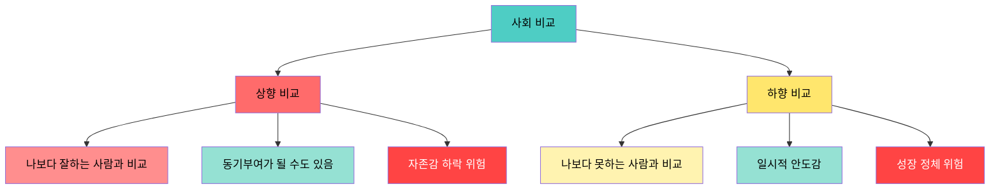
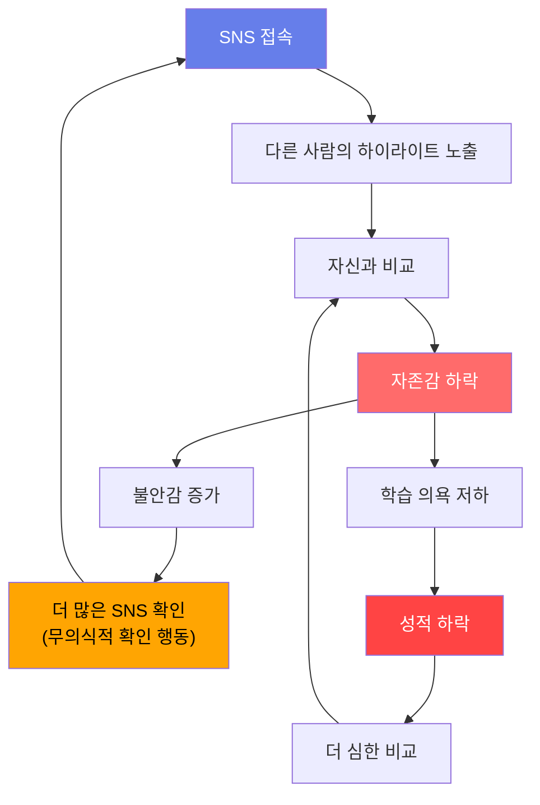
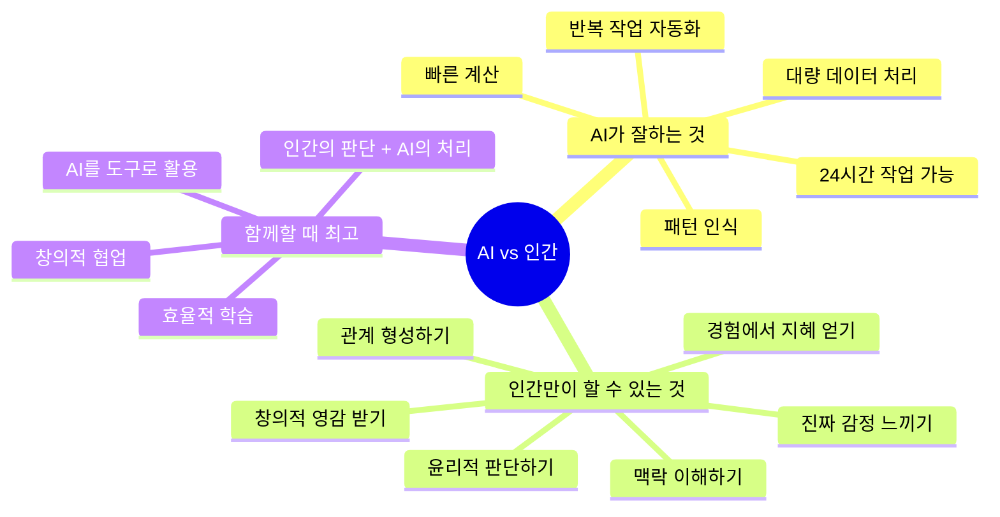
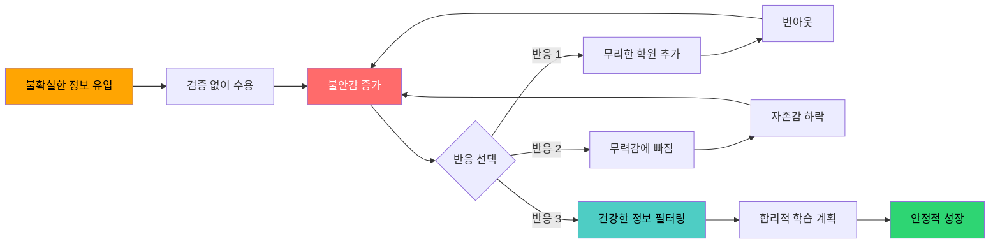
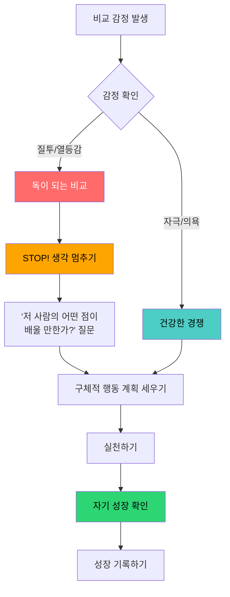

# 비교 디톡스 — SNS·AI·친구 비교에서 살아남기

> "비교는 기쁨의 도둑이다." — 시어도어 루스벨트

우리는 매일 누군가와 자신을 비교합니다. 인스타그램에서 친구의 화려한 일상을 보고, 학원에서 옆자리 친구의 시험 점수를 엿보고, AI가 몇 초 만에 풀어내는 문제를 보며 한숨을 쉽니다. 이 비교 습관은 우리의 자존감을 갉아먹고, 스트레스를 키우며, 결국 성장마저 방해합니다.

이 가이드는 **중학생 여러분**이 비교의 함정에서 벗어나 자기만의 속도로 성장할 수 있도록 도와주는 실전 워크북입니다. 7일간의 디톡스 프로그램, 자기 성찰 워크시트, 그리고 실제 사례를 통해 비교 대신 **자기 성장**에 집중하는 법을 배워봅시다.

---

## 목차

1. [비교 본능의 심리학 (사회비교이론)](#1-비교-본능의-심리학)
2. [SNS 비교의 함정](#2-sns-비교의-함정)
3. [AI 시대의 새로운 비교](#3-ai-시대의-새로운-비교)
4. [친구/선배와의 성적 비교 극복법](#4-친구선배와의-성적-비교-극복법)
5. [학원가 정보전에서 오는 불안 관리](#5-학원가-정보전에서-오는-불안-관리)
6. [비교 디톡스 7일 프로그램](#6-비교-디톡스-7일-프로그램)
7. [자기만의 기준 세우기 워크시트](#7-자기만의-기준-세우기-워크시트)
8. [건강한 경쟁 vs 독이 되는 비교 구분법](#8-건강한-경쟁-vs-독이-되는-비교-구분법)
9. [부모님의 비교 발언에 대처하는 법](#9-부모님의-비교-발언에-대처하는-법)
10. [비교에서 벗어나 자기성장에 집중하는 마인드셋](#10-자기성장-마인드셋)
11. [성공한 사람들의 비교 극복 사례](#11-성공한-사람들의-비교-극복-사례)

---

## 1. 비교 본능의 심리학

### 사회비교이론이란?

1954년 심리학자 레온 페스팅거(Leon Festinger)는 **사회비교이론(Social Comparison Theory)**을 발표했습니다. 이 이론의 핵심은 간단합니다.

> 인간은 자신의 능력과 의견을 평가하기 위해 **본능적으로** 다른 사람과 비교한다.

즉, 비교는 나쁜 습관이 아니라 **인간의 기본 본능**입니다. 원시시대에는 주변 사람과 자신을 비교해서 위험을 감지하고 생존 확률을 높였습니다. 문제는 이 본능이 현대 사회에서 **과잉 작동**한다는 것입니다.

### 비교의 두 가지 방향

#### 상향 비교 (Upward Comparison)

나보다 잘하는 사람과 비교하는 것입니다. 예를 들어:

- "저 친구는 공부도 잘하고 운동도 잘하는데, 나는 왜 이럴까..."
- "인스타 속 그 인플루언서는 매일 예쁜 카페에서 공부하는데..."
- "형/누나는 전교 1등인데 나는 중간도 못 하네..."

상향 비교는 **양날의 검**입니다. 건강하게 하면 동기부여가 되지만, 과도하면 자존감이 무너집니다.

#### 하향 비교 (Downward Comparison)

나보다 못하는 사람과 비교하는 것입니다. 예를 들어:

- "그래도 나는 걔보다는 성적이 나은데..."
- "저 사람보다는 내가 더 잘 살고 있어..."

하향 비교는 **일시적인 위안**을 주지만, 진정한 성장으로 이어지지 않습니다.

### 비교 본능이 중학생에게 특히 강한 이유

| 요인 | 설명 | 영향 |
|------|------|------|
| 뇌 발달 단계 | 전두엽(판단력 담당)이 아직 발달 중 | 감정 조절이 어려워 비교에 더 크게 반응 |
| 정체성 형성기 | "나는 누구인가?"를 탐색하는 시기 | 타인과의 비교로 자기 정체성을 확인하려 함 |
| 또래 집단의 영향 | 친구 관계가 세상의 전부처럼 느껴지는 시기 | 또래와의 비교가 극대화됨 |
| 성적 중심 평가 | 숫자로 순위가 매겨지는 환경 | 객관적 비교가 강제됨 |
| 디지털 네이티브 | 태어날 때부터 SNS와 함께 성장 | 24시간 비교 환경에 노출 |

### 비교가 뇌에 미치는 영향

비교할 때 우리 뇌에서는 다음과 같은 일이 벌어집니다:

1. **편도체 활성화**: 위협을 감지하는 뇌 부위가 반응하여 스트레스 호르몬(코르티솔) 분비
2. **도파민 시스템 교란**: 자신의 성취보다 타인과의 상대적 위치에서 보상을 찾게 됨
3. **전두엽 기능 저하**: 스트레스로 인해 합리적 판단 능력이 일시적으로 떨어짐
4. **해마 영향**: 만성적 비교 스트레스는 기억력과 학습 능력에도 영향

---

## 2. SNS 비교의 함정

### 인스타그램 vs 현실

우리가 SNS에서 보는 것은 **편집된 하이라이트**입니다. 하지만 우리 뇌는 그것을 "남의 일상 전체"로 인식합니다.

| SNS에서 보이는 것 | 실제 현실 |
|-------------------|-----------|
| 예쁘게 정리된 책상 위 공부 사진 | 그 전에 30분간 치우고 각도 잡아서 찍은 것 |
| "오늘도 5시간 공부 완료!" 스토리 | 5시간 중 2시간은 핸드폰 보면서 흘려보낸 것 |
| 시험 100점 자랑 게시물 | 다른 과목에서 받은 낮은 점수는 올리지 않음 |
| 친구들과 즐겁게 놀러 간 사진 | 그 모임에서 소외감을 느낀 순간은 보이지 않음 |
| 맛있는 음식과 예쁜 카페 | 평소에는 집에서 라면 먹는 날도 많음 |
| 멋진 운동 영상 | 실패한 수십 번의 시도는 편집으로 잘림 |

### 틱톡과 학업 스트레스

틱톡의 짧은 영상은 특히 위험합니다. "공부 브이로그"나 "하루 일과" 영상은 **비현실적인 기준**을 만들어냅니다.

**틱톡에서 흔히 보이는 패턴:**

- "새벽 4시 기상 → 운동 → 공부 12시간" 루틴 영상
- "한 달 만에 전교 꼴찌에서 1등" 스토리
- "이 방법으로 공부하면 무조건 성적 오름" 꿀팁
- "중3인데 하루 14시간 공부합니다" 인증

**현실 체크:**
- 이런 영상의 대부분은 조회수를 위해 과장되었습니다
- 모든 사람에게 같은 방법이 통하지 않습니다
- 번아웃(탈진)의 위험성은 영상에 나오지 않습니다
- "성공 사례"만 알고리즘에 의해 추천되고, 실패 사례는 묻힙니다

### SNS 비교의 악순환

### SNS 사용 자가진단 체크리스트

아래 항목 중 해당되는 것에 체크해 보세요:

| 번호 | 질문 | 해당 여부 |
|------|------|-----------|
| 1 | 아침에 눈 뜨자마자 SNS를 확인한다 | O / X |
| 2 | 다른 사람의 게시물을 보고 기분이 나빠진 적이 있다 | O / X |
| 3 | 내 게시물의 좋아요 수를 자주 확인한다 | O / X |
| 4 | 친구의 스토리를 보고 "나만 놀고 있나?" 하는 생각이 든다 | O / X |
| 5 | SNS를 안 보면 불안하다 | O / X |
| 6 | 공부 인증 게시물을 보면 조바심이 난다 | O / X |
| 7 | SNS에 올리기 위해 일부러 "공부하는 척"한 적이 있다 | O / X |
| 8 | 잠자기 전 30분 이상 SNS를 본다 | O / X |
| 9 | SNS 때문에 공부에 집중하지 못한 적이 있다 | O / X |
| 10 | 팔로워나 친구 수에 신경을 많이 쓴다 | O / X |

**결과 해석:**
- **0~2개**: 건강한 SNS 사용. 현재 습관을 유지하세요.
- **3~5개**: 주의 필요. 의식적으로 SNS 사용 시간을 줄여보세요.
- **6~8개**: 경고. 비교 디톡스 프로그램 참여를 강력히 추천합니다.
- **9~10개**: 긴급. SNS 사용을 당장 줄이고, 필요하면 전문가 상담도 고려하세요.

### SNS 비교 줄이는 실전 팁 10가지

1. **알림 끄기**: 푸시 알림을 모두 끄고, 정해진 시간에만 확인하기
2. **타이머 설정**: 하루 SNS 사용 시간을 30분으로 제한하기
3. **언팔로우 정리**: 나를 불안하게 만드는 계정은 과감히 언팔로우
4. **비교 일기 쓰기**: SNS를 보고 비교한 순간을 기록하고 패턴 파악하기
5. **현실 친구와 대화**: 온라인이 아닌 오프라인에서 진짜 대화하기
6. **취미 채널 팔로우**: 공부/외모 대신 관심 있는 취미 관련 계정 팔로우
7. **게시물 올리기 전 질문**: "이걸 왜 올리는 걸까?" 스스로에게 물어보기
8. **침실에서 폰 분리**: 잠들기 1시간 전부터 폰을 다른 방에 두기
9. **SNS 없는 날 만들기**: 일주일에 하루는 SNS를 아예 안 하는 날 지정
10. **감사 게시물 작성**: 비교 대신, 오늘 감사한 것 3가지를 기록하기

---

## 3. AI 시대의 새로운 비교

### AI와 나를 비교하는 새로운 불안

ChatGPT, 클로드(Claude) 같은 AI가 등장하면서 전혀 새로운 종류의 비교가 생겨났습니다.

- "AI가 1초 만에 글을 쓰는데, 내가 작문을 배울 필요가 있을까?"
- "AI가 수학 문제를 척척 푸는데, 내가 수학을 열심히 해야 하나?"
- "AI가 코딩을 다 해주는데, 내 진로가 의미가 있을까?"
- "AI가 이렇게 잘하는데, 사람인 내가 할 수 있는 게 뭐지?"

### AI 비교 불안의 유형

| 불안 유형 | 구체적 생각 | 현실적 답변 |
|-----------|-------------|-------------|
| 존재 위협형 | "AI가 내 직업을 빼앗을 거야" | AI는 도구이지 경쟁자가 아닙니다. AI를 잘 활용하는 사람이 유리합니다 |
| 무력감형 | "AI가 다 잘하니까 내가 노력해도 소용없어" | AI는 창의성, 공감, 판단력이 없습니다. 인간만의 영역이 있습니다 |
| 자존감형 | "AI보다 못하다니 나는 쓸모없어" | AI는 수억 개의 데이터로 학습한 것입니다. 비교 대상이 아닙니다 |
| 진로 불안형 | "이 분야가 AI에 대체되면 어떡하지?" | 대체되는 것은 "직업"이 아니라 "업무의 일부"입니다 |
| 학습 회의형 | "AI한테 물어보면 되는데 왜 배워야 해?" | 질문을 잘 하려면 기본 지식이 필요합니다 |

### AI와 인간의 차이점 이해하기

### AI 시대에 중학생이 기를 역량

| 역량 | 왜 중요한가 | 어떻게 키울 수 있는가 |
|------|-------------|----------------------|
| 비판적 사고력 | AI의 결과물을 평가하고 판단할 수 있어야 함 | 뉴스 기사 팩트체크 연습, 토론 활동 참여 |
| 창의적 문제해결 | 새로운 문제를 정의하고 해결책을 구상하는 것은 인간의 몫 | 프로젝트 기반 학습, 메이커 활동 |
| 소통과 공감 | 인간관계와 협업은 AI가 대신할 수 없음 | 모둠 활동, 봉사활동, 친구와의 깊은 대화 |
| AI 리터러시 | AI를 효과적으로 활용하는 능력 | AI 도구를 직접 사용해보며 한계와 가능성 파악 |
| 적응력 | 빠르게 변하는 세상에서 유연하게 대응하는 능력 | 새로운 것에 도전하기, 실패를 두려워하지 않기 |
| 자기 주도 학습 | 스스로 학습 목표를 세우고 실행하는 힘 | 학습 계획 세우기, 자기 평가 습관 기르기 |

### AI와 건강하게 공존하기 위한 마인드셋

**기억해야 할 3가지:**

1. **AI는 경쟁자가 아니라 도구이다**: 계산기가 나왔다고 수학이 사라지지 않은 것처럼, AI가 나왔다고 인간의 가치가 사라지지 않습니다.
2. **과정이 중요하다**: AI는 결과를 빠르게 내지만, 인간은 과정에서 배우고 성장합니다. 공부의 가치는 결과물이 아니라 과정에 있습니다.
3. **AI를 활용하는 것도 능력이다**: AI에 좋은 질문을 하려면 기본 지식이 필요합니다. 공부는 AI를 더 잘 활용하기 위한 기초입니다.

---

## 4. 친구/선배와의 성적 비교 극복법

### 성적 비교가 특히 고통스러운 이유

학교 성적은 **숫자로 명확하게** 비교됩니다. 취미나 성격은 "누가 더 나은지" 판단하기 어렵지만, 시험 점수는 1점 차이로도 등수가 갈립니다. 이런 구조적 환경이 비교를 더 강화합니다.

### 성적 비교의 인지적 왜곡 패턴

우리가 성적을 비교할 때 흔히 빠지는 **생각의 함정**이 있습니다:

| 왜곡 패턴 | 예시 생각 | 현실적 반론 |
|-----------|-----------|-------------|
| 흑백 논리 | "1등 아니면 실패야" | 노력의 과정과 성장 폭이 더 중요할 수 있다 |
| 과일반화 | "수학을 못하니 나는 공부 자체를 못해" | 한 과목의 성적이 전체 능력을 대표하지 않는다 |
| 선택적 주의 | "걔는 다 잘하는데 나는 다 못해" | 상대방의 장점만 보고, 내 장점은 무시하고 있다 |
| 독심술 | "선생님은 나를 포기했을 거야" | 실제로 물어보지 않고 추측하는 것이다 |
| 파국화 | "이번에 성적이 떨어졌으니 인생 끝이야" | 한 번의 시험이 인생 전체를 결정하지 않는다 |
| 개인화 | "내가 멍청해서 그런 거야" | 환경, 컨디션, 공부 방법 등 다양한 요인이 있다 |

### 성적 비교 극복 5단계 전략

**1단계: 인식하기**
- 자신이 비교하고 있다는 사실을 자각합니다
- "아, 지금 나는 OO와 비교하고 있구나"라고 스스로에게 말합니다

**2단계: 멈추기**
- 비교 생각이 들면 잠시 멈추고 심호흡을 3번 합니다
- 비교 생각에 "STOP"이라는 라벨을 붙입니다

**3단계: 리프레이밍(관점 바꾸기)**
- "저 친구보다 못해" → "저 친구에게 배울 점이 있네"
- "나는 왜 이렇게 못하지?" → "지난달보다 얼마나 늘었지?"
- "다들 나보다 잘하는 것 같아" → "각자 잘하는 영역이 다르구나"

**4단계: 자기 기준 세우기**
- 남의 점수가 아니라 자신의 목표 점수를 기준으로 삼습니다
- "전교 몇 등"이 아니라 "지난번보다 몇 점 올리기"를 목표로 합니다

**5단계: 실행하기**
- 비교 에너지를 실제 공부 행동으로 전환합니다
- 구체적인 학습 계획을 세우고 실천합니다

### 나만의 성장 곡선 그리기

남과 비교하는 대신, **과거의 나**와 비교하세요. 아래 표를 채워보세요:

| 과목 | 지난 학기 점수 | 이번 학기 점수 | 성장 폭 | 잘한 점 | 개선할 점 |
|------|---------------|---------------|---------|---------|-----------|
| 국어 | | | | | |
| 수학 | | | | | |
| 영어 | | | | | |
| 사회 | | | | | |
| 과학 | | | | | |
| 기타 | | | | | |

---

## 5. 학원가 정보전에서 오는 불안 관리

### 학원가 정보 불안의 실체

한국 교육 환경에서 학원가 정보전은 독특한 스트레스 원인입니다. 부모님들 사이, 혹은 친구들 사이에서 다음과 같은 정보가 오갑니다:

- "OO학원에서는 벌써 고등학교 수학을 한대"
- "저 아이는 학원을 5개나 다닌대"
- "특목고 가려면 지금부터 OO 준비해야 한대"
- "영어 원어민 과외를 안 시키면 뒤처진대"
- "그 학원 1등반에 들어가야 진짜 잘하는 거래"

### 정보 불안의 메커니즘

### 학원가 정보를 건강하게 걸러내는 법

| 구분 | 유용한 정보 | 불안만 키우는 정보 |
|------|-------------|-------------------|
| 특징 | 구체적이고 검증 가능함 | 막연하고 출처가 불분명함 |
| 예시 | "이 교재가 개념 정리에 좋다" | "다들 벌써 고등 수학 한대" |
| 감정 반응 | "참고해볼까" 하는 차분한 느낌 | "나만 뒤처지는 것 같아" 하는 조급함 |
| 행동 결과 | 자신에게 맞는지 판단 후 선택 | 남들을 따라하려고 무리하게 추가 |
| 대처법 | 메모해두고 선생님이나 부모님과 상의 | "정말?" 하고 팩트체크한 후 걸러내기 |

### 학원 스트레스 관리 워크시트

현재 자신의 학원/과외 상황을 점검해 보세요:

| 학원/과외 | 주당 시간 | 내가 원해서 다니는가? | 실제 도움이 되는가? | 스트레스 수준 (1-5) | 유지/조정/중단 |
|-----------|-----------|---------------------|--------------------|--------------------|----------------|
| | | 예 / 아니오 | 예 / 아니오 | | |
| | | 예 / 아니오 | 예 / 아니오 | | |
| | | 예 / 아니오 | 예 / 아니오 | | |
| | | 예 / 아니오 | 예 / 아니오 | | |
| | | 예 / 아니오 | 예 / 아니오 | | |

**점검 포인트:**
- 주당 총 학원 시간이 20시간을 넘으면 과부하일 수 있습니다
- "내가 원해서"가 하나도 없다면 부모님과 대화가 필요합니다
- 스트레스 수준이 4-5인 학원은 효과를 재점검해야 합니다
- 하고 싶은 활동(운동, 취미 등)을 위한 시간이 남아있는지 확인하세요

### 정보 불안 대처 실전 대화법

**친구가 "너 OO 학원 안 다녀?"라고 물을 때:**
- 나쁜 반응: "진짜? 나도 다녀야 하나?" (불안에 휩쓸림)
- 좋은 반응: "아, 거기 좋아? 나는 지금 OO 방법으로 공부하고 있는데 괜찮더라" (자기 기준 유지)

**부모님이 "OO네 아이는 학원을 더 다닌대"라고 하실 때:**
- 나쁜 반응: 아무 말 없이 속으로 스트레스 받기
- 좋은 반응: "저도 걱정되긴 하는데, 지금 학원 시간표를 같이 한번 봐주세요. 제가 더 효율적으로 할 수 있는 방법을 찾고 싶어요"

---

## 6. 비교 디톡스 7일 프로그램

### 프로그램 개요

7일간 매일 하나의 미션을 수행하며 비교 습관을 조금씩 줄여나가는 프로그램입니다. 큰 변화가 아니라 **작은 실천**을 반복하는 것이 핵심입니다.

### 7일 일정표

| 날짜 | 테마 | 오전 미션 | 오후 미션 | 저녁 미션 | 소요 시간 |
|------|------|----------|----------|----------|-----------|
| Day 1 | 인식의 날 | 비교 생각 발생 시마다 손목에 체크 | 비교 일기 작성 (3건 이상) | SNS 사용 시간 기록 | 30분 |
| Day 2 | 감사의 날 | 아침에 감사한 것 3가지 쓰기 | 친구에게 진심으로 칭찬 1번 하기 | 오늘 내가 잘한 것 3가지 쓰기 | 20분 |
| Day 3 | 디지털 단식 | SNS 앱 알림 모두 끄기 | SNS 사용 시간 1시간 이내로 제한 | 폰 없이 산책 30분 | 40분 |
| Day 4 | 자기 발견의 날 | 나의 강점 5가지 쓰기 | 좋아하는 것/잘하는 것 목록 작성 | 5년 후의 나에게 편지 쓰기 | 40분 |
| Day 5 | 관계 회복의 날 | 비교 대상이었던 친구에게 진심으로 말 걸기 | 부모님에게 감정 솔직히 이야기하기 | 나를 응원하는 사람 목록 만들기 | 30분 |
| Day 6 | 성장 확인의 날 | 1년 전의 나 vs 지금의 나 비교 | 성장 그래프 그리기 | 다음 달 성장 목표 1개 설정 | 30분 |
| Day 7 | 다짐의 날 | 비교 디톡스 7일 돌아보기 | 나만의 비교 디톡스 규칙 3개 만들기 | 자기 선언문 작성 | 30분 |

### Day 1: 인식의 날 - 상세 가이드

**오전 미션: 비교 카운트**

손목에 밴드를 차거나, 노트를 가지고 다니면서 비교 생각이 떠오를 때마다 기록하세요.

기록 형식:

| 시간 | 비교 대상 | 비교 내용 | 감정 (1-10) | 상황 |
|------|-----------|-----------|-------------|------|
| 08:30 | 같은 반 민수 | 민수는 영어를 너무 잘해 | 7 (부러움) | 영어 수업 시간 |
| 10:00 | 인스타 친구 | 저 애는 맨날 놀러 다녀 | 5 (질투) | 쉬는 시간에 SNS |
| | | | | |
| | | | | |
| | | | | |

**오후 미션: 비교 일기**

기록한 비교 내용을 바탕으로 일기를 쓰세요:

1. 오늘 가장 강하게 비교한 순간은?
2. 그때 내 감정은 어땠는가?
3. 비교가 나에게 도움이 되었는가, 해가 되었는가?
4. 비교하지 않았다면 그 시간에 무엇을 했을까?

**저녁 미션: SNS 시간 기록**

스마트폰의 "스크린 타임" 기능을 확인하고 기록하세요:

| 앱 이름 | 사용 시간 | 비교를 느낀 횟수 |
|---------|-----------|-----------------|
| 인스타그램 | | |
| 틱톡 | | |
| 유튜브 | | |
| 카카오톡 | | |
| 기타 | | |
| **합계** | | |

### Day 2: 감사의 날 - 상세 가이드

**감사 일기 템플릿:**

| 번호 | 감사한 것 | 왜 감사한가? |
|------|-----------|-------------|
| 1 | | |
| 2 | | |
| 3 | | |

**칭찬 미션:**
- 비교 대상이었던 친구에게 진심으로 칭찬을 해보세요
- "너 OO 진짜 잘하더라, 부럽다"가 아니라
- "너 OO 잘하는 거 진짜 대단해, 어떻게 연습해?"로 바꿔보세요

**오늘 내가 잘한 것:**

| 번호 | 잘한 것 | 구체적으로 어떤 점이 잘했는가? |
|------|---------|-------------------------------|
| 1 | | |
| 2 | | |
| 3 | | |

### Day 3: 디지털 단식 - 상세 가이드

**SNS 알림 끄기 체크리스트:**

| 앱 | 알림 끄기 완료 | 예외 설정 (꼭 필요한 알림만) |
|-----|---------------|---------------------------|
| 인스타그램 | O / X | |
| 틱톡 | O / X | |
| 유튜브 | O / X | |
| 트위터(X) | O / X | |
| 카카오톡 | O / X | 가족/친한 친구만 알림 유지 |

**폰 없이 산책 중 해볼 것:**
- 하늘 색깔 관찰하기
- 지나가는 사람들의 표정 관찰하기
- 주변 소리에 집중하기 (새소리, 바람 소리)
- 걸으면서 오늘 있었던 좋은 일 떠올리기
- 미래의 나에게 해주고 싶은 말 생각하기

### Day 4: 자기 발견의 날 - 상세 가이드

**나의 강점 찾기 워크시트:**

| 영역 | 나의 강점 | 구체적 증거 |
|------|-----------|-------------|
| 학습 | (예: 이해력이 좋다) | (예: 한 번 설명 들으면 바로 이해함) |
| 성격 | (예: 배려심이 깊다) | (예: 친구가 힘들 때 먼저 다가감) |
| 취미/특기 | (예: 그림을 잘 그린다) | (예: 친구들이 그림 그려달라고 부탁함) |
| 대인관계 | (예: 유머가 있다) | (예: 친구들이 나와 있으면 재밌다고 함) |
| 기타 | | |

### Day 5~7: 요약

**Day 5 (관계 회복의 날)**: 비교 때문에 멀어졌던 관계를 회복하고, 나를 지지해주는 사람들을 확인합니다.

**Day 6 (성장 확인의 날)**: 1년 전의 나와 비교하며 성장을 확인하고, 미래 목표를 세웁니다.

**Day 7 (다짐의 날)**: 7일간의 경험을 정리하고, 앞으로 비교 습관을 관리할 나만의 규칙을 만듭니다.

### 7일 프로그램 진행 체크리스트

| 날짜 | 오전 미션 | 오후 미션 | 저녁 미션 | 오늘의 한 줄 소감 |
|------|----------|----------|----------|-------------------|
| Day 1 | O / X | O / X | O / X | |
| Day 2 | O / X | O / X | O / X | |
| Day 3 | O / X | O / X | O / X | |
| Day 4 | O / X | O / X | O / X | |
| Day 5 | O / X | O / X | O / X | |
| Day 6 | O / X | O / X | O / X | |
| Day 7 | O / X | O / X | O / X | |

---

## 7. 자기만의 기준 세우기 워크시트

### 왜 자기 기준이 필요한가?

남의 기준으로 살면 영원히 만족할 수 없습니다. 1등을 해도 전국 1등이 있고, 전국 1등을 해도 세계 1등이 있습니다. 비교의 끝은 없습니다.

**자기 기준**이 있는 사람은:
- 남과 비교하지 않아도 자기 성장을 확인할 수 있습니다
- 흔들리지 않는 내면의 안정감을 가집니다
- 실패해도 빠르게 회복합니다
- 진정한 만족감과 성취감을 경험합니다

### 워크시트 1: 나의 가치관 탐색

아래 가치 중에서 **가장 중요한 5가지**를 골라보세요:

| 가치 | 선택 | 가치 | 선택 |
|------|------|------|------|
| 정직 | O / X | 창의성 | O / X |
| 성실 | O / X | 자유 | O / X |
| 배려 | O / X | 도전 | O / X |
| 책임감 | O / X | 재미 | O / X |
| 용기 | O / X | 지식 | O / X |
| 끈기 | O / X | 우정 | O / X |
| 겸손 | O / X | 건강 | O / X |
| 감사 | O / X | 성장 | O / X |

**내가 선택한 TOP 5 가치:**

| 순위 | 가치 | 이 가치가 중요한 이유 |
|------|------|----------------------|
| 1위 | | |
| 2위 | | |
| 3위 | | |
| 4위 | | |
| 5위 | | |

### 워크시트 2: 나만의 성공 기준 만들기

남의 기준이 아닌, 나만의 성공 기준을 정의해 보세요:

| 영역 | 남의 기준 (지금까지) | 나의 기준 (앞으로) |
|------|--------------------|--------------------|
| 학업 | 예) 전교 10등 안에 들기 | 예) 지난 시험보다 평균 5점 올리기 |
| 관계 | 예) 인기 많은 학생 되기 | 예) 진짜 속마음을 나눌 친구 3명 만들기 |
| 취미 | 예) SNS에 올릴 만한 멋진 취미 갖기 | 예) 순수하게 즐길 수 있는 활동 1개 찾기 |
| 외모 | 예) 인플루언서처럼 꾸미기 | 예) 건강하고 깨끗한 모습 유지하기 |
| 진로 | 예) 남들이 부러워하는 직업 갖기 | 예) 내가 좋아하는 일을 찾아가기 |
| 생활 습관 | 예) 다른 애들처럼 새벽까지 공부하기 | 예) 하루 계획한 분량 꾸준히 끝내기 |

### 워크시트 3: 월간 자기 성장 점검표

매달 마지막 날, 아래 표를 채우며 자기 성장을 점검하세요:

| 점검 항목 | 이번 달 성과 | 점수 (1-10) | 다음 달 목표 |
|-----------|-------------|-------------|-------------|
| 학습: 이번 달 가장 성장한 과목 | | | |
| 관계: 이번 달 새로 알게 된 것 | | | |
| 건강: 운동/수면/식습관 | | | |
| 취미: 즐거웠던 활동 | | | |
| 마인드: 비교 습관 관리 | | | |
| 기타: 자유 기록 | | | |

### 워크시트 4: 비교 리다이렉팅 연습

비교 생각이 떠오를 때, 아래처럼 방향을 전환하는 연습을 해보세요:

| 비교 생각 (원래) | 리다이렉팅 (전환) |
|-----------------|-------------------|
| "걔는 수학을 너무 잘해" | "나도 수학 실력을 키울 수 있어. 이번 주에 문제집 1장 더 풀어보자" |
| "쟤는 친구가 많아서 좋겠다" | "나에게도 소중한 친구가 있어. 이번 주에 그 친구와 깊은 이야기를 나눠보자" |
| "인스타에서 보니 다들 잘 사네" | "SNS는 하이라이트일 뿐이야. 내 오늘 하루에서 좋았던 순간을 떠올려보자" |
| "AI가 다 해주는데 내가 왜 공부해" | "AI를 잘 활용하려면 기본기가 필요해. 오늘 배운 것이 나중에 도움될 거야" |
| (나의 비교 생각을 적어보세요) | (전환된 생각을 적어보세요) |
| | |
| | |

---

## 8. 건강한 경쟁 vs 독이 되는 비교 구분법

### 핵심 차이

건강한 경쟁과 독이 되는 비교는 **겉보기에는 비슷**해 보이지만, 내면에서 작동하는 방식이 완전히 다릅니다.

| 구분 | 건강한 경쟁 | 독이 되는 비교 |
|------|------------|---------------|
| **출발점** | "나도 저렇게 되고 싶다" (동기부여) | "나는 왜 저렇게 못하지" (자기비하) |
| **초점** | 상대방의 방법과 과정 | 상대방의 결과와 나의 부족함 |
| **감정** | 존경, 자극, 의욕 | 질투, 열등감, 무력감 |
| **행동** | 구체적인 노력과 실천 | 자기 비난 또는 포기 |
| **결과** | 자기 성장 | 자존감 하락 |
| **태도** | "저 사람도 노력했겠지" | "쟤는 타고났으니까" |
| **대상과의 관계** | 서로 자극하며 함께 성장 | 멀어지거나 적대적으로 변함 |
| **지속성** | 동기가 꾸준히 유지됨 | 금방 지치고 포기함 |
| **자기 인식** | 나의 성장에 집중 | 남과의 격차에 집중 |
| **목표** | 어제의 나보다 나은 오늘의 나 | 상대보다 앞서는 것 |

### 비교 vs 경쟁 자가 진단

아래 상황에서 자신의 반응을 체크해 보세요:

| 상황 | 건강한 경쟁 반응 | 독이 되는 비교 반응 | 나의 반응은? |
|------|-----------------|-------------------|-------------|
| 친구가 시험 100점을 받았을 때 | "대단하다! 나도 열심히 해야지" | "나만 못한 것 같아... 기분 나빠" | |
| SNS에서 공부 인증을 봤을 때 | "좋은 자극이 되네, 나도 공부하자" | "저렇게까지 해야 하나... 불안해" | |
| 친구가 좋은 학원에 다닌다고 했을 때 | "거기 어때? 나한테도 맞을까 알아볼까" | "나만 뒤처지는 것 같아" | |
| 선배가 좋은 고등학교에 합격했을 때 | "어떻게 준비했는지 조언 구해봐야지" | "나는 저런 데 못 갈 거야" | |
| 발표를 잘한 친구를 봤을 때 | "발표 잘하는 방법을 배워볼까" | "나는 발표 자체를 못해, 창피해" | |

### 비교를 경쟁으로 전환하는 방법

### 건강한 경쟁 실천 가이드

**1. 스터디 메이트 만들기**
- 비교 대상이 아닌 **함께 성장하는 동반자**를 찾으세요
- 서로의 성적을 비교하는 것이 아니라, 각자의 목표 달성을 응원하세요

**2. 공부 방법 공유하기**
- "너 어떻게 공부해?"라고 진심으로 물어보세요
- 서로 좋은 공부법을 나누면 함께 성장할 수 있습니다

**3. 그룹 목표 설정하기**
- 친구들과 함께 "다 같이 평균 5점 올리기" 같은 그룹 목표를 세우세요
- 경쟁이 아니라 **협력**의 에너지를 느낄 수 있습니다

**4. 실패 공유하기**
- 완벽한 모습만 보여주지 말고, 실패와 어려움도 나누세요
- "나도 이거 어려웠어"라는 말이 서로에게 위로가 됩니다

---

## 9. 부모님의 비교 발언에 대처하는 법

### 부모님은 왜 비교를 하실까?

부모님이 비교를 하시는 것은 대부분 **나쁜 의도**가 아닙니다. 하지만 그 말이 우리에게 미치는 영향은 큽니다.

| 부모님의 의도 | 실제 하시는 말 | 자녀가 듣는 메시지 |
|-------------|---------------|-------------------|
| 동기부여를 주고 싶다 | "OO는 벌써 저렇게 했대" | "나는 아직 부족하구나" |
| 걱정이 된다 | "너 이러면 뒤처져" | "나는 능력이 없구나" |
| 자랑하고 싶다 | "OO네 아들은 1등 했대" | "나는 부모님을 실망시키고 있구나" |
| 방법을 알려주고 싶다 | "OO처럼 해봐" | "나의 방식은 틀렸구나" |
| 기대가 크다 | "너도 하면 할 수 있어" | "지금의 나는 충분하지 않구나" |

### 부모님의 비교 발언 유형별 대처법

#### 유형 1: "OO네 아이는 이번에 전교 1등 했대"

**잘못된 대처:**
- 화를 내거나 말대꾸한다
- 아무 말 없이 속으로만 분하다
- "그럼 OO네 아이를 데려다 키우세요"라고 말한다

**효과적인 대처:**
- "그 친구 대단하네요. 저도 이번에는 OO 과목에서 점수를 올리려고 노력 중이에요."
- 내 노력과 목표를 구체적으로 말씀드리기

#### 유형 2: "왜 이것밖에 못하니? OO는 잘하던데"

**잘못된 대처:**
- "그만 비교 좀 해요!"라고 소리 지른다
- 울면서 방에 들어간다

**효과적인 대처:**
- (차분하게) "비교당하면 저도 속상해요. 저는 지난번보다 OO 점 올랐는데, 그 부분은 칭찬해 주시면 더 힘이 날 것 같아요."

#### 유형 3: "너는 왜 이런 것도 못하니?"

**잘못된 대처:**
- "저는 원래 멍청해요"라고 자기비하
- 완전히 포기해버린다

**효과적인 대처:**
- "어려운 부분이 있어서 고민 중이에요. 도와주실 수 있으세요?"

### 부모님과 건강하게 소통하는 대화 가이드

**대화 준비하기:**

| 단계 | 내용 | 예시 |
|------|------|------|
| 1. 타이밍 선택 | 부모님이 편안한 시간에 이야기 시작 | 저녁 식사 후, 주말 오후 |
| 2. 감정 표현 | "나" 메시지로 감정 전달 | "비교당하면 **제가** 많이 속상해져요" |
| 3. 이해 표현 | 부모님의 마음도 인정 | "걱정해주시는 거 알아요" |
| 4. 대안 제시 | 구체적인 요청하기 | "비교 대신 제 노력을 인정해 주시면 더 힘이 날 것 같아요" |
| 5. 약속하기 | 나도 노력하겠다는 의지 보이기 | "저도 이번 달 목표를 세워서 보여드릴게요" |

**대화 스크립트 예시:**

> "엄마/아빠, 저 잠깐 이야기 좀 해도 될까요?
> 
> 제가 요즘 고민이 있어서요. 다른 친구들과 비교되는 이야기를 들으면 저도 노력하고 싶은 마음보다 '나는 안 되나 보다'라는 생각이 먼저 들더라고요.
> 
> 엄마/아빠가 걱정해 주시는 거 잘 알아요. 저도 더 잘하고 싶어요.
> 
> 그런데 비교 대신 '이번에 이 부분은 잘했네' 이런 말씀을 해주시면, 저는 더 열심히 하고 싶어질 것 같아요.
> 
> 저도 이번 달에 OO 목표를 세워볼게요. 같이 응원해 주세요."

### 부모님의 비교 발언 대응 훈련표

실제 상황에서 연습해볼 수 있도록 채워보세요:

| 부모님의 말 | 내 감정 | 하고 싶은 말 (솔직) | 효과적인 대응 |
|------------|---------|---------------------|--------------|
| | | | |
| | | | |
| | | | |
| | | | |

---

## 10. 자기성장 마인드셋

### 고정 마인드셋 vs 성장 마인드셋

심리학자 캐롤 드웩(Carol Dweck)의 연구에 따르면, 마인드셋은 두 가지로 나뉩니다:

| 구분 | 고정 마인드셋 | 성장 마인드셋 |
|------|-------------|-------------|
| 능력에 대한 믿음 | "능력은 타고나는 것" | "능력은 노력으로 키울 수 있는 것" |
| 도전에 대한 태도 | 실패가 두려워 도전을 피함 | 도전을 성장의 기회로 봄 |
| 노력에 대한 생각 | "노력해야 하면 재능이 없는 거야" | "노력은 성장의 열쇠야" |
| 실패에 대한 반응 | "나는 안 돼" | "아직 못할 뿐이야, 더 배우면 돼" |
| 비교에 대한 태도 | 남보다 못하면 자존감이 무너짐 | 남의 성공에서 배울 점을 찾음 |
| 비판에 대한 반응 | 방어적이거나 무시함 | 건설적 피드백으로 받아들임 |
| 남의 성공 | 위협으로 느낌 | 영감으로 느낌 |

### 성장 마인드셋 훈련 방법

**1. "아직" 붙이기 연습**

| 고정 마인드셋 말 | 성장 마인드셋 전환 |
|-----------------|-------------------|
| "나는 수학을 못해" | "나는 수학을 **아직** 잘 못해" |
| "나는 발표를 못해" | "나는 발표를 **아직** 잘 못하지만 연습할 수 있어" |
| "나는 글을 못 써" | "나는 글을 **아직** 잘 못 쓰지만 쓸수록 나아질 거야" |
| "나는 이런 거 안 돼" | "나는 이런 거 **아직** 잘 안 되지만 방법을 찾을 수 있어" |

**2. 과정 칭찬 연습**

자신에게 결과가 아닌 **과정**을 칭찬해 보세요:

| 상황 | 결과 중심 (피하기) | 과정 중심 (연습하기) |
|------|-------------------|---------------------|
| 시험에서 좋은 점수를 받았을 때 | "역시 나는 똑똑해" | "열심히 준비한 보람이 있네" |
| 시험에서 낮은 점수를 받았을 때 | "나는 바보야" | "이번에 부족했던 부분을 다음에 보완하면 돼" |
| 새로운 것을 배울 때 | "이거 금방 하면 재능있는 거야" | "처음이라 어렵지만 계속 하면 나아질 거야" |
| 실수를 했을 때 | "나는 항상 실수해" | "이 실수에서 배울 수 있는 게 있어" |

### 자기 성장 일일 점검표

매일 저녁, 아래 질문에 답해보세요:

| 질문 | 오늘의 답변 |
|------|-------------|
| 오늘 새로 배운 것은? | |
| 오늘 실수에서 얻은 교훈은? | |
| 오늘 나에게 칭찬할 점은? | |
| 내일 시도해볼 것은? | |
| 오늘 비교 대신 집중한 것은? | |

### 비교에서 벗어나기 위한 5가지 핵심 마인드셋

**마인드셋 1: 인생은 마라톤이다**
- 중학교 성적이 인생 전체를 결정하지 않습니다
- 지금 1등인 친구가 평생 1등인 것은 아닙니다
- 각자의 페이스로 달리는 것이 가장 중요합니다

**마인드셋 2: 나는 유일한 존재다**
- 세상에 나와 똑같은 사람은 없습니다
- 비교는 사과와 오렌지를 비교하는 것과 같습니다
- 나만의 강점과 가능성에 집중하세요

**마인드셋 3: 실패는 데이터다**
- 실패는 끝이 아니라 데이터입니다
- "이 방법은 안 되는구나"를 알게 되었으니 성공에 한 걸음 더 가까워진 것입니다

**마인드셋 4: 과정이 결과를 만든다**
- 좋은 결과는 좋은 과정의 자연스러운 결과입니다
- 결과에 집착하면 과정을 즐기지 못합니다
- 오늘의 노력이 내일의 나를 만듭니다

**마인드셋 5: 감사는 비교의 해독제다**
- 비교 생각이 들 때 감사할 것을 떠올리세요
- "내가 가진 것"에 집중하면 "남이 가진 것"이 덜 보입니다

### 마인드셋 전환 주간 훈련표

| 요일 | 훈련 내용 | 체크 |
|------|----------|------|
| 월요일 | 아침에 "오늘의 성장 목표" 1개 세우기 | O / X |
| 화요일 | 비교 생각이 들 때 "아직" 붙이기 3번 연습 | O / X |
| 수요일 | 실패를 "데이터"로 기록하기 | O / X |
| 목요일 | 과정 칭찬 일기 쓰기 | O / X |
| 금요일 | 감사한 것 5가지 적기 | O / X |
| 토요일 | 자기 성장 그래프 그리기 | O / X |
| 일요일 | 일주일 돌아보기 + 다음 주 계획 | O / X |

---

## 11. 성공한 사람들의 비교 극복 사례

### 사례 1: 방탄소년단 (BTS) - "남과 비교하지 말고, 어제의 나와 비교하라"

BTS의 리더 RM은 여러 인터뷰에서 비교에 대한 이야기를 했습니다. 데뷔 초기 BTS는 3대 기획사 출신이 아니라는 이유로 무시를 많이 받았습니다.

| 시기 | 상황 | 대응 |
|------|------|------|
| 데뷔 전 | 대형 기획사 연습생들과 비교당함 | "우리만의 음악을 하자"라는 방향 설정 |
| 데뷔 초기 | "어차피 중소 기획사"라는 편견 | 팬들과의 소통에 집중, SNS 적극 활용 |
| 성장기 | 다른 아이돌과 음원 차트 경쟁 | 자신들의 메시지와 음악성에 집중 |
| 세계적 성공 후 | "어떻게 유지하지?"라는 압박 | 각 멤버가 자기 성장에 집중 |

**배울 점**: 비교 대신 "자기만의 길"을 만든 것이 성공의 핵심이었습니다.

### 사례 2: 손흥민 - "느린 출발, 꾸준한 성장"

손흥민 선수는 어린 시절 동네에서 가장 잘하는 축구 선수가 아니었습니다. 하지만 아버지 손웅정 감독의 지도 아래 **기본기**에 집중하며 꾸준히 성장했습니다.

| 시기 | 비교 상황 | 극복 방법 |
|------|----------|-----------|
| 유소년 시절 | 또래 중 체격이 작았음 | 기술과 스피드에 집중 |
| 독일 리그 시절 | 유럽 선수들의 피지컬에 압도당함 | 부단한 체력 훈련과 기본기 연마 |
| 프리미어리그 초기 | 팀 내 경쟁에서 주전 자리 불안 | 매 경기 최선을 다하는 태도 유지 |
| 아시안컵 실패 후 | "국대 에이스로서 부족하다"는 비난 | 좌절 대신 다음 목표에 집중 |

**배울 점**: 남과의 비교 대신 "어제의 나보다 나은 오늘의 나"에 집중한 것이 프리미어리그 최고의 선수로 이끌었습니다.

### 사례 3: 아인슈타인 - "물고기에게 나무 오르기를 기대하지 마라"

아인슈타인은 학교에서 "느린 학생"으로 평가받았습니다. 말을 늦게 배웠고, 학교 수업을 따라가기 어려워했습니다.

| 학교의 평가 | 실제 아인슈타인 |
|------------|----------------|
| 수업을 잘 따라가지 못함 | 자기만의 방식으로 깊이 사고함 |
| 반항적이고 질문이 많음 | 호기심이 강하고 비판적 사고를 함 |
| 성적이 좋지 않은 과목이 많음 | 관심 있는 분야에서는 천재적 능력 발휘 |
| 또래와 잘 어울리지 못함 | 독립적으로 사고하는 능력이 뛰어남 |

**배울 점**: 학교의 단일한 기준으로 모든 사람을 평가할 수 없습니다. 자기만의 강점을 발견하는 것이 중요합니다.

### 사례 4: 김연아 - "완벽을 추구하되, 남과 비교하지 않는다"

김연아 선수는 세계 최고의 피겨 스케이터였지만, 항상 "자신만의 기준"으로 스스로를 평가했습니다.

| 김연아의 원칙 | 적용 방법 |
|-------------|-----------|
| 경쟁자가 아닌 자기 자신에 집중 | 다른 선수의 점수보다 자신의 연기 완성도에 주목 |
| 결과보다 과정 중시 | 메달보다 연습 과정에서의 성장을 중요시 |
| 실패를 학습의 기회로 | 넘어져도 다시 일어나 연습하는 태도 |
| 은퇴 후에도 성장 추구 | 현역 은퇴 후에도 새로운 분야에 도전 |

**배울 점**: 세계 1등도 "남과의 비교"가 아닌 "자기 성장"에 집중했다는 것이 핵심입니다.

### 사례 5: J.K. 롤링 - "실패 후 다시 일어서다"

해리포터의 작가 J.K. 롤링은 성공 전 극심한 실패를 경험했습니다.

| 실패 경험 | 비교 유혹 | 극복 방법 |
|-----------|----------|-----------|
| 이혼과 경제적 어려움 | "같은 나이의 다른 사람들은 잘 사는데" | 자신의 이야기에 집중하며 글쓰기 계속 |
| 출판사 12곳에서 거절 | "다른 작가들은 바로 출판되는데" | 포기하지 않고 13번째 출판사에 원고 제출 |
| 초기 저평가 | "아동 문학은 하찮다는 시선" | 자신이 쓰고 싶은 이야기에 집중 |

**배울 점**: 12번의 거절을 받으면서도 남과 비교하지 않고 자신의 이야기에 집중한 결과, 세계에서 가장 사랑받는 소설이 탄생했습니다.

### 사례에서 배우는 공통 교훈

| 교훈 | 설명 | 나에게 적용하기 |
|------|------|----------------|
| 자기 기준을 가지라 | 남의 기준이 아닌 나만의 성공 기준 만들기 | 이번 달 나만의 목표 1개 세우기 |
| 과정에 집중하라 | 결과보다 과정에서의 배움과 성장 중시 | 매일 "오늘 배운 것" 1가지 기록하기 |
| 실패를 두려워하지 마라 | 실패는 성장의 데이터 | 실패했을 때 "무엇을 배웠는가?" 자문하기 |
| 자기만의 속도를 존중하라 | 느리더라도 꾸준히 나아가는 것이 중요 | 남의 속도에 흔들리지 않기 |
| 비교 대신 배움을 선택하라 | 질투 대신 "어떻게 했는지" 배우기 | 부러운 사람에게 조언 구해보기 |

---

## 마무리: 비교 디톡스 선언문

아래 선언문을 읽고, 자신만의 버전으로 고쳐 써보세요:

---

**나의 비교 디톡스 선언문**

나는 오늘부터 남과의 비교 대신 **나 자신의 성장**에 집중합니다.

나는 SNS의 하이라이트와 나의 일상을 비교하지 않겠습니다.

나는 AI를 경쟁자가 아닌 **도구**로 활용하겠습니다.

나는 친구의 성공을 **위협**이 아닌 **영감**으로 받아들이겠습니다.

나는 부모님의 기대를 이해하되, **나만의 기준**으로 성장하겠습니다.

나는 실패를 **끝**이 아닌 **데이터**로 보겠습니다.

나는 "아직 못하는 것"이 있지만, **배울 수 있다**고 믿습니다.

나는 어제의 나보다 **오늘 조금 더 나은 사람**이 되겠습니다.

**서명:** _______________

**날짜:** _______________

---

## 추가 자료

### 추천 도서

| 도서명 | 저자 | 핵심 메시지 |
|--------|------|-------------|
| 마인드셋 | 캐롤 드웩 | 성장 마인드셋의 힘 |
| 아몬드 | 손원평 | 다름을 인정하는 용기 |
| 나미야 잡화점의 기적 | 히가시노 게이고 | 각자의 속도로 성장하는 이야기 |
| 하마터면 열심히 살 뻔했다 | 하완 | 남의 기준이 아닌 나의 기준으로 사는 법 |
| 미움받을 용기 | 기시미 이치로 | 타인의 평가에 얽매이지 않는 삶 |

### 도움 받을 수 있는 곳

| 기관 | 연락처 | 제공 서비스 |
|------|--------|-------------|
| 청소년 상담 전화 | 1388 (24시간) | 심리 상담, 위기 개입 |
| 정신건강 위기 상담 전화 | 1577-0199 | 정신건강 상담 |
| 학교 상담실 | 담임선생님에게 문의 | 학교 내 상담 |
| Wee센터 | 교육청 홈페이지 확인 | 학습, 진로, 심리 상담 |

---

> 비교는 본능이지만, **비교에 휘둘리지 않는 것은 선택**입니다. 오늘부터 그 선택을 시작하세요.
