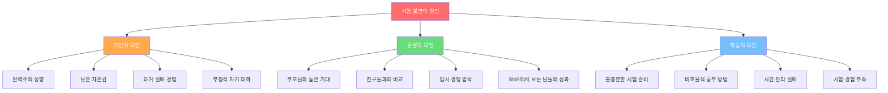
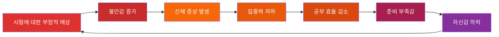
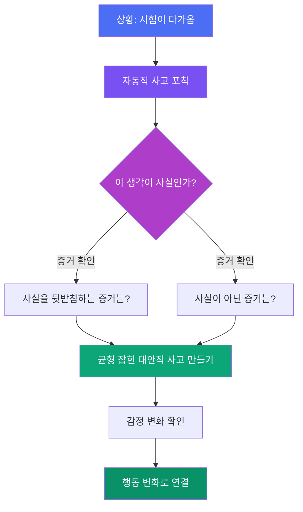
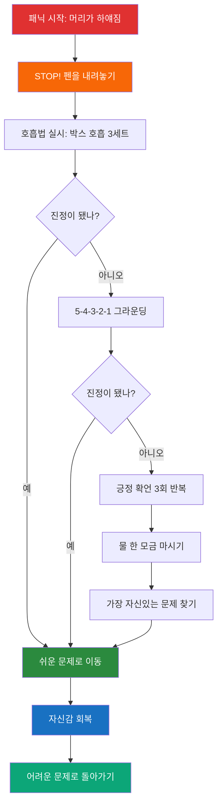

# 시험 불안 극복 실전 매뉴얼

> "긴장되는 건 당연해. 중요한 건, 그 긴장을 내 편으로 만드는 거야."

시험을 앞두고 불안한 마음이 드는 건 누구에게나 자연스러운 일이야. 하지만 그 불안이 너무 커져서 공부도, 시험도 제대로 못 하게 된다면 분명히 도움이 필요한 순간이야. 이 가이드는 시험 불안을 이해하고, 스스로 다스리는 실전 방법을 담았어. 천천히 읽으면서 나에게 맞는 방법을 찾아보자.

---

## 목차

1. 시험 불안이란?
2. 시험 불안 자가진단
3. 불안의 신체적·심리적·행동적 증상
4. 인지행동 기법 (부정적 생각 전환법)
5. 호흡법·이완법 실전 가이드
6. 시험 전날 불안 관리 루틴
7. 시험 당일 불안 관리 전략
8. 시험 중 패닉 대처법
9. 시험 후 불안 관리
10. 면접 불안 특별 가이드
11. 루틴화할 수 있는 마인드셋 훈련 5가지
12. 불안을 에너지로 전환하는 기술

---

## 1. 시험 불안이란?

### 정상적 긴장 vs 병적 불안

시험 전에 약간 긴장하는 건 사실 좋은 신호야. 적당한 긴장감은 집중력을 높이고, 더 열심히 준비하게 만드는 원동력이 되거든. 문제는 그 긴장이 "적당한 수준"을 넘어서 일상생활까지 방해할 때야.

| 구분 | 정상적 긴장 (건강한 불안) | 병적 불안 (시험 불안 장애) |
|------|--------------------------|--------------------------|
| 강도 | 약간 조마조마한 느낌 | 극심한 공포, 두려움 |
| 지속 시간 | 시험 직전 며칠 | 몇 주~몇 달 지속 |
| 수면 영향 | 전날 약간 잠들기 어려움 | 며칠째 불면, 악몽 |
| 공부 영향 | 오히려 집중력 향상 | 집중 불가, 머리 하얘짐 |
| 신체 반응 | 가벼운 심장 두근거림 | 손 떨림, 복통, 구토 |
| 시험 중 | 적절한 긴장감으로 실력 발휘 | 아는 것도 기억 안 남 |
| 시험 후 | 빠르게 일상 회복 | 지속적 자책, 우울 |
| 자기 인식 | "긴장되지만 할 수 있어" | "나는 무조건 망할 거야" |

### 시험 불안의 원인

시험 불안은 한 가지 이유로 생기지 않아. 여러 요인이 복합적으로 작용해.

### 불안의 악순환 구조

불안은 한 번 시작되면 스스로 커지는 특성이 있어. 이 악순환을 이해하면 어디서 끊어야 할지 알 수 있어.

---

## 2. 시험 불안 자가진단

아래 15개 문항을 읽고, 각 항목에 대해 자신의 상태를 솔직하게 체크해봐. 최근 한 달 동안의 경험을 기준으로 답해줘.

### 자가진단 척도

| 번호 | 문항 | 전혀 아니다 (0점) | 가끔 그렇다 (1점) | 자주 그렇다 (2점) | 항상 그렇다 (3점) |
|------|------|:-:|:-:|:-:|:-:|
| 1 | 시험 날짜가 다가오면 잠이 잘 오지 않는다 | 0 | 1 | 2 | 3 |
| 2 | 시험 공부를 시작하려고 하면 갑자기 다른 일이 하고 싶어진다 | 0 | 1 | 2 | 3 |
| 3 | 시험 볼 때 아는 내용도 갑자기 기억이 나지 않는다 | 0 | 1 | 2 | 3 |
| 4 | 시험지를 받으면 심장이 심하게 뛴다 | 0 | 1 | 2 | 3 |
| 5 | "이번에도 망하면 어쩌지"라는 생각이 반복된다 | 0 | 1 | 2 | 3 |
| 6 | 시험 기간에 배가 아프거나 머리가 아프다 | 0 | 1 | 2 | 3 |
| 7 | 다른 친구들은 다 잘할 것 같고 나만 못할 것 같다 | 0 | 1 | 2 | 3 |
| 8 | 시험 결과가 나올 때까지 불안해서 다른 일에 집중이 안 된다 | 0 | 1 | 2 | 3 |
| 9 | 시험 전에 손이 떨리거나 식은땀이 난다 | 0 | 1 | 2 | 3 |
| 10 | "차라리 아파서 시험을 못 봤으면 좋겠다"고 생각한 적이 있다 | 0 | 1 | 2 | 3 |
| 11 | 시험 공부를 해도 머리에 안 들어오는 느낌이 든다 | 0 | 1 | 2 | 3 |
| 12 | 시험 기간에는 친구 관계도 예민해진다 | 0 | 1 | 2 | 3 |
| 13 | 한 문제를 틀리면 나머지도 다 틀릴 것 같은 기분이 든다 | 0 | 1 | 2 | 3 |
| 14 | 시험 때문에 평소 즐기던 활동(게임, 운동 등)도 즐겁지 않다 | 0 | 1 | 2 | 3 |
| 15 | 시험 결과로 나의 가치가 결정된다고 느낀다 | 0 | 1 | 2 | 3 |

### 점수 해석 가이드

| 점수 범위 | 불안 수준 | 설명 | 권장 대처 |
|-----------|-----------|------|-----------|
| 0~10점 | 정상 범위 | 건강한 수준의 긴장감이야. 시험에 대한 적절한 관심을 갖고 있어. | 현재 방법 유지, 기본 호흡법 연습 |
| 11~20점 | 경미한 불안 | 약간의 시험 불안이 있어. 관리하면 충분히 극복할 수 있어. | 이완법 연습, 인지 재구성 시작 |
| 21~30점 | 중간 수준 불안 | 시험 불안이 학습에 영향을 주고 있어. 적극적인 관리가 필요해. | 체계적 불안 관리 프로그램 실천 |
| 31~40점 | 높은 불안 | 시험 불안이 심각한 수준이야. 전문가의 도움을 고려해봐. | 전문 상담 권장, 이 가이드 전체 실천 |
| 41~45점 | 매우 높은 불안 | 일상생활까지 영향을 받고 있어. 반드시 도움을 받아야 해. | 전문 상담 필수, 담임·상담 선생님 상담 |

자가진단 결과가 높게 나왔다고 해서 너무 걱정하지 마. 불안은 관리할 수 있고, 이 가이드의 방법들을 하나씩 실천하면 분명 달라질 거야.

---

## 3. 불안의 신체적·심리적·행동적 증상

시험 불안은 몸, 마음, 행동 세 가지 영역에서 나타나. 자신의 증상을 정확히 아는 것이 관리의 첫걸음이야.

### 신체적 증상

우리 몸은 불안을 느끼면 "싸울 것인가, 도망칠 것인가(Fight or Flight)" 반응을 일으켜. 이건 위험 상황에서 살아남기 위한 생존 본능인데, 시험 상황에서는 오히려 방해가 돼.

| 증상 | 발생 이유 | 느껴지는 감각 | 위험한가? |
|------|-----------|--------------|-----------|
| 심장 두근거림 | 근육에 혈액을 빨리 보내려는 반응 | 가슴이 쿵쿵거리고 숨이 참 | 아니오, 정상 반응 |
| 손발 떨림 | 근육에 에너지가 몰리는 현상 | 펜을 쥐기 어렵고 글씨가 흔들림 | 아니오, 일시적 |
| 복통·설사 | 소화기관 혈류 감소 | 배가 아프고 화장실에 자주 감 | 아니오, 스트레스성 |
| 두통 | 근육 긴장 및 혈관 수축 | 머리가 띵하고 무거움 | 아니오, 긴장성 |
| 식은땀 | 체온 조절 반응 | 손바닥·이마·등에 땀 | 아니오, 자연 반응 |
| 입 마름 | 타액 분비 감소 | 목이 마르고 입이 바짝 마름 | 아니오, 수분 보충으로 해결 |
| 호흡 곤란 | 빠른 호흡으로 과호흡 | 숨이 가쁘고 가슴이 답답 | 과호흡이면 호흡법 필요 |
| 근육 경직 | 투쟁-도피 반응의 일부 | 어깨·목·턱이 뻣뻣함 | 아니오, 이완법으로 해결 |

### 심리적 증상

| 증상 | 구체적 양상 | 예시 생각 |
|------|------------|-----------|
| 재앙화 사고 | 최악의 상황만 상상함 | "이번 시험 망하면 인생 끝이야" |
| 흑백 사고 | 중간이 없이 전부 아니면 전무 | "100점 아니면 의미없어" |
| 과일반화 | 한 번의 실패를 전체로 확대 | "수학 못 봤으니 나는 공부 체질이 아니야" |
| 독심술 | 남들의 생각을 부정적으로 추측 | "친구들이 나 바보라고 생각할 거야" |
| 자기 비하 | 자신의 능력을 극단적으로 낮게 평가 | "아무리 해도 나는 안 돼" |
| 선택적 주의 | 부정적인 면만 골라서 봄 | "93점인데 틀린 7점만 신경 써" |
| 당위적 사고 | "~해야만 한다"에 갇힘 | "반드시 1등해야 해" |
| 비교 사고 | 끊임없이 타인과 비교 | "쟤는 쉽게 하는데 나만 힘들어" |

### 행동적 증상

| 증상 | 구체적 행동 | 결과 |
|------|------------|------|
| 회피 행동 | 시험 공부를 미루거나 안 함 | 준비 부족으로 불안 악화 |
| 과도한 확인 | 같은 내용을 반복적으로 확인 | 시간 낭비, 효율 저하 |
| 안전 행동 | 부적이나 행운의 물건에 의존 | 불안의 근본 해결 안 됨 |
| 수면 장애 | 잠들기 어렵거나 새벽에 깸 | 피로 누적, 집중력 저하 |
| 식이 변화 | 폭식 또는 거식 | 건강 악화, 컨디션 저하 |
| 사회적 철수 | 친구를 피하고 혼자 있으려 함 | 외로움, 지지 체계 약화 |
| 짜증·분노 | 작은 일에도 과민 반응 | 대인관계 악화 |
| 완벽주의적 공부 | 한 부분에 과도하게 시간 투자 | 전체적 준비 불균형 |

---

## 4. 인지행동 기법 (부정적 생각 전환법)

### 인지 재구성이란?

인지 재구성은 부정적인 자동적 사고를 찾아내고, 그것이 정말 사실인지 검토한 뒤, 보다 현실적이고 균형 잡힌 생각으로 바꾸는 기술이야.

### 자주 나타나는 부정적 사고와 전환 예시

| 부정적 자동 사고 | 인지 왜곡 유형 | 전환된 균형 사고 |
|-----------------|---------------|-----------------|
| "이번 시험 망하면 인생 끝이야" | 재앙화 | "한 번의 시험이 내 인생 전체를 결정하지 않아. 다음 기회가 있어." |
| "나만 못해, 다들 잘하잖아" | 비교, 독심술 | "모든 사람은 각자의 어려움이 있어. 보이는 것이 전부가 아니야." |
| "아무리 해도 소용없어" | 과일반화 | "지금까지 노력한 것들이 있어. 조금씩 나아지고 있어." |
| "100점 아니면 의미없어" | 흑백 사고 | "완벽하지 않아도 괜찮아. 내가 아는 만큼 보여주면 돼." |
| "틀린 문제 때문에 다 망쳤어" | 선택적 주의 | "맞은 문제도 많아. 전체를 봐야 해." |
| "부모님이 실망하실 거야" | 독심술 | "부모님은 점수보다 내 건강과 행복을 더 중요하게 생각하셔." |
| "긴장되니까 분명 못 볼 거야" | 감정적 추론 | "긴장은 자연스러운 거고, 긴장한다고 실력이 사라지는 건 아니야." |
| "이 과목은 나한테 안 맞아" | 라벨링 | "어려운 과목이지만, 방법을 바꿔보면 달라질 수 있어." |

### 생각 기록지 작성법

불안한 생각이 들 때마다 아래 형식으로 기록해봐. 처음에는 어색하지만, 반복하면 자연스러워져.

| 단계 | 질문 | 내 답변 (예시) |
|------|------|---------------|
| 1단계 | 지금 어떤 상황이야? | 내일 수학 시험인데 아직 범위를 다 못 봤어 |
| 2단계 | 어떤 생각이 떠올랐어? | "다 망할 거야, 한 문제도 못 풀겠지" |
| 3단계 | 그 생각 때문에 기분이 어때? (0~100) | 불안 85, 우울 70, 화남 40 |
| 4단계 | 그 생각이 사실이라는 증거는? | 아직 절반 밖에 못 봤으니까 |
| 5단계 | 그 생각이 사실이 아닌 증거는? | 본 범위는 잘 알고 있고, 기본 공식은 다 외웠어 |
| 6단계 | 더 현실적인 생각은 뭐야? | "전부 다 못 봤지만, 본 부분은 잘 풀 수 있어. 중요한 단원 위주로 마무리하자" |
| 7단계 | 이제 기분이 어때? (0~100) | 불안 50, 우울 30, 화남 10 |

### 부정적 사고 대응 카드 만들기

시험 전에 자주 드는 부정적 생각에 대한 대응 카드를 미리 만들어두면 긴급 상황에서 꺼내 볼 수 있어.

**카드 양식:**

| 앞면 (부정적 생각) | 뒷면 (대응 생각) |
|---|---|
| "또 긴장해서 머리가 하얘질 거야" | "지난번에도 긴장했지만 결국 풀었어. 호흡법 3번 하고 시작하자." |
| "시간이 부족할 거야" | "시간 배분표를 미리 짰으니 그대로 하면 돼. 어려운 건 넘기고 나중에 돌아오자." |
| "옆 사람이 빨리 푸네, 나만 느린가 봐" | "시험은 경주가 아니야. 내 속도로 정확하게 푸는 게 더 중요해." |

---

## 5. 호흡법·이완법 실전 가이드

### 왜 호흡법이 효과적일까?

불안할 때 우리 몸은 자율신경계 중 "교감신경"이 활성화돼. 심장이 빨리 뛰고, 호흡이 가빠지고, 근육이 긴장하지. 의식적으로 천천히 호흡하면 "부교감신경"이 활성화되면서 몸이 진정 상태로 돌아가.

### 4-7-8 호흡법

미국 하버드 출신 의사 앤드루 와일 박사가 개발한 호흡법이야. 하루에 2번, 각 4세트씩 연습해봐.

| 단계 | 동작 | 시간 | 구체적 방법 |
|------|------|------|------------|
| 준비 | 자세 잡기 | - | 편안한 자세로 앉아. 등을 펴고 어깨 힘 빼기 |
| 1단계 | 입으로 숨 내쉬기 | - | "후~" 소리 내며 폐 속 공기를 완전히 내보내 |
| 2단계 | 코로 숨 들이쉬기 | 4초 | 배가 볼록해지도록 코로 천천히 들이마셔 (1, 2, 3, 4) |
| 3단계 | 숨 참기 | 7초 | 편안하게 숨을 멈춰 (1, 2, 3, 4, 5, 6, 7) |
| 4단계 | 입으로 숨 내쉬기 | 8초 | "후~" 소리 내며 천천히 내쉬어 (1, 2, 3, 4, 5, 6, 7, 8) |
| 반복 | 2~4단계 반복 | - | 총 4세트 실시 |

**처음에 7초 참기가 어렵다면** 비율만 유지하면서 시간을 줄여도 괜찮아:
- 초급: 2-3.5-4초
- 중급: 3-5.25-6초
- 고급: 4-7-8초

### 박스 호흡법 (Navy SEAL 호흡법)

미국 해군 특수부대(Navy SEAL)에서 극한 스트레스 상황에 사용하는 호흡법이야. 시험 중에도 눈에 띄지 않게 할 수 있어.

| 단계 | 동작 | 시간 |
|------|------|------|
| 1 | 코로 숨 들이쉬기 | 4초 |
| 2 | 숨 참기 | 4초 |
| 3 | 입으로 숨 내쉬기 | 4초 |
| 4 | 숨 참지 않고 대기 | 4초 |
| 반복 | 1~4단계 반복 | 4~6세트 |

### 점진적 근육 이완법 (PMR)

에드먼드 제이콥슨 박사가 개발한 방법으로, 의도적으로 근육에 힘을 줬다가 빼면서 이완 상태를 만들어.

**기본 원리:** 긴장(5~7초) 후 이완(15~20초)을 반복하면 근육이 더 깊이 이완돼.

| 순서 | 부위 | 긴장 방법 | 이완 시 느낌 |
|------|------|-----------|-------------|
| 1 | 오른손 | 주먹을 꽉 쥐기 | 손이 따뜻해지고 무거워짐 |
| 2 | 왼손 | 주먹을 꽉 쥐기 | 손가락이 저릿하게 풀림 |
| 3 | 오른팔 | 팔꿈치를 구부려 이두근에 힘 | 팔이 축 늘어지는 느낌 |
| 4 | 왼팔 | 팔꿈치를 구부려 이두근에 힘 | 팔이 무겁게 내려앉음 |
| 5 | 이마 | 눈썹을 위로 올려 이마에 주름 | 이마가 매끈하게 펴짐 |
| 6 | 눈 | 눈을 꽉 감기 | 눈 주위가 부드러워짐 |
| 7 | 턱 | 이를 꽉 물기 | 턱이 자연스럽게 벌어짐 |
| 8 | 목 | 턱을 가슴 쪽으로 당기기 | 목이 길어지는 느낌 |
| 9 | 어깨 | 어깨를 귀 쪽으로 올리기 | 어깨가 녹아내리는 느낌 |
| 10 | 배 | 배에 힘 주기 (복근 긴장) | 배가 부드럽게 풀림 |
| 11 | 오른다리 | 발끝을 몸 쪽으로 당기기 | 종아리가 따뜻해짐 |
| 12 | 왼다리 | 발끝을 몸 쪽으로 당기기 | 다리 전체가 무거워짐 |

### 5-4-3-2-1 그라운딩 기법

패닉이 올 때 현재에 집중하게 도와주는 방법이야. 오감을 활용해.

| 감각 | 수 | 방법 |
|------|---|------|
| 시각 | 5가지 | 지금 보이는 것 5가지를 찾아서 이름 불러봐 (예: 시계, 칠판, 연필...) |
| 촉각 | 4가지 | 만질 수 있는 것 4가지를 만져봐 (예: 책상, 머리카락, 옷, 지우개) |
| 청각 | 3가지 | 들리는 소리 3가지에 집중해봐 (예: 에어컨 소리, 연필 소리, 바람) |
| 후각 | 2가지 | 냄새 2가지를 맡아봐 (예: 종이 냄새, 지우개 냄새) |
| 미각 | 1가지 | 입안의 맛 1가지를 느껴봐 (예: 물 맛, 사탕 맛) |

---

## 6. 시험 전날 불안 관리 루틴

### 전날 시간대별 루틴

시험 전날은 새로운 내용을 공부하기보다 컨디션 관리에 집중하는 게 좋아.

| 시간대 | 활동 | 구체적 방법 | 금지 사항 |
|--------|------|------------|-----------|
| 오후 3~5시 | 가벼운 복습 | 요약 노트 훑어보기, 핵심 공식만 확인 | 새로운 단원 시작하지 않기 |
| 오후 5~6시 | 운동 | 30분 가벼운 산책이나 스트레칭 | 격한 운동 피하기 |
| 오후 6~7시 | 저녁 식사 | 소화 잘 되는 균형 잡힌 식사 | 과식, 기름진 음식, 카페인 |
| 오후 7~8시 | 시험 준비물 점검 | 수험표, 필기구, 시계 등 챙기기 | 이 시간에 공부하지 않기 |
| 오후 8~9시 | 이완 활동 | 좋아하는 음악, 가벼운 대화, 취미 | 스마트폰으로 SNS 보기 |
| 오후 9시 | PMR + 호흡법 | 점진적 근육이완 + 4-7-8 호흡 | 머릿속으로 시험 범위 복습 |
| 오후 9시 30분 | 취침 준비 | 따뜻한 물로 샤워, 조명 낮추기 | 핸드폰 보면서 눕기 |
| 오후 10시 | 취침 | 눈 감고 호흡에 집중 | 잠이 안 온다고 초조해하기 |

### 전날 잠이 안 올 때

시험 전날 잠이 안 오는 건 매우 흔한 일이야. 중요한 건 "잠을 자야 해!"라는 압박감이 오히려 잠을 방해한다는 거야.

**잠이 안 올 때 실천법:**

| 상황 | 대처법 |
|------|--------|
| 30분 넘게 잠이 안 옴 | 일어나서 조용한 곳에서 지루한 활동(단순 독서) 하기 |
| 시험 걱정이 반복됨 | 걱정을 종이에 적고 "내일 아침에 처리하겠다"고 선언 |
| 몸이 긴장됨 | PMR(점진적 근육이완) 실시 |
| 시계를 자꾸 봄 | 시계를 뒤집어놓거나 알람만 맞추고 보지 않기 |
| 도저히 잠이 안 옴 | 눈만 감고 누워있어도 뇌는 약 80% 수준으로 휴식함, 괜찮아 |

### 전날 절대 하지 말아야 할 것

| 항목 | 이유 |
|------|------|
| 밤새 공부하기 | 수면 부족은 집중력, 기억력, 판단력 모두 저하시킴 |
| 새로운 범위 시작 | 모르는 내용을 발견하면 불안만 커짐 |
| 친구와 공부 내용 비교 | "나만 이걸 모르나?" 하는 불안 유발 |
| 카페인 섭취 | 오후 2시 이후 카페인은 수면을 방해함 |
| SNS 확인 | 다른 사람의 "완벽한" 준비 과정을 보면 비교 불안 생김 |
| 시험 범위 전체 다시 보기 | 비현실적 목표로 좌절감만 늘어남 |

---

## 7. 시험 당일 불안 관리 전략

### 시험 당일 아침 루틴

| 시간 | 활동 | 요령 |
|------|------|------|
| 기상 직후 | 스트레칭 | 침대에서 기지개, 목·어깨 돌리기 (3분) |
| 기상 + 5분 | 긍정 확언 | 거울 보며 "나는 준비됐어. 내가 아는 만큼 보여주면 돼" 3회 |
| 기상 + 10분 | 호흡법 | 4-7-8 호흡법 4세트 (약 5분) |
| 기상 + 20분 | 아침 식사 | 탄수화물 + 단백질 균형 식사 (바나나, 달걀, 통밀빵 등) |
| 기상 + 40분 | 가벼운 복습 | 핵심 공식 카드나 요약 노트 10분만 확인 |
| 기상 + 50분 | 준비물 최종 점검 | 체크리스트로 확인 |
| 출발 전 | 자기 격려 | "긴장은 에너지야. 이 에너지로 집중하자!" |

### 시험장 도착 후 전략

| 상황 | 전략 |
|------|------|
| 친구들이 "이거 공부했어?" 물을 때 | "응, 나는 내 페이스대로 했어" 짧게 답하고 화제 전환 |
| 주변이 시끄럽고 산만할 때 | 이어폰으로 차분한 음악 듣거나, 조용한 곳으로 이동 |
| 갑자기 불안이 밀려올 때 | 박스 호흡법 4세트 실시 (약 2분) |
| 모르는 문제를 발견했다는 소리가 들릴 때 | "나는 내가 아는 것에 집중한다" 되뇌기 |
| 시험지 배부 전 대기 시간 | 5-4-3-2-1 그라운딩 기법 사용 |

### 시험지를 받는 순간의 행동 지침

| 순서 | 행동 | 이유 |
|------|------|------|
| 1 | 시험지를 받으면 먼저 뒤집어 놓기 | 바로 문제를 보면 패닉이 올 수 있음 |
| 2 | 4-7-8 호흡 2세트 실시 | 심장 박동 안정화 |
| 3 | 시험지를 천천히 넘기며 전체 구성 파악 | 어떤 문제가 있는지 지도 그리기 |
| 4 | 쉬운 문제부터 표시 | 자신감 확보 전략 |
| 5 | 시간 배분 계획 세우기 | 시험 시간의 약 2%를 투자 (50분 시험이면 1분) |
| 6 | 쉬운 문제부터 풀기 시작 | 뇌에 "나는 풀 수 있다"는 신호 보내기 |

---

## 8. 시험 중 패닉 대처법

### 패닉의 단계와 대처

시험 중 갑자기 머리가 하얘지는 경험, 해 본 적 있지? 이걸 "시험 블랙아웃"이라고 해. 이때 대처 순서를 미리 익혀두면 훨씬 빨리 회복할 수 있어.

### 시험 중 흔한 위기 상황과 대처법

| 위기 상황 | 자동적 생각 | 대처 행동 | 대안적 생각 |
|-----------|------------|-----------|------------|
| 첫 문제가 안 풀림 | "이번 시험 망했다" | 넘기고 다음 문제로 이동 | "한 문제가 전체를 결정하지 않아" |
| 시간이 부족해 보임 | "다 못 풀 거야" | 남은 시간과 문제 수 확인 후 전략 수정 | "풀 수 있는 것부터 확실히 맞추자" |
| 옆 사람이 빨리 넘김 | "나만 느리나 봐" | 시선을 내 시험지에 고정 | "속도보다 정확도가 중요해" |
| 아는 공식이 기억 안 남 | "공부한 게 다 날아갔다" | 관련된 내용부터 적어보기 | "잠시 후에 떠오를 수 있어. 다른 것 먼저" |
| 실수를 발견함 | "또 틀렸어, 나는 바보야" | 침착하게 수정하고 다음으로 | "실수를 발견한 건 오히려 좋은 거야" |
| 뒷면에 예상 못한 문제 | "이건 전혀 몰라" | 아는 것 위주로 부분 점수 노리기 | "부분 점수라도 가져가자" |

### 시험 중 자신에게 하는 말 (셀프 토크)

시험 중에 마음속으로 하는 말은 실력 발휘에 큰 영향을 미쳐.

| 상황 | 해로운 셀프 토크 | 도움이 되는 셀프 토크 |
|------|-----------------|---------------------|
| 시험 시작 전 | "떨려서 못 하겠어" | "이 긴장감은 내가 준비된 증거야" |
| 어려운 문제 | "절대 못 풀어" | "일단 넘기고, 나중에 다시 보면 떠오를 수 있어" |
| 중간쯤 | "시간 안에 못 끝내" | "지금 페이스면 충분해. 한 문제씩" |
| 실수 발견 | "또 틀렸다, 바보" | "실수를 발견한 건 내가 꼼꼼하다는 증거야" |
| 마무리 | "분명 많이 틀렸을 거야" | "내가 할 수 있는 최선을 다했어" |

---

## 9. 시험 후 불안 (결과 기다리기) 관리

### 시험 후 불안의 특징

시험이 끝나도 불안이 끝나지 않는 경우가 많아. 결과를 기다리는 동안의 불안도 관리가 필요해.

| 시기 | 흔한 증상 | 대처 전략 |
|------|-----------|-----------|
| 시험 직후 | 답 맞추기에 집착 | 답 맞추기는 최소화, 이미 제출한 것은 바꿀 수 없어 |
| 시험 후 1~2일 | "이 문제 틀린 것 같아" 반추 | 반추가 시작되면 "STOP" 기법 사용 |
| 결과 발표 전 | 최악의 시나리오 반복 상상 | 현실적 시나리오 3개 만들기 (최악, 보통, 최선) |
| 결과 발표 당일 | 결과를 볼 용기가 안 남 | 신뢰하는 사람과 함께 확인하기 |
| 결과 확인 후 | 기대와 다른 결과에 좌절 | 감정 수용 후 구체적 대책 세우기 |

### 시험 후 건강한 마무리 루틴

| 단계 | 활동 | 효과 |
|------|------|------|
| 1 | 시험 끝난 직후 보상 | 좋아하는 간식, 좋아하는 활동으로 자기 보상 |
| 2 | 감정 일기 쓰기 | 시험에 대한 감정을 솔직하게 기록 |
| 3 | 잘한 점 3가지 찾기 | "끝까지 포기하지 않았다" 등 과정에서의 강점 인식 |
| 4 | 개선점 1가지 정하기 | 너무 많이 찾지 말고 딱 1가지만 |
| 5 | 다음 계획 세우기 | 구체적이고 실현 가능한 계획 수립 |
| 6 | 지지 체계 활용 | 친구, 가족, 선생님과 대화 나누기 |

### "결과가 나빴을 때" 대처 프레임

| 단계 | 행동 | 핵심 메시지 |
|------|------|------------|
| 1단계 | 감정 인정하기 | "실망하는 건 당연해. 이 감정을 느끼는 것은 괜찮아." |
| 2단계 | 24시간 규칙 | "오늘 하루는 감정을 충분히 느끼자. 분석은 내일부터." |
| 3단계 | 원인 분석 | "어디서 틀렸는지 객관적으로 살펴보자." |
| 4단계 | 배움 추출 | "이 경험에서 무엇을 배울 수 있을까?" |
| 5단계 | 실행 계획 | "다음에는 어떻게 다르게 할 수 있을까?" |
| 6단계 | 자기 격려 | "한 번의 시험이 나를 정의하지 않아." |

---

## 10. 면접 불안 특별 가이드

### 면접 불안은 시험 불안과 다르다

면접은 시험과 달리 사람 앞에서 말해야 하기 때문에 "사회적 평가 불안"이 추가돼. 준비 방법도 달라야 해.

| 비교 항목 | 시험 불안 | 면접 불안 |
|-----------|----------|----------|
| 평가 방식 | 종이에 답 작성 | 사람 앞에서 말하기 |
| 주요 두려움 | 답을 모를까 봐 | 실수하거나 말을 더듬을까 봐 |
| 통제 가능성 | 비교적 높음 (자기 페이스) | 낮음 (면접관 반응에 영향 받음) |
| 신체 증상 | 손 떨림, 복통 | 목소리 떨림, 얼굴 붉어짐, 식은땀 |
| 준비 방법 | 문제 풀기 반복 | 말하기 연습 반복 |

### 면접 불안 관리 타임라인

| 시기 | 전략 | 구체적 활동 |
|------|------|------------|
| 면접 2주 전 | 내용 준비 | 예상 질문 30개 작성, 답변 구조화 |
| 면접 1주 전 | 모의 면접 | 가족 앞에서 연습, 녹화하여 확인 |
| 면접 3일 전 | 실전 시뮬레이션 | 실제 복장으로 리허설, 동선 확인 |
| 면접 전날 | 컨디션 관리 | 가벼운 복습, 일찍 취침 |
| 면접 당일 아침 | 불안 관리 | 호흡법, 긍정 확언, 파워 포즈 |
| 면접 직전 | 최종 셋업 | 대기실에서 박스 호흡, 미소 연습 |
| 면접 중 | 실시간 대처 | 천천히 말하기, 모르면 인정하기 |

### 면접에서 긴장될 때 쓸 수 있는 기법

| 기법 | 방법 | 효과 |
|------|------|------|
| 파워 포즈 | 대기실에서 2분간 양팔을 벌리고 당당한 자세 | 자신감 호르몬(테스토스테론) 증가 |
| 앵커링 | 엄지와 검지를 살짝 누르며 "나는 할 수 있다" | 사전 연습한 자신감 상태 불러오기 |
| 재프레이밍 | "면접관은 나를 떨어뜨리려는 게 아니라 알아가려는 거야" | 적대적 인식을 우호적으로 전환 |
| 천천히 말하기 | 의식적으로 평소보다 10% 느리게 말하기 | 생각 정리 시간 확보, 차분한 인상 |
| 물 한 모금 | 질문 후 물을 한 모금 마시고 답변 | 자연스러운 생각 정리 시간 |
| 솔직함 카드 | "잠시 생각할 시간을 주시면 감사하겠습니다" | 정직함이 오히려 좋은 인상 |

### 면접 질문에 말문이 막혔을 때

| 상황 | 해서는 안 되는 것 | 해야 하는 것 |
|------|------------------|-------------|
| 질문을 이해하지 못함 | 대충 추측해서 답변 | "죄송합니다, 질문을 다시 한 번 말씀해 주시겠습니까?" |
| 답을 모르겠음 | 침묵 또는 "모르겠습니다"만 | "해당 부분은 정확히 알지 못하지만, 제가 생각하기에는..." |
| 말이 꼬임 | 당황해서 더 빨리 말하기 | 잠시 멈추고 "다시 정리해서 말씀드리겠습니다" |
| 긴장으로 목소리가 떨림 | 무시하고 계속 말하기 | 물 한 모금 마시고 천천히 다시 시작 |

---

## 11. 루틴화할 수 있는 마인드셋 훈련 5가지

### 훈련 1: 매일 3줄 감사 일기

매일 잠자기 전에 감사한 것 3가지를 적어. 사소한 것도 좋아.

| 주차 | 예시 |
|------|------|
| 1주차 | "오늘 급식 맛있었다", "수학 한 문제를 이해했다", "친구가 웃겨줬다" |
| 2주차 | "아침에 일찍 일어났다", "영어 단어 10개 외웠다", "날씨가 좋았다" |
| 3주차 | "어려운 문제를 선생님께 질문할 용기를 냈다", "운동을 했다", "가족과 대화했다" |
| 4주차 | "실수해도 괜찮다고 스스로에게 말해줬다", "한 달간 꾸준히 감사 일기를 썼다", "나 자신이 자랑스럽다" |

**효과:** 뇌의 부정 편향(Negativity Bias)을 줄이고, 긍정적 측면에 주의를 기울이는 습관을 길러줘.

### 훈련 2: 성장 마인드셋 일지

"못하는 것"을 "아직 못하는 것"으로 바꿔보는 연습이야.

| 고정 마인드셋 | 성장 마인드셋 |
|--------------|-------------|
| "수학을 못해" | "수학이 아직 어렵지만 연습하면 나아질 거야" |
| "나는 머리가 나빠" | "아직 효과적인 공부법을 못 찾은 거야" |
| "이건 재능의 영역이야" | "노력과 전략이 재능보다 중요해" |
| "실패했으니 끝이야" | "실패는 성장의 기회야" |
| "쉽게 되면 내 것" | "어려워도 포기하지 않으면 내 것" |

**주간 훈련 스케줄:**

| 요일 | 활동 | 시간 |
|------|------|------|
| 월 | 이번 주 도전 목표 1개 설정 | 5분 |
| 화 | "아직(yet)" 문장 3개 쓰기 | 5분 |
| 수 | 실수에서 배운 것 1개 기록 | 5분 |
| 목 | 노력한 과정 인정하기 | 5분 |
| 금 | 한 주 성장 포인트 정리 | 10분 |
| 토 | 다음 주 발전 전략 세우기 | 10분 |
| 일 | 나에게 격려 편지 쓰기 | 10분 |

### 훈련 3: 시각화(Visualization) 연습

운동 선수들이 경기 전에 사용하는 기법이야. 성공적인 시험 장면을 머릿속으로 생생하게 그려보는 거야.

**시각화 스크립트 (매일 취침 전 5분):**

| 단계 | 상상 내용 | 시간 |
|------|-----------|------|
| 1 | 시험 당일 아침, 상쾌하게 일어나는 나 | 30초 |
| 2 | 차분하게 아침 식사를 하고 준비하는 나 | 30초 |
| 3 | 교실에 들어가 자리에 앉는 나, 주변이 조용해짐 | 30초 |
| 4 | 시험지를 받고 호흡법을 하는 나 | 30초 |
| 5 | 문제를 읽고 "이건 아는 거다"하며 풀기 시작하는 나 | 1분 |
| 6 | 어려운 문제를 만나도 침착하게 넘기고 돌아오는 나 | 1분 |
| 7 | 시험을 끝내고 만족스럽게 제출하는 나 | 30초 |

### 훈련 4: 자기 대화 모니터링

하루 동안 내가 나에게 하는 말을 관찰하고 기록해보는 훈련이야.

| 시간대 | 부정적 자기 대화 발견 | 전환 후 |
|--------|---------------------|--------|
| 아침 등교 | "오늘도 재미없겠다" | "오늘 하나라도 새로운 걸 배워볼까" |
| 수업 중 | "이해가 안 되네, 역시 안 돼" | "이해 안 되는 건 질문하면 돼" |
| 점심시간 | "친구들은 다 잘하는데" | "나는 나만의 속도가 있어" |
| 공부 시간 | "해도 소용없어" | "오늘 1시간 집중한 건 어제보다 나은 거야" |
| 취침 전 | "오늘도 별로였어" | "오늘 노력한 나에게 수고했다고 말해주자" |

### 훈련 5: "최악의 시나리오" 극복 훈련

불안의 핵심은 "최악의 상황"에 대한 두려움이야. 그 최악의 상황을 직면하고 대비책을 세우면 불안이 줄어들어.

| 단계 | 질문 | 예시 답변 |
|------|------|-----------|
| 1 | 가장 두려운 최악의 상황은? | 중간고사에서 전 과목 평균 60점 이하 |
| 2 | 그 상황이 실제로 일어날 확률은? | 솔직히 10~15% 정도 |
| 3 | 그 상황이 일어나면 어떻게 대처할 수 있어? | 선생님과 상담, 부족한 부분 파악, 공부법 개선 |
| 4 | 그 상황을 겪은 후 1년 뒤 나는 어떨까? | 분명 회복하고 더 나은 방법을 찾았을 거야 |
| 5 | 가장 현실적인 시나리오는 뭐야? | 평균 75~80점, 잘하는 과목은 좋고 약한 과목은 아쉬움 |
| 6 | 최선의 시나리오는 뭐야? | 평균 85점 이상, 목표에 가까운 결과 |

### 5가지 마인드셋 훈련 주간 일정표

| 시간대 | 월 | 화 | 수 | 목 | 금 | 토 | 일 |
|--------|---|---|---|---|---|---|---|
| 아침 (등교 전) | 긍정 확언 3회 | 성장 문장 쓰기 | 긍정 확언 3회 | 성장 문장 쓰기 | 긍정 확언 3회 | 자유 | 자유 |
| 낮 (쉬는 시간) | 자기 대화 관찰 | 자기 대화 관찰 | 자기 대화 관찰 | 자기 대화 관찰 | 자기 대화 관찰 | 자유 | 자유 |
| 저녁 (공부 후) | 감사 일기 3줄 | 감사 일기 3줄 | 감사 일기 3줄 | 감사 일기 3줄 | 감사 일기 3줄 | 감사 일기 3줄 | 감사 일기 3줄 |
| 취침 전 | 시각화 5분 | 시각화 5분 | 시각화 5분 | 시각화 5분 | 시각화 5분 | 최악 시나리오 훈련 | 주간 회고 |

---

## 12. 불안을 에너지로 전환하는 기술

### 불안 재해석: "Anxiety Reappraisal"

하버드 비즈니스 스쿨의 앨리슨 우드 브룩스 교수의 연구에 따르면, "나는 불안해"를 "나는 신나(excited)"로 바꿔 말하는 것만으로도 실제 수행 능력이 향상됐어.

| 접근 방식 | 자기에게 하는 말 | 결과 |
|-----------|-----------------|------|
| 불안 억압 | "긴장하지 마, 긴장하지 마" | 오히려 더 긴장됨 |
| 불안 수용 | "긴장되는 건 자연스러워" | 약간 도움 됨 |
| 불안 재해석 | "이 떨림은 내가 흥분되어 있다는 증거야!" | 수행 능력 향상 |

### 불안 에너지 전환 5단계

| 단계 | 방법 | 구체적 실천 |
|------|------|------------|
| 1. 인식 | 불안 신호 알아차리기 | "아, 지금 심장이 빨리 뛰네. 불안 반응이 시작됐구나" |
| 2. 수용 | 불안을 부정하지 않기 | "불안한 건 당연해. 이 시험이 나한테 중요하니까" |
| 3. 재명명 | 불안을 '흥분'으로 전환 | "이 에너지는 흥분이야! 집중력을 높여줄 거야" |
| 4. 활용 | 에너지를 행동으로 전환 | "이 에너지로 첫 문제에 집중하자!" |
| 5. 감사 | 불안에게 고마워하기 | "긴장감 덕분에 더 집중할 수 있었어. 고마워" |

### 운동 선수의 불안 전환법 적용

올림픽 선수들도 시합 전에 극도로 긴장해. 하지만 그들은 긴장을 "적"이 아니라 "무기"로 바꾸는 법을 알아.

| 운동 선수 기법 | 시험 상황 적용 |
|---------------|---------------|
| 루틴 만들기: 농구 자유투 전 볼 튕기기 | 시험 전 펜을 3번 돌리며 호흡하기 |
| 트리거 워드: 테니스 서브 전 "자, 간다!" | 시험 시작 전 "집중!" 속으로 외치기 |
| 바디 랭귀지: 복싱 선수의 파워 포즈 | 시험 전 어깨를 펴고 당당한 자세 유지 |
| 포커스 전환: 축구 골키퍼의 볼에만 집중 | 지금 이 한 문제에만 집중하기 |
| 실수 리셋: 야구 타자의 타석 밟기 루틴 | 틀린 문제 후 펜을 내려놓고 심호흡 1회 |

### 불안 에너지 수준 조절 전략

불안이 너무 높아도, 너무 낮아도 최고의 성과를 낼 수 없어. 적절한 긴장 수준(Yerkes-Dodson 법칙)을 찾는 것이 중요해.

| 불안 수준 | 상태 | 조절 전략 |
|-----------|------|-----------|
| 너무 낮음 (무관심) | 의욕 없음, 집중 안 됨 | 시험의 중요성 떠올리기, 목표 재확인, 가벼운 운동 |
| 약간 낮음 | 편안하지만 긴장 부족 | 시간 제한 두고 연습, 경쟁 시뮬레이션 |
| 적정 수준 | 집중력 높고 에너지 충만 | 현재 상태 유지! 이것이 최적 수행 구간 |
| 약간 높음 | 약간 불안하지만 기능 유지 | 호흡법 2세트, "이건 흥분이야" 재명명 |
| 너무 높음 (패닉) | 집중 불가, 머리 하얘짐 | 즉시 이완법 실시, 그라운딩, 휴식 |

---

## 부록: 도움을 받을 수 있는 곳

불안이 혼자 감당하기 어려울 정도로 심하다면, 반드시 도움을 요청해. 도움을 요청하는 건 약한 게 아니라 용감한 거야.

| 대상 | 언제 도움을 요청해야 할까 | 어떻게 연락할까 |
|------|------------------------|----------------|
| 담임 선생님 | 시험 기간에 학교생활이 힘들 때 | 쉬는 시간이나 방과 후 직접 찾아가기 |
| 상담 선생님 | 불안이 지속되고 혼자 감당이 안 될 때 | 학교 상담실 방문, 온라인 상담 신청 |
| 부모님 | 잠이 안 오거나 밥이 안 넘어갈 때 | 솔직하게 이야기하기 |
| 청소년 상담 전화 | 이야기할 사람이 없을 때 | 1388 (24시간 운영) |
| 정신건강 위기 상담 | 극심한 불안이나 공황이 반복될 때 | 1577-0199 |
| Wee 센터 | 학교 적응에 어려움이 있을 때 | 교육청 소속 Wee 센터 방문 또는 전화 |

---

## 마무리: 너에게 하고 싶은 말

시험은 네 인생의 한 부분이지, 전부가 아니야.

시험 때문에 불안한 건 네가 그만큼 성실하고 책임감 있는 사람이라는 뜻이야. 아무 생각 없는 사람은 불안하지도 않거든.

불안을 완전히 없앨 필요는 없어. 적당한 긴장은 네 실력을 더 잘 발휘하게 도와주니까. 중요한 건 불안이 너를 지배하지 않도록, 네가 불안을 다스리는 기술을 갖는 거야.

이 가이드에서 소개한 모든 방법을 한꺼번에 할 필요는 없어. 마음에 드는 것 한두 가지만 골라서 꾸준히 연습해봐. 작은 변화가 모이면 큰 차이를 만들어.

**기억해:**

- 완벽하지 않아도 괜찮아
- 실수해도 괜찮아
- 남과 비교하지 않아도 괜찮아
- 도움을 요청해도 괜찮아
- 지금의 내가 충분히 괜찮아

너는 이미 충분히 잘하고 있어. 앞으로도 응원할게.
