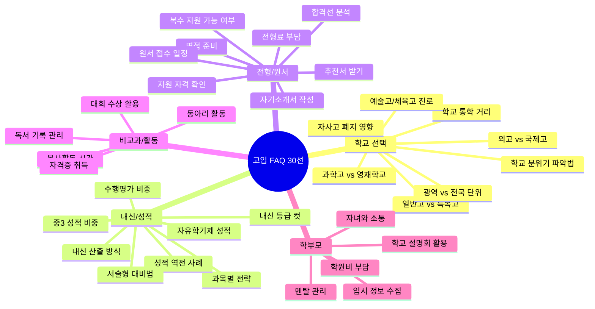
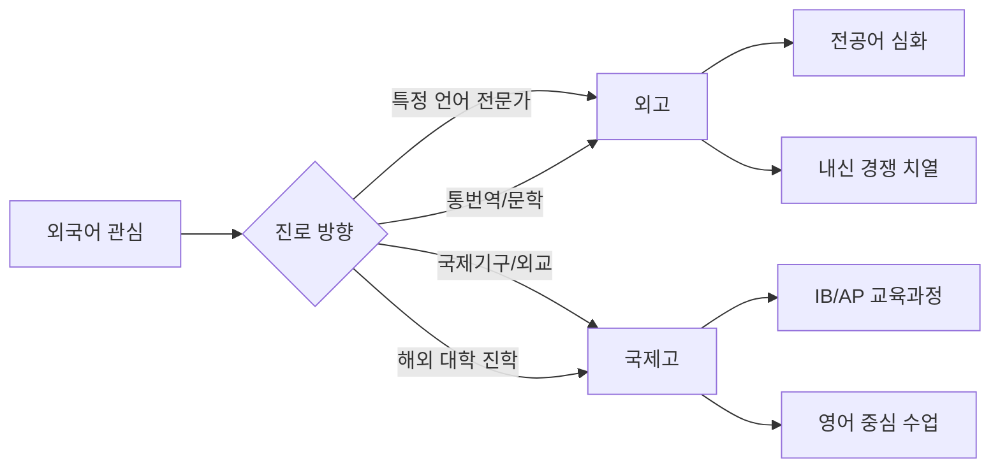
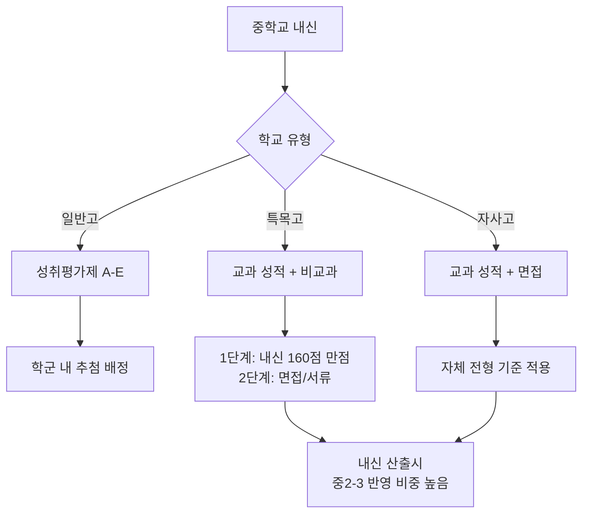
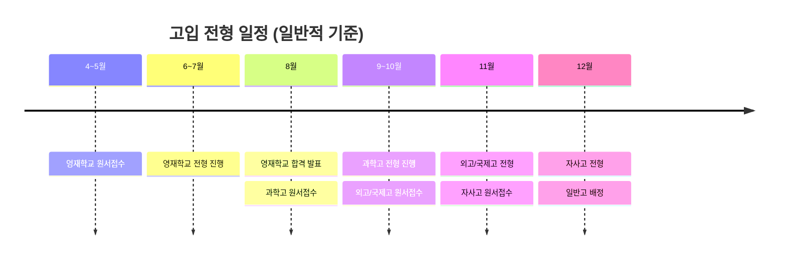
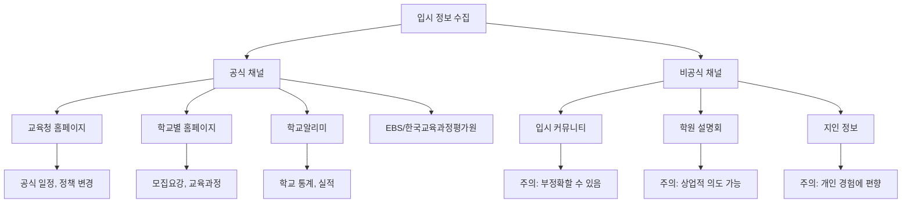
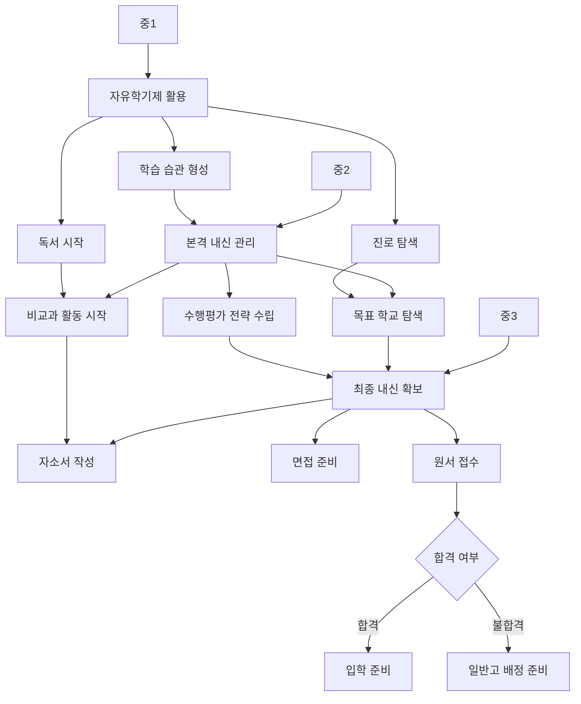

# 자주 묻는 질문 핵심 10선

고입 준비 과정에서 학생과 학부모가 가장 많이 묻는 질문을 **30개 이상** 엄선하여 카테고리별로 정리했습니다.
단순한 답변이 아니라, 구체적인 수치와 사례, 실행 가능한 조언을 담았습니다.

---

## 목차

1. [학교 선택 FAQ](#학교-선택-faq)
2. [내신/성적 FAQ](#내신성적-faq)
3. [전형/원서 FAQ](#전형원서-faq)
4. [비교과/활동 FAQ](#비교과활동-faq)
5. [학부모 FAQ](#학부모-faq)

---

## 전체 FAQ 구조

---

## 학교 선택 FAQ

### Q1. 일반고와 특목고, 어떤 기준으로 선택해야 하나요?

**핵심 답변:** 학교 선택은 단순히 "좋은 학교"를 고르는 것이 아니라, 학생의 학습 성향, 진로 방향, 통학 여건을 종합적으로 고려해야 합니다.

일반고는 내신 경쟁이 상대적으로 완화되어 있어 학생부종합전형(학종)에서 유리할 수 있습니다. 반면 특목고는 해당 분야의 심화 교육과정을 제공하지만, 내부 경쟁이 치열합니다. 예를 들어, 외고의 경우 같은 학교 내에서 상위 30% 안에 들어야 서울 주요 대학에 진학할 수 있는 내신을 확보할 수 있습니다.

**선택 기준 체크리스트:**

- 중학교 내신이 전과목 상위 5% 이내인가
- 특정 과목에 대한 뚜렷한 흥미와 실력이 있는가
- 통학 시간이 편도 1시간 이내인가
- 3년간 높은 학업 강도를 유지할 자신이 있는가
- 목표 대학/학과가 명확한가

| 비교 항목 | 일반고 | 특목고(외고/과학고) | 자율형사립고 |
|-----------|--------|-------------------|-------------|
| 내신 경쟁 | 상대적 완화 | 매우 치열 | 치열 |
| 교육과정 | 표준 교육과정 | 특화 심화과정 | 자율 편성 |
| 학비(연간) | 약 150만원 | 약 200~400만원 | 약 800~1,200만원 |
| 대입 전형 유리점 | 학종(내신 유리) | 특기자/학종 | 학종/정시 |
| 통학 | 근거리 배정 | 광역/전국 지원 | 광역/전국 지원 |

**흔한 오해:** "특목고에 가면 무조건 명문대에 간다"는 것은 사실이 아닙니다. 특목고 하위권 학생의 대입 결과는 일반고 상위권 학생보다 못한 경우가 많습니다. 2024년 기준 서울 소재 외고의 서울대 진학률은 평균 5~8%이며, 이는 일반고 상위 학교와 큰 차이가 없습니다.

---

### Q2. 자사고 폐지 이후 어떤 학교를 선택해야 하나요?

**핵심 답변:** 자사고 일괄 폐지 정책은 정권에 따라 유동적이므로, 현재 시점의 정책을 정확히 확인하는 것이 중요합니다.

자사고가 일반고로 전환된 경우, 해당 학교의 교사진과 교육 인프라는 유지되는 경우가 많아 교육의 질이 급격히 하락하지는 않습니다. 다만 학생 선발 방식이 추첨 배정으로 변경되므로, 학생 구성의 다양성이 높아집니다.

**대안 전략:**

- 일반고 중 교육과정 특성화 학교를 탐색하세요 (교육청별 운영)
- 과학중점학교, 예술중점학교 등 중점과정 운영 일반고를 고려하세요
- 혁신학교 중 대입 실적이 우수한 학교를 리서치하세요

서울시교육청 기준으로 과학중점학교는 일반고이면서도 수학/과학 이수 단위가 45단위 이상으로 편성되어 있어, 이공계 진학을 희망하는 학생에게 실질적인 도움이 됩니다.

---

### Q3. 외고와 국제고의 차이점은 무엇인가요?

**핵심 답변:** 외고는 특정 외국어에 특화된 교육을, 국제고는 국제적 역량 전반에 초점을 맞춘 교육을 제공합니다.

| 비교 항목 | 외국어고등학교 | 국제고등학교 |
|-----------|-------------|-------------|
| 교육 초점 | 전공 외국어 심화 | 국제적 소양 전반 |
| 주요 교육과정 | 전공어 30단위 이상 | IB/AP 과정 운영 가능 |
| 전공어 선택 | 필수 (중국어, 일본어, 불어 등) | 영어 중심 |
| 대입 주요 전형 | 학종/어학특기자 | 학종/해외대 |
| 학비(연간) | 약 250~350만원 | 약 300~500만원 |
| 전국 학교 수 | 약 30개교 | 약 8개교 |
| 졸업 후 진로 | 어문계열, 통번역, 외교 | 국제기구, 경영, 해외취업 |

**흔한 오해:** "외고에서 영어만 잘하면 된다"는 것은 큰 오해입니다. 외고에서도 수학, 사회 등 전 과목 내신이 대입에 반영되며, 영어 실력만으로는 내신 1등급을 받기 어렵습니다. 오히려 전공어(중국어, 일본어, 불어 등)에 대한 적성이 있는지가 더 중요한 판단 기준입니다.

---

### Q4. 과학고와 영재학교는 어떻게 다른가요?

**핵심 답변:** 가장 큰 차이는 입학 시기와 교육 수준, 그리고 조기졸업 가능 여부입니다.

영재학교는 중학교 2학년 때 지원이 가능하며(조기입학), 대학 수준의 심화 교육과정을 운영합니다. 과학고는 중학교 3학년 때 지원하며, 고등학교 수준의 심화 과학 교육을 제공합니다. 영재학교 졸업생의 약 70~80%가 KAIST, 포항공대 등 이공계 특성화 대학에 진학하며, 과학고 졸업생의 경우 서울대, 연세대, 고려대 이공계열 진학 비율이 높습니다.

| 비교 항목 | 영재학교 | 과학고등학교 |
|-----------|---------|-------------|
| 지원 시기 | 중2 (4~5월) | 중3 (6~8월) |
| 전국 학교 수 | 8개교 | 약 20개교 |
| 교육과정 수준 | 대학 수준 심화 | 고등 심화 |
| 조기졸업 | 가능 (2년 만에) | 가능 (요건 충족 시) |
| 선발 인원(교당) | 약 80~120명 | 약 60~90명 |
| 경쟁률 | 약 5~15:1 | 약 3~8:1 |
| 학비 | 전액 국비 지원 | 일부 국비 + 자부담 |
| 기숙사 | 전원 기숙 | 대부분 기숙 |

**지원 자격 핵심:** 영재학교는 학교장 추천이 필요하며, 수학/과학 올림피아드 수상 경력이 있으면 유리합니다. 과학고는 중학교 과학/수학 성적이 상위 3% 이내가 일반적인 합격 기준입니다. 단, 성적만이 아니라 과학에 대한 열정과 탐구 능력을 면접에서 검증합니다.

---

### Q5. 통학 거리는 학교 선택에 얼마나 중요한가요?

**핵심 답변:** 통학 시간은 학업 성취도에 직접적인 영향을 미치는 매우 중요한 변수입니다.

연구에 따르면 편도 통학 시간이 1시간을 초과하면, 하루 자습 가능 시간이 약 2시간 줄어들며, 이는 연간 약 600시간의 학습 시간 손실로 이어집니다. 3년이면 약 1,800시간, 이는 학원 수업 약 900회에 해당하는 양입니다.

**통학 시간별 영향 분석:**

| 편도 통학 시간 | 일일 손실 시간 | 연간 손실(200일 기준) | 체력 소모도 | 권장 여부 |
|---------------|-------------|-------------------|-----------|----------|
| 30분 이내 | 거의 없음 | - | 낮음 | 적극 권장 |
| 30분~1시간 | 약 30분 | 약 100시간 | 보통 | 권장 |
| 1시간~1시간 30분 | 약 1시간 | 약 200시간 | 높음 | 신중 검토 |
| 1시간 30분 이상 | 약 2시간 | 약 400시간 | 매우 높음 | 비권장 |

**실전 조언:** 특목고나 자사고에 합격했더라도, 통학 시간이 편도 1시간 30분 이상이면 기숙사 입사 가능 여부를 반드시 확인하세요. 기숙사가 없다면, 학교 근처 자취를 고려하거나 차선책으로 통학이 편리한 다른 학교를 선택하는 것이 장기적으로 유리할 수 있습니다.

---

### Q6. 광역 단위 모집과 전국 단위 모집의 차이는 무엇인가요?

**핵심 답변:** 모집 단위에 따라 지원 가능 범위와 경쟁 구도가 완전히 달라집니다.

광역 단위 모집 학교는 해당 시도 거주 학생만 지원할 수 있으며, 외고, 국제고, 과학고 대부분이 이에 해당합니다. 전국 단위 모집 학교는 거주지와 관계없이 전국에서 지원 가능하며, 영재학교, 일부 자사고, 예술고, 체육고가 이에 해당합니다.

**중요 포인트:** 광역 단위 학교에 지원하려면 원서 접수일 기준으로 해당 시도에 주민등록이 되어 있어야 합니다. 단순히 학교가 마음에 든다고 타 지역에서 지원할 수 없습니다. 이사를 통한 거주지 이전은 최소 원서 접수 6개월 전에 완료해야 하며, 위장전입이 적발되면 합격이 취소됩니다.

| 모집 단위 | 해당 학교 유형 | 지원 자격 | 비고 |
|----------|-------------|----------|------|
| 전국 단위 | 영재학교, 민족사관고, 상산고 등 | 전국 어디서나 지원 가능 | 기숙사 제공 |
| 광역 단위 | 외고, 국제고, 과학고 | 해당 시도 거주자만 | 거주지 확인 필수 |
| 지역 단위 | 일반고 | 해당 학군 배정 | 추첨/선지원 |

---

### Q7. 학교 분위기와 문화는 어떻게 미리 파악할 수 있나요?

**핵심 답변:** 학교알리미(schoolinfo.go.kr) 데이터와 직접 방문을 병행하는 것이 가장 확실합니다.

학교 분위기를 파악하는 5단계 방법:

1. **학교알리미 확인:** 학업성취도, 학교폭력 실태조사 결과, 교원 현황, 졸업생 진로 통계를 확인합니다. 특히 학업성취도에서 "보통학력 이상" 비율이 80% 이상이면 학업 분위기가 좋은 편입니다.

2. **학교 설명회 참석:** 매년 10~11월에 열리는 학교 설명회에 반드시 참석하세요. 교장/교감 선생님의 교육 철학, 교육과정 편성, 동아리 운영 현황 등을 직접 확인할 수 있습니다.

3. **재학생/졸업생 인터뷰:** 해당 학교 재학생이나 졸업생을 통해 실제 학교 생활에 대한 정보를 수집하세요. 인터넷 커뮤니티의 익명 후기보다 신뢰성이 높습니다.

4. **방과후학교 프로그램 확인:** 방과후학교 프로그램의 다양성과 참여율은 학교의 교육적 열의를 보여주는 지표입니다.

5. **학교 방문:** 수업 시간 중에 학교를 방문하여 복도, 도서관, 운동장 등의 분위기를 직접 느껴보세요.

---

### Q8. 예술고/체육고 진학을 고려할 때 주의할 점은 무엇인가요?

**핵심 답변:** 예술고와 체육고는 재능이 확실하고 해당 분야 진로가 명확할 때만 선택해야 합니다.

예술고는 음악, 미술, 무용, 연극영화 등의 전공으로 나뉘며, 입학 시 실기시험이 핵심입니다. 체육고는 특정 종목의 선수 경력과 대회 성적이 중요합니다. 두 학교 모두 일반 교과 수업 시간이 일반고보다 적기 때문에, 진로 변경이 어려울 수 있다는 점을 반드시 고려해야 합니다.

**진학 전 체크리스트:**

- 해당 분야에서 최소 3년 이상 꾸준히 활동한 경험이 있는가
- 전문 교육 비용(레슨비, 장비비 등)을 감당할 수 있는가
- 졸업 후 진로가 해당 분야로 확실히 정해져 있는가
- 일반 대학 진학도 가능한 대안이 마련되어 있는가

| 학교 유형 | 입학 전형 핵심 | 연간 추가 비용 | 진로 변경 난이도 |
|----------|-------------|-------------|--------------|
| 예술고(음악) | 실기시험 (연주) | 약 500~1,500만원 | 매우 높음 |
| 예술고(미술) | 실기시험 (소묘/수채화) | 약 200~500만원 | 높음 |
| 체육고 | 대회 성적/체력 | 종목별 상이 | 매우 높음 |
| 일반고+예체능 준비 | 내신+실기 병행 | 약 200~400만원 | 보통 |

**흔한 오해:** "예술고에 가야만 예대에 갈 수 있다"는 것은 사실이 아닙니다. 일반고에서도 예대 진학은 충분히 가능하며, 오히려 내신 관리 면에서 일반고가 유리한 경우도 많습니다. 서울대 미술대학 합격자의 약 40%는 일반고 출신입니다.

---

## 내신/성적 FAQ

### Q9. 고입에서 내신은 어떻게 산출되나요?

**핵심 답변:** 고입 내신은 중학교 성적을 기반으로 하며, 학교 유형에 따라 반영 방식이 다릅니다.

일반고 배정의 경우 중학교 성취평가제(A-B-C-D-E) 성적이 기본이며, 특목고나 자사고는 자체 전형에서 내신을 반영합니다. 2025학년도 기준으로 중학교는 절대평가(성취평가제)를 시행하고 있어, "몇 등급"이 아니라 "어떤 성취수준(A/B/C/D/E)"을 받았는지가 중요합니다.

**성취수준별 기준(일반적):**

| 성취수준 | 원점수 기준 | 의미 |
|---------|-----------|------|
| A | 90점 이상 | 매우 우수 |
| B | 80점 이상~90점 미만 | 우수 |
| C | 70점 이상~80점 미만 | 보통 |
| D | 60점 이상~70점 미만 | 노력 필요 |
| E | 60점 미만 | 기초 미달 |

**중요:** 특목고 지원 시 A 비율이 높을수록 유리하지만, 단순히 A의 개수만 보는 것이 아니라 과목별 성취수준과 성적 추이(상승/하락)도 중요하게 봅니다.

---

### Q10. 중3 성적이 가장 중요한가요, 아니면 중1부터 다 반영되나요?

**핵심 답변:** 특목고/자사고 전형에서는 중2~중3 성적의 비중이 가장 크지만, 중1 성적도 무시할 수 없습니다.

외고를 예로 들면, 내신 성적은 일반적으로 중2~중3 영어 성적을 중심으로 반영합니다. 그러나 자기소개서와 면접에서는 중1부터의 학업 태도와 성장 과정을 종합적으로 평가합니다. 성적이 중1에서 중3으로 갈수록 상승하는 추세를 보이면 "성장 가능성"이 높다고 긍정적으로 평가받을 수 있습니다.

**학년별 전략:**

| 학년 | 핵심 전략 | 내신 반영 비중(특목고 기준) |
|------|---------|----------------------|
| 중1 | 학습 습관 형성, 기초 다지기 | 약 20~30% |
| 중2 | 본격적 내신 관리, 진로 탐색 | 약 30~40% |
| 중3 1학기 | 최종 내신 확보, 원서 준비 | 약 30~40% |
| 중3 2학기 | 면접 대비, 자소서 작성 | 직접 반영은 적으나 면접 평가 |

**흔한 오해:** "중1은 자유학기제라서 성적이 안 나오니 놀아도 된다"는 매우 위험한 생각입니다. 자유학기제에도 학습 습관을 형성하지 않으면 중2부터 급격한 성적 하락을 경험하게 됩니다. 자유학기제 동안 독서 습관, 노트 정리 습관, 시간 관리 능력을 반드시 갖추세요.

---

### Q11. 과목별 내신 전략은 어떻게 세워야 하나요?

**핵심 답변:** 목표 학교 유형에 따라 중점을 두어야 할 과목이 달라집니다.

외고를 목표로 한다면 영어가 핵심 과목이지만, 수학과 국어도 A를 받아야 합니다. 과학고를 목표로 한다면 수학과 과학이 핵심이며, 나머지 과목에서도 B 이상을 유지해야 합니다.

**목표별 과목 중요도:**

| 과목 | 외고 지원 시 | 과학고 지원 시 | 일반고(학종 대비) |
|------|-----------|-------------|---------------|
| 국어 | 상 | 중 | 상 |
| 영어 | 최상 | 중 | 상 |
| 수학 | 상 | 최상 | 상 |
| 과학 | 중 | 최상 | 상 |
| 사회 | 중 | 하 | 상 |
| 기타(체육, 예술 등) | 하 | 하 | 중 |

**실전 팁:** 모든 과목에서 A를 받는 것이 이상적이지만, 현실적으로 어렵다면 핵심 과목에서 반드시 A를 확보하고, 나머지 과목은 최소 B 이상을 유지하는 전략이 효과적입니다. 특히 수행평가 비중이 높은 과목(국어, 사회 등)은 수행평가에서 만점을 받는 것만으로도 최종 성적을 한 단계 올릴 수 있습니다.

---

### Q12. 수행평가 비중이 높아졌다는데, 어떻게 대비해야 하나요?

**핵심 답변:** 수행평가는 전체 성적의 40~60%를 차지하며, 이를 소홀히 하면 지필고사를 아무리 잘 봐도 좋은 성적을 받기 어렵습니다.

현재 중학교 과목별 수행평가 비중은 과목에 따라 다르지만, 일반적으로 국어 50~60%, 영어 40~50%, 수학 30~40%, 과학 40~50%, 사회 40~50% 수준입니다. 수행평가는 보고서 작성, 발표, 프로젝트, 실험, 포트폴리오 등 다양한 형태로 진행됩니다.

**수행평가 고득점 전략:**

1. **마감일을 캘린더에 기록하세요:** 수행평가 일정을 학기 초에 미리 파악하고 관리하세요
2. **평가 기준표(루브릭)를 꼼꼼히 읽으세요:** 선생님이 제공하는 평가 기준표에서 만점 조건을 정확히 파악하세요
3. **초안을 일찍 완성하세요:** 마감 3일 전에 초안을 완성하고, 수정 보완할 시간을 확보하세요
4. **피드백을 요청하세요:** 선생님께 초안에 대한 피드백을 요청하면, 보완할 점을 알 수 있습니다
5. **분량은 기준의 120%를 목표로 하세요:** 최소 기준만 맞추면 보통 점수를 받고, 기준보다 20% 이상 충실하면 우수 점수를 받습니다

---

### Q13. 내신 성적이 낮은데 역전이 가능한가요?

**핵심 답변:** 중학교 내신은 절대평가이므로, 본인의 노력에 따라 충분히 역전할 수 있습니다.

상대평가와 달리 절대평가에서는 "다른 학생보다 잘하는 것"이 아니라 "정해진 기준 이상의 점수를 받는 것"이 목표이므로, 학습 방법을 개선하면 성적 향상의 여지가 큽니다.

**역전 성공 사례 (일반적 패턴):**

중2 1학기에 국어 C, 수학 D를 받았던 학생이 중3 1학기에 국어 A, 수학 B로 향상시킨 경우, 핵심 변화 요인은 다음과 같았습니다.

- 매일 국어 지문 2개씩 분석 연습 (하루 30분)
- 수학 기본 개념을 EBS 인터넷 강의로 복습 (하루 40분)
- 오답노트를 매 시험 후 반드시 작성
- 주말에 주간 복습 1시간 실시

**현실적 타임라인:** 한 학기 만에 2단계 이상의 성적 향상(예: D에서 B)은 어렵습니다. 보통 1단계 향상(예: C에서 B)에 한 학기, 2단계 향상에 2~3학기가 소요됩니다. 단, 수행평가 비중이 높은 과목은 수행평가 전략을 바꾸는 것만으로도 한 학기 만에 큰 폭의 향상이 가능합니다.

---

### Q14. 서술형 시험 대비는 어떻게 해야 하나요?

**핵심 답변:** 서술형 시험은 단순 암기가 아니라 "이해하고 설명하는 능력"을 평가하므로, 평소 공부 방법 자체를 바꿔야 합니다.

서술형 시험의 배점은 과목별로 30~50%를 차지하며, 이 비중은 점점 높아지는 추세입니다. 서술형에서 감점되는 주요 원인은 핵심 키워드 누락, 논리 구조 부족, 분량 미달입니다.

**서술형 고득점 공식:**

1. **핵심 키워드를 먼저 쓰세요:** 답안지에 채점 기준이 되는 핵심 용어를 반드시 포함하세요
2. **"왜냐하면" 구조를 사용하세요:** 주장 -> 근거 -> 예시의 3단 구조로 작성하세요
3. **교과서 표현을 활용하세요:** 선생님은 교과서 기반으로 채점하므로, 교과서에 나온 표현을 사용하면 유리합니다
4. **매일 한 문제씩 서술 연습하세요:** 수업 내용을 "~란 무엇이며, 왜 중요한가?"의 형태로 매일 한 문제씩 써보세요

---

### Q15. 자유학기제 기간의 성적은 어떻게 관리해야 하나요?

**핵심 답변:** 자유학기제 기간에는 지필고사가 없지만, 이 시기에 형성한 학습 습관이 중2~중3 성적을 결정합니다.

자유학기제(보통 중1 1학기 또는 1학년 전체)에는 중간/기말고사 대신 과정중심평가(수행평가, 프로젝트, 포트폴리오 등)로 평가합니다. 성적표에 A-E 대신 서술형 평가가 기록됩니다.

**자유학기제 활용 전략:**

- **다양한 진로 체험에 적극 참여하세요:** 이 시기의 체험 활동은 자소서와 면접에서 활용할 수 있는 소재가 됩니다
- **독서 기록을 시작하세요:** 매주 1권씩 읽고 간단한 독후감을 기록하면, 3년간 약 150권의 독서 이력이 쌓입니다
- **기초 학력을 다지세요:** 시험이 없다고 공부를 놓으면 안 됩니다. 수학은 특히 중1 내용(정수, 방정식, 함수)이 중2~3의 기초가 됩니다
- **학습 루틴을 만드세요:** 매일 최소 2시간의 자기주도학습 시간을 확보하세요

**흔한 오해:** "자유학기제에는 성적이 안 나오니까 특목고 지원에 영향이 없다"는 반만 맞는 말입니다. 성적은 직접 반영되지 않지만, 자유학기제 활동 기록은 학생부에 남으며, 자소서와 면접에서 이 시기의 경험을 물어보는 경우가 많습니다.

---

### Q16. 시험 기간 효율적인 공부 방법은 무엇인가요?

**핵심 답변:** 시험 2주 전부터 역산 계획을 세우고, 과목별 공부 시간을 배분하는 것이 핵심입니다.

```mermaid
gantt
    title 시험 2주 전 공부 계획 예시
    dateFormat  X
    axisFormat %s일차

    section 1주차
    전 범위 훑기(전 과목)       :a1, 0, 2
    취약 과목 집중 복습          :a2, 2, 4
    수학 문제풀이               :a3, 3, 5
    영어 본문 암기              :a4, 2, 5

    section 2주차
    오답노트 복습               :b1, 7, 9
    실전 문제풀이               :b2, 8, 11
    서술형 답안 연습             :b3, 9, 12
    최종 정리 및 컨디션 조절     :b4, 12, 14
```

**과목별 시간 배분 기준:**

| 과목 | 일일 권장 시간 | 핵심 공부법 |
|------|-------------|-----------|
| 국어 | 40분 | 교과서 지문 재독 + 핵심 개념 정리 |
| 영어 | 50분 | 본문 암기 + 문법 정리 + 듣기 연습 |
| 수학 | 60분 | 유형별 문제풀이 + 오답 분석 |
| 과학 | 40분 | 개념 정리 + 실험 과정 복습 |
| 사회 | 30분 | 핵심 용어 정리 + 지도/도표 분석 |
| 기타 | 20분 | 핵심 내용 암기 |

---

## 전형/원서 FAQ

### Q17. 자기소개서는 어떻게 작성해야 하나요?

**핵심 답변:** 자기소개서는 "나는 이런 학생이다"를 증명하는 문서이며, 구체적인 사례와 성장 과정을 중심으로 작성해야 합니다.

특목고/자사고 자기소개서는 보통 1,500자 내외로 제한되며, 다음 세 가지 핵심 질문에 답하는 형태입니다.

1. **지원 동기:** 왜 이 학교에 오고 싶은가
2. **학습 경험:** 어떤 학습을 해왔고, 무엇을 배웠는가
3. **인성/공동체:** 어떤 인성적 역량을 갖추고 있는가

**좋은 자기소개서의 조건:**

- 구체적인 에피소드가 있다 (언제, 어디서, 무엇을, 어떻게)
- 실패와 극복 과정이 포함되어 있다
- 해당 학교의 교육 이념과 본인의 목표가 연결되어 있다
- 진정성이 느껴진다 (과장이나 거짓이 없다)

**나쁜 자기소개서의 특징:**

- 추상적인 표현만 나열한다 ("열심히 했습니다", "최선을 다했습니다")
- 수상 경력이나 자격증만 나열한다
- 부모님이 대신 써준 티가 난다 (중학생답지 않은 어투)
- 모든 학교에 같은 내용으로 제출한다

**실전 작성 순서:**

1. 자신의 경험을 브레인스토밍으로 모두 나열하기
2. 가장 인상 깊은 3~5개 에피소드 선정하기
3. 각 에피소드를 "상황-행동-결과-배움" 구조로 정리하기
4. 지원 학교의 인재상과 연결하기
5. 초안 작성 후 최소 3회 이상 수정하기

---

### Q18. 추천서는 누구에게 받아야 하나요?

**핵심 답변:** 추천서는 학생을 가장 잘 아는 선생님께 받는 것이 원칙이며, 담임 선생님이 가장 일반적입니다.

추천서 작성을 부탁드릴 때 주의할 점:

- **최소 한 달 전에 요청하세요:** 선생님도 준비 시간이 필요합니다
- **본인의 활동 자료를 정리하여 드리세요:** 선생님이 구체적인 내용을 쓸 수 있도록 참고 자료를 제공하세요
- **2~3학년 담임 선생님이 유리합니다:** 최근의 모습을 가장 잘 아는 분이기 때문입니다

| 추천서 작성자 | 장점 | 적합한 경우 |
|-------------|------|-----------|
| 3학년 담임 | 최근 모습을 잘 안다 | 일반적인 경우 |
| 2학년 담임 | 성장 과정을 상세히 안다 | 중2에 큰 변화가 있었을 때 |
| 교과 선생님 | 학업 역량을 구체적으로 증명 | 특정 교과 역량이 뛰어날 때 |

---

### Q19. 면접은 어떻게 준비해야 하나요?

**핵심 답변:** 면접은 자기소개서의 진위를 확인하고, 학생의 사고력과 인성을 평가하는 자리입니다.

특목고/자사고 면접은 보통 10~20분간 진행되며, 개인면접 또는 집단면접 형태로 실시됩니다. 면접에서 가장 많이 나오는 질문 유형은 다음과 같습니다.

**빈출 질문 TOP 10:**

1. 우리 학교에 지원한 이유는 무엇인가요?
2. 중학교 시절 가장 의미 있었던 경험은 무엇인가요?
3. 자기소개서에 쓴 OO 활동에 대해 자세히 말해주세요
4. 입학 후 어떤 활동을 하고 싶나요?
5. 자신의 장점과 단점은 무엇인가요?
6. 최근에 읽은 책 중 인상 깊었던 것은?
7. 갈등 상황에서 어떻게 해결한 경험이 있나요?
8. 미래에 어떤 사람이 되고 싶나요?
9. 팀 활동에서 자신의 역할은 주로 무엇인가요?
10. 마지막으로 하고 싶은 말이 있나요?

**면접 대비 3단계:**

1. **자기소개서 완벽 숙지 (2주 전):** 자소서에 쓴 내용을 모두 암기하고, 추가 질문에 대비하세요
2. **모의면접 실시 (1주 전):** 부모님, 선생님, 친구와 함께 모의면접을 3회 이상 진행하세요
3. **당일 컨디션 관리:** 전날 충분히 자고, 면접 30분 전에 도착하세요

---

### Q20. 원서 접수 일정과 절차는 어떻게 되나요?

**핵심 답변:** 고입 원서 접수는 학교 유형에 따라 시기가 다르며, 일정을 놓치면 기회 자체가 사라지므로 반드시 미리 확인해야 합니다.

**원서 접수 체크리스트:**

- 원서 접수 사이트 사전 가입 및 로그인 테스트
- 사진 파일 준비 (3개월 이내 촬영, 규격 확인)
- 자기소개서 최종본 저장 (여러 형태로 백업)
- 추천서 제출 여부 확인
- 전형료 납부 (보통 2~5만원)
- 접수 확인서 출력 및 보관

**흔한 실수:** 원서 접수 마감일 당일에 서류를 준비하다가 시스템 오류나 서류 미비로 접수에 실패하는 경우가 매년 발생합니다. 반드시 마감 3일 전에 접수를 완료하세요.

---

### Q21. 여러 학교에 동시 지원이 가능한가요?

**핵심 답변:** 같은 유형의 학교에는 1교만 지원 가능하지만, 다른 유형의 학교에는 순차적으로 지원할 수 있습니다.

고입 지원의 기본 원칙은 "선지원 - 후추첨"입니다. 영재학교에 먼저 지원하고, 불합격 시 과학고에 지원하고, 그것도 불합격 시 외고/국제고에 지원하는 순차 지원이 가능합니다. 단, 한 유형 내에서는 1교만 지원 가능합니다.

| 지원 순서 | 학교 유형 | 동시 지원 | 비고 |
|----------|---------|----------|------|
| 1순위 | 영재학교 | 2교 가능 (일부 지역) | 먼저 발표 |
| 2순위 | 과학고 | 1교만 | 영재학교 합격 시 지원 불가 |
| 3순위 | 외고/국제고 | 1교만 | 과학고 합격 시 지원 불가 |
| 4순위 | 자사고/자공고 | 1교만 | 위 전형 합격 시 지원 불가 |
| 5순위 | 일반고 | 추첨 배정 | 위 전형 모두 불합격 시 |

**중요:** 상위 전형에서 합격하면 하위 전형에 지원할 수 없습니다. 따라서 "영재학교에 합격했지만 외고에 가고 싶다"는 불가능합니다. 합격을 포기하더라도 하위 전형 지원이 제한될 수 있으므로, 지원 전에 신중하게 결정해야 합니다.

---

### Q22. 전형료 부담이 크면 어떻게 하나요?

**핵심 답변:** 경제적으로 어려운 가정의 학생은 전형료 면제 혜택을 받을 수 있습니다.

기초생활수급자, 차상위계층, 한부모가정 등 경제적 어려움이 있는 경우, 대부분의 특목고/자사고에서 전형료를 면제해 줍니다. 지원 시 관련 증빙서류(수급자 증명서, 차상위계층 확인서 등)를 제출하면 됩니다.

또한 교육청에서 운영하는 교육비 지원 제도를 통해 입학 후 학비, 교과서비, 급식비 등을 지원받을 수 있습니다. 교육비 지원 신청은 매년 3월에 학교를 통해 접수합니다.

---

### Q23. 합격선은 어떻게 분석해야 하나요?

**핵심 답변:** 합격선은 매년 변동하므로, 최근 3년간의 추이를 분석하는 것이 중요합니다.

학교별 합격선 정보는 공식적으로 공개되지 않는 경우가 많지만, 다음 방법으로 간접적으로 파악할 수 있습니다.

1. **학교 설명회에서 확인:** 일부 학교는 설명회에서 전년도 입학생의 내신 평균을 공개합니다
2. **입시 커뮤니티 참고:** 합격 수기나 후기를 통해 간접적으로 파악할 수 있습니다 (다만, 정확성은 보장하기 어렵습니다)
3. **학원 상담:** 고입 전문 학원에서 축적한 데이터를 참고할 수 있습니다
4. **경쟁률 확인:** 경쟁률이 높을수록 합격선이 올라가는 경향이 있습니다

**주의사항:** 인터넷에 떠도는 합격선 정보는 부정확한 경우가 많습니다. 반드시 공식 채널을 통해 확인하고, 여유 있는 목표를 설정하세요. 예를 들어, 추정 합격선이 내신 A 비율 80%라면, 본인의 목표는 90% 이상으로 잡는 것이 안전합니다.

---

### Q24. 지원 자격은 어떻게 확인하나요?

**핵심 답변:** 지원 자격은 학교 유형, 거주지, 성적 요건, 추천 요건 등 여러 조건을 동시에 충족해야 합니다.

각 학교의 지원 자격은 매년 발표되는 전형 요강(모집요강)에 상세히 안내되어 있습니다. 모집요강은 보통 원서 접수 2~3개월 전에 각 학교 홈페이지와 교육청 홈페이지에 공개됩니다.

**지원 자격 확인 체크리스트:**

- 거주지 요건: 해당 시도에 주민등록이 되어 있는가
- 학력 요건: 중학교 졸업(예정)자 또는 동등 학력 인정자인가
- 성적 요건: 학교별 최소 성적 기준을 충족하는가
- 추천 요건: 학교장 추천서 등이 필요한 경우 확보 가능한가
- 연령 요건: 만 나이 기준 지원 가능 연령인가
- 중복 지원 제한: 다른 학교 합격으로 인한 지원 제한이 있는가

---

## 비교과/활동 FAQ

### Q25. 봉사활동은 몇 시간이 필요한가요?

**핵심 답변:** 시간 자체보다 봉사의 질과 지속성이 더 중요하지만, 최소 연간 20시간 이상을 권장합니다.

특목고 지원 시 봉사활동은 자기소개서와 면접에서 인성 평가의 중요한 자료가 됩니다. 단순히 시간을 채우기 위한 일회성 봉사보다, 특정 분야에서 꾸준히 활동한 기록이 훨씬 높은 평가를 받습니다.

**효과적인 봉사활동 전략:**

| 봉사 유형 | 예시 | 시간 인정 | 평가 효과 |
|----------|------|---------|----------|
| 교내 봉사 | 도서관 정리, 또래 멘토링 | 학기당 10~20시간 | 높음 (지속성 인정) |
| 지역사회 봉사 | 복지관, 요양원, 환경정화 | 회당 3~4시간 | 보통 |
| 전문 봉사 | 교육 봉사, 번역 봉사 | 프로젝트당 10~30시간 | 매우 높음 (전문성 인정) |
| 1365 자원봉사 | 각종 행사 지원 | 행사당 4~8시간 | 보통 |

**흔한 오해:** "봉사 시간이 많을수록 좋다"는 것은 반만 맞는 말입니다. 연간 100시간의 산발적 봉사보다, 연간 30시간이라도 하나의 주제로 꾸준히 한 봉사가 더 높은 평가를 받습니다. 예를 들어, "매주 토요일 지역아동센터에서 수학 교육 봉사 2시간 x 연간 40주 = 80시간"은 매우 좋은 봉사 기록입니다.

---

### Q26. 독서 기록은 어떻게 관리해야 하나요?

**핵심 답변:** 독서 기록은 양보다 질이 중요하며, 진로와 연결된 깊이 있는 독서가 핵심입니다.

학생부에 기록되는 독서 활동은 책 제목과 저자만 기재되지만, 면접에서는 "왜 그 책을 읽었는지", "무엇을 느꼈는지", "어떤 영향을 받았는지"를 구체적으로 물어봅니다. 따라서 단순히 많이 읽는 것보다, 읽은 책에 대해 깊이 사고하고 기록으로 남기는 것이 중요합니다.

**독서 기록 관리 방법:**

1. **독서 노트를 만드세요:** 책 제목, 저자, 읽은 날짜, 핵심 내용 요약, 인상 깊은 구절, 나의 생각을 기록하세요
2. **진로별 독서 목록을 만드세요:** 본인의 진로 희망 분야와 관련된 책을 중심으로 읽으세요
3. **한 달에 2~3권을 목표로 하세요:** 연간 24~36권이면 충분합니다
4. **교과 연계 독서를 하세요:** 수업 시간에 배운 내용과 관련된 책을 읽으면 학습 효과도 높아집니다

---

### Q27. 동아리 활동은 어떤 것을 해야 유리한가요?

**핵심 답변:** 동아리는 "무엇을 했는가"보다 "그 안에서 어떤 역할을 했고, 무엇을 배웠는가"가 중요합니다.

특목고 지원 시 동아리 활동은 자기소개서의 핵심 소재가 됩니다. 교내 정규 동아리와 자율 동아리를 모두 활용하되, 본인의 진로와 연결되는 활동을 선택하는 것이 좋습니다.

**동아리 선택 가이드:**

| 목표 학교 | 추천 동아리 유형 | 구체적 활동 예시 |
|----------|--------------|--------------|
| 외고 | 영자신문, 영어토론, 외국어 | 영어신문 발행, 모의UN |
| 과학고 | 과학탐구, 수학, 코딩 | 실험 프로젝트, 수학경시 준비 |
| 자사고 | 토론, 리더십, 사회탐구 | 시사토론, 학생회 활동 |
| 일반고(학종 대비) | 진로 관련 자율동아리 | 관심 분야 탐구 보고서 작성 |

**핵심 팁:** 동아리 활동에서 리더십(회장, 부회장)을 맡는 것이 유리할 수 있지만, 직책 자체보다 실제로 어떤 프로젝트를 기획하고 실행했는지가 더 중요합니다. "동아리 회장을 했습니다"보다 "동아리 회장으로서 교내 과학 축제를 기획하여 전교생 300명이 참여하는 행사를 성공적으로 운영했습니다"가 훨씬 좋은 기록입니다.

---

### Q28. 대회 수상 경력은 얼마나 중요한가요?

**핵심 답변:** 대회 수상 경력은 도움이 되지만, 필수 조건은 아닙니다. 교내 대회 참여와 수상이 교외 대회보다 학생부에서 더 중요하게 다뤄집니다.

2024년 이후 대입에서 교외 수상 실적의 반영이 제한됨에 따라, 고입에서도 교외 대회보다 교내 대회의 비중이 높아지고 있습니다. 교내 수상 기록은 학생부에 기재할 수 있지만, 교외 수상은 기재가 제한되는 추세입니다.

**대회 참여 전략:**

- 교내 대회는 가능한 한 모두 참여하세요 (국어, 영어, 수학, 과학, 사회, 독서 등)
- 교내 대회에서 수상하지 못하더라도 참여 자체가 기록에 남습니다
- 교외 대회는 면접에서 언급할 소재로 활용할 수 있습니다
- 올림피아드(수학, 과학)는 영재학교/과학고 지원 시 유의미합니다

---

### Q29. 자격증 취득이 고입에 도움이 되나요?

**핵심 답변:** 직접적인 가산점은 없지만, 자기소개서와 면접에서 자기주도 학습 능력을 증명하는 근거로 활용할 수 있습니다.

중학생이 취득할 수 있는 주요 자격증과 고입에서의 활용도:

| 자격증 | 취득 난이도 | 고입 활용도 | 비고 |
|-------|-----------|-----------|------|
| 한국사능력검정시험 | 중 | 높음 | 역사 관심 증명, 3급 이상 권장 |
| 한국어능력시험(TOPIK) | - | 외국 국적자에 한함 | 외국인만 해당 |
| 컴퓨터활용능력 | 중 | 보통 | IT 관심 증명 |
| 정보처리기능사 | 상 | 보통 | 코딩 역량 증명 |
| TOEFL/TOEIC | 상 | 높음 (외고) | 영어 실력 객관적 증명 |
| 수학인증시험(KMC) | 상 | 높음 (과학고) | 수학 역량 증명 |

**주의:** 자격증 준비에 과도한 시간을 투자하여 내신 관리를 소홀히 하면 오히려 역효과가 납니다. 내신이 최우선이고, 자격증은 여유가 있을 때 도전하세요.

---

## 학부모 FAQ

### Q30. 학원비 부담이 크면 어떻게 준비할 수 있나요?

**핵심 답변:** 학원 없이도 충분히 고입을 준비할 수 있으며, 무료/저비용 교육 자원이 풍부합니다.

학원비는 월 30~100만원 이상 들 수 있지만, 다음의 무료/저비용 대안을 활용하면 학원과 동등한 효과를 낼 수 있습니다.

**무료/저비용 학습 자원:**

| 자원 | 비용 | 내용 | 접근 방법 |
|------|------|------|---------|
| EBS 중학 강좌 | 무료 | 전 과목 인터넷 강의 | ebs.co.kr |
| 꿈길 진로체험 | 무료 | 진로 탐색 프로그램 | ggoomgil.go.kr |
| 지역 도서관 프로그램 | 무료 | 독서, 글쓰기, 특강 | 가까운 공공도서관 |
| 교육청 방과후학교 | 무료~저비용 | 교과 보충, 특기적성 | 학교 공지 확인 |
| 대학생 멘토링 | 무료~저비용 | 1:1 학습 지도 | 교육청/지역센터 |

**실전 학습 루틴(학원 없이):**

1. 오전: EBS 강의 1~2개 시청 (과목별 30~40분)
2. 오후: 교과서 복습 + 자습서 문제풀이 (2시간)
3. 저녁: 오답 정리 + 다음 날 예습 (1시간)
4. 주말: 주간 복습 + 독서 (3시간)

---

### Q31. 자녀와 고입에 대해 어떻게 소통해야 하나요?

**핵심 답변:** 부모의 역할은 "결정자"가 아니라 "조력자"이며, 자녀의 의견을 존중하면서 정보를 제공하는 것이 핵심입니다.

고입 준비 과정에서 부모-자녀 갈등이 가장 많이 발생하는 시점은 학교 선택과 성적 관리입니다. 부모가 원하는 학교와 자녀가 원하는 학교가 다를 때, 강압적으로 부모의 뜻을 밀어붙이면 오히려 자녀의 학습 의욕을 떨어뜨리는 결과를 초래합니다.

**효과적인 소통 방법:**

- **정기적인 대화 시간을 정하세요:** 매주 1회, 30분 정도 고입 관련 이야기를 나누는 시간을 갖되, 성적 이야기는 전체의 30% 이하로 제한하세요
- **질문으로 시작하세요:** "너는 어떤 학교에 가고 싶어?" "왜 그 학교가 마음에 들어?"처럼 열린 질문을 하세요
- **정보를 함께 조사하세요:** 학교 홈페이지, 설명회, 커뮤니티를 함께 살펴보며 정보를 공유하세요
- **최종 결정은 자녀에게 맡기세요:** 부모는 정보와 의견을 제공하되, 최종 선택은 자녀가 하도록 지원하세요
- **비교하지 마세요:** "옆집 OO는 외고 갔는데" 같은 비교는 절대 삼가세요

---

### Q32. 입시 정보는 어디서 수집해야 하나요?

**핵심 답변:** 공식 채널을 중심으로 정보를 수집하되, 커뮤니티 정보는 참고만 하고 검증 과정을 거쳐야 합니다.

**정보 수집 일정표:**

| 시기 | 확인할 정보 | 출처 |
|------|-----------|------|
| 3~4월 | 올해 입시 정책 변경 사항 | 교육청 홈페이지 |
| 5~6월 | 영재학교/과학고 모집요강 | 해당 학교 홈페이지 |
| 7~8월 | 외고/국제고 모집요강 | 해당 학교 홈페이지 |
| 9~10월 | 자사고 모집요강 | 해당 학교 홈페이지 |
| 10~11월 | 학교 설명회 일정 | 학교 홈페이지/SNS |
| 11~12월 | 일반고 배정 일정 | 교육청 홈페이지 |

---

### Q33. 학교 설명회에서 꼭 확인해야 할 것은 무엇인가요?

**핵심 답변:** 학교 설명회는 홈페이지에서 알 수 없는 "실제" 정보를 얻을 수 있는 가장 좋은 기회입니다.

설명회에서 반드시 확인해야 할 사항:

1. **교육과정 편성:** 어떤 선택과목이 개설되어 있는지, 심화 과목은 무엇인지
2. **대입 실적:** 최근 3년간 졸업생의 대학 진학 현황 (인서울 비율, SKY 비율 등)
3. **교사 현황:** 교사 1인당 학생 수, 교사의 전문성 (석사/박사 비율)
4. **학교 시설:** 도서관, 실험실, 체육 시설, 기숙사 등의 수준
5. **학교 문화:** 동아리 활동, 학교 행사, 학생 자치 활동의 활성화 정도
6. **진학 지도:** 진학 상담 체계, 대입 지도 프로그램의 질
7. **학비 및 장학금:** 연간 학비 총액, 장학금 제도, 경제적 지원

**질문 리스트 (설명회에서 직접 물어볼 것):**

- "작년 신입생의 평균 내신 성취수준은 어느 정도였나요?"
- "졸업생 중 희망 진로를 변경한 비율은 얼마나 되나요?"
- "학교생활에 적응하지 못하는 학생을 위한 지원 시스템이 있나요?"
- "방과후 자습 시간은 몇 시까지이며, 의무인가요?"

---

### Q34. 자녀의 멘탈 관리는 어떻게 해야 하나요?

**핵심 답변:** 고입 준비 과정에서의 스트레스 관리는 성적 관리만큼 중요하며, 부모의 태도가 자녀의 정서에 가장 큰 영향을 미칩니다.

중학교 3학년 학생들은 사춘기와 입시 스트레스가 겹치는 시기를 보냅니다. 이 시기에 부모가 할 수 있는 가장 중요한 역할은 "안전 기지"가 되어주는 것입니다.

**멘탈 관리 5대 원칙:**

1. **결과가 아닌 과정을 칭찬하세요:** "성적이 올랐네!"보다 "꾸준히 노력하는 모습이 대견하다"가 효과적입니다
2. **실패를 허용하세요:** 시험 성적이 떨어졌을 때 "왜 이것밖에 못 했어?"가 아니라 "다음에 어떻게 하면 좋을지 같이 생각해 보자"로 대응하세요
3. **규칙적인 생활을 지원하세요:** 충분한 수면(8시간 이상), 규칙적인 식사, 적절한 운동이 학업 효율을 높입니다
4. **취미 시간을 보장하세요:** 공부만 하는 것은 번아웃을 초래합니다. 하루 1시간은 자유 시간을 보장하세요
5. **전문 도움을 두려워하지 마세요:** 심한 불안이나 우울 증상이 보이면 학교 상담사나 전문 상담사의 도움을 받으세요

**위험 신호 (전문 상담이 필요한 경우):**

- 2주 이상 지속되는 식욕 부진 또는 수면 장애
- 학교 가기를 극도로 싫어하거나 거부하는 경우
- 자해 언급이나 극단적인 표현을 하는 경우
- 친구 관계가 급격히 악화된 경우
- 이전에 좋아하던 활동에 전혀 흥미를 보이지 않는 경우

---

## 종합 정리

### 고입 준비 핵심 로드맵

### 30초 결론

1. 본인의 학습 성향과 진로 방향을 먼저 파악하세요
2. 목표 학교를 2~3개 선정하고 구체적인 정보를 수집하세요
3. 내신 관리를 최우선으로 하되, 비교과 활동도 꾸준히 하세요
4. 원서 접수 일정을 역산하여 준비 계획을 세우세요
5. 부모와 자녀가 함께 소통하며 준비하세요
6. 어떤 결과든 수용하고 다음 단계를 계획하세요

### 추가 참고 자원

| 자원 | URL | 용도 |
|------|-----|------|
| 학교알리미 | schoolinfo.go.kr | 학교 통계 확인 |
| 고입정보포털 | hischool.go.kr | 고입 전형 정보 |
| EBS 중학 | mid.ebs.co.kr | 무료 인터넷 강의 |
| 커리어넷 | career.go.kr | 진로 탐색 |
| 꿈길 | ggoomgil.go.kr | 진로 체험 |
| 나이스 대국민서비스 | neis.go.kr | 성적 확인 |

---

> 이 FAQ는 2026년 기준으로 작성되었습니다. 교육 정책은 수시로 변경될 수 있으므로, 최신 정보는 반드시 교육청 및 해당 학교 공식 홈페이지에서 확인하세요.
