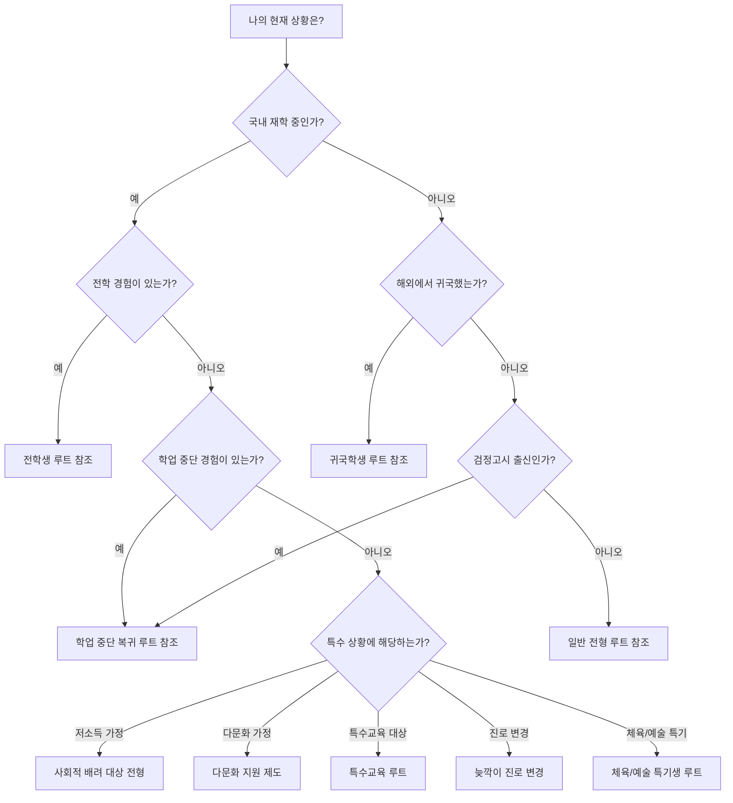
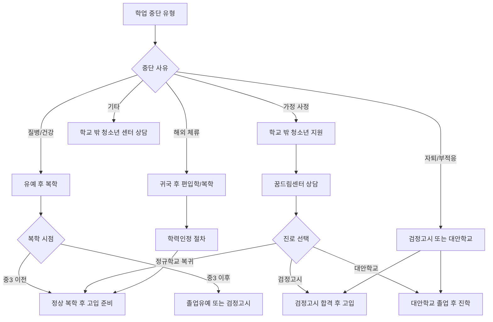
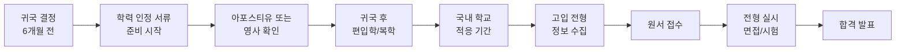
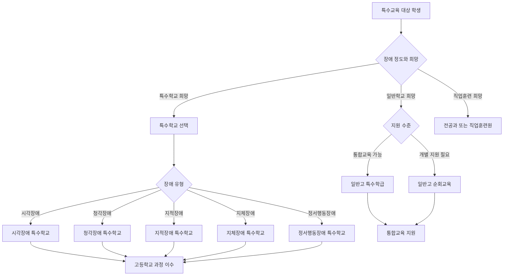
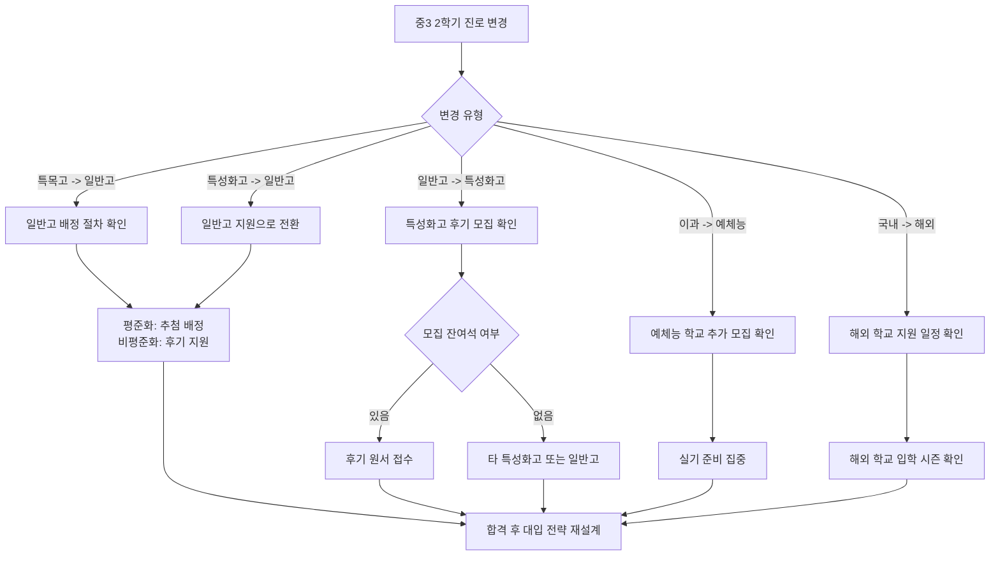

# 특수 상황 루트 가이드

일반적인 고입 준비 경로에서 벗어난 학생들을 위한 실전 전략 가이드입니다. 전학생, 귀국학생, 학업 중단 후 복귀 학생, 다문화 가정, 저소득 가정, 특수교육 대상 학생, 늦깍이 진로 변경, 체육/예술 특기생 등 다양한 상황에 맞는 구체적인 전략과 서류, 지원 가능 학교, 성공 사례를 정리했습니다.

---

## 목차

1. [전학생/귀국학생의 고입 전략](#1-전학생귀국학생의-고입-전략)
2. [학업 중단 후 복귀 학생 루트](#2-학업-중단-후-복귀-학생-루트)
3. [해외 거주 경험이 있는 학생 (귀국자녀 특별전형)](#3-해외-거주-경험이-있는-학생-귀국자녀-특별전형)
4. [저소득 가정 학생을 위한 기회 (사회적 배려 대상 전형)](#4-저소득-가정-학생을-위한-기회-사회적-배려-대상-전형)
5. [다문화 가정 학생 지원 제도](#5-다문화-가정-학생-지원-제도)
6. [특수교육 대상 학생의 고등학교 선택](#6-특수교육-대상-학생의-고등학교-선택)
7. [늦깍이 진로 변경 (중3 2학기에 방향 전환)](#7-늦깍이-진로-변경-중3-2학기에-방향-전환)
8. [체육/예술 특기생의 학교 선택](#8-체육예술-특기생의-학교-선택)
9. [도움받을 수 있는 기관과 연락처](#9-도움받을-수-있는-기관과-연락처)

---

## 전체 상황별 의사결정 흐름도

---

## 1. 전학생/귀국학생의 고입 전략

### 1-1. 전학생의 현실적 어려움

전학생이 고입 준비에서 겪는 가장 큰 문제는 다음과 같습니다.

| 어려움 | 구체적 상황 | 영향도 |
|--------|------------|--------|
| 내신 불연속 | 학교마다 시험 난이도, 평가 기준 다름 | 매우 높음 |
| 교우관계 재구축 | 새 학교 적응 기간 필요, 스트레스 | 높음 |
| 교과 진도 차이 | 이전 학교와 현재 학교의 교과 진도 불일치 | 높음 |
| 비교과 활동 단절 | 동아리, 봉사활동 기록의 연속성 부족 | 중간 |
| 학교생활기록부 이관 | 전학 전 기록과 통합 시 누락 가능성 | 중간 |

### 1-2. 전학 시기별 고입 전략

#### 중1 때 전학한 경우

- 적응 기간이 충분하므로 내신 만회 가능성 높음
- 중2~3 내신에 집중하여 상승 곡선 만들기
- 전학 직후 학교 내 동아리, 봉사활동에 적극 참여
- 담임 및 교과 선생님과의 관계 형성에 집중

#### 중2 때 전학한 경우

- 중2 2학기~중3 1학기가 핵심 내신 구간
- 전학 직후 시험 범위와 출제 경향 빠르게 파악
- 이전 학교 성적표와 비교하여 약점 과목 보완
- 자유학기제 활동이 이미 끝났을 수 있으므로 중3 활동에 더 집중

#### 중3 때 전학한 경우 (가장 어려운 상황)

- 남은 시간이 매우 촉박하므로 전략적 접근 필수
- 일반고 지원이 가장 현실적인 선택일 수 있음
- 특성화고나 마이스터고는 전형 일정상 빠른 준비 가능
- 자기소개서에 전학 경험을 성장 스토리로 활용

### 1-3. 전학생 고입 준비 체크리스트

| 순서 | 항목 | 세부 내용 | 마감 시점 |
|------|------|----------|----------|
| 1 | 학교생활기록부 확인 | 전학 전 학교 기록이 정확히 이관되었는지 확인 | 전학 후 1주 이내 |
| 2 | 교과 진도 비교 | 이전 학교와 현재 학교의 교과 진도 차이 파악 | 전학 후 2주 이내 |
| 3 | 시험 일정 확인 | 중간/기말고사 일정 및 범위 확인 | 전학 후 즉시 |
| 4 | 동아리 가입 | 현재 학교의 동아리 활동 참여 | 전학 후 1개월 이내 |
| 5 | 봉사활동 계획 | 봉사활동 시간 보충 계획 수립 | 전학 후 1개월 이내 |
| 6 | 진로상담 | 담임/진로 선생님과 고입 계획 상담 | 전학 후 2주 이내 |
| 7 | 내신 목표 설정 | 남은 학기 내신 목표 등급 설정 | 전학 후 1개월 이내 |
| 8 | 지원 전형 조사 | 전학생에게 유리한 전형 탐색 | 중3 1학기 이전 |

### 1-4. 전학생에게 유리한 학교 유형

| 학교 유형 | 전학생 유리 여부 | 이유 |
|----------|----------------|------|
| 일반고 (평준화 지역) | 매우 유리 | 추첨 배정으로 내신 영향 적음 |
| 일반고 (비평준화 지역) | 보통 | 내신 반영하지만 절대평가 반영 학교 있음 |
| 자율형 사립고 | 보통 | 자기소개서와 면접에서 전학 경험 활용 가능 |
| 특성화고 | 유리 | 면접 중심 전형이 많아 내신 비중 낮음 |
| 마이스터고 | 유리 | 적성검사와 면접 비중 높음 |
| 과학고/외고/국제고 | 불리 | 내신 반영 비중 높고 경쟁 치열 |
| 예술고/체육고 | 유리 | 실기 중심 전형 |

### 1-5. 전학생 성공 사례

**사례 1: 서울에서 경기도로 중2 전학**

- 상황: 서울 A중학교에서 경기도 B중학교로 중2 1학기 전학
- 어려움: 이전 학교 내신 상위 30% -> 새 학교에서 시험 적응 실패로 중2 1학기 중위권
- 전략: 중2 여름방학 동안 새 학교 교과서 기반 선행 학습, 중2 2학기부터 내신 상위 20% 달성
- 결과: 중3 1학기 내신 상위 15%로 자율형 사립고 합격
- 핵심: 전학 후 첫 시험에 실패해도 포기하지 않고 학교 맞춤 학습 전략으로 전환

**사례 2: 지방에서 서울로 중3 전학**

- 상황: 부산 C중학교에서 서울 D중학교로 중3 1학기 전학
- 어려움: 서울 고입 제도에 대한 이해 부족, 교우관계 형성 어려움
- 전략: 평준화 지역 일반고 지원으로 목표 전환, 진로상담 교사와 긴밀히 소통
- 결과: 서울 내 일반고 배정, 고교 진학 후 내신 상위 10% 달성
- 핵심: 무리한 특목고/자사고 지원 대신 안정적 진학 후 대입 준비에 집중

---

## 2. 학업 중단 후 복귀 학생 루트

### 2-1. 학업 중단의 유형과 복귀 경로

### 2-2. 학업 중단 사유별 복귀 전략

| 중단 사유 | 복귀 경로 | 소요 기간 | 필요 서류 | 핵심 전략 |
|----------|----------|----------|----------|----------|
| 질병/건강 문제 | 유예 후 복학 | 유예 기간에 따라 상이 | 의사 진단서, 유예 신청서 | 건강 회복 후 학습 공백 최소화 |
| 가정 사정 (경제적) | 학교 밖 청소년 센터 경유 복귀 | 3~6개월 | 가정환경 증빙, 복학 신청서 | 학비 지원 제도 활용 |
| 학교 부적응 | 대안학교 또는 검정고시 | 6개월~1년 | 자퇴확인서, 검정고시 원서 | 적성에 맞는 학교 유형 탐색 |
| 해외 체류 | 편입학 또는 복학 | 1~3개월 | 해외 학력 증명서, 아포스티유 | 학력 인정 절차 신속 진행 |
| 비행/징계 | 대안교육 이수 후 복귀 | 6개월~1년 | 대안교육 이수 증명, 상담 기록 | 변화된 태도 증명 |

### 2-3. 검정고시 경로 상세

검정고시를 통해 고입을 준비하는 학생을 위한 구체적 안내입니다.

#### 검정고시 시험 정보

| 항목 | 내용 |
|------|------|
| 시험 횟수 | 연 2회 (4월, 8월) |
| 응시 자격 | 만 16세 이상 또는 중학교 졸업자와 동등 학력 인정 |
| 시험 과목 | 국어, 수학, 영어, 사회, 과학, 도덕, 기술가정 (7과목) |
| 합격 기준 | 각 과목 100점 만점, 평균 60점 이상 |
| 과목 합격 | 60점 이상 과목은 다음 시험에서 면제 |
| 합격률 | 중졸 검정고시 평균 합격률 약 70~80% |

#### 검정고시 합격 후 진학 가능 학교

| 학교 유형 | 지원 가능 여부 | 비고 |
|----------|--------------|------|
| 일반고 (평준화) | 가능 | 추첨 배정 참여 가능 |
| 일반고 (비평준화) | 가능 | 내신 대신 검정고시 성적 반영 |
| 특성화고 | 가능 | 면접 및 적성검사 중심 |
| 마이스터고 | 가능 | 적성검사, 면접 중심 |
| 과학고 | 조건부 가능 | 학교별 규정 확인 필요 |
| 외고/국제고 | 조건부 가능 | 내신 성적 환산 방식 확인 |
| 자율형 사립고 | 가능 | 자기소개서와 면접 중심 |

### 2-4. 학업 중단 후 복귀 학생 필요 서류 체크리스트

| 서류 | 발급처 | 용도 | 비고 |
|------|--------|------|------|
| 학업중단확인서 | 이전 재학 학교 | 학업 중단 사실 확인 | 자퇴/유예 구분 필요 |
| 검정고시 합격증 | 교육청 | 학력 증명 | 검정고시 경로 해당 |
| 학교생활기록부 사본 | 이전 재학 학교 | 재학 기간 활동 확인 | 봉인 상태 제출 |
| 주민등록등본 | 주민센터 | 거주지 확인 | 3개월 이내 발급분 |
| 건강진단서 | 병원 | 건강 상태 확인 | 일부 학교 요구 |
| 가정환경 증빙 | 주민센터/법원 | 가정 사정 증명 | 사회적 배려 대상 해당 시 |
| 상담 기록 | 학교 밖 청소년 센터 | 복귀 의지 확인 | 꿈드림센터 등 |

### 2-5. 학업 중단 학생 성공 사례

**사례: 중2 자퇴 후 검정고시로 특성화고 진학**

- 상황: 학교 부적응으로 중2 1학기에 자퇴
- 과정: 꿈드림센터에서 6개월 상담 및 학습 지원 -> 검정고시 합격 (평균 82점) -> IT 특성화고 지원
- 전략: 자기소개서에 학업 중단 경험과 성장 과정을 솔직하게 작성, 코딩 자격증 취득으로 IT 분야 관심 증명
- 결과: IT 특성화고 면접 전형 합격
- 핵심: 학업 중단 기간 동안의 성장 경험을 구체적으로 보여줌

---

## 3. 해외 거주 경험이 있는 학생 (귀국자녀 특별전형)

### 3-1. 귀국자녀 특별전형 개요

귀국자녀 특별전형은 해외에서 일정 기간 이상 교육을 받고 국내로 귀국한 학생을 대상으로 하는 특별 입학 전형입니다.

#### 자격 요건 비교표

| 학교 유형 | 해외 체류 기간 요건 | 해외 학교 재학 요건 | 귀국 시점 요건 | 비고 |
|----------|-------------------|-------------------|--------------|------|
| 외국어고등학교 | 연속 2년 이상 또는 통산 3년 이상 | 해외 정규학교 재학 필수 | 전형일 기준 3년 이내 귀국 | 영어 외 지원 가능 |
| 국제고등학교 | 연속 1년 이상 또는 통산 2년 이상 | 해외 정규학교 재학 필수 | 전형일 기준 3년 이내 귀국 | 영어 능력 중시 |
| 과학고등학교 | 연속 2년 이상 | 해외 정규학교 재학 필수 | 전형일 기준 2년 이내 귀국 | 수학/과학 능력 중요 |
| 자율형 사립고 | 학교별 상이 | 학교별 상이 | 학교별 상이 | 개별 확인 필수 |
| 일반고 | 별도 요건 없음 | 학력 인정 서류 필요 | 제한 없음 | 평준화 지역 추첨 배정 |

### 3-2. 귀국자녀 전형 준비 타임라인

### 3-3. 국가별 학력 인정 절차

| 국가/지역 | 학력 인정 방식 | 필요 서류 | 주의사항 |
|----------|--------------|----------|---------|
| 미국 | 아포스티유 확인 | 성적증명서, 재학증명서 + 아포스티유 | 주(State)별 교육제도 차이 확인 |
| 일본 | 영사 확인 | 성적증명서, 재학증명서 + 일본어 번역 공증 | 학기 차이 (4월 시작) 주의 |
| 중국 | 영사 확인 | 성적증명서, 재학증명서 + 중국어 번역 공증 | 국제학교/현지학교 구분 |
| 영국 | 아포스티유 확인 | 성적증명서, 재학증명서 + 아포스티유 | Key Stage 체제 이해 필요 |
| 동남아 | 영사 확인 | 성적증명서, 재학증명서 + 영문/한글 번역 | 국제학교 재학 여부 확인 |
| 유럽 (기타) | 아포스티유 확인 | 성적증명서, 재학증명서 + 아포스티유 | 헤이그 협약 가입국 여부 확인 |

### 3-4. 귀국자녀에게 유리한 학교와 전략

| 학교 | 귀국자녀 유리한 점 | 준비 전략 | 경쟁률 (최근) |
|------|------------------|----------|-------------|
| 대원외고 | 영어 능력 인정, 별도 정원 | 영어 에세이 + 면접 준비 | 약 2~3:1 |
| 한영외고 | 귀국자녀 전형 별도 운영 | 자기소개서에 해외 경험 활용 | 약 2~3:1 |
| 명덕외고 | 제2외국어 능력 활용 가능 | 해당 언어권 체류 경험 강조 | 약 2~4:1 |
| 청심국제고 | 국제적 경험 중시 | IB/AP 경험 강조 | 약 3~5:1 |
| 한국외대부설 용인외고 | 귀국자녀 전형 있음 | 다국어 능력 어필 | 약 2~3:1 |

### 3-5. 귀국자녀 필수 준비 서류

| 서류 | 발급처 | 비고 |
|------|--------|------|
| 해외 학교 재학 증명서 (원본) | 해외 학교 | 영문 또는 현지어 + 한글 번역 공증 |
| 해외 학교 성적 증명서 (원본) | 해외 학교 | 전 학년 성적 필요 |
| 아포스티유 또는 영사 확인서 | 외교부/영사관 | 헤이그 협약 가입국은 아포스티유, 미가입국은 영사 확인 |
| 출입국 사실 증명서 | 법무부/출입국관리사무소 | 해외 체류 기간 증명 |
| 여권 사본 | - | 출입국 기록 확인용 |
| 주민등록등본 | 주민센터 | 국내 거주지 확인 |
| 재외국민등록부 등본 | 외교부 | 해외 거주 기간 공식 증명 |
| 부모 재직 증명서 (해외) | 부모 근무처 | 해외 파견/근무 사유 증명 |
| 번역 공증 서류 | 공증사무소 | 외국어 서류의 한글 번역 |

### 3-6. 귀국자녀 성공 사례

**사례 1: 미국 3년 거주 후 외고 진학**

- 상황: 부모 미국 주재원 파견으로 초6~중2까지 미국 현지 학교 재학 (3년)
- 준비: 귀국 6개월 전부터 국내 교과 온라인 학습, 아포스티유 서류 준비
- 전략: 영어 에세이와 면접에서 미국 생활 경험을 학업 동기와 연결, 한국어 능력도 유지해 왔음을 강조
- 결과: 서울 소재 외국어고등학교 귀국자녀 전형 합격
- 핵심: 영어 실력뿐 아니라 귀국 후 한국 사회 적응 의지와 진로 목표를 명확히 제시

**사례 2: 일본 2년 거주 후 국제고 진학**

- 상황: 부모 일본 파견으로 중1~중2까지 도쿄 국제학교 재학
- 준비: 일본어 능력(JLPT N2) + 영어 능력(TOEFL 85점) 보유
- 전략: 다국어 능력과 국제적 시야를 자기소개서에 강조, 면접에서 글로벌 이슈에 대한 견해 제시
- 결과: 청심국제고 귀국자녀 전형 합격
- 핵심: 단순 외국어 능력이 아닌 국제적 사고력을 보여줌

---

## 4. 저소득 가정 학생을 위한 기회 (사회적 배려 대상 전형)

### 4-1. 사회적 배려 대상 전형 자격 기준

| 대상 유형 | 자격 기준 | 증빙 서류 |
|----------|----------|----------|
| 기초생활수급자 | 국민기초생활보장법에 의한 수급자 가구 | 수급자 증명서 |
| 차상위계층 | 소득인정액이 기준 중위소득 50% 이하 | 차상위계층 확인서 |
| 한부모가정 | 한부모가족지원법에 의한 한부모가정 | 한부모가족 증명서 |
| 국가보훈대상자 | 국가유공자 자녀 | 국가유공자 확인서 |
| 북한이탈주민 | 북한이탈주민 보호법에 의한 대상자 | 북한이탈주민 등록확인서 |
| 다자녀가정 | 3자녀 이상 가정 (시도 교육청별 상이) | 주민등록등본, 가족관계증명서 |
| 소년소녀가장 | 18세 미만 가장 | 사회복지사 확인서 |
| 조손가정 | 조부모가 양육하는 가정 | 가족관계증명서, 사실확인서 |

### 4-2. 사회적 배려 대상 전형 운영 학교 유형

| 학교 유형 | 사회적 배려 전형 유무 | 배정 인원 | 전형 방식 |
|----------|-------------------|----------|----------|
| 외국어고등학교 | 있음 | 정원의 10~20% 이내 | 서류 + 면접 |
| 국제고등학교 | 있음 | 정원의 10~20% 이내 | 서류 + 면접 |
| 자율형 사립고 | 있음 | 정원의 20% 이내 | 서류 + 면접 |
| 과학고등학교 | 있음 | 정원의 일부 | 서류 + 면접 + 전공 적성 |
| 특성화고등학교 | 있음 | 학교별 상이 | 서류 + 면접 |
| 마이스터고 | 있음 | 학교별 상이 | 서류 + 면접 |
| 일반고 (평준화) | 별도 전형 없음 | - | 추첨 배정 |
| 일반고 (비평준화) | 일부 있음 | 학교별 상이 | 학교별 상이 |

### 4-3. 저소득 가정 학생을 위한 학비 지원 제도

| 지원 제도 | 지원 대상 | 지원 내용 | 신청 방법 |
|----------|----------|----------|----------|
| 교육급여 | 기초생활수급자 가구 학생 | 교육활동지원비 (중학생 연 약 72만원) | 주민센터 신청 |
| 교육비 지원 | 차상위~기준 중위소득 60% 이하 | 학비, 급식비, 방과후 수강료, 교재비 | 교육비 원클릭 시스템 |
| 한부모가족 교육비 | 한부모가정 자녀 | 학용품비, 교통비 등 | 주민센터 신청 |
| 장학금 | 소득 기준 충족 학생 | 등록금 일부/전액 | 한국장학재단, 지역 장학회 |
| 방과후 학교 자유수강권 | 기초수급~차상위계층 | 방과후 학교 수강료 연 60만원 | 학교에 신청 |
| 꿈사다리 장학금 | 저소득층 우수 학생 | 학비 및 멘토링 지원 | 한국장학재단 |

### 4-4. 사회적 배려 대상 전형 실전 전략

| 전략 항목 | 구체적 방법 | 주의사항 |
|----------|----------|---------|
| 서류 준비 | 해당 증명서를 미리 발급, 유효기간 확인 | 증명서 발급 후 30일 이내 사용 권장 |
| 자기소개서 | 어려운 환경에서의 극복 과정, 학업 의지 강조 | 동정심 호소보다 성장 스토리 중심 |
| 내신 관리 | 기초학력 보장 프로그램 활용 | 무료 학습 지원 프로그램 적극 활용 |
| 면접 준비 | 진로 목표와 학업 계획 구체적으로 제시 | 가정 형편을 지나치게 강조하지 않기 |
| 지원 시기 | 전형 일정보다 최소 2개월 전 서류 준비 시작 | 서류 발급에 시간 소요될 수 있음 |
| 장학금 신청 | 복수의 장학금에 동시 지원 | 중복 수혜 가능 여부 확인 |

### 4-5. 성공 사례

**사례: 기초수급자 가구 학생의 자사고 진학**

- 상황: 기초생활수급자 가구, 한부모가정 (모자 가정)
- 내신: 전 교과 상위 10%
- 전략: 사회적 배려 대상 전형으로 자사고 지원, 교육급여와 꿈사다리 장학금 동시 신청
- 자기소개서: 어려운 환경에서도 학업을 포기하지 않은 이유와 구체적 진로 목표 제시
- 결과: 자사고 사회적 배려 대상 전형 합격, 3년간 전액 장학금 수혜
- 핵심: 학비 걱정 없이 지원할 수 있는 장학금 제도를 사전에 확보

---

## 5. 다문화 가정 학생 지원 제도

### 5-1. 다문화 가정 유형별 지원 대상

| 유형 | 정의 | 해당 사례 |
|------|------|----------|
| 국제결혼 가정 (국내 출생) | 한국인과 외국인 부모 사이 국내에서 출생한 자녀 | 한국인 아버지 + 중국인 어머니 가정의 자녀 |
| 국제결혼 가정 (중도입국) | 외국에서 출생하여 부모의 재혼 등으로 한국에 입국한 자녀 | 어머니 재혼으로 중학교 때 한국에 온 학생 |
| 외국인 가정 | 부모 모두 외국인인 가정의 자녀 | 외국인 근로자 가정의 자녀 |

### 5-2. 다문화 학생 지원 제도 총정리

| 지원 영역 | 지원 내용 | 지원 기관 | 신청 방법 |
|----------|----------|----------|----------|
| 한국어 교육 | KSL (한국어 집중 교육) 과정 | 학교/다문화교육센터 | 학교 통해 신청 |
| 이중언어 교육 | 부모 나라 언어 교육 지원 | 다문화가족지원센터 | 센터 방문/온라인 신청 |
| 학습 지원 | 멘토링, 방과후 학습 지원 | 교육청/학교 | 학교 통해 신청 |
| 상담 지원 | 이중문화 적응 상담, 심리 상담 | 다문화가족지원센터 | 센터 방문 |
| 학비 지원 | 교육비 지원, 급식비 지원 | 교육청 | 교육비 원클릭 시스템 |
| 진로 상담 | 고입/대입 진로 상담 | 학교/교육청 | 학교 진로 교사 상담 |
| 통역 지원 | 부모 상담 시 통역 서비스 | 다문화가족지원센터 | 센터 연락 |
| 돌봄 지원 | 방과후 돌봄, 학습 멘토링 | 지역아동센터 | 센터 방문 |

### 5-3. 다문화 학생의 고입 전략

#### 중도입국 학생의 경우 (한국어 능력이 부족한 상황)

| 단계 | 목표 | 구체적 방법 | 기간 |
|------|------|----------|------|
| 1단계 | 한국어 기초 습득 | KSL 한국어 집중 과정 이수, 한국어능력시험(TOPIK) 준비 | 6개월~1년 |
| 2단계 | 교과 적응 | 한국어 보충 수업 병행, 기초학력 보장 프로그램 | 6개월~1년 |
| 3단계 | 내신 관리 | 일반 학생과 동일한 교과 평가 참여, 멘토링 활용 | 지속 |
| 4단계 | 고입 준비 | 다문화 특별전형 또는 일반전형 지원 | 중3 |

#### 국내 출생 다문화 학생의 경우

| 전략 | 세부 내용 |
|------|----------|
| 이중언어 능력 활용 | 부모 나라의 언어 능력을 외고/국제고 지원 시 장점으로 활용 |
| 문화적 다양성 강조 | 자기소개서에 다문화 가정에서 자란 경험을 글로벌 역량으로 연결 |
| 일반전형 도전 | 한국어 능력에 문제 없으면 일반전형으로 경쟁 |
| 사회적 배려 전형 | 다문화가정이 사회적 배려 대상에 포함되는 학교 확인 |

### 5-4. 다문화 학생 고입 지원 가능 전형

| 학교 유형 | 다문화 특별전형 | 사회적 배려 전형 내 다문화 포함 | 일반전형 지원 |
|----------|--------------|------------------------------|-------------|
| 외국어고등학교 | 일부 있음 | 대부분 포함 | 가능 |
| 국제고등학교 | 일부 있음 | 대부분 포함 | 가능 |
| 자율형 사립고 | 학교별 상이 | 대부분 포함 | 가능 |
| 특성화고 | 있음 | 있음 | 가능 |
| 일반고 | 해당 없음 | 해당 없음 | 추첨 배정 |

### 5-5. 다문화 학생 성공 사례

**사례: 중도입국 학생의 특성화고 진학**

- 상황: 중국에서 중1까지 재학 후 어머니 재혼으로 한국에 입국 (중2 시작)
- 어려움: 한국어 능력 부족, 학교생활 적응 어려움
- 과정: KSL 한국어 집중 과정 1년 이수 -> TOPIK 4급 취득 -> 중3 일반 학급 편입
- 전략: 중국어 능력을 살려 관광/통역 계열 특성화고 지원, 다문화 특별전형 활용
- 결과: 관광 계열 특성화고 합격
- 핵심: 한국어 능력 향상 + 모국어(중국어) 능력을 진로와 연결

---

## 6. 특수교육 대상 학생의 고등학교 선택

### 6-1. 특수교육 대상 학생의 고교 유형

### 6-2. 고교 유형별 비교

| 구분 | 일반고 특수학급 | 특수학교 고등부 | 전공과 |
|------|---------------|---------------|--------|
| 대상 | 통합교육 가능한 장애 학생 | 개별 지원이 필요한 장애 학생 | 특수학교 고등부 졸업자 |
| 교육과정 | 일반교육과정 + 개별화교육 | 특수교육과정 + 직업교육 | 직업훈련 중심 |
| 학급당 학생 수 | 6~8명 (특수학급 기준) | 6~8명 | 8~10명 |
| 졸업 자격 | 고등학교 졸업 | 특수학교 고등부 졸업 | 전공과 수료 |
| 대학 진학 | 가능 (장애인 특별전형) | 가능 (장애인 특별전형) | 제한적 |
| 취업 지원 | 학교별 상이 | 전환교육 프로그램 | 직업 재활 연계 |

### 6-3. 특수교육 대상 학생 고입 절차

| 단계 | 시기 | 내용 | 담당 |
|------|------|------|------|
| 1. 전환교육 계획 수립 | 중3 1학기 | 고등학교 진학 방향 결정 | 특수교사 + 학부모 |
| 2. 특수교육 지원센터 상담 | 중3 4~5월 | 적합한 학교 유형 상담 | 특수교육지원센터 |
| 3. 학교 방문 | 중3 5~9월 | 후보 학교 방문 및 환경 확인 | 학부모 + 학생 |
| 4. 특수교육운영위원회 심의 | 중3 10~11월 | 배치 학교 심의 및 결정 | 교육청 |
| 5. 배치 통보 | 중3 12월 | 배치 학교 통보 | 교육청 |
| 6. 입학 준비 | 중3 12월~고1 2월 | 입학 서류 제출, 개별화교육계획 수립 | 배치 학교 |

### 6-4. 장애 유형별 적합 학교 선택 가이드

| 장애 유형 | 추천 학교 유형 | 고려 사항 | 필요한 편의 지원 |
|----------|-------------|----------|----------------|
| 시각장애 | 맹학교 또는 일반고 (경도) | 점자 교재, 보조공학 기기 | 확대 교재, 점자 시험지, 보조공학 |
| 청각장애 | 농학교 또는 일반고 (경도) | 수어 통역, FM 시스템 | 수어 통역, 자막, FM 보청기 |
| 지적장애 | 특수학교 또는 일반고 특수학급 | 기능적 교육과정 | 개별화 교육, 직업 훈련 |
| 지체장애 | 일반고 (편의시설 있는 학교) | 이동권, 건물 접근성 | 엘리베이터, 경사로, 보조 인력 |
| 자폐성장애 | 특수학교 또는 일반고 특수학급 | 구조화된 환경 | 행동 지원, 사회성 훈련 |
| 정서행동장애 | 특수학교 또는 일반고 특수학급 | 상담 및 치료 지원 | 심리 상담, 행동 중재 |
| 학습장애 | 일반고 (학습 지원) | 학습 보조 전략 | 시험 시간 연장, 보조 도구 |

### 6-5. 특수교육 대상 학생 성공 사례

**사례: 청각장애 학생의 일반고 통합교육 진학**

- 상황: 경도 청각장애 (보청기 착용), 일반 중학교 특수학급 재학
- 내신: 일반학급 수업 참여, 평균 중위권
- 전략: 통합교육이 잘 이루어지는 일반고 탐색, 학교 방문 시 FM 시스템 등 편의 지원 확인
- 준비: 특수교육지원센터를 통해 편의 지원 필요 사항 문서화
- 결과: 일반고 특수학급 배치, FM 시스템 및 자막 서비스 지원
- 핵심: 학교의 편의 시설과 통합교육 경험을 사전에 꼼꼼히 확인

---

## 7. 늦깍이 진로 변경 (중3 2학기에 방향 전환)

### 7-1. 중3 2학기 진로 변경이 일어나는 이유

| 변경 사유 | 비율 (추정) | 대처 난이도 |
|----------|-----------|-----------|
| 성적 변화로 목표 학교 조정 | 약 30% | 중간 |
| 진로 관심 분야 변경 | 약 25% | 높음 |
| 가정 형편 변화 | 약 15% | 높음 |
| 친구/선배의 영향 | 약 10% | 낮음 |
| 특목고/자사고 불합격 후 대안 탐색 | 약 15% | 중간 |
| 건강 문제 | 약 5% | 높음 |

### 7-2. 진로 변경 시나리오별 대응 전략

### 7-3. 월별 대응 타임라인 (중3 2학기)

| 월 | 주요 이벤트 | 진로 변경 시 해야 할 일 | 주의사항 |
|----|-----------|---------------------|---------|
| 9월 | 2학기 시작, 특목고/자사고 원서 접수 시작 | 진로 변경 결정 시 즉시 담임 상담 | 특목고 원서 접수 마감 확인 |
| 10월 | 특목고/자사고 전형 진행 | 불합격 시 대안 학교 리스트 준비 | 후기 모집 학교 정보 수집 |
| 11월 | 특목고 합격 발표, 후기 모집 시작 | 후기 모집 원서 접수 준비 | 일반고 배정 신청 마감일 확인 |
| 12월 | 일반고 배정, 후기 모집 마감 | 배정 결과 확인 및 등록 | 등록 기간 놓치지 않기 |
| 1월 | 추가 모집 (일부 학교) | 미배정 시 추가 모집 지원 | 추가 모집은 기회가 매우 제한적 |
| 2월 | 입학 준비 | 선행 학습 및 교복/교재 준비 | 새 학교 오리엔테이션 참석 |

### 7-4. 진로 변경 유형별 장단점 비교

| 변경 유형 | 장점 | 단점 | 현실적 성공률 |
|----------|------|------|-------------|
| 특목고 -> 일반고 | 내신에서 유리할 수 있음, 대입 정시 집중 가능 | 특목고 준비 기간이 아까움 | 높음 (거의 100% 배정) |
| 일반고 -> 특성화고 | 취업 연계, 실습 중심 교육, 특기 살리기 | 후기 모집이라 선택지 제한 | 중간 (모집 잔여석에 따라) |
| 이과 -> 예체능 | 재능 발휘 기회, 차별화된 경로 | 실기 준비 부족, 비용 부담 | 낮음 (실기 준비 기간 부족) |
| 일반계 -> 마이스터고 | 취업 보장, 학비 지원, 기숙사 | 이미 전형 종료되었을 가능성 | 낮음 (전기 모집이라 늦을 수 있음) |
| 국내 -> 해외 | 새로운 환경, 글로벌 경험 | 비용 높음, 적응 기간 필요 | 중간 (학교/국가에 따라) |

### 7-5. 진로 변경 실전 체크리스트

| 순서 | 체크 항목 | 확인 방법 | 완료 여부 |
|------|---------|----------|----------|
| 1 | 변경하려는 학교의 후기 모집 여부 확인 | 학교 홈페이지/교육청 공고 | - |
| 2 | 원서 접수 기간 확인 | 학교 입학 안내 페이지 | - |
| 3 | 필요 서류 목록 확인 | 학교 입학 안내 | - |
| 4 | 담임 선생님과 상담 | 학교에서 직접 상담 | - |
| 5 | 학부모와 진지한 대화 | 가정에서 | - |
| 6 | 새로운 학교 방문/설명회 참석 | 학교 방문 | - |
| 7 | 자기소개서 수정 (필요시) | 진로 변경 사유를 긍정적으로 서술 | - |
| 8 | 면접 준비 (필요시) | 진로 변경 이유를 논리적으로 설명 | - |
| 9 | 합격/배정 후 등록 절차 | 기한 내 등록 | - |
| 10 | 새 학교에 맞는 학습 계획 수립 | 겨울방학 동안 준비 | - |

### 7-6. 성공 사례

**사례: 특목고 불합격 후 특성화고로 진로 변경**

- 상황: 외고 지원했으나 면접에서 불합격 (중3 11월)
- 고민: 일반고에 갈지, 특성화고에 갈지 2주간 고민
- 결정: 평소 관심 있던 IT 분야 특성화고 후기 모집 지원
- 전략: 자기소개서에 외고 준비 과정에서 쌓은 영어 능력 + IT 관심을 결합하여 "글로벌 IT 인재" 비전 제시
- 결과: IT 특성화고 후기 모집 합격
- 현재: 고교 재학 중 정보처리기사 자격증 취득, 영어 능력을 활용해 해외 IT 기업 인턴 기회 확보
- 핵심: 특목고 불합격을 실패로 보지 않고 새로운 기회로 전환

---

## 8. 체육/예술 특기생의 학교 선택

### 8-1. 체육 특기생 학교 유형

| 학교 유형 | 특징 | 장점 | 단점 | 적합한 학생 |
|----------|------|------|------|-----------|
| 체육고등학교 | 체육 전문 교육기관 | 전문 훈련 시설, 우수 지도자 | 학업 병행 어려움 | 엘리트 체육 지망 |
| 일반고 체육반 | 일반고 내 체육 특기 반 | 학업과 운동 병행 가능 | 전문 시설 부족할 수 있음 | 학업+체육 병행 희망 |
| 체육 중점 학교 | 체육 교육 강화 일반고 | 다양한 체육 과목 이수 | 엘리트 체육과는 다름 | 체육 관련 진로 탐색 |
| 특성화고 (스포츠 계열) | 스포츠 산업 관련 교육 | 취업 연계, 실무 교육 | 선수 훈련보다 산업 중심 | 스포츠 산업 관심 |

### 8-2. 예술 특기생 학교 유형

| 학교 유형 | 전공 분야 | 장점 | 단점 | 적합한 학생 |
|----------|----------|------|------|-----------|
| 예술고등학교 | 음악, 미술, 무용, 연극영화 | 전문 교육, 우수 시설 | 높은 경쟁률, 실기 비중 큼 | 예술 전공 확정 학생 |
| 일반고 예술반 | 음악, 미술 중심 | 학업과 예술 병행 | 전문성 부족 가능 | 대입 시 예체능 고려 |
| 예술 중점 학교 | 미술, 음악, 디자인 | 심화 예술 교육 | 예술고보다 전문성 낮음 | 예술 진로 탐색 중 |
| 디자인고 (특성화고) | 시각디자인, 산업디자인 | 실무 중심 교육, 취업 연계 | 순수 예술과는 거리 | 디자인 분야 관심 |

### 8-3. 체육/예술고 입시 전형 비교

| 항목 | 체육고등학교 | 예술고등학교 |
|------|-----------|-----------|
| 전형 시기 | 전기 (10~11월) | 전기 (10~11월) |
| 실기 비중 | 60~80% | 50~70% |
| 내신 비중 | 10~20% | 20~30% |
| 출결/생활태도 | 10~20% | 10~20% |
| 실기 내용 | 종목별 기량 평가 | 전공별 실기 시험 |
| 경쟁률 | 종목에 따라 2~10:1 | 전공에 따라 3~15:1 |
| 특이사항 | 대회 입상 실적 반영 학교 있음 | 포트폴리오 제출 학교 있음 |

### 8-4. 체육 종목별 추천 학교 및 전략

| 종목 | 추천 학교 유형 | 필요 실적 | 준비 전략 |
|------|-------------|----------|----------|
| 축구/야구/농구 | 체육고 또는 일반고 체육반 | 구단/클럽 소속, 대회 입상 | 팀 소속 증명, 대회 실적 정리 |
| 수영/육상 | 체육고 | 시/도 대회 입상 이상 | 기록 경신에 집중, 대회 참가 |
| 태권도/유도 | 체육고 | 단증, 대회 입상 | 승단 심사, 대회 준비 |
| 체조/피겨 | 체육고 또는 전문 체육 학교 | 전국대회 수준 | 조기 특화 훈련 |
| e스포츠 | 특성화고 (게임 계열) | 대회 실적, 랭킹 | 포트폴리오 + 대회 참가 |

### 8-5. 예술 전공별 추천 학교 및 전략

| 전공 | 추천 학교 유형 | 실기 시험 내용 | 준비 전략 |
|------|-------------|-------------|----------|
| 음악 (기악) | 예술고 음악과 | 자유곡 + 지정곡 연주 | 레슨 강화, 콩쿠르 입상 |
| 음악 (성악) | 예술고 음악과 | 이탈리아 가곡/한국 가곡 | 발성 훈련, 무대 경험 |
| 미술 (회화) | 예술고 미술과 | 수채화/소묘/수상화 | 입시 미술학원 수강 |
| 미술 (디자인) | 예술고 또는 디자인 특성화고 | 기초 디자인/발상과 표현 | 포트폴리오 준비 |
| 무용 | 예술고 무용과 | 한국무용/발레/현대무용 실기 | 전공 실기 집중 훈련 |
| 연극영화 | 예술고 연극영화과 | 지정 대사/자유 연기 | 연기 학원 수강, 오디션 경험 |

### 8-6. 체육/예술 특기생 고입 준비 타임라인

| 시기 | 체육 특기생 | 예술 특기생 |
|------|-----------|-----------|
| 중2 겨울방학 | 체육고 탐색, 대회 실적 정리 | 예술고 탐색, 실기 수준 점검 |
| 중3 3~4월 | 목표 학교 확정, 실기 집중 훈련 | 목표 학교 확정, 실기 레슨 강화 |
| 중3 5~6월 | 대회 참가, 실적 축적 | 콩쿠르/공모전 참가, 포트폴리오 정리 |
| 중3 7~8월 | 실기 최종 점검, 내신 관리 | 실기 최종 점검, 포트폴리오 완성 |
| 중3 9~10월 | 원서 접수, 실기 시험 | 원서 접수, 실기 시험 |
| 중3 11월 | 합격 발표 | 합격 발표 |
| 중3 12~2월 | 입학 준비, 체력 관리 | 입학 준비, 실기 유지 |

### 8-7. 체육/예술 특기생 필요 서류

| 서류 | 해당 여부 | 비고 |
|------|---------|------|
| 입학원서 | 체육/예술 모두 | 학교 홈페이지 다운로드 |
| 학교생활기록부 사본 | 체육/예술 모두 | 학교에서 발급 |
| 자기소개서 | 학교에 따라 다름 | 전공 동기, 활동 경력 중심 |
| 실기 관련 증빙 (대회 입상, 자격증) | 체육/예술 모두 | 상장, 자격증 사본 |
| 포트폴리오 | 주로 예술 | 작품 사진, 활동 기록 |
| 추천서 | 일부 학교 | 지도 교사/코치 작성 |
| 건강진단서 | 주로 체육 | 체육고 지원 시 필요 |
| 동의서 (학부모) | 체육/예술 모두 | 학부모 서명 필요 |

### 8-8. 성공 사례

**사례 1: 미술 특기생의 예술고 진학**

- 상황: 중2부터 입시 미술학원 수강, 교내 미술대회 입상 다수
- 준비: 수채화/소묘 실기 집중 연습 (주 5회), 포트폴리오 30점 이상 준비
- 전략: 기초 실기(소묘, 수채화)에서 안정적 점수 확보, 발상과 표현에서 창의성 어필
- 결과: 서울 소재 예술고 미술과 합격
- 핵심: 실기 기본기를 완벽히 다진 후 창의적 표현력으로 차별화

**사례 2: 체육 특기생의 일반고 체육반 선택**

- 상황: 수영 종목, 시도 대회 입상 실적 보유, 학업도 중시하는 가정
- 고민: 체육고 vs 일반고 체육반
- 결정: 학업과 운동 병행을 위해 일반고 체육반 선택
- 전략: 고교 시절 수영 훈련과 학업 병행, 체육교육과 진학 목표
- 결과: 일반고 체육반 진학, 고교 재학 중 전국체전 입상 + 내신 상위 30%
- 핵심: 대학 진학까지 고려하여 학업과 체육을 균형 있게 병행

---

## 9. 도움받을 수 있는 기관과 연락처

### 9-1. 교육 관련 기관

| 기관명 | 역할 | 연락처 | 대상 |
|--------|------|--------|------|
| 교육부 | 교육 정책 총괄 | 정부민원콜센터 110 | 전체 |
| 시도교육청 | 지역 교육 행정, 고입 정보 | 각 시도교육청 대표번호 | 전체 |
| 한국교육과정평가원 | 검정고시 운영 | 1588-1580 | 검정고시 응시자 |
| 한국교육개발원 | 교육 연구 및 정보 | 043-530-9114 | 전체 |
| EBS (한국교육방송공사) | 무료 온라인 강의 | 1588-1580 | 전체 |

### 9-2. 학교 밖 청소년 지원 기관

| 기관명 | 역할 | 연락처 | 지원 내용 |
|--------|------|--------|----------|
| 학교밖청소년지원센터 (꿈드림) | 학교 밖 청소년 종합 지원 | 1388 (청소년 전화) | 상담, 교육, 직업훈련, 건강검진 |
| 한국청소년상담복지개발원 | 청소년 상담 및 복지 | 02-2250-0500 | 상담, 연구, 프로그램 |
| 위센터 (Wee Center) | 학교 내 상담 지원 | 학교별 상이 | 학교 부적응 상담, 진로 상담 |
| 지역아동센터 | 방과후 돌봄 및 교육 | 지역별 상이 | 학습 지원, 돌봄 |

### 9-3. 다문화/귀국자녀 관련 기관

| 기관명 | 역할 | 연락처 | 지원 내용 |
|--------|------|--------|----------|
| 다문화가족지원센터 | 다문화 가정 종합 지원 | 1577-1366 | 한국어 교육, 상담, 통역 |
| 국립국제교육원 | 재외국민/외국인 교육 | 02-3668-1300 | 학력 인정, 귀국자녀 교육 |
| 중앙다문화교육센터 | 다문화 교육 정책 지원 | 02-559-9090 | 교육 프로그램, 정보 제공 |
| 외교부 재외동포과 | 재외국민 등록 및 확인 | 02-2100-7600 | 재외국민등록부 등본 발급 |

### 9-4. 저소득/사회적 배려 대상 관련 기관

| 기관명 | 역할 | 연락처 | 지원 내용 |
|--------|------|--------|----------|
| 한국장학재단 | 장학금 지원 | 1599-2000 | 장학금, 학자금 대출 |
| 주민센터 (행정복지센터) | 사회복지 서비스 | 거주지 관할 주민센터 | 수급자 증명, 교육급여 신청 |
| 복지로 (온라인) | 복지 서비스 통합 안내 | bokjiro.go.kr | 복지 혜택 조회 및 신청 |
| 한국사회복지협의회 | 사회복지 연계 | 02-2077-3999 | 복지 서비스 연계 |

### 9-5. 특수교육 관련 기관

| 기관명 | 역할 | 연락처 | 지원 내용 |
|--------|------|--------|----------|
| 국립특수교육원 | 특수교육 정책 연구 | 041-537-1500 | 특수교육 정보, 연수 |
| 시도특수교육지원센터 | 지역 특수교육 지원 | 각 시도 교육청 | 배치, 상담, 치료 지원 |
| 장애인권익옹호기관 | 장애인 인권 보호 | 1644-8295 | 인권 상담, 구제 |
| 한국장애인고용공단 | 장애인 직업 훈련 및 취업 | 1588-1519 | 직업 훈련, 취업 알선 |

### 9-6. 체육/예술 관련 기관

| 기관명 | 역할 | 연락처 | 지원 내용 |
|--------|------|--------|----------|
| 대한체육회 | 체육 종목 단체 총괄 | 02-2160-0114 | 대회 정보, 선수 등록 |
| 한국예술종합학교 | 예술 교육 | 02-746-9000 | 예비학교 프로그램 |
| 한국문화예술교육진흥원 | 문화예술 교육 지원 | 02-6209-5900 | 예술 교육 프로그램 |
| 서울문화재단 | 지역 문화예술 지원 | 02-3290-7000 | 예술 장학금, 교육 |

---

## 부록: 상황별 핵심 비교 총정리

### 전체 특수 상황 비교표

| 상황 | 가장 유리한 학교 유형 | 핵심 준비 사항 | 가장 중요한 서류 | 준비 시작 시점 |
|------|-------------------|-------------|----------------|-------------|
| 전학생 | 일반고 (평준화) | 새 학교 적응, 내신 관리 | 학교생활기록부 | 전학 직후 |
| 귀국학생 | 외고/국제고 | 학력 인정 절차, 영어 능력 | 아포스티유/영사확인 | 귀국 6개월 전 |
| 학업 중단 복귀 | 특성화고 | 검정고시 또는 복학 | 검정고시 합격증 | 복귀 결심 즉시 |
| 저소득 가정 | 사회적 배려 전형 운영 학교 | 자격 요건 증빙 | 수급자/차상위 증명서 | 중3 1학기 |
| 다문화 가정 | 특성화고/일반고 | 한국어 능력, 이중언어 활용 | 다문화 가정 증명 | 중2 이전 |
| 특수교육 대상 | 일반고 특수학급/특수학교 | 전환교육 계획 | 특수교육 대상자 선정 서류 | 중3 1학기 |
| 늦깍이 진로 변경 | 후기 모집 학교 | 빠른 정보 수집, 대안 탐색 | 자기소개서 수정본 | 변경 결심 즉시 |
| 체육 특기생 | 체육고/일반고 체육반 | 대회 실적, 실기 훈련 | 대회 입상 증명 | 중2 이전 |
| 예술 특기생 | 예술고 | 실기 능력, 포트폴리오 | 포트폴리오, 수상 실적 | 중2 이전 |

### 지원 전략 우선순위

| 우선순위 | 모든 특수 상황 학생에게 공통되는 행동 |
|---------|--------------------------------|
| 1순위 | 현재 상황에서 지원 가능한 전형을 빠짐없이 조사한다 |
| 2순위 | 담임 선생님 또는 진로 상담 교사와 반드시 상담한다 |
| 3순위 | 필요 서류를 미리 확인하고 발급에 걸리는 시간을 파악한다 |
| 4순위 | 자기소개서에 특수 상황을 성장 스토리로 녹여낸다 |
| 5순위 | 장학금/학비 지원 제도를 동시에 조사하여 경제적 부담을 줄인다 |
| 6순위 | 합격 후 고교 생활과 대입까지 이어지는 장기 계획을 세운다 |

---

## 자주 묻는 질문 (FAQ)

**Q1. 전학생은 내신이 불리한가요?**

전학 자체가 불리한 것은 아닙니다. 다만, 학교마다 시험 난이도와 평가 기준이 다르기 때문에 적응 기간이 필요합니다. 평준화 지역 일반고는 추첨 배정이므로 내신 영향이 거의 없고, 비평준화 지역이나 특목고/자사고는 내신이 반영되므로 빠르게 적응하는 것이 중요합니다.

**Q2. 검정고시 출신도 특목고에 지원할 수 있나요?**

대부분의 특목고/자사고에 지원 가능합니다. 다만, 내신 성적 대신 검정고시 성적이 반영되는 방식이 학교마다 다르므로, 반드시 지원하려는 학교의 입학 전형 요강을 확인해야 합니다. 검정고시 성적이 우수하다면 충분히 경쟁력이 있습니다.

**Q3. 다문화 가정 학생이 외고에 지원할 때 이중언어 능력이 유리한가요?**

매우 유리합니다. 특히 부모 나라의 언어가 외고의 지원 가능 언어(중국어, 일본어, 프랑스어, 독일어, 스페인어 등)에 해당하면, 해당 언어 전공으로 지원할 때 큰 강점이 됩니다. 다만, 한국어 능력도 충분해야 학교생활과 학업을 수행할 수 있으므로 균형 있는 준비가 필요합니다.

**Q4. 중3 2학기에 진로를 바꾸면 너무 늦은 건 아닌가요?**

늦지만 불가능하지는 않습니다. 특목고/자사고 불합격 후 후기 모집 특성화고로 전환하거나, 일반고 배정을 받는 것은 충분히 가능합니다. 다만, 선택지가 줄어들 수 있으므로 빠른 정보 수집과 결단이 중요합니다. 오히려 고교 진학 후 대입 전략을 잘 세우면 충분히 좋은 결과를 얻을 수 있습니다.

**Q5. 사회적 배려 대상 전형은 실제로 합격이 더 쉬운가요?**

사회적 배려 대상 전형은 별도 정원으로 운영되어 일반 전형보다 경쟁률이 낮은 경우가 많습니다. 하지만 "쉽다"기보다는 "기회가 주어진다"고 이해하는 것이 맞습니다. 서류와 면접에서 학업 의지와 성장 가능성을 보여주어야 하며, 자격 요건을 반드시 충족해야 합니다.

**Q6. 특수교육 대상 학생이 일반고에 진학하면 어떤 지원을 받나요?**

일반고 특수학급에 배치되면 개별화교육계획(IEP)에 따라 맞춤형 교육을 받을 수 있습니다. 보조 인력(특수교육 보조원), 보조공학 기기, 시험 편의 제공(시간 연장, 확대 시험지 등), 치료 지원 서비스 등을 받을 수 있습니다. 구체적인 지원 범위는 학교와 교육청에 따라 다르므로 사전에 확인하는 것이 중요합니다.

---

> 이 가이드는 일반적인 정보를 제공하며, 구체적인 전형 요강과 자격 요건은 매년 변경될 수 있습니다. 반드시 해당 시도교육청과 지원하려는 학교의 최신 입학 전형 요강을 확인하세요.
