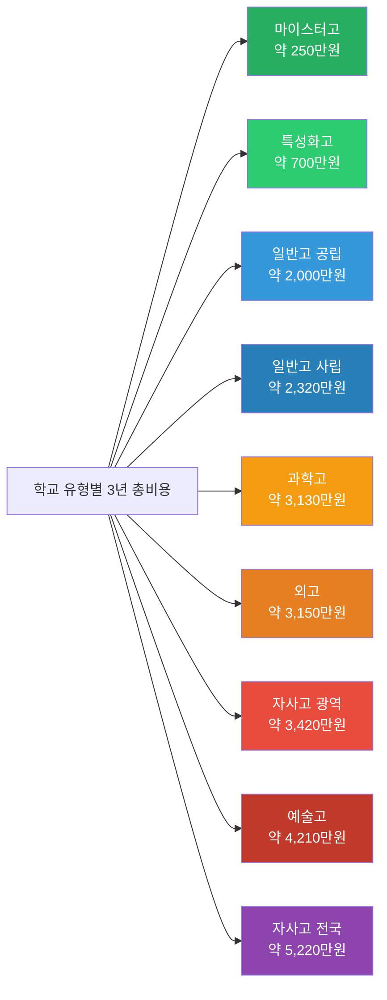
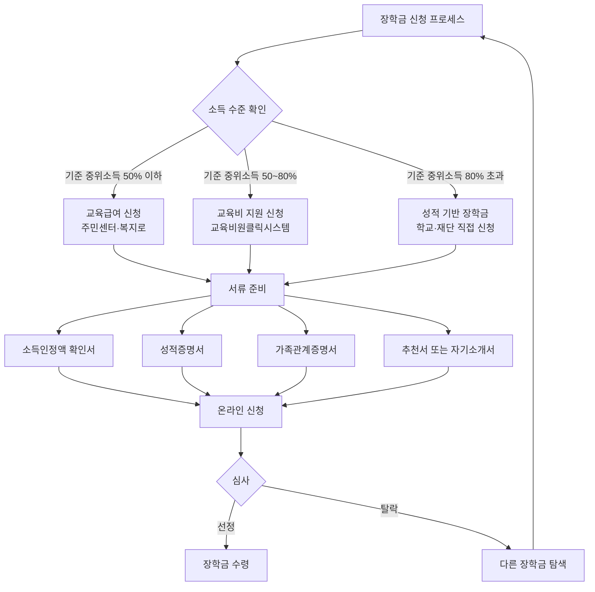
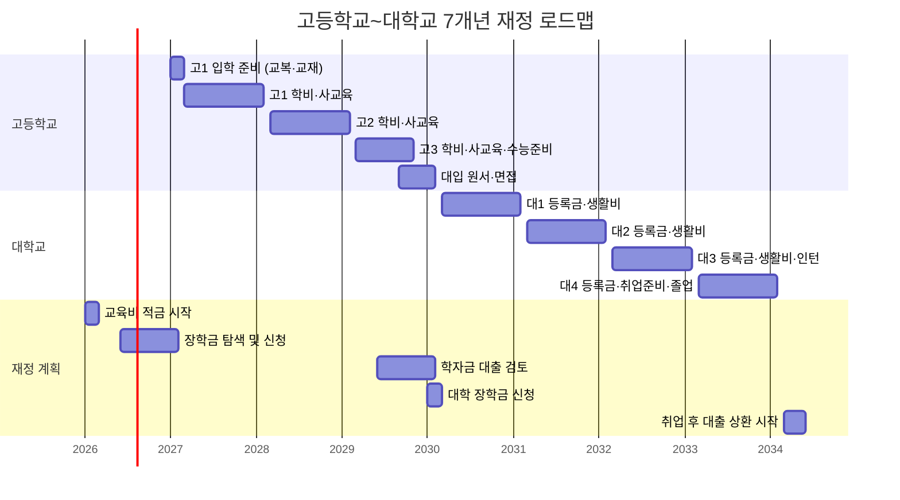
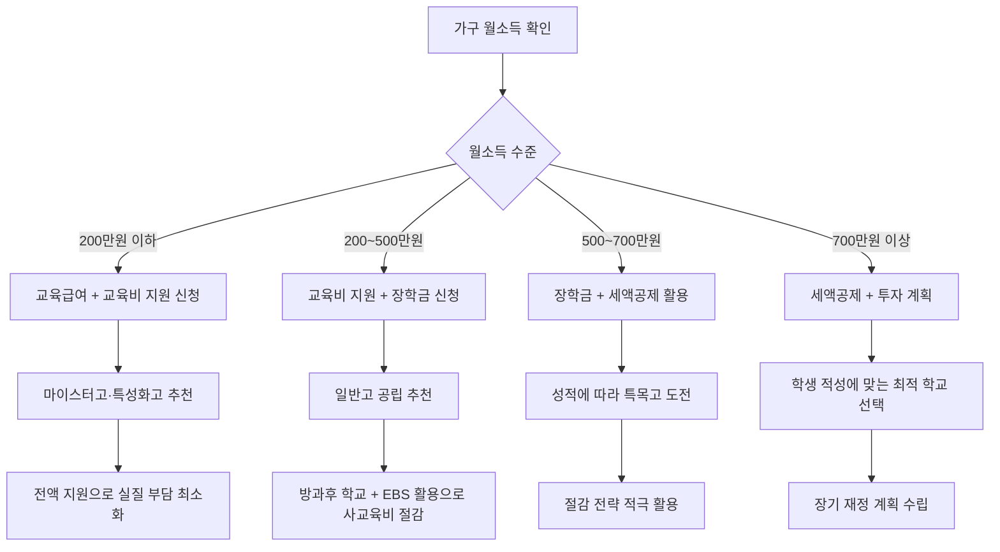
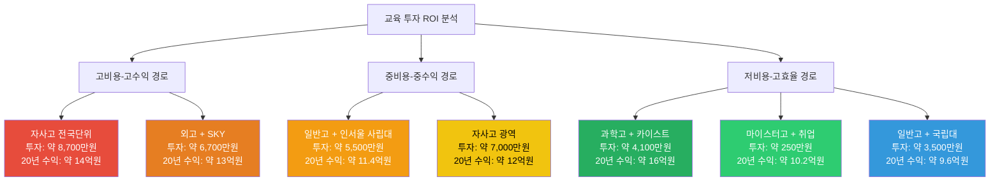

# 고입·대입 교육비 재정 계획

> 2026년 기준 | 고등학교 입학부터 대학 졸업까지, 우리 아이 교육비를 체계적으로 준비하는 완벽 가이드

---

## 목차

1. [학교 유형별 3년 비용 총정리](#1-학교-유형별-3년-비용-총정리)
2. [숨겨진 비용 체크리스트](#2-숨겨진-비용-체크리스트)
3. [장학금·지원금 총정리](#3-장학금지원금-총정리)
4. [교육비 절감 전략 10가지](#4-교육비-절감-전략-10가지)
5. [고등학교~대학교 7개년 재정 로드맵](#5-고등학교대학교-7개년-재정-로드맵)
6. [교육비 관련 세제 혜택](#6-교육비-관련-세제-혜택)
7. [교육 대출 종류와 조건](#7-교육-대출-종류와-조건)
8. [가계 소득별 최적 학교 유형 분석](#8-가계-소득별-최적-학교-유형-분석)
9. [투자 대비 효과 분석 (ROI)](#9-투자-대비-효과-분석-roi)

---

## 1. 학교 유형별 3년 비용 총정리

고등학교 3년간 발생하는 비용은 학교 유형에 따라 크게 달라집니다. 아래에서 각 유형별로 세부 항목을 나누어 정리합니다. 모든 금액은 **2026년 기준 연간 예상 비용**이며, 3년 총액을 함께 표시합니다.

### 1-1. 일반고 (공립)

공립 일반고는 가장 보편적인 선택지로, 수업료가 무상이거나 매우 저렴합니다. 2025년부터 고교 무상교육이 전면 시행되어 입학금과 수업료 부담이 사라졌습니다.

| 비용 항목 | 1학년 (연간) | 2학년 (연간) | 3학년 (연간) | 3년 합계 |
|-----------|------------|------------|------------|---------|
| 수업료 | 0원 (무상교육) | 0원 | 0원 | 0원 |
| 입학금 | 0원 (무상교육) | - | - | 0원 |
| 교과서·교재비 | 약 15만원 | 약 18만원 | 약 20만원 | 약 53만원 |
| 부교재·문제집비 | 약 20만원 | 약 25만원 | 약 35만원 | 약 80만원 |
| 급식비 | 약 70만원 | 약 70만원 | 약 60만원 | 약 200만원 |
| 교복비 (동복·하복) | 약 40만원 | 약 10만원 | 약 10만원 | 약 60만원 |
| 체육복 | 약 8만원 | 약 5만원 | 약 5만원 | 약 18만원 |
| 방과후 수업비 | 약 30만원 | 약 35만원 | 약 25만원 | 약 90만원 |
| 현장학습·수학여행비 | 약 25만원 | 약 30만원 | 약 10만원 | 약 65만원 |
| 학교 운영 지원비 | 약 10만원 | 약 10만원 | 약 10만원 | 약 30만원 |
| EBS 교재·인강비 | 약 5만원 | 약 8만원 | 약 15만원 | 약 28만원 |
| 사교육비 (학원·과외) | 약 360만원 | 약 420만원 | 약 480만원 | 약 1,260만원 |
| 교통비 | 약 40만원 | 약 40만원 | 약 40만원 | 약 120만원 |
| **연간 소계** | **약 623만원** | **약 671만원** | **약 710만원** | **약 2,004만원** |

> 참고: 사교육비는 통계청 2025년 사교육비 조사 기준 고등학생 월평균 약 30~40만원을 반영하였으며, 가정 상황에 따라 큰 편차가 있습니다. 서울 기준 월 50만원 이상 지출 가구도 많습니다.

---

### 1-2. 일반고 (사립)

사립 일반고는 무상교육 대상이지만, 일부 비지정 사립의 경우 수업료가 발생할 수 있습니다. 교육 환경이 상대적으로 우수한 경우가 많아 부가 비용이 다소 높을 수 있습니다.

| 비용 항목 | 1학년 (연간) | 2학년 (연간) | 3학년 (연간) | 3년 합계 |
|-----------|------------|------------|------------|---------|
| 수업료 | 0원 (무상교육) | 0원 | 0원 | 0원 |
| 입학금 | 0원 | - | - | 0원 |
| 교과서·교재비 | 약 18만원 | 약 20만원 | 약 22만원 | 약 60만원 |
| 부교재·문제집비 | 약 25만원 | 약 30만원 | 약 40만원 | 약 95만원 |
| 급식비 | 약 80만원 | 약 80만원 | 약 70만원 | 약 230만원 |
| 교복비 (동복·하복) | 약 50만원 | 약 12만원 | 약 12만원 | 약 74만원 |
| 체육복 | 약 10만원 | 약 5만원 | 약 5만원 | 약 20만원 |
| 방과후 수업비 | 약 40만원 | 약 45만원 | 약 30만원 | 약 115만원 |
| 현장학습·수학여행비 | 약 30만원 | 약 35만원 | 약 15만원 | 약 80만원 |
| 학교 운영 지원비 | 약 15만원 | 약 15만원 | 약 15만원 | 약 45만원 |
| 학교 특별 프로그램비 | 약 20만원 | 약 20만원 | 약 15만원 | 약 55만원 |
| EBS 교재·인강비 | 약 5만원 | 약 10만원 | 약 18만원 | 약 33만원 |
| 사교육비 (학원·과외) | 약 400만원 | 약 460만원 | 약 520만원 | 약 1,380만원 |
| 교통비 | 약 45만원 | 약 45만원 | 약 45만원 | 약 135만원 |
| **연간 소계** | **약 738만원** | **약 777만원** | **약 807만원** | **약 2,322만원** |

---

### 1-3. 자율형 사립고 (전국단위)

전국단위 자사고는 학비가 일반고의 약 3배 수준으로 높으며, 대부분 기숙사 생활을 합니다. 높은 교육 수준과 다양한 프로그램이 장점이지만, 재정적 부담이 상당합니다.

| 비용 항목 | 1학년 (연간) | 2학년 (연간) | 3학년 (연간) | 3년 합계 |
|-----------|------------|------------|------------|---------|
| 수업료 | 약 600만원 | 약 600만원 | 약 600만원 | 약 1,800만원 |
| 입학금 | 약 20만원 | - | - | 약 20만원 |
| 기숙사비 | 약 300만원 | 약 300만원 | 약 300만원 | 약 900만원 |
| 급식비 (기숙사 포함) | 약 150만원 | 약 150만원 | 약 140만원 | 약 440만원 |
| 교과서·교재비 | 약 25만원 | 약 28만원 | 약 30만원 | 약 83만원 |
| 부교재·문제집비 | 약 30만원 | 약 35만원 | 약 45만원 | 약 110만원 |
| 교복비 | 약 55만원 | 약 15만원 | 약 15만원 | 약 85만원 |
| 체육복·생활복 | 약 15만원 | 약 8만원 | 약 8만원 | 약 31만원 |
| 학교 특별 프로그램비 | 약 50만원 | 약 50만원 | 약 40만원 | 약 140만원 |
| 방학 캠프·특강비 | 약 40만원 | 약 40만원 | 약 30만원 | 약 110만원 |
| 현장학습·해외연수비 | 약 80만원 | 약 100만원 | 약 30만원 | 약 210만원 |
| 사교육비 (학원·과외) | 약 300만원 | 약 350만원 | 약 400만원 | 약 1,050만원 |
| 교통비 (귀가 시) | 약 30만원 | 약 30만원 | 약 30만원 | 약 90만원 |
| 개인 용품·생활비 | 약 50만원 | 약 50만원 | 약 50만원 | 약 150만원 |
| **연간 소계** | **약 1,745만원** | **약 1,756만원** | **약 1,718만원** | **약 5,219만원** |

> 참고: 전국단위 자사고의 경우 학교 내 프로그램이 충실하여 사교육 의존도가 일반고보다 낮은 편이지만, 상위권 경쟁이 치열하여 방학 중 과외·학원을 이용하는 학생도 많습니다.

---

### 1-4. 자율형 사립고 (광역단위)

광역단위 자사고는 전국단위 자사고 대비 학비가 다소 낮고, 통학하는 경우가 많습니다. 그러나 일반고보다는 비용이 높습니다.

| 비용 항목 | 1학년 (연간) | 2학년 (연간) | 3학년 (연간) | 3년 합계 |
|-----------|------------|------------|------------|---------|
| 수업료 | 약 400만원 | 약 400만원 | 약 400만원 | 약 1,200만원 |
| 입학금 | 약 15만원 | - | - | 약 15만원 |
| 교과서·교재비 | 약 22만원 | 약 25만원 | 약 28만원 | 약 75만원 |
| 부교재·문제집비 | 약 28만원 | 약 32만원 | 약 42만원 | 약 102만원 |
| 급식비 | 약 85만원 | 약 85만원 | 약 75만원 | 약 245만원 |
| 교복비 | 약 50만원 | 약 12만원 | 약 12만원 | 약 74만원 |
| 체육복 | 약 10만원 | 약 5만원 | 약 5만원 | 약 20만원 |
| 방과후 수업비 | 약 45만원 | 약 50만원 | 약 35만원 | 약 130만원 |
| 학교 특별 프로그램비 | 약 35만원 | 약 35만원 | 약 30만원 | 약 100만원 |
| 현장학습·수학여행비 | 약 40만원 | 약 50만원 | 약 15만원 | 약 105만원 |
| 사교육비 (학원·과외) | 약 350만원 | 약 400만원 | 약 450만원 | 약 1,200만원 |
| 교통비 | 약 50만원 | 약 50만원 | 약 50만원 | 약 150만원 |
| **연간 소계** | **약 1,130만원** | **약 1,144만원** | **약 1,142만원** | **약 3,416만원** |

---

### 1-5. 특목고 - 과학고

과학고는 영재교육 기관으로, 수업료는 비교적 저렴하나 연구 활동비와 기숙사비가 추가됩니다. 조기졸업 시 2년 비용으로 줄어들 수 있습니다.

| 비용 항목 | 1학년 (연간) | 2학년 (연간) | 3학년 (연간) | 3년 합계 |
|-----------|------------|------------|------------|---------|
| 수업료 | 약 120만원 | 약 120만원 | 약 120만원 | 약 360만원 |
| 입학금 | 약 10만원 | - | - | 약 10만원 |
| 기숙사비 | 약 200만원 | 약 200만원 | 약 200만원 | 약 600만원 |
| 급식비 (기숙사 포함) | 약 140만원 | 약 140만원 | 약 130만원 | 약 410만원 |
| 교과서·교재비 | 약 20만원 | 약 22만원 | 약 25만원 | 약 67만원 |
| 부교재·전공서적비 | 약 30만원 | 약 35만원 | 약 40만원 | 약 105만원 |
| 교복비 | 약 45만원 | 약 10만원 | 약 10만원 | 약 65만원 |
| 연구 활동비 | 약 40만원 | 약 50만원 | 약 60만원 | 약 150만원 |
| 실험·실습 재료비 | 약 15만원 | 약 20만원 | 약 25만원 | 약 60만원 |
| 과학 올림피아드·대회 참가비 | 약 20만원 | 약 25만원 | 약 15만원 | 약 60만원 |
| 학술대회·세미나 참가비 | 약 10만원 | 약 15만원 | 약 10만원 | 약 35만원 |
| 노트북·연구 장비 | 약 150만원 | 약 20만원 | 약 20만원 | 약 190만원 |
| 현장학습·연구기관 방문비 | 약 30만원 | 약 35만원 | 약 10만원 | 약 75만원 |
| 사교육비 (심화학습) | 약 200만원 | 약 250만원 | 약 280만원 | 약 730만원 |
| 개인 용품·생활비 | 약 45만원 | 약 45만원 | 약 45만원 | 약 135만원 |
| 교통비 (귀가 시) | 약 25만원 | 약 25만원 | 약 25만원 | 약 75만원 |
| **연간 소계** | **약 1,100만원** | **약 1,012만원** | **약 1,015만원** | **약 3,127만원** |

> 참고: 과학고 학생의 약 60%가 조기졸업(2년)을 하며, 이 경우 3년 합계 대신 2년 합계(약 2,112만원)가 적용됩니다. 또한 과학고는 국가 지원 장학금이 풍부하여 실제 가계 부담은 크게 줄어들 수 있습니다.

---

### 1-6. 특목고 - 외국어고

외고는 어학 중심 교육과정으로, 언어 관련 추가 비용(원어민 수업, 어학시험, 어학연수 등)이 발생합니다.

| 비용 항목 | 1학년 (연간) | 2학년 (연간) | 3학년 (연간) | 3년 합계 |
|-----------|------------|------------|------------|---------|
| 수업료 | 약 150만원 | 약 150만원 | 약 150만원 | 약 450만원 |
| 입학금 | 약 12만원 | - | - | 약 12만원 |
| 교과서·교재비 | 약 22만원 | 약 25만원 | 약 28만원 | 약 75만원 |
| 부교재·원서 교재비 | 약 35만원 | 약 40만원 | 약 45만원 | 약 120만원 |
| 급식비 | 약 80만원 | 약 80만원 | 약 70만원 | 약 230만원 |
| 교복비 | 약 50만원 | 약 12만원 | 약 12만원 | 약 74만원 |
| 어학시험 응시료 (TOEFL, TEPS 등) | 약 25만원 | 약 30만원 | 약 35만원 | 약 90만원 |
| 원어민 수업·회화 추가비 | 약 40만원 | 약 40만원 | 약 30만원 | 약 110만원 |
| 어학연수·해외 프로그램비 | 약 50만원 | 약 200만원 | 0원 | 약 250만원 |
| 방과후 수업비 | 약 40만원 | 약 45만원 | 약 30만원 | 약 115만원 |
| 외국어 관련 대회 참가비 | 약 10만원 | 약 15만원 | 약 10만원 | 약 35만원 |
| 현장학습·수학여행비 | 약 35만원 | 약 40만원 | 약 15만원 | 약 90만원 |
| 사교육비 (학원·과외) | 약 400만원 | 약 450만원 | 약 500만원 | 약 1,350만원 |
| 교통비 | 약 50만원 | 약 50만원 | 약 50만원 | 약 150만원 |
| **연간 소계** | **약 999만원** | **약 1,177만원** | **약 975만원** | **약 3,151만원** |

---

### 1-7. 특목고 - 예술고

예술고는 실기 중심 교육과정으로, 악기 구매·레슨비, 미술 재료비, 공연 관련 비용 등이 추가로 발생합니다.

| 비용 항목 | 1학년 (연간) | 2학년 (연간) | 3학년 (연간) | 3년 합계 |
|-----------|------------|------------|------------|---------|
| 수업료 | 약 130만원 | 약 130만원 | 약 130만원 | 약 390만원 |
| 입학금 | 약 12만원 | - | - | 약 12만원 |
| 교과서·교재비 | 약 18만원 | 약 20만원 | 약 22만원 | 약 60만원 |
| 급식비 | 약 75만원 | 약 75만원 | 약 65만원 | 약 215만원 |
| 교복비 | 약 48만원 | 약 12만원 | 약 12만원 | 약 72만원 |
| 악기 구매·유지비 (음악) | 약 300만원 | 약 50만원 | 약 50만원 | 약 400만원 |
| 개인 레슨비 (실기) | 약 480만원 | 약 520만원 | 약 560만원 | 약 1,560만원 |
| 미술 재료비 (미술) | 약 60만원 | 약 70만원 | 약 80만원 | 약 210만원 |
| 공연·전시 참가비 | 약 30만원 | 약 40만원 | 약 50만원 | 약 120만원 |
| 콩쿠르·대회 참가비 | 약 30만원 | 약 35만원 | 약 40만원 | 약 105만원 |
| 실기 연습실 대여비 | 약 25만원 | 약 30만원 | 약 35만원 | 약 90만원 |
| 현장학습·수학여행비 | 약 30만원 | 약 35만원 | 약 15만원 | 약 80만원 |
| 사교육비 (학과 과목) | 약 200만원 | 약 250만원 | 약 300만원 | 약 750만원 |
| 교통비 | 약 50만원 | 약 50만원 | 약 50만원 | 약 150만원 |
| **연간 소계** | **약 1,488만원** | **약 1,317만원** | **약 1,409만원** | **약 4,214만원** |

> 참고: 예술고 비용은 전공에 따라 큰 편차가 있습니다. 음악 전공(특히 피아노, 바이올린 등)은 악기 구매와 개인 레슨비가 매우 높고, 미술 전공은 재료비가 지속적으로 발생합니다. 무용 전공은 의상비와 공연비가 주요 비용입니다.

---

### 1-8. 특성화고 / 마이스터고

특성화고와 마이스터고는 직업 교육 중심으로, 국가 지원이 풍부하여 비용이 가장 적게 듭니다. 마이스터고는 전액 무상교육과 기숙사 무료 지원이 특징입니다.

| 비용 항목 | 특성화고 (연간) | 마이스터고 (연간) | 특성화고 3년 합계 | 마이스터고 3년 합계 |
|-----------|---------------|----------------|----------------|-----------------|
| 수업료 | 0원 (무상교육) | 0원 (전액 지원) | 0원 | 0원 |
| 입학금 | 0원 | 0원 | 0원 | 0원 |
| 기숙사비 | 해당없음 | 0원 (전액 지원) | 0원 | 0원 |
| 급식비 | 약 70만원 | 0원 (전액 지원) | 약 210만원 | 0원 |
| 교과서·교재비 | 약 12만원 | 0원 (전액 지원) | 약 36만원 | 0원 |
| 실습 재료비 | 약 15만원 | 약 5만원 | 약 45만원 | 약 15만원 |
| 교복비 | 약 40만원 | 약 20만원 (일부 지원) | 약 60만원 | 약 40만원 |
| 자격증 응시료 | 약 10만원 | 약 10만원 | 약 30만원 | 약 30만원 |
| 현장실습 교통비 | 약 15만원 | 약 10만원 (지원) | 약 45만원 | 약 30만원 |
| 사교육비 | 약 50만원 | 약 30만원 | 약 150만원 | 약 90만원 |
| 교통비 | 약 40만원 | 약 15만원 (귀가 시) | 약 120만원 | 약 45만원 |
| **연간 소계** | **약 252만원** | **약 90만원** | **약 696만원** | **약 250만원** |

> 비용 절감 포인트: 마이스터고는 입학부터 졸업까지 거의 모든 비용이 국가·기업 지원으로 충당됩니다. 졸업 후 우수 기업 취업이 보장되는 경우도 많아 대학 진학 비용까지 절감할 수 있습니다. 특성화고도 다양한 장학금과 국가 지원을 활용하면 실질 부담을 크게 줄일 수 있습니다.

---

### 학교 유형별 3년 총비용 비교 요약

| 학교 유형 | 3년 총비용 (예상) | 사교육비 포함 비중 | 비고 |
|-----------|-----------------|-----------------|------|
| 일반고 (공립) | 약 2,000만원 | 약 63% | 가장 보편적 |
| 일반고 (사립) | 약 2,320만원 | 약 59% | 공립 대비 소폭 상승 |
| 자사고 (전국단위) | 약 5,220만원 | 약 20% | 학비·기숙사비 비중 높음 |
| 자사고 (광역단위) | 약 3,420만원 | 약 35% | 전국단위 대비 저렴 |
| 과학고 | 약 3,130만원 | 약 23% | 조기졸업 시 약 2,110만원 |
| 외고 | 약 3,150만원 | 약 43% | 어학 관련 부가비용 |
| 예술고 | 약 4,210만원 | 약 18% (학과사교육) | 실기 레슨비 비중 매우 높음 |
| 특성화고 | 약 700만원 | 약 22% | 국가 지원 혜택 |
| 마이스터고 | 약 250만원 | 약 36% | 거의 전액 지원 |

---

## 2. 숨겨진 비용 체크리스트

학교 공식 안내에 나오지 않지만 실제로 발생하는 비용들이 있습니다. 아래 체크리스트를 통해 놓치기 쉬운 비용들을 미리 파악하세요.

| 구분 | 숨겨진 비용 항목 | 예상 금액 (연간) | 해당 학교 유형 | 발생 시기 |
|------|----------------|----------------|--------------|----------|
| 학업 | 자습서·참고서 추가 구매 | 10~30만원 | 전체 | 학기 중 수시 |
| 학업 | 모의고사 응시료 (사설) | 5~15만원 | 전체 | 3학년 집중 |
| 학업 | 인터넷 강의 수강료 | 10~50만원 | 전체 | 연중 |
| 학업 | 스터디카페·독서실 비용 | 20~60만원 | 전체 | 2~3학년 |
| 학업 | 노트북·태블릿 구매 | 80~200만원 | 전체 (특히 과학고) | 입학 시 |
| 학업 | 프린터·인쇄 비용 | 5~10만원 | 전체 | 연중 |
| 생활 | 간식·야식비 (야자 시) | 30~50만원 | 전체 | 연중 |
| 생활 | 기숙사 생활용품 | 20~40만원 | 기숙형 학교 | 입학 시 |
| 생활 | 기숙사 세탁비 | 5~10만원 | 기숙형 학교 | 연중 |
| 생활 | 교우 관계 비용 (생일, 단체활동) | 15~30만원 | 전체 | 연중 |
| 생활 | 학급비·반티 제작비 | 3~5만원 | 전체 | 학기 초 |
| 생활 | 졸업앨범·졸업사진비 | 5~10만원 | 전체 | 3학년 |
| 교통 | 등하교 교통카드 외 택시비 | 10~30만원 | 통학 학생 | 연중 |
| 교통 | 기숙사 귀가 교통비 | 15~30만원 | 기숙형 학교 | 주말·방학 |
| 활동 | 동아리 활동비 | 5~20만원 | 전체 | 연중 |
| 활동 | 봉사활동 교통비·물품비 | 5~15만원 | 전체 | 연중 |
| 활동 | 경시대회·토론대회 참가비 | 10~30만원 | 전체 | 연중 |
| 활동 | 포트폴리오·생기부 관련 비용 | 10~50만원 | 전체 (특히 특목·자사고) | 연중 |
| 입시 | 대학 원서 접수비 | 30~60만원 | 전체 | 3학년 |
| 입시 | 면접 복장·준비비 | 10~30만원 | 전체 | 3학년 |
| 입시 | 수능 응시료 | 약 3만원 | 전체 | 3학년 |
| 입시 | 대학 면접 교통비·숙박비 | 10~50만원 | 전체 (지방 학생) | 3학년 |
| 건강 | 교정·치과 비용 | 50~300만원 | 전체 | 비정기 |
| 건강 | 시력 교정 (안경·렌즈) | 10~30만원 | 전체 | 연중 |
| 건강 | 체력 관리 (헬스·운동) | 20~50만원 | 전체 | 연중 |
| **합계** | **숨겨진 비용 총합 (연간)** | **약 100~400만원** | - | - |

> 주의: 위 비용들은 학교 공식 납입금에 포함되지 않아 예산 수립 시 누락되기 쉽습니다. 특히 3학년 입시 관련 비용은 집중적으로 발생하므로 미리 준비해두는 것이 좋습니다.

---

## 3. 장학금·지원금 총정리

교육비 부담을 줄이기 위해 활용할 수 있는 다양한 장학금과 지원금을 정리합니다.

### 3-1. 국가 장학금

| 장학금명 | 지원 대상 | 지원 금액 | 소득 기준 | 신청 시기 |
|---------|----------|----------|----------|----------|
| 교육급여 (초중고) | 기초생활수급자 (교육급여 수급권자) | 연 약 72만원 (고등학생) | 기준 중위소득 50% 이하 | 매년 3월 |
| 교육비 지원 (시도교육청) | 저소득층 학생 | 학비·급식비·방과후 수업비 | 기준 중위소득 60% 이하 | 연초 |
| 국가우수장학금 (이공계) | 이공계 우수 대학생 | 등록금 전액 + 생활비 | 성적 기준 | 대학 입학 후 |
| 국가근로장학금 | 대학생 | 시간당 약 12,220원 | 소득 8구간 이하 | 학기별 |
| 한국장학재단 국가장학금 I유형 | 대학생 | 최대 연 700만원 | 소득 구간별 | 학기별 |
| 한국장학재단 국가장학금 II유형 | 대학생 | 대학별 상이 | 대학별 기준 | 학기별 |
| 다자녀 국가장학금 | 3자녀 이상 가구 대학생 | 등록금 전액 | 소득 8구간 이하 | 학기별 |
| 지역인재장학금 | 비수도권 고교 출신 대학생 | 등록금 전액 + 생활비 | 소득 8구간 이하 | 대학 입학 후 |

### 3-2. 지자체 장학금

| 지자체 | 장학금명 | 지원 대상 | 지원 금액 | 신청 시기 |
|--------|---------|----------|----------|----------|
| 서울특별시 | 서울장학재단 장학금 | 서울 거주 저소득 학생 | 고교 50~100만원 | 연 2회 |
| 경기도 | 경기꿈나래장학금 | 경기도 거주 학생 | 고교 50만원, 대학 200만원 | 연 1회 |
| 부산광역시 | 부산인재장학금 | 부산 거주 우수 학생 | 최대 200만원 | 연 1회 |
| 대구광역시 | 대구장학회 장학금 | 대구 거주 학생 | 50~150만원 | 연 1회 |
| 인천광역시 | 인천장학재단 장학금 | 인천 거주 학생 | 고교 50만원, 대학 150만원 | 연 2회 |
| 광주광역시 | 광주인재육성장학금 | 광주 거주 학생 | 최대 200만원 | 연 1회 |
| 대전광역시 | 대전인재장학금 | 대전 거주 학생 | 50~100만원 | 연 1회 |
| 세종특별자치시 | 세종장학금 | 세종 거주 학생 | 50~100만원 | 연 1회 |
| 각 시·군·구 | 지역 자체 장학금 | 해당 지역 거주 학생 | 30~100만원 | 지역별 상이 |

### 3-3. 재단 장학금

| 재단명 | 장학금명 | 지원 대상 | 지원 금액 (연간) | 특이 사항 |
|--------|---------|----------|----------------|----------|
| 삼성꿈장학재단 | 삼성꿈장학금 | 저소득층 우수 학생 | 고교 200만원, 대학 500만원 | 멘토링 프로그램 포함 |
| 포스코청암재단 | 포스코장학금 | 이공계 우수 학생 | 등록금 전액 | 포스코 연계 프로그램 |
| 관정이종환교육재단 | 관정장학금 | 성적 우수 학생 | 등록금 + 생활비 | 해외유학 장학금도 있음 |
| 정수장학회 | 정수장학금 | 저소득층 학생 | 100~300만원 | 공무원 자녀 우대 |
| 아산사회복지재단 | 아산장학금 | 저소득층 우수 학생 | 등록금 전액 | 의료계열 우대 |
| KT&G장학재단 | 상상장학금 | 대학생 | 등록금 전액 | 문화·예술 분야 포함 |
| 한화그룹 | 한화장학금 | 과학 우수 학생 | 200~400만원 | 과학 분야 특화 |
| LG연암문화재단 | LG의인상 장학금 | 사회공헌 학생 | 100~200만원 | 사회봉사 실적 중시 |
| 롯데장학재단 | 롯데장학금 | 저소득층 대학생 | 등록금 전액 | 롯데그룹 인턴 연계 |
| 현대차정몽구재단 | 온드림장학금 | 저소득층 학생 | 고교~대학 전액 | 통합 지원 프로그램 |

### 3-4. 학교별 장학금

| 장학금 유형 | 지원 대상 | 일반적 지원 금액 | 비고 |
|------------|----------|----------------|------|
| 입학성적 우수 장학금 | 입학 성적 상위 학생 | 등록금 50~100% 감면 | 자사고·특목고에서 주로 운영 |
| 재학 중 성적 우수 장학금 | 학기별 성적 우수자 | 등록금 30~100% 감면 | 매 학기 심사 |
| 교내 근로 장학금 | 재학생 | 월 10~30만원 | 도서관·행정실 근무 |
| 특기 장학금 | 체육·예술 특기생 | 등록금 전액 | 대회 실적 기준 |
| 형제자매 재학 장학금 | 같은 학교 형제자매 | 등록금 20~50% 감면 | 일부 사립학교 |
| 가계곤란 장학금 | 경제적 어려움 학생 | 등록금 50~100% 감면 | 증빙 서류 필요 |

### 3-5. 장학금 신청 방법 및 자격 요건 총정리

**주요 신청 플랫폼:**

- 한국장학재단 (kosaf.go.kr): 국가장학금, 학자금 대출
- 교육비원클릭시스템 (oneclick.moe.go.kr): 교육급여, 교육비 지원
- 복지로 (bokjiro.go.kr): 복지 관련 교육 지원금
- 각 지자체 홈페이지: 지역 장학금
- 각 재단 홈페이지: 민간 장학금

---

## 4. 교육비 절감 전략 10가지

### 전략 1: 교복 물려받기·중고 구매 활용

교복비는 입학 시 40~55만원이 드는 큰 지출입니다. 선배나 지인에게 물려받거나, 학교 앞 중고 교복 매장, 온라인 중고 거래 플랫폼을 활용하면 50~80% 절감할 수 있습니다. 일부 지자체에서는 교복 지원금(10~20만원)을 제공하므로 반드시 확인하세요.

### 전략 2: 방과후 학교 프로그램 적극 활용

학교 방과후 수업은 사교육 대비 10분의 1 수준의 비용으로 양질의 교육을 받을 수 있습니다. 특히 EBS 연계 수업, 논술 수업, 예체능 수업 등은 학원비 절감에 큰 도움이 됩니다. 연간 약 200~300만원의 사교육비를 줄일 수 있습니다.

### 전략 3: EBS 교재와 인강 중심 학습

EBS 교재는 시중 참고서 대비 50% 이상 저렴하며, 인터넷 강의는 무료로 제공됩니다. 수능 연계율이 높아 학습 효과도 우수합니다. 연간 약 100~200만원의 교재비·인강비를 절감할 수 있습니다.

### 전략 4: 교육비 세액공제 100% 활용

연말정산 시 교육비 세액공제를 빠짐없이 신청하세요. 고등학생 자녀 1인당 연 300만원 한도 내에서 15% 세액공제를 받을 수 있습니다. 최대 연 45만원의 세금 환급 효과가 있습니다. (자세한 내용은 6장 참고)

### 전략 5: 급식비 지원 제도 활용

기초생활수급자, 차상위계층, 한부모가정 등은 급식비 전액 지원을 받을 수 있습니다. 또한 일부 지자체에서는 소득 기준과 무관하게 무상급식을 실시하고 있으므로 해당 여부를 확인하세요.

### 전략 6: 학원비 대신 스터디 그룹 활용

학생들끼리 스터디 그룹을 구성하면 학원비를 크게 줄일 수 있습니다. 지역 도서관의 무료 스터디룸을 활용하고, 온라인 무료 학습 자료(KOCW, K-MOOC 등)를 병행하면 효과적입니다. 특히 상위권 학생일수록 자기주도학습이 효율적입니다.

### 전략 7: 복수 장학금 동시 신청

장학금은 중복 수혜가 가능한 경우가 많습니다. 국가 장학금, 지자체 장학금, 재단 장학금, 학교 장학금을 동시에 신청하여 최대한 많은 혜택을 받으세요. 평균적으로 3~5개 장학금에 동시 지원이 가능합니다.

### 전략 8: 교육비 전용 적금 활용

자녀 교육비 전용 적금 상품을 활용하면 이자 수입과 세제 혜택을 동시에 누릴 수 있습니다. 청년저축계좌, 교육적금 등 정부 지원 금융 상품을 활용하면 연 2~5% 추가 수익을 얻을 수 있습니다.

### 전략 9: 중고 교재·참고서 구매

신학기 교과서는 학교에서 무상으로 배부되지만, 문제집과 참고서는 별도 구매해야 합니다. 온라인 중고서점(알라딘 중고, 예스24 중고)을 활용하면 정가의 30~60%에 구매할 수 있습니다. 연간 약 10~20만원 절감 가능합니다.

### 전략 10: 교통비 절감 (통학버스·자전거)

학교 통학버스가 있다면 활용하고, 근거리 통학 시 자전거를 이용하면 월 3~5만원의 교통비를 절감할 수 있습니다. 또한 청소년 교통카드 할인, 지자체 교통비 지원(연 12~24만원) 등을 활용하세요.

**교육비 절감 효과 요약:**

| 전략 | 연간 절감 예상액 | 3년 절감 합계 | 실행 난이도 |
|------|-----------------|-------------|-----------|
| 교복 물려받기·중고 | 15~35만원 | 45~105만원 | 쉬움 |
| 방과후 학교 활용 | 200~300만원 | 600~900만원 | 쉬움 |
| EBS 교재·인강 | 100~200만원 | 300~600만원 | 쉬움 |
| 교육비 세액공제 | 최대 45만원 | 최대 135만원 | 보통 |
| 급식비 지원 | 최대 70만원 | 최대 210만원 | 보통 |
| 스터디 그룹 | 150~250만원 | 450~750만원 | 보통 |
| 복수 장학금 | 100~500만원 | 300~1,500만원 | 어려움 |
| 교육비 전용 적금 | 이자 수익 | 복리 효과 | 쉬움 |
| 중고 교재 구매 | 10~20만원 | 30~60만원 | 쉬움 |
| 교통비 절감 | 20~60만원 | 60~180만원 | 쉬움 |
| **합계** | **약 700~1,500만원** | **약 2,000~4,500만원** | - |

---

## 5. 고등학교~대학교 7개년 재정 로드맵

고등학교 입학(1년차)부터 대학교 졸업(7년차)까지의 장기 재정 계획을 수립합니다.

### 5-1. 연도별 예상 비용 (일반고 공립 + 4년제 대학 기준)

| 연차 | 시기 | 주요 비용 항목 | 예상 비용 | 누적 비용 |
|------|------|-------------|----------|----------|
| 1년차 | 고1 | 교복·교재·급식·사교육·방과후 | 약 620만원 | 약 620만원 |
| 2년차 | 고2 | 교재·급식·사교육·방과후 | 약 670만원 | 약 1,290만원 |
| 3년차 | 고3 | 교재·급식·사교육·수능·원서 | 약 750만원 | 약 2,040만원 |
| 4년차 | 대1 | 등록금·교재·기숙사/자취·생활비 | 약 1,200만원 | 약 3,240만원 |
| 5년차 | 대2 | 등록금·교재·생활비·활동비 | 약 1,150만원 | 약 4,390만원 |
| 6년차 | 대3 | 등록금·교재·생활비·인턴·취업준비 | 약 1,250만원 | 약 5,640만원 |
| 7년차 | 대4 | 등록금·교재·생활비·취업준비·졸업 | 약 1,350만원 | 약 6,990만원 |

> 대학 비용은 인서울 4년제 대학 인문계열 기준이며, 의약학·예체능 계열은 등록금이 50~100% 더 높을 수 있습니다. 자취 비용(월세·생활비)은 서울 기준으로 산정하였습니다.

### 5-2. 대학 등록금 상세 (2026년 기준 예상)

| 대학 유형 | 계열 | 연간 등록금 | 4년 합계 |
|-----------|------|-----------|---------|
| 국립대 | 인문사회 | 약 220만원 | 약 880만원 |
| 국립대 | 자연과학 | 약 260만원 | 약 1,040만원 |
| 국립대 | 공학 | 약 290만원 | 약 1,160만원 |
| 국립대 | 의학 | 약 350만원 | 약 2,100만원 (6년) |
| 사립대 | 인문사회 | 약 680만원 | 약 2,720만원 |
| 사립대 | 자연과학 | 약 780만원 | 약 3,120만원 |
| 사립대 | 공학 | 약 850만원 | 약 3,400만원 |
| 사립대 | 의학 | 약 1,000만원 | 약 6,000만원 (6년) |
| 사립대 | 예체능 | 약 900만원 | 약 3,600만원 |

### 5-3. 7개년 재정 타임라인

### 5-4. 저축 계획 템플릿

아래는 7개년 교육비를 대비한 월별 저축 계획 템플릿입니다.

| 저축 시기 | 목표 시점 | 월 저축액 | 누적 저축액 | 목적 |
|----------|----------|----------|-----------|------|
| 고입 2년 전~ | 고1 입학 | 월 50만원 x 24개월 | 1,200만원 | 고등학교 3년 비용 대비 |
| 고1~고2 | 고3 수능 | 월 30만원 x 24개월 | 720만원 | 수험·입시 비용 대비 |
| 고3 | 대학 입학 | 월 50만원 x 12개월 | 600만원 | 대학 1년차 비용 대비 |
| 대학 재학 중 | 다음 학기 | 월 20만원 (근로장학금 등) | 학기별 240만원 | 차기 등록금 마련 |
| 대학 졸업 후 | 대출 상환 | 월 30~50만원 | - | 학자금 대출 상환 |

**소득 수준별 저축 권장액:**

| 가구 월소득 | 교육비 저축 비율 | 월 저축 권장액 | 연간 저축액 | 비고 |
|------------|----------------|-------------|-----------|------|
| 300만원 이하 | 10~15% | 30~45만원 | 360~540만원 | 장학금·지원금 적극 활용 |
| 300~500만원 | 15~20% | 45~100만원 | 540~1,200만원 | 절감 전략 병행 |
| 500~700만원 | 20~25% | 100~175만원 | 1,200~2,100만원 | 투자 병행 고려 |
| 700만원 이상 | 20~30% | 140~210만원 | 1,680~2,520만원 | 다양한 금융상품 활용 |

---

## 6. 교육비 관련 세제 혜택

### 6-1. 교육비 세액공제

교육비 세액공제는 근로소득자가 자녀의 교육비를 지출한 경우, 해당 금액의 15%를 산출세액에서 공제받을 수 있는 제도입니다.

| 구분 | 공제 한도 | 공제율 | 최대 공제액 | 대상 |
|------|----------|-------|-----------|------|
| 초·중·고등학생 | 1인당 연 300만원 | 15% | 45만원 | 수업료, 입학금, 급식비, 방과후 수업비, 교과서 대금, 교복 구입비 |
| 대학생 | 1인당 연 900만원 | 15% | 135만원 | 등록금, 수업료 |
| 대학원생 | 1인당 연 900만원 | 15% | 135만원 | 등록금, 수업료 |
| 장애인 특수교육비 | 한도 없음 | 15% | 무제한 | 사회복지시설, 특수교육비 |

**교육비 세액공제 대상 항목 상세:**

| 공제 가능 항목 | 공제 불가 항목 |
|--------------|--------------|
| 수업료·입학금 | 학원비 (미취학 아동 제외) |
| 급식비 | 개인 과외비 |
| 방과후 학교 수업료 | 교구 구입비 |
| 교과서 구입비 | 교통비 |
| 교복 구입비 (중·고, 1인당 50만원 한도) | 기숙사비 |
| 체험학습비 (1인당 30만원 한도) | 해외 연수비 |
| 대학 등록금 | EBS 인강 수강료 |

### 6-2. 연말정산 활용법

연말정산 시 교육비 관련 공제를 최대화하기 위한 체크리스트입니다.

| 단계 | 행동 | 시기 | 유의사항 |
|------|------|------|---------|
| 1단계 | 연간 교육비 지출 내역 정리 | 매년 12월 | 영수증 보관 필수 |
| 2단계 | 국세청 연말정산 간소화 서비스 확인 | 1월 중순 | 누락 항목 확인 |
| 3단계 | 교복 구입비 영수증 별도 제출 | 1~2월 | 신용카드 영수증 또는 현금영수증 |
| 4단계 | 방과후 수업비 납입증명서 발급 | 1~2월 | 학교에 요청 |
| 5단계 | 체험학습비 증빙 서류 준비 | 1~2월 | 학교 발행 확인서 |
| 6단계 | 공제 신청서 작성 및 제출 | 2월 | 회사 경리팀 제출 |

### 6-3. 항목별 공제 한도 총정리

| 항목 | 한도 | 공제율 | 비고 |
|------|------|-------|------|
| 고등학생 교육비 | 연 300만원/인 | 15% | 수업료, 입학금, 급식비, 방과후, 교과서 |
| 교복 구입비 | 연 50만원/인 | 15% | 중·고등학생, 교복 구입비에 한정 |
| 체험학습비 | 연 30만원/인 | 15% | 현장체험학습, 수학여행 등 |
| 대학생 교육비 | 연 900만원/인 | 15% | 등록금, 수업료 |
| 학자금 대출 원리금 상환 | 공제 한도 내 | 15% | 본인 교육비에 한함 |
| 자녀세액공제 | 1인 15만원, 2인 35만원, 3인+ 35만원+추가 30만원 | - | 교육비와 별도 |

---

## 7. 교육 대출 종류와 조건

### 7-1. 학자금 대출 유형 비교

| 대출 유형 | 대상 | 금리 (2026년 기준) | 상환 방식 | 대출 한도 | 거치 기간 |
|-----------|------|------------------|----------|----------|----------|
| 취업 후 상환 학자금 대출 (ICL) | 학부생 (만 35세 이하), 소득 8구간 이하 | 연 1.7% (변동) | 취업 후 소득 연계 상환 | 등록금 전액 + 생활비 연 400만원 | 졸업 후 취업 시까지 |
| 일반 상환 학자금 대출 | 학부생·대학원생 | 연 2.2% (변동) | 매월 원리금 균등 상환 | 등록금 전액 + 생활비 연 400만원 | 최대 2년 |
| 농촌학자금융자 | 농어촌 거주 학생 | 무이자~연 1.0% | 취업 후 상환 | 등록금 전액 | 졸업 후 2년 |
| 장애인학생 학자금 대출 | 장애인 학생 | 무이자 | 취업 후 상환 | 등록금 전액 + 생활비 | 졸업 후 취업 시까지 |

### 7-2. 취업 후 상환 학자금 대출 (ICL) 상세

| 항목 | 내용 |
|------|------|
| 상환 기준 소득 | 연 소득 약 1,452만원 초과 시 상환 시작 (2026년 기준) |
| 의무 상환율 | 소득 구간별 20% 이내 |
| 상환 방법 | 원천징수(급여에서 자동 공제) 또는 자발적 상환 |
| 최대 상환 기간 | 상환 완료 시까지 (별도 기한 없음) |
| 이자 면제 | 기초생활수급자, 차상위계층은 이자 면제 |
| 재학 중 이자 | 발생하나 납부 유예 가능 |

### 7-3. 상환 시뮬레이션

아래는 사립대 4년간 학자금 대출(ICL) 이용 시 상환 시뮬레이션입니다.

| 항목 | 금액 |
|------|------|
| 4년간 총 대출금 (등록금) | 약 2,720만원 |
| 4년간 생활비 대출 | 약 1,600만원 |
| 총 대출 원금 | 약 4,320만원 |
| 대학 재학 중 발생 이자 (4년) | 약 290만원 |
| 총 상환액 (원금+이자) | 약 4,610만원 |
| 취업 후 월 상환액 (연봉 3,000만원 기준) | 약 15~20만원 |
| 예상 상환 기간 | 약 20~25년 |

### 7-4. 신청 자격 요약

| 자격 요건 | 취업 후 상환 (ICL) | 일반 상환 |
|-----------|------------------|----------|
| 나이 | 만 35세 이하 | 제한 없음 |
| 소득 구간 | 8구간 이하 | 제한 없음 |
| 성적 | 직전 학기 평점 C학점 이상 | 직전 학기 평점 C학점 이상 |
| 이수 학점 | 12학점 이상 (학기당) | 12학점 이상 |
| 등록 횟수 | 정규 학기 미초과 | 정규 학기 미초과 |
| 신용 | 신용유의자 아닐 것 | 신용유의자 아닐 것 |
| 연체 | 학자금 대출 연체 없을 것 | 학자금 대출 연체 없을 것 |

---

## 8. 가계 소득별 최적 학교 유형 분석

### 8-1. 소득 구간별 추천 학교 유형

| 소득 구간 (월) | 추천 학교 유형 | 추천 이유 | 예상 3년 비용 | 활용 가능 지원 |
|---------------|-------------|----------|-------------|-------------|
| 200만원 이하 | 마이스터고 / 특성화고 | 무상교육, 취업 보장 | 250~700만원 | 교육급여, 교육비 지원, 급식비 전액 지원 |
| 200~350만원 | 일반고 (공립) / 특성화고 | 무상교육, 사교육 최소화 | 700~1,500만원 | 교육비 지원, 장학금, 급식비 지원 |
| 350~500만원 | 일반고 (공립/사립) | 무상교육 혜택, 방과후 활용 | 1,500~2,300만원 | 일부 장학금, 교육비 세액공제 |
| 500~700만원 | 일반고 / 외고 / 과학고 | 성적 우수 시 특목고 도전 가능 | 2,000~3,200만원 | 성적 장학금, 세액공제 |
| 700~1,000만원 | 일반고 / 외고 / 과학고 / 자사고 (광역) | 다양한 선택지 가능 | 2,000~3,500만원 | 세액공제, 일부 장학금 |
| 1,000만원 이상 | 전 유형 가능 (자사고 전국 포함) | 비용 부담 적음, 최적 선택 가능 | 2,000~5,500만원 | 세액공제 |

### 8-2. 소득 구간별 지원 가능 장학금 매칭

| 소득 구간 | 교육급여 | 교육비 지원 | 국가장학금 I유형 | 지자체 장학금 | 재단 장학금 | 학교 성적 장학금 |
|----------|---------|-----------|-------------|------------|-----------|---------------|
| 1구간 (기초) | O | O | 전액 (700만원) | O | O (우선) | O |
| 2구간 | X | O | 전액 (700만원) | O | O (우선) | O |
| 3구간 | X | O | 전액 (700만원) | O | O | O |
| 4구간 | X | 일부 | 390만원 | O | O | O |
| 5구간 | X | 일부 | 390만원 | 일부 | O | O |
| 6구간 | X | X | 390만원 | 일부 | 일부 | O |
| 7구간 | X | X | 350만원 | 일부 | 일부 | O |
| 8구간 | X | X | 350만원 | X | 일부 | O |
| 9~10구간 | X | X | X | X | 일부 | O |

### 8-3. 소득 구간별 재정 전략 플로우차트

---

## 9. 투자 대비 효과 분석 (ROI)

교육비 지출은 단순한 비용이 아니라 자녀의 미래를 위한 투자입니다. 학교 유형별로 투자 대비 효과를 분석합니다.

### 9-1. 학교 유형별 주요 진학 실적 (2025~2026년 기준)

| 학교 유형 | 서울대 진학률 | SKY 진학률 | 의약학계열 진학률 | 주요 대학 진학률 (상위 15개 대학) | 취업률 (특성화·마이스터) |
|-----------|------------|-----------|----------------|-------------------------------|---------------------|
| 일반고 (공립) | 약 0.3% | 약 2.5% | 약 1.0% | 약 15% | - |
| 일반고 (사립) | 약 0.5% | 약 3.5% | 약 1.5% | 약 20% | - |
| 자사고 (전국단위) | 약 8% | 약 25% | 약 5% | 약 60% | - |
| 자사고 (광역단위) | 약 3% | 약 12% | 약 3% | 약 35% | - |
| 과학고 | 약 15% | 약 35% | 약 3% | 약 70% | - |
| 외고 | 약 5% | 약 20% | 약 2% | 약 50% | - |
| 예술고 | 약 1% | 약 5% | - | 약 30% (예술대 포함) | - |
| 특성화고 | - | - | - | 약 10% (진학 선택 시) | 약 70% |
| 마이스터고 | - | - | - | 약 5% (진학 선택 시) | 약 90% |

### 9-2. 장기 수익률 비교 (20년 기준)

아래 표는 각 학교 유형별로 고등학교~대학교 총 교육비 투자 대비, 졸업 후 20년간의 예상 누적 소득을 비교한 것입니다.

| 학교 유형 | 고교 3년 비용 | 대학 4년 비용 | 총 교육 투자 | 졸업 후 초봉 (연) | 20년 누적 소득 (예상) | 투자 대비 수익률 |
|-----------|-------------|-------------|-------------|-----------------|-------------------|---------------|
| 일반고 + 지방 국립대 | 2,000만원 | 1,500만원 | 3,500만원 | 3,200만원 | 약 9.6억원 | 약 27배 |
| 일반고 + 인서울 사립대 | 2,000만원 | 3,500만원 | 5,500만원 | 3,800만원 | 약 11.4억원 | 약 21배 |
| 자사고 + SKY 대학 | 5,200만원 | 3,500만원 | 8,700만원 | 4,500만원 | 약 14.0억원 | 약 16배 |
| 과학고 + 카이스트 | 3,100만원 | 1,000만원 | 4,100만원 | 5,000만원 | 약 16.0억원 | 약 39배 |
| 외고 + SKY 대학 | 3,200만원 | 3,500만원 | 6,700만원 | 4,200만원 | 약 13.0억원 | 약 19배 |
| 특성화고 + 취업 | 700만원 | 0원 | 700만원 | 2,800만원 | 약 9.0억원 | 약 129배 |
| 마이스터고 + 취업 | 250만원 | 0원 | 250만원 | 3,200만원 | 약 10.2억원 | 약 408배 |

> 주의: 위 수치는 단순 산술 비교이며, 개인의 역량, 전공, 경제 상황 등에 따라 크게 달라질 수 있습니다. ROI가 높다고 반드시 좋은 선택이라는 의미는 아닙니다.

### 9-3. ROI 비교 다이어그램

### 9-4. 학교 유형별 선택 의사결정 가이드

| 고려 요소 | 가중치 | 일반고 | 자사고 | 과학고 | 외고 | 예술고 | 특성화/마이스터 |
|-----------|--------|--------|--------|--------|------|--------|---------------|
| 교육비 부담 | 25% | 낮음 (5점) | 높음 (2점) | 보통 (3점) | 보통 (3점) | 높음 (2점) | 매우 낮음 (5점) |
| 대학 진학률 | 20% | 보통 (3점) | 높음 (5점) | 매우 높음 (5점) | 높음 (4점) | 보통 (3점) | 낮음 (2점) |
| 취업 경쟁력 | 20% | 보통 (3점) | 높음 (4점) | 높음 (4점) | 높음 (4점) | 분야별 (3점) | 매우 높음 (5점) |
| 장학금 기회 | 15% | 보통 (3점) | 있음 (3점) | 많음 (5점) | 있음 (3점) | 있음 (3점) | 많음 (5점) |
| 학생 적합성 | 20% | 범용 (3점) | 상위권 (4점) | 과학 영재 (5점) | 어학 우수 (4점) | 예술 특기 (5점) | 직업 관심 (5점) |
| **가중 평균** | 100% | **3.5점** | **3.5점** | **4.3점** | **3.6점** | **3.1점** | **4.4점** |

---

## 부록: 주요 참고 자료 및 사이트

| 분야 | 사이트명 | URL | 용도 |
|------|---------|-----|------|
| 장학금 | 한국장학재단 | kosaf.go.kr | 국가장학금, 학자금 대출 |
| 교육비 지원 | 교육비원클릭 | oneclick.moe.go.kr | 교육급여, 교육비 지원 |
| 세금 | 국세청 연말정산 | hometax.go.kr | 교육비 세액공제 |
| 교육 통계 | 한국교육개발원 | kedi.re.kr | 교육비 통계 |
| 사교육 통계 | 통계청 | kostat.go.kr | 사교육비 조사 |
| 대학 정보 | 대학알리미 | academyinfo.go.kr | 등록금, 장학금 정보 |
| 고교 정보 | 학교알리미 | schoolinfo.go.kr | 학교별 비용 정보 |
| 복지 | 복지로 | bokjiro.go.kr | 교육 관련 복지 서비스 |

---

## 핵심 요약

1. **학교 유형에 따라 3년 비용 차이가 최대 20배** (마이스터고 250만원 vs 자사고 전국 5,220만원)
2. **숨겨진 비용이 연간 100~400만원** 추가 발생하므로 반드시 예산에 포함
3. **장학금은 중복 수혜 가능** - 국가, 지자체, 재단, 학교 장학금 동시 신청
4. **교육비 절감 전략을 활용하면 3년간 2,000~4,500만원 절약** 가능
5. **7개년 장기 재정 계획**을 세워 고등학교~대학교 비용을 체계적으로 준비
6. **세제 혜택을 최대 활용**하여 연간 최대 45만원(고교) + 135만원(대학) 환급
7. **학자금 대출(ICL)**은 취업 후 소득 연계 상환으로 부담을 분산
8. **가계 소득에 맞는 학교 선택**이 재정 건전성의 핵심
9. **ROI 관점에서 과학고·마이스터고가 가장 효율적**이나, 학생 적성이 최우선

---

> 본 가이드의 금액은 2026년 기준 예상치이며, 실제 비용은 지역, 학교, 개인 상황에 따라 달라질 수 있습니다. 정확한 금액은 해당 학교 및 관련 기관에 직접 문의하시기 바랍니다.
