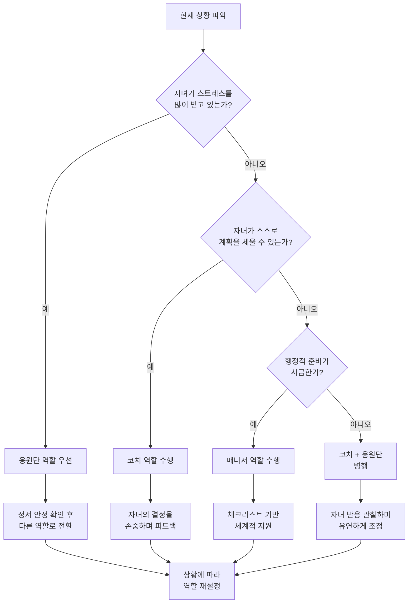
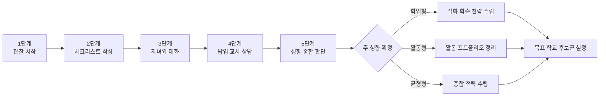
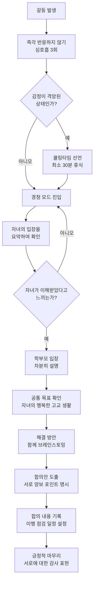
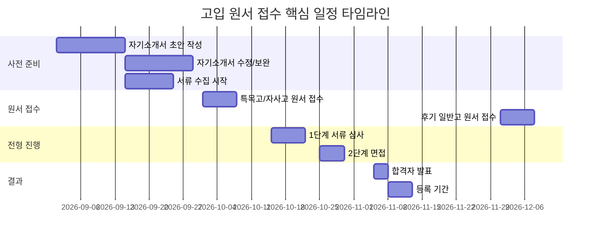
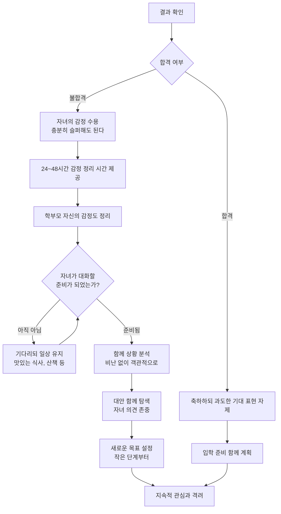
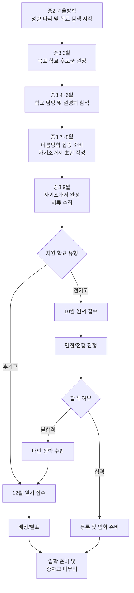

# 학부모 고입 지원 전략 가이드

> 자녀의 고등학교 입학을 함께 준비하는 학부모를 위한 종합 전략 가이드입니다.
> 올바른 역할 정의부터 원서 접수 실무, 합격 후 대처까지 전 과정을 다룹니다.

---

## 목차

1. [학부모 역할 정의](#1-학부모-역할-정의)
2. [자녀 성향 파악법](#2-자녀-성향-파악법)
3. [학교 유형별 학부모 준비사항](#3-학교-유형별-학부모-준비사항)
4. [자녀와의 소통 전략](#4-자녀와의-소통-전략)
5. [학원/과외 선택 가이드](#5-학원과외-선택-가이드)
6. [학교 탐방 체크리스트](#6-학교-탐방-체크리스트)
7. [입학 설명회 100% 활용법](#7-입학-설명회-100-활용법)
8. [원서 접수 실무 가이드](#8-원서-접수-실무-가이드)
9. [합격/불합격 후 대처법](#9-합격불합격-후-대처법)
10. [학부모 커뮤니티 활용법과 주의점](#10-학부모-커뮤니티-활용법과-주의점)
11. [학부모가 하면 안 되는 것 5가지](#11-학부모가-하면-안-되는-것-5가지)

---

## 1. 학부모 역할 정의

### 1-1. 코치 vs 매니저 vs 응원단

자녀의 고입 준비 과정에서 학부모가 취할 수 있는 역할은 크게 세 가지로 나뉩니다. 각 역할은 상황과 자녀의 성향에 따라 유연하게 전환해야 합니다.

#### 코치형 학부모

코치형 학부모는 자녀가 스스로 방향을 설정하고 실행할 수 있도록 질문과 피드백을 통해 이끌어주는 역할입니다. 자녀에게 직접 답을 주기보다는 스스로 답을 찾을 수 있도록 안내합니다. 예를 들어 "이 학교에 가야 해"가 아니라 "이 학교의 어떤 점이 너에게 맞다고 생각하니?"라고 질문합니다.

#### 매니저형 학부모

매니저형 학부모는 일정 관리, 서류 준비, 정보 수집 등 실무적인 부분을 체계적으로 관리하는 역할입니다. 자녀가 학업에만 집중할 수 있도록 행정적 지원을 담당합니다. 원서 접수 기한, 설명회 일정, 필요 서류 등을 꼼꼼하게 챙깁니다.

#### 응원단형 학부모

응원단형 학부모는 자녀의 정서적 안정과 자신감을 지지하는 역할입니다. 결과보다 과정을 격려하고, 자녀가 스트레스를 받을 때 심리적 안전지대가 되어줍니다.

### 1-2. 역할별 비교표

| 구분 | 코치형 | 매니저형 | 응원단형 |
|------|--------|----------|----------|
| 핵심 행동 | 질문하고 피드백 제공 | 일정/서류/정보 관리 | 격려하고 정서 지지 |
| 대표 발언 | "어떻게 생각하니?" | "이 서류 기한이 다음 주야" | "네가 어떤 결정을 하든 응원해" |
| 장점 | 자녀의 자기주도성 발달 | 실수 없는 체계적 준비 | 자녀의 정서적 안정 |
| 단점 | 자녀가 부담을 느낄 수 있음 | 과도하면 자율성 침해 | 실무적 준비 부족 가능 |
| 적합한 시기 | 학교 선택 고민 시 | 원서 접수 직전 | 시험/면접 직전 |
| 적합한 자녀 성향 | 자기주도적인 자녀 | 계획 수립이 서투른 자녀 | 불안감이 높은 자녀 |
| 주의사항 | 질문 과다 시 압박감 유발 | 지나친 관리는 반발 초래 | 현실적 조언 부족 가능 |
| 효과적 활용 팁 | 열린 질문 위주로 대화 | 체크리스트 활용 | 구체적 행동 칭찬 |

### 1-3. 역할 선택 플로차트

### 1-4. 시기별 권장 역할 배분

고입 준비는 보통 중학교 2학년 후반부터 3학년까지 진행됩니다. 시기에 따라 역할 배분을 달리하는 것이 효과적입니다.

| 시기 | 코치 비중 | 매니저 비중 | 응원단 비중 | 핵심 활동 |
|------|-----------|-------------|-------------|-----------|
| 중2 겨울방학 | 50% | 20% | 30% | 학교 유형 탐색, 자녀 성향 파악 |
| 중3 1학기 초 | 40% | 30% | 30% | 목표 학교 후보군 설정 |
| 중3 1학기 중반 | 30% | 40% | 30% | 학교 탐방, 설명회 참석 |
| 중3 여름방학 | 20% | 50% | 30% | 집중 준비, 서류 수집 |
| 중3 2학기 | 10% | 50% | 40% | 원서 접수, 면접 준비 |
| 전형 기간 | 5% | 30% | 65% | 시험/면접, 정서 지원 |
| 발표 이후 | 20% | 30% | 50% | 결과 수용, 향후 계획 |

---

## 2. 자녀 성향 파악법

### 2-1. 세 가지 성향 유형

자녀의 성향을 정확히 파악하는 것이 고입 전략의 출발점입니다. 학업형, 활동형, 균형형의 세 가지 축으로 분류할 수 있습니다.

#### 학업형 자녀

학업형 자녀는 교과 학습에 강한 흥미와 집중력을 보이는 유형입니다. 책 읽기, 문제 풀기, 깊이 있는 탐구 활동을 즐기며, 혼자서 공부하는 시간이 길어도 지치지 않습니다. 성적이 상위권인 경우가 많지만, 반드시 성적만으로 판단해서는 안 됩니다.

- 특징: 수업 시간 집중력 높음, 과제 완성도 높음, 자기주도 학습 가능
- 강점: 내신 관리 능력, 심화 학습 적응력
- 약점: 비교과 활동 참여 소극적일 수 있음, 체력 관리 필요
- 추천 진로: 과학고, 외국어고, 자율형사립고 학업 특화 과정

#### 활동형 자녀

활동형 자녀는 동아리, 봉사활동, 예체능, 리더십 경험 등 다양한 활동에서 에너지를 얻는 유형입니다. 사람들과 어울리는 것을 좋아하고, 새로운 경험에 대한 호기심이 강합니다.

- 특징: 발표력 우수, 대인관계 능력 높음, 다양한 활동 참여
- 강점: 면접 적응력, 자기소개서 소재 풍부, 리더십 경험
- 약점: 학업 집중 시간 부족할 수 있음, 시간 관리 필요
- 추천 진로: 자율형사립고, 특성화고, 예술고/체육고

#### 균형형 자녀

균형형 자녀는 학업과 활동을 적절히 조합하는 유형입니다. 두드러지는 강점이 없을 수 있지만 어떤 환경에서도 적응력이 좋습니다.

- 특징: 다방면 관심사, 적응력 높음, 안정적 성과
- 강점: 다양한 전형에 대응 가능, 종합 평가에 유리
- 약점: 뚜렷한 강점 어필이 어려울 수 있음
- 추천 진로: 자율형사립고, 일반고 우수 학교, 광역단위 자율형공립고

### 2-2. 성향 진단 체크리스트

아래 표의 각 항목에 대해 1점(전혀 아니다) ~ 5점(매우 그렇다)으로 평가해 보세요.

| 번호 | 진단 항목 | 학업형 | 활동형 | 균형형 |
|------|-----------|--------|--------|--------|
| 1 | 혼자 공부하는 시간이 즐겁다 | 5 | 1 | 3 |
| 2 | 새로운 사람 만나는 것을 좋아한다 | 1 | 5 | 3 |
| 3 | 하나의 주제를 깊이 파고드는 편이다 | 5 | 2 | 3 |
| 4 | 동아리/대회 활동에 적극 참여한다 | 2 | 5 | 3 |
| 5 | 계획표를 세우고 지키는 편이다 | 4 | 2 | 3 |
| 6 | 발표나 토론을 잘한다 | 2 | 5 | 3 |
| 7 | 성적에 민감하게 반응한다 | 5 | 2 | 3 |
| 8 | 체험 학습이나 현장 활동을 선호한다 | 1 | 5 | 4 |
| 9 | 여러 과목을 고르게 잘하는 편이다 | 3 | 2 | 5 |
| 10 | 리더 역할을 자주 맡는다 | 2 | 5 | 3 |
| 11 | 독서량이 또래 대비 많은 편이다 | 5 | 2 | 3 |
| 12 | 친구들과의 프로젝트를 즐긴다 | 2 | 5 | 4 |
| 13 | 스스로 목표를 설정하고 달성한다 | 4 | 3 | 4 |
| 14 | 예체능 활동에 시간을 많이 쓴다 | 1 | 5 | 3 |
| 15 | 스트레스 상황에서도 안정적이다 | 3 | 3 | 5 |

**채점 방법:**
- 학업형 항목(1, 3, 5, 7, 11) 합산
- 활동형 항목(2, 4, 6, 10, 14) 합산
- 균형형 항목(8, 9, 12, 13, 15) 합산
- 가장 높은 합산 점수의 유형이 자녀의 주 성향

### 2-3. 성향별 추천 학교 유형

| 성향 | 1순위 추천 학교 | 2순위 추천 학교 | 3순위 추천 학교 | 핵심 준비사항 | 주의할 점 |
|------|----------------|----------------|----------------|---------------|-----------|
| 학업형 (상위 5%) | 과학고/영재학교 | 외국어고/국제고 | 자율형사립고 | 심화 학습 포트폴리오, 올림피아드/경시 | 체력 관리, 번아웃 예방 |
| 학업형 (상위 20%) | 외국어고/국제고 | 자율형사립고 | 광역자율형공립고 | 어학 능력 강화, 교과 우수 실적 | 내신 경쟁 강도 고려 |
| 활동형 (리더십) | 자율형사립고 | 일반고 자율학교 | 광역자율형공립고 | 리더십 경험 정리, 면접 준비 | 학업 기초 체력 확보 |
| 활동형 (예체능) | 예술고/체육고 | 특성화고 | 마이스터고 | 실기 준비, 포트폴리오 | 진로 전환 가능성 고려 |
| 균형형 | 자율형사립고 | 광역자율형공립고 | 일반고 우수학교 | 종합적 자기소개서 | 차별화 포인트 발굴 |

### 2-4. 성향 파악 프로세스

---

## 3. 학교 유형별 학부모 준비사항

### 3-1. 학교 유형 개관

고등학교는 설립 목적과 운영 방식에 따라 여러 유형으로 나뉩니다. 각 유형별로 학부모가 준비해야 할 사항이 다르므로 정확한 이해가 필요합니다.

### 3-2. 유형별 상세 준비사항

| 학교 유형 | 전형 방식 | 학부모 핵심 준비사항 | 예상 비용(연간) | 준비 시작 시기 | 필수 확인 사항 | 대안 학교 |
|-----------|-----------|---------------------|----------------|---------------|---------------|-----------|
| 과학고 | 서류+면접+캠프 | 수학/과학 경시 지원, 연구 활동 기회 제공, 자기소개서 첨삭 | 200~400만원 | 중1~중2 | 영재교육원 이수 여부, 자기주도학습 전형 요강 | 과학중점학교 |
| 영재학교 | 서류+지필+캠프 | 올림피아드 준비 지원, 창의적 연구 경험, 멘토 연결 | 300~500만원 | 초6~중1 | 영재성 검사, 사사 과정 참여 | 과학고 |
| 외국어고 | 자기주도학습전형 | 어학 능력 강화 지원, 해외 경험 관리, 자기소개서 준비 | 500~1000만원 | 중2 | 영어 외 제2외국어 선택, 내신 관리 | 국제고, 글로벌 자사고 |
| 국제고 | 자기주도학습전형 | 글로벌 역량 강화, 영어 에세이 능력, 국제 활동 경험 | 600~1200만원 | 중2 | 영어 면접 준비, 국제 이슈 관심 | 외국어고, 국제반 일반고 |
| 자율형사립고 | 자기주도학습전형 | 자기소개서 준비 지원, 면접 준비, 학비 재정 계획 | 800~1500만원 | 중2~중3 | 학비 부담 가능 여부, 교육 과정 차별화 포인트 | 광역자율형공립고 |
| 광역자율형공립고 | 추첨+면접 | 면접 기본 준비, 학교 교육 과정 이해 | 100~200만원 | 중3 | 학교별 특성화 프로그램, 통학 거리 | 일반고 |
| 특성화고 | 서류+면접 | 자녀 적성 확인, 취업 vs 진학 방향 결정, 산업체 연계 확인 | 100~200만원 | 중2~중3 | 취업률, 자격증 취득 과정, 실습 환경 | 마이스터고 |
| 마이스터고 | 서류+면접 | 기술 분야 적성 확인, 해당 산업 이해, 졸업 후 진로 탐색 | 전액 무상 | 중2~중3 | 졸업 후 의무 취업 조건, 산업 수요 | 특성화고 |
| 예술고 | 실기+서류 | 실기 레슨 지원, 포트폴리오 관리, 예술 경험 제공 | 실기 비용 별도 | 초등~중학 | 실기 전형 세부 기준, 졸업 후 진로 | 예술중점학교 |
| 체육고 | 실기+서류 | 종목별 훈련 지원, 체력 관리, 선수 등록 | 훈련 비용 별도 | 초등~중학 | 종목별 선발 기준, 부상 보험 | 체육중점학교 |

### 3-3. 전형 유형별 학부모 행동 지침

**자기주도학습전형 대비**
- 자녀의 독서 기록 관리 지원
- 비교과 활동 기록 체계화
- 자기소개서 초안 작성 시 질문으로 이끌기 (대신 써주지 않기)
- 학습 계획서 작성 연습 지원

**면접 대비**
- 가정에서 모의 면접 연습
- 자녀의 답변에 대한 객관적 피드백
- 면접 복장과 예절 점검
- 시사 이슈에 대한 가정 내 토론

**실기 대비**
- 전문 지도자와의 지속적 연계
- 연습 환경 확보
- 컨디션 관리 (영양, 수면, 스트레스)
- 포트폴리오 체계적 정리

---

## 4. 자녀와의 소통 전략

### 4-1. 갈등 예방법

고입 준비 과정에서 자녀와 학부모 사이의 갈등은 자연스러운 현상입니다. 중요한 것은 갈등을 예방하고, 발생했을 때 건설적으로 해결하는 것입니다.

**갈등이 발생하는 주요 원인:**
- 학부모의 기대와 자녀의 희망이 다를 때
- 학습량이나 진도에 대한 의견 차이
- 학교 선택에 대한 관점 차이
- 자녀의 노력을 학부모가 인정하지 않을 때
- 또래와의 비교

**갈등 예방을 위한 5가지 원칙:**

1. **정기적 대화 시간 확보**: 주 1회 이상 고입 관련 대화 시간을 정해두세요. 일상적 대화와 분리하는 것이 중요합니다.
2. **경청 먼저**: 자녀의 이야기를 끝까지 들은 후에 의견을 제시하세요.
3. **감정과 사실 분리**: "성적이 떨어져서 화가 나"가 아니라 "성적이 어떻게 변했는지 함께 보자"로 접근하세요.
4. **선택권 제공**: 최종 결정은 자녀가 하도록 하되, 판단 근거를 함께 정리해 주세요.
5. **과정 칭찬**: 결과가 아닌 노력과 과정을 인정해 주세요.

### 4-2. 동기부여 방법

**내재적 동기부여:**
- 자녀가 관심 있는 분야와 학교 선택을 연결해 주기
- "왜 이 학교에 가고 싶은지" 스스로 정리하게 하기
- 롤모델이 될 수 있는 선배나 멘토 연결
- 자녀의 강점을 구체적으로 인정하고 활용 방안 함께 찾기

**외재적 동기부여 (적절한 수준에서):**
- 목표 달성 시 보상 체계 합의 (과도한 물질적 보상은 지양)
- 학교 방문이나 진로 체험 기회 제공
- 성취감을 느낄 수 있는 단기 목표 설정

### 4-3. 효과적 대화법 (DO vs DON'T)

| 상황 | DO (이렇게 말하세요) | DON'T (이것은 피하세요) | 이유 |
|------|---------------------|----------------------|------|
| 성적 하락 시 | "이번 시험에서 어려웠던 부분이 있었니? 같이 분석해 볼까?" | "왜 성적이 떨어졌어? 공부를 안 한 거 아니야?" | 비난이 아닌 분석으로 접근해야 동기 유지 |
| 학교 선택 갈등 | "그 학교의 어떤 점이 마음에 드는지 설명해 줄래?" | "거긴 안 돼. 엄마/아빠가 알아본 학교가 더 좋아." | 자녀의 의견 존중이 자기주도성의 시작 |
| 공부 안 할 때 | "오늘 계획한 것 중에서 가장 하고 싶은 건 뭐야?" | "또 놀고 있어? 빨리 공부해!" | 선택권을 주면 자율성과 책임감 동시 향상 |
| 불안해할 때 | "걱정되는 거 당연해. 구체적으로 뭐가 가장 걱정이야?" | "걱정해봤자 소용없어. 그냥 열심히 하면 돼." | 감정을 인정받아야 안정감을 느낌 |
| 비교할 때 | "너만의 속도가 있어. 지난달보다 얼마나 성장했는지 볼까?" | "○○이는 벌써 다 했다더라." | 타인 비교는 자존감 하락의 주범 |
| 실패했을 때 | "아쉽지만 여기서 배운 점이 분명 있을 거야. 같이 정리해 보자." | "그러니까 내 말을 들었어야지." | 실패 후 복원력이 향후 성공의 열쇠 |
| 진로 고민 시 | "관심 있는 분야를 3개만 적어 볼래? 같이 탐색해 보자." | "그건 돈이 안 되니까 다른 걸 해." | 탐색 기회를 차단하면 무기력 유발 |
| 노력 인정 시 | "어제보다 30분 더 집중했네. 그게 쉬운 게 아닌데 대단해." | "잘했어." (구체성 없는 칭찬) | 구체적 칭찬이 행동 강화에 효과적 |

### 4-4. 갈등 해결 플로차트

### 4-5. 대화 빈도와 방식 가이드

| 대화 유형 | 권장 빈도 | 적합한 장소 | 소요 시간 | 주요 내용 |
|-----------|-----------|-------------|-----------|-----------|
| 일상 안부 | 매일 | 식탁, 거실 | 5~10분 | 학교생활, 기분, 컨디션 |
| 학습 점검 | 주 1~2회 | 자녀 방 또는 서재 | 15~20분 | 학습 진도, 어려운 점, 다음 주 계획 |
| 진로/학교 상담 | 격주 1회 | 카페 등 편안한 공간 | 30~60분 | 학교 정보 공유, 자녀 의견 청취 |
| 정서 점검 | 월 1~2회 | 산책, 드라이브 중 | 자유 | 스트레스 수준, 대인관계, 걱정거리 |
| 가족 회의 | 월 1회 | 거실 | 30~45분 | 전체 일정 점검, 역할 분담, 갈등 해소 |

---

## 5. 학원/과외 선택 가이드

### 5-1. 선택 기준 체크리스트

학원이나 과외를 선택할 때 아래 항목을 하나씩 점검해 보세요.

**학원 선택 시 확인 사항:**
- 자녀의 현재 학습 수준에 맞는 반 편성이 있는가
- 강사의 고입 전형 이해도와 경력이 충분한가
- 자녀가 원하는 과목과 학원의 강점이 일치하는가
- 통학 시간이 30분 이내인가
- 수업 시간이 자녀의 컨디션 관리에 무리가 없는가
- 자녀의 학습 결과를 정기적으로 피드백하는 시스템이 있는가
- 자기주도학습 시간을 확보할 수 있는 스케줄인가
- 학원비가 가정 경제에 무리가 되지 않는가

**과외 선택 시 확인 사항:**
- 과외 선생님의 해당 과목 전문성이 검증되었는가
- 1:1 지도가 정말 필요한 상황인가
- 자녀와 과외 선생님의 성향 궁합이 맞는가
- 수업 목표와 커리큘럼이 명확한가
- 수업 후 과제와 복습 체계가 있는가

### 5-2. 유형별 비교

| 구분 | 대형 입시학원 | 소규모 전문학원 | 개인 과외 | 그룹 과외 | 온라인 강의 |
|------|-------------|---------------|-----------|-----------|------------|
| 인원 | 20~40명 | 5~15명 | 1명 | 3~5명 | 제한 없음 |
| 비용(월) | 30~60만원 | 40~80만원 | 50~100만원 | 30~60만원 | 10~30만원 |
| 장점 | 체계적 커리큘럼, 경쟁 분위기 | 세심한 관리, 맞춤형 지도 | 완전 맞춤형, 취약점 집중 보완 | 비용 효율, 토론 가능 | 시간/장소 유연, 반복 학습 |
| 단점 | 개인 맞춤 어려움 | 비용 대비 효과 검증 필요 | 고비용, 의존성 위험 | 수준 편차 문제 | 자기관리 능력 필요 |
| 적합한 학생 | 경쟁 속에서 동기부여되는 학생 | 꼼꼼한 관리가 필요한 학생 | 특정 과목 심각한 취약점 | 함께 공부할 때 효과적인 학생 | 자기주도 학습 능력 높은 학생 |
| 고입 특화 여부 | 대부분 특화 과정 있음 | 학원마다 다름 | 선생님 역량에 따라 다름 | 드물음 | 일부 플랫폼 특화 과정 |
| 추천 활용 시기 | 중3 전체 | 중2~중3 | 취약 과목 집중 시기 | 중2~중3 초반 | 보조 수단으로 상시 |

### 5-3. 효과적 활용법

**학원/과외 최대 효과를 위한 학부모 역할:**

1. **수업 전**: 자녀와 함께 이번 수업의 학습 목표를 확인합니다. 지난 수업에서 이해가 부족했던 부분을 정리합니다.

2. **수업 후**: 자녀에게 오늘 배운 내용을 설명해 달라고 합니다. 설명할 수 있으면 이해한 것이고, 설명하지 못하면 복습이 필요한 부분입니다.

3. **정기 점검**: 월 1회 학원 상담을 통해 자녀의 학습 상태와 진도를 확인합니다. 단, 성적 결과만 물을 것이 아니라 학습 태도와 이해도 변화를 함께 확인합니다.

4. **시기별 조정**: 고입 전형 일정에 맞춰 학원/과외의 강도와 내용을 조정합니다. 원서 접수 직전에는 자기소개서 첨삭 중심으로, 면접 직전에는 면접 준비 중심으로 전환합니다.

5. **효과 평가**: 3개월 단위로 학원/과외의 효과를 냉정하게 평가합니다. 효과가 없다면 과감하게 변경을 검토합니다.

**주의해야 할 학원/과외 함정:**
- 학원 수만 늘리면 된다는 착각 (양보다 질)
- 자녀의 의견 없이 학부모가 일방적으로 결정
- 고비용 = 고효과라는 환상
- 자기주도학습 시간을 학원으로 모두 채우는 것
- 학원 간 커리큘럼 중복 확인 미흡

---

## 6. 학교 탐방 체크리스트

### 6-1. 탐방 전 준비

학교 탐방은 학교 홈페이지와 설명회만으로는 파악할 수 없는 실제 교육 환경을 확인하는 기회입니다. 사전에 철저히 준비해야 제한된 시간 안에 필요한 정보를 얻을 수 있습니다.

**사전 준비 목록:**
- 학교 홈페이지에서 교육 과정, 학교 소개 읽기
- 질문 목록 최소 10개 준비
- 학교 위치와 통학 경로 사전 확인
- 자녀와 함께 "우리가 확인할 것" 목록 작성
- 카메라/메모장 준비 (촬영 가능 여부 사전 확인)

### 6-2. 학교 탐방 종합 체크리스트

| 관찰 영역 | 세부 확인 항목 | 확인 방법 | 중요도 | 메모란 활용 팁 |
|-----------|---------------|-----------|--------|---------------|
| 교육 과정 | 특성화 프로그램 유무 | 설명 청취, 자료 요청 | 상 | 구체적 프로그램명과 운영 시간 기록 |
| 교육 과정 | 선택 과목 다양성 | 교육 과정표 확인 | 상 | 자녀 관심 과목 포함 여부 체크 |
| 교육 과정 | 방과후 프로그램 | 목록 요청 | 중 | 참여율과 만족도 문의 |
| 교육 과정 | 동아리 종류와 활동 수준 | 전시물/활동 결과물 확인 | 중 | 자녀 관심 동아리 존재 여부 확인 |
| 시설 환경 | 교실 크기와 학급 인원 | 직접 관찰 | 상 | 한 반 인원수와 교실 면적 비율 |
| 시설 환경 | 도서관 규모와 장서 | 직접 방문 | 중 | 자습 공간 여부, 개방 시간 확인 |
| 시설 환경 | 실험실/실습실 상태 | 직접 관찰 | 중 | 장비 최신성, 안전 관리 상태 |
| 시설 환경 | 급식 환경 | 식당 방문 또는 사진 확인 | 중 | 메뉴 다양성, 위생 상태 |
| 시설 환경 | 운동 시설 | 직접 관찰 | 하 | 체육관, 운동장 규모 |
| 학생 생활 | 학생들의 분위기 | 쉬는 시간/점심시간 관찰 | 상 | 학생들의 표정과 대화 내용 |
| 학생 생활 | 교사-학생 관계 | 수업 참관 또는 복도 관찰 | 상 | 교사의 학생 대하는 태도 |
| 학생 생활 | 학교 폭력 예방 체계 | 안내 자료 또는 질문 | 상 | 구체적 예방 프로그램 확인 |
| 학생 생활 | 기숙사 환경 (해당 시) | 직접 방문 | 상 | 실 인원, 자습 환경, 생활 규칙 |
| 진학 실적 | 대학 진학 현황 | 통계 자료 요청 | 중 | 최근 3년간 추이 확인 |
| 진학 실적 | 진로 지도 프로그램 | 설명 청취 | 중 | 진로 상담 교사 배치 여부 |
| 통학 환경 | 교통편 | 직접 체험 | 상 | 등하교 시간대 소요 시간 측정 |
| 통학 환경 | 주변 환경 안전성 | 직접 관찰 | 상 | 유흥시설 밀집 여부, 야간 조명 |
| 교사진 | 교사 평균 경력 | 질문 또는 학교 알리미 | 중 | 비정규직 교사 비율도 확인 |
| 교사진 | 교사 1인당 학생 수 | 통계 자료 | 중 | 과목별 차이 확인 |
| 학부모 참여 | 학부모회 활동 | 질문 | 하 | 참여 부담 수준 확인 |

### 6-3. 탐방 후 정리법

학교 탐방 직후 (기억이 선명할 때) 아래 사항을 정리합니다.

- 학교별 비교 표 작성
- 자녀의 즉각적 반응과 느낌 기록
- 추가 확인이 필요한 사항 목록화
- 전반적 만족도 5점 척도 평가
- 다른 탐방 예정 학교와의 비교 포인트 정리

---

## 7. 입학 설명회 100% 활용법

### 7-1. 사전 준비

입학 설명회는 학교의 교육 철학과 전형 세부 사항을 직접 확인할 수 있는 중요한 기회입니다.

**설명회 전 필수 준비 사항:**

1. **학교 홈페이지 사전 연구**: 기본 정보는 미리 파악하고, 설명회에서는 심화 질문에 집중합니다.
2. **전형 요강 사전 숙지**: 자기주도학습전형 세부 기준, 평가 항목별 배점 등을 미리 확인합니다.
3. **질문 목록 준비**: 최소 5개, 가능하면 10개 이상의 구체적 질문을 준비합니다.
4. **녹음/필기 도구**: 설명회 내용을 정확하게 기록할 수 있도록 준비합니다 (녹음 허가 여부 사전 확인).
5. **자녀 동행 결정**: 가능하면 자녀와 함께 참석하여 직접 느끼게 합니다.

**사전 준비 질문 예시:**
- 자기주도학습전형에서 가장 중요하게 보는 평가 요소는 무엇인가요?
- 입학 후 교육 과정 선택의 유연성은 어느 정도인가요?
- 기숙사 생활의 구체적인 규칙과 일과는 어떻게 되나요?
- 졸업생 중 자녀가 관심 있는 분야로 진학한 사례가 있나요?
- 학교에서 자체적으로 운영하는 비교과 프로그램에는 어떤 것이 있나요?

### 7-2. 현장 체크리스트

| 확인 항목 | 세부 내용 | 기록 방법 | 후속 조치 |
|-----------|-----------|-----------|-----------|
| 전형 일정 | 원서 접수일, 면접일, 발표일 | 달력에 즉시 입력 | 알림 설정 |
| 전형 변경 사항 | 전년 대비 변경된 전형 요소 | 필기 | 변경 이유와 영향 분석 |
| 평가 기준 | 자기소개서, 면접 평가 항목별 비중 | 필기 | 준비 전략에 반영 |
| 우수 사례 | 합격생 자기소개서 및 면접 사례 | 필기/촬영 | 자녀와 공유, 벤치마킹 |
| 교육 과정 특징 | 차별화된 프로그램, 교과 과정 | 자료 수집 | 자녀 적합성 평가 |
| 학교 분위기 | 설명회 운영 방식, 교직원 태도 | 관찰 메모 | 학교 문화 판단 근거 |
| 재학생/졸업생 후기 | 실제 학교생활 이야기 | 녹음/필기 | 학교 선택 판단 자료 |
| 학비/장학금 | 등록금, 기숙사비, 장학금 기준 | 자료 수집 | 재정 계획 수립 |
| Q&A 내용 | 다른 학부모의 질문과 학교 답변 | 필기 | 추가 정보 확보 |

### 7-3. 사후 정리

설명회 후 24시간 이내에 아래 사항을 정리합니다.

**정리 순서:**

1. **당일 메모 정리**: 필기 내용을 깔끔하게 재정리합니다.
2. **자녀와 공유**: 핵심 내용을 자녀에게 전달하고 의견을 듣습니다.
3. **다른 학교와 비교**: 여러 설명회에 참석한 경우 비교표를 업데이트합니다.
4. **추가 질문 정리**: 설명회에서 답을 못 얻은 질문을 정리하여 학교에 개별 문의합니다.
5. **일정 반영**: 전형 일정을 가족 공유 캘린더에 입력합니다.
6. **전략 수정**: 설명회에서 얻은 정보를 바탕으로 준비 전략을 조정합니다.

---

## 8. 원서 접수 실무 가이드

### 8-1. 준비 서류 체크리스트

| 서류명 | 발급처 | 소요 기간 | 유효 기간 | 주의사항 | 준비 상태 |
|--------|--------|-----------|-----------|----------|-----------|
| 학교생활기록부 사본 | 재학 중학교 | 즉시~3일 | 최신본 필요 | 봉인 여부 확인 | - |
| 자기소개서 | 본인 작성 | 2~4주 | 전형별 양식 확인 | 대리 작성 적발 시 불합격 | - |
| 학습 계획서 | 본인 작성 | 1~2주 | 전형별 양식 확인 | 학교별 양식 상이 | - |
| 추천서 (해당 시) | 담임/교과 교사 | 1~2주 | 전형 기간 내 | 교사에게 충분한 시간 제공 | - |
| 주민등록등본 | 주민센터/온라인 | 즉시 | 1개월 이내 | 가족 관계 확인용 | - |
| 가족관계증명서 | 법원/온라인 | 즉시 | 1개월 이내 | 학교별 요구 여부 다름 | - |
| 건강검진결과서 (해당 시) | 병원 | 1~2주 | 학교별 확인 | 특수학교 지원 시 필수 | - |
| 증명사진 | 사진관 | 즉시 | 6개월 이내 | 규격 확인 필수 (3x4 또는 여권) | - |
| 수상 실적 증빙 (해당 시) | 발급 기관 | 다양 | 원본 필요 여부 확인 | 학교생활기록부 기재 항목과 일치 확인 | - |
| 납입금 영수증 | 전형료 납부 후 | 즉시 | 해당 전형 | 온라인 접수 시 자동 처리 | - |

### 8-2. 일정 관리 타임라인

### 8-3. 월별 세부 일정 관리표

| 월 | 주요 일정 | 학부모 할 일 | 자녀 할 일 | 확인 사항 |
|----|-----------|-------------|------------|-----------|
| 7월 | 전형 요강 발표 시작 | 관심 학교 요강 수집 | 내신 최종 정리 | 전년 대비 변경 사항 |
| 8월 | 여름방학 집중 준비 | 자기소개서 소재 정리 지원 | 자기소개서 초안 작성 시작 | 활동 경험 목록화 |
| 9월 | 설명회 시즌 | 설명회 참석, 정보 수집 | 자기소개서 수정, 면접 준비 시작 | 설명회 일정 중복 확인 |
| 10월 | 원서 접수 (전기) | 서류 최종 확인, 접수 지원 | 면접 준비 집중 | 접수 마감 시간 엄수 |
| 11월 | 면접/발표 | 면접 당일 지원, 정서 관리 | 면접 참가 | 결과 발표 일정 확인 |
| 12월 | 후기고 원서 접수 | 불합격 시 대안 전략 실행 | 후기고 원서 작성 | 추가 모집 여부 확인 |

### 8-4. 자주 하는 실수와 예방법

**실수 1: 원서 접수 기한 착각**
- 문제: 전기고와 후기고 접수 기한을 혼동하거나, 마감 시간을 잘못 알고 있는 경우
- 예방: 학교별 접수 기한을 달력에 기록하고, 마감 2일 전 알림 설정

**실수 2: 자기소개서 표절 검사 미확인**
- 문제: 다른 학생의 자기소개서를 참고하다가 유사 문구가 포함되는 경우
- 예방: 자기소개서는 반드시 자녀만의 경험과 언어로 작성, 학원 첨삭도 주의

**실수 3: 서류 원본/사본 혼동**
- 문제: 원본 제출이 필요한 서류에 사본을 제출하거나 그 반대의 경우
- 예방: 서류별로 원본/사본 요구 사항을 명확히 확인하고 별도 표시

**실수 4: 온라인 접수 시스템 오류 대비 미흡**
- 문제: 마감 직전 시스템 폭주로 접수 불가
- 예방: 마감 최소 24시간 전에 접수 완료, 접수 확인서 저장

**실수 5: 중복 지원 규정 위반**
- 문제: 전기고 중복 지원 금지 규정을 인지하지 못하고 여러 학교에 원서 제출
- 예방: 해당 시도 교육청의 전형 규정을 정확히 확인

**실수 6: 자녀 의견 무시한 학교 선택**
- 문제: 학부모의 희망만으로 지원 학교를 결정하여 자녀가 면접에서 진정성 부족
- 예방: 최종 지원 학교는 자녀와 충분한 대화 후 합의

---

## 9. 합격/불합격 후 대처법

### 9-1. 합격 시 할 일

합격은 끝이 아니라 새로운 시작입니다. 합격 후에도 체계적인 준비가 필요합니다.

**즉시 해야 할 일:**
- 등록 기간과 등록금 납부 일정 확인
- 등록에 필요한 서류 준비 (건강검진서, 사진 등)
- 기숙사 신청 여부와 기한 확인
- 교복 주문 일정 확인

**입학 전까지 해야 할 일:**
- 해당 학교 선배와의 네트워킹 (온라인 커뮤니티 등)
- 선행 학습 계획 수립 (과도한 선행은 지양)
- 자기주도 학습 습관 강화
- 기숙사 생활 대비 (해당 시): 생활 용품 준비, 자립심 훈련
- 새로운 환경 적응을 위한 심리적 준비

**학부모 주의사항:**
- 합격에 지나치게 들뜨지 않기 (자녀가 부담을 느낄 수 있음)
- "합격했으니 이제 더 열심히 해야 해"라는 압박 자제
- 입학 후 적응 과정에서 지속적인 관심 유지
- 중학교 남은 과정도 성실히 마무리하도록 격려

### 9-2. 불합격 시 대안 전략

불합격은 실패가 아니라 방향 전환의 기회입니다. 학부모의 반응이 자녀에게 미치는 영향이 매우 큽니다.

**즉각적 대응:**

1. **자녀 정서 지원 최우선**: 실망감, 자괴감을 충분히 표현할 수 있도록 합니다.
2. **비난 절대 금지**: "그러니까 내 말을 들었어야지", "네가 노력을 안 해서" 등의 발언은 절대 하지 않습니다.
3. **대안을 즉시 제시하지 않기**: 감정 정리가 먼저입니다. 대안 논의는 1~2일 후에 시작합니다.

**대안 전략 수립:**

| 상황 | 대안 1 | 대안 2 | 대안 3 | 고려 사항 |
|------|--------|--------|--------|-----------|
| 전기고 불합격 | 후기고 지원 전략 수립 | 일반고 중 우수 학교 탐색 | 타 시도 학교 검토 | 후기고 접수 기한 확인 |
| 후기고 불합격 | 추가 모집 확인 | 배정된 일반고 적응 전략 | 전학/편입 가능성 장기적 검토 | 추가 모집 일정 파악 |
| 원하는 학교 아님 | 배정 학교의 장점 탐색 | 교내 우수 프로그램 활용 계획 | 대학 입시에서 만회 전략 | 학교 내 기회 극대화 |

### 9-3. 자녀 정서 지원 가이드

**정서 지원 시 학부모가 해야 할 말:**
- "많이 속상하지? 그 마음 충분히 이해해."
- "이 결과가 너의 가치를 결정하는 건 아니야."
- "우리 함께 다음 단계를 천천히 생각해 보자."
- "어떤 결과든 너를 응원하는 마음은 변함없어."

**정서 지원 시 학부모가 하지 말아야 할 말:**
- "다 너 잘되라고 하는 말이야."
- "○○이는 붙었다면서?"
- "처음부터 그 학교는 무리였어."
- "돈이 얼마나 들었는데..."

---

## 10. 학부모 커뮤니티 활용법과 주의점

### 10-1. 커뮤니티의 종류와 특징

학부모 커뮤니티는 유용한 정보 공유의 장이 될 수 있지만, 잘못 활용하면 불안감과 혼란만 가중시킬 수 있습니다.

**주요 커뮤니티 유형:**
- 온라인 카페 (네이버 카페 등)
- 학교별 학부모 단체 채팅방
- 지역 학부모 모임
- 학원 학부모 네트워크
- SNS 학부모 그룹

### 10-2. DO/DON'T 가이드

| 구분 | DO (이렇게 활용하세요) | DON'T (이것은 피하세요) | 이유 |
|------|----------------------|----------------------|------|
| 정보 수집 | 공식 전형 일정, 설명회 후기 등 사실 기반 정보 확인 | 합격 컷, 내부 정보 등 검증 불가 소문 신뢰 | 부정확한 정보로 잘못된 전략 수립 위험 |
| 경험 공유 | 설명회 후기, 학교 탐방 경험 등 1차 경험 공유 | 특정 학교/학원 비방이나 과도한 홍보 | 편향된 정보가 판단을 흐림 |
| 정서 지원 | 비슷한 상황의 학부모와 고민 나누기 | 자녀 성적이나 활동을 타 자녀와 비교 | 경쟁 심리가 자녀에게 전가 |
| 질문하기 | 구체적이고 확인 가능한 사실 질문 | "우리 아이 이 성적으로 ○○고 갈 수 있나요?" | 무책임한 답변에 의존 위험 |
| 정보 활용 | 여러 출처에서 교차 확인 후 활용 | 하나의 후기나 의견을 절대적 기준으로 삼기 | 개인 경험은 일반화 불가 |
| 시간 관리 | 하루 30분 이내로 커뮤니티 확인 시간 제한 | 하루 종일 커뮤니티에 매몰되어 불안 증폭 | 과도한 정보는 불안의 원인 |
| 자녀 보호 | 자녀의 개인 정보와 성적은 비공개 | 자녀의 성적, 합격/불합격 사실을 공개 게시 | 자녀의 사생활과 자존감 보호 |
| 관계 관리 | 건강한 정보 교류 관계 유지 | 특정 학부모 그룹에 과도하게 의존 | 집단 불안 심리에 휘말림 |

### 10-3. 건강한 커뮤니티 활용 원칙

1. **정보의 출처를 항상 확인합니다.** 교육청 공식 발표, 학교 홈페이지 등 공식 채널로 교차 검증합니다.
2. **자녀에 대한 정보를 함부로 공유하지 않습니다.** 성적, 지원 학교, 합격 여부는 민감한 개인 정보입니다.
3. **비교의 함정에 빠지지 않습니다.** 다른 가정의 전략은 참고만 할 뿐, 우리 가정에 그대로 적용할 수 없습니다.
4. **부정적 정보에 과도하게 반응하지 않습니다.** 부정적 후기나 소문은 한 개인의 경험일 수 있습니다.
5. **커뮤니티 활동이 자녀와의 직접 소통을 대체하지 않도록 합니다.**

---

## 11. 학부모가 하면 안 되는 것 5가지

### 11-1. 자기소개서 대리 작성

**행동**: 자녀의 자기소개서를 학부모가 직접 작성하거나, 학원/전문 업체에 의뢰하여 대필하는 행위

**왜 안 되는가:**
- 표절 검사 시스템에 적발될 경우 해당 전형 불합격 처리
- 면접에서 자기소개서 내용에 대한 질문 시 자녀가 답변하지 못함
- 자녀의 진정성 있는 목소리가 사라져 평가관에게 부정적 인상
- 자녀의 자기표현 능력 발달 기회 상실

**올바른 접근:**
- 자녀가 초안을 작성하도록 하고, 학부모는 질문을 통해 내용을 풍부하게 만들어줍니다
- "이 경험에서 뭘 느꼈니?", "왜 이 학교에 가고 싶어?"와 같은 질문으로 자녀의 생각을 이끌어냅니다
- 맞춤법과 문법 교정 정도의 도움은 가능하지만, 내용 자체를 바꾸지 않습니다

### 11-2. 자녀 의견 무시한 학교 강요

**행동**: 자녀의 희망과 적성을 무시하고, 학부모의 기대나 체면을 위해 특정 학교 지원을 강요하는 행위

**왜 안 되는가:**
- 자녀가 원하지 않는 학교에 진학하면 학교생활 적응 실패 위험 증가
- 면접에서 진정성이 드러나지 않아 합격 가능성 자체가 낮아짐
- 입학 후 학습 동기 저하로 성적 하락 가능성
- 학부모-자녀 관계 심각한 훼손
- 자녀의 자기결정권과 자존감 손상

**올바른 접근:**
- 정보를 제공하되, 최종 선택은 자녀가 하도록 합니다
- 학부모의 의견은 "제안" 형태로 전달합니다
- 자녀의 선택이 학부모의 기대와 다를 때, 자녀의 이유를 충분히 들어봅니다
- 만약 자녀의 선택에 현실적 문제가 있다면, 객관적 자료와 함께 차분히 설명합니다

### 11-3. 다른 자녀와의 공개적 비교

**행동**: 친척, 이웃, 같은 반 학생 등 다른 자녀와 성적, 활동, 합격 여부를 비교하며 자녀에게 압박을 가하는 행위

**왜 안 되는가:**
- 자녀의 자존감 심각한 하락
- 비교 대상 자녀와의 관계 악화
- 내재적 동기 파괴: "내가 잘하고 싶어서"가 아닌 "남보다 뒤처지면 안 되니까"로 변질
- 과도한 스트레스로 인한 번아웃, 심한 경우 우울증이나 불안 장애
- 학부모와의 신뢰 관계 파괴

**올바른 접근:**
- 비교 대상은 오직 과거의 자녀 자신입니다
- "지난달보다 이 부분이 좋아졌네"와 같이 성장에 초점을 맞춥니다
- 다른 자녀의 소식은 자녀에게 전달하지 않습니다

### 11-4. 과도한 사교육 투자로 자기주도학습 시간 박탈

**행동**: 학원을 3개 이상 병행하거나, 하루 대부분의 시간을 사교육으로 채워 자녀가 스스로 공부할 시간이 전혀 없는 상태를 만드는 행위

**왜 안 되는가:**
- 자기주도학습전형에서 "자기주도학습 능력"이 핵심 평가 요소인데, 실제 자기주도학습 경험이 없으면 자기소개서와 면접에서 진정성 확보 불가
- 과도한 스케줄로 인한 체력 저하와 번아웃
- 수동적 학습 습관 형성: 누군가 시켜야만 공부하는 패턴
- 창의성과 사고력 발달 저해
- 가정 경제에 불필요한 부담 가중

**올바른 접근:**
- 사교육은 최소한으로, 자기주도학습 시간은 최대한으로 배분합니다
- 학원은 2개 이내로 제한하고, 하루 최소 2시간의 자기주도학습 시간을 확보합니다
- 학원의 역할을 명확히 합니다: 모르는 것을 배우는 곳이지, 공부를 대신해 주는 곳이 아닙니다

### 11-5. 결과에 대한 과도한 정서적 반응

**행동**: 모의고사 성적, 내신 등급, 합격/불합격 결과에 대해 극단적으로 기뻐하거나 극단적으로 실망하는 감정 표현을 자녀 앞에서 하는 행위

**왜 안 되는가:**
- 자녀가 학부모의 감정에 책임감을 느껴 과도한 부담
- 실패에 대한 두려움이 커져 도전을 회피하는 성향 발달
- 성적이 곧 자신의 가치라는 잘못된 인식 형성
- 결과를 숨기거나 거짓말하는 행동 유발 가능
- 시험 불안증 등 심리적 문제 발생 위험

**올바른 접근:**
- 결과에 대해 담담하고 차분하게 반응합니다
- 좋은 결과에는 "열심히 한 보람이 있네. 어떤 부분이 잘 된 것 같아?"
- 아쉬운 결과에는 "아쉽지만 다음 기회가 있어. 어떤 부분을 보완하면 좋을까?"
- 학부모 자신의 감정은 배우자나 친구에게 별도로 해소합니다
- 자녀 앞에서는 안정적이고 일관된 태도를 유지합니다

---

## 부록: 학부모 자기 점검 체크리스트

아래 항목을 정기적으로 점검하여 건강한 지원자 역할을 유지하고 있는지 확인하세요.

| 번호 | 점검 항목 | 예 | 아니오 | 개선 방법 |
|------|-----------|---|--------|-----------|
| 1 | 자녀의 의견을 충분히 경청하고 있는가? | - | - | 주 1회 자녀 주도 대화 시간 확보 |
| 2 | 다른 자녀와 비교하지 않고 있는가? | - | - | 비교 발언 의식적 자제 |
| 3 | 자기소개서를 대신 쓰지 않았는가? | - | - | 질문으로 이끌기 방식 전환 |
| 4 | 자녀의 자기주도학습 시간이 확보되어 있는가? | - | - | 사교육 스케줄 재조정 |
| 5 | 결과에 과도하게 반응하지 않았는가? | - | - | 감정 일기 작성, 배우자와 대화 |
| 6 | 커뮤니티 정보에 휘둘리지 않고 있는가? | - | - | 공식 채널 교차 확인 습관 |
| 7 | 자녀의 정서 상태를 정기적으로 확인하고 있는가? | - | - | 월 1회 정서 점검 대화 |
| 8 | 가정 내 고입 준비 분위기가 과도하지 않은가? | - | - | 가족 여가 시간 확보 |
| 9 | 학부모 자신의 스트레스 관리를 하고 있는가? | - | - | 운동, 취미, 상담 등 자기 관리 |
| 10 | 최종 결정을 자녀에게 맡기고 있는가? | - | - | 정보 제공자로서의 역할 재정립 |

---

## 부록: 고입 준비 전체 프로세스 요약

---

> 이 가이드는 자녀의 고입 준비를 돕는 학부모를 위한 참고 자료입니다. 모든 자녀는 고유한 특성과 잠재력을 가지고 있으며, 가장 좋은 학교는 자녀가 행복하게 성장할 수 있는 학교입니다. 학부모의 역할은 자녀가 스스로 최선의 선택을 할 수 있도록 돕는 것입니다.
