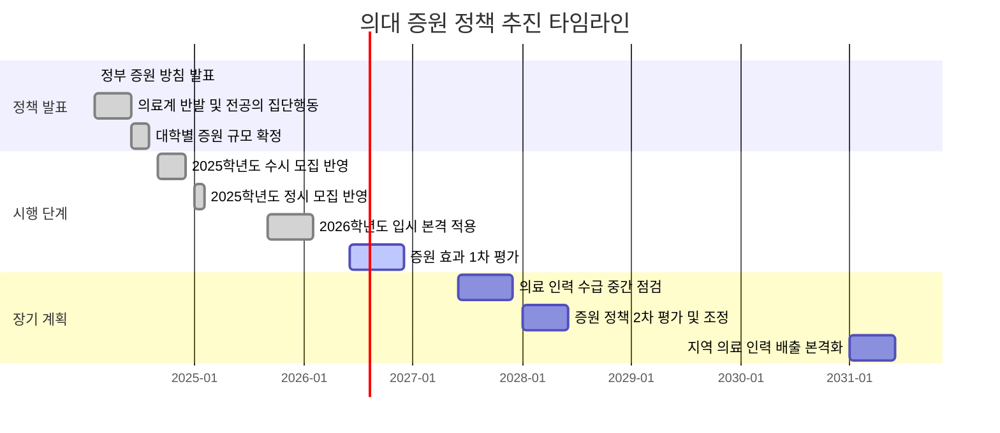
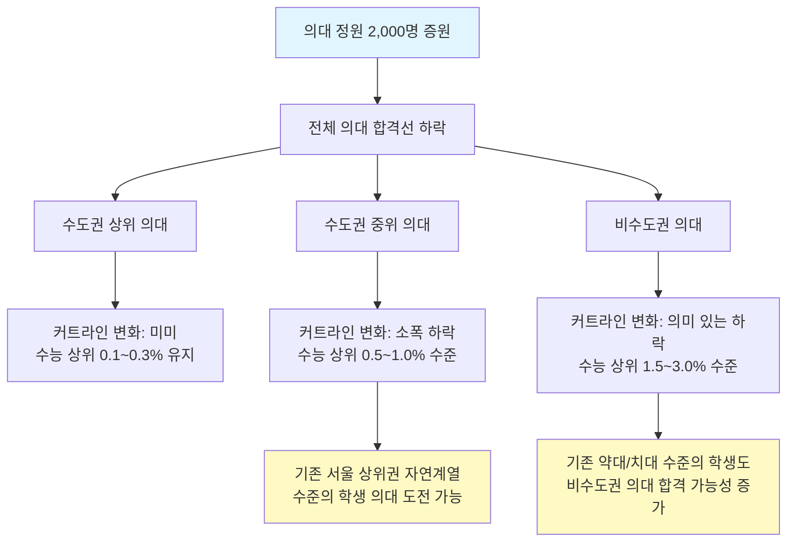
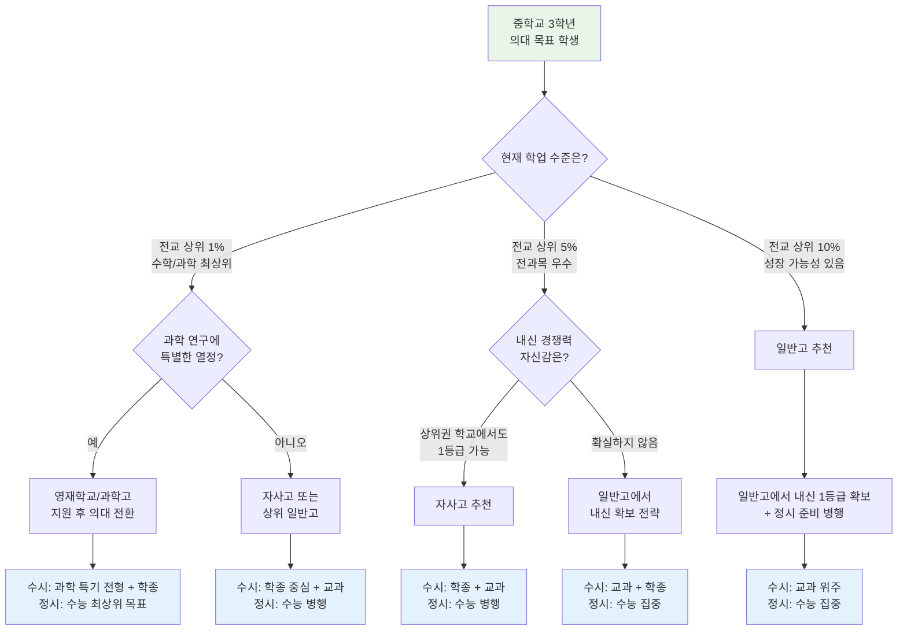
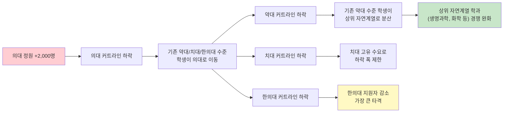
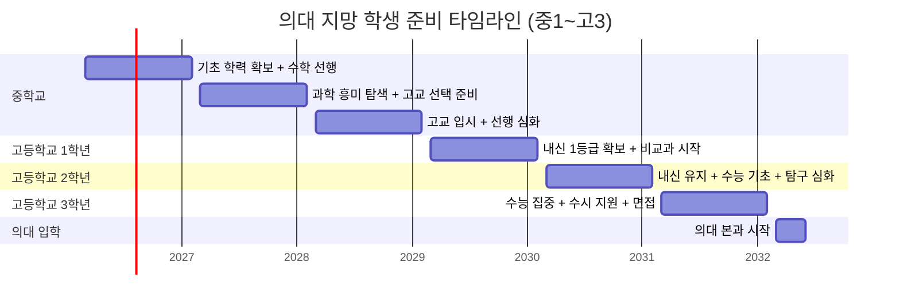
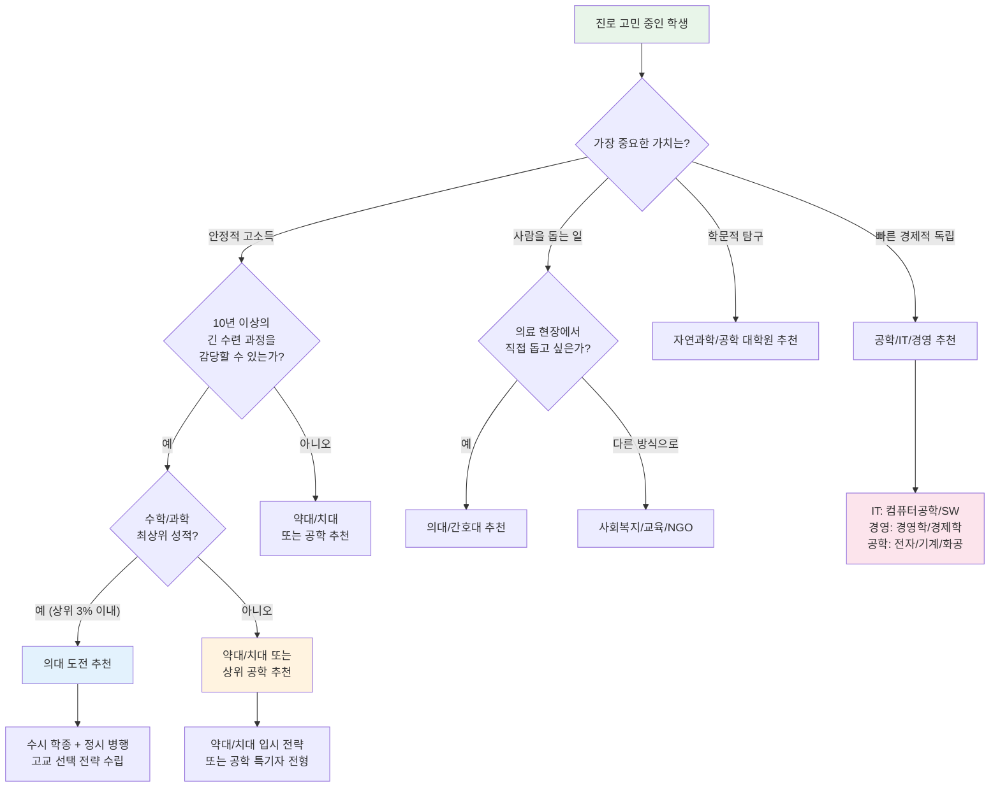
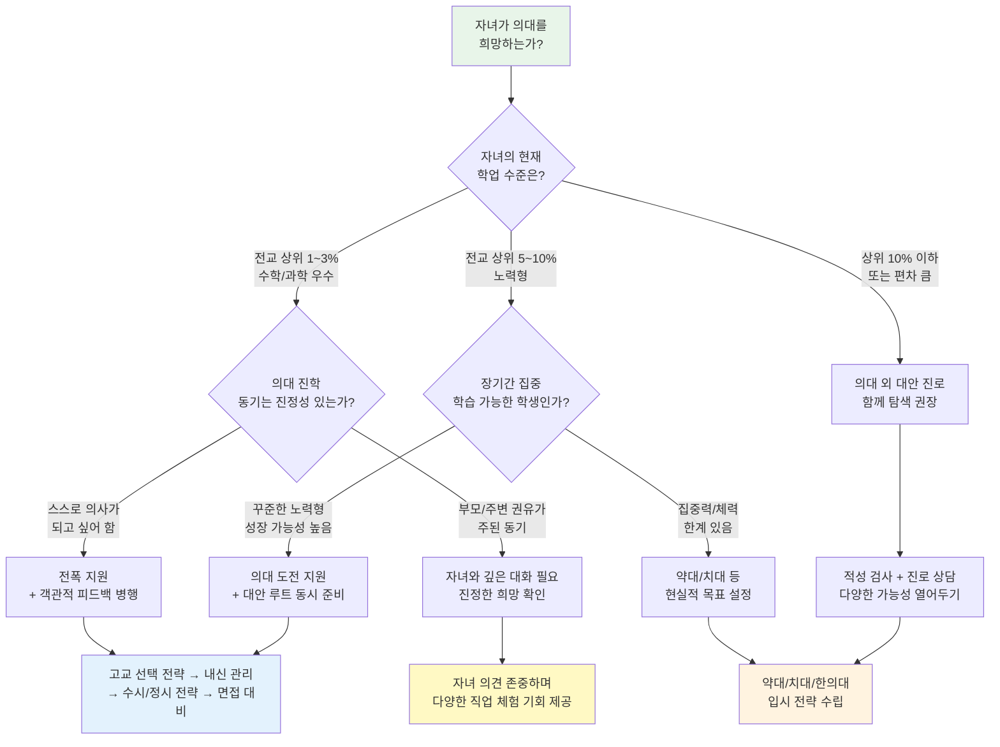

# 2026 의대 증원 후속 영향과 학종 변화

## 목차

1. [2026 의대 증원 개요](#1-2026-의대-증원-개요)
2. [의대 증원이 입시에 미치는 영향](#2-의대-증원이-입시에-미치는-영향)
3. [의대 지망 학생의 고등학교 선택 전략](#3-의대-지망-학생의-고등학교-선택-전략)
4. [학종(학생부종합전형) 변화 분석](#4-학종학생부종합전형-변화-분석)
5. [의대 외 이공계 학과 영향](#5-의대-외-이공계-학과-영향)
6. [중학생 의대 지망자를 위한 로드맵](#6-중학생-의대-지망자를-위한-로드맵)
7. [의대 증원에 따른 학교 유형별 유불리](#7-의대-증원에-따른-학교-유형별-유불리)
8. [의대 vs 비의대 진로 설계 비교](#8-의대-vs-비의대-진로-설계-비교)
9. [의대 입시의 현실](#9-의대-입시의-현실)
10. [의대 포기 시 대안 루트 가이드](#10-의대-포기-시-대안-루트-가이드)
11. [학부모를 위한 의대 입시 현실 체크](#11-학부모를-위한-의대-입시-현실-체크)

---

## 1. 2026 의대 증원 개요

### 1.1 증원 규모와 시행 시기

2024년 2월, 정부는 2025학년도부터 의대 정원을 대폭 확대하겠다고 발표했다. 기존 약 3,058명이던 의대 입학 정원이 약 5,058명 수준으로, 약 2,000명이 증원되었다. 2026학년도(2025년 입시 기준)부터 본격적으로 증원된 정원이 반영되어 현재 진행 중이다.

| 구분 | 증원 전 (2024학년도) | 증원 후 (2026학년도) | 변화폭 |
|------|---------------------|---------------------|--------|
| 전국 의대 총 정원 | 약 3,058명 | 약 5,058명 | +2,000명 (약 65% 증가) |
| 수도권 의대 배정 | 약 1,200명 | 약 1,650명 | +약 450명 |
| 비수도권 의대 배정 | 약 1,858명 | 약 3,408명 | +약 1,550명 |
| 지역인재전형 비율 | 약 40% | 약 50~60% | 대폭 확대 |

### 1.2 증원 배경과 정책 목적

정부가 의대 증원을 결정한 배경에는 복합적인 요인이 존재한다.

| 배경 요인 | 상세 설명 |
|-----------|-----------|
| 고령화 사회 | 2025년 초고령사회 진입, 의료 수요 급증 예상 |
| 지역 의료 붕괴 | 비수도권 필수의료(응급, 산부인과, 소아과) 인력 극심한 부족 |
| 필수의료 기피 | 외과, 응급의학과 등 고위험 진료과 지원자 감소 |
| OECD 대비 의사 수 부족 | 인구 1,000명당 의사 수 OECD 평균 3.7명 대비 한국 2.6명 |
| 미래 의료 기술 대응 | AI 의료, 디지털 헬스케어 분야 전문 인력 필요 |

### 1.3 증원 정책 타임라인

### 1.4 대학별 증원 규모 (주요 대학)

| 대학명 | 증원 전 정원 | 증원 후 정원 | 증원 수 | 비고 |
|--------|-------------|-------------|---------|------|
| 서울대학교 | 135명 | 165명 | +30명 | 수도권 |
| 연세대학교 | 110명 | 140명 | +30명 | 수도권 |
| 고려대학교 | 106명 | 133명 | +27명 | 수도권 |
| 성균관대학교 | 40명 | 55명 | +15명 | 수도권 |
| 울산대학교 | 40명 | 55명 | +15명 | 수도권(서울아산) |
| 전남대학교 | 125명 | 200명 | +75명 | 비수도권 |
| 경북대학교 | 110명 | 180명 | +70명 | 비수도권 |
| 전북대학교 | 99명 | 170명 | +71명 | 비수도권 |
| 충남대학교 | 110명 | 175명 | +65명 | 비수도권 |
| 부산대학교 | 125명 | 185명 | +60명 | 비수도권 |
| 강원대학교 | 49명 | 110명 | +61명 | 비수도권, 증원 비율 최대 |
| 제주대학교 | 40명 | 80명 | +40명 | 비수도권 |

---

## 2. 의대 증원이 입시에 미치는 영향

### 2.1 경쟁률 변화 추이

의대 증원 이후 경쟁률의 변화를 살펴보면 다음과 같다.

| 전형 유형 | 증원 전 경쟁률 (2024) | 증원 후 경쟁률 (2026) | 변화 | 분석 |
|-----------|----------------------|----------------------|------|------|
| 수시 학종 | 약 15:1~25:1 | 약 12:1~20:1 | 소폭 하락 | 정원 증가 대비 지원자도 증가하여 하락 폭 제한적 |
| 수시 교과 | 약 10:1~18:1 | 약 8:1~15:1 | 하락 | 지역인재전형 확대로 기회 증가 |
| 정시 일반 | 약 8:1~15:1 | 약 6:1~12:1 | 하락 | 수능 정원 증가 효과 직접 반영 |
| 정시 지역인재 | 약 5:1~10:1 | 약 4:1~8:1 | 하락 | 비수도권 대학 정원 대폭 증가 |
| 논술 전형 | 약 50:1~100:1 | 약 40:1~80:1 | 소폭 하락 | 논술 정원 자체 증가는 제한적 |

### 2.2 커트라인 변화 예측

### 2.3 수능 등급별 의대 합격 가능성 변화

| 수능 성적 구간 (백분위) | 증원 전 합격 가능 대학 | 증원 후 합격 가능 대학 | 변화 요약 |
|------------------------|----------------------|----------------------|-----------|
| 상위 0.1% (수학 1등급 상위) | 서울대, 연세대, 성균관대 의대 | 변동 없음 | 최상위권은 변화 미미 |
| 상위 0.3% | 고려대, 울산대, 가톨릭대 의대 | 변동 없음 | 상위권 역시 변화 제한적 |
| 상위 0.5~1.0% | 중앙대, 경희대, 이화여대 의대 | 수도권 중상위 의대까지 가능성 확대 | 기회 소폭 확대 |
| 상위 1.0~2.0% | 비수도권 상위 의대 (부산대, 경북대 등) | 비수도권 대부분 의대 합격 가능 | 기회 의미 있게 확대 |
| 상위 2.0~3.0% | 약대, 치대 수준 | 비수도권 하위 의대 도전 가능 | 증원 효과 가장 큰 구간 |
| 상위 3.0~5.0% | 의대 도전 어려움 | 일부 지역인재전형 도전 가능 | 지역인재 한정 기회 |

### 2.4 전형별 영향 분석

| 전형 유형 | 영향 정도 | 상세 분석 |
|-----------|----------|-----------|
| 수시 학생부교과 | 큰 영향 | 지역인재전형 확대로 비수도권 고교 학생 유리 |
| 수시 학생부종합 | 중간 영향 | 정원 증가로 기회 확대, 그러나 서류/면접 경쟁은 여전 |
| 수시 논술 | 작은 영향 | 논술 전형 정원 증가 폭이 상대적으로 작음 |
| 정시 수능 | 큰 영향 | 정원 증가가 커트라인 하락에 직접 기여 |
| 정시 지역인재 | 매우 큰 영향 | 비수도권 대학 정원 대폭 증가 + 지역인재 비율 확대 |

---

## 3. 의대 지망 학생의 고등학교 선택 전략

### 3.1 고등학교 유형별 의대 진학 유불리 총괄

| 학교 유형 | 의대 수시 유리 | 의대 정시 유리 | 내신 경쟁 | 비교과 활동 | 학습 분위기 | 종합 평가 |
|-----------|--------------|--------------|-----------|------------|------------|-----------|
| 과학고 | 상 (과학 특기) | 중상 | 매우 치열 | 매우 우수 | 매우 우수 | 최상위권 학생에게 유리 |
| 영재학교 | 상 (조기졸업 가능) | 중 | 매우 치열 | 우수 | 최우수 | 과학 영재에 특화, 의대 노선 전환 시 불리 |
| 외고/국제고 | 중하 | 중하 | 치열 | 우수 | 우수 | 자연계 교육과정 부족 |
| 자사고 | 상 (내신+비교과) | 상 | 치열 | 우수 | 우수 | 균형 잡힌 선택지 |
| 일반고 (상위권) | 중상 | 중상 | 보통 | 보통 | 중상 | 내신 관리 유리, 자기주도 필요 |
| 일반고 (일반) | 중 | 중 | 보통~낮음 | 보통 이하 | 보통 | 내신 유리하나 학습 환경 자기주도 필요 |
| 광역 자율학교 | 중상 | 중상 | 치열 | 우수 | 우수 | 자사고와 유사 |

### 3.2 의대 목표 고교 선택 의사결정 흐름

### 3.3 증원 후 지역별 고교 선택 전략

| 거주 지역 | 추천 고교 유형 | 핵심 전략 | 활용 가능한 전형 |
|-----------|--------------|-----------|-----------------|
| 서울 | 자사고 또는 상위 일반고 | 학종 + 정시 병행 | 서울 소재 의대 학종/정시 |
| 경기 | 일반고(내신 유리 학교) | 내신 확보 + 수능 | 경기 지역인재 + 수도권 의대 |
| 부산 | 상위 일반고 | 지역인재전형 적극 활용 | 부산대/인제대 의대 지역인재 |
| 대구/경북 | 일반고 또는 자율학교 | 경북대 의대 지역인재 타겟 | 경북대/계명대/대구가톨릭대 |
| 대전/충남 | 일반고 | 충남대 의대 지역인재 타겟 | 충남대/건양대 의대 |
| 광주/전남 | 일반고 | 전남대 의대 지역인재 타겟 | 전남대/조선대 의대 |
| 전북 | 일반고 | 전북대 의대 지역인재 타겟 | 전북대/원광대 의대 |
| 강원 | 일반고 | 강원대 의대 지역인재 타겟 | 강원대/한림대 의대 |
| 제주 | 일반고 | 제주대 의대 지역인재 독점 | 제주대 의대 지역인재 |

### 3.4 고등학교 유형별 의대 합격자 비율 변화 (추정)

| 고교 유형 | 증원 전 의대 합격자 비율 | 증원 후 의대 합격자 비율 | 변화 요인 |
|-----------|------------------------|------------------------|-----------|
| 과학고 | 약 15~25% | 약 18~28% | 정원 증가로 소폭 증가 |
| 영재학교 | 약 5~10% | 약 7~12% | 의대 전환 학생 증가 예상 |
| 자사고 | 약 3~8% | 약 5~10% | 학종 확대 수혜 |
| 상위 일반고 | 약 1~3% | 약 2~5% | 지역인재 + 정시 기회 확대 |
| 일반 일반고 | 약 0.1~0.5% | 약 0.3~1.0% | 지역인재전형 수혜 |
| 외고/국제고 | 약 0.5~1.5% | 약 0.5~1.5% | 변화 미미 (자연계 교육과정 부족) |

---

## 4. 학종(학생부종합전형) 변화 분석

### 4.1 의대 학종 평가 요소 변화

| 평가 요소 | 증원 전 비중 | 증원 후 비중 | 변화 방향 | 대비 전략 |
|-----------|-------------|-------------|-----------|-----------|
| 학업 역량 (내신) | 약 40% | 약 35~40% | 유지~소폭 하락 | 전과목 1등급 유지 필수 |
| 탐구 역량 | 약 20% | 약 25% | 상승 | 과학 탐구 심화 활동 강화 |
| 전공 적합성 | 약 15% | 약 15~20% | 상승 | 의료/생명과학 관련 활동 |
| 인성/공동체 | 약 15% | 약 10~15% | 유지~소폭 하락 | 봉사, 리더십 기본 수준 유지 |
| 발전 가능성 | 약 10% | 약 10% | 유지 | 학년별 성장 곡선 중요 |

### 4.2 학종 서류 준비 핵심 변화

증원 이후 학종에서 주목해야 할 핵심 변화는 다음과 같다.

| 항목 | 증원 전 | 증원 후 | 대비 포인트 |
|------|--------|--------|------------|
| 세부능력특기사항 | 과목별 우수 활동 기록 | 과학/수학 심화 탐구 중심으로 강화 | 교과 연계 탐구 보고서 작성 |
| 자율활동 | 다양한 활동 참여 | 의료/과학 관련 자율활동 비중 확대 | 과학 동아리, 학술 활동 집중 |
| 봉사활동 | 시간 위주 기록 | 의료 봉사 경험의 질적 평가 강화 | 진정성 있는 봉사 경험 |
| 독서활동 | 폭넓은 독서 | 의학/생명과학 분야 심화 독서 | 전공 관련 도서 + 인문학적 성찰 |
| 행동특성 | 기본 인성 평가 | 협업 능력, 공감 능력 중시 | 의사 자질과 연결되는 인성 |

### 4.3 의대 학종 합격생 스펙 비교

| 항목 | 수도권 상위 의대 합격생 | 비수도권 의대 합격생 | 최소 경쟁력 기준 |
|------|----------------------|---------------------|-----------------|
| 내신 평균 등급 | 1.0~1.2 | 1.0~1.5 | 1.5 이내 |
| 수학 세특 | A+ 수준, 심화 탐구 3건 이상 | A+ 수준, 심화 탐구 2건 이상 | 교과 연계 탐구 필수 |
| 과학 세특 | 심화 탐구 4건 이상, 실험 포함 | 심화 탐구 3건 이상 | 실험 기반 탐구 1건 이상 |
| 자율활동 | 리더십 + 학술 활동 병행 | 학술 활동 중심 | 과학 관련 활동 1건 이상 |
| 봉사 시간 | 80시간 이상 (질적 경험) | 60시간 이상 | 40시간 이상 |
| 수상 실적 | 교내 수학/과학 다수 | 교내 수상 있으면 유리 | 2024년부터 대입 미반영 |

### 4.4 학종 변화 핵심 요약

증원으로 인해 비수도권 의대의 학종 합격선이 낮아지면서, 기존에는 의대를 목표로 하기 어려웠던 내신 1.3~1.5 구간의 학생들에게도 기회가 열리고 있다. 그러나 수도권 상위 의대는 여전히 내신 1.0~1.2, 탐구 활동의 깊이와 일관성이 핵심 경쟁력이다.

---

## 5. 의대 외 이공계 학과 영향

### 5.1 관련 학과별 영향 분석

의대 증원은 의대뿐 아니라 인접 보건의료 계열 학과에도 연쇄적인 영향을 미치고 있다.

| 학과 | 영향 방향 | 영향 정도 | 상세 분석 |
|------|----------|----------|-----------|
| 약학대학 | 커트라인 하락 | 중간~큰 영향 | 기존 의대 지원자 일부가 의대로 이동, 약대 경쟁 완화 |
| 치과대학 | 커트라인 소폭 하락 | 중간 영향 | 치대 고유 수요 존재, 하락 폭 제한적 |
| 한의과대학 | 커트라인 하락 | 큰 영향 | 한의대 지원자 중 의대 전환 비율 높음 |
| 간호대학 | 영향 복합적 | 중간 영향 | 간호대 자체 수요 견고, 상위권 이탈 가능 |
| 수의과대학 | 소폭 하락 | 작은 영향 | 독자적 수요 기반 안정 |
| 생명과학 | 간접 영향 | 작은 영향 | 의대 불합격 시 대안으로 유입 증가 |
| 화학/화공 | 간접 영향 | 미미 | 의대와 직접 경쟁 관계 약함 |
| 전자/컴퓨터 | 거의 없음 | 미미 | 별도의 취업 시장과 수요 기반 |

### 5.2 보건의료 계열 커트라인 변화 비교

| 학과 (정시 기준) | 증원 전 커트라인 (백분위) | 증원 후 커트라인 (예상) | 변동폭 |
|-----------------|-------------------------|----------------------|--------|
| 의대 (수도권 상위) | 상위 0.1~0.3% | 상위 0.1~0.3% | 거의 변동 없음 |
| 의대 (비수도권) | 상위 0.5~1.5% | 상위 1.0~3.0% | 하락 |
| 치대 | 상위 1.0~2.0% | 상위 1.5~2.5% | 소폭 하락 |
| 한의대 | 상위 1.5~3.0% | 상위 2.0~4.0% | 하락 |
| 약대 (6년제) | 상위 2.0~4.0% | 상위 3.0~5.0% | 하락 |
| 수의대 | 상위 3.0~5.0% | 상위 3.5~5.5% | 소폭 하락 |
| 간호대 (상위) | 상위 5.0~10.0% | 상위 5.0~10.0% | 거의 변동 없음 |

### 5.3 의대 증원의 파급 효과 구조

### 5.4 학과 선택 시 고려사항 비교

| 비교 항목 | 의대 | 약대 | 치대 | 한의대 | 간호대 |
|-----------|------|------|------|--------|--------|
| 수업 연한 | 6년 (본과 4년) | 6년 | 6년 | 6년 | 4년 |
| 졸업 후 수련 | 인턴 1년 + 레지던트 3~5년 | 없음 | 없음 (선택적) | 없음 | 없음 |
| 초봉 (평균) | 약 5,000~6,000만원 (전공의) | 약 5,000~7,000만원 | 약 6,000~8,000만원 | 약 4,000~6,000만원 | 약 3,500~4,500만원 |
| 개업 가능성 | 높음 | 높음 | 매우 높음 | 높음 | 낮음 |
| 워라밸 | 과별 차이 큼 | 양호 | 양호 | 양호 | 교대 근무 |
| 고용 안정성 | 매우 높음 | 높음 | 높음 | 높음 | 매우 높음 |
| 사회적 인정 | 매우 높음 | 높음 | 높음 | 중상 | 중상 |
| 입시 난이도 (증원 후) | 최상~상 | 상~중상 | 상 | 중상~중 | 중 |

---

## 6. 중학생 의대 지망자를 위한 로드맵

### 6.1 학년별 세부 로드맵

#### 중학교 1학년

| 영역 | 활동 내용 | 목표 | 우선순위 |
|------|----------|------|----------|
| 학업 | 수학: 중1 과정 완벽 마스터, 선행 1년 이상 | 고교 수학 기초 탄탄 | 최우선 |
| 학업 | 과학: 물리/화학/생물 기초 개념 정리 | 과학 흥미 확인 및 기초 확보 | 최우선 |
| 학업 | 영어: 수능 영어 1등급 기초 체력 확보 | 영어 독해력 및 듣기 | 우선 |
| 독서 | 과학 교양서 월 1권 이상 | 과학적 사고력 및 배경지식 | 보통 |
| 탐색 | 의사/의료인 직업 탐색 | 진로 동기 형성 | 보통 |
| 기타 | 학습 습관 형성, 시간 관리 | 자기주도 학습 역량 | 최우선 |

#### 중학교 2학년

| 영역 | 활동 내용 | 목표 | 우선순위 |
|------|----------|------|----------|
| 학업 | 수학: 고1 과정 진입 (수학 상/하) | 고교 수학 선행 | 최우선 |
| 학업 | 과학: 고1 통합과학 예습 시작 | 고교 과학 선행 | 최우선 |
| 학업 | 국어: 비문학 독해 훈련 시작 | 수능 국어 기초 | 우선 |
| 고교 선택 | 고등학교 유형별 장단점 분석 | 최적 고교 결정 | 우선 |
| 탐색 | 병원/의료기관 탐방, 의사 인터뷰 | 진로 확신 강화 | 보통 |
| 독서 | 의학/생명과학 관련 도서 확대 | 전공 관련 배경지식 | 보통 |

#### 중학교 3학년

| 영역 | 활동 내용 | 목표 | 우선순위 |
|------|----------|------|----------|
| 학업 | 수학: 수학 I, II 선행 진행 | 고2 수학 선행 | 최우선 |
| 학업 | 과학: 물리학 I, 화학 I 선행 시작 | 고2 과학 선행 | 최우선 |
| 학업 | 내신: 중학교 전과목 최상위 유지 | 고교 입시 대비 | 최우선 |
| 고교 입시 | 자사고/과학고/일반고 입시 준비 | 목표 고교 합격 | 최우선 |
| 전략 수립 | 수시/정시 전략 기초 설계 | 대입 로드맵 초안 | 우선 |
| 자기소개서 | 자기소개서 작성 연습 (자사고 대비) | 자기표현 능력 | 보통 |

### 6.2 고등학교 학년별 의대 준비 로드맵

#### 고등학교 1학년

| 월 | 학업 목표 | 비교과 활동 | 입시 전략 |
|----|----------|------------|-----------|
| 3~5월 | 1학기 중간고사 전과목 1등급 목표 | 과학 동아리 가입, 학급 임원 | 학종 vs 정시 방향 탐색 |
| 6~7월 | 1학기 기말고사 1등급 확보 | 과학 탐구 활동 시작 | 1학기 학생부 점검 |
| 8월 | 여름방학 수학/과학 심화 학습 | 독서 활동 (의학 관련) | 2학기 학습 계획 수립 |
| 9~11월 | 2학기 내신 1등급 유지 | 세특 활동 본격화, 탐구 보고서 | 수시 6개 지원 전략 초안 |
| 12~2월 | 겨울방학 선행학습 (수학 II, 미적분) | 봉사활동, 독서 정리 | 고2 학습 계획 수립 |

#### 고등학교 2학년

| 월 | 학업 목표 | 비교과 활동 | 입시 전략 |
|----|----------|------------|-----------|
| 3~5월 | 수학 II, 미적분 완벽 대비 | 심화 탐구 프로젝트 시작 | 목표 대학 리스트 작성 |
| 6~7월 | 기말고사 + 수능 모의고사 병행 | 과학 탐구 보고서 완성 | 수시/정시 비율 결정 |
| 8월 | 수능 기출 분석 시작 | 여름방학 봉사 + 독서 | 학종 자소서 소재 정리 |
| 9~11월 | 2학기 내신 + 수능 동시 대비 | 세특 마무리, 리더십 활동 | 대학별 전형 분석 |
| 12~2월 | 수능 집중 학습 본격 시작 | 학생부 최종 점검 | 수시 지원 전략 확정 |

#### 고등학교 3학년

| 월 | 학업 목표 | 입시 활동 | 핵심 체크포인트 |
|----|----------|----------|----------------|
| 3~5월 | 수능 + 내신 동시 대비 | 수시 원서 전략 최종 확인 | 1학기 내신이 학종의 마지막 기회 |
| 6월 | 수능 모의평가 분석 | 수시 지원 대학 확정 | 모의고사 성적으로 정시 가능 대학 파악 |
| 7~8월 | 수능 집중 학습 (하루 12시간+) | 자기소개서 작성 | 여름방학이 수능 점수 결정 |
| 9월 | 수능 모의평가 + 수시 원서 접수 | 수시 6개교 최종 지원 | 수시 원서 제출 (안정 2 + 적정 2 + 상향 2) |
| 10~11월 | 수능 최종 마무리 | 면접 준비 (학종/논술) | 수능 당일 컨디션 관리 |
| 12월 | 수능 성적 확인 | 정시 지원 전략 수립 | 수시 결과 + 정시 배치표 분석 |
| 1~2월 | 정시 결과 대기 | 최종 합격 확인 | 예비번호 추가 합격 가능성 체크 |

### 6.3 의대 준비 전체 타임라인

---

## 7. 의대 증원에 따른 학교 유형별 유불리

### 7.1 학교 유형별 의대 입시 유불리 상세 분석

| 평가 항목 | 과학고 | 영재학교 | 자사고 | 일반고 (상위) | 일반고 (일반) | 외고/국제고 |
|-----------|--------|---------|--------|-------------|-------------|------------|
| 내신 확보 용이성 | 매우 어려움 | 매우 어려움 | 어려움 | 보통 | 용이 | 보통 |
| 수능 대비 환경 | 우수 | 매우 우수 | 우수 | 보통 | 학교 차이 큼 | 보통 |
| 과학 탐구 환경 | 최우수 | 최우수 | 우수 | 보통 | 부족 | 매우 부족 |
| 세특 기록 질 | 매우 우수 | 매우 우수 | 우수 | 보통~우수 | 보통 이하 | 보통 |
| 학종 경쟁력 | 상 | 상 | 중상 | 중 | 중하 | 하 |
| 교과전형 경쟁력 | 하 (내신 불리) | 하 | 중 | 중상 | 상 | 중 |
| 지역인재전형 활용 | 가능 (해당 지역) | 가능 (해당 지역) | 가능 (해당 지역) | 가능 | 가능 | 가능 |
| 정시 경쟁력 | 상 | 최상 | 중상 | 중 | 중하 | 중하 |
| 증원 후 종합 유리도 | 상 | 중상 | 상 | 중상 | 중 (지역인재 시 상) | 하 |

### 7.2 증원 후 학교 유형별 변화 포인트

| 학교 유형 | 증원 전 유불리 | 증원 후 변화 | 변화 이유 |
|-----------|--------------|-------------|-----------|
| 과학고 | 매우 유리 | 유리 (유지) | 정원 증가 수혜, 과학 특기 가치 유지 |
| 영재학교 | 유리 (단, 의대 노선 전환 비용 큼) | 약간 유리 | 의대 전환 학생 증가, 그러나 내신 불리 변함없음 |
| 자사고 | 유리 | 더 유리 | 학종 정원 확대 + 높은 비교과 역량 |
| 일반고 (상위) | 보통 | 유리 방향 전환 | 지역인재전형 확대 + 내신 확보 용이 |
| 일반고 (일반) | 불리 | 보통으로 개선 | 지역인재전형 적극 활용 시 기회 확대 |
| 외고/국제고 | 매우 불리 | 여전히 불리 | 자연계 교육과정 부재, 전환 비용 큼 |

### 7.3 지역인재전형의 학교 유형별 활용도

| 학교 유형 | 지역인재전형 활용 가능성 | 핵심 조건 | 전략적 활용법 |
|-----------|----------------------|-----------|-------------|
| 비수도권 과학고 | 높음 | 해당 지역 과학고 재학 | 학종 + 지역인재 이중 유리 |
| 비수도권 자사고/자율학교 | 높음 | 해당 지역 재학 | 내신 + 비교과 + 지역인재 |
| 비수도권 일반고 | 매우 높음 | 해당 지역 3년 재학 | 가장 큰 수혜 대상 |
| 수도권 고교 | 없음 | 수도권 학교는 비수도권 지역인재 불가 | 수도권 의대 정시/학종만 가능 |

---

## 8. 의대 vs 비의대 진로 설계 비교

### 8.1 진로별 종합 비교표

| 비교 항목 | 의대 | 약대 | 치대 | 공학 (상위) | 자연과학 | 경영/경제 |
|-----------|------|------|------|------------|---------|-----------|
| 대학 수학 기간 | 6년 | 6년 | 6년 | 4년 (석사 포함 6년) | 4년 (석박 포함 9~10년) | 4년 |
| 졸업 후 추가 수련 | 4~6년 (인턴+레지던트) | 없음 | 0~4년 | 없음 | 없음 | 없음 |
| 독립적 수입 시작 나이 | 32~35세 | 28~30세 | 28~32세 | 26~28세 | 30~32세 | 26~28세 |
| 30대 중반 예상 연봉 | 8,000만~1.5억 | 6,000만~1억 | 8,000만~1.5억 | 5,000만~8,000만 | 4,000만~6,000만 | 5,000만~8,000만 |
| 40대 중반 예상 연봉 | 1.5억~3억+ | 8,000만~1.5억 | 1.5억~3억+ | 7,000만~1.5억 | 5,000만~8,000만 | 8,000만~2억 |
| 개업/독립 가능성 | 매우 높음 | 높음 | 매우 높음 | 중간 (창업) | 낮음 | 중간 |
| 고용 안정성 | 최상 | 상 | 상 | 중상 | 중 | 중 |
| 워라밸 | 과별 차이 큼 | 양호 | 양호 | 회사별 차이 | 연구 중심 | 회사별 차이 |
| 사회적 지위 | 최상 | 상 | 상 | 중상 | 중 | 중상 |
| AI 대체 위험 | 낮음 (임상은 낮음) | 중간 | 낮음 | 분야별 차이 | 중간 | 중간~높음 |

### 8.2 생애 소득 비교 (추정, 단위: 억원)

| 나이 구간 | 의대 | 약대 | 치대 | 공학 (대기업) | IT/SW (상위) |
|-----------|------|------|------|-------------|-------------|
| 20대 (학생/수련) | -2억 (학비+생활비) | -1억 | -1.5억 | +1~2억 | +1.5~3억 |
| 30대 | +3~5억 | +3~4억 | +3~5억 | +4~6억 | +4~8억 |
| 40대 | +8~15억 | +5~8억 | +8~15억 | +6~10억 | +5~15억 |
| 50대 | +10~20억 | +5~10억 | +10~20억 | +6~12억 | +5~15억 |
| 60대 | +5~10억 | +3~5억 | +5~10억 | +2~5억 | +2~5억 |
| 생애 총 소득 (추정) | 24~48억 | 15~26억 | 24~48억 | 19~35억 | 17~46억 |

주의: 위 수치는 대략적인 추정치이며, 개인의 역량, 전문 분야, 경제 상황에 따라 큰 차이가 있을 수 있다.

### 8.3 진로 선택 의사결정 흐름

### 8.4 의대 선택 시 반드시 고려할 현실적 요소

| 요소 | 긍정적 측면 | 부정적 측면 | 현실 체크 |
|------|------------|------------|-----------|
| 경제적 보상 | 안정적 고소득, 개업 가능 | 수련 기간 저소득, 초기 투자 비용 큼 | 30대 중반까지 경제적 독립 어려움 |
| 사회적 지위 | 높은 사회적 인정 | 의료 분쟁, 환자 민원 증가 | 과거 대비 의사 사회적 지위 변화 중 |
| 직업 안정성 | 실직 위험 거의 없음 | 개원 시 경쟁 심화 (증원 후) | 2032년 이후 의사 공급 증가로 경쟁 심화 예상 |
| 보람/사명감 | 생명을 살리는 직업적 보람 | 감정 노동, 번아웃 | 야간 당직, 응급 상황 등 체력 소모 |
| 자율성 | 전문직으로서의 자율성 | 수련 기간 중 자율성 제한 | 전공의 근무 환경 개선 중이나 여전히 과중 |

---

## 9. 의대 입시의 현실

### 9.1 공부량과 준비 기간

의대 입시를 준비하는 학생들이 실제로 투자하는 시간과 노력을 구체적으로 살펴보자.

| 항목 | 수치 | 비고 |
|------|------|------|
| 고교 3년간 총 공부 시간 | 약 10,000~15,000시간 | 하루 평균 8~12시간 |
| 고3 하루 평균 공부 시간 | 12~16시간 | 학교 수업 포함 |
| 사교육비 (고교 3년) | 약 3,000만~8,000만원 | 수학/과학/영어 과외 포함 |
| 수능 기출 풀이 횟수 | 수학 기출 10회 이상 반복 | 최근 10년 기출 기준 |
| 모의고사 응시 횟수 | 연간 30~50회 | 학교 모의고사 + 사설 모의고사 |
| 의대 합격까지 평균 재수 횟수 | 0.5~1.5회 | 재수/삼수 비율 약 30~40% |

### 9.2 의대 입시 성공률의 현실

| 기준 | 수치 | 의미 |
|------|------|------|
| 전체 수능 응시자 대비 의대 합격률 | 약 1.0~1.2% (증원 후) | 100명 중 1명 |
| 수학 1등급 학생 대비 의대 합격률 | 약 10~15% | 1등급도 대부분 불합격 |
| 의대 지망 선언 학생 대비 실제 합격률 | 약 15~25% | 4~6명 중 1명만 합격 |
| 수시 학종 경쟁률 (증원 후) | 약 12~20:1 | 서류 합격 후 면접 경쟁 |
| 정시 합격률 (지원 대비) | 약 15~25% | 안정 지원 시 기준 |
| 재수 후 의대 합격률 | 약 30~40% | 재수해도 과반수는 불합격 |

### 9.3 의대 합격생의 전형적 프로필

| 항목 | 수도권 상위 의대 합격생 | 비수도권 의대 합격생 (증원 후) |
|------|----------------------|---------------------------|
| 내신 평균 | 1.0~1.2등급 | 1.0~1.5등급 |
| 수능 백분위 | 상위 0.1~0.5% | 상위 1.0~3.0% |
| 수학 등급 | 1등급 (만점~96점) | 1등급 |
| 과탐 등급 | 1~2등급 (2과목 합 2~3) | 1~2등급 |
| 국어 등급 | 1~2등급 | 1~2등급 |
| 영어 등급 | 1등급 | 1등급 |
| 세특 수준 | 교과별 심화 탐구, 일관된 의학 관심 | 교과 연계 탐구 활동 |
| 면접 역량 | MMI/다중미니면접 대비 철저 | 기본 면접 역량 |
| 사교육 규모 | 월 150~300만원 | 월 80~200만원 |

### 9.4 의대 입시에서 실패하는 주요 원인

| 실패 원인 | 비율 (추정) | 상세 설명 |
|-----------|-----------|-----------|
| 수학 성적 부족 | 약 35% | 수학 2등급 이하 시 의대 합격 거의 불가 |
| 과탐 성적 부족 | 약 15% | 과학탐구 1~2과목 2등급 이하 |
| 내신 불균형 | 약 15% | 특정 과목 3등급 이하 시 학종 불리 |
| 면접 실패 | 약 10% | 서류 합격 후 면접에서 탈락 |
| 수시/정시 전략 실패 | 약 10% | 상향 지원 과다, 안정 지원 부족 |
| 멘탈 관리 실패 | 약 10% | 수능 당일 긴장, 슬럼프 극복 실패 |
| 기타 (건강, 가정환경 등) | 약 5% | 체력 저하, 가정 문제 등 |

### 9.5 의대 입시 현실 vs 기대 비교

| 항목 | 학생/학부모 기대 | 현실 |
|------|-----------------|------|
| 내신 1등급이면 합격 | O | 내신 1등급은 최소 조건일 뿐, 충분 조건이 아님 |
| 재수하면 반드시 합격 | O | 재수 후 합격률도 30~40%에 불과 |
| 사교육 많이 하면 유리 | O | 사교육은 도움이 되지만, 자기주도 학습 시간이 더 중요 |
| 의대 가면 무조건 고소득 | O | 전공과별 소득 차이 크고, 개원 경쟁 심화 |
| 비수도권 의대는 서울 의대보다 가치 낮음 | O | 의사 면허는 동일하며, 비수도권 의대 출신도 동등한 의료행위 가능 |
| 증원 후 의대 가기 쉬워짐 | 부분적 O | 비수도권 의대는 기회 확대, 수도권 상위 의대는 변화 미미 |

---

## 10. 의대 포기 시 대안 루트 가이드

### 10.1 의대 대안 루트 전체 지도

의대 진학이 어렵거나 다른 진로를 모색하는 경우, 다양한 대안이 존재한다.

| 대안 루트 | 입시 난이도 | 소득 전망 | 적합한 학생 유형 | 의대 대비 장점 |
|-----------|-----------|----------|-----------------|--------------|
| 약학대학 | 상~중상 | 높음 | 화학/생물 우수, 안정 지향 | 수련 기간 없음, 빠른 취업 |
| 치과대학 | 상 | 매우 높음 | 손재주 + 과학 우수 | 개원 수익 높음, 워라밸 양호 |
| 한의과대학 | 중상 | 높음 | 한의학 관심, 대체의학 흥미 | 독자적 의료 영역, 경쟁 상대적 적음 |
| 간호대학 | 중 | 중상 | 환자 케어 관심, 빠른 취업 | 4년제, 고용 안정성 최상 |
| 수의과대학 | 중상 | 중상~높음 | 동물 의료 관심 | 동물 의료 시장 성장 중 |
| 바이오/생명공학 | 중 | 중~높음 | 연구 지향, 과학 흥미 | 바이오 산업 성장, 연구 기회 |
| 의공학/의료AI | 중 | 중~높음 | IT + 의료 융합 관심 | 미래 성장 분야, AI 의료 수요 |
| 보건행정/의료경영 | 중하 | 중 | 의료 시스템 관심, 경영 적성 | 병원 경영, 보건 정책 분야 |
| 방사선학/임상병리 | 중하~하 | 중 | 의료 기술직 관심 | 안정적 취업, 전문 기술직 |

### 10.2 성적 구간별 추천 대안 루트

| 성적 구간 | 1순위 추천 | 2순위 추천 | 3순위 추천 |
|-----------|-----------|-----------|-----------|
| 수능 상위 1~3% (의대 아슬아슬) | 약대/치대 | 상위 자연계 (서울대 생명과학 등) | 의공학/바이오공학 |
| 수능 상위 3~5% | 한의대 | 약대 (비수도권) | 수의대 |
| 수능 상위 5~10% | 간호대 (상위) | 수의대 | 바이오/생명과학 |
| 수능 상위 10~20% | 간호대 | 보건계열 | 의료 기술직 (방사선, 물리치료) |
| 내신 1~2등급, 수능 부진 | 간호대 (수시) | 보건계열 (수시) | 바이오/생명과학 (수시) |

### 10.3 의대 포기 후 진로 전환 타이밍별 전략

| 포기 시점 | 상황 | 추천 전략 | 주의사항 |
|-----------|------|----------|---------|
| 고1 1학기 | 내신 2~3등급, 의대 가능성 낮음 판단 | 약대/치대/한의대로 목표 전환 | 아직 충분한 시간, 내신 회복 여지 있음 |
| 고2 | 수능 모의고사 결과 의대 어려움 판단 | 약대/치대 또는 상위 자연계로 전환 | 학종 서류 방향 수정 필요 |
| 고3 6월 | 수능 모의평가 결과 의대 어려움 확인 | 수시: 약대/치대/한의대 지원, 정시: 성적 맞는 최선 선택 | 수시 원서 전략 재설계 시급 |
| 고3 수능 후 | 수능 성적 의대 커트 미달 | 정시: 약대/치대/한의대/상위 자연계 지원 | 재수 결정 시 신중하게 (성적 향상 보장 없음) |
| 재수 중 | 2차 시도에서도 의대 어려움 판단 | 가능한 최선의 보건의료 학과 진학 | 삼수는 기회비용 매우 큼, 신중 결정 |

### 10.4 대안 루트의 장기 커리어 전망

| 대안 루트 | 5년 후 전망 | 10년 후 전망 | 20년 후 전망 |
|-----------|------------|------------|------------|
| 약사 | 약국 취업/병원 약사 (연 5,000만~7,000만) | 약국 개업 또는 제약사 (연 7,000만~1.2억) | 안정적 수입 유지 (연 8,000만~1.5억) |
| 치과의사 | 수련 후 취업 (연 6,000만~8,000만) | 개원 (연 1억~2억) | 안정적 고소득 (연 1.5억~3억) |
| 한의사 | 개원 또는 한방병원 (연 4,000만~6,000만) | 개원 안정화 (연 6,000만~1억) | 안정적 (연 7,000만~1.5억) |
| 간호사 | 병원 근무 (연 4,000만~5,000만) | 전문간호사/관리자 (연 5,000만~7,000만) | 간호 관리자/교수 (연 6,000만~8,000만) |
| 바이오/생명공학 | 연구원/바이오기업 (연 4,000만~6,000만) | 시니어 연구원 (연 6,000만~1억) | 기업 임원/창업 (가변적) |
| 의료AI/의공학 | IT 기업/의료기기 (연 5,000만~8,000만) | 시니어 엔지니어 (연 8,000만~1.5억) | CTO/창업 (가변적, 높은 상한) |

---

## 11. 학부모를 위한 의대 입시 현실 체크

### 11.1 학부모가 알아야 할 핵심 현실

많은 학부모가 자녀의 의대 진학에 대해 과도한 기대 또는 막연한 불안을 갖고 있다. 다음은 학부모가 반드시 알아야 할 현실적인 정보이다.

| 오해 | 현실 | 학부모 대응 |
|------|------|------------|
| "우리 아이가 공부 좀 하면 의대 갈 수 있다" | 의대는 전국 상위 1~3% 학생만 합격 가능한 초고난도 입시 | 객관적 성적 평가 후 현실적 목표 설정 |
| "돈을 많이 투자하면 합격한다" | 사교육비 투자와 합격률은 비례하지 않음. 자기주도 학습이 핵심 | 사교육 효율성 점검, 학습 습관에 투자 |
| "비수도권 의대는 가치가 낮다" | 의사 면허는 전국 동일, 비수도권 의대 출신도 수도권 수련 가능 | 비수도권 의대도 충분히 좋은 선택 |
| "의대만이 성공이다" | 약대/치대/공학/IT 등 다양한 고소득 고안정 직업 존재 | 자녀의 적성과 행복을 우선 고려 |
| "증원되면 쉽게 간다" | 증원 효과는 비수도권에 집중, 수도권 상위 의대는 변화 미미 | 증원 효과를 정확히 이해하고 전략 수립 |
| "재수하면 반드시 성적이 오른다" | 재수 후 성적 향상은 약 60~70%, 하락하는 경우도 10~20% | 재수 결정 시 신중하게, 대안도 함께 고려 |

### 11.2 학부모의 역할별 체크리스트

| 역할 | 해야 할 일 | 하지 말아야 할 일 |
|------|-----------|-----------------|
| 정보 수집 | 입시 설명회 참석, 대학 전형 분석 | 소문이나 카페 정보만으로 판단 |
| 정서 지원 | 격려와 응원, 스트레스 관리 지원 | 과도한 압박, 비교 발언 |
| 환경 조성 | 집중할 수 있는 학습 환경, 건강 관리 | 학원 스케줄 과다 편성 |
| 전략 수립 | 전문 입시 컨설턴트 상담 활용 | 학부모 주도의 일방적 진로 결정 |
| 대안 준비 | 의대 외 대안 루트 함께 탐색 | "의대 아니면 안 된다" 식 태도 |
| 재정 관리 | 3년간 사교육비 예산 계획 | 무계획적 사교육비 지출 |

### 11.3 시기별 학부모 행동 가이드

| 시기 | 학부모 행동 | 자녀 지원 방법 | 주의사항 |
|------|-----------|---------------|---------|
| 중학교 | 다양한 진로 탐색 지원, 학습 습관 형성 | 과학관/병원 견학, 의사 멘토링 | 너무 이른 진로 확정은 위험 |
| 고1 | 내신 관리 환경 조성, 비교과 정보 수집 | 학교 활동 격려, 건강 관리 | 첫 내신 결과에 과도반응 금지 |
| 고2 | 입시 전략 수립, 수시/정시 비율 결정 | 모의고사 결과 함께 분석, 멘탈 관리 | 동요하지 않는 일관된 지지 |
| 고3 상반기 | 수시 원서 전략 확정, 자기소개서 지원 | 영양/건강/수면 관리, 정서적 안정 | 수시 원서 6개 선택에 과도 개입 자제 |
| 고3 하반기 | 수능 응원, 면접 준비 지원 | 수능 당일 컨디션 관리, 면접 연습 상대 | 수능 후 결과에 대한 과도 반응 금지 |
| 정시 기간 | 정시 지원 전략 함께 수립 | 객관적 배치표 분석 지원 | 상향 지원 유혹 주의 |

### 11.4 사교육비 현실적 예산 가이드

| 항목 | 월 최소 | 월 평균 | 월 최대 | 비고 |
|------|--------|--------|--------|------|
| 수학 과외/학원 | 30만원 | 80만원 | 200만원 | 1:1 과외 시 최대, 그룹과외 시 절감 |
| 과학 과외/학원 | 20만원 | 50만원 | 150만원 | 물리/화학 중심 |
| 국어 학원 | 15만원 | 40만원 | 100만원 | 비문학 독해 위주 |
| 영어 학원 | 10만원 | 30만원 | 80만원 | 1등급 확보 후 유지 수준 |
| 입시 컨설팅 | - | 월 10만원 (연간) | 월 30만원 | 연간 100~300만원 |
| 모의고사/교재 | 5만원 | 10만원 | 20만원 | 사설 모의고사 포함 |
| 월 총액 | 약 80만원 | 약 220만원 | 약 580만원 | |
| 3년 총액 | 약 2,880만원 | 약 7,920만원 | 약 2억 880만원 | |

### 11.5 의대 합격 후에도 알아야 할 현실

| 항목 | 내용 | 학부모 대비 |
|------|------|------------|
| 의대 등록금 | 국립 연 400~600만원, 사립 연 1,000~1,500만원 | 6년간 총 2,400만~9,000만원 |
| 의대 학업 강도 | 고등학교보다 더 높은 학습량, 해부학/생리학 등 | 졸업까지 자녀 지원 지속 필요 |
| 의사국시 합격률 | 약 90~95% | 국시 불합격 시 1년 유급 가능 |
| 인턴/레지던트 | 연봉 약 4,000~5,000만원, 주 80~100시간 근무 | 수련 기간 중 경제적 자립 어려움 |
| 전문의 취득 | 졸업 후 4~6년 추가 수련 | 30대 중반까지 부모 지원 필요 가능 |
| 개원 비용 | 약 2~10억원 (과별 차이) | 개원 시 대출 부담 존재 |

### 11.6 의대 입시 투자 대비 수익 분석

| 투자 항목 | 금액 (추정) |
|-----------|------------|
| 고교 3년 사교육비 | 약 5,000만~1억원 |
| 재수 비용 (해당 시) | 약 2,000만~4,000만원 |
| 의대 6년 등록금 | 약 2,500만~9,000만원 |
| 의대 6년 생활비 | 약 3,000만~6,000만원 |
| 총 투자 비용 | 약 1억~2.5억원 |

| 수익 항목 | 금액 (추정) |
|-----------|------------|
| 전문의 이후 30년 총 소득 | 약 30~60억원 |
| 투자 대비 수익률 | 약 12~24배 |
| 비의료 직종 대비 초과 소득 | 약 10~30억원 |

단, 이 수치는 평균적 추정이며 전문과목, 개원 여부, 경제 상황에 따라 큰 차이가 있다.

### 11.7 학부모 의사결정 흐름도

---

## 부록: 핵심 용어 정리

| 용어 | 설명 |
|------|------|
| 학종 (학생부종합전형) | 학교 생활기록부를 종합 평가하는 수시 전형 |
| 교과전형 (학생부교과전형) | 내신 성적 위주로 선발하는 수시 전형 |
| 정시 | 수능 성적으로 선발하는 전형 |
| 지역인재전형 | 해당 지역 고교 출신 학생에게 기회를 제공하는 전형 |
| 세특 (세부능력특기사항) | 교과 수업 중 학생의 탐구 활동을 기록한 학생부 항목 |
| MMI (Multiple Mini Interview) | 다수의 면접관이 여러 상황에서 평가하는 의대 면접 방식 |
| 커트라인 | 합격과 불합격을 가르는 최저 성적 기준 |
| 전공의 | 전문의 자격 취득을 위해 수련 중인 의사 |
| 인턴 | 의대 졸업 후 1년간 각 과를 돌며 수련하는 과정 |
| 레지던트 | 특정 전문과에서 3~5년간 수련하는 과정 |
| 의사국시 (의사국가시험) | 의사 면허를 취득하기 위한 국가 시험 |

---

## 부록: 자주 묻는 질문 (FAQ)

**Q1. 의대 증원 이후 비수도권 의대 가치가 떨어지나요?**

아닙니다. 의사 면허는 전국적으로 동일하며, 비수도권 의대 졸업 후에도 수도권 병원에서 수련을 받을 수 있습니다. 의대의 브랜드보다 의사 면허 자체의 가치가 핵심입니다.

**Q2. 증원 후 개원 경쟁이 심해지지 않나요?**

장기적으로 의사 수 증가에 따라 개원 경쟁이 심화될 수 있습니다. 그러나 이는 2032년 이후의 문제이며, 현재의 필수의료 부족 상황을 고려하면 단기적으로 의사 수요는 충분합니다. 또한 고령화에 따른 의료 수요 증가가 공급 증가를 상쇄할 것으로 예상됩니다.

**Q3. 중학생인데 지금부터 의대 준비해야 하나요?**

중학교 시기에는 의대 입시 자체를 준비하기보다, 학습 습관 형성과 수학/과학 기초 실력 확보에 집중하는 것이 중요합니다. 지나치게 이른 시기의 입시 준비는 번아웃의 원인이 될 수 있습니다.

**Q4. 일반고에서 의대 가는 것이 현실적으로 가능한가요?**

가능합니다. 특히 증원 후 비수도권 의대의 지역인재전형을 활용하면 일반고 학생에게도 충분한 기회가 있습니다. 핵심은 내신 1등급 확보와 수능 상위 성적을 동시에 달성하는 것입니다.

**Q5. 의대 진학을 위해 과학고에 가야 하나요?**

반드시 그렇지는 않습니다. 과학고는 과학 탐구에 특화된 교육환경을 제공하지만, 내신 경쟁이 매우 치열합니다. 자신의 학업 수준, 성격, 학습 스타일을 고려하여 가장 유리한 고교를 선택하는 것이 중요합니다.

**Q6. 의대 증원이 취소될 가능성은 있나요?**

2026년 현재 증원 정책은 시행 중이며, 정부의 확고한 의지가 반영되어 있습니다. 단기간 내 취소 가능성은 매우 낮으나, 장기적으로 의사 수급 상황에 따라 정원 조정은 있을 수 있습니다.

**Q7. 의대 외에 고소득을 보장하는 진로는?**

치과대학, 약학대학은 의대와 유사한 수준의 안정적 고소득을 제공합니다. IT/소프트웨어 분야는 상한선이 높지만 변동성이 큽니다. 변호사, 회계사 등 전문직도 고소득 가능하나 최근 경쟁이 심화되고 있습니다.

---

*본 자료는 2026년 7월 기준으로 작성되었으며, 입시 정책은 매년 변동될 수 있습니다. 최신 정보는 각 대학 입학처 및 한국대학교육협의회(대교협) 공식 발표를 확인하시기 바랍니다.*
