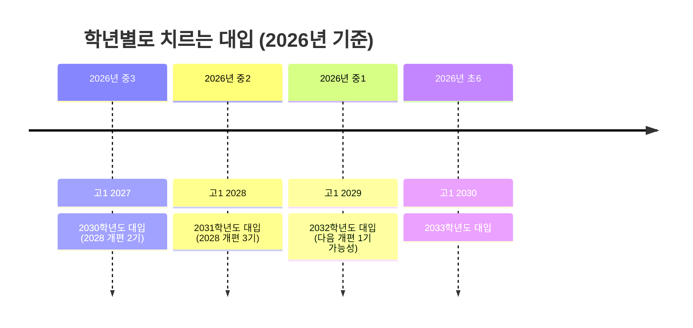
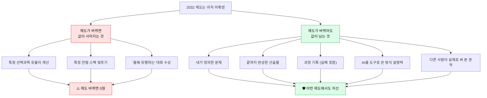

# 2032 대입 — 지금 중1이 치르는 시험, 무엇이 정해졌고 무엇이 안 정해졌나

> - **대상**: 2026년 기준 중1·중2 학생과 학부모 · **기준일**: 2026년 8월
> - **한 줄 소개**: 2032학년도 대입은 **지금 중1이 치르는 시험**이에요. 확정된 것과 예측인 것을 갈라 놓고, 학년별로 지금 뭘 할지까지 정리했어요.

---

## 0. 30초 요약 — 이것만 알고 시작해요

| 질문 | 한 줄 답 |
|---|---|
| **2032 대입은 누가 봐요?** | **2026년 지금 중1**이에요. (중1 2026 → 고1 2029 → 고3 2031 → **2032학년도 대입**) |
| **제도가 확정됐나요?** | ❌ 아니요. 확정된 건 **2028 개편**까지예요. 2032는 그 위에 얹힐 **다음 판**이고 아직 발표 전이에요. |
| **그럼 뭘 믿고 준비해요?** | **2028에서 확정된 방향**(내신 5등급·통합형 수능·세특 중심)은 2032에도 유지될 가능성이 커요. 방향에 베팅하세요. |
| **가장 안전한 준비는?** | 제도가 어떻게 바뀌어도 값이 떨어지지 않는 것 — **내가 직접 만든 것(산출물)과 그 기록**이에요. |
| **한 단어로?** | **증거**. 2032는 "무엇을 아는가"보다 **"무엇을 만들어 봤는가"**를 묻는 방향으로 가고 있어요. |

> ⚠️ **먼저 약속**: 이 문서에서 **[확정]**이라고 쓴 것만 확정이에요. **[예측]**은 정책 방향과 전문가 전망을 근거로 한 추정이고, 바뀔 수 있어요. 둘을 섞어서 읽으면 안 됩니다.

---

## 1. 내 학년은 어느 판에서 뛰나요?

| 지금 학년 (2026) | 고1 입학 | 치르는 대입 | 적용 제도 |
|---|---|---|---|
| 중3 | 2027 | 2030학년도 | **[확정] 2028 개편 적용** |
| 중2 | 2028 | 2031학년도 | **[확정] 2028 개편 적용** |
| **중1** | 2029 | **2032학년도** | **[예측] 2028 개편 + 다음 개편 얹힘** |
| 초6 | 2030 | 2033학년도 | [예측] 다음 개편 본격 적용 |

> 📌 **무릎을 칠 포인트**: 중1은 **"2028 개편도 받고, 그 다음 개편도 받는"** 첫 학년이에요. 그래서 **한 가지 제도에만 최적화하면 위험**해요. 제도가 흔들려도 남는 것에 시간을 쓰는 게 유일한 안전장치예요.

---

## 2. [확정] 2032까지 그대로 갈 가능성이 큰 것

2028 개편에서 확정된 아래 4가지는 **되돌리기 어려운 구조 변화**예요. 2032에도 유지된다고 보고 준비해도 됩니다.

| 확정 사항 | 내용 | 2032 학생에게 주는 뜻 |
|---|---|---|
| **내신 5등급제** | 상위 10%가 1등급 | 한 문제 실수로 등급이 날아가지 않아요 → **비교과·세특에서 갈려요** |
| **통합형 수능** | 국·수·탐구 공통 출제, 선택과목 폐지 | 과목 유불리 게임이 사라져요 → **수능만으로는 변별이 어려워요** |
| **심화수학 미포함** | 수능에 심화수학 없음 | 이과 최상위도 **수능 밖 증거**가 필요해요 |
| **세특 비중 상승** | 학생부 중 세특이 핵심 자료(35~40%대) | **"수업에서 무엇을 했는가"**가 성적표만큼 무거워져요 |
| **고교학점제** | 학생이 과목을 골라 이수 | **내 선택 과목 조합 자체가 하나의 진술**이 돼요 |

> 💡 **한 줄 요약**: 확정된 다섯 가지는 전부 같은 방향을 가리켜요 — **시험 점수의 변별력을 낮추고, 학생이 만든 기록의 변별력을 높이는 것**.

---

## 3. [예측] 2032에서 새로 얹힐 가능성이 있는 것

> ⚠️ 아래는 **확정 아님**. 정책 방향(고교학점제 정착, IB/KB 확산, 논·서술형 확대 논의, AI 활용 가이드라인 정비)에서 나온 추정이에요.

| 영역 | 지금 (2026) | 2028 [확정] | 2032 [예측] |
|---|---|---|---|
| **평가 형식** | 객관식 중심 | 객관식 + 서술형 확대 논의 | **논·서술형 비중 추가 확대 가능성** |
| **AI 사용** | 학교별 제각각 | 가이드라인 정비 중 | **"AI를 어떻게 썼는지 밝히기"가 기본 요구** |
| **산출물** | 있으면 좋은 것 | 세특의 핵심 재료 | **포트폴리오/산출물 평가의 제도화 가능성** |
| **KB(한국형 바칼로레아)** | 2026.9 대구 평가 시스템 첫 가동 | 확산 초기 | **대입 반영 논의 본격화 (고등교육법 개정 2027 목표)** |
| **면접** | 학교별 상이 | 비중 확대 | **"네가 만든 것"을 캐묻는 검증형 면접 확대** |

> ⚠️ **주의**: KB는 **아직 대학이 공식 인정하는 제도가 아니에요.** "KB 하면 대입에 유리하다"는 말은 2026년 8월 현재 근거가 없습니다. 제도가 아니라 **KB식 학습 방법**(탐구→논증→산출)만 가져다 쓰는 게 안전해요.

---

## 4. 2032 대비의 핵심 원리 — "제도 무관 자산"에 투자하기

> 📌 **무릎을 칠 포인트**: 중1은 **입시까지 6년**이 남았어요. 6년은 제도가 두 번 바뀔 수 있는 시간이에요. 그래서 **"제도에 맞추는 준비"가 아니라 "제도가 무엇이든 쓸 수 있는 자산"**을 쌓아야 해요. 그 자산이 바로 **산출물과 기록**입니다.

---

## 5. 학년별 실행 매뉴얼 (2026년 중1 기준)

| 시기 | 목표 | 구체적으로 할 일 | 남길 증거 |
|---|---|---|---|
| **중1** | 관심 영역 3개 좁히기 | 아주 작은 것 3개 만들어 보기 (블로그·앱·영상 무엇이든) | 만든 것 3개 + 각 500자 회고 |
| **중2** | 하나를 깊게 | 관심 1개를 골라 **4주 프로젝트** 완주 | 산출물 1개 + 사용자 반응 기록 |
| **중3** | 고교 선택 + 연결 | 내 프로젝트를 이어갈 수 있는 고교/과목 확인 | 진학 이유서 1장(왜 이 학교인가) |
| **고1** | 과목 선택 = 진술 | 고교학점제 과목 조합을 프로젝트와 정렬 | 이수 계획서 |
| **고2** | 세특 원료 만들기 | 수업 과제를 내 프로젝트와 연결해 심화 | 과목별 탐구 산출물 |
| **고3** | 정리·설명 | 6년치 기록을 하나의 이야기로 압축 | 포트폴리오 + 면접 답변 프레임 |

> 💡 **팁**: 중1이 지금 당장 해야 할 단 하나를 고르라면 — **"기록 습관"**이에요. 만든 것을 날짜와 함께 남기는 폴더 하나. 6년 뒤 이게 가장 비싼 자산이 됩니다.

---

## 6. 자주 하는 오해 5가지

| 오해 | 사실 |
|---|---|
| "2032 제도가 나올 때까지 기다렸다 준비하면 된다" | 발표는 보통 **고1 직전**에 나와요. 그때 시작하면 쌓을 시간이 없어요. |
| "수능이 쉬워지니 공부 안 해도 된다" | 반대예요. **변별이 다른 곳으로 옮겨간 것**이지 사라진 게 아니에요. |
| "IB/KB 학교에 가야 유리하다" | KB는 아직 대입 인정 제도가 아니에요. **방식**은 어디서든 따라 할 수 있어요. |
| "대회 수상이 곧 포트폴리오다" | 수상은 결과 한 줄이에요. 2032가 보는 건 **과정과 완성도**예요. |
| "AI 쓰면 감점된다" | 숨기면 문제예요. **밝히고 설명하면 오히려 역량 증거**가 돼요. |

---

## 7. 오늘 할 수 있는 3가지 체크리스트

- [ ] 내 학년이 몇 년도 대입을 치르는지 위 표에서 확인했다
- [ ] "제도 무관 자산" 목록(4장 초록 박스) 중 지금 내가 가진 게 몇 개인지 세어 봤다
- [ ] 만든 것을 모아 둘 폴더(또는 노션·블로그) 하나를 오늘 만들었다

---

> 🎯 **최종 메시지**: 2032 대입에서 가장 위험한 태도는 **"제도가 확정되면 그때 맞추겠다"**예요. 확정을 기다리는 6년과, 만들면서 보내는 6년은 결과가 완전히 다릅니다. 제도는 바뀌어도 **당신이 만든 것은 바뀌지 않아요.**

> 🔗 **함께 보면 좋아요**: 「왜 창직·융합 교육인가」 · 「누가 더 많이, 제대로 만들었나 — 메이커 증거 루브릭」 · 「AI 시대 6대 역량 지도」
