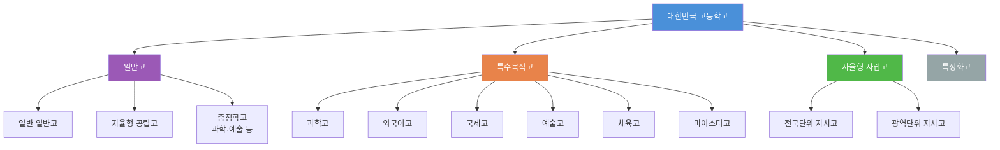
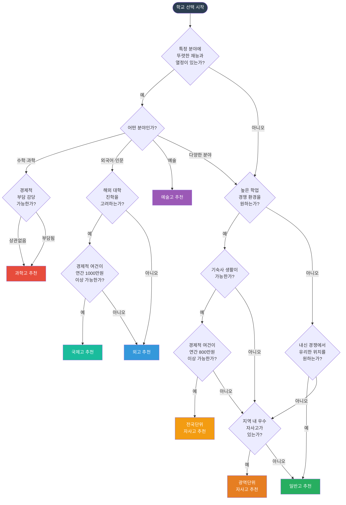
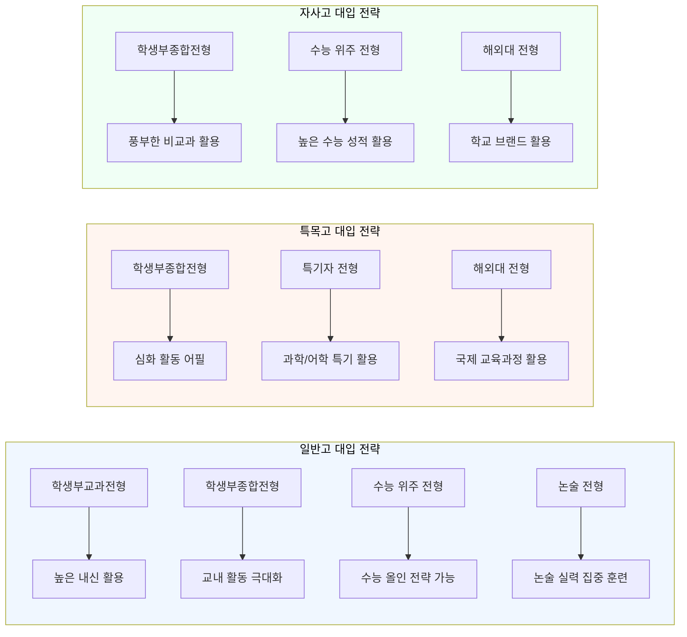
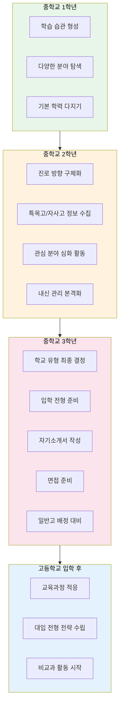

# 일반고 vs 특목·자사 비교

## 서론: 학교 선택이 중요한 이유

고등학교 선택은 단순히 3년간 다닐 학교를 고르는 것이 아닙니다. 학교 유형에 따라 내신 산출 방식, 교육과정의 깊이, 대입 전형 전략, 교우 관계, 학습 환경이 크게 달라지며, 이 모든 요소가 대학 입시와 장기적인 진로에 직접적인 영향을 미칩니다.

많은 학부모와 학생이 "특목고나 자사고에 가면 무조건 유리하다"거나 "일반고에서는 좋은 대학에 갈 수 없다"는 막연한 인식을 갖고 있습니다. 그러나 현실은 훨씬 복잡합니다. 각 학교 유형에는 명확한 장단점이 있으며, 학생의 성향, 학업 능력, 가정 경제 상황, 진로 방향에 따라 최적의 선택이 달라집니다.

이 가이드는 일반고, 과학고, 외고, 국제고, 자사고, 예술고를 객관적인 데이터와 구체적인 사례를 바탕으로 비교 분석합니다. 단순한 비교표를 넘어, 실제 학교생활의 차이, 비용 구조, 졸업 후 진로 통계, 의사결정 체크리스트까지 포괄적으로 다루어 학생과 학부모가 현명한 선택을 내릴 수 있도록 돕고자 합니다.

---

## 핵심 비교 매트릭스

아래 표는 각 학교 유형의 주요 특성을 한눈에 비교한 것입니다.

| 비교 항목 | 일반고 | 과학고 | 외고 | 국제고 | 자사고(전국) | 자사고(광역) | 예술고 |
|---|---|---|---|---|---|---|---|
| 내신 경쟁도 | 중간 (학교별 편차 큼) | 매우 높음 (상위권 밀집) | 높음 (어문 과목 치열) | 높음 (영어 과목 치열) | 매우 높음 (전국 상위권) | 높음 (지역 상위권) | 낮음~중간 (실기 비중 큼) |
| 수업 강도 | 보통 (정규+보충) | 매우 높음 (심화+연구) | 높음 (원어 수업 다수) | 높음 (IB/AP 등 국제과정) | 높음 (자체 심화과정) | 높음 (자체 교육과정) | 중간 (실기+이론 병행) |
| 심화 프로그램 | 학교별 상이, 제한적 | R&E, 과학 올림피아드, 연구 프로젝트 | 외국어 인증, 통번역 체험, 모의UN | IB/AP, 해외 교류, 글로벌 프로젝트 | 자체 AP, 심화 교과, 연구 프로그램 | 자체 심화 교과, 방과후 심화 | 전공 실기 심화, 공연·전시 |
| 진학 전략 | 학종, 교과전형, 수능 병행 | 학종 위주, 과학 특기자 | 학종 위주, 어학 특기자 | 학종, 해외대 병행 | 학종+수능 균형 | 학종+교과 전형 | 실기 위주 전형 |
| 연간 학비 | 약 150~200만원 | 무상 (장학금 지급) | 약 300~500만원 | 약 800~1,200만원 | 약 800~1,500만원 | 약 400~800만원 | 약 300~600만원 |
| 기숙사 여부 | 일부 학교만 운영 | 대부분 전원 기숙 | 대부분 기숙사 운영 | 대부분 기숙사 운영 | 전원 기숙 의무 | 일부 학교 운영 | 일부 학교 운영 |
| 대입 주요 전형 | 학생부교과, 학종, 수능 | 학종 (과학인재) | 학종 (글로벌인재) | 학종, 해외대 | 학종, 수능 위주 | 학종, 교과 전형 | 실기 위주, 학종 |
| 교사 대 학생 비율 | 약 1:18~22 | 약 1:8~12 | 약 1:12~16 | 약 1:10~14 | 약 1:10~14 | 약 1:14~18 | 약 1:12~16 |
| 동아리 다양성 | 매우 다양 (30~50개) | 과학 중심 (20~30개) | 어문·문화 중심 (25~35개) | 글로벌·인문 (25~35개) | 다양 (30~50개) | 다양 (25~40개) | 예술 중심 (20~30개) |
| 해외 프로그램 | 제한적, 학교별 상이 | 해외 과학 캠프, 교류 | 자매학교 교환, 해외 어학연수 | 해외대 연계, 교환학생 | 해외 명문교 교류 | 일부 학교 운영 | 해외 공연·전시 참가 |

---

## 학교 유형 분류 체계

---

## 일반고 장단점 상세 분석

### 장점

**1. 다양한 대입 전형 활용 가능**
일반고 학생은 학생부교과전형, 학생부종합전형, 수능 위주 전형 등 거의 모든 대입 전형에 자유롭게 지원할 수 있습니다.
특목고·자사고의 경우 교과 전형에서 불리하거나 수능 최저 충족이 어려운 경우가 많지만, 일반고에서는 이러한 제약이 없습니다.
전형 선택의 폭이 넓다는 것은 입시 전략 수립에서 큰 이점입니다.

**2. 상대적으로 수월한 내신 확보**
학교에 따라 다르지만, 일반적으로 특목고·자사고보다 내신 경쟁이 덜 치열합니다.
성적 상위권 학생이라면 높은 내신 등급을 확보하기가 비교적 용이하며, 이는 교과 전형과 수능 최저 기준 충족에 유리합니다.
특히 학생부교과전형을 주력으로 삼는 학생에게는 큰 장점이 됩니다.

**3. 낮은 교육비 부담**
국·공립 일반고의 경우 수업료가 무상이거나 매우 저렴합니다.
사립 일반고도 자사고 대비 학비가 크게 낮으며, 가계 경제 부담을 줄일 수 있습니다.
절약된 비용을 자기주도 학습이나 필요한 사교육에 전략적으로 투자할 수 있습니다.

**4. 통학의 편리성**
대부분 거주 지역 인근에 배정되므로 통학 시간이 짧습니다.
기숙사 생활로 인한 스트레스 없이 가정에서 안정적인 학습 환경을 유지할 수 있습니다.
통학 시간 절약분을 자기주도 학습에 활용할 수 있어 시간 관리 면에서 유리합니다.

**5. 다양한 학생층과의 교류**
학업 수준, 관심사, 진로 방향이 다양한 학생들과 함께 생활하며 폭넓은 시각을 기를 수 있습니다.
균질한 집단에서 발생하기 쉬운 시야 편향을 피할 수 있으며, 사회성 발달에 도움이 됩니다.
실제 사회의 축소판과 같은 환경에서 대인관계 능력을 키울 수 있습니다.

**6. 자기주도적 학습 습관 형성 가능**
과도한 학교 커리큘럼에 묶이지 않아 자신만의 학습 계획을 세우고 실행할 여유가 있습니다.
대학 이후에도 중요한 자기주도 학습 역량을 고등학교 시절부터 훈련할 수 있습니다.
학원이나 인강 등 외부 자원을 자유롭게 활용하며 학습 방법을 스스로 설계할 수 있습니다.

**7. 학교 변경의 유연성**
진로 방향이 바뀌더라도 일반고 내에서의 계열 변경이나 과목 선택 변경이 비교적 자유롭습니다.
고1 때 문·이과 탐색 후 진로를 결정할 수 있는 시간적 여유가 있습니다.
2015 개정 교육과정 이후 선택과목 제도를 활용하여 다양한 분야를 탐색할 수 있습니다.

**8. 지역 사회 기반 활동 용이**
지역 봉사활동, 지역 연계 프로그램, 지역 대회 참가 등이 용이합니다.
학생부종합전형에서 중시하는 지역 연계 활동과 봉사 기록을 쌓기 좋은 환경입니다.
지역 도서관, 문화센터 등 인프라를 학습에 적극 활용할 수 있습니다.

### 단점

**1. 학습 분위기의 편차**
같은 일반고라 하더라도 지역, 학군에 따라 학습 분위기가 천차만별입니다.
학업에 대한 동기 부여가 약한 학생들의 비율이 높은 학교에서는 자극이 부족할 수 있습니다.
교실 분위기에 의해 학습 의욕이 저하될 위험이 있으며, 강한 자기 통제력이 필요합니다.

**2. 심화 교육과정의 한계**
과학, 외국어, 인문학 등 특정 분야의 심화 교육이 제한적일 수 있습니다.
R&E 연구, 고급 수학·과학 과목, 원어민 수업 등의 기회가 특목고에 비해 부족합니다.
학생부종합전형에서 교내 활동의 다양성과 깊이를 어필하기 어려울 수 있습니다.

**3. 교내 프로그램 부족**
학교 예산과 교사 인력의 한계로 방과후 프로그램이나 특별 프로그램이 제한적일 수 있습니다.
특목고·자사고에서 제공하는 수준의 멘토링, 연구 프로젝트, 해외 프로그램을 기대하기 어렵습니다.
부족한 부분을 사교육으로 보충해야 하는 상황이 발생할 수 있습니다.

**4. 대입 실적에 대한 정보 격차**
대입 컨설팅, 자기소개서 지도, 면접 준비 등에서 특목고·자사고 대비 학교 차원의 지원이 부족할 수 있습니다.
선배들의 대입 성공 사례가 상대적으로 적어 롤모델을 찾기 어려운 경우가 있습니다.
입시 정보를 학교 외부에서 독자적으로 수집해야 하는 부담이 있습니다.

**5. 특기자 전형 활용의 어려움**
과학 특기자, 어학 특기자, 국제 인재 전형 등 특목고 출신에게 유리한 전형에서 불리할 수 있습니다.
관련 교내 활동과 수상 실적을 쌓을 기회가 상대적으로 적습니다.
학교 브랜드에 의한 암묵적 가산점은 존재하지 않지만, 활동의 밀도 차이가 영향을 줄 수 있습니다.

**6. 학생 관리의 한계**
교사 대 학생 비율이 높아 개별 학생에 대한 세밀한 관리가 어려울 수 있습니다.
자기주도 학습 습관이 부족한 학생의 경우, 방치될 위험이 있습니다.
학습 진도, 생활 관리 등에서 가정의 역할이 더 중요해집니다.

---

## 특목고 유형별 상세 분석

### 과학고

과학영재를 조기에 발굴·육성하기 위해 설립된 학교로, 수학과 과학 분야의 심화 교육을 제공합니다.

#### 과학고 핵심 정보

| 항목 | 내용 |
|---|---|
| 전국 학교 수 | 약 20개교 |
| 입학 정원 | 학교당 약 60~120명 |
| 입학 전형 | 자기주도학습전형 (서류+면접, 지필 시험 폐지) |
| 수업 연한 | 3년 (조기졸업 가능, 2년 수료 후 대학 진학 가능) |
| 기숙사 | 전원 기숙 의무 |
| 학비 | 무상 (국비 지원, 장학금 지급) |
| 관할 | 시·도 교육청 |

#### 입학 조건

- 중학교 수학·과학 성적이 최상위권인 학생
- 과학 관련 수상 경력, 연구 경험이 있으면 유리
- 자기주도학습 역량과 과학적 탐구 능력을 평가
- 중학교 학교장 추천이 필요 (학교별 추천 인원 제한)
- 1단계 서류 평가, 2단계 출석 면접(구술 포함)으로 진행

#### 교육과정 특징

- 수학, 물리, 화학, 생명과학, 지구과학, 정보과학 심화 과목 중심
- R&E(Research & Education) 프로그램: 대학 교수 지도하에 연구 수행
- 과학 올림피아드(KSO, IPhO, IChO 등) 준비 프로그램
- 대학 수준의 실험 장비를 활용한 실험 중심 수업
- 영재학교와 연계된 심화 프로그램 운영

#### 장단점

**장점:**
- 최상위 과학 인재들과 함께 학습하며 동기 부여 극대화
- 무상 교육 및 장학금으로 경제적 부담 없음
- 대학 연계 연구 경험을 통한 조기 연구 역량 확보
- 과학 분야 대입에서의 강력한 학교 브랜드

**단점:**
- 내신 경쟁이 극심하여 정신적 스트레스가 큼
- 과학 외 분야로의 진로 변경 시 불리할 수 있음
- 기숙사 생활 적응이 어려운 학생에게는 힘든 환경
- 조기졸업 추세로 인해 사실상 2년 과정화되는 경향

#### 적합한 학생

- 수학·과학에 대한 깊은 열정과 탐구심이 있는 학생
- 자기주도적 연구 능력이 있는 학생
- 높은 학업 스트레스를 견딜 수 있는 정신적 강인함을 가진 학생
- 이공계 대학 및 연구직을 명확하게 목표로 하는 학생

#### 졸업 후 진로

- 서울대 자연과학대, 공과대학 진학 비율 높음
- KAIST, POSTECH 등 과학기술원 진학
- 해외 이공계 명문대(MIT, Caltech 등) 진학 사례 있음
- 의대 진학 비율도 상당히 높은 추세
- 졸업 후 연구원, 교수, 기업 R&D 등 과학기술 분야 진출

---

### 외고 (외국어고등학교)

외국어에 능숙한 인재 양성을 목표로 설립된 학교로, 다양한 외국어 교육과 국제 이해 교육을 제공합니다.

#### 외고 핵심 정보

| 항목 | 내용 |
|---|---|
| 전국 학교 수 | 약 30개교 |
| 입학 정원 | 학교당 약 150~250명 |
| 입학 전형 | 자기주도학습전형 (영어 내신+서류+면접) |
| 수업 연한 | 3년 |
| 기숙사 | 대부분 운영 (일부 통학 가능) |
| 학비 | 연간 약 300~500만원 (사립) |
| 관할 | 시·도 교육청 |

#### 입학 조건

- 중학교 영어 성적이 최상위권이어야 함
- 1단계: 영어 내신 성적 기반 선발 (160% 내외 배수)
- 2단계: 자기주도학습전형 (자기소개서+면접)
- 전공 어종 선택 필요 (영어, 중국어, 일본어, 프랑스어, 독일어, 스페인어, 러시아어 등)
- 영어를 제외한 제2외국어에 대한 관심과 학습 의지가 필요

#### 교육과정 특징

- 전공 외국어를 주당 10시간 이상 심화 학습
- 원어민 교사에 의한 원어 수업 비율이 높음
- 통번역, 외국 문학, 비교문화, 지역학 등 어문 관련 심화 과목
- 모의UN, 영어 토론, 외국어 경시대회 등 교내 활동 풍부
- 해외 자매학교 교류, 어학연수 프로그램 운영

#### 장단점

**장점:**
- 체계적인 외국어 교육으로 높은 어학 능력 확보
- 글로벌 인재 전형, 어학 특기자 전형에서 유리
- 다문화적 환경에서 국제 감각 양성
- 인문·사회 분야 학종에서 풍부한 활동 기록 확보 가능

**단점:**
- 어문 계열 외 진로 변경 시 교육과정이 맞지 않을 수 있음
- 최근 외고 폐지 논의로 인한 불확실성 존재
- 높은 학비 부담
- 영어 외 전공 어종의 실질적 활용도에 대한 의문

#### 적합한 학생

- 외국어에 뛰어난 재능과 흥미가 있는 학생
- 국제 관계, 외교, 통번역 등 글로벌 분야 진로를 희망하는 학생
- 인문·사회 계열 대학 진학을 목표로 하는 학생
- 다문화 환경에서의 소통 능력을 키우고 싶은 학생

#### 졸업 후 진로

- 서울대 인문대, 사회대, 경영대 진학
- 연세대, 고려대 국제학부 등 글로벌 계열 학과 진학
- 해외 명문대(아이비리그, 영국 G5 등) 진학 사례
- 외교관, 국제기구 직원, 통번역사, 글로벌 기업 취업
- 로스쿨, 언론사, 국제 NGO 등 진출

---

### 국제고 (국제고등학교)

국제적 전문 인재 양성을 목적으로 설립된 학교로, 국제 교육과정(IB, AP 등)을 운영하며 해외 대학 진학에 특화된 교육을 제공합니다.

#### 국제고 핵심 정보

| 항목 | 내용 |
|---|---|
| 전국 학교 수 | 약 8개교 |
| 입학 정원 | 학교당 약 100~160명 |
| 입학 전형 | 자기주도학습전형 (영어 내신+서류+면접) |
| 수업 연한 | 3년 |
| 기숙사 | 대부분 전원 기숙 |
| 학비 | 연간 약 800~1,200만원 |
| 관할 | 시·도 교육청 |

#### 입학 조건

- 중학교 영어 성적이 최상위권이어야 함
- 1단계: 영어 내신 성적 기반 선발
- 2단계: 자기소개서, 면접 (영어 면접 포함)
- 해외 거주 경험이 있는 학생이 많지만 필수 조건은 아님
- 국제적 감각과 글로벌 이슈에 대한 관심을 평가

#### 교육과정 특징

- IB(International Baccalaureate) 또는 AP(Advanced Placement) 교육과정 운영
- 영어로 진행되는 수업 비율이 50% 이상
- 국제 경제, 국제 정치, 세계사, 비교문화 등 글로벌 과목 편성
- Extended Essay(EE), Theory of Knowledge(TOK) 등 IB 핵심 프로그램
- 해외 대학 진학 컨설팅 및 SAT/ACT 준비 지원

#### 장단점

**장점:**
- 국내대와 해외대를 동시에 준비할 수 있는 이중 트랙
- IB/AP 과정을 통한 국제적으로 인정되는 학력 취득
- 영어 실력의 비약적 향상
- 다양한 국적·배경의 학생과 교류하며 글로벌 역량 강화

**단점:**
- 매우 높은 학비 (연간 1,000만원 이상)
- 국내 대입에서는 학종 위주로만 활용 가능하여 전형 폭이 좁음
- 해외대 진학을 포기할 경우 투자 대비 효율이 떨어짐
- 한국어 학술 능력이 약화될 수 있음

#### 적합한 학생

- 해외 대학 진학을 진지하게 고려하는 학생
- 영어 실력이 원어민 수준이거나 그에 가까운 학생
- 가정의 경제력이 높은 학비를 감당할 수 있는 학생
- 국제기구, 글로벌 기업 등 국제 무대 진출을 목표로 하는 학생

#### 졸업 후 진로

- 미국, 영국, 캐나다 등 해외 명문대 진학 비율 높음
- 국내 대학 국제학부, 글로벌 학과 진학
- 서울대 자유전공학부, 연세대 언더우드학부 등
- 국제기구(UN, World Bank 등), 외교관, 글로벌 컨설팅 펌 진출
- 해외 MBA, 로스쿨 진학 후 국제 변호사, 경영 컨설턴트

---

### 예술고 (예술고등학교)

예술 분야의 영재를 조기에 발굴·육성하기 위해 설립된 학교로, 음악, 미술, 무용, 연극영화 등 전공 실기 교육에 특화되어 있습니다.

#### 예술고 핵심 정보

| 항목 | 내용 |
|---|---|
| 전국 학교 수 | 약 28개교 |
| 입학 정원 | 학교당 약 100~200명 |
| 입학 전형 | 실기 위주 전형 (실기 시험+내신) |
| 수업 연한 | 3년 |
| 기숙사 | 일부 학교 운영 |
| 학비 | 연간 약 300~600만원 |
| 관할 | 시·도 교육청 |

#### 입학 조건

- 전공 분야(음악, 미술, 무용, 연극영화 등)의 실기 능력 평가가 핵심
- 음악: 전공 실기(악기 연주 또는 성악)+시창청음+악전
- 미술: 소묘, 수채화, 디자인 등 실기 시험
- 무용: 전공 실기(한국무용, 발레, 현대무용)+즉흥 표현
- 연극영화: 연기, 대사, 즉흥 연기 등
- 중학교 내신은 참고 자료로 활용 (실기 비중이 절대적)

#### 교육과정 특징

- 전공 실기 수업이 전체 시수의 30~40% 차지
- 전공별 개인 레슨, 그룹 레슨 병행
- 정기 연주회, 전시회, 공연 등 발표 기회 다수
- 일반 교과는 축소 운영되나 대학 진학을 위한 기본 교육 유지
- 유명 예술가·교수 특강, 마스터클래스 운영

#### 장단점

**장점:**
- 전공 분야에 집중할 수 있는 최적의 교육 환경
- 동일 분야를 추구하는 동료와의 건강한 경쟁과 협업
- 대학 실기 전형 준비에 최적화된 커리큘럼
- 예술 분야 인맥 네트워크 형성

**단점:**
- 전공 변경 시 대안이 거의 없음
- 일반 교과 교육이 부족하여 비예술 계열 진학이 어려움
- 실기 레슨비, 악기비, 재료비 등 추가 비용 부담
- 좁은 진로 폭으로 인한 장기적 불안정성

#### 적합한 학생

- 예술 분야에 확고한 진로 의지와 재능이 있는 학생
- 어릴 때부터 체계적인 예술 교육을 받아온 학생
- 반복적인 연습과 자기 관리에 능한 학생
- 예술 대학(서울대 음대/미대, 한예종, 중앙대 예술대 등) 진학을 목표로 하는 학생

#### 졸업 후 진로

- 서울대 음악대학, 미술대학 진학
- 한국예술종합학교(한예종) 진학
- 중앙대, 경희대, 국민대 등 예술 특화 대학 진학
- 해외 예술 대학(줄리아드, RISD, 파리국립음악원 등) 유학
- 전문 예술가(연주자, 화가, 무용수, 배우 등), 예술 교육자

---

## 자사고 상세 분석

### 전국단위 자사고 vs 광역단위 자사고

| 비교 항목 | 전국단위 자사고 | 광역단위 자사고 |
|---|---|---|
| 모집 범위 | 전국 단위 모집 | 해당 시·도 내 모집 |
| 학교 수 | 약 10개교 | 약 30여 개교 |
| 연간 학비 | 800~1,500만원 | 400~800만원 |
| 기숙사 | 전원 기숙 의무 | 일부 학교만 운영 |
| 입학 경쟁률 | 매우 높음 (3:1~10:1) | 높음 (2:1~5:1) |
| 내신 경쟁도 | 극도로 높음 (전국 최상위 밀집) | 높음 (지역 상위권 밀집) |
| 대입 전략 | 학종+수능 균형, 일부 해외대 | 학종+교과 전형 |
| 교육과정 자율성 | 매우 높음 (자체 AP 등) | 높음 (자체 심화 과정) |
| 주요 진학 대학 | SKY, 의대, 해외 명문대 | SKY, 주요 상위 15개대 |
| 학교 브랜드 | 전국적 인지도 | 지역 내 높은 인지도 |

### 전국단위 자사고 주요 학교

| 학교명 | 소재지 | 특징 |
|---|---|---|
| 민족사관고등학교 | 강원 횡성 | 국내 최초 자사고, 한국학·글로벌 교육 융합 |
| 상산고등학교 | 전북 전주 | 이공계 강세, 높은 의대 진학률 |
| 하나고등학교 | 서울 은평 | 하나금융 재단, 체계적 인재 육성 |
| 북일고등학교 | 충남 천안 | 이공계 강세, 수학·과학 올림피아드 실적 |
| 현대청운고등학교 | 울산 | 현대 재단, 글로벌 리더 양성 |
| 포항제철고등학교 | 경북 포항 | POSCO 재단, 과학기술 인재 양성 |
| 김천고등학교 | 경북 김천 | 오랜 전통, 높은 수능 성적 |
| 광양제철고등학교 | 전남 광양 | POSCO 재단, 이공계 특화 |

### 자사고 장단점 종합

**장점:**
- 우수한 학생 집단에서 높은 수준의 학업 자극
- 학교 자체의 풍부한 교육 프로그램과 인프라
- 해외 명문교 교류 프로그램, 글로벌 역량 강화
- 전담 대입 컨설팅과 체계적인 진학 지도
- 졸업 후에도 이어지는 강력한 동문 네트워크

**단점:**
- 극심한 내신 경쟁 (1등급 비율이 4%에 불과)
- 높은 학비로 인한 경제적 부담
- 학업 스트레스로 인한 정신 건강 문제 위험
- 상대적으로 교과 전형 활용이 어려움
- 자사고 폐지 논의에 따른 정책적 불확실성

---

## 유형별 하루 일과 비교

학교 유형에 따라 하루 일과가 크게 다릅니다. 아래 표는 각 유형의 전형적인 일과를 비교한 것입니다.

| 시간대 | 일반고 | 과학고 | 외고 | 자사고 |
|---|---|---|---|---|
| 06:00 | - | 기상 | 기상 | 기상 |
| 06:30 | - | 아침 운동/세면 | 세면/준비 | 아침 운동/세면 |
| 07:00 | 기상/등교 준비 | 아침 식사 | 아침 식사 | 아침 식사 |
| 07:30 | 등교 (통학) | 아침 자습 | 아침 독서/자습 | 아침 자습 |
| 08:00 | 조회 | 조회 | 조회 | 조회 |
| 08:10 | 1교시 (정규 수업) | 1교시 (심화 수학) | 1교시 (전공 외국어) | 1교시 (정규 수업) |
| 09:00 | 2교시 (정규 수업) | 2교시 (심화 과학) | 2교시 (원어민 회화) | 2교시 (심화 수업) |
| 09:50 | 3교시 (정규 수업) | 3교시 (물리 실험) | 3교시 (정규 수업) | 3교시 (정규 수업) |
| 10:40 | 4교시 (정규 수업) | 4교시 (화학 실험) | 4교시 (정규 수업) | 4교시 (정규 수업) |
| 11:30 | 점심시간 | 5교시 (정규 수업) | 5교시 (정규 수업) | 5교시 (정규 수업) |
| 12:20 | 5교시 (정규 수업) | 점심시간 | 점심시간 | 점심시간 |
| 13:10 | 6교시 (정규 수업) | 6교시 (R&E 연구) | 6교시 (제2외국어) | 6교시 (정규 수업) |
| 14:00 | 7교시 (정규 수업) | 7교시 (R&E 연구) | 7교시 (정규 수업) | 7교시 (정규 수업) |
| 14:50 | 종례/방과후 | 8교시 (세미나) | 종례 | 8교시 (심화 수업) |
| 15:40 | 방과후 수업 (선택) | 동아리/자율활동 | 방과후 활동 (모의UN 등) | 종례 |
| 16:30 | 자습 또는 학원 | 자율 연구/실험 | 자습 또는 동아리 | 방과후 프로그램 |
| 17:30 | 학원 이동 또는 귀가 | 저녁 식사 | 저녁 식사 | 저녁 식사 |
| 18:00 | 저녁 식사 | 야간 자율학습 1 | 야간 자율학습 1 | 야간 자율학습 1 |
| 19:00 | 야간 자율학습 (선택) | 야간 자율학습 2 | 야간 자율학습 2 | 야간 자율학습 2 |
| 20:00 | 학원 수업 또는 자습 | 야간 자율학습 3 | 야간 자율학습 3 | 야간 자율학습 3 |
| 21:00 | 귀가/자유시간 | 간식 시간/휴식 | 간식 시간/휴식 | 간식 시간/휴식 |
| 21:30 | 개인 학습/휴식 | 자율 학습/독서 | 자율 학습/독서 | 자율 학습/독서 |
| 22:30 | 취침 준비 | 취침 준비 | 취침 준비 | 취침 준비 |
| 23:00 | 취침 | 취침 (소등) | 취침 (소등) | 취침 (소등) |

---

## 3년간 비용 비교

고등학교 3년간 예상 총비용을 항목별로 비교합니다. 금액은 평균적인 수준이며 학교와 개인 상황에 따라 달라질 수 있습니다.

| 비용 항목 | 일반고 (공립) | 일반고 (사립) | 과학고 | 외고 | 국제고 | 자사고 (전국) | 자사고 (광역) | 예술고 |
|---|---|---|---|---|---|---|---|---|
| 등록금 (3년) | 0원 (무상) | 약 450만원 | 0원 (무상) | 약 1,200만원 | 약 3,000만원 | 약 3,600만원 | 약 1,800만원 | 약 1,200만원 |
| 교과서/교재비 | 약 90만원 | 약 90만원 | 약 150만원 | 약 200만원 | 약 300만원 | 약 200만원 | 약 150만원 | 약 120만원 |
| 급식비 (3년) | 약 270만원 | 약 300만원 | 0원 (기숙사 포함) | 약 360만원 | 0원 (기숙사 포함) | 0원 (기숙사 포함) | 약 300만원 | 약 300만원 |
| 기숙사비 (3년) | - | - | 0원 (국비 지원) | 약 600만원 | 약 900만원 | 약 1,200만원 | 일부 약 600만원 | 일부 약 500만원 |
| 사교육비 (3년) | 약 1,800만원 | 약 2,000만원 | 약 300만원 | 약 1,000만원 | 약 800만원 | 약 1,200만원 | 약 1,500만원 | 약 2,400만원 |
| 교통비 (3년) | 약 200만원 | 약 200만원 | 0원 (기숙) | 약 100만원 | 0원 (기숙) | 0원 (기숙) | 약 200만원 | 약 200만원 |
| 교복/체육복 | 약 50만원 | 약 50만원 | 약 50만원 | 약 60만원 | 약 70만원 | 약 70만원 | 약 60만원 | 약 50만원 |
| 기타 (행사, 여행 등) | 약 150만원 | 약 200만원 | 약 200만원 | 약 300만원 | 약 500만원 | 약 400만원 | 약 300만원 | 약 300만원 |
| **3년 총 예상 비용** | **약 2,560만원** | **약 3,290만원** | **약 700만원** | **약 3,820만원** | **약 5,570만원** | **약 6,670만원** | **약 4,910만원** | **약 5,070만원** |

### 비용 관련 참고사항

- 과학고는 국비 지원과 장학금으로 실질 부담이 가장 적음
- 일반고 공립은 등록금이 무상이지만 사교육비 비중이 큼
- 국제고와 전국단위 자사고는 학비 자체가 높아 총비용이 가장 큼
- 예술고는 등록금 외에 개인 레슨비, 악기비, 재료비 등 추가 비용 발생
- 사교육비는 학교 유형보다 개인 선택에 따른 편차가 매우 큼
- 장학금 제도를 활용하면 실질 부담을 크게 줄일 수 있음

---

## 졸업 후 진로 통계 비교

### 대학 진학률 비교

| 항목 | 일반고 | 과학고 | 외고 | 국제고 | 자사고(전국) | 예술고 |
|---|---|---|---|---|---|---|
| 4년제 대학 진학률 | 약 60~70% | 약 95% 이상 | 약 90% 이상 | 약 90% 이상 | 약 95% 이상 | 약 80~85% |
| 수도권 주요 대학 진학률 | 약 15~25% | 약 70~85% | 약 50~65% | 약 55~70% | 약 65~80% | 약 30~45% |
| SKY 진학률 | 약 3~8% | 약 30~50% | 약 15~25% | 약 20~30% | 약 25~45% | 약 5~10% |
| 의대 진학률 | 약 1~3% | 약 15~25% | 약 2~5% | 약 3~5% | 약 10~20% | - |
| 해외 대학 진학률 | 약 1% 미만 | 약 3~5% | 약 5~10% | 약 20~35% | 약 5~15% | 약 5~8% |

### 주요 진학 대학 비교

| 학교 유형 | 주요 진학 대학 |
|---|---|
| 일반고 | 소재지 인근 거점 국립대, 수도권 중상위권 대학, 학교별로 SKY 소수 배출 |
| 과학고 | KAIST, POSTECH, 서울대 자연대/공대, UNIST, GIST |
| 외고 | 서울대 인문대/사회대, 연세대 국제학부, 고려대 국제학부, 한국외대 |
| 국제고 | 해외 명문대 (아이비리그, 영국 G5), 서울대, 연세대 UIC |
| 자사고(전국) | 서울대, 연세대, 고려대, 의과대학, 해외 명문대 |
| 예술고 | 서울대 음대/미대, 한예종, 중앙대, 경희대, 해외 예술대학 |

### 졸업 후 취업 분야 비교

| 학교 유형 | 주요 취업 분야 |
|---|---|
| 일반고 | 다양한 분야 (전공에 따라 상이) |
| 과학고 | 연구기관, 대학 교수, IT/바이오 기업, 의료계 |
| 외고 | 외교부, 국제기구, 글로벌 기업, 법조계, 언론 |
| 국제고 | 글로벌 컨설팅, 국제금융, 국제기구, 다국적 기업 |
| 자사고(전국) | 의료계, 법조계, 금융, 대기업, 학계 |
| 예술고 | 전문 예술가, 교수, 예술 기관, 엔터테인먼트 |

---

## 학교 선택 체크리스트

아래 10가지 질문에 점수를 매겨 학교 선택에 참고하세요. 각 질문에 1~5점으로 응답합니다.

### 자가 진단 질문

**질문 1: 학업 자기주도성**
"별도의 관리 없이도 스스로 학습 계획을 세우고 실행할 수 있는가?"
- 5점: 완벽하게 자기주도 학습이 가능하다
- 3점: 어느 정도 가능하지만 때때로 외부 도움이 필요하다
- 1점: 체계적인 관리와 감독이 없으면 학습이 어렵다
- 점수가 높을수록 일반고에서도 충분히 성과를 낼 수 있습니다

**질문 2: 특정 분야 집중도**
"수학·과학, 외국어, 예술 등 특정 분야에 두드러진 재능과 열정이 있는가?"
- 5점: 한 분야에 뚜렷한 재능이 있고 해당 분야로 진로를 확정했다
- 3점: 관심 분야가 있지만 아직 확실하지 않다
- 1점: 다양한 분야에 고르게 관심이 있다
- 점수가 높을수록 해당 분야의 특목고가 적합합니다

**질문 3: 경쟁 환경 적응력**
"최상위권 학생들 사이에서의 치열한 경쟁을 즐기고 견딜 수 있는가?"
- 5점: 경쟁이 오히려 동기를 부여한다
- 3점: 적절한 경쟁은 좋지만 과도한 경쟁은 스트레스다
- 1점: 경쟁보다 협력적 환경에서 더 잘 성장한다
- 점수가 높을수록 특목고·자사고 환경에 적합합니다

**질문 4: 기숙사 생활 적응 가능성**
"가족과 떨어져 기숙사에서 자립적인 생활을 할 수 있는가?"
- 5점: 독립 생활에 전혀 문제없다
- 3점: 적응이 필요하지만 가능할 것 같다
- 1점: 가정 환경에서 공부하는 것이 훨씬 편하다
- 점수가 높을수록 기숙형 학교(과학고, 전국 자사고 등)에 적합합니다

**질문 5: 경제적 여건**
"3년간 고액의 학비와 기숙사비를 감당할 수 있는 경제적 여건이 되는가?"
- 5점: 경제적 부담이 전혀 없다
- 3점: 다소 부담이 있지만 감당 가능하다
- 1점: 학비 부담이 큰 학교는 어렵다
- 점수가 낮다면 일반고나 장학금이 제공되는 과학고를 고려하세요

**질문 6: 내신 전략 선호도**
"높은 내신 등급 확보와 심화 교육 중 어느 것이 더 중요한가?"
- 5점: 내신 등급이 다소 낮더라도 심화 교육이 중요하다
- 3점: 둘 다 중요하지만 균형을 맞추고 싶다
- 1점: 높은 내신 등급 확보가 가장 중요하다
- 점수가 높으면 특목고·자사고, 낮으면 일반고가 유리합니다

**질문 7: 진로 확정 정도**
"이공계, 인문·사회, 예술, 의학 등 진로 방향이 확정되어 있는가?"
- 5점: 구체적인 직업 목표까지 확정되어 있다
- 3점: 대략적인 방향은 있지만 구체적이지 않다
- 1점: 아직 전혀 정하지 못했다
- 진로가 확정된 학생은 해당 분야 특목고를, 미정인 학생은 일반고를 추천합니다

**질문 8: 스트레스 관리 능력**
"학업 압박과 또래 비교에서 오는 스트레스를 건강하게 관리할 수 있는가?"
- 5점: 스트레스 관리 방법을 잘 알고 실천한다
- 3점: 보통 수준의 스트레스는 감당할 수 있다
- 1점: 스트레스에 취약하고 쉽게 무기력해진다
- 점수가 낮다면 경쟁 강도가 낮은 학교를 선택하는 것이 현명합니다

**질문 9: 대입 전형 전략**
"학생부종합전형, 교과전형, 수능 위주 전형 중 주력 전형이 있는가?"
- 5점: 학종 위주로 준비할 계획이며 비교과 활동에 자신 있다
- 3점: 아직 전형 전략을 정하지 못했다
- 1점: 수능이나 교과 전형을 주력으로 삼고 싶다
- 학종 위주라면 특목고·자사고, 교과·수능 위주라면 일반고가 유리합니다

**질문 10: 부모의 지원 가능 수준**
"학부모가 대입 정보 수집, 학습 관리, 정서적 지원을 적극적으로 할 수 있는가?"
- 5점: 적극적인 지원이 가능하다
- 3점: 기본적인 지원은 가능하다
- 1점: 학교에 전적으로 맡겨야 하는 상황이다
- 부모 지원이 어려운 경우 관리 시스템이 체계적인 기숙형 학교가 도움될 수 있습니다

### 점수 해석 가이드

| 총점 | 추천 유형 |
|---|---|
| 40~50점 | 전국단위 자사고 또는 해당 분야 특목고에 도전해볼 만합니다 |
| 30~39점 | 광역단위 자사고 또는 학교 프로그램이 우수한 일반고가 적합합니다 |
| 20~29점 | 교육 인프라가 좋은 일반고에서 자기주도 학습과 사교육을 병행하는 전략이 효과적입니다 |
| 10~19점 | 학습 분위기가 좋은 일반고에서 기본에 충실한 학습을 추천합니다 |

---

## 의사결정 플로차트

학교 유형 선택을 위한 단계적 의사결정 과정입니다.

---

## 학교 유형별 대입 전형 활용 전략

---

## 성공 사례와 실패 사례

### 성공 사례

**사례 1: 일반고에서 서울대 합격한 A학생**

A학생은 서울 외곽의 평범한 일반고에 재학했습니다. 교내 과학 탐구 동아리 부장을 맡아 3년간 꾸준히 활동했고, 교내 과학 탐구 대회에서 매년 수상했습니다. 내신 1.2등급을 유지하며 학생부교과전형과 학생부종합전형을 동시에 준비했습니다. 일반고 환경에서 오히려 두각을 나타낼 수 있었고, 교과 세부능력특기사항에 교사들의 진심 어린 기록을 받을 수 있었습니다. 수능 최저 등급도 무난하게 충족하여 서울대 화학과에 학종으로 합격했습니다.

핵심 성공 요인: 일반고의 장점(높은 내신, 다양한 전형 활용)을 최대한 살린 전략적 접근

**사례 2: 과학고에서 KAIST 조기 입학한 B학생**

B학생은 경기도 과학고에 입학하여 물리학에 대한 열정을 마음껏 펼쳤습니다. R&E 프로그램에서 대학 교수님과 함께 양자역학 관련 연구를 수행했고, 한국물리올림피아드(KPhO)에서 금메달을 수상했습니다. 기숙사 생활을 통해 자기관리 역량을 키웠으며, 같은 꿈을 가진 친구들과 밤새 토론하며 과학적 사고력을 길렀습니다. 2학년을 마치고 조기졸업하여 KAIST 물리학과에 진학했습니다.

핵심 성공 요인: 뚜렷한 진로 목표와 과학고가 제공하는 심화 프로그램의 최대 활용

**사례 3: 외고 출신으로 해외 명문대 진학한 C학생**

C학생은 대원외고 중국어과에 입학하여 중국어를 전공 수준까지 끌어올렸습니다. 재학 중 HSK 6급을 취득했고, 중국 자매학교 교환 프로그램에 참가하여 국제적 경험을 쌓았습니다. 모의UN 동아리에서 활발하게 활동하며 국제 문제에 대한 식견을 넓혔습니다. 이 경험들을 바탕으로 미국 조지타운대학교 국제관계학부에 합격했으며, 현재 국제기구 진출을 준비하고 있습니다.

핵심 성공 요인: 외고의 어학 교육과 국제 프로그램을 활용한 차별화된 스토리 구축

### 실패 사례

**사례 4: 과학고 내신 경쟁에 좌절한 D학생**

D학생은 중학교 때 수학·과학 전교 1등이었으나, 과학고에 입학한 뒤 비슷한 수준의 학생들 사이에서 내신 4~5등급으로 떨어졌습니다. 자존감이 크게 하락했고, 학습 의욕을 잃었습니다. 기숙사에서의 고립감도 커져 우울증 증상이 나타났습니다. 결국 2학년 때 일반고로 전학했지만, 적응에 또다시 시간이 걸려 대입 준비에 차질이 생겼습니다. 원래 목표했던 대학보다 낮은 수준의 대학에 진학했습니다.

교훈: 학업 능력만이 아니라 경쟁 환경에 대한 정신적 준비도가 학교 선택에서 중요합니다

**사례 5: 진로 변경으로 외고 선택을 후회한 E학생**

E학생은 중학교 때 영어를 잘했기 때문에 외고에 진학했습니다. 그러나 고1 때 프로그래밍에 흥미를 느끼며 컴퓨터 공학 쪽으로 진로를 변경하고 싶어졌습니다. 하지만 외고 교육과정에는 정보과학 관련 심화 과목이 없었고, 이공계 진학에 필요한 수학·과학 교육이 부족했습니다. 결국 이과 수능 과목을 독학하며 준비해야 했고, 학교 활동과 수능 준비 사이에서 양쪽 모두 중간 수준의 결과를 얻는 데 그쳤습니다.

교훈: 진로가 확정되지 않은 상태에서의 특목고 선택은 나중에 큰 제약이 될 수 있습니다

**사례 6: 경제적 부담으로 자사고 생활이 힘들었던 F학생**

F학생은 우수한 성적으로 전국단위 자사고에 합격했지만, 가정 형편이 넉넉하지 않았습니다. 장학금을 일부 받았지만, 기숙사비, 교재비, 해외 프로그램 참가비 등이 부담이었습니다. 급우들이 해외 연수, 고가 학원 수강 등을 자유롭게 할 때 F학생은 참여하지 못해 소외감을 느꼈습니다. 학업에 집중하기 어려워졌고, 심리적 위축이 성적 하락으로 이어졌습니다. 결국 3학년 때 교내 장학금을 확대 받았지만, 이미 1~2학년 내신에서 손해를 본 상태였습니다.

교훈: 학비뿐 아니라 부대비용, 사회적 비용까지 고려한 경제적 현실 점검이 필수입니다

---

## 학교 유형 선택 시기별 준비 로드맵

### 시기별 체크포인트

**중학교 1학년 (탐색기)**
- 수학, 과학, 외국어, 예술 등 다양한 분야에 골고루 노출
- 학습 습관과 자기관리 능력을 기르는 데 집중
- 교내 동아리, 방과후 활동을 통한 흥미 탐색
- 독서 습관 형성 (인문, 과학, 사회 등 폭넓게)

**중학교 2학년 (구체화기)**
- 자신의 강점과 약점을 파악하고 진로 방향 좁히기
- 특목고·자사고 학교 설명회 참가 및 정보 수집
- 관심 분야의 심화 활동 시작 (과학 경시, 어학 인증, 예술 콩쿠르 등)
- 내신 관리에 본격적으로 돌입 (특목고 지원 시 중학교 성적 반영)

**중학교 3학년 (결정 및 준비기)**
- 가족과 함께 학교 유형 최종 결정
- 특목고·자사고 지원 시: 자기주도학습전형 준비 (자기소개서, 면접)
- 일반고 진학 시: 원하는 학군의 학교 정보 파악
- 합격 여부에 관계없이 고등학교 선행 학습 시작

---

## 학부모 FAQ

**Q1: 일반고에서도 서울대에 갈 수 있나요?**

충분히 가능합니다. 서울대 합격자 중 일반고 출신 비율은 약 50~60%에 달합니다. 일반고에서는 높은 내신을 확보하기 비교적 수월하고, 학생부교과전형과 수능 위주 전형까지 활용할 수 있어 전형 선택의 폭이 넓습니다. 핵심은 학교 유형보다 학생 개인의 역량과 전략입니다. 다만, 교내 심화 활동의 깊이를 보강하기 위해 학교 밖 활동이나 사교육을 전략적으로 활용할 필요가 있습니다.

**Q2: 특목고·자사고에서 내신을 못 받으면 불리하지 않나요?**

특목고·자사고 학생은 주로 학생부종합전형으로 지원하며, 이 전형에서는 내신 등급 자체보다 교육과정의 수준, 활동의 깊이, 성장 과정을 종합적으로 평가합니다. 대학 입학사정관들도 학교 유형에 따른 내신 차이를 인지하고 있습니다. 그러나 수능 최저 등급을 요구하는 전형에서는 불리할 수 있으므로, 수능 최저가 없는 전형을 주력으로 삼는 전략이 필요합니다. 교과전형(내신 등급으로만 선발)에서는 명백히 불리합니다.

**Q3: 외고가 폐지된다는데, 지금 외고에 보내도 되나요?**

2025년 기준으로 외고·국제고·자사고의 일괄 일반고 전환이 논의되어 왔으나, 정책 변동에 따라 일정이 유동적입니다. 현재 재학 중인 학생에게는 영향이 없도록 경과 조치가 마련됩니다. 다만 향후 정책 변화 가능성을 고려하여, 외고 진학 여부를 결정할 때는 최신 교육부 발표를 반드시 확인하시기 바랍니다. 학교 유형이 바뀌더라도 쌓은 실력과 경험은 사라지지 않으므로, 학교의 교육 내용 자체가 학생에게 맞는지를 중심으로 판단하는 것이 현명합니다.

**Q4: 과학고와 영재학교는 어떻게 다른가요?**

과학고는 시·도 교육청 관할의 특수목적고등학교이고, 영재학교(한국과학영재학교, 서울과학고, 경기과학고, 대구과학고, 대전과학고, 광주과학고, 세종과학예술영재학교, 인천과학예술영재학교)는 과학기술정보통신부 또는 시·도 교육청 관할의 영재교육기관입니다. 영재학교는 과학고보다 선발 기준이 높고, 더 심화된 교육과정을 운영하며, 조기졸업이 일반적입니다. 입학 시기도 영재학교가 먼저 선발하여, 영재학교 불합격자가 과학고에 지원하는 구조입니다.

**Q5: 자사고 학비가 비싼데 그만한 가치가 있나요?**

이 질문에 대한 답은 가정 상황과 학생 역량에 따라 달라집니다. 자사고의 장점은 우수한 교육 인프라, 체계적인 진학 지도, 우수한 학생 집단의 시너지 효과입니다. 그러나 높은 학비(3년간 약 3,600만~4,500만원)가 가계에 큰 부담이 된다면, 학비 부담으로 인한 스트레스가 학업에 부정적 영향을 줄 수 있습니다. 일반고에서도 자기주도 학습과 전략적 사교육으로 충분히 좋은 결과를 얻을 수 있으므로, 무리한 선택은 지양하시기 바랍니다.

**Q6: 중학교 성적이 중위권인데 특목고·자사고에 도전해볼 만한가요?**

특목고·자사고의 입학 경쟁률을 고려하면, 중위권 성적으로는 합격이 현실적으로 어렵습니다. 그러나 성적만이 선발 기준은 아닙니다. 자기주도학습전형에서는 학습 과정, 지원 동기, 잠재력도 평가합니다. 다만 합격하더라도 교내에서 최하위권이 될 경우 자존감 저하와 학업 부진의 위험이 있습니다. 현실적으로 학교 환경에서 자신이 어느 위치에 있을지를 냉정하게 판단하는 것이 중요합니다.

**Q7: 아이가 아직 진로를 정하지 못했는데 어떤 학교가 좋을까요?**

진로가 미정인 학생에게는 일반고를 추천합니다. 일반고에서는 다양한 교과와 활동을 탐색하며 자신의 적성을 찾을 시간이 있고, 대입 전형 선택의 폭도 넓습니다. 특목고에 진학한 뒤 진로가 바뀌면 교육과정 불일치로 어려움을 겪게 됩니다. 다만 일반고 중에서도 교육 프로그램이 우수하고 진로 탐색 지원이 체계적인 학교를 선택하는 것이 좋습니다. 자율형 공립고나 중점학교(과학 중점, 예술 중점 등)도 좋은 대안입니다.

**Q8: 기숙사 생활이 아이의 정서 발달에 부정적 영향을 줄 수 있나요?**

기숙사 생활은 독립심과 자기관리 능력을 키우는 장점이 있지만, 모든 학생에게 적합한 것은 아닙니다. 특히 정서적으로 가족의 지지가 필요한 학생, 혼자 있을 때 외로움을 많이 타는 학생, 또래 관계에서 어려움을 겪는 학생에게는 기숙사 생활이 스트레스 요인이 될 수 있습니다. 입학 전에 캠프나 단기 프로그램을 통해 기숙 생활을 미리 체험해보는 것을 권장합니다. 학교 선택 시 기숙사의 생활 관리 시스템, 상담 지원, 귀가 규정 등도 꼼꼼히 확인하세요.

---

## 최종 정리: 유형별 한줄 요약

| 학교 유형 | 한줄 요약 | 적합한 학생 |
|---|---|---|
| 일반고 | 가장 넓은 선택지를 가진 보편적 선택 | 진로 미정, 내신 전략 중시, 다양한 전형 활용 희망 |
| 과학고 | 과학 영재를 위한 최적의 심화 교육 환경 | 수학·과학 최상위, 이공계 진로 확정, 연구 열정 |
| 외고 | 어학 능력과 국제 감각을 키우는 전문 교육 | 외국어 재능, 인문·사회 진로, 글로벌 역량 추구 |
| 국제고 | 해외 대학과 국내 대학의 이중 트랙 | 해외대 고려, 영어 우수, 경제적 여건 충분 |
| 자사고(전국) | 전국 최상위 인재가 모인 고강도 교육 | 최상위 학업 역량, 경쟁 환경 선호, 경제적 여건 |
| 자사고(광역) | 지역 우수 인재를 위한 심화 교육 | 지역 상위권, 학종 준비, 적절한 경제적 여건 |
| 예술고 | 예술 영재를 위한 전공 중심 교육 | 예술 재능과 열정, 확고한 예술가 진로 목표 |

---

## 참고 자료 및 정보 출처

- 각 시·도 교육청 고등학교 입학 전형 요강
- 한국교육개발원(KEDI) 교육통계
- 한국대학교육협의회 대입 전형 가이드
- 각 학교별 학교 알리미 (schoolinfo.go.kr) 공시 정보
- 교육부 학교 유형별 현황 자료

이 가이드는 일반적인 정보를 제공하기 위한 것이며, 개별 학교마다 세부 사항이 다를 수 있습니다. 최종 결정 전에 관심 학교의 공식 홈페이지와 입학 설명회를 통해 최신 정보를 반드시 확인하시기 바랍니다.
