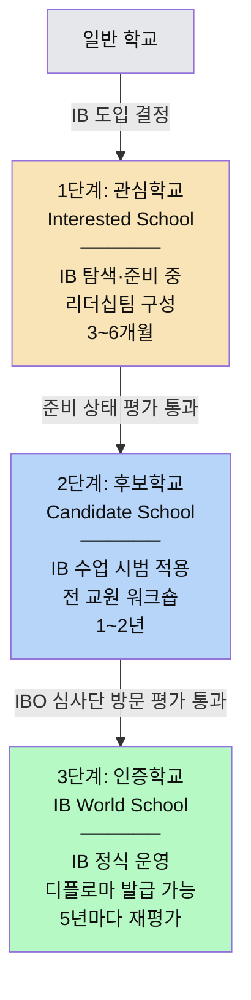
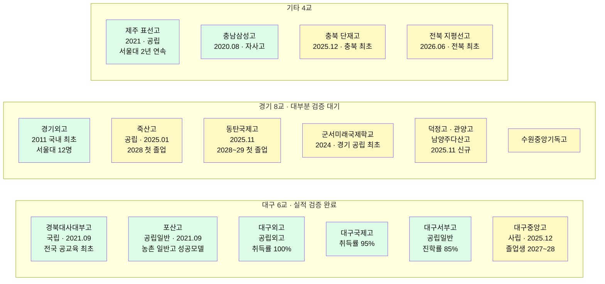
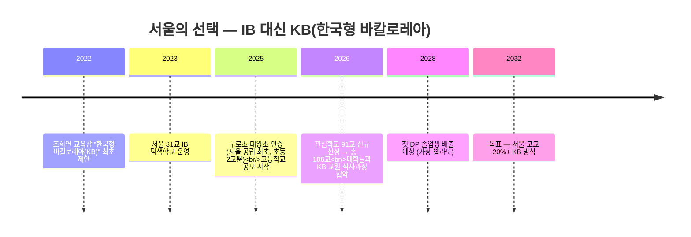
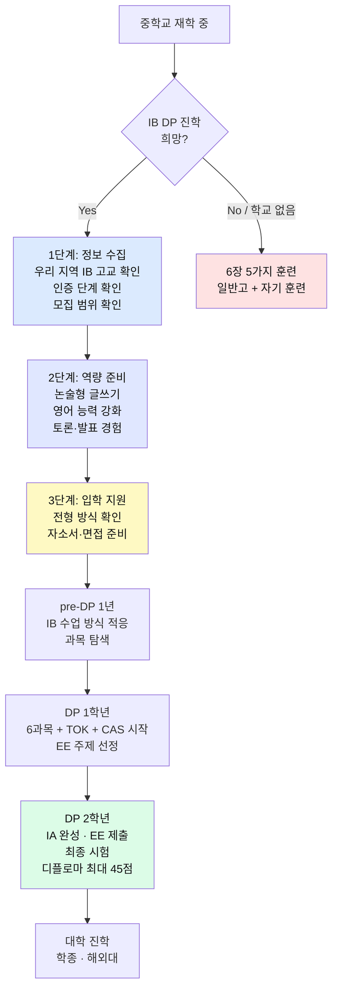

# 우리 동네에 IB 고등학교가 있을까? — 2026 전국 지도

"IB 학교가 전국에 몇백 개래!" 라는 뉴스, 한 번쯤 보셨죠?
그런데 막상 **"그럼 우리 동네에서 지금 갈 수 있는 IB 고등학교는 어디예요?"** 하고 물으면 답이 뚝 끊깁니다.

이 문서는 그 질문에 답을 드리려고 만들었어요. **2026년 7월 기준**, 지금 실제로 지원할 수 있는 학교만 지역별로 모았습니다.

> ⚠️ **먼저 마음의 준비를 하세요**
> 뉴스에 나오는 큰 숫자와, 실제로 **여러분이 지원할 수 있는 학교 수**는 완전히 다릅니다.
> 그 차이가 왜 생기는지가 이 문서의 절반이에요.

---

## 1. 먼저 알아야 할 용어 4개

> 💡 **한 줄 요약**: IB는 스위스 IBO가 만든 국제 교육과정이고, 고등학교 과정은 **DP**, 정식 인증을 받은 학교를 **월드스쿨**이라고 불러요.

용어부터 잡고 갈게요. 딱 4개만 알면 나머지는 술술 읽힙니다.

| 용어 | 정식 명칭 | 쉽게 말하면 |
|------|----------|-----------|
| **IB** | International Baccalaureate (국제 바칼로레아) | 전 세계 공통 교육과정. 한국 교육과정과는 **별개**예요 |
| **IBO** | IB Organization | IB를 만들고 관리하는 **스위스 본부**. IB의 "교육부"라고 보면 돼요 |
| **IB 월드스쿨** | IB World School | IBO가 **최종 인증**한 학교. = "IB 정식 운영 학교" |
| **PYP·MYP·DP** | 학교급별 프로그램 이름 | 초등 = PYP, 중학 = MYP, 고등 = **DP** |
| **PYP** (Primary Years Programme) | 초등학교 (3~12세) | 탐구 중심 학습, 주제 통합 수업 |
| **MYP** (Middle Years Programme) | 중학교 (11~16세) | 교과 간 연결, 개념 기반 학습 |
| **DP** (Diploma Programme) | 고등학교 (16~19세, **2년**) | 6과목 + TOK/EE/CAS, 최대 45점, **국제 공인 학력** |

> 📌 **중학생·학부모가 찾아야 하는 건 오직 "DP 인증학교"입니다.**
> 같은 학교라도 **PYP만 인증**받고 MYP·DP는 아직인 경우가 정말 많아요.
> 그래서 학교에 전화하면 이렇게 물어야 해요 → **"어떤 프로그램(PYP/MYP/DP) 인증인가요?"**

### DP 수업에서 자주 나오는 말들

| 용어 | 뜻 | 쉽게 말하면 |
|------|-----|-----------|
| **HL / SL** | 심화(240시간) / 표준(150시간) 수준 과목 | 깊이 배우는 과목 3~4개 + 나머지는 기본 수준 |
| **TOK** (Theory of Knowledge) | 지식이론 | "우리가 아는 걸 어떻게 알까?" 철학 수업 |
| **EE** (Extended Essay) | 확장 에세이 | 4,000단어 연구 논문. 졸업논문의 고등학생 버전 |
| **CAS** | 창의·활동·봉사 | 18개월간 봉사+운동+창작 필수 |
| **IB 디플로마** | IB DP 수료 증서 | 24점 이상 + 조건 충족 시 발급되는 **국제 공인 학력** |

---

## 2. "IB 학교 225교"의 함정 — 인증 3단계

> 💡 **한 줄 요약**: 뉴스의 큰 숫자는 **관심 + 후보 + 인증을 다 더한 것**이에요. 진짜 IB는 **인증학교(월드스쿨)뿐**입니다.

여기가 이 문서에서 제일 중요한 부분이에요. **딱 한 장만 읽어야 한다면 이 장을 읽으세요.**

학교가 IB를 도입하려면 IBO 심사를 거쳐 **3단계**를 밟아 올라가요.

### 단계별로 뭐가 다른가요

| 단계 | 한국어 | 영어 | 의미 | IB 수업 가능? | 디플로마 발급? |
|:---:|--------|------|------|:---:|:---:|
| **1단계** | 관심학교 | Interested School | IB를 알아보고 준비하는 중 | ❌ 불가 | ❌ |
| **2단계** | 후보학교 | Candidate School | 시범 적용하며 인증 준비 중 | ⚠️ 시범만 | ❌ |
| **3단계** | **인증학교 (= 월드스쿨)** | Authorized School | IBO가 공식 인증한 정식 IB 학교 | ✅ 정식 운영 | ✅ |

- 1단계 → 3단계까지 전체 **약 2~4년** 걸려요
- 관심학교는 **IB 수업을 아예 안 합니다**. 이름만 "IB 관심학교"예요
- 후보학교도 **디플로마를 못 줍니다**. 시범 운영 중이에요

> ⚠️ **경고 — 가장 많이 속는 지점**
> 뉴스에서 **"IB 학교 225교"**, **"386교"**, **"400교"** 라고 하면
> **관심 + 후보 + 인증을 전부 합친 숫자**입니다.
> **관심학교 207교 ≠ IB 수업하는 학교 207교** 예요.
> 실제로 IB 디플로마를 주는 곳은 **인증학교(월드스쿨)뿐**이고,
> **고등학교 DP로 좁히면 공교육 기준 단 18교**입니다.

### 학교에 전화할 때 꼭 물어볼 2문장

- [ ] **"그 학교, 지금 몇 단계인가요? 관심인가요, 후보인가요, 인증인가요?"**
- [ ] **"어떤 프로그램 인증인가요? PYP인가요, MYP인가요, DP인가요?"**

이 두 질문이면 90%가 걸러집니다. 🎯

> 💡 **팁**: 학교 홈페이지에 "IB 관심학교 선정!" 이라는 현수막 사진이 걸려 있어도,
> 그건 **"이제 막 시작했다"**는 뜻이에요. 우리 아이가 입학할 때 DP가 열려 있을지는 아무도 모릅니다.

---

## 3. 전국 현황 한눈에 보기

> 💡 **한 줄 요약**: 17개 시도교육청 전부 IB를 도입했지만, **공교육 DP 고등학교는 18곳뿐**이고 그중 대구·경기가 절반 이상이에요.

| 항목 | 수치 | 설명 |
|------|------|------|
| **IB 도입 시도교육청** | **17개** | 전국 17개 교육청 **전부** 도입 완료 |
| 전국 IB 관련 학교 | **360교 이상** | 관심 + 후보 + 인증을 모두 합친 숫자 ⚠️ |
| **IB 월드스쿨 (인증)** | **118교** | 실제로 IB 수업·디플로마 발급 가능 (초·중·고 전부 포함) |
| 🎯 **공교육 DP 인증 고등학교** | **약 18교** | **← 중3이 지금 지원할 수 있는 학교** (국제학교 제외) |
| IB 전문교원 | 2,500명+ | |

> ⚠️ **숫자가 자료마다 조금씩 달라요.**
> 출처에 따라 전국 IB 학교를 **360교 / 386교**, 월드스쿨을 **106교 / 118교**로 다르게 씁니다.
> 인증·후보 단계가 **매달 바뀌기 때문**이에요.
> 하지만 **공교육 DP 고등학교 = 약 18교**라는 숫자는 어느 자료든 비슷합니다. 이 숫자만 기억하세요.

### 우리 동네는 어때요? — 교육청별 지도

| 교육청 | IB 학교 수 | 🎯 **DP 인증 고교** | 한 줄 요약 |
|--------|-----------|:---:|-----------|
| **대구** | 90교 (월드스쿨 36 / 후보 23 / 관심 31) | **6교** | 전국 최초·최다. 초-중-고 벨트 완성 |
| **경기** | 297교+ (월드스쿨 30 / 후보 42 / 관심 244) | **8교** | **전국 최대 규모**, 대부분 신규 인증 |
| **서울** | 106교 (초 49 / 중 22~35 / 고 22) | **0교** ❌ | IB 대신 **KB(한국형 바칼로레아)** 직행 |
| **전남** | 40교 | 3교 | 농산어촌 모델 |
| **충북** | 26교 | 2교 | 청주·충주·제천 클러스터 |
| **전북** | 24교 | 1교 | 2026.5 IB 조례 공포 |
| **대전** | 20교 (탐색 5 / 관심 9 / 후보 6) | **0교** | 후보학교 3교 진행 중 |
| **경북** | 약 19교 | **0교** | 후보 9 + 관심 10 |
| **제주** | 17교 (초 11 / 중 5 / 고 1) | **1교** | 표선고 — IB 벨트 모델 |
| **부산** | 16교 | 공교육 DP **0교** | "부산형 IB", 2028 정착 목표 |
| **충남** | — | **1교** | 충남삼성고 (자사고) |
| **강원** | 관심 7교 | **0교** | 조례 제정 완료, 후보학교 추진 중 |
| **광주** | 탐색 7교 | **0교** | 탐색 단계 |
| **울산 / 인천** | 추진 중 | **0교** | 도입기 |

> 📌 **정리하면**: 지금 당장 갈 수 있는 공교육 IB 고등학교가 있는 곳은
> **대구(6) · 경기(8) · 제주(1) · 충남(1) · 충북(1) · 전북(1)** 정도예요.
> 나머지 지역은 **아직 0교**입니다.

---

## 4. 지역별 상세 — 지금 갈 수 있는 학교 전수

> 💡 **한 줄 요약**: 초록은 **졸업생이 나와서 실적이 검증된 학교**, 노랑은 **인증은 됐지만 졸업생이 아직 없는 학교**예요. 이 구분이 진짜 중요합니다.

🟩 **초록 = 졸업생 배출·실적 검증 완료** / 🟨 **노랑 = 졸업생 미배출, 실적 검증 불가**

> ⚠️ **경고**: 2025년에 새로 인증받은 학교들(덕정·관양·남양주다산·수원중앙기독·단재·지평선·대구중앙·동탄국제)은 **모두 DP 졸업생이 한 명도 없습니다.**
> **"인증받았다"와 "성과가 검증됐다"는 완전히 다른 얘기예요.**

### 4-1. 🏫 대구광역시 — DP 인증 6교 (전국 선도)

2019년 전국 최초로 공교육 IB를 시작한 곳이에요. 초(PYP)→중(MYP)→고(DP) **IB 벨트를 전국 최초로 완성**했습니다.

#### 🟩 경북대사대부고 (경북대학교사범대학부설고등학교)

| 항목 | 내용 |
|------|------|
| **홈페이지 · 위치** | [knue.dge.hs.kr](https://knue.dge.hs.kr) · 대구 북구 |
| **인증 · 유형** | 인증학교 (2021.09) — **전국 공교육 최초 IB DP 월드스쿨** · 국립 부설고 |
| **특징** | 경북대 사범대와 연계해 교원 전문성 확보. 1기 졸업생 30명 **전원** 디플로마 또는 과목 이수증 취득 |

**대입 실적**

| 구분 | 1기 (2024 대입) | 2기 (2025 대입) |
|------|---------------|---------------|
| 디플로마 | 30명 전원 (디플로마+과목이수증) | 18명 디플로마 + 11명 과목이수증 |
| 평균 점수 | — | **30.9점** (세계 평균 29점 상회) |
| 고득점자 | 38점 이상 5명 | 37점 이상 4명 |
| 합격 대학 | 연세대·고려대·성균관대·DGIST·UNIST·KENTECH — 수도권 주요대 22명 | 연세대·서울시립대·경북대·DGIST 등 |

#### 🟩 포산고등학교

| 항목 | 내용 |
|------|------|
| **홈페이지 · 위치** | [posan.dge.hs.kr](https://posan.dge.hs.kr) · 대구 달성군 |
| **인증 · 유형** | 인증학교 (2021.09), 경북대사대부고와 동시 인증 · 공립 일반고 |
| **특징** | **농촌 지역 공립 일반고**가 IB를 성공시킨 사례로 전국적 주목. 달성군 IB 거점. 2기 21명 중 15명 풀 디플로마 |
| **대입 실적** | 2기 21명 중 **20명** 국내외 대학 합격 · 최고 **39점**(캐나다 U. of Alberta) · 건국대·명지대·대구교대·광주교대 등 |

#### 🟩 대구외국어고등학교

| 항목 | 내용 |
|------|------|
| **홈페이지 · 위치** | [dgfl.dge.hs.kr](https://dgfl.dge.hs.kr) · 대구 달서구 |
| **인증 · 유형** | 인증학교 — **전국 국·공립 최초 한국어 IB DP 월드스쿨** · 공립 외국어고 |
| **특징** | 2기 응시생 **100% 전원 디플로마 취득** — 전국 최고 🎯 / 평균 30.5점, 33점 이상 40% / 맞춤 코칭 + 글쓰기 교육 |
| **대입 실적** | 3년간 졸업생 54명 — 연세대·고려대·서강대·성균관대·이화여대, 지방 거점 국립대. 국제학부·글로벌경제·정치외교·영문 계열 다수 |

#### 🟩 대구국제고등학교

| 항목 | 내용 |
|------|------|
| **홈페이지 · 위치** | [dhi.dge.hs.kr](https://dhi.dge.hs.kr) · 대구광역시 |
| **인증 · 유형** | 인증학교 · 대구시교육청 소속 국제고 |
| **특징** | 첫 졸업생 20명 중 19명 — **취득률 95%** (세계 평균 73.8% 대비 압도) / 평균 31점 / **이중언어 디플로마** 18명(90%) |
| **대입 실적** | 국내 — 연세대·성균관대·한양대·중앙대·건국대·서울시립대·숙명여대 (글로벌학부·경제경영) / 해외 — 멜버른대·모나쉬대·엠브리리들 항공대·홍콩대 |

#### 🟩 대구서부고등학교

| 항목 | 내용 |
|------|------|
| **홈페이지 · 위치** | [dgseobu.dge.hs.kr](https://dgseobu.dge.hs.kr) · 대구 서구 |
| **인증 · 유형** | 인증학교 — 대구 **5번째** DP 월드스쿨 · 공립 일반고 |
| **특징** | 평범한 일반고에서 IB를 성공 운영하는 모델. 진학률 1기 **81.8%**, 2기 **85%** (전국 평균 73.6% 상회) |
| **대입 실적** | 수능 최저 없는 **학종·논술전형** 위주. 캐나다·영국·호주 해외대, 수도권 주요대, 지방 거점대, DGIST 다수 |

#### 🟨 대구중앙고등학교

| 항목 | 내용 |
|------|------|
| **홈페이지 · 위치** | [djoongang.dge.hs.kr](https://djoongang.dge.hs.kr) · 대구광역시 |
| **인증 · 유형** | 인증학교 (**2025.12**) — 대구 **사립고 최초** DP 인증 · 사립 일반고 |
| **특징** | 전국 **일반계 사립 최초** MYP+DP 연속 운영. 2021 관심 → 2023 후보 → 2025 인증 (4년) |
| **대입 실적** | ⚠️ 2025.12 인증이라 **DP 졸업생 아직 없음**. 첫 졸업생 2027~2028년 예상 |

### 4-2. 🏫 경기도 — DP 인증 8교 (전국 최대 규모)

학교 수는 전국 1위인데, **대부분 2025년 신규 인증**이라 실적은 아직 검증 전이에요.

#### 🟩 경기외국어고등학교

| 항목 | 내용 |
|------|------|
| **홈페이지 · 위치** | [gafl.hs.kr](https://gafl.hs.kr) · 경기 의왕시 |
| **인증 · 유형** | 인증학교 (**2011**) — **국내 최초 IB DP 도입**, 영어 운영 · 특수목적고(외고) |
| **특징** | 2011년 국내 고교 최초 DP 도입한 **원조 IB 학교**. 졸업생이 영국·미국·싱가포르·호주·캐나다·중국·일본·네덜란드·독일 등 **세계 11개국 149개 대학** 진학. **영어 운영** → 해외 대학에 특히 강점 |

**대입 실적**

| 연도 | 서울대 합격 |
|------|-----------|
| 2025 | 수시 6 + 정시 6 = **12명** |
| 2024 | 수시 11 + 정시 2 = **13명** |
| 2023 | 수시 7 + 정시 2 = **9명** |

- 해외: 2025학년 **70명** 해외대 합격, 세계 50위 이내 대학 **22명**

#### 🟨 죽산고등학교

| 항목 | 내용 |
|------|------|
| **홈페이지 · 위치** | [juksan-mh.goean.kr](https://juksan-mh.goean.kr) · 경기 안성시 |
| **인증 · 유형** | 인증학교 (2025.01) — **경기 공립고 최초 한국어 DP 인증** · 공립 일반고 (중·고 통합) |
| **특징** | 중학교(MYP)·고등학교(DP)를 **모두** 인증받은 전국 최초 공립 통합학교. 논술·서술형 위주. 계열 맞춤 과목 선택 (IB생명과학+IB영어+IB역사 / IB화학+IB언어와문학+IB수학 등) |
| **대입 실적** | ⚠️ **2028학년도** 첫 DP 졸업생 예정. 경기도교육청–서울대 업무협약(2024.11)으로 IB의 대입 반영 연구 진행 중 |

#### 🟨 동탄국제고등학교

| 항목 | 내용 |
|------|------|
| **홈페이지 · 위치** | [dtg.hs.kr](https://www.dtg.hs.kr) · 경기 화성시 동탄 |
| **인증 · 유형** | 인증학교 (2025.11) · 공립 국제고 |
| **특징** | 2024.09 후보 → 2025.11 인증, **약 14개월 만의 초고속 인증**. 2026년 16기부터 pre-DP 시작. 국제 교류·다문화 교육 기반 |
| **대입 실적** | ⚠️ 졸업생 미배출. 2028~2029년 첫 졸업생 예상 |

#### 🟨 군서미래국제학교 (시흥)

| 항목 | 내용 |
|------|------|
| **홈페이지 · 위치** | [gunseo.goesp.kr](https://gunseo.goesp.kr) · 경기 시흥시 |
| **인증 · 유형** | 인증학교 (2024) — **경기도 공립 최초 IB 인증** · 공립 초·중·고 통합학교 |
| **특징** | PYP(초)·MYP(중)·DP(고) **전 과정을 하나의 캠퍼스**에서 운영 |

#### 🟨 경기 신규 인증학교 (2025.11)

| 학교명 | 홈페이지 | 위치 | 특징 |
|--------|---------|------|------|
| 덕정고등학교 | [덕정고](https://school.iamservice.net/organization/18787) | 양주시 | 2025.11 신규 인증 |
| 관양고등학교 | [gwanyang-h.goeay.kr](https://gwanyang-h.goeay.kr) | 안양시 동안구 | 2025.11 신규 인증 |
| 남양주다산고등학교 | [nyjdasan-h.goegn.kr](https://nyjdasan-h.goegn.kr) | 남양주시 | 2020 개교, 디지털 창의역량 특색 |
| 수원중앙기독고등학교 | [suwoncca-h.goesw.kr](https://suwoncca-h.goesw.kr) | 수원시 | IB DP 운영 중 |

> ⚠️ 위 학교들은 **모두 2025년 신규 인증**이라 DP 졸업생이 아직 없어요.

**경기 후보·관심 고등학교** (아직 DP 정식 운영 ❌)

| 단계 | 학교 |
|------|------|
| 후보/관심학교 | 동화고 · 저동고 |
| 관심학교 | 현화고 · 포천고 · 진접고 · 성남외고 · 수원고 |

### 4-3. 🏫 서울특별시 — DP 고교 **0교** (왜죠?)

> 💡 서울에 IB 학교가 106교나 있는데 **DP 고등학교는 0교**예요. 이게 어떻게 가능하냐면요…

| 구분 | 현황 | 비고 |
|------|------|------|
| **인증학교 (DP)** | **없음** ❌ | 초등 2교만 인증 (구로초·대왕초 — 2025.12 서울 공립 최초) |
| 후보학교 | 진행 중 | **중학교 중심** (휘경여중·창덕여중 등) |
| 관심학교 (고등) | 22교 | 2025년부터 고등학교 공모 시작 |

**서울의 106교는 대부분 초등·중학교 + 관심학교예요.** 고등학교 DP 인증은 **한 곳도 없습니다.**

#### 왜 0교인가요? — 서울은 "IB를 건너뛰고 KB로 직행"

- 서울시교육청은 IB 대신 **'한국형 바칼로레아(KB)'** 모델을 별도로 만들고 있어요
- 서울 자치구 분포: **양천구 10교 최다**, 노원구·마포구 각 8교
- 서울 공교육 DP 첫 졸업생은 **가장 빨라도 2028년 이후**

> ⚠️ **서울 학부모께 솔직하게**
> 서울 공교육에 IB DP 고등학교는 **한 곳도 없습니다.**
> 아이가 지금 중3이면 **대구·경기·제주로 가거나**, 서울에서 KB가 자리 잡을 **2030년대를 기다려야** 해요.
> 대신 지금부터 다독·에세이·토론 훈련을 해두면 KB가 들어올 때 **바로 적응**합니다.

**서울 소재 국제학교 (DP 인증)** — 참고용
[Seoul Foreign School](https://www.seoulforeign.org) · [Dwight School Seoul](https://dwight.or.kr) · [Dulwich College Seoul](https://seoul.dulwich.org)

> 💡 국제학교는 **모두 사립**이고 학비가 **연 3,000만원+** 입니다. 공교육과는 완전히 다른 트랙이에요.

### 4-4. 🏫 제주특별자치도 — 표선고 (공교육 IB의 상징)

#### 🟩 표선고등학교

| 항목 | 내용 |
|------|------|
| **홈페이지 · 위치** | [pyoseon.jje.hs.kr](https://pyoseon.jje.hs.kr) · 서귀포시 표선면 |
| **인증 · 유형** | 인증학교 (2021) — **제주 유일 공교육 IB DP 고교**, 국내 최초 전 과정 한국어 DP · 공립 일반고 |
| **특징** | **읍면 지역 공립 일반고**가 IB를 도입해 전국적 주목. 표선면 **IB 지구**(초-중-고 벨트) 형성 → 학생 유입 급증 |
| **부활 효과** 📌 | 학생 수 **240명(2019, 폐교 위기) → 461명(2025)**, 지역 인구 500명+ 증가. 도외 4년제 합격 2023학년 108명 → 2024학년 **189명** |

**대입 실적** (모두 학생부종합전형)

| 구분 | 2024 (1기) | 2025 (2기) |
|------|-----------|-----------|
| DP 응시 | 26명 (디플로마 11 + 과목이수증 15) | — |
| 평균 | **29점** (세계 평균 29.06점 근접), 30점 이상 5명 | — |
| **서울대** | **1명** ← 수능 없이, 전국 공교육 IB 최초 | **1명** |
| 연세대 / 고려대 | 각 1명 | 연세대 2 · 고려대 2 |
| KAIST | — | **1명** |
| UNIST / DGIST | 각 2명 | — |
| 성균관대 | 2명 | — |

**제주 소재 국제학교 (DP 인증)**
[Branksome Hall Asia](https://www.branksome.asia) · [North London Collegiate School Jeju](https://www.nlcsjeju.kr)

### 4-5. 🏫 전북특별자치도 — 🟨 지평선고

| 항목 | 내용 |
|------|------|
| **홈페이지 · 위치** | [school.jbedu.kr/jipyeongseon-h](https://school.jbedu.kr/jipyeongseon-h) · 전북 김제시 성덕면 |
| **인증 · 유형** | 인증학교 (**2026.06**) — **전북 최초 IB DP 월드스쿨** · 대안교육 특성화고 (원불교 운영) |
| **특징** | **대안교육 특성화고**가 IB를 도입한 독특한 사례. 도서관 중심 독서·토론, 인문학 탐구, 생태 감수성 교육을 DP와 결합. 소규모 **개별화 교육** |
| **대입 실적** | ⚠️ 2026.06 인증 — **DP 졸업생 아직 없음** (이 문서 기준 인증 한 달 차예요) |

**전북 관심학교**: 자유고 · 전주중앙여고 · 순창고

### 4-6. 🏫 충청북도 — 🟨 단재고

| 항목 | 내용 |
|------|------|
| **홈페이지 · 위치** | [school.cbe.go.kr/danjae-h](https://school.cbe.go.kr/danjae-h) · 충북 청주시 |
| **인증 · 유형** | 인증학교 (2025.12) — **충북 최초**, 후보 승인 후 **10개월 만에** 인증 · 공립 일반고 |
| **특징** | 학년당 **1학급** 소규모 — 한 명 한 명 세밀하게 관리. '정답 중심'이 아닌 **'질문 중심'** 수업이 핵심. 학생 주도성 강조 |
| **대입 실적** | ⚠️ 인증 직후 — DP 졸업생 아직 없음 |

### 4-7. 🏫 충청남도 — 🟩 충남삼성고

| 항목 | 내용 |
|------|------|
| **홈페이지 · 위치** | [cnsa.hs.kr](https://www.cnsa.hs.kr) · 충남 아산시 |
| **인증 · 유형** | 인증학교 (2020.08) — **영어 운영** · 사립 자율형사립고 (광역자사고) |
| **특징** | '학생 선택 진로별 교육과정' — **3계열 13과정** 맞춤형. 전국 7개 비서울 광역자사고 중 서울대 실적 최상위권 |

**대입 실적**

| 구분 | 내용 |
|------|------|
| 서울대 | 2022대입 **16명**(수시13+정시3), 2023대입 **15명** |
| 최근 5년 서울대 수시 | **44명** (7개 비서울 광역자사고 중 2위) |
| 특징 | 국내 상위권 대학 + **IB 점수로 해외 대학 동시 지원** |

### 4-8. 🏫 대전광역시 — 아직 후보 단계

| 학교명 | 인증 단계 | 비고 |
|--------|----------|------|
| 대전대성고등학교 | **후보학교** | 2025.11 후보 승인 |
| 서대전고등학교 | **후보학교** | 2026.04 후보 승인 |
| 서일고등학교 | **후보학교** | 2026.05 후보 승인 |

> ⚠️ 후보학교는 **디플로마를 발급할 수 없어요.** 인증까지 최소 1~2년 더 걸립니다.
> 다만 세 곳이 동시에 후보에 올랐으니, 대전은 **2027~2028년쯤** 인증학교가 나올 가능성이 있어요.

### 4-9. 🏫 부산 · 인천 · 광주 · 강원 — 공교육 DP **0교**

| 지역 | 공교육 DP | 상황 | 지역 내 국제학교 (인증) |
|------|:---:|------|------|
| **부산** | ❌ 없음 | 2025년 IB 연구학교 시작, **2028년 이후 정착 목표** | [International School of Busan](https://www.isbusan.org) |
| **인천** | ❌ 없음 | 도입기 | [Chadwick International (송도)](https://www.chadwickinternational.org) — DP·CP |
| **광주** | ❌ 없음 | 탐색 단계 | — |
| **강원** | ❌ 없음 | IB 도입 추진 중 | — |
| **경남** | ❌ 없음 | — | Gyeongnam International Foreign School (사천) |

---

## 5. IB 벨트 — 초-중-고가 이어진 동네

> 💡 **한 줄 요약**: 이사를 고민 중이라면, **초-중-고가 IB로 연결된 지역**이 훨씬 유리해요. 아이가 PYP·MYP를 먼저 겪고 DP에 들어가니까요.

| 지역 | 벨트 | 특징 |
|------|------|------|
| **대구 경북대** | 경북대사대부초 → 경북대사대부중 → **경북대사대부고** | 국립대 부설 핵심축, **전국 최초 완성** |
| **대구 중앙** | 대구중앙중 → **대구중앙고** | 전국 일반계 **사립 최초** MYP+DP 연속 |
| **제주 표선** | 표선초 → 표선중 → **표선고** | 서귀포시 표선면 = **'IB 지구'** 지정 |
| **경기 안성** | 개산초 → 죽산중 → **죽산고** | 전국 최초 **공립 초중고 완전 연계** |
| **경기 시흥** | 군서미래국제학교 (PYP+MYP+DP **단일 캠퍼스**) | 경기 공립 최초 |

> 💡 **팁**: 벨트 지역이 아니어도 DP 지원은 가능해요.
> 다만 **PYP·MYP를 안 겪은 아이는 pre-DP 1년 동안 적응 부담이 큽니다.**
> 벨트 지역이 아니라면 → 6장의 훈련을 **미리** 시작하세요.

---

## 6. 우리 동네에 학교가 없으면 뭘 해야 하나요?

> 💡 **한 줄 요약**: 전국 대부분이 **DP 0교**예요. 그래도 지금 할 수 있는 게 있고, 그게 나중에 IB든 KB든 일반고든 다 통합니다.

### 지금 당장 5가지

| 전략 | 이렇게 하세요 | 기대 효과 |
|------|-------------|----------|
| **다독 습관** | 한 주제에 **관점이 다른 책 2~3권** 비교 독서 | IB/KB 수업 방식에 미리 적응 |
| **에세이 훈련** | 주 1회 500자+ 의견문 → 월 1회 1,000자 논증 에세이 | EE·IA 준비 |
| **토론 경험** | 가족 식탁 토론, 독서 토론 모임, 모의유엔(MUN) | 소크라틱 세미나 적응 |
| **자기주도 프로젝트** | 방학 중 관심 주제 탐구 프로젝트 1개 완수 (**보고서까지**) | IA 프로젝트 경험 |
| **성찰 일지** | 매일 "오늘 배운 것 / 궁금한 것 / 다음에 해 볼 것" **3줄** | CAS 성찰 포트폴리오 습관 |

> 🎯 **매일 하는 딱 3가지**: ① **매일 30분 독서** ② **주 1회 에세이** (500자 → 1,000자 → 2,000자) ③ **가족 저녁 토론** — "오늘 뉴스에서 가장 놀라운 게 뭐였어?"

### 우리 동네 학교 확인 체크리스트

- [ ] 우리 시도교육청에 **DP 인증 고등학교**가 있는지 확인 (3장 표)
- [ ] 있다면 → 그 학교 홈페이지에서 **입학 전형** 확인
- [ ] 없다면 → 근처 시도의 학교가 **도외/도내 모집인지** 확인 (예: 표선고 = 제주 도내 모집)
- [ ] 관심 학교에 전화해서 **"몇 단계인가요? 어떤 프로그램인가요?"** 물어보기
- [ ] 졸업생이 나온 학교인지 확인 (**"1기 졸업생 언제 나왔나요?"**)

> ⚠️ **주의**: IB 고교는 대부분 **해당 시·도 학생만** 뽑아요.
> 예를 들어 표선고는 **제주 도내 모집**입니다. 다른 지역에서 지원하려면 **전학·이사가 전제**예요.
> 지원 자격은 **반드시 학교 홈페이지에서 직접 확인**하세요.

---

## 7. 중학생 IB 고교 지원 로드맵

> 💡 **한 줄 요약**: 중1~중2에 **정보 수집 + 글쓰기·영어 역량**, 중3에 **지원 준비**. 고교 들어가면 pre-DP 1년 → DP 2년이에요.

### 학교별 지원 기준 (참고)

| 학교 | 내신 기준 | 전형 방식 |
|------|----------|----------|
| **표선고** | **내신 100% 정량 선발** (면접·자소서 **없음**) | 제주 도내 모집. 정원 150명, 경쟁률 약 1.39:1 |
| 대구외고 · 대구국제고 | **전 과목 A** (상위 10%) | 외국어특기전형 — 영어 증빙 + 면접 |
| **경북대사대부고** | **전 과목 A~B** (상위 20%) | 자기주도학습전형 — 자소서 + 면접 |
| 죽산고 | 경기도 내 중학생 | 자기주도학습전형 — 자소서 + 면접 |
| **경기외고** | — | 1차 서류·내신(160점) + 2차 면접(40점). **연 약 1,956만원** |
| 충남삼성고 | 전 과목 A (상위 10%) | 자소서 + 면접, 삼성 임직원 자녀 일부 우선. **연 2,500만원+** |

> ⚠️ **전형은 매년 바뀝니다.** 위 표는 참고용이고, **반드시 해당 학교 홈페이지의 최신 입학 요강**을 확인하세요.

---

## 8. 마지막 체크 — 학교 고를 때 딱 5개만

> 💡 **한 줄 요약**: **인증 단계 · DP 여부 · 졸업생 유무 · 모집 범위 · 운영 언어** — 이 5개만 확인하면 헛걸음을 안 해요.

- [ ] **① 인증학교인가?** (관심·후보는 디플로마 못 줘요)
- [ ] **② DP 인증인가?** (PYP·MYP만 인증인 학교가 많아요)
- [ ] **③ 졸업생이 나왔나?** (2025년 신규 인증 = 실적 검증 불가)
- [ ] **④ 우리 아이가 지원 가능한 모집 범위인가?** (도내/도외)
- [ ] **⑤ 한국어 운영인가, 영어 운영인가?** (경기외고·충남삼성고는 영어)

> 🎯 **최종 정리**
> - 실적이 검증된 곳 → **대구 4교(경북대사대부고·포산고·대구외고·대구국제고) + 대구서부고 · 경기외고 · 표선고 · 충남삼성고**
> - 인증은 됐지만 졸업생 없음 → **대구중앙고 · 죽산고 · 동탄국제고 · 군서미래국제학교 · 덕정고 · 관양고 · 남양주다산고 · 수원중앙기독고 · 단재고 · 지평선고**
> - **서울·부산·인천·광주·강원·경북·대전 → 공교육 DP 고교 0교** (2026년 7월 기준)

---

## 어디서 확인하나요

학교 정보는 **매달 바뀝니다.** 아래 링크에서 직접 최신 정보를 확인하세요.

**IB 공식**
- [IBO 공식 — 한국 학교 리소스](https://ibo.org/about-the-ib/the-ib-by-region/ib-asia-pacific/resources-for-schools-in-south-korea/)
- [한국 IB 학교 지도](https://korea-ib-school-map-hosting.vercel.app/)

**교육청 공식**
- [대구시교육청 IB 프로그램 운영 현황](http://www.dge.go.kr/main/cm/cntnts/cntntsView.do?mi=5768&cntntsId=3407)
- [서울시교육청 IB 학교 현황](https://www.sen.go.kr/www/eduinfo/ib/ib_3.jsp)
- [경기도교육청 IB 월드스쿨 21교 인증 완료](https://www.gninews.co.kr/news/article.html?no=748975)

**학교별 인증 뉴스**
- [경북대사대부고·포산고 IB 인증](http://www.veritas-a.com/news/articleView.html?idxno=391338)
- [대구 중앙고 IB DP 월드스쿨 인증](https://www.imaeil.com/page/view/2025121519100109569)
- [군서미래국제학교 IB 인증](https://www.kyeonggi.com/article/20241113580061)
- [전북 지평선고 IB DP 인증](https://www.newsis.com/view/NISX20260630_0003689302)
- [충북 단재고 IB 월드스쿨 인증](https://v.daum.net/v/qSfD4KXSEG?f=p)
- [대전교육청 IB 후보학교](https://www.goodmorningcc.com/news/articleView.html?idxno=446314)
- [서울 공립학교 최초 IB 인증학교](https://v.daum.net/v/20251219125123423?f=p)

**전국 현황**
- [교육을 비추다 — IB 도입 7년차 현황](https://www.kyobit.com/news/articleView.html?idxno=3142)
- [한국 IB 교육과정 2025 최신 — IBMaster](https://www.ibmaster.net/blog/IB-in-Korea)

> 📌 이 문서는 **2026년 7월 기준**입니다. 인증 단계는 계속 바뀌니, 지원 전에 **반드시 학교 홈페이지와 교육청 공지**를 다시 확인하세요.
