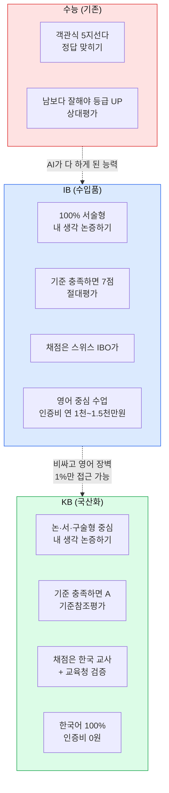
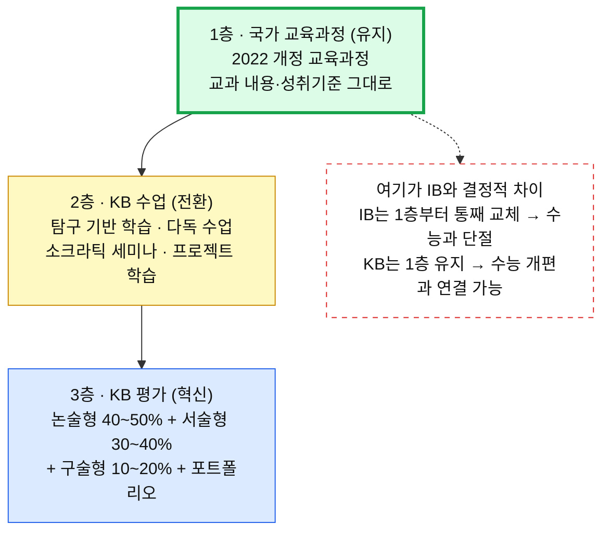
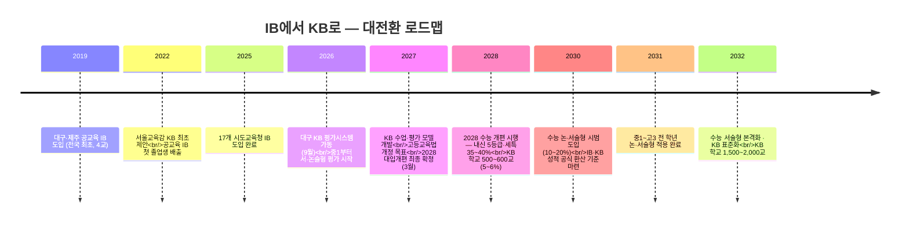
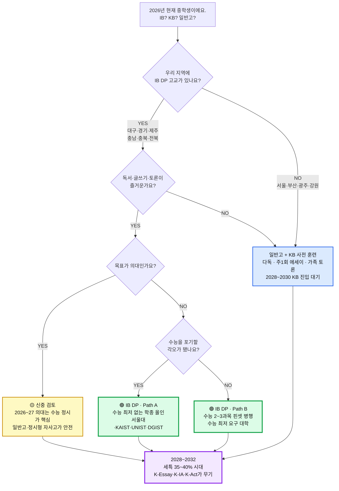

# IB vs KB, 중3이 지금 알아야 할 전부

요즘 "IB 학교 가야 한다", "이제는 KB 시대다" 같은 말, 한 번쯤 들어보셨죠?
그런데 정작 **IB가 뭔지, KB가 뭔지, 둘이 어떻게 다른지** 제대로 설명해 주는 사람은 없어요.
이 문서는 **2026년 7월 기준**으로 중학생과 학부모가 진짜 알아야 할 것만 골라 담았어요. 좋은 얘기만 하지 않고, **위험한 부분도 그대로** 말씀드릴게요.

> ⚠️ **먼저 딱 하나만 기억하세요**
> **지금 갈 수 있는 학교는 IB뿐입니다.** KB는 아직 "만들어지는 중"이고, **대학이 공식으로 인정하는 제도가 아니에요.**

---

## 0. 30초 요약 — 이것만 알면 절반은 압니다

> 💡 **한 줄 요약**: IB는 지금 돌아가는 국제 교육과정이고, KB는 그걸 한국식으로 만드는 중인 미래형 제도예요.

| 질문 | 한 줄 답 |
|---|---|
| **IB가 뭐예요?** | 스위스 IBO가 만든 **국제 교육과정**이에요. 전 세계 **160개국**이 인정하는 "글로벌 여권" 같은 거예요. |
| **KB는 뭐예요?** | 한국 교육부·교육청이 만드는 **한국판 IB**예요. IB의 방식만 빌려오고 **로열티랑 영어 장벽은 뺐어요.** |
| **가장 큰 차이는요?** | **IB = 남의 나라 시스템을 사서 쓴다** / **KB = 우리가 직접 만들어 쓴다** |
| **지금 뭐가 진짜 돌아가요?** | **IB만요.** KB는 2026년 9월 대구에서 평가 시스템이 처음 켜져요. |
| **중3인 저는요?** | 지금 갈 수 있는 건 **IB 학교(공교육 고교 18곳)**. KB는 나중에 "내 학교로 들어오는" 형태가 될 거예요. |
| **왜 지금 중요해요?** | **2028 수능 개편**으로 세특 비중이 **35~40%**로 커져요. IB/KB식 생기부가 그때 무기가 돼요. |

### 용어 미리 풀기

- **IBO** — IB를 만들고 관리하는 스위스 본부예요. IB의 "교육부"라고 보면 돼요.
- **DP**(Diploma Programme) — IB의 **고등학교 과정**이에요. 2년짜리, 최대 45점. **MYP**는 중학교 과정이고요.
- **IB 월드스쿨** — IBO가 **최종 인증**한 학교예요. 여기만 IB 졸업장을 줄 수 있어요.

---

## 1. 수능 vs IB vs KB — 자동차로 비유해 볼게요

> 💡 **한 줄 요약**: 수능은 정답 빨리 찾기, IB는 비싼 수입차, KB는 그걸 뜯어 만든 국산차예요.

### 한 문장 비유

| 구분 | 비유 |
|---|---|
| **수능** | 남이 낸 문제의 **정답을 빨리 찾는** 시험이에요. |
| **IB** | **명품 수입차**예요. 성능은 검증됐지만 **비싸고, 매뉴얼이 영어고, 아무나 못 사요.** |
| **KB** | 그 수입차를 뜯어보고 만든 **국산차**예요. 값은 무료, 매뉴얼은 한국어. 단, **아직 도로 주행 검증 중**이에요. |

원문에 이런 표현이 있어요.

> 📌 **"KB는 IB의 '정신'은 취하고 '껍데기'는 벗겨낸 것입니다."**

### 셋이 어떻게 다른지 그림으로

### 3자 비교표 — 진짜 중요한 것만

| 비교 항목 | 기존 수능 교육 | **IB** | **KB** |
|---|---|---|---|
| **누가 운영해요?** | 한국 교육부 | **IBO** (스위스 제네바, 1968년 설립) | **한국 교육부 + 시도교육청** |
| **교육과정은요?** | 2022 개정 국가 교육과정 | **IB 자체 교육과정** (국가 교육과정과 별도) | **국가 교육과정 그대로** + 평가만 전환 |
| **시험은 어떻게?** | 객관식 70% + 서술형 30% | **서술형 100%** | **논·서·구술형 중심** (서술형 70%+) |
| **누가 채점해요?** | 기계(OMR) + 교사 | **IBO가 직접** (다른 나라 채점관이 교차 채점) | **한국 교사 + 교육청 외부 검증** |
| **수업 언어는?** | 한국어 | **영어/프랑스어/스페인어** (한국어 DP 일부) | **한국어 100%** |
| **돈은 얼마나?** | 무상 | 공립 IB 무상 + **IBO 인증비 연 1,000~1,500만원/교** · 사립 IB 연 1,500~2,500만원 | **무상** |
| **몇 개 학교에서?** | 전체 학교 | **인증학교만** (전국 106교 = 전체의 약 1%) | **모든 공교육 학교** (목표) |
| **대학 갈 때는?** | 수능 = 목표 | 학종 활용 (공식 IB 전형은 3개 대학) | **2028 수능 개편과 직접 연계 설계** |
| **해외에서도 통해요?** | 한국 내에서만 | **전 세계 160개국 / 5,000+ 대학** | **한국 내만** (해외 인정 미정) |
| **약점은요?** | 파행 교육과정, 사교육 의존 | 높은 로열티, 영어 부담, **수능 병행 사실상 불가** | **개발 중** — 검증·인정에 시간 필요 |

---

## 2. KB는 IB에서 뭘 가져오고 뭘 버렸을까요

> 💡 **한 줄 요약**: 좋은 건 다 가져오고, 비싸고 영어 쓰고 수능이랑 끊기는 건 다 버렸어요.

| ✅ 가져온 것 (IB의 강점) | ❌ 버린 것 (IB의 한계) |
|---|---|
| 100% 서술형 평가 | IBO 인증비 (학교당 연 수천만원) |
| 탐구 기반 학습 | 영어 중심 수업·평가 |
| 내부평가(IA) — 학생 자기주도 프로젝트 | IBO 글로벌 채점 시스템 의존 |
| 소논문(EE) — 독립 연구 논문 경험 | 국가 교육과정과의 괴리 |
| 지식론(TOK) — 비판적 사고 훈련 | **수능과의 완전 단절** |
| CAS — 창의·활동·봉사 통합 | 소수 학교만 접근하는 **엘리트 구조** |
| 성찰 일지 — 메타인지 훈련 | 외국인 교사 의존 |

### KB가 왜 나왔는지 딱 한 줄

> 📌 IB는 좋아요. 그런데 ① **비싸고**(전국 8개 교육청이 IBO에 낸 돈 누적 **24억 1천만원**) ② **1%만 접근 가능하고** ③ **영어 장벽**이 있어요.
> → **이 셋을 없앤 게 KB예요.**

### KB의 3층 구조 — "교과서는 그대로, 평가만 바꾼다"

### 수업이 실제로 얼마나 바뀌냐면요

(대구·제주 IB 학교 실측 기준이에요)

| 항목 | 기존 수업 | KB 수업 |
|---|---|---|
| 선생님 강의 비중 | 80% | **20%** |
| 학생 탐구·토론 비중 | 20% | **80%** |
| 객관식 평가 | 70% | **0%** |
| 서술·논술·구술형 | 30% | **100%** |
| **학생이 말하는 시간** (고2 하루) | **약 5~10분** | **약 120~180분** |

> 💡 하루에 5분 말하던 애가 **2~3시간을 말하게 돼요.** 이게 IB/KB의 진짜 차이예요.

---

## 3. IB Core → KB Core, 이름만 바뀐 게 아니에요

> 💡 **한 줄 요약**: EE·TOK·CAS가 K-Essay·K-Think·K-Act로 바뀌는데, 언어 장벽이 사라지는 게 핵심이에요.

IB에는 6개 교과 말고 **Core(핵심 3종)**라는 게 따로 있어요. KB도 이걸 그대로 가져왔어요.

| IB Core | → | KB Core | 뭐가 달라지나요 |
|---|---|---|---|
| **EE**(Extended Essay — 4,000**단어**짜리 나만의 연구 논문) · 영어로 · 9개월 · 지도교사 3~5회 면담 | → | **K-Essay**(탐구 논문) · 4,000**자** · 한국어 · 약 12개월 · 지도교사 월 1회 면담 | 한국 사회·문화 주제 가능 · **언어 장벽이 사라져요** |
| **TOK**(Theory of Knowledge — "우리는 어떻게 아는가?"를 따지는 철학 수업) · 에세이 1,600단어 + 전시 | → | **K-Think**(사고와 논증) · "우리는 어떻게 생각하고 논증하는가?" · 논증 에세이 + 구술 발표 10분 | 한국 사회 이슈 소재 · **AI 시대 지식의 본질**·미디어 리터러시 |
| **CAS**(Creativity·Activity·Service — 창의·활동·봉사를 18개월간) · 성찰 일지 · **합격/불합격** | → | **K-Act**(실천과 성찰) · 18개월 · 주 2~3시간 · **합격/불합격** | 지역사회 연계 프로젝트 1개 이상 필수 |

> ⚠️ **K-Essay 분량은 아직 확정이 아니에요.**
> 원문에서도 **4,000자**와 **4,000~8,000자**로 엇갈려요. 면담 횟수(3회 vs 월 1회)도 마찬가지고요.
> 지금은 **"4,000자 내외, 세부 규격은 개발 중"**으로 이해하는 게 정확해요. K-Think 에세이 분량(1,200자 / 2,000자)도 미확정이에요.

### 이게 생기부에서 어떻게 무기가 되냐면요

Core 3종은 생기부의 각기 다른 칸으로 꽂혀요.

| Core | → 생기부 어디에 | 무엇을 보여주나요 |
|---|---|---|
| **EE / K-Essay** (4,000자 소논문) | **세특** + **독서활동** | 학업역량 · 전공적합성 · 학술적 독서 |
| **IA / K-IA** (6과목 탐구 프로젝트) | **세특** | 학업역량 · 탐구력 |
| **CAS / K-Act** (18개월 활동+성찰) | **창의적 체험활동** | 인성 · 공동체 기여 |
| **TOK / K-Think** (2년 비판적 사고) | **행동특성 및 종합의견** | 사고력 · 발전가능성 |

> 🎯 **2028년부터 세특 비중이 35~40%예요.** 위 4개가 전부 세특·생기부로 들어가요. 이게 IB/KB 학생의 결정적 무기예요.

**생기부 문장이 이렇게 달라져요**

| 항목 | 일반고 생기부 | **IB/KB 생기부** |
|---|---|---|
| **세특** | "수업에 적극 참여함", "발표를 잘함" | "한국 근대 문학의 식민지 모더니즘을 **OPCVL 프레임워크**로 분석하여 8,000자 비평문 작성" |
| **행특** | "성실하고 모범적임" | "지역사회 문해력 격차 해소 독서 멘토링 프로젝트 **40시간 수행, 성찰 보고서 제출**" |
| **독서활동** | "『사피엔스』 읽음" | "『사피엔스』를 읽고 **K-Essay 주제와 연결**하여 비판적 서평 작성" |

> 📌 **원문 인용**: *"일반고 생기부가 '무엇을 했다'의 나열이라면, KB 생기부는 '왜 했고, 어떻게 성장했는가'의 서사입니다."*

---

## 4. 지금 갈 수 있는 학교는 IB뿐이에요

> 💡 **한 줄 요약**: 공교육 IB DP 고등학교는 전국에 18곳뿐이고, KB는 2026년 9월 대구에서 이제 막 시작해요.

### 전국 현황 (2026년 7월 기준)

| 항목 | 수치 |
|---|---|
| **IB 도입 시도교육청** | **17개 = 전국 전부** |
| **전국 IB 관련 학교** | **386교** (전국 초중고 대비 약 3.3%) |
| ├ 인증학교 (IB 월드스쿨) | **106교** ← 실제로 IB 수업·졸업장 발급 가능 |
| ├ 후보학교 | **73교** ← 시범 운영 중 |
| └ 관심학교 | **207교** ← **아직 IB 수업 안 해요** |
| **공교육 DP 인증 고등학교** | **18교** (국제학교 제외) |
| **KB 평가시스템 가동** | **2026년 9월 (대구, 전국 최초)** |
| **KB 핵심 추진 교육청** | **대구 · 서울** |

> 🚨 **여기서 제일 많이 속아요**
> 뉴스에 나오는 "**IB 학교 386교**"는 **관심 + 후보 + 인증을 전부 합친 숫자**예요.
> **관심학교 207교 ≠ IB 수업하는 학교 207교**예요. 실제로 IB 졸업장을 주는 곳은 **인증학교 106교뿐**이고, **고등학교 DP로 좁히면 딱 18곳**이에요.
> 학교에 물어볼 첫 질문은 항상 이거예요 → **"그 학교, 몇 단계인가요? 어떤 프로그램(PYP/MYP/DP) 인증인가요?"**

### 학교가 IB가 되는 3단계

| 단계 | 기간 | IB 수업 가능? |
|---|---|---|
| **1단계 · 관심학교** (Interested School) | 3~6개월 | ❌ **불가** — IB를 알아보는 중이에요 |
| **2단계 · 후보학교** (Candidate School) | 1~2년 | ⚠️ **시범만 가능** — 인증 준비 중이에요 |
| **3단계 · 인증학교** (= IB 월드스쿨) | 5년마다 재평가 | ✅ **졸업장 발급 가능** — 여기가 진짜예요 |

- 관심학교부터 인증학교까지 **2~4년** 걸려요.
- 실제 사례: **대구중앙고 = 2021 관심 → 2023 후보 → 2025 인증 (4년)** / 동탄국제고는 14개월(최속)이었어요.
- DP 구조는 **pre-DP 1년(고1) + DP 2년(고2~3)**이에요.

### 지역별로 어디에 있나요

| 교육청 | IB 학교 수 | **DP 인증 고교** | KB 추진 | 한 줄 |
|---|---|---|---|---|
| **대구** | **90교** | **6교** | 🟢 **KB 가동 (2026.9)** | **IB → KB 전환.** 전국 모델 |
| **경기** | **297교+** | **8교** | 🟡 "경기형 바칼로레아" | **전국 최대 규모** |
| **서울** | **106교** | **0교** | 🟢 **KB 직행** | **IB 건너뛰고 KB 직접 구축** |
| **전남** | 40교 | 3교 | 🔵 IB 확대 | 농산어촌 모델 |
| **충북** | 26교 | 2교 | 🔵 IB 확대 | 청주 클러스터 |
| **전북** | 24교 | 1교 | 🔵 조례 기반 제도화 | 2026.5.8 조례 공포 |
| **제주** | 17교 | **1교** (표선고) | 🟡 IB 안착 | **IB 벨트 모델** |
| **충남** | — | **1교** (충남삼성고) | 🔵 IB 운영 | 자사고 모델 |
| **대전 / 경북 / 부산** | 16~20교 | **0교** | 🔵 추진 중 | 후보학교 단계 |
| **강원 / 광주 / 울산 / 인천** | 7교~ | 0교 | ⚪ 탐색·도입기 | 도입 초기 |

> ⚠️ 위 수치는 원문에서도 표마다 조금씩 달라요(경기 297교 vs 다른 집계, 충북 26교 vs 18교). **단정적으로 인용하지 마세요.**

### 🚨 서울 학생이라면 꼭 읽으세요

**서울 공교육에는 IB DP 고등학교가 한 곳도 없어요.** 인증받은 건 초등학교 2곳(구로초·대왕초)뿐이에요.

- 지금 중3인데 IB를 하고 싶다 → **대구·경기·제주로 가야 해요.**
- 서울에 남는다 → **KB가 자리 잡을 2030년대를 기다려야 해요.**
- 대신 **지금부터 다독·에세이·토론 훈련을 하면**, KB가 들어올 때 바로 적응해요.

서울에 있는 IB DP 국제학교(Seoul Foreign School, Dwight School Seoul, Dulwich College Seoul)는 **연 3,000만원 이상**이에요.

### KB 타임라인 — 언제 뭐가 오나요

### 2026년 9월, 대구에서 켜지는 게 정확히 뭐예요?

**대구교육청이 2년간 IB를 분석해 자체 개발한, 전국 최초의 논·서·구술형 평가 시스템**이에요.

| 기능 | 내용 |
|---|---|
| **OCR 손글씨 인식** | 다양한 손글씨를 자동으로 읽어 디지털화해요 (2만 건 학습) |
| **표절 탐지 AI** | 친구 답안 / AI 생성 / 인터넷 복붙을 구분해요 |
| **내용 구성 평가** | 특정 키워드가 없어도 **논리 구성이 완벽하면 높은 점수**를 줘요 |
| **교차 채점** | 같은 답안을 2명 이상이 독립 채점하고 편차를 검증해요 |
| **앵커페이퍼** | 등급별 모범·경계 답안 예시를 학생에게 **미리 보여줘요** |

> ⚠️ **국제 공통 원칙은 "AI 단독 채점 금지, 인간 감독 필수"**예요 (IBO·영국 Ofqual, 2026.1.14 발표).
> 실패 사례도 있어요 — 미국 MCAS(2025) AI 채점 오류로 **1,400건 재채점**, ETS GPT-4o가 아시아계 학생에 **1.1점 편향**(2024), 케임브리지대(2026.5) LLM 채점 등급 일치율 **35~65%**.

---

## 5. ⚠️ 가장 중요한 경고 — KB는 아직 대학이 인정하는 제도가 아니에요

> 💡 **한 줄 요약**: 2026년 지금 KB 성적으로는 대학에 못 가요. 법 개정이 2027년 목표일 뿐이에요.

> ⚠️ **KB는 2026년 현재 대학이 공식 인정하는 제도가 아닙니다.**
> **KB 성적으로 수능을 면제받거나 특별전형에 지원할 수 없어요.**
> 고등교육법 개정은 **2027년을 목표로 추진 중**일 뿐, 아직 확정된 게 아니에요.

**IB는요?** IB는 그나마 조금 나아요.

| 대학 | 대응 | 시기 |
|---|---|---|
| **고려대 · 서강대 · 한양대** | **IB 우수자 특별전형 도입** | **2025학년도~** |
| **서울대** | 경기교육청과 IB 업무협약 + 종단연구. **권장 IB 38점 이상** | 2024.11~ |
| 15개 상위 대학 중 12개 | IBDP 점수를 **특례전형**에서 인정 | 현행 |

**대학이 KB를 받아들이려면 이런 단계를 거쳐야 해요.**

| 단계 | 시기 | 내용 |
|---|---|---|
| 1단계 | 2026~2027 | 일부 대학 KB 인지 시작, 입학사정관 연수 |
| 2단계 | 2028~2029 | **KB 학생 전용 전형 시범 도입** |
| 3단계 | 2030~2031 | 주요 대학 학종에 KB 역량 반영 기준 마련 |
| 4단계 | 2032~ | **KB 생기부 평가 매뉴얼 표준화** |

> 📌 **정리하면**: "KB 학교 갈래요"는 2026년 중3에게 **아직 선택지가 아니에요.** 지금 고를 수 있는 건 **① IB 학교** 또는 **② 일반고 + KB 사전 훈련**, 둘뿐이에요.

---

## 6. 2028 수능 개편 — 이게 진짜 중요한 이유

> 💡 **한 줄 요약**: 수능은 그대로 객관식인데, 내신은 논·서술형으로 바뀌고 세특 비중이 35~40%로 커져요.

| 항목 | 현행 (~2027) | **2028학년도부터** | IB/KB 학생 영향 |
|---|---|---|---|
| **내신 등급제** | 9등급 상대평가 (1등급 4%) | **5등급 (1등급 10%)** + 성취도 A~E 병기 | 내신 부담 완화. 1등급 비율 **2.5배** 확대 |
| **수능 구조** | 국·수·탐 선택과목 | **선택과목 폐지 → 통합형** | KB 융합 교육과 잘 맞아요 |
| **수능 서술형** | 없음 | **미도입 — 객관식 유지** | ⚠️ 수능 자체는 아직 안 바뀌어요 |
| **내신 논·서술형** | 학교 자율 | **확대** | **KB 훈련이 내신에서 직접 경쟁력** |
| **세특 비중** | 약 20~25% | **35~40%** | **K-Essay·K-IA가 세특 최강 소재** |
| **정시 비율** | 40% 룰 | 40% 유지 | 학종 실질 확대 → KB 유리 |

> 🎯 **딱 한 문장으로 정리하면요**
> **"2028 개편으로 수능은 그대로 객관식이지만, 내신은 논·서술형으로, 세특은 35~40%로 바뀝니다. 즉 IB/KB식 훈련이 '수능 대신'이 아니라 '내신과 생기부에서' 곧바로 돈이 됩니다."**

### 논·서술형은 이미 시작됐어요

| 시기 | 적용 대상 |
|---|---|
| **2026학년도** | **중학교 1학년부터 서·논술형 평가 시작** ← **지금 이미 진행 중** |
| **2028학년도** | 고등학교 내신 논·서술형 확대 |
| **2031학년도** | **중1~고3 전 학년 적용 완료** |

### 2032 수능은요? 아직 아무것도 안 정해졌어요

**2032학년도 대입 = 2026년 지금 중1이 치르는 시험**이에요.

| 시나리오 | 내용 |
|---|---|
| **① 수능 5단계 절대평가** | 변별력은 내신(논서술형)이 담당 |
| **② 수능I(객관) + 수능II(서술) 이원화** | AI 채점 도입 |
| **③ 수능 자격시험화** | 학생부 70% + 수능 30% 통합선발 |

> ⚠️ **확률 수치를 믿지 마세요.** 원문 안에서도 확률이 두 군데가 서로 달라요(절대평가 45% vs 25% 등).
> 확실한 건 딱 하나예요 → **어떤 시나리오가 되든 서술형·생기부 비중은 올라갑니다.**

---

## 7. 중학생 학년별 길라잡이

> 💡 **한 줄 요약**: 학교를 못 가도 다독·에세이·토론 셋은 지금 당장 시작할 수 있어요.

### 학년별로 지금 뭘 해야 하나요 (2026년 기준)

| 학년 | 지금 해야 할 것 | 나중에 어떤 효과가 있나요 |
|---|---|---|
| **초6 → 중1** | 독서 습관 (**월 4권+**), 주 1회 일기 → 에세이 | KB 방식 학습의 **기초 체력** |
| **중1** | 토론 동아리, 자기 의견 말하기 훈련 | K-Think 대비, 면접 기초 |
| **중2** | 탐구 보고서 연습 (**2,000자 목표**), 비판적 독서 | K-Essay 대비, 세특 작성 능력 |
| **중3** | **IB/KB 학교 진학 검토**, 에세이 구조화(주장-근거-반론-결론) | 고교 선택, 서술형 적응 |
| **고1** | IB/KB 학교 입학 or 일반고 자기 훈련, K-Essay 주제 탐색 | 생기부 1차 기록 |
| **고2** | K-Essay 본격 작성, 서술형 시험 실전 | 생기부 핵심 기록 |
| **고3** | K-Essay 완성, 수능 병행, 면접 준비 | 대입 실전 |

### 우리 지역에 IB 학교가 없다면? 지금 당장 5가지

| 전략 | 실천 방법 | 기대 효과 |
|---|---|---|
| **다독 습관** | 한 주제에 **관점이 다른 책 2~3권** 비교해서 읽기 | IB/KB 수업 방식에 미리 적응 |
| **에세이 훈련** | 주 1회 500자+ 의견문 → 월 1회 1,000자 논증 에세이 | K-IA / K-Essay 준비 |
| **토론 경험** | 가족 식탁 토론, 독서 토론 모임, 모의유엔(MUN) | 소크라틱 세미나 적응 |
| **자기주도 프로젝트** | 방학 중 관심 주제 탐구 1개 완수 (**보고서까지**) | K-IA 프로젝트 경험 |
| **성찰 일지** | 매일 "배운 것 / 궁금한 것 / 해 볼 것" **3줄** | K-Act 성찰 습관 |

> 🎯 **매일 하는 딱 3가지**
> ① **매일 30분 독서** ② **주 1회 에세이** (500자 → 1,000자 → 2,000자) ③ **가족 저녁 토론** ("오늘 뉴스에서 가장 놀라운 게 뭐였어?")

교육부는 **2028년까지 17개 시도교육청 전체에 KB 시범학교를 최소 1곳씩 지정할 계획**이에요. 학교가 생기면 훈련해 둔 애들이 바로 적응해요.

### IB 학교 지원할 때 내신 기준은요

| 학교 | 내신 기준 | 전형 방식 |
|---|---|---|
| **표선고** (제주) | **내신 100% 정량 선발** (면접·자소서 **없음**) | 제주 도내 모집, 정원 150명, 경쟁률 약 1.39:1 |
| **대구외고 · 대구국제고** | **전 과목 A** (상위 10%) | 외국어특기전형 — 영어 증빙 + 면접 |
| **경북대사대부고** | **전 과목 A~B** (상위 20%) | 자기주도학습전형 — 자소서 + 면접 |
| **죽산고** (경기) | 경기도 내 중학생 | 자기주도학습전형 — 자소서 + 면접 |
| **경기외고** | — | 1차 서류·내신 + 2차 면접. **연 약 1,956만원** |
| **충남삼성고** | 전 과목 A (상위 10%) | 자소서 + 면접. 연 2,500만원+ |

**영어 요건**

| 구분 | 요건 |
|---|---|
| **한국어 IB 학교** (표선고·경북대사대부고·죽산고·대구외고) | **영어 점수 요건 없어요** |
| **영어 IB 학교** (경기외고·충남삼성고) | 최소 TOEFL 80+ / IELTS 6.0+, 권장 90+/6.5+ |

> 💡 SAT 같은 외부 공인 점수는 **IB 과정 시작 전(10학년 이하)에 끝내세요.** DP 2년은 그럴 시간이 없어요.

---

## 8. 나한테 IB가 맞을까? 자가진단

> 💡 **한 줄 요약**: 독서·글쓰기·질문 셋이 안 되면 IB는 6개월 안에 힘들어져요.

### 체크리스트 — 솔직하게 표시해 보세요

**⭐⭐⭐ 필수 3개 (이게 핵심이에요)**

- [ ] 월 2권 이상 **자발적으로** 책을 읽어요
- [ ] 내 의견을 **글로 표현**하는 게 즐거워요
- [ ] **"왜?"라는 질문**을 자주 던져요

**⭐⭐ 있으면 좋은 것**

- [ ] 정답이 없는 토론이 재밌어요
- [ ] 긴 프로젝트를 끝까지 해 본 경험이 있어요
- [ ] 새로운 학습 방식에 거부감이 없어요

**⭐ 참고**

- [ ] 객관식 시험에서 상위 50% 이상을 유지해요

**판정**

| 결과 | 해석 |
|---|---|
| ⭐⭐⭐ **3개 다 체크** | ✅ **적극 추천** |
| ⭐⭐⭐ 2개 + ⭐⭐ 1개 | ⚠️ **추천, 단 전환기 지원 필요** |
| ⭐⭐⭐ **1개 이하** | ❌ **일반고에서 자기 훈련 후 재검토** |

> ⚠️ **이 셋(독서·글쓰기·질문)이 안 되면** 초기 6개월간 **성적 하락과 자신감 저하**를 겪어요. 유행 따라가면 안 돼요.

### 학생 유형별 적합도

| 학생 유형 | 권장도 |
|---|---|
| 글로벌 진학 목표 + 비판적 사고력 우수 | 🟢 **매우 높음** |
| 이공계 특화 + 수능 병행 가능 | 🟢 **높음** (KAIST·POSTECH 학종 유리) |
| 의대 목표 + 수능 최저 필수 | 🟡 **보통** (수능 2~3과목 핀셋 병행 필수) |
| 수학·과학 편중 학생 | 🟡 **보통** (6개 그룹 균형 이수 부담) |
| 글쓰기·토론에 자신 없는 학생 | 🔴 **낮음** |
| 중학교 내신 불안정 학생 | 🔴 **낮음** |

### 의사결정 트리 — 나는 어디로 가야 할까요

---

## 9. 리스크 — 좋은 얘기만 하지 않을게요

> 💡 **한 줄 요약**: IB는 중간에 그만두면 되돌아갈 길이 정말 좁고, KB는 아직 무너질 수도 있는 제도예요.

### IB를 반대하는 7가지 이유

| # | 논거 | 근거 |
|---|---|---|
| 1 | **수능 병행이 사실상 불가능해요** | IB 과제량 + 수능 = 번아웃 |
| 2 | **공교육 졸업장 취득률이 낮아요** | **표선고 42.3% / 포산고 55%** vs 글로벌 약 73.8~82% |
| 3 | **교사 역량이 부족해요** | IB 인증 교사 양성에 2~3년, 한국어 자료 부족 |
| 4 | **사교육이 우회해요** | IA/EE **대리 작성** 사례 보고됨 |
| 5 | **의대·약대에 불리해요** | 대부분 의대가 수능 최저 요구 |
| 6 | **지역이 편중돼 있어요** | 대구·제주 집중, **서울 공교육 IB 고교 없음** |
| 7 | **IBO 인증비 부담** | 학교당 연 수천만원 → **24.1억 국부 유출** 논란 |

> 🔍 **취득률 통계에 함정이 있어요.** 대구외고·대구국제고(94~95%)와 표선고(42.3%)의 **30~50%p 격차**는 IB의 효과 차이가 아니라 **선발 방식의 차이**일 수 있어요. 표선고는 내신 100% 정량 선발이고, 대구외고는 전 과목 A + 영어 증빙 + 면접이거든요.

### 🚨 중도 포기하면 되돌아갈 길이 정말 좁아요

이게 **가장 중요한 리스크**예요.

- ❌ IB DP를 중간에 그만두면 **한국 교육과정 이수가 불완전**해져요 → **일반 수능 응시에 큰 불이익**
- ❌ **5월 외부시험은 1회성**이에요. 재시험 기회가 매우 제한적이에요.
- ❌ 졸업장을 못 따면 **국내·해외 IB 트랙이 모두 막혀요**
- ✅ 그래서 **MYP / pre-DP로 적합성을 미리 검증하는 게 강력히 권장돼요**

> 📌 **실제 후기**: *"IB를 하다가 수능 병행이 너무 힘들어서 자녀가 번아웃. **IB가 맞지 않는 아이도 분명 있습니다**"*

### 이런 일도 있었어요

> ☠️ **경북대사대부고 졸업생이 IB DP 42/45점**(옥스퍼드·케임브리지 지원 가능 수준)을 받고도 **국내 대학에 불합격**했어요. 결국 **토론토대학교 장학금**을 받고 유학을 떠났습니다.
> — 한국 입시가 IB/KB 성적을 아직 충분히 인정하지 못한다는 걸 보여주는 상징적 사례예요.

### KB의 리스크

| 리스크 | 구체적 문제 | 심각도 |
|---|---|---|
| **채점 공정성** | "같은 에세이를 교사 A는 A등급, 교사 B는 C등급으로 준다면?" | 🔴 **매우 높음** |
| **교사 역량·저항** | **전교조 대구지부 교사 1,407명 중 77.1%가 부정 평가** | 🔴 높음 |
| **학부모 저항** | "수능 안 보면 SKY 못 간다" 인식 | 🔴 높음 |
| **정권 교체** | **2027 대선** 결과에 따라 정책 폐기·축소 가능 | 🔴 높음 |
| **예산 논란** | 전국 총 투입 **618억원** → "세금 낭비" 정치 공격 | 🔴 높음 |
| **사교육 포획** | "KB 에세이 대필" 학원 등장 위험 | 🟡 보통 |
| **지역 격차** | **대구 90교·경기 297교 vs 강원 7교·광주 7교** | 🟡 보통 |

> ⚠️ **모순 주의**: 같은 대구에서 **교육청 조사로는 교사 96%가 "변화에 동의"**했는데, **전교조 조사에서는 77.1%가 부정 평가**했어요. 조사 주체가 다르니 **양쪽 다 알고 계셔야 해요.**

### 구조적 병목 — 이게 진짜 문제예요

| 병목 | 현실 |
|---|---|
| **교사 채점 부담** | 학생 30명 × 2,000자 = **교사 1인당 60,000자 채점**. 서술형 1문항 = 객관식 5문항의 **10배 시간** |
| **학급당 학생 수** | KB 운영 가능선 = **20명**. 현재 한국 고교 평균 **23.4명** (수도권 28~30명) |
| **교사 양성 규모** | 2032년 KB 500교면 **1만명 필요**. 현재 약 300명 → **30배 확대 필요** |
| **역설적 기회** | 합계출산율 **0.72(2024)** → 2030년대 학급당 20명 이하 일반화 → **저출생이 KB에는 오히려 유리** |

---

## 세 줄 결론

1. **지금(2026)은 IB만 실재해요.** KB는 대구에서 9월에 평가 시스템이 처음 켜지는 단계이고, **대학이 인정하는 제도가 아직 아니에요.** 중3이 지금 고를 수 있는 건 **IB 학교(18곳)** 아니면 **일반고 + KB 사전 훈련**, 둘뿐이에요.

2. **하지만 방향은 확정됐어요.** 2026년 중1부터 서·논술형 평가가 시작됐고, 2028년 세특 비중이 **35~40%**로 커지고, 2031년 전 학년 논·서술형이 완성돼요. **학교를 못 가도 IB/KB식 훈련은 지금 시작할 가치가 있어요.**

3. **모든 아이에게 맞는 건 아니에요.** 독서·글쓰기·토론 셋 중 하나라도 막히면 초기 6개월 성적 하락과 자신감 저하가 와요. **적합성 검증 없이 유행을 따라가면, 되돌아갈 길이 정말 좁아요.**

> 🎯 *"2032년, 대학이 원하는 학생은 수능 만점자가 아니라 '좋은 질문을 만들 수 있는 학생'입니다."*
