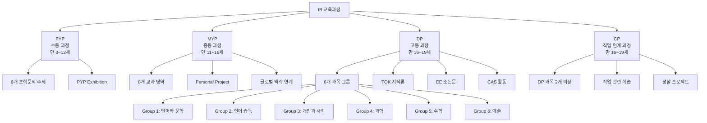
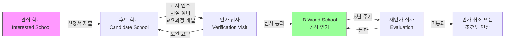
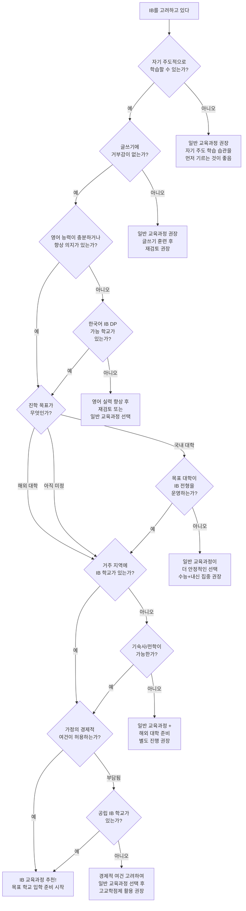

# IB 학교 vs 일반 교육과정 비교

## 서론: IB 교육의 글로벌 트렌드와 한국 도입 배경

국제 바칼로레아(International Baccalaureate, IB)는 1968년 스위스 제네바에서 설립된 국제 교육 프로그램으로, 전 세계 160개국 이상, 5,700개 이상의 학교에서 운영되고 있다. IB 교육의 핵심 철학은 "탐구 중심 학습(Inquiry-Based Learning)"으로, 학생이 스스로 질문하고 탐구하며 지식을 구성하는 과정을 중시한다.

한국에서 IB 교육이 본격적으로 주목받기 시작한 것은 2019년 대구광역시교육청이 IBO(International Baccalaureate Organization)와 공식 협약을 체결하면서부터다. 이후 제주특별자치도, 경기도 등 여러 시도교육청이 IB 도입을 추진하고 있으며, 2024년부터는 한국어로 IB DP 시험을 치를 수 있는 체계가 마련되었다.

IB 교육이 한국에서 주목받는 이유는 크게 세 가지다.

첫째, 기존 주입식 교육에서 벗어나 비판적 사고력과 창의력을 기르는 교육으로 전환하려는 교육 패러다임의 변화가 있다. 둘째, 글로벌 인재 양성에 대한 사회적 요구가 증가하고 있다. 셋째, 2015 개정 교육과정 이후 과정 중심 평가, 학생 참여형 수업 등 한국 교육 정책의 방향이 IB의 교육 철학과 유사하게 변화하고 있다.

이 문서에서는 IB 교육과정과 한국의 일반 교육과정을 다양한 측면에서 비교 분석하여, 학생과 학부모가 진로에 맞는 최적의 교육 경로를 선택할 수 있도록 돕고자 한다.

---

## IB 교육과정이란?

IB(International Baccalaureate)는 만 3세부터 19세까지의 학생을 대상으로 하는 4단계 교육 프로그램으로 구성된다. 각 단계는 연속성을 가지면서도 독립적으로 운영될 수 있다.

### PYP (Primary Years Programme) - 초등 과정

PYP는 만 3세~12세(한국 기준 유치원~초등학교 6학년)를 대상으로 하는 프로그램이다.

- **교육 기간**: 유치원부터 초등학교 6학년까지 (약 8년)
- **핵심 특징**: 6개의 초학문적 주제(Transdisciplinary Themes)를 중심으로 탐구 단원(Unit of Inquiry)을 구성
- **6개 초학문적 주제**:
  1. 우리는 누구인가 (Who We Are)
  2. 우리가 속한 시간과 공간 (Where We Are in Place and Time)
  3. 우리 자신을 표현하는 방법 (How We Express Ourselves)
  4. 세상이 돌아가는 방식 (How the World Works)
  5. 우리 자신을 조직하는 방법 (How We Organize Ourselves)
  6. 지구를 공유하는 것 (Sharing the Planet)
- **평가**: 표준화된 시험 없이 포트폴리오, 관찰, 자기 평가 등 다양한 형성 평가 활용
- **최종 프로젝트**: PYP Exhibition (6학년 때 수행하는 종합 탐구 프로젝트)

### MYP (Middle Years Programme) - 중등 과정

MYP는 만 11세~16세(한국 기준 중학교 1학년~고등학교 1학년)를 대상으로 한다.

- **교육 기간**: 5년 과정 (중1~고1에 해당)
- **8개 교과 영역**:
  1. 언어와 문학 (Language and Literature)
  2. 언어 습득 (Language Acquisition)
  3. 개인과 사회 (Individuals and Societies)
  4. 과학 (Sciences)
  5. 수학 (Mathematics)
  6. 예술 (Arts)
  7. 체육과 건강 교육 (Physical and Health Education)
  8. 디자인 (Design)
- **핵심 요소**: 글로벌 맥락(Global Contexts), 핵심 개념(Key Concepts), 관련 개념(Related Concepts)
- **평가**: 기준 참조 평가(Criterion-Referenced Assessment), 1~7등급 체계
- **최종 프로젝트**: Personal Project (개인 프로젝트) 또는 Community Project

### DP (Diploma Programme) - 고등 과정

DP는 만 16세~19세(한국 기준 고등학교 2~3학년)를 대상으로 하는 2년 과정이다. IB 교육의 가장 핵심적인 프로그램으로, 대학 입학에 직접 연계된다.

**6개 과목 그룹 상세 설명**:

| 그룹 | 영역 | 과목 예시 | 설명 |
|------|------|-----------|------|
| Group 1 | 언어와 문학 연구 | 한국어 A, 영어 A, 문학, 언어와 문학 | 모국어 수준의 언어 능력과 문학 분석력 평가 |
| Group 2 | 언어 습득 | 영어 B, 중국어 B, 스페인어 Ab Initio | 제2외국어 또는 제3외국어 학습 |
| Group 3 | 개인과 사회 | 역사, 경제, 경영, 심리학, 지리, 글로벌 정치 | 인문사회 분야의 깊이 있는 탐구 |
| Group 4 | 과학 | 물리, 화학, 생물, 컴퓨터 과학, 환경 시스템과 사회 | 실험과 탐구 중심의 과학 교육 |
| Group 5 | 수학 | 수학: 분석과 접근, 수학: 응용과 해석 | AA(이론 중심)와 AI(응용 중심) 중 선택 |
| Group 6 | 예술 | 음악, 미술, 연극, 영화, 무용 | 예술적 표현과 비평 능력 (다른 그룹 과목으로 대체 가능) |

**DP 핵심 요소 (Core Components)**:

- **TOK (Theory of Knowledge)**: 지식의 본질에 대한 탐구 과목. "우리는 어떻게 아는가?"라는 근본적 질문을 다룸. 에세이 1편과 전시(Exhibition) 수행
- **EE (Extended Essay)**: 4,000단어 분량의 독립 연구 논문. 학생이 선택한 주제에 대해 심층 연구 수행
- **CAS (Creativity, Activity, Service)**: 창의성, 활동, 봉사의 세 영역에서 18개월간 다양한 경험을 수행하고 성찰

**DP 점수 체계**:
- 6개 과목 각 7점 만점 = 42점
- TOK + EE 보너스 점수 = 최대 3점
- **총점: 45점 만점**
- 디플로마 취득 최소 점수: 24점

### CP (Career-related Programme) - 직업 연계 과정

CP는 만 16세~19세 학생을 대상으로 하며, 직업 교육과 학문적 교육을 결합한 프로그램이다.

- **구성**: DP 과목 최소 2개 + 직업 관련 학습 + CP 핵심 요소
- **CP 핵심 요소**: 개인 및 전문 기술, 봉사 학습, 성찰 프로젝트, 언어 개발
- **특징**: 직업 교육에 관심 있는 학생에게 학문적 엄격함과 실용적 기술을 동시에 제공
- **한국 도입 현황**: 현재 한국에서는 CP를 운영하는 학교가 제한적이며 주로 DP 위주로 도입 중

### IB 교육과정 구조 다이어그램

---

## 한국 IB 도입 현황 2026

### 지역별 IB 학교 현황

| 지역 | IB World School 수 | IB Candidate School 수 | 대표 학교 | 운영 프로그램 | 비고 |
|------|-------------------|----------------------|-----------|-------------|------|
| 대구 | 5 | 3 | 대구포산초, 대구범어초, 대구동중, 경북대사대부중, 대구고 | PYP, MYP, DP | 한국 IB 도입 선도 지역 |
| 제주 | 4 | 2 | 표선고, 제주국제학교, 제주외국어고 | DP | 제주 국제자유도시와 연계 |
| 경기 | 2 | 4 | 경기외국어고, 수원고 | DP, MYP | 인가 절차 진행 중인 학교 다수 |
| 서울 | 3 | 2 | 경희국제고, 서울외국인학교 | DP | 외국인학교 중심 운영 |
| 부산 | 1 | 3 | 부산국제외국인학교 | DP | 도입 확대 추진 중 |
| 충남 | 1 | 2 | 충남삼성고 | DP | IB 인증 추진 |
| 강원 | 0 | 2 | - | MYP, DP | 후보 학교 단계 |
| 전남 | 0 | 1 | - | DP | 도입 검토 중 |

### World School vs Candidate School 차이

| 구분 | IB World School | IB Candidate School |
|------|----------------|-------------------|
| 정의 | IBO로부터 공식 인가를 받은 학교 | 인가 과정에 있는 학교 |
| 인증 기간 | 보통 2~3년의 심사 과정 후 취득 | 관심 학교(Interested School) 이후 단계 |
| IB 시험 응시 | 가능 (공식 IB 디플로마 취득 가능) | 불가능 (IB 교육과정은 시범 운영 가능) |
| IB 디플로마 발급 | 가능 | 불가능 |
| 교사 요건 | IBO 공인 교사 연수 이수 필수 | 교사 연수 진행 중 |
| 교육과정 운영 | IB 교육과정 전면 운영 | 부분적 적용 또는 시범 운영 |
| 평가 | IBO 공식 평가 기준 적용 | 학교 자체 평가와 병행 |
| 재인가 | 5년마다 재인가 심사 | 해당 없음 |

### IB 인증 절차

---

## IB vs 일반 교육과정 핵심 비교표

| 비교 항목 | IB 교육과정 | 일반 교육과정 (한국 고교) |
|-----------|-----------|----------------------|
| **교육 철학** | 탐구 중심, 국제적 시각, 비판적 사고, 학습자 주도 | 교과 지식 전달 중심, 수능 대비 중심 교육 |
| **평가 방식** | 내부 평가(IA) + 외부 평가(시험) 병행, 절대 평가 | 내신(상대 평가) + 수능(절대 평가) |
| **수업 방식** | 토론, 발표, 프로젝트 중심 / 학생 참여형 | 강의 중심 / 교사 주도형 (변화 추세) |
| **과목 구조** | 6개 그룹에서 각 1과목 + TOK + EE + CAS | 공통 과목 + 선택 과목 (교육과정에 따라 다름) |
| **내신 산출** | 기준 참조 평가 (1~7등급), 절대 평가 | 상대 평가 (9등급제), 석차 등급 산출 |
| **시험 유형** | 서술형, 에세이형 중심 / 사고 과정 평가 | 객관식 + 서술형 혼합 / 정답 도출 중심 |
| **교사 역할** | 촉진자(Facilitator), 학습 코치 | 지식 전달자, 강의 진행자 |
| **학생 역할** | 능동적 탐구자, 자기 주도 학습자 | 수동적 수용자에서 능동적 참여자로 변화 중 |
| **숙제 유형** | 탐구 과제, 에세이, 실험 보고서, 성찰일지 | 문제풀이, 교과서 정리, 기출문제 풀이 |
| **프로젝트** | EE(소논문), CAS 프로젝트, IA(내부평가) | 세특 활동, 동아리, 봉사활동 (2025 이후 축소) |
| **수업 언어** | 영어 또는 한국어 (한국어 DP 가능) | 한국어 (영어 과목 제외) |
| **대입 연계** | IB 점수로 국내외 대학 지원 가능 | 수능 + 내신 + 생기부로 국내 대학 지원 |
| **학습 깊이** | HL(상위 수준)은 대학 교양 수준까지 깊이 있게 학습 | 수능 출제 범위 내에서 학습 |
| **과목 선택 자유도** | 6개 그룹 내에서 SL/HL 자유 선택 | 교육과정 편성에 따라 선택 제한적 |
| **학습 결과물** | 포트폴리오, 에세이, 구술 발표, 실험 보고서 등 다양 | 시험 답안지 중심, 생기부 기재 |
| **국제 인정** | 전 세계 대학에서 인정 | 한국 대학 중심 (해외 대학은 별도 절차) |

---

## IB DP 과목 구조 상세

### Group 1: 언어와 문학 연구 (Studies in Language and Literature)

| 과목명 | 수준 | 주요 학습 내용 | 평가 요소 |
|--------|------|--------------|-----------|
| 언어 A: 문학 | SL/HL | 다양한 장르의 문학 작품 분석, 비평적 읽기, 문학적 논증 | Paper 1(안내 문학 분석), Paper 2(비교 에세이), HL Essay, IO(개인 구술) |
| 언어 A: 언어와 문학 | SL/HL | 문학 작품 + 비문학 텍스트 분석, 미디어 리터러시, 수사학 | Paper 1(텍스트 분석), Paper 2(비교 에세이), HL Essay, IO |
| 문학과 공연 | SL | 문학 텍스트의 공연적 해석, 연극적 접근 | 공연 포트폴리오, 비평 분석 |

### Group 2: 언어 습득 (Language Acquisition)

| 과목명 | 수준 | 주요 학습 내용 | 평가 요소 |
|--------|------|--------------|-----------|
| 언어 B | SL/HL | 제2외국어의 4기능(읽기, 쓰기, 듣기, 말하기) 고급 수준 | Paper 1(글쓰기), Paper 2(읽기/듣기), IA(개인 구술) |
| 언어 Ab Initio | SL | 완전 초보자를 위한 외국어 학습 | Paper 1, Paper 2, IA |
| 라틴어/고전 그리스어 | SL/HL | 고전 언어 문법 및 문학 | Paper 1, Paper 2 |

### Group 3: 개인과 사회 (Individuals and Societies)

| 과목명 | 수준 | 주요 학습 내용 | 평가 요소 |
|--------|------|--------------|-----------|
| 역사 | SL/HL | 20세기 세계사 중심, 사료 분석, 역사적 논증 | Paper 1(사료 분석), Paper 2(에세이), Paper 3(HL), IA(역사 탐구) |
| 경제 | SL/HL | 미시경제, 거시경제, 국제경제, 개발경제 | Paper 1, Paper 2, Paper 3(HL), IA(경제 논평) |
| 경영 | SL/HL | 기업 경영, 마케팅, 재무, 인적 자원 관리 | Paper 1, Paper 2, IA(연구 프로젝트) |
| 심리학 | SL/HL | 인지, 사회문화, 생물학적 접근의 심리학 | Paper 1, Paper 2, Paper 3(HL), IA(실험 보고서) |
| 지리 | SL/HL | 자연지리, 인문지리, 글로벌 이슈 | Paper 1, Paper 2, Paper 3(HL), IA(현장 조사) |
| 글로벌 정치 | SL/HL | 국제 관계, 인권, 평화와 분쟁, 개발 | Paper 1, Paper 2, IA(참여 프로젝트) |
| 세계 종교 | SL | 주요 세계 종교의 비교 연구 | Paper 1, Paper 2, IA |

### Group 4: 과학 (Sciences)

| 과목명 | 수준 | 주요 학습 내용 | 평가 요소 |
|--------|------|--------------|-----------|
| 물리 | SL/HL | 역학, 열역학, 파동, 전자기학, 원자핵물리 등 | Paper 1, Paper 2, Paper 3(HL), IA(실험 탐구) |
| 화학 | SL/HL | 원자 구조, 결합, 에너지, 반응 속도, 유기화학 등 | Paper 1, Paper 2, Paper 3(HL), IA |
| 생물 | SL/HL | 세포생물학, 유전, 생태학, 진화, 인체 생리 등 | Paper 1, Paper 2, Paper 3(HL), IA |
| 컴퓨터 과학 | SL/HL | 프로그래밍, 알고리즘, 데이터 구조, 시스템 기초 | Paper 1, Paper 2, Paper 3(HL), IA(프로그램 개발) |
| 환경 시스템과 사회 (ESS) | SL | 환경 과학 + 사회적 맥락, 지속가능성 | Paper 1, Paper 2, IA |
| 스포츠 과학 | SL/HL | 운동 생리학, 스포츠 심리학, 영양학 | Paper 1, Paper 2, IA |

### Group 5: 수학 (Mathematics)

| 과목명 | 수준 | 주요 학습 내용 | 평가 요소 |
|--------|------|--------------|-----------|
| 수학: 분석과 접근 (AA) | SL/HL | 대수, 함수, 미적분, 확률통계 / 이론 중심 | Paper 1(비계산기), Paper 2(계산기), Paper 3(HL), IA(수학 탐구) |
| 수학: 응용과 해석 (AI) | SL/HL | 통계, 모델링, 기술 활용 / 실생활 응용 중심 | Paper 1(비계산기), Paper 2(계산기), Paper 3(HL), IA |

### Group 6: 예술 (The Arts)

| 과목명 | 수준 | 주요 학습 내용 | 평가 요소 |
|--------|------|--------------|-----------|
| 미술 | SL/HL | 시각 예술 제작, 미술사 연구, 큐레이션 | 비교 연구, 과정 포트폴리오, 전시회 |
| 음악 | SL/HL | 음악 분석, 작곡, 연주 | 음악 분석, 작곡/연주 포트폴리오 |
| 연극 | SL/HL | 연극 이론, 공연 제작, 연출 | 연극 일지, 공연, 연출 프로젝트 |
| 영화 | SL/HL | 영화 분석, 영상 제작, 영화 이론 | 텍스트 분석, 영상 제작 포트폴리오 |
| 무용 | SL/HL | 무용 기법, 안무, 무용사 | 공연, 안무 작품, 비평 에세이 |

### DP 핵심 요소 (Core) 상세

| 요소 | 내용 | 시간 요구 | 평가 |
|------|------|-----------|------|
| TOK (지식론) | 지식의 본질, 인식 방법, 지식 영역 탐구 | 100시간 | 에세이(1,600단어) + 전시(Exhibition) |
| EE (소논문) | 자유 주제 독립 연구, 학술적 논문 작성 | 40시간 (지도시간 포함) | 4,000단어 연구 논문 + 구술 발표(Viva Voce) |
| CAS (창의성, 활동, 봉사) | 창의적 활동, 신체 활동, 지역사회 봉사 | 18개월간 지속 | 성찰 일지 + CAS 포트폴리오 (점수 없음, 이수/미이수) |

---

## IB 학교의 하루 일과

### IB 학교 vs 일반고 일과 비교

| 시간 | IB 학교 | 일반 고등학교 |
|------|---------|-------------|
| 07:30~08:00 | 등교, 자유 독서 시간 | 등교, 0교시 또는 아침 자습 |
| 08:00~08:50 | 1교시: DP 과목 수업 (예: 수학 AA HL) | 1교시: 정규 수업 |
| 08:50~09:00 | 쉬는 시간 | 쉬는 시간 |
| 09:00~09:50 | 2교시: DP 과목 수업 (예: 물리 SL) | 2교시: 정규 수업 |
| 09:50~10:00 | 쉬는 시간 | 쉬는 시간 |
| 10:00~10:50 | 3교시: TOK (지식론) | 3교시: 정규 수업 |
| 10:50~11:10 | 중간 쉬는 시간 (간식 시간) | 쉬는 시간 |
| 11:10~12:00 | 4교시: DP 과목 수업 (예: 경제 HL) | 4교시: 정규 수업 |
| 12:00~13:00 | 점심시간 | 점심시간 |
| 13:00~13:50 | 5교시: DP 과목 수업 (예: 영어 B HL) | 5교시: 정규 수업 |
| 13:50~14:00 | 쉬는 시간 | 쉬는 시간 |
| 14:00~14:50 | 6교시: DP 과목 수업 (예: 한국어 A HL) | 6교시: 정규 수업 |
| 14:50~15:00 | 쉬는 시간 | 쉬는 시간 |
| 15:00~15:50 | 7교시: EE 지도 시간 / 자기 연구 시간 | 7교시: 정규 수업 또는 보충 수업 |
| 15:50~16:30 | CAS 활동 (동아리, 봉사, 운동 등) | 청소 및 종례 |
| 16:30~17:30 | 자유 탐구 시간 / 도서관 연구 | 야간 자율학습 (학교별 상이) |
| 17:30~18:30 | 하교 또는 선택적 자습 | 야간 자율학습 계속 |
| 18:30~ | 하교 | 야간 자율학습 (일부 학교 21:00까지) |

### 주요 차이점

| 항목 | IB 학교 | 일반 고등학교 |
|------|---------|-------------|
| 수업 블록 | 긴 블록(70~80분) 수업이 많음 | 50분 단위 수업 |
| 방과 후 | CAS 활동, 자기 연구 시간 보장 | 야간 자율학습, 보충 수업 위주 |
| 숙제 시간 | IA, 에세이 작성 등 개인 연구 중심 | 문제풀이, 교과서 학습 중심 |
| 시험 준비 | 수업 중 형성 평가 지속 + IB 시험 대비 | 내신 시험 + 수능 모의고사 대비 |
| 교사 상담 | EE 지도교사와 정기 면담 | 담임 중심 생활 상담 |

---

## IB에서 잘하는 학생 유형 vs 힘들어하는 학생 유형

### IB에서 잘하는 학생 유형

| 특성 | 상세 설명 | 학습 습관 | 강점 발휘 영역 |
|------|-----------|-----------|--------------|
| 자기 주도적 학습자 | 스스로 학습 계획을 세우고 실행하며, 외부 강제 없이도 꾸준히 학습할 수 있는 학생 | 매일 일정한 시간에 자발적으로 공부, 계획표 활용 | EE 연구, IA 프로젝트, CAS 계획 |
| 글쓰기를 즐기는 학생 | 에세이, 보고서, 성찰일지 등 다양한 글쓰기에 흥미가 있고, 자신의 생각을 논리적으로 표현하는 데 능숙한 학생 | 독서 습관이 있고, 일기나 블로그 작성 경험 있음 | TOK 에세이, EE, 각 과목 Paper, 성찰 일지 |
| 호기심이 강한 탐구형 | "왜?"라는 질문을 자주 하며, 교과서 범위를 넘어 깊이 있게 파고드는 것을 좋아하는 학생 | 관련 자료를 스스로 찾아 읽고, 추가 탐구를 자발적으로 수행 | EE 주제 선정, IA 실험 설계, TOK 토론 |
| 다양한 관심사를 가진 학생 | 학문적 관심뿐 아니라 예술, 스포츠, 봉사 등 다양한 분야에 관심과 경험이 있는 학생 | 여러 활동을 균형 있게 병행, 시간 관리 능력 우수 | CAS 프로젝트, 균형 잡힌 DP 과목 선택 |
| 토론과 발표에 강한 학생 | 자신의 의견을 명확히 표현하고, 다양한 관점을 수용하며, 비판적으로 사고할 수 있는 학생 | 수업 시간에 적극 참여, 발표 준비를 철저히 함 | TOK 전시, IO(개인 구술), 수업 참여도 |
| 시간 관리 능력이 뛰어난 학생 | 여러 과목의 과제와 프로젝트를 동시에 관리하면서도 마감일을 지킬 수 있는 학생 | 장기 프로젝트를 단계별로 나누어 진행, 우선순위 설정 능력 | 모든 DP 과목의 IA 마감 관리, EE 작성 일정 |
| 영어에 자신감 있는 학생 | 영어로 된 학술 자료를 읽고 이해하며, 영어로 에세이를 작성할 수 있는 학생 (영어 DP 기준) | 영어 원서 읽기, 영어 영상 시청 등 자연스러운 영어 노출 | 영어 DP 과목 전반, 해외 대학 지원 |
| 완벽주의보다 과정을 중시하는 학생 | 결과보다 학습 과정과 성찰을 중요하게 여기며, 실수를 통해 배우는 것을 두려워하지 않는 학생 | 성찰 일지를 성실히 작성, 피드백을 적극 수용 | CAS 성찰, TOK 에세이, 전반적 IB 학습 태도 |

### IB에서 힘들어하는 학생 유형

| 특성 | 상세 설명 | 학습 습관 | 어려움을 겪는 영역 |
|------|-----------|-----------|-----------------|
| 암기 중심 학습자 | 정해진 내용을 반복 암기하는 방식에 익숙하고, 자신만의 의견이나 분석을 요구받으면 어려움을 느끼는 학생 | 교과서 밑줄, 반복 암기, 기출 문제 풀이 위주 | TOK 에세이, IA 분석, 서술형 시험 |
| 정답 지향적 사고 학생 | "정답이 뭐예요?"라고 자주 질문하며, 열린 답이나 다양한 해석을 불편해하는 학생 | 모범답안을 외우려 하고, 틀에 맞춘 학습을 선호 | TOK(정답이 없는 탐구), EE(열린 주제 연구) |
| 글쓰기에 약한 학생 | 긴 에세이 작성이 부담스럽고, 논리적 구성이나 학술적 글쓰기 경험이 부족한 학생 | 짧은 답을 선호, 서술형 과제를 미루는 경향 | EE(4,000단어), TOK 에세이, 각 과목 Paper |
| 단일 과목 집중형 학생 | 한두 과목에만 강하고 나머지 과목에는 관심이 없는 학생 | 좋아하는 과목만 깊이 있게 공부, 나머지는 최소한으로 | 6개 과목 균형 유지, CAS 다양성 요구 |
| 외부 동기에 의존하는 학생 | 부모나 교사의 지시가 있어야 공부하며, 자기 주도적 학습 습관이 형성되지 않은 학생 | 학원 시간표에 맞춘 학습, 스스로 계획 수립이 어려움 | EE 독립 연구, CAS 자기 계획, IA 자율적 수행 |
| 시간 관리가 안 되는 학생 | 과제 마감일을 자주 놓치고, 여러 프로젝트를 동시에 관리하는 데 어려움을 겪는 학생 | 벼락치기, 마감 직전 과제 시작, 우선순위 설정 미흡 | IA 마감, EE 단계별 제출, CAS 성찰 기록 |
| 영어에 자신감 없는 학생 | 영어로 학술적 글을 읽고 쓰는 것이 큰 부담인 학생 (영어 DP 기준) | 영어 자료를 번역기에 의존, 영어 수업 참여가 소극적 | 영어 DP 수업 전반, 해외 대학 지원서 작성 |
| 스트레스에 취약한 학생 | 과중한 학업량과 마감 압박에 심리적 부담을 크게 느끼며, 번아웃에 빠지기 쉬운 학생 | 불규칙한 수면, 과도한 불안, 완벽주의 경향 | DP 2학년 시험 시즌, 동시 마감 시기 |

---

## IB 성적과 대입 연계

### 국내 대학의 IB 전형

| 대학 | 전형명 | IB 점수 활용 방식 | 최소 요구 점수 | 비고 |
|------|--------|----------------|--------------|------|
| 서울대 | 일반전형(학업능력우수자) | IB DP 점수를 학업 능력 자료로 활용 | 명시 없음 (실질 합격선 38점 이상 추정) | 서류 + 면접 종합 평가 |
| 연세대 | 학업우수전형 | IB DP 공식 점수 제출 | 36점 이상 권장 | 과목별 HL 점수 중점 평가 |
| 고려대 | 학업우수형 | IB DP 점수 + 교사 추천서 | 35점 이상 권장 | 학과별 HL 과목 권장 있음 |
| KAIST | 일반전형 | IB DP 점수 + 자기소개서 | 38점 이상 권장 | 수학, 과학 HL 필수 권장 |
| 포스텍 | 일반전형 | IB DP 점수 제출 가능 | 36점 이상 권장 | 수학 AA HL, 과학 HL 선호 |
| 성균관대 | 글로벌인재전형 | IB DP 점수 활용 | 33점 이상 | IB 학생 대상 별도 전형 |
| 한양대 | 국제학부 전형 | IB DP 점수 중심 평가 | 30점 이상 | 영어 강의 학과 유리 |
| 이화여대 | 미래인재전형 | IB DP 점수 제출 가능 | 32점 이상 권장 | 서류 종합 평가 |

### 해외 대학의 IB 점수 인정

| 지역 | 대학 예시 | IB 점수 요구 | 추가 요구 사항 | 학점 인정 |
|------|-----------|------------|--------------|-----------|
| 미국 (아이비리그) | 하버드, 예일, 프린스턴 | 38점 이상 권장 (공식 최소 없음) | SAT/ACT, 에세이, 추천서, 과외활동 | HL 6~7점 과목 학점 인정 |
| 미국 (상위권) | UCLA, 미시간, NYU | 34점 이상 | SAT/ACT (선택적), 에세이 | HL 5점 이상 학점 인정 학교 많음 |
| 영국 (옥스브리지) | 옥스퍼드, 캠브리지 | 38~40점 이상, HL 776 이상 | 면접, 입학 시험(일부 학과) | 직접 입학 (파운데이션 면제) |
| 영국 (러셀그룹) | UCL, 임페리얼, 에든버러 | 34~38점 | UCAS를 통한 지원 | 직접 입학, HL 과목별 요구 |
| 캐나다 | 토론토, UBC, 맥길 | 30~34점 | 영어 능력 증명 | HL 5점 이상 학점 인정 |
| 호주 | 시드니대, 멜번대, ANU | 28~34점 | 영어 능력 증명(IELTS 등) | ATAR 환산하여 입학 |
| 일본 | 도쿄대, 교토대, 와세다 | 36점 이상 | 일본어 능력(일부 학과), 면접 | IB 전형 별도 운영 |
| 싱가포르 | NUS, NTU | 36~40점 | 영어 능력 증명 | 직접 입학 |
| 유럽 | 라이덴대, ETH 취리히 | 32~38점 | 언어 능력(해당 국가어), HL 과목 요구 | 직접 입학 |

### IB 점수별 진학 가능 대학 가이드

| IB 점수 범위 | 국내 대학 | 해외 대학 | 비고 |
|-------------|-----------|-----------|------|
| 43~45점 | 서울대, KAIST, 포스텍 최상위 학과 | 하버드, 옥스퍼드, MIT, 스탠포드 | 최상위 0.1% 수준 |
| 40~42점 | 서울대, 연세대, 고려대 주요 학과 | 아이비리그, 옥스브리지, 임페리얼 | 상위 5% 수준 |
| 38~39점 | 서울대, 연고대, KAIST | UCL, 에든버러, UCLA, NUS | 상위 15% 수준 |
| 35~37점 | 연세대, 고려대, 성균관대, 한양대 | 러셀그룹, UC계열, 토론토대 | 평균 이상 수준 |
| 32~34점 | 성균관대, 한양대, 중앙대, 경희대 | UBC, 맥길, 시드니대, 와세다 | 평균 수준 |
| 28~31점 | 중앙대, 경희대, 인하대, 아주대 | 호주 상위권, 캐나다 중위권 | 디플로마 취득 수준 |
| 24~27점 | 지방 거점 국립대, 일부 사립대 | 일부 해외 대학 지원 가능 | 디플로마 최소 기준 |

---

## IB 선택 시 장점 10가지

### 1. 비판적 사고력과 분석력 발달

IB 교육과정은 단순 암기가 아닌 "왜?"라는 질문을 끊임없이 던지도록 설계되어 있다. TOK(지식론)에서는 "우리가 알고 있다고 생각하는 것을 정말 알고 있는가?"와 같은 근본적 질문을 탐구하며, 모든 과목에서 학생들은 자료를 비판적으로 분석하고 자신만의 논증을 구성해야 한다. 이러한 훈련은 대학에서의 학문적 성공뿐 아니라 직업 세계에서의 문제 해결 능력으로 직결된다.

### 2. 글로벌 대학 진학의 문 확대

IB 디플로마는 전 세계 160개국 이상에서 인정받는 국제적 학력 인증이다. 미국, 영국, 캐나다, 호주, 유럽, 아시아의 주요 대학들이 IB 점수를 직접 입학 기준으로 활용하며, 특히 영국 대학은 IB 디플로마만으로 파운데이션 과정 없이 직접 입학이 가능하다. 한 가지 준비로 전 세계 대학에 지원할 수 있는 것은 IB만의 독보적인 장점이다.

### 3. 대학 학점 선이수 가능

IB DP에서 HL(상위 수준) 과목을 수강하고 높은 점수(보통 6~7점)를 받으면, 많은 해외 대학에서 해당 과목의 대학 학점으로 인정해 준다. 예를 들어 미국 대학에서는 수학 AA HL 7점을 받으면 미적분학 학점으로 인정받을 수 있다. 이를 통해 대학 졸업을 앞당기거나 더 상위 과목을 수강할 수 있다.

### 4. 균형 잡힌 교육

IB DP는 6개 과목 그룹에서 골고루 과목을 선택해야 하므로, 인문학과 과학, 언어와 수학, 예술까지 균형 잡힌 교육을 받게 된다. 이는 편향된 학습을 방지하고, 다양한 분야에 대한 기본 소양을 갖춘 인재를 양성하는 데 기여한다. CAS를 통해 학업 외 활동까지 균형 있게 수행해야 한다는 점도 전인적 교육의 핵심이다.

### 5. 학술적 글쓰기 능력 향상

EE(소논문), TOK 에세이, 각 과목의 IA(내부 평가) 등을 통해 학생들은 2년간 꾸준히 학술적 글쓰기를 훈련한다. 참고문헌 인용법, 논증 구성, 비판적 분석, 연구 방법론 등 대학에서 필요한 학술적 기술을 고등학교 때부터 체계적으로 배울 수 있다. 이는 대학 입학 후 리포트와 논문 작성에 큰 도움이 된다.

### 6. 독립적 연구 능력 배양

EE는 학생이 스스로 연구 주제를 선정하고, 자료를 수집 분석하며, 4,000단어의 논문을 작성하는 과정이다. 이 과정에서 학생들은 대학원 수준의 연구 방법론을 경험하게 되며, 학문적 탐구의 즐거움과 고된 과정을 동시에 체험한다. 이러한 경험은 대학에서의 졸업 논문이나 연구 프로젝트에 자연스럽게 연결된다.

### 7. 국제적 시각과 다문화 이해력

IB의 교육 철학 중 하나인 "국제적 마인드(International-Mindedness)"는 학생들이 다양한 문화, 가치관, 관점을 이해하고 존중하는 태도를 기르도록 한다. 모든 과목에서 글로벌 맥락을 다루며, CAS의 봉사 활동을 통해 지역사회와 세계 공동체에 기여하는 경험을 쌓는다. 이는 글로벌 시대에 필수적인 역량이다.

### 8. 자기 관리 및 시간 관리 능력

IB DP 학생들은 6개 과목의 IA, EE, CAS, TOK 에세이 등 다수의 장기 프로젝트를 동시에 관리해야 한다. 이 과정에서 자연스럽게 우선순위 설정, 일정 관리, 자기 통제 능력이 발달한다. 이러한 자기 관리 능력은 대학 생활과 직장 생활에서 핵심적인 역량으로 인정받는다.

### 9. 심층적 학습 경험

HL(상위 수준) 과목은 대학 교양 수준의 깊이를 요구하며, 학생들은 선택한 분야에 대해 깊이 있는 학습을 경험한다. 예를 들어 역사 HL에서는 사료를 직접 분석하고 역사적 논증을 구성하며, 과학 HL에서는 독립적인 실험을 설계하고 수행한다. 이러한 심층 학습은 해당 분야에 대한 진정한 이해와 열정을 키워준다.

### 10. 성찰 능력과 성장 마인드셋

IB는 학습 과정 전반에서 "성찰(Reflection)"을 강조한다. CAS 성찰 일지, TOK의 자기 인식, IA에서의 방법론적 성찰 등을 통해 학생들은 자신의 학습 과정을 되돌아보고 개선점을 찾는 습관을 기른다. 이러한 메타인지적 능력은 평생 학습자로 성장하는 데 필수적인 역량이다.

---

## IB 선택 시 단점 10가지

### 1. 과도한 학업 부담

IB DP는 6개 과목에 더해 TOK, EE, CAS를 동시에 수행해야 하므로 학업 부담이 상당히 크다. 특히 DP 2학년의 4~5월 시험 시즌에는 IA 마감, EE 제출, 시험 준비가 겹치면서 극심한 스트레스를 경험하는 학생이 많다. 수면 부족, 번아웃, 정신 건강 악화 등의 문제가 보고되기도 하며, 이를 관리하기 위한 학교와 가정의 지원이 필수적이다.

### 2. 국내 대입 시스템과의 불완전한 연계

한국의 대학 입시는 여전히 수능과 내신 중심으로 운영되고 있으며, IB 점수를 활용한 전형은 아직 제한적이다. 일부 대학에서만 IB 전형을 운영하고 있고, 수시의 학생부종합전형에서 IB 학생의 생기부가 불리하게 작용할 수 있다. IB 학교 학생이 수능을 병행하기는 현실적으로 매우 어렵다.

### 3. 학원 및 사교육 인프라 부족

한국에서 IB 교육은 아직 초기 단계이므로, IB 전문 학원이나 과외 교사를 찾기가 어렵다. 특히 지방의 IB 학교 학생들은 사교육 지원 없이 스스로 학습해야 하는 경우가 많다. 이는 IB의 자기 주도 학습 철학에는 부합하지만, 어려움을 겪는 학생에게 도움을 받을 수 있는 채널이 부족하다는 현실적 문제가 있다.

### 4. 영어 능력 요구 (영어 DP의 경우)

영어로 운영되는 IB DP의 경우, 학술적 영어(Academic English) 능력이 필수적이다. 단순한 영어 회화가 아닌, 학술 논문을 읽고 에세이를 작성할 수 있는 수준의 영어 능력이 요구되므로, 영어 실력이 부족한 학생에게는 과목 내용 학습 이전에 언어적 장벽이 추가적인 부담으로 작용한다.

### 5. 제한된 학교 선택지

2026년 현재 한국에서 IB를 공식적으로 운영하는 학교는 수도권과 일부 지역에 한정되어 있다. 학생의 거주 지역에 IB 학교가 없으면 기숙사 생활이나 전학을 고려해야 하며, 이는 가정에 추가적인 경제적, 심리적 부담을 줄 수 있다.

### 6. 예측 불가능한 성적 산출

IB의 절대 평가 체계는 객관적이지만, 채점 기준이 추상적으로 느껴질 수 있다. "비판적 분석" "깊이 있는 이해" 등의 평가 기준은 학생이 자신의 점수를 예측하기 어렵게 만든다. 또한 외부 시험과 내부 평가의 비율이 과목마다 다르므로, 성적 관리 전략을 세우기가 일반 교육과정보다 복잡하다.

### 7. 그룹 6 예술 과목의 부담

IB DP는 원칙적으로 예술 과목을 이수해야 하며(다른 그룹 과목으로 대체 가능), 예술에 관심이 없는 학생에게는 추가적인 부담이 될 수 있다. 특히 미술이나 음악 포트폴리오는 상당한 시간 투자를 요구하며, 이공계 진학을 희망하는 학생에게는 시간 배분 면에서 불리할 수 있다.

### 8. 전학이나 프로그램 변경의 어려움

IB DP는 2년 과정으로 설계되어 있어, 중간에 일반 교육과정으로 전환하거나 다른 학교로 전학하기가 매우 어렵다. IB 과목의 학점이 일반 교육과정으로 바로 전환되지 않으며, 이미 진행 중인 IA나 EE를 포기해야 할 수도 있다. 따라서 IB를 시작하기 전에 신중한 결정이 필요하다.

### 9. 교사 수급의 어려움

IB 교사는 IBO 공인 교사 연수를 이수해야 하며, 한국에서 IB 교육 경험이 있는 교사는 아직 부족하다. 일부 학교에서는 경험이 부족한 교사가 IB 과목을 가르치는 경우가 있으며, 이는 교육의 질에 직접적인 영향을 미칠 수 있다. 특히 한국어 DP의 경우, 한국어로 IB 교육을 수행할 수 있는 교사 양성이 시급한 과제이다.

### 10. 비용 부담

사립 IB 학교나 국제학교의 학비는 연간 수천만 원에 달할 수 있다. 공립 IB 학교는 학비 부담이 적지만, IB 교재 구입, 시험 응시료(과목당 약 10~15만 원), EE 연구 비용, CAS 활동 비용 등 추가적인 지출이 발생한다. IB 시험 등록비만으로도 전체 약 100만 원 이상이 소요될 수 있다.

---

## KB(한국형 바칼로레아)와의 관계

### 고교학점제와 IB의 비교

2025년부터 전면 시행된 고교학점제는 IB와 유사한 철학적 방향을 공유한다. 두 제도 모두 학생의 과목 선택권을 확대하고, 과정 중심 평가를 지향한다는 공통점이 있다.

| 비교 항목 | IB DP | 고교학점제 |
|-----------|-------|-----------|
| 과목 선택 | 6개 그룹에서 자유 선택 + SL/HL 선택 | 공통 과목 + 선택 과목 자유 편성 |
| 평가 방식 | 절대 평가 (1~7등급) | 성취 평가제 (A~E) 도입 확대 |
| 이수 기준 | 디플로마 취득 최소 24점 | 과목별 이수 기준 충족 (출석 + 성취도) |
| 교육 철학 | 탐구 중심, 비판적 사고, 국제적 시각 | 학생 맞춤형, 진로 연계, 자기 주도 학습 |
| 교사 역할 | 촉진자, 코치 | 과목 전문가, 진로 상담 역할 강화 |
| 교육과정 개발 | IBO 본부에서 개발 및 관리 | 교육부 + 시도교육청 + 학교 자체 개발 |
| 국제 인정 | 전 세계 대학 인정 | 한국 내 인정 (해외 인정 체계 없음) |
| 졸업 요건 | 6과목 + TOK + EE + CAS 이수 | 192학점 이수 (2025 기준) |
| 수업 방식 | 소규모 토론, 탐구 중심 | 강의 + 탐구 혼합 (학교별 차이 큼) |
| 평가 도구 | 에세이, IA, 구술, 포트폴리오 | 서술형 확대, 수행평가 비중 증가 |

### KB(한국형 바칼로레아)의 개념

KB(Korea Baccalaureate)는 IB의 교육 철학과 평가 방식을 한국 교육 맥락에 맞게 적용한 개념으로, 공식적인 별도의 프로그램이라기보다는 IB의 한국어 적용(Korean IB)과 고교학점제의 융합 방향을 가리키는 용어로 사용된다.

**KB의 주요 특징**:
- 한국어로 IB DP 시험 응시 가능 (한국어 A, 역사, 경제 등)
- 한국 교육과정과 IB 교육과정의 병행 또는 융합 운영
- 한국 대입 시스템과의 연계 방안 모색
- 한국어 IB 교재 및 교사 연수 체계 구축

### 향후 전망

| 시기 | 예상 변화 | 영향 |
|------|-----------|------|
| 2026~2027 | IB World School 인가 학교 증가 (전국 30개교 이상 예상) | IB 교육 접근성 향상 |
| 2027~2028 | 국내 대학의 IB 전형 확대 | IB 학생의 국내 대입 선택지 증가 |
| 2028~2030 | 고교학점제와 IB의 융합 모델 등장 | 일반고에서도 IB식 교육 일부 적용 |
| 2030 이후 | IB 한국어 DP 과목 다양화 | 더 많은 과목을 한국어로 학습 가능 |

---

## IB 준비를 위한 중학교 시기 전략

### 중학교 1학년 (만 13세)

**학습 기초 다지기 단계**

| 영역 | 구체적 전략 | 목표 |
|------|-----------|------|
| 영어 | 영어 원서 읽기 시작 (해리 포터, Wonder 등 YA 소설), 영어 일기 쓰기, 팟캐스트 청취 | 영어 독해력과 표현력의 기초 구축 |
| 독서 | 비문학(사회, 과학, 철학)과 문학을 균형 있게 읽기, 독서 후 감상문 작성 | 비판적 읽기 습관 형성 |
| 글쓰기 | 주 1회 에세이 연습 (주장-근거-결론 구조), 토론 후 논술문 작성 | 논리적 글쓰기의 기본 구조 익히기 |
| 수학 | 기본 개념의 완전한 이해, 공식 암기보다 원리 파악, 문장형 문제 풀이 | 수학적 사고력 기초 구축 |
| 탐구 습관 | 관심 분야 정하고 관련 자료 찾아 읽기, 간단한 탐구 보고서 작성 | 자기 주도적 탐구 습관 시작 |
| 과외 활동 | 다양한 동아리 체험, 봉사활동 시작, 예술 활동 1개 이상 참여 | CAS에 대비한 다양한 경험 축적 |

### 중학교 2학년 (만 14세)

**탐구 역량 강화 단계**

| 영역 | 구체적 전략 | 목표 |
|------|-----------|------|
| 영어 | 영어 논픽션 읽기 (National Geographic, TED 자료), 영어 에세이 작성 연습 | 학술적 영어 능력 향상 |
| 비판적 사고 | 신문 사설 분석, 찬반 토론 참여, 다양한 관점에서 이슈 바라보기 | TOK에 대비한 비판적 사고력 강화 |
| 연구 기술 | 소규모 연구 프로젝트 수행, 참고문헌 인용법 배우기, 데이터 수집 및 분석 기초 | EE에 대비한 연구 방법론 기초 |
| 과학 탐구 | 과학 실험 설계와 보고서 작성 연습, 변인 통제 개념 이해 | IA(내부 평가)에 대비한 실험 설계 능력 |
| 시간 관리 | 스스로 학습 계획표 작성, 장기 프로젝트 단계별 관리 연습 | DP의 동시 다발적 마감 관리 능력 |
| 관심 분야 | 특정 학문 분야에 대한 깊이 있는 탐구 시작, 관련 도서 읽기 | EE 주제 및 HL 과목 선택의 기초 |

### 중학교 3학년 (만 15세)

**IB 진입 준비 단계**

| 영역 | 구체적 전략 | 목표 |
|------|-----------|------|
| IB 학교 탐색 | 관심 IB 학교 방문, 입학 설명회 참석, 재학생/졸업생 인터뷰 | 정보 기반의 학교 선택 |
| 입학 준비 | IB 학교 입학 시험 준비 (영어 에세이, 수학, 면접), 자기소개서 작성 | 목표 학교 입학 |
| 영어 심화 | 학술 에세이 작성(5단락 에세이), 영어 프레젠테이션 연습 | DP 수업을 따라갈 수 있는 학술 영어 수준 |
| 과목 탐색 | IB DP 과목 안내서(Subject Guide) 사전 검토, 관심 과목 시범 학습 | DP 과목 선택을 위한 사전 탐색 |
| 장기 프로젝트 | 2~3개월 규모의 독립 프로젝트 수행 (연구, 창작, 봉사 등) | EE와 CAS에 대비한 프로젝트 수행 경험 |
| 자기 성찰 | 학습 일지 작성, 강점과 약점 분석, IB 학습자상(IB Learner Profile) 자기 평가 | 자기 이해와 성찰 능력 강화 |

---

## IB 학부모 FAQ

### Q1. IB를 하면 수능을 볼 수 없나요?

A1. IB DP 과정을 이수하면서 수능을 병행하는 것은 이론적으로 가능하지만, 현실적으로 매우 어렵습니다. IB DP의 학업량 자체가 상당하며, 수능 준비와 IB 준비는 요구하는 학습 방식이 근본적으로 다릅니다. IB는 서술형, 에세이형 평가 중심인 반면, 수능은 객관식 중심의 시간 내 문제 풀이를 요구합니다. 대부분의 IB 학생들은 IB 점수를 활용한 대학 전형이나 해외 대학 진학을 목표로 합니다. 다만 수능 최저 등급이 요구되는 일부 전형에 지원하기 위해 수능을 응시하는 경우는 있습니다.

### Q2. IB 학비는 얼마나 드나요?

A2. 학비는 학교 유형에 따라 큰 차이가 있습니다. 공립 IB 학교(예: 대구 지역 공립학교)는 일반 공립학교와 동일한 학비로 IB 교육을 받을 수 있습니다. 다만 IB 시험 등록비(전체 약 100~120만 원), 교재비(과목당 3~5만 원), EE 연구 비용 등 추가 비용이 발생합니다. 반면 사립 국제학교의 경우 연간 학비가 2,000~4,000만 원에 달할 수 있으며, 기숙사비가 추가되면 더 높아집니다. IB 교육 자체의 질은 공립과 사립 간 큰 차이가 없으므로, 공립 IB 학교는 매우 좋은 선택지입니다.

### Q3. 영어를 잘 못하면 IB를 할 수 없나요?

A3. 반드시 그렇지는 않습니다. 한국어 IB DP가 가능해지면서, 여러 과목을 한국어로 수강하고 시험을 치를 수 있게 되었습니다. 다만 일부 과목(특히 과학, 수학)의 교재와 참고 자료는 여전히 영어로 된 것이 많으며, 해외 대학 진학을 목표로 한다면 영어 실력은 필수적입니다. 중요한 것은 현재 영어 수준보다는 IB 시작 전까지 영어 실력을 향상시킬 의지와 계획이 있느냐입니다. 중학교 때부터 영어 독해와 작문을 꾸준히 연습하면 충분히 IB DP를 수행할 수 있습니다.

### Q4. IB를 중간에 그만둘 수 있나요?

A4. IB DP를 중간에 포기하는 것은 가능하지만, 여러 가지 어려움이 따릅니다. IB DP는 2년 과정으로 설계되어 있어, 1년차에 그만두면 이미 수행한 과제와 학습 내용을 일반 교육과정 학점으로 전환하기 어렵습니다. 또한 일반 교육과정으로 복귀할 경우, 내신 성적이 없는 기간이 생겨 대학 입시에 불리하게 작용할 수 있습니다. 디플로마를 포기하더라도 개별 과목의 Certificate(과목 수료증)는 받을 수 있으므로, 완전한 손해는 아닙니다. 하지만 신중한 사전 판단이 중요합니다.

### Q5. IB 학교에 입학하려면 어떤 준비가 필요한가요?

A5. IB 학교마다 입학 전형이 다르지만, 일반적으로 다음 요소들이 평가됩니다. 첫째, 영어 능력 평가(영어 에세이, 면접 등)가 중요합니다. 둘째, 수학, 과학 등 기초 학력 시험이 있을 수 있습니다. 셋째, 자기소개서나 학습 동기서를 통해 IB 교육에 대한 이해와 의지를 평가합니다. 넷째, 이전 학교의 성적증명서와 교사 추천서가 필요합니다. 가장 중요한 것은 IB 교육 방식(탐구, 토론, 에세이)에 대한 이해와 자기 주도적 학습에 대한 의지입니다.

### Q6. IB 점수로 국내 대학에 합격할 수 있나요?

A6. 가능합니다. 2026년 현재 서울대, 연세대, 고려대, KAIST, 성균관대, 한양대 등 주요 대학에서 IB 점수를 인정하는 전형을 운영하고 있으며, 이 추세는 계속 확대되고 있습니다. IB 38점 이상이면 서울대 합격 경쟁력이 있으며, 35점 이상이면 SKY 수준의 대학에 지원 가능합니다. 다만 IB 전형의 모집 인원이 아직 적고, 학과별로 HL 과목 요구 사항이 있을 수 있으므로, 목표 대학의 입시 요강을 미리 확인하는 것이 중요합니다.

### Q7. 우리 아이가 IB에 적합한지 어떻게 판단하나요?

A7. 다음 질문에 대해 아이와 함께 생각해 보시기 바랍니다. 아이가 "왜?"라는 질문을 자주 하는가? 혼자서 책을 읽거나 탐구하는 것을 좋아하는가? 글쓰기에 거부감이 없는가? 토론이나 발표를 즐기는가? 다양한 분야에 관심이 있는가? 마감일을 지키고 시간 관리를 어느 정도 할 수 있는가? 이 질문 중 절반 이상에 "예"라고 답할 수 있다면, IB에 잘 적응할 가능성이 높습니다. 반드시 모든 조건을 갖출 필요는 없으며, IB 과정에서 이러한 역량이 점점 발달합니다.

### Q8. IB와 AP 중 어느 것이 더 유리한가요?

A8. IB와 AP는 서로 다른 교육 철학과 구조를 가지고 있어 단순 비교가 어렵습니다. IB는 6개 과목 + 핵심 요소로 구성된 통합적 프로그램으로, 균형 잡힌 교육과 비판적 사고를 강조합니다. AP는 과목별 독립 시험으로, 관심 분야를 선택적으로 깊이 있게 학습할 수 있습니다. 미국 대학 진학이 목표라면 AP가 더 일반적이지만, IB 디플로마 역시 높이 평가됩니다. 영국, 유럽 대학 진학에는 IB가 더 유리합니다. 전인적 교육과 학술적 글쓰기 능력을 중시한다면 IB가, 특정 분야의 심화 학습을 원한다면 AP가 더 적합할 수 있습니다.

### Q9. IB를 하면서 사교육이 필요한가요?

A9. IB의 교육 철학은 학생의 자기 주도적 학습을 강조하므로, 이론적으로는 사교육 없이도 충분히 수행 가능합니다. 실제로 많은 IB 학교에서는 과도한 사교육을 지양합니다. 다만 현실적으로, 영어 능력 보완, 수학 기초 강화, EE 논문 지도 등에서 추가적인 도움이 필요한 학생도 있습니다. 중요한 것은 학원에서 정답을 배우는 방식의 사교육은 IB에서 큰 도움이 되지 않는다는 점입니다. IB에서 필요한 것은 사고 과정과 표현력을 기르는 것이므로, 사교육을 한다면 이에 초점을 맞추어야 합니다.

### Q10. IB 학교 졸업 후 군 입대는 어떻게 되나요?

A10. IB 학교 졸업과 군 입대는 별개의 사안입니다. IB 학교도 한국의 정규 고등학교로 인가받은 경우 고등학교 졸업 자격이 부여되며, 군 입대에 아무런 영향이 없습니다. 해외 대학에 진학한 후에도 병역 의무는 유지되며, 유학 중 병역 연기 신청이 가능합니다. 국내 대학에 진학하는 경우 일반 학생과 동일한 절차를 따릅니다.

---

## IB 선택 의사결정 플로차트

---

## IB vs 일반 학습 프로세스 비교

```mermaid
graph TB
    subgraph IB["IB 학습 프로세스"]
        I1[주제/질문 제시] --> I2[사전 지식 활성화]
        I2 --> I3[탐구 질문 설정]
        I3 --> I4[자료 수집 및 조사]
        I4 --> I5[비판적 분석 및 토론]
        I5 --> I6[자기만의 논증 구성]
        I6 --> I7[에세이/보고서 작성]
        I7 --> I8[피드백 및 수정]
        I8 --> I9[성찰 및 메타인지]
        I9 --> I10[심화 탐구 또는 새로운 질문]
    end

    subgraph REG["일반 교육과정 학습 프로세스"]
        R1A[교사의 개념 설명] --> R2A[교과서 내용 정리]
        R2A --> R3A[예시 문제 풀이]
        R3A --> R4A[유사 문제 반복 풀이]
        R4A --> R5A[오답 노트 작성]
        R5A --> R6A[기출 문제 풀이]
        R6A --> R7A[내신/수능 시험 응시]
        R7A --> R8A[성적 확인 및 보완]
        R8A --> R9A[다음 단원 학습]
    end

    subgraph COMPARE["핵심 차이"]
        C1["IB: 과정 중심<br/>탐구 → 분석 → 표현 → 성찰"]
        C2["일반: 결과 중심<br/>이해 → 암기 → 적용 → 시험"]
    end
```

---

## 마무리: 나에게 맞는 교육과정 선택하기

IB 교육과정과 일반 교육과정 중 어떤 것이 "더 좋은" 교육인지는 단정할 수 없다. 중요한 것은 학생 개개인의 학습 성향, 진로 목표, 가정 환경에 맞는 교육을 선택하는 것이다.

**IB를 선택해야 하는 경우**:
- 해외 대학 진학을 목표로 하는 학생
- 탐구와 토론, 글쓰기를 즐기는 학생
- 자기 주도적 학습 능력이 있는 학생
- 다양한 분야에 관심이 있는 학생
- 비판적 사고와 국제적 시각을 기르고 싶은 학생

**일반 교육과정을 선택해야 하는 경우**:
- 국내 대학 수시/정시를 목표로 하는 학생
- 구조화된 학습 환경을 선호하는 학생
- 특정 분야에 집중적으로 학습하고 싶은 학생
- 거주 지역에 IB 학교가 없는 학생
- 수능 중심의 대입 전략을 세운 학생

어떤 교육과정을 선택하든, 가장 중요한 것은 학생 스스로가 자신의 학습에 주인의식을 가지고 꾸준히 노력하는 것이다. IB의 학습자상(IB Learner Profile)에서 강조하는 "평생 학습자"가 되겠다는 마음가짐은 어떤 교육 환경에서든 성공의 핵심 요소가 된다.

---

**관련 문서**:
- [일반고 vs 특목고/자사고 비교](school_comparison_general_vs_special.md)
- [진로별 난이도-보상 비교](school_comparison_route_difficulty_reward.md)
- [학년별 대입 준비 타임라인](study_material_grade_timeline.md)
- [중학생 체크리스트](study_material_middle_school_checklist.md)
