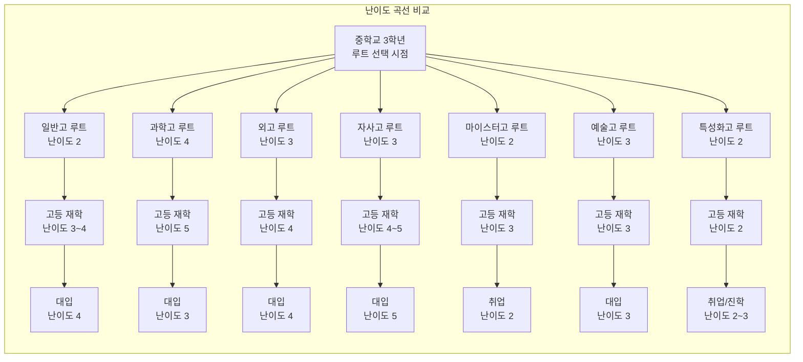
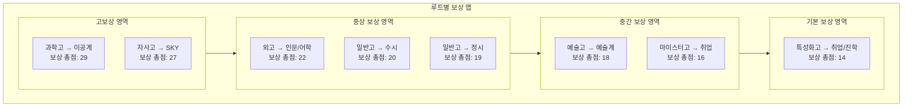
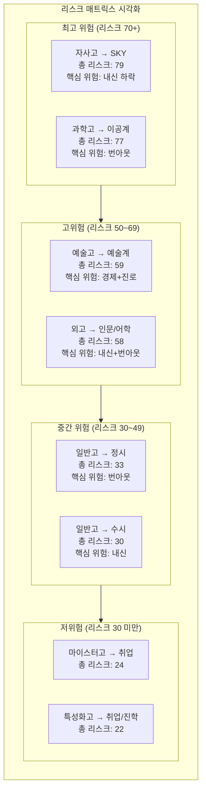
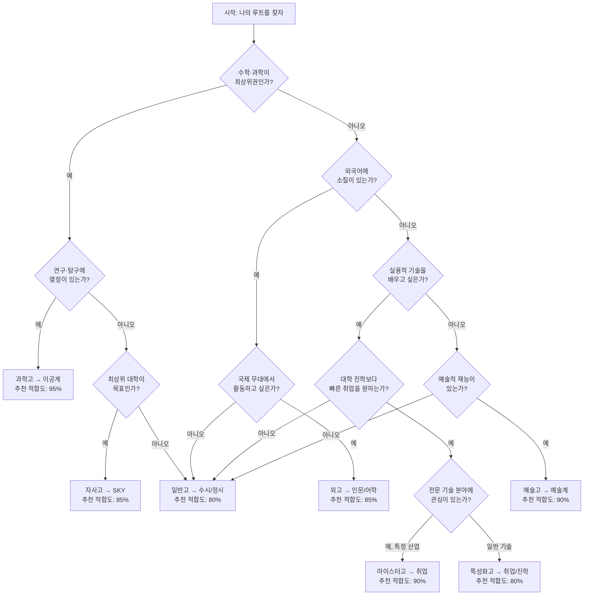

# 루트별 난이도·보상 비교

> 진로 선택은 RPG 게임의 직업 선택과 같습니다. 각 루트마다 요구하는 스탯, 난이도 곡선, 최종 보상이 다릅니다. 이 가이드는 게이미피케이션 관점에서 각 루트를 객관적으로 분석하여 최적의 선택을 돕습니다.

---

## 1. 서론: 왜 루트별 비교가 필요한가

### 1.1 진로 선택의 현실

대한민국 교육 시스템에서 학생들은 중학교 졸업 시점에 첫 번째 갈림길을 만납니다. 일반고, 특목고, 특성화고, 자사고 중 어디로 갈 것인가. 이 선택은 이후 대학 진학, 취업, 커리어 전반에 걸쳐 연쇄적인 영향을 미칩니다.

문제는 대부분의 학생과 학부모가 **단편적인 정보**만으로 이 중대한 결정을 내린다는 것입니다. "과학고가 좋다더라", "자사고 내신이 불리하다더라"와 같은 단편적 정보는 전체 그림을 보여주지 못합니다.

### 1.2 게이미피케이션 관점의 의미

게임에서 캐릭터를 생성할 때 우리는 각 직업의 스탯 요구사항, 성장 곡선, 최종 보상을 꼼꼼히 비교합니다. 진로 선택도 마찬가지여야 합니다.

이 가이드에서 사용하는 게이미피케이션 프레임워크는 다음과 같습니다.

| 게임 개념 | 진로 대응 | 설명 |
|-----------|-----------|------|
| 캐릭터 스탯 | 학업 역량, 적성, 성격 | 시작 시 보유한 기본 능력치 |
| 난이도 레벨 | 준비~대입까지 단계별 어려움 | 각 단계에서 요구되는 노력과 경쟁 강도 |
| 경험치(EXP) | 학습량, 활동 실적 | 쌓아야 하는 절대적 노력량 |
| 보스전 | 주요 시험, 면접, 대회 | 통과해야 하는 결정적 관문 |
| 보상(리워드) | 대학, 연봉, 커리어 | 루트 완주 시 얻는 결과물 |
| 히든 퀘스트 | 인맥, 경험, 자기 성장 | 눈에 보이지 않는 부가 보상 |
| 리스크 | 실패 확률, 부작용 | 루트 진행 중 발생 가능한 위험 |

### 1.3 이 가이드의 활용법

- **학생**: 자신의 적성과 역량에 맞는 루트를 객관적으로 탐색
- **학부모**: 자녀의 루트별 투자 대비 수익을 냉정하게 분석
- **교사/상담사**: 진로 상담 시 데이터 기반 자료로 활용

---

## 2. 난이도 5단계 평가 기준

### 2.1 평가 기준표

각 루트의 난이도를 1~5단계로 평가합니다. 평가 기준은 5가지 차원으로 구성됩니다.

| 레벨 | 학업 강도 | 경쟁률 | 시간 투자 | 스트레스 | 전문성 요구 |
|------|-----------|--------|-----------|----------|-------------|
| 1 (매우 쉬움) | 기본 교과 이해 수준 | 3:1 이하 | 일 2시간 이하 | 거의 없음 | 일반적 소양 |
| 2 (쉬움) | 교과 심화 이해 | 5:1 수준 | 일 3~4시간 | 가벼운 압박 | 기초 전문 지식 |
| 3 (보통) | 심화 학습 + 자기주도 | 10:1 수준 | 일 5~6시간 | 중간 수준 | 중급 전문성 |
| 4 (어려움) | 최상위권 학업 역량 | 20:1 이상 | 일 8시간 이상 | 높은 스트레스 | 고급 전문성 |
| 5 (매우 어려움) | 올림피아드급 역량 | 50:1 이상 | 일 10시간 이상 | 극심한 압박 | 최고 수준 전문성 |

### 2.2 각 레벨 상세 설명

**레벨 1 - 매우 쉬움**

일반적인 학교 수업을 따라가는 정도의 노력이면 충분합니다. 특별한 사교육이나 추가 학습 없이도 목표에 도달할 수 있으며, 경쟁이 치열하지 않습니다. 일상생활과 학업의 균형이 충분히 가능합니다.

**레벨 2 - 쉬움**

학교 수업에 더해 일정 수준의 자기 학습이 필요합니다. 기본적인 사교육이나 온라인 강의를 병행하면 충분하며, 주말에도 일부 시간을 학습에 투자해야 합니다. 취미 활동과 병행이 가능합니다.

**레벨 3 - 보통**

체계적인 학습 계획과 지속적인 노력이 필요합니다. 내신 관리, 비교과 활동, 시험 대비를 동시에 수행해야 하며, 사교육 도움을 받는 것이 일반적입니다. 개인 시간이 상당히 줄어듭니다.

**레벨 4 - 어려움**

최상위권 학업 성적과 차별화된 활동 실적이 동시에 요구됩니다. 하루 대부분의 시간을 학습과 활동에 투자해야 하며, 정신적 피로가 상당합니다. 명확한 목표 의식과 자기 관리 능력이 필수입니다.

**레벨 5 - 매우 어려움**

전국 최상위 수준의 학업 역량과 전문성이 요구됩니다. 수면 시간까지 줄여야 할 수 있으며, 극도의 집중력과 체력이 필요합니다. 장기간의 고강도 학습으로 인한 번아웃 위험이 높습니다.

### 2.3 난이도 곡선 다이어그램

---

## 3. 각 루트별 난이도 분석

### 3.1 일반고 → 수시 (학생부종합전형)

**루트 개요**: 가장 많은 학생이 선택하는 루트입니다. 내신 성적과 비교과 활동을 종합적으로 평가받습니다.

| 구분 | 난이도 | 상세 설명 |
|------|--------|-----------|
| 준비 난이도 | 2 | 일반고 입학 자체는 학군 배정이므로 별도 준비 불필요 |
| 입학 난이도 | 1 | 추첨 배정 또는 학군 배정으로 입학 장벽 없음 |
| 재학 난이도 | 4 | 내신 1~2등급 유지 + 비교과 활동 관리 필요. 전교 상위 10% 이내 목표 |
| 대입 난이도 | 4 | 학생부종합전형 경쟁률 높음. 자기소개서 폐지 후 활동 기록 중요성 증가 |

**핵심 전략**:
- 고1부터 내신 관리가 핵심. 한 과목이라도 3등급이 나오면 상위권 대학 지원에 타격
- 학교 내 동아리, 봉사, 교내 대회 등 비교과 활동 적극 참여
- 세부능력특기사항(세특)에 기록될 수 있는 수업 내 활동 적극 수행
- 담임 및 교과 교사와의 관계 관리 중요

**위험 요소**: 내신 경쟁이 치열한 학교에 배정될 경우 불리. 같은 4등급이라도 학교 수준에 따라 실질 역량 차이 존재.

---

### 3.2 일반고 → 정시

**루트 개요**: 수능 성적으로만 승부하는 루트입니다. 내신이 다소 불리해도 수능에서 만회할 수 있습니다.

| 구분 | 난이도 | 상세 설명 |
|------|--------|-----------|
| 준비 난이도 | 2 | 일반고 입학 자체는 준비 불필요 |
| 입학 난이도 | 1 | 추첨/학군 배정 |
| 재학 난이도 | 3 | 내신 부담은 상대적으로 적지만 수능 대비 학습량 많음 |
| 대입 난이도 | 5 | 전국 단위 경쟁. 상위 1% 안에 들어야 SKY급 가능 |

**핵심 전략**:
- 국어, 수학, 영어, 탐구 과목의 절대적 실력 향상에 집중
- 고3 여름 이후 수능 모의고사 성적 추이 관리
- EBS 연계 교재 철저 분석
- 킬러 문항 대비를 위한 심화 학습 필수

**위험 요소**: 수능 당일 컨디션에 따라 결과가 크게 달라질 수 있음. 재수·삼수 가능성 존재. 정시 비율 확대 추세이나 여전히 수시 대비 모집 인원 적음.

---

### 3.3 과학고 → 이공계

**루트 개요**: 수학·과학에 뛰어난 재능을 가진 학생을 위한 엘리트 루트입니다. 조기 졸업 및 카이스트/포스텍 진학이 주요 목표입니다.

| 구분 | 난이도 | 상세 설명 |
|------|--------|-----------|
| 준비 난이도 | 4 | 중학교 때부터 수학·과학 올림피아드 준비, 영재원 이수 등 필요 |
| 입학 난이도 | 5 | 전국 상위 1% 수준 경쟁. 서류+면접+캠프 다단계 선발 |
| 재학 난이도 | 5 | 대학 수준 커리큘럼. 연구 활동 병행. 극심한 학업 강도 |
| 대입 난이도 | 3 | 카이스트/포스텍 등 특별전형 활용 가능. 조기 졸업 시 유리 |

**핵심 전략**:
- 중1부터 수학·과학 심화 학습 시작 (KMO, KPhO 등)
- 영재교육원 또는 영재학급 이수 필수
- R&E(Research and Education) 프로그램 적극 참여
- 조기 졸업을 목표로 한 커리큘럼 설계

**위험 요소**: 극심한 학업 스트레스로 인한 번아웃. 동기 대비 성적 하위권 시 자존감 하락. 이과 외 진로 전환이 어려움.

---

### 3.4 외고 → 인문계/어학

**루트 개요**: 외국어 능력을 기반으로 인문·사회·어학 분야로 진출하는 루트입니다.

| 구분 | 난이도 | 상세 설명 |
|------|--------|-----------|
| 준비 난이도 | 3 | 영어+제2외국어 역량 필요. 중학교 내신 상위권 유지 |
| 입학 난이도 | 4 | 서류+면접 전형. 외국어 역량 및 자기주도학습 능력 평가 |
| 재학 난이도 | 4 | 외국어 원서 수업, 높은 내신 경쟁률. 전교생이 상위권 출신 |
| 대입 난이도 | 4 | 수시 학종 중심 지원. 외고 특성상 내신 1등급 확보 매우 어려움 |

**핵심 전략**:
- 전공 외국어(제2외국어) 실력을 차별화 포인트로 활용
- 외교, 국제기구, 통번역 등 구체적 진로 목표 설정
- 교내 외국어 관련 대회 및 활동 적극 참여
- 해외 교류 프로그램 활용

**위험 요소**: AI 번역 기술 발전으로 단순 어학 능력의 가치 하락 가능성. 내신 경쟁 극심. 외고 폐지 논의 지속.

---

### 3.5 자사고 → SKY

**루트 개요**: 자율형 사립고에서 내신과 비교과를 관리하여 SKY(서울대·고려대·연세대) 이상 대학 진학을 목표로 합니다.

| 구분 | 난이도 | 상세 설명 |
|------|--------|-----------|
| 준비 난이도 | 3 | 중학교 내신 상위권 + 면접/서류 준비 필요 |
| 입학 난이도 | 4 | 높은 경쟁률. 자기주도학습 전형 통과 필요 |
| 재학 난이도 | 5 | 전교생이 상위권 출신으로 내신 경쟁 극심. 1등급 확보 극난 |
| 대입 난이도 | 5 | 내신 불리 + 높은 목표 대학. 수시·정시 모두 치열 |

**핵심 전략**:
- 입학 직후부터 내신 관리 전략 수립 (유리한 과목 선택)
- 학교 프로그램(해외 연수, 특별 프로그램) 최대한 활용
- 정시 대비도 병행하여 이중 전략 구사
- 자사고만의 강점(교사 역량, 시설, 네트워크) 활용

**위험 요소**: 내신 4~5등급에도 실질 역량은 높을 수 있으나 학종에서 불리. 높은 학비 부담. 자사고 재지정 실패 시 일반고 전환 가능성.

---

### 3.6 마이스터고 → 취업

**루트 개요**: 산업 현장에 필요한 전문 기술을 배워 고졸 취업하는 루트입니다. 명문 마이스터고는 대기업 취업도 가능합니다.

| 구분 | 난이도 | 상세 설명 |
|------|--------|-----------|
| 준비 난이도 | 2 | 관련 분야 관심과 기본 성적 필요. 자격증 준비는 입학 후 |
| 입학 난이도 | 3 | 인기 마이스터고는 경쟁률 높음. 면접+서류 |
| 재학 난이도 | 3 | 이론+실습 병행. 자격증 취득 필수. 기업 인턴십 참여 |
| 대입 난이도 | - | 대학 진학 대신 취업이 목표 (후학습 제도 활용 가능) |

**핵심 전략**:
- 원하는 산업 분야의 마이스터고 정보 사전 조사
- 재학 중 국가기술자격증 다수 취득
- 기업 연계 프로그램 적극 참여로 취업 연결
- 병역특례 및 후학습 제도 활용 계획 수립

**위험 요소**: 초기 연봉은 높지 않을 수 있음. 장기적 승진 한계 가능성. 진로 변경 시 학력 제한.

---

### 3.7 예술고 → 예술계

**루트 개요**: 음악, 미술, 무용 등 예술 분야의 전문 교육을 받고 예술계 대학 진학 또는 전문 예술인으로 성장하는 루트입니다.

| 구분 | 난이도 | 상세 설명 |
|------|--------|-----------|
| 준비 난이도 | 3 | 어린 시절부터 실기 훈련 필요. 포트폴리오 준비 |
| 입학 난이도 | 4 | 실기 시험 비중 높음. 타고난 재능 + 오랜 훈련 필요 |
| 재학 난이도 | 3 | 전공 실기 훈련 중심. 학업 부담은 상대적으로 낮음 |
| 대입 난이도 | 3 | 실기 위주 평가. 서울 주요 예술대 경쟁률은 높음 |

**핵심 전략**:
- 초등학교 때부터 전공 분야 레슨 시작
- 각종 콩쿠르, 전시회, 공모전 수상 실적 확보
- 대학 입시 실기 유형별 집중 훈련
- 해외 콩쿠르 및 마스터클래스 참여로 차별화

**위험 요소**: 예술 분야 소득 불안정. 부상이나 건강 문제 시 커리어 위기. 초기 투자 비용(레슨비, 악기, 재료비 등) 매우 높음.

---

### 3.8 특성화고 → 취업/진학

**루트 개요**: 상업, 공업, 농업 등 특정 분야의 직업 교육을 받고 취업하거나, 전문대/4년제 대학에 진학하는 루트입니다.

| 구분 | 난이도 | 상세 설명 |
|------|--------|-----------|
| 준비 난이도 | 1 | 특별한 사전 준비 없이 지원 가능 |
| 입학 난이도 | 2 | 대부분 학교의 경쟁률 낮음. 인기 학과 제외 |
| 재학 난이도 | 2 | 이론+실습. 학업 난이도는 상대적으로 낮음 |
| 대입 난이도 | 3 | 특성화고 특별전형 활용 시 4년제 대학 진학 가능. 내신 관리 필요 |

**핵심 전략**:
- IT, 디자인 등 유망 분야의 특성화고 선택
- 재학 중 자격증 취득 + 포트폴리오 구축
- 특성화고 특별전형으로 대학 진학 도전
- 취업 후 야간대학/사이버대학으로 학력 보완

**위험 요소**: 취업 시 초봉 낮을 수 있음. 사회적 편견. 전문 분야 외 진로 전환 어려움.

---

## 4. 보상 분석

### 4.1 루트별 종합 보상 비교표

각 루트 완주 시 기대할 수 있는 보상을 6가지 차원에서 평가합니다. (5점 만점)

| 루트 | 대학 진학률 | 평균 연봉(10년차) | 직업 안정성 | 네트워크 가치 | 장학금 기회 | 성장 가능성 |
|------|------------|------------------|------------|--------------|------------|------------|
| 일반고 → 수시(학종) | 4 | 3 | 3 | 3 | 3 | 4 |
| 일반고 → 정시 | 4 | 3 | 3 | 3 | 3 | 3 |
| 과학고 → 이공계 | 5 | 5 | 4 | 5 | 5 | 5 |
| 외고 → 인문/어학 | 4 | 4 | 3 | 4 | 4 | 3 |
| 자사고 → SKY | 5 | 5 | 4 | 5 | 4 | 4 |
| 마이스터고 → 취업 | 1 | 3 | 4 | 3 | 2 | 3 |
| 예술고 → 예술계 | 3 | 2 | 2 | 4 | 3 | 4 |
| 특성화고 → 취업/진학 | 2 | 2 | 3 | 2 | 2 | 3 |

### 4.2 각 루트별 보상 상세 분석

#### 일반고 → 수시 (학종)

- **대학 진학률**: 상위권 대학 진학 가능하나 학교별 편차 큼
- **평균 연봉(10년차)**: 진학 대학에 따라 4,500만~7,000만 원
- **직업 안정성**: 전공 및 진출 분야에 따라 상이
- **네트워크 가치**: 대학 동문 네트워크 활용 가능
- **장학금 기회**: 대학별 학종 합격자 장학금 존재
- **성장 가능성**: 다양한 진로 전환 가능

#### 일반고 → 정시

- **대학 진학률**: 수능 성적에 따라 확정적. 재수 시 상향 가능
- **평균 연봉(10년차)**: 수시와 유사한 범위
- **직업 안정성**: 대학 및 전공 선택에 의존
- **네트워크 가치**: 대학 동문 네트워크
- **장학금 기회**: 성적 우수 장학금 가능
- **성장 가능성**: 수능 실력이 곧 학습 역량을 증명

#### 과학고 → 이공계

- **대학 진학률**: 카이스트/포스텍/서울대 공대 등 최상위권 진학률 매우 높음
- **평균 연봉(10년차)**: 8,000만~1억 2,000만 원 (IT/반도체 분야 기준)
- **직업 안정성**: 이공계 전문 인력 수요 지속 증가
- **네트워크 가치**: 과학고 동문 네트워크 매우 강력. 업계 핵심 인력 다수 배출
- **장학금 기회**: 과학고 재학 중 + 대학 진학 시 다양한 장학금
- **성장 가능성**: 연구직, 창업, 대기업 등 다양한 고부가가치 진로

#### 외고 → 인문/어학

- **대학 진학률**: 서울 소재 주요 대학 진학률 높음
- **평균 연봉(10년차)**: 5,500만~8,000만 원 (외교관, 국제기구, 대기업 해외부서)
- **직업 안정성**: 외교, 법률, 금융 등 안정적 분야 진출 가능
- **네트워크 가치**: 외고 동문 네트워크 우수. 각계 진출 인물 다수
- **장학금 기회**: 어학 우수 장학금, 해외 유학 장학금 기회
- **성장 가능성**: 글로벌 무대 진출 가능하나 AI 시대 어학 가치 변화 주시 필요

#### 자사고 → SKY

- **대학 진학률**: SKY급 대학 진학률이 주요 성과 지표
- **평균 연봉(10년차)**: 7,000만~1억 원 (전공·직종에 따라 상이)
- **직업 안정성**: SKY 졸업 시 취업 안정성 높음
- **네트워크 가치**: 자사고 + SKY 대학의 이중 네트워크. 최상위
- **장학금 기회**: 학비가 높은 만큼 교내 장학금도 다양
- **성장 가능성**: 폭넓은 진로 선택지. 기업·전문직·공직 등 다방면

#### 마이스터고 → 취업

- **대학 진학률**: 취업이 목표이므로 해당 없음 (후학습 제도 활용 가능)
- **평균 연봉(10년차)**: 4,000만~6,000만 원 (기술직 기준)
- **직업 안정성**: 기술 기반 직종 안정적. 대기업 취업 시 더욱 안정
- **네트워크 가치**: 산업계 실무 네트워크. 현장 경험 중시
- **장학금 기회**: 마이스터고 재학 중 산업체 지원금 가능
- **성장 가능성**: 기술 전문가로 성장 가능. 4년 일찍 시작하는 커리어의 복리 효과

#### 예술고 → 예술계

- **대학 진학률**: 예술대학 진학률 높으나 대학 서열 중요도 낮음
- **평균 연봉(10년차)**: 3,000만~1억 원 이상 (극단적 편차. 성공 시 매우 높음)
- **직업 안정성**: 매우 불안정. 프리랜서 비율 높음
- **네트워크 가치**: 예술계 인맥이 커리어에 결정적. 사제 관계 중요
- **장학금 기회**: 실기 우수자 장학금, 예술 재단 지원금
- **성장 가능성**: 상한선이 매우 높음. 세계적 아티스트 가능성

#### 특성화고 → 취업/진학

- **대학 진학률**: 특별전형으로 4년제 대학 진학 가능. 전문대 진학률 높음
- **평균 연봉(10년차)**: 3,500만~5,500만 원
- **직업 안정성**: 분야별 상이. IT 특성화고 졸업자 수요 증가 추세
- **네트워크 가치**: 제한적이나 동종 업계 내 유대감 강함
- **장학금 기회**: 특성화고 특별전형 장학금 가능
- **성장 가능성**: 후학습, 자격증 취득으로 성장 경로 확보 가능

---

## 5. 난이도 대비 보상 효율 비교

### 5.1 효율 점수 산출 방식

효율 점수 = (보상 총점 / 난이도 총점) x 100

난이도 총점은 준비·입학·재학·대입(취업) 난이도의 합산입니다.
보상 총점은 대학진학률·연봉·안정성·네트워크·장학금·성장가능성의 합산입니다.

### 5.2 효율 점수 비교표

| 순위 | 루트 | 난이도 총점 | 보상 총점 | 효율 점수 | 평가 |
|------|------|-----------|----------|----------|------|
| 1 | 마이스터고 → 취업 | 8 | 16 | 200.0 | 매우 효율적 |
| 2 | 과학고 → 이공계 | 17 | 29 | 170.6 | 고투자 고수익 |
| 3 | 특성화고 → 취업/진학 | 8 | 14 | 175.0 | 효율적 |
| 4 | 일반고 → 수시(학종) | 11 | 20 | 181.8 | 효율적 |
| 5 | 예술고 → 예술계 | 13 | 18 | 138.5 | 보통 |
| 6 | 외고 → 인문/어학 | 15 | 22 | 146.7 | 보통 |
| 7 | 일반고 → 정시 | 11 | 19 | 172.7 | 효율적 |
| 8 | 자사고 → SKY | 17 | 27 | 158.8 | 고투자 고수익 |

### 5.3 효율 분석 핵심 인사이트

1. **마이스터고 루트**가 난이도 대비 보상 효율이 가장 높습니다. 낮은 진입 장벽 대비 안정적 취업이 보장되기 때문입니다.
2. **과학고 루트**는 난이도가 가장 높지만 보상도 최상위입니다. 이공계 인재에 대한 수요가 지속되는 한 높은 효율을 유지합니다.
3. **자사고 → SKY 루트**는 난이도와 보상 모두 높아 "하이리스크 하이리턴" 전형입니다.
4. **예술고 루트**는 효율 점수가 가장 낮지만, 성공 시 보상의 상한선이 매우 높아 분산이 큽니다.
5. **일반고 루트**는 중간 난이도에 중간 보상으로 가장 보편적인 선택지입니다.

### 5.4 보상 맵 다이어그램

---

## 6. 리스크 매트릭스

### 6.1 리스크 유형 정의

각 루트에서 발생할 수 있는 주요 리스크를 정의하고, 발생 확률과 영향도를 평가합니다.

| 리스크 유형 | 설명 | 영향 범위 |
|------------|------|----------|
| 내신 하락 | 목표 등급 미달 | 대입 전략 전면 수정 필요 |
| 번아웃 | 극심한 스트레스로 인한 학습 동기 상실 | 장기 휴식 필요, 진도 이탈 |
| 진로 변경 | 선택한 전문 분야에 대한 흥미 상실 | 루트 재설정, 시간 손실 |
| 경제적 부담 | 학비, 사교육비, 레슨비 등 과다 | 가정 재정 압박, 심리적 부담 |
| 학교 부적응 | 교우 관계, 학교 문화 부적합 | 전학 고려, 학업 성취 저하 |

### 6.2 루트별 리스크 매트릭스 (발생 확률 x 영향도, 각 5점 만점)

| 루트 | 내신 하락 | 번아웃 | 진로 변경 | 경제적 부담 | 학교 부적응 |
|------|----------|--------|----------|------------|------------|
| | 확률/영향 | 확률/영향 | 확률/영향 | 확률/영향 | 확률/영향 |
| 일반고 → 수시 | 3/4 | 2/3 | 2/2 | 2/2 | 2/2 |
| 일반고 → 정시 | 2/2 | 3/4 | 2/2 | 3/3 | 2/2 |
| 과학고 → 이공계 | 4/4 | 5/5 | 3/5 | 3/3 | 3/4 |
| 외고 → 인문/어학 | 4/4 | 3/4 | 3/4 | 3/3 | 3/3 |
| 자사고 → SKY | 5/5 | 4/5 | 2/3 | 4/4 | 3/4 |
| 마이스터고 → 취업 | 2/2 | 2/2 | 3/3 | 1/1 | 2/3 |
| 예술고 → 예술계 | 2/2 | 3/3 | 4/5 | 5/4 | 2/3 |
| 특성화고 → 취업/진학 | 2/2 | 1/2 | 3/3 | 1/1 | 2/3 |

### 6.3 리스크 종합 점수 (확률 x 영향도 합산)

| 루트 | 내신 | 번아웃 | 진로변경 | 경제 | 부적응 | 총 리스크 | 등급 |
|------|------|--------|---------|------|--------|----------|------|
| 일반고 → 수시 | 12 | 6 | 4 | 4 | 4 | 30 | 중 |
| 일반고 → 정시 | 4 | 12 | 4 | 9 | 4 | 33 | 중 |
| 과학고 → 이공계 | 16 | 25 | 15 | 9 | 12 | 77 | 최고 |
| 외고 → 인문/어학 | 16 | 12 | 12 | 9 | 9 | 58 | 고 |
| 자사고 → SKY | 25 | 20 | 6 | 16 | 12 | 79 | 최고 |
| 마이스터고 → 취업 | 4 | 4 | 9 | 1 | 6 | 24 | 저 |
| 예술고 → 예술계 | 4 | 9 | 20 | 20 | 6 | 59 | 고 |
| 특성화고 → 취업/진학 | 4 | 2 | 9 | 1 | 6 | 22 | 저 |

### 6.4 리스크 매트릭스 다이어그램

---

## 7. 실패 시 회복 난이도 비교

### 7.1 실패 시나리오별 분석

각 루트에서 목표 달성에 실패했을 때 발생하는 상황과 회복 방안을 분석합니다.

#### 일반고 → 수시 (학종) 실패 시

| 실패 시나리오 | 회복 옵션 | 회복 난이도 | 소요 기간 |
|-------------|----------|-----------|----------|
| 내신 3등급 이하로 하락 | 정시로 전환 | 3 | 6개월~1년 |
| 비교과 활동 부족 | 고3 이전이면 보완 가능 | 2 | 3~6개월 |
| 학종 불합격 | 정시 지원 또는 재수 | 3 | 6개월~1년 |
| 전체 실패 (미진학) | 재수, 검정고시 후 진학 | 4 | 1~2년 |

#### 일반고 → 정시 실패 시

| 실패 시나리오 | 회복 옵션 | 회복 난이도 | 소요 기간 |
|-------------|----------|-----------|----------|
| 수능 성적 목표 미달 | 재수 | 3 | 1년 |
| 원하는 대학 불합격 | 하향 지원 또는 재수 | 2~4 | 즉시~1년 |
| 반수 결정 | 대학 재학 중 수능 재응시 | 4 | 1년 |
| 삼수 이상 | 장기 재수 또는 전략 전환 | 5 | 1~2년 |

#### 과학고 → 이공계 실패 시

| 실패 시나리오 | 회복 옵션 | 회복 난이도 | 소요 기간 |
|-------------|----------|-----------|----------|
| 과학고 내 하위권 | 일반 대학 이공계 지원 | 2 | 즉시 |
| 조기졸업 실패 | 3년 과정 이수 후 일반 대입 | 3 | 1년 추가 |
| 이공계 흥미 상실 | 인문·상경계 전환 (매우 어려움) | 5 | 2~3년 |
| 번아웃으로 학업 중단 | 휴학 후 복귀 또는 검정고시 | 4 | 1~2년 |

#### 외고 → 인문/어학 실패 시

| 실패 시나리오 | 회복 옵션 | 회복 난이도 | 소요 기간 |
|-------------|----------|-----------|----------|
| 내신 하위권 전락 | 정시 전환 | 3 | 6개월~1년 |
| 외국어 흥미 상실 | 인문·사회 계열로 전환 | 2 | 즉시 |
| 외고 폐지 영향 | 일반고 전환 후 적응 | 3 | 1년 |
| 대입 전체 실패 | 재수 또는 해외 유학 | 3 | 1~2년 |

#### 자사고 → SKY 실패 시

| 실패 시나리오 | 회복 옵션 | 회복 난이도 | 소요 기간 |
|-------------|----------|-----------|----------|
| 내신 4~5등급 | 정시 올인 전략 | 4 | 1~2년 |
| SKY 불합격 | 차상위권 대학 또는 재수 | 3 | 즉시~1년 |
| 자사고 재지정 실패 | 일반고 전환 적응 | 3 | 6개월 |
| 완전 실패 | 재수 + 정시 집중 | 4 | 1~2년 |

#### 마이스터고 → 취업 실패 시

| 실패 시나리오 | 회복 옵션 | 회복 난이도 | 소요 기간 |
|-------------|----------|-----------|----------|
| 원하는 기업 취업 실패 | 중소기업 취업 후 이직 | 2 | 1~2년 |
| 자격증 미취득 | 졸업 후 자격증 준비 | 2 | 3~6개월 |
| 대학 진학 희망 변경 | 후학습 제도 또는 사이버대 | 3 | 2~4년 |
| 분야 적성 불일치 | 타 분야 자격증 취득 후 전환 | 3 | 1~2년 |

#### 예술고 → 예술계 실패 시

| 실패 시나리오 | 회복 옵션 | 회복 난이도 | 소요 기간 |
|-------------|----------|-----------|----------|
| 실기 능력 한계 체감 | 예술 관련 다른 직종 전환 (기획, 교육 등) | 3 | 1~2년 |
| 대학 불합격 | 재수 또는 해외 유학 | 3 | 1~2년 |
| 부상/건강 문제 | 창작 방향 전환 또는 이론 분야 | 4 | 1~3년 |
| 예술 포기 | 일반 대학 진학 (검정고시 활용) | 5 | 2~3년 |

#### 특성화고 → 취업/진학 실패 시

| 실패 시나리오 | 회복 옵션 | 회복 난이도 | 소요 기간 |
|-------------|----------|-----------|----------|
| 취업 실패 | 직업훈련원 또는 추가 자격증 | 2 | 3~6개월 |
| 대학 진학 불합격 | 전문대 또는 사이버대 | 2 | 즉시~1년 |
| 분야 전환 희망 | 타 분야 학원/학습 | 3 | 6개월~1년 |
| 학업 중단 | 검정고시 후 재도전 | 3 | 1~2년 |

### 7.2 회복 난이도 종합 비교

| 루트 | 평균 회복 난이도 | 회복 유연성 | 최악 시나리오 탈출 난이도 |
|------|---------------|------------|----------------------|
| 일반고 → 수시 | 3.0 | 높음 | 4 |
| 일반고 → 정시 | 3.5 | 높음 | 5 |
| 과학고 → 이공계 | 3.5 | 낮음 | 5 |
| 외고 → 인문/어학 | 2.75 | 중간 | 3 |
| 자사고 → SKY | 3.5 | 중간 | 4 |
| 마이스터고 → 취업 | 2.5 | 높음 | 3 |
| 예술고 → 예술계 | 3.75 | 낮음 | 5 |
| 특성화고 → 취업/진학 | 2.5 | 높음 | 3 |

**핵심 인사이트**: 마이스터고와 특성화고 루트가 실패 시 회복이 가장 용이합니다. 반면 과학고와 예술고 루트는 전문성이 높은 만큼 실패 시 전환 비용이 큽니다.

---

## 8. 숨겨진 보상과 숨겨진 비용

### 8.1 숨겨진 보상 (눈에 보이지 않는 이득)

#### 인맥 (네트워크 자본)

| 루트 | 숨겨진 인맥 가치 | 상세 설명 |
|------|---------------|----------|
| 과학고 → 이공계 | 매우 높음 | IT/반도체/바이오 업계 핵심 인력 네트워크. 동기가 연구소장, CTO, 교수가 됨 |
| 자사고 → SKY | 매우 높음 | 법조, 의료, 금융, 정관계 전반의 광범위한 인맥 |
| 외고 → 인문/어학 | 높음 | 외교관, 국제기구, 글로벌 기업 해외 파견 인맥 |
| 예술고 → 예술계 | 높음 | 예술계 사제 관계가 평생 이어짐. 기회의 문은 인맥으로 열림 |
| 일반고 → 수시/정시 | 보통 | 대학에서 형성되는 인맥이 주력 |
| 마이스터고 → 취업 | 보통 | 산업 현장 실무자 네트워크. 실질적 도움이 됨 |
| 특성화고 → 취업/진학 | 낮음 | 동종 업계 내 제한적 네트워크 |

#### 자기 효능감과 성취 경험

- **과학고/자사고 출신**: 극한의 경쟁을 경험한 뒤 "어디서든 해낼 수 있다"는 자신감 형성
- **마이스터고 출신**: 일찍 경제적 독립을 이룬 자부심과 실무 능력에 대한 자신감
- **예술고 출신**: 예술적 성취를 통한 깊은 자아 실현감
- **일반고 출신**: 다양한 환경에서의 적응력과 유연성

#### 기회 발견 능력

특정 루트를 거치면서 자연스럽게 접하게 되는 기회들이 있습니다.

- **과학고**: 국제과학올림피아드, 영재 장학금, 조기 대학 진학
- **외고**: 해외 교환학생, 국제기구 인턴십, 글로벌 장학금
- **자사고**: 특별 해외 연수, 기업 CEO 멘토링, 명문대 교수 추천서
- **예술고**: 국제 콩쿠르, 해외 마스터클래스, 예술 재단 후원
- **마이스터고**: 대기업 채용 연계, 해외 기술 연수, 병역특례

### 8.2 숨겨진 비용 (눈에 보이지 않는 대가)

#### 기회비용

| 루트 | 포기하는 것 | 기회비용 가치 |
|------|-----------|-------------|
| 과학고 → 이공계 | 청소년기의 다양한 경험, 폭넓은 교우 관계 | 매우 높음 |
| 자사고 → SKY | 여유로운 청소년기, 자유로운 진로 탐색 | 높음 |
| 외고 → 인문/어학 | 이공계 진로 가능성, 다양한 과목 경험 | 중간 |
| 일반고 → 정시 | 고3 1년간의 모든 비학업 활동 | 중간 |
| 마이스터고 → 취업 | 대학 캠퍼스 라이프, 학문적 깊이 | 높음 |
| 예술고 → 예술계 | 일반 학업 역량, 다른 진로 옵션 | 높음 |
| 특성화고 → 취업/진학 | 일반 고등학교 경험, 폭넓은 대학 선택지 | 중간 |

#### 건강 비용

- **과학고/자사고**: 수면 부족, 운동 부족, 시력 저하가 일반적. 정신건강 문제 위험 높음
- **예술고 (무용/음악)**: 연습으로 인한 신체 부상, 손목/허리 질환 위험
- **일반고 → 정시**: 고3 시기 극심한 스트레스, 수능 후 탈진 증후군
- **마이스터고**: 실습 중 안전사고 위험, 현장 근무 시 신체 피로

#### 가족 관계 비용

- **과학고/자사고**: 기숙사 생활로 가족과의 유대감 약화 가능성
- **예술고**: 높은 교육비로 인한 가정 내 경제적 긴장
- **정시 집중 루트**: 가족 전체가 수험생 중심으로 생활, 형제자매에게 미치는 영향
- **마이스터고**: 진학 대신 취업을 택한 것에 대한 가족 간 갈등 가능성

#### 심리적 비용

| 루트 | 주요 심리적 비용 | 발현 시기 |
|------|---------------|----------|
| 과학고 | 상대적 박탈감 (이전에 1등이었으나 중위권 이하로 추락) | 입학 직후 |
| 자사고 | 내신 경쟁으로 인한 동료 관계 악화 | 시험 기간 |
| 외고 | 외고 폐지 논의에 따른 불안감 | 재학 전 기간 |
| 정시 | 재수/삼수 결정 시 사회적 고립감 | 졸업 이후 |
| 마이스터고 | 대학 미진학에 대한 사회적 편견 | 취업 이후 |
| 예술고 | 재능의 한계 인식 시 정체성 위기 | 고2~고3 |
| 특성화고 | 학력 차별에 대한 심리적 압박 | 사회생활 시작 후 |

---

## 9. 적성별 최적 루트 매칭 가이드

### 9.1 성격 유형 정의

| 유형 | 핵심 특성 | 강점 | 약점 |
|------|----------|------|------|
| 분석형 | 논리적, 체계적, 데이터 중시 | 문제 해결, 수학적 사고 | 감성적 소통, 창의적 발상 |
| 창의형 | 독창적, 상상력 풍부, 규칙 파괴 | 아이디어 생성, 혁신 | 반복 작업, 규칙 준수 |
| 리더형 | 사교적, 결단력, 영향력 | 조직 관리, 의사소통 | 세부사항 관리, 인내 |
| 실용형 | 실질적, 결과 지향, 효율 중시 | 실행력, 문제 해결 | 이론적 탐구, 장기 계획 |
| 예술형 | 감성적, 표현력, 미적 감각 | 예술적 창작, 감정 표현 | 논리적 분석, 경쟁 |
| 탐구형 | 호기심, 깊이 있는 사고, 독립적 | 연구, 분석, 전문 지식 | 팀워크, 빠른 의사결정 |

### 9.2 유형별 최적 루트 매칭

#### 분석형 학생

**최적 루트**: 과학고 → 이공계 (적합도 95%)
- 수학·과학 문제 해결에서 큰 만족감을 느낌
- 체계적 학습 방식이 과학고 커리큘럼에 부합
- 연구 활동에서 분석 능력 발휘

**차선 루트**: 일반고 → 정시 (적합도 75%)
- 수능이라는 명확한 목표에 집중
- 수학, 과학 중심 학습에 유리

**비추천 루트**: 예술고 (적합도 20%)
- 감성적 표현보다 논리적 분석을 선호하여 부적합

#### 창의형 학생

**최적 루트**: 예술고 → 예술계 (적합도 90%)
- 창작 활동에서 독창성 발휘
- 자유로운 분위기의 교육 환경 적합

**차선 루트**: 일반고 → 수시 학종 (적합도 70%)
- 비교과 활동에서 창의력 발휘 가능
- 다양한 분야 탐색 가능

**비추천 루트**: 마이스터고 (적합도 30%)
- 규격화된 기술 교육에 답답함을 느낄 수 있음

#### 리더형 학생

**최적 루트**: 자사고 → SKY (적합도 90%)
- 우수한 동료와의 경쟁과 협력에서 성장
- 학생회, 동아리 등 리더십 활동 풍부
- SKY 대학의 폭넓은 네트워크 활용

**차선 루트**: 외고 → 인문/어학 (적합도 80%)
- 외교, 국제기구 등 글로벌 리더십 발휘 가능
- 소통 능력이 핵심 역량인 진로

**비추천 루트**: 특성화고 (적합도 35%)
- 리더십을 발휘할 무대가 제한적

#### 실용형 학생

**최적 루트**: 마이스터고 → 취업 (적합도 95%)
- 이론보다 실습 중심 교육에 적합
- 빠른 경제적 독립 추구
- 결과가 명확한 자격증 취득 목표

**차선 루트**: 특성화고 → 취업/진학 (적합도 85%)
- 실용적 기술 습득
- 취업과 진학의 유연한 선택

**비추천 루트**: 과학고 (적합도 25%)
- 이론 중심 심화 학습에 흥미를 잃을 가능성

#### 예술형 학생

**최적 루트**: 예술고 → 예술계 (적합도 95%)
- 전공 실기 집중 교육
- 같은 열정을 가진 동료와의 교류
- 예술적 성장에 최적화된 환경

**차선 루트**: 일반고 → 수시 학종 (적합도 55%)
- 예술 관련 비교과로 포트폴리오 구성 가능
- 예술 외 다른 진로도 열어둘 수 있음

**비추천 루트**: 과학고 (적합도 10%)
- 수학·과학 중심 커리큘럼이 예술적 성장을 저해

#### 탐구형 학생

**최적 루트**: 과학고 → 이공계 (적합도 90%)
- 깊이 있는 연구 활동 가능
- R&E 프로그램으로 탐구 욕구 충족
- 독립적 학습 환경 제공

**차선 루트**: 외고 → 인문/어학 (적합도 70%)
- 언어와 문화에 대한 깊은 탐구 가능
- 해외 학술 자료 접근 용이

**비추천 루트**: 마이스터고 (적합도 30%)
- 기술 습득 위주로 깊은 이론 탐구 기회 제한

### 9.3 적성-루트 매칭 종합표

| 적성 유형 | 1순위 루트 | 2순위 루트 | 3순위 루트 | 절대 비추천 |
|----------|-----------|-----------|-----------|-----------|
| 분석형 | 과학고→이공계 | 일반고→정시 | 자사고→SKY | 예술고 |
| 창의형 | 예술고→예술계 | 일반고→수시 | 외고→인문 | 마이스터고 |
| 리더형 | 자사고→SKY | 외고→인문 | 일반고→수시 | 특성화고 |
| 실용형 | 마이스터고→취업 | 특성화고→취업 | 일반고→정시 | 과학고 |
| 예술형 | 예술고→예술계 | 일반고→수시 | 특성화고→디자인 | 과학고 |
| 탐구형 | 과학고→이공계 | 외고→인문 | 자사고→SKY | 마이스터고 |

---

## 10. 게이미피케이션 관점의 루트 공략법

### 10.1 각 루트의 게임 스펙

#### 일반고 → 수시 (학종) 공략

**스탯 요구사항**:
- 학업력: 80 이상
- 활동력: 75 이상
- 소통력: 70 이상
- 자기관리: 85 이상
- 전략력: 80 이상

**필수 퀘스트**:
1. 내신 1~2등급 유지 (반복 퀘스트, 매 학기)
2. 교내 동아리 활동 3년 지속 (장기 퀘스트)
3. 교내 대회 수상 5회 이상 (도전 퀘스트)
4. 봉사활동 의미 있는 기록 (일일 퀘스트)
5. 세부능력특기사항 우수 기록 확보 (숨겨진 퀘스트)

**보스전**:
- 중간보스: 고1 1학기 내신 (첫 내신이 기준점이 됨)
- 최종보스: 학생부종합전형 면접 (대학별 상이)

**히든 퀘스트**:
- 담임교사와 깊은 신뢰 관계 형성 (추천서 효과)
- 전공 관련 독서 50권 이상 (세특 기록 강화)
- 학교 축제/행사 기획 참여 (리더십 기록)

**보상 아이템**:
- 학생부 종합 평가 A등급 (대입 합격 확률 대폭 상승)
- 다재다능 칭호 (다양한 진로 옵션 해금)
- 자기주도 학습자 버프 (대학 생활 적응력 향상)

---

#### 과학고 → 이공계 공략

**스탯 요구사항**:
- 수학력: 95 이상
- 과학력: 95 이상
- 체력: 80 이상
- 집중력: 90 이상
- 멘탈: 85 이상

**필수 퀘스트**:
1. KMO/KPhO/KChO 1차 이상 통과 (입학 전 퀘스트)
2. 영재교육원 이수 (전제 조건 퀘스트)
3. R&E 연구 프로젝트 완수 (메인 퀘스트)
4. 대학 수준 교과 이수 (고급 퀘스트)
5. 조기졸업 자격 충족 (엘리트 퀘스트)

**보스전**:
- 입학보스: 과학고 입학 캠프 (3단계 심층 면접)
- 중간보스: 2학년 진급 심사 (성적 기준 미달 시 일반고 전환)
- 최종보스: 카이스트/포스텍 입학 사정 (또는 서울대 특기자)

**히든 퀘스트**:
- 국제과학올림피아드 메달 (초레어 업적, 해금 시 모든 대학 입학 가능)
- 과학 논문 공저자 등재 (대입 시 강력한 가산점)
- 해외 영재 프로그램 참가 (글로벌 네트워크 해금)

**보상 아이템**:
- 이공계 엘리트 칭호 (높은 연봉 시작)
- 연구자 특성 (깊은 사고력 영구 버프)
- 과학고 동문 패스 (업계 네트워크 접근권)

---

#### 자사고 → SKY 공략

**스탯 요구사항**:
- 전과목 학업력: 90 이상
- 체력: 85 이상
- 전략력: 90 이상
- 멘탈: 90 이상
- 경쟁력: 95 이상

**필수 퀘스트**:
1. 전과목 내신 1~2등급 유지 (매 학기 반복, 매우 어려움)
2. 학교 특색 프로그램 전부 참여 (독점 퀘스트)
3. 해외 연수 프로그램 참가 (특별 퀘스트)
4. 수능 대비 병행 (이중 퀘스트)
5. SKY 대학별 맞춤 전략 수립 (전략 퀘스트)

**보스전**:
- 입학보스: 자사고 자기주도학습 전형 (면접+서류)
- 중간보스: 고2 내신 - 이 시점 등급이 대입 방향 결정
- 최종보스: SKY 수시/정시 합격 (전국구 경쟁)

**히든 퀘스트**:
- 전교 1등 달성 (레어 업적, 서울대 지원 시 강력한 무기)
- 자사고 특별 장학생 선발 (학비 면제 + 이력 강화)
- 동문 선배 멘토링 프로그램 참여 (진로 정보 획득)

**보상 아이템**:
- SKY 합격증 (최상위 커리어 시작점)
- 엘리트 네트워크 패스 (자사고+SKY 이중 인맥)
- 만능형 인재 칭호 (어떤 분야든 진출 가능)

---

#### 마이스터고 → 취업 공략

**스탯 요구사항**:
- 실습력: 80 이상
- 성실성: 85 이상
- 기술력: 75 이상
- 적응력: 80 이상
- 소통력: 70 이상

**필수 퀘스트**:
1. 국가기술자격증 3개 이상 취득 (핵심 퀘스트)
2. 기업 인턴십 성공적 수행 (실전 퀘스트)
3. 현장 실습 우수 평가 (평판 퀘스트)
4. 졸업 작품/프로젝트 완성 (캡스톤 퀘스트)
5. 취업 면접 대비 (최종 퀘스트)

**보스전**:
- 입학보스: 마이스터고 서류+면접 (인기 학교는 경쟁 치열)
- 중간보스: 자격증 실기 시험 (실제 기술 검증)
- 최종보스: 대기업 채용 면접 (실무 역량 + 인성 평가)

**히든 퀘스트**:
- 기능 올림픽 입상 (금메달 시 대기업 특채 가능)
- 특허 출원 (재학 중 아이디어로 특허 등록)
- 해외 기술 연수 선발 (글로벌 시야 확보)

**보상 아이템**:
- 조기 경제 독립 (4년 빠른 수입 시작)
- 기술 전문가 칭호 (현장에서 인정받는 실무 역량)
- 후학습 티켓 (근무하면서 학위 취득 가능)

---

### 10.2 루트 선택 플로차트

---

## 11. 시기별 전략 로드맵

### 11.1 일반고 → 수시 (학종) 로드맵

| 시기 | 핵심 미션 | 세부 행동 | 달성 기준 |
|------|----------|----------|----------|
| 중1 | 기초 학력 확립 | 전과목 학습 습관 형성. 독서 습관 시작 | 내신 상위 20% |
| 중2 | 관심 분야 탐색 | 다양한 분야 체험. 진로 적성 검사 수행 | 관심 분야 2~3개 선정 |
| 중3 | 일반고 입학 준비 | 학군/학교 정보 조사. 진로 방향 구체화 | 목표 학교 선정 |
| 고1-1학기 | 첫 내신 사수 | 내신 전과목 올인. 학교 적응. 동아리 가입 | 전과목 2등급 이내 |
| 고1-2학기 | 내신 유지 + 활동 시작 | 동아리 활동 본격화. 교내 대회 참가 시작 | 내신 유지 + 수상 1회 |
| 고2-1학기 | 전공 방향 확정 | 전공 관련 심화 활동. 세특 기록 관리 | 전공 분야 확정 |
| 고2-2학기 | 활동 실적 축적 | 연구 보고서, 대회 수상, 독서 기록 강화 | 핵심 활동 3개 이상 |
| 고3-1학기 | 학생부 마무리 | 마지막 내신 관리. 면접 준비 시작 | 학생부 완성 |
| 고3-2학기 | 대입 실전 | 원서 작성. 면접 연습. 수능 최저 대비 | 목표 대학 합격 |

### 11.2 과학고 → 이공계 로드맵

| 시기 | 핵심 미션 | 세부 행동 | 달성 기준 |
|------|----------|----------|----------|
| 중1 | 수학·과학 심화 진입 | 영재학급 또는 영재교육원 지원. 수학 선행 시작 | 영재교육 프로그램 참여 |
| 중2 | 올림피아드 도전 | KMO 1차, 과학올림피아드 지역 예선 도전 | 올림피아드 1차 통과 |
| 중3 상반기 | 과학고 입시 준비 | 자기소개서 작성. 면접 준비. 포트폴리오 정리 | 서류 합격 |
| 중3 하반기 | 과학고 캠프 통과 | 캠프 면접 준비. 실험 설계 능력 향상 | 과학고 최종 합격 |
| 고1 | 대학 수준 학습 적응 | 미적분, 대학 물리/화학 이수. R&E 주제 탐색 | 성적 상위 30% |
| 고2 | R&E + 올림피아드 | 연구 프로젝트 본격 수행. 국제올림피아드 도전 | 연구 결과물 산출 |
| 고3 (또는 조기졸업) | 대학 진학 | 카이스트/포스텍 지원. 또는 서울대 특기자 전형 | 목표 대학 합격 |

### 11.3 자사고 → SKY 로드맵

| 시기 | 핵심 미션 | 세부 행동 | 달성 기준 |
|------|----------|----------|----------|
| 중1 | 최상위권 내신 확보 | 전과목 1등급 목표. 자기주도학습 습관 형성 | 전과목 A 이상 |
| 중2 | 자사고 입시 대비 | 자기주도학습 전형 준비. 독서, 체험 활동 기록 | 자기주도학습 전형 소재 확보 |
| 중3 | 자사고 입학 | 서류 작성 + 면접 준비. 합격 후 선행학습 | 자사고 합격 |
| 고1-1학기 | 내신 충격 극복 | 첫 내신에서 좋은 성적 확보 (경쟁 매우 치열) | 내신 2등급 이내 |
| 고1-2학기 | 전략적 과목 선택 | 유리한 선택과목 결정. 비교과 활동 시작 | 내신 유지 + 활동 기반 확보 |
| 고2-1학기 | 수시/정시 전략 확정 | 내신 추이 분석 후 수시/정시 비중 결정 | 대입 전략 확정 |
| 고2-2학기 | 핵심 역량 강화 | 수시: 활동 집중 / 정시: 수능 대비 강화 | 전략별 핵심 지표 달성 |
| 고3-1학기 | 최종 내신 + 수능 병행 | 마지막 내신 관리. 수능 모의고사 성적 관리 | 목표 등급 도달 |
| 고3-2학기 | SKY 도전 | 원서 접수. 면접 준비. 수능 응시 | SKY 합격 |

### 11.4 마이스터고 → 취업 로드맵

| 시기 | 핵심 미션 | 세부 행동 | 달성 기준 |
|------|----------|----------|----------|
| 중1 | 적성 탐색 | 기술 분야 관심 확인. 진로 체험 활동 참여 | 관심 분야 2~3개 선정 |
| 중2 | 마이스터고 정보 수집 | 원하는 분야의 마이스터고 조사. 학교 방문 | 목표 학교 2~3곳 선정 |
| 중3 | 마이스터고 입학 | 서류+면접 준비. 분야 관련 기초 지식 학습 | 마이스터고 합격 |
| 고1 | 기초 기술 습득 | 전공 기초 이론+실습. 기초 자격증 도전 | 기초 자격증 1개 취득 |
| 고2 | 심화 기술 + 자격증 | 전문 자격증 취득. 기업 연계 프로그램 참여 | 전문 자격증 2개 이상 |
| 고3 | 취업 준비 + 현장실습 | 기업 인턴십/현장실습. 취업 면접 준비 | 대기업 또는 우수 중견기업 취업 |

---

## 12. 최종 요약

### 12.1 루트별 한눈에 보기

| 항목 | 일반고(수시) | 일반고(정시) | 과학고 | 외고 | 자사고 | 마이스터고 | 예술고 | 특성화고 |
|------|------------|------------|--------|------|--------|-----------|--------|---------|
| 총 난이도 | 중 | 중 | 최고 | 고 | 최고 | 중저 | 중 | 저 |
| 총 보상 | 중상 | 중상 | 최고 | 고 | 최고 | 중 | 중 | 중저 |
| 효율성 | 높음 | 높음 | 높음 | 보통 | 보통 | 매우 높음 | 보통 | 높음 |
| 리스크 | 중 | 중 | 최고 | 고 | 최고 | 저 | 고 | 저 |
| 회복 난이도 | 보통 | 보통 | 높음 | 보통 | 높음 | 쉬움 | 높음 | 쉬움 |
| 추천 유형 | 균형형 | 수능형 | 분석/탐구형 | 소통/글로벌형 | 리더형 | 실용형 | 예술형 | 실용형 |

### 12.2 핵심 결론

1. **최고 효율 루트**: 마이스터고 → 취업. 낮은 투자 대비 안정적 수익. 단, 장기 성장 한계 고려 필요.
2. **최고 보상 루트**: 과학고 → 이공계 / 자사고 → SKY. 높은 투자에 상응하는 최고 수준의 보상. 단, 리스크도 최고.
3. **최고 균형 루트**: 일반고 → 수시 (학종). 중간 수준의 투자와 보상으로 가장 많은 학생에게 적합.
4. **최고 변동성 루트**: 예술고 → 예술계. 성공 시 보상 상한선이 가장 높으나, 실패 시 회복이 어려움.
5. **가장 안전한 루트**: 특성화고 → 취업/진학. 리스크가 가장 낮고 회복이 쉬우나, 보상 상한선도 낮음.

### 12.3 마지막 조언

루트 선택에서 가장 중요한 것은 **자기 자신을 정확히 아는 것**입니다. 남들이 좋다고 하는 루트가 나에게 최선은 아닙니다. 이 가이드의 분석은 통계적 평균에 기반한 것이며, 개인의 역량, 환경, 열정에 따라 결과는 크게 달라질 수 있습니다.

게임에서도 가장 강한 직업이 반드시 가장 재미있는 직업은 아닙니다. **자신이 즐기면서 꾸준히 할 수 있는 루트**가 결국 가장 높은 레벨에 도달하게 됩니다.

---

> 이 가이드는 2026년 기준 대한민국 교육 시스템을 바탕으로 작성되었습니다. 교육 정책 변경에 따라 내용이 달라질 수 있으므로 최신 정보를 항상 확인하시기 바랍니다.
