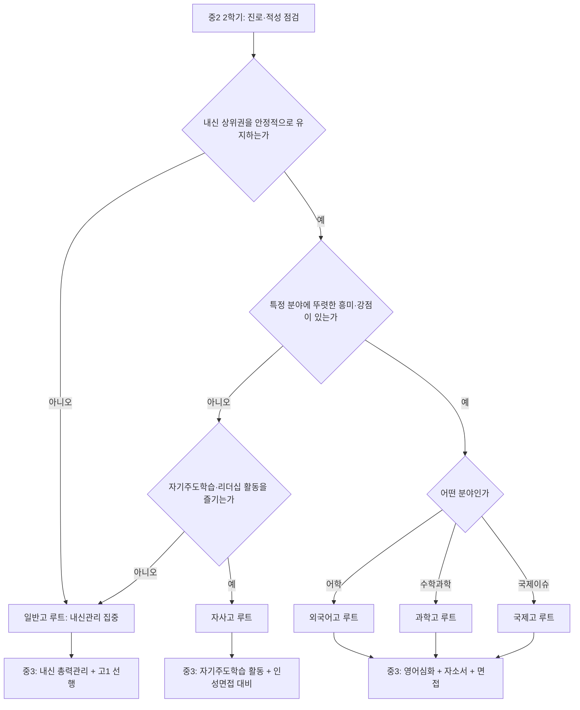
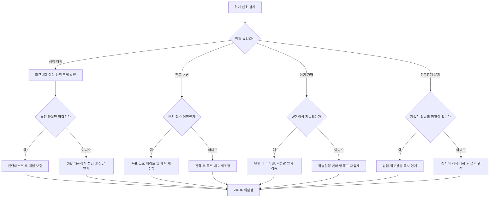

# 학년별 실행 타임라인

이 문서는 중학교 3개년(중1~중3) 동안 학기별·방학별로 무엇을 언제 실행해야 하는지를 월 단위로 구체화한 실행 가이드입니다. 각 시기마다 핵심 목표, 세부 실행 과제, 완료 기준을 표로 정리했고, 진학 루트(일반고/특목고/자사고)에 따라 달라지는 타임라인 차이도 함께 다룹니다. 마지막에는 위기 상황 대응법과 부모님과 공유할 요약본을 담았습니다.

## 목차

1. 3개년 전체 개요와 실행 타임라인
2. 중1 상반기/하반기 실행 계획
3. 중2 상반기/하반기 실행 계획
4. 중3 상반기/하반기 실행 계획과 고입 직전 3개월 집중 전략
5. 시기별 핵심 목표·실행 과제·완료 기준 총괄표
6. 루트별 차별화 타임라인 (일반고/특목고/자사고)
7. 방학 활용 전략 (여름방학/겨울방학)
8. 위기 시점과 대처법
9. 부모님과 공유할 타임라인 요약

---

## 1. 3개년 전체 개요와 실행 타임라인

중학교 3년은 크게 세 단계로 나뉩니다. 중1은 학습 습관과 자기 이해를 다지는 시기, 중2는 자유학기(또는 자유학년) 이후 본격적으로 실력을 심화하는 시기, 중3은 진학 루트를 확정하고 실제 입시를 실행하는 시기입니다. 아래 간트 차트는 36개월 전체 흐름을 한눈에 보여줍니다.

```mermaid
gantt
  title 중1~중3 3개년 실행 타임라인 (개월 단위)
  dateFormat X
  axisFormat %s개월차
  section 중1 (1~12개월)
  학습습관 정착 : 0, 5
  기초 진로탐색 : 3, 6
  독서-글쓰기 루틴화 : 0, 12
  section 중2 (13~24개월)
  자유학기 활동 심화 : 12, 6
  전공적합 활동 시작 : 15, 9
  내신관리 준비운동 : 18, 6
  section 중3 (25~36개월)
  루트 확정 : 24, 3
  내신 총력관리 : 24, 9
  고입 서류-면접 대비 : 30, 4
  원서-면접-발표 : 34, 2
```

| 학년 | 핵심 테마 | 상반기 키워드 | 하반기 키워드 | 산출물 |
| --- | --- | --- | --- | --- |
| 중1 | 습관과 탐색 | 학습 루틴 정착, 기초 진단 | 진로 탐색 시작, 독서 심화 | 학습습관 체크리스트, 진로탐색 노트 |
| 중2 | 심화와 확장 | 자유학기 활동 극대화 | 전공적합 활동, 내신 준비운동 | 활동 포트폴리오 초안 |
| 중3 | 확정과 실행 | 루트 확정, 내신 총력전 | 고입 서류·면접·원서 | 자기소개서, 최종 지원 전략표 |

운영 원칙은 다음과 같습니다.

- 매 학기 시작 전에 이번 학기의 핵심 KPI를 1개만 정합니다.
- 매월 말에 이번 달 완료 기준 충족 여부를 점검하고, 미충족 시 다음 달 계획에 보정 과제를 추가합니다.
- 분기(3개월)마다 루트 유지/수정 여부를 재검토합니다.

---

## 2. 중1 상반기/하반기 실행 계획

### 2-1. 중1 상반기 (3월~7월, 1학기)

중1 1학기의 목표는 중학교 학습 리듬에 적응하고, 자신의 학습 스타일과 강점 과목을 파악하는 것입니다. 성적보다 습관 형성에 무게를 둡니다.

| 월 | 핵심 목표 | 실행 과제 | 완료 기준 |
| --- | --- | --- | --- |
| 3월 | 중학교 적응 | 시간표 기반 주간 학습계획표 작성, 과목별 노트정리 방식 정하기 | 4주 연속 계획표 실행률 80% 이상 |
| 4월 | 학습 진단 | 국영수 기초 진단평가 응시, 취약 단원 표시 | 과목별 취약 단원 리스트 3개 이상 확보 |
| 5월 | 1차 지필고사 대비 | 시험 4주 전부터 과목별 회독 계획 수립, 오답노트 시작 | 전 과목 시험범위 2회독 완료 |
| 6월 | 오답 정리 및 보완 | 1차 지필 오답노트 정리, 취약 단원 재학습 | 오답노트 20문항 이상 누적, 재풀이 정답률 70% 이상 |
| 7월 | 여름방학 준비 | 1학기 성적 리뷰, 방학 학습계획 수립 | 1학기 자기평가서 작성 완료 |

세부 실행 지침은 다음과 같습니다.

- **3월**: 등하교 후 30분 이내 그날 배운 내용을 다시 보는 "당일 복습" 습관을 들입니다. 학습 다이어리(또는 앱)에 매일 공부 시간을 기록합니다.
- **4월**: 담임/교과 선생님 상담을 통해 초등 대비 부족한 개념을 확인하고, 필요한 경우 기초 개념서 1권을 선정해 병행 학습합니다.
- **5월**: 첫 지필고사이므로 과도한 부담보다는 "시험 준비 프로세스"를 익히는 데 집중합니다. 과목별 예상 문제를 스스로 만들어보는 연습을 포함합니다.
- **6월**: 오답을 유형별로 분류(개념 미숙/연산 실수/시간 부족)하여 원인별 대응법을 다르게 적용합니다.
- **7월**: 국어 독서록, 진로 탐색 활동 등 비교과 활동 이력을 정리하며 1학기를 마무리합니다.

### 2-2. 중1 하반기 (8월~이듬해 2월, 2학기)

2학기는 자유학기제(또는 자유학년제) 운영 여부에 따라 학교별 편차가 있지만, 공통적으로 진로 탐색과 독서·글쓰기 역량 강화에 집중하는 시기입니다.

| 월 | 핵심 목표 | 실행 과제 | 완료 기준 |
| --- | --- | --- | --- |
| 8월 | 방학 마무리, 2학기 준비 | 방학 학습 결과 점검, 2학기 목표 재설정 | 여름방학 계획 대비 실행률 70% 이상 |
| 9월 | 진로탐색 활동 | 진로체험 프로그램 1회 이상 참여, 관심 분야 3개 선정 | 진로탐색 보고서 1편 작성 |
| 10월 | 2차 지필고사 대비 | 시험범위 3회독, 취약 단원 집중 보완 | 오답률 1차 대비 10%p 개선 |
| 11월 | 독서·글쓰기 강화 | 월 2권 독서 및 서평 작성, 논술형 문제 연습 | 서평 2편, 논술형 답안 4개 작성 |
| 12월 | 겨울방학 준비 | 2학기 성적 리뷰, 겨울방학 계획 수립 | 2학기 자기평가서 및 방학계획서 작성 |
| 1월 | 겨울방학 학습 | 중2 선행 개념 정리(수학 중심), 진로 탐색 심화 | 수학 다음학기 1단원 예습 완료 |
| 2월 | 중2 진입 준비 | 학습 루틴 재점검, 중2 목표 설정 | 중2 학습계획서 초안 작성 |

세부 실행 지침은 다음과 같습니다.

- **9~10월**: 자유학기(또는 자유학년) 활동을 활용해 진로체험, 동아리, 예술·체육 활동 중 최소 2가지 이상을 경험하며 흥미 분야를 좁혀갑니다.
- **11월**: 지필고사 부담이 상대적으로 적은 학교의 경우 이 시기를 독서와 글쓰기 역량 강화에 집중 투자합니다. 비문학 지문 요약 훈련을 병행합니다.
- **12~1월**: 성적표와 활동 기록을 근거로 강점 과목/약점 과목을 명확히 구분하고, 중2 진학 전 보완할 우선순위를 3가지로 압축합니다.

---

## 3. 중2 상반기/하반기 실행 계획

### 3-1. 중2 상반기 (3월~7월, 1학기)

중2는 본격적으로 내신 성적이 누적 기록으로 의미를 갖기 시작하는 시기입니다. 동시에 전공/진로 적합 활동을 시작해야 합니다.

| 월 | 핵심 목표 | 실행 과제 | 완료 기준 |
| --- | --- | --- | --- |
| 3월 | 학습 강도 상향 | 주간 학습시간 중1 대비 20% 증가, 과목별 목표등급 설정 | 목표등급 설정표 작성 완료 |
| 4월 | 전공적합 활동 착수 | 관심 분야 관련 도서 3권 선정, 동아리 가입 | 동아리 가입 및 첫 활동 기록 |
| 5월 | 1차 지필고사 | 시험 5주 전부터 계획적 회독, 과목별 취약유형 정리 | 전 과목 3회독, 오답노트 30문항 |
| 6월 | 심화 개념 학습 | 수학/과학 심화 문제집 병행, 영어 어휘량 확대 | 심화 문제집 1권 50% 이상 진행 |
| 7월 | 1학기 마무리 | 성적 및 활동 리뷰, 여름방학 계획 수립 | 1학기 포트폴리오 정리 완료 |

세부 실행 지침은 다음과 같습니다.

- **3월**: 중1 성적표를 근거로 과목별 목표 등급을 설정하고, 목표와 현재 수준의 격차를 구체적 학습량(주당 문제 수, 단원 수)으로 환산합니다.
- **4월**: 진로 탐색에서 한 걸음 나아가 "전공적합 활동"을 시작합니다. 관심 분야 도서 독서, 관련 대회 정보 수집, 동아리 활동 등을 병행합니다.
- **5월**: 시험 준비 기간을 5주로 확대해 계획성을 높입니다. 특히 수학은 유형별 오답 원인을 세분화합니다.
- **6월**: 상위권 진입을 목표로 한다면 이 시기부터 심화 문제집을 병행하고, 영어는 독해 지문 수준을 한 단계 올립니다.
- **7월**: 활동 이력을 포트폴리오 형태로 정리하기 시작합니다(추후 고입 자기소개서의 소재가 됩니다).

### 3-2. 중2 하반기 (8월~이듬해 2월, 2학기)

2학기는 진로 방향을 좁히고, 목표 고교 유형에 대한 정보 수집을 시작하는 시기입니다.

| 월 | 핵심 목표 | 실행 과제 | 완료 기준 |
| --- | --- | --- | --- |
| 8월 | 여름방학 마무리 | 여름방학 학습 결과 점검, 목표 고교 유형 후보 3곳 선정 | 고교 후보 리스트 및 비교표 작성 |
| 9월 | 목표 고교 정보수집 | 희망 고교 설명회/입학요강 확인, 선배 인터뷰(가능시) | 고교별 전형요강 요약표 작성 |
| 10월 | 2차 지필고사 | 시험범위 3회독, 심화 유형 집중 훈련 | 오답률 1차 대비 개선, 목표등급 근접 |
| 11월 | 자기주도 심화 학습 | 약점 과목 개인 맞춤 보강(과외/인강/스터디 중 선택) | 약점 과목 월간 평가 점수 향상 |
| 12월 | 2학기 마무리 | 성적 및 활동 종합 리뷰, 루트 가닥 잡기 | 진학 루트 후보 1~2개로 압축 |
| 1월 | 겨울방학 심화학습 | 중3 선행 학습(수학/영어 중심), 자기소개서 소재 정리 | 중3 1단원 예습 완료, 활동 소재 10개 이상 정리 |
| 2월 | 중3 진입 준비 | 중2 총정리, 중3 목표 및 루트 최종 점검 | 중3 학습·진학 계획서 작성 |

세부 실행 지침은 다음과 같습니다.

- **8~9월**: 일반고/특목고/자사고 중 어느 방향이 적합한지 탐색을 시작합니다. 이 시점에는 확정이 아니라 "정보 수집과 후보 압축"이 목표입니다.
- **10~11월**: 목표 등급과 실제 성적의 격차가 크다면 학습 방법(자기주도/개인지도/그룹스터디)을 재점검하고 필요한 조치를 취합니다.
- **12월**: 중2 말은 진학 루트를 사실상 결정짓는 분수령입니다. 성적, 흥미, 활동 이력을 종합해 후보를 좁힙니다.
- **1~2월**: 특목고/자사고를 고려한다면 이 겨울방학이 마지막 준비 기간이므로 영어 심화, 자소서 소재 정리에 집중합니다.

---

## 4. 중3 상반기/하반기 실행 계획과 고입 직전 3개월 집중 전략

### 4-1. 중3 상반기 (3월~7월, 1학기)

중3 1학기는 내신 성적이 고입 전형에 직접 반영되는 마지막 학기(또는 마지막에서 두 번째 학기)로, 총력을 기울여야 하는 시기입니다.

| 월 | 핵심 목표 | 실행 과제 | 완료 기준 |
| --- | --- | --- | --- |
| 3월 | 루트 최종 확정 | 목표 고교 1~2곳 확정, 전형 요강 정독 | 목표 고교 확정 및 전형일정표 작성 |
| 4월 | 내신 총력 준비 | 전 과목 5주 회독 계획, 수행평가 일정 관리 | 수행평가 마감 100% 준수 |
| 5월 | 1차 지필고사 | 목표등급 근접을 위한 집중 학습, 취약유형 특훈 | 목표등급 달성률 80% 이상 |
| 6월 | 비교과 마무리 | 자기소개서 소재 확정, 추천서 필요시 요청 준비 | 소재별 초안 문장 작성 완료 |
| 7월 | 1학기 마무리 | 최종 내신 성적 확인, 여름방학 집중계획 수립 | 내신 성적표 기반 지원 가능선 분석 완료 |

세부 실행 지침은 다음과 같습니다.

- **3월**: 전형 요강을 정독하며 내신 반영 학기, 비교과 반영 항목, 면접 유무를 표로 정리합니다.
- **4월**: 수행평가가 내신에서 차지하는 비중이 크므로, 과제형 수행평가는 마감 1주 전 초안을 완성하는 것을 원칙으로 합니다.
- **5월**: 중3 1차 지필은 사실상 마지막 내신 상승 기회인 경우가 많으므로, 취약 유형에 대한 개인 튜터링이나 집중 특강을 적극 활용합니다.
- **6월**: 자기소개서에 쓸 소재(활동, 독서, 수상, 프로젝트 등)를 목록화하고 각 소재별로 배운 점과 성장 포인트를 문장으로 정리해둡니다.
- **7월**: 내신 성적을 기준으로 지원 가능한 학교 라인을 냉정하게 재분석하고, 여름방학 계획에 반영합니다.

### 4-2. 중3 하반기 (8월~이듬해 2월, 2학기) 및 고입 직전 3개월 집중 전략

2학기는 실제 원서 접수, 자기소개서 제출, 면접까지 이어지는 실행 국면입니다. 특히 11월~이듬해 2월(고입 직전 3개월 이상)은 분 단위로 관리해야 하는 시기입니다.

| 월 | 핵심 목표 | 실행 과제 | 완료 기준 |
| --- | --- | --- | --- |
| 8월 | 여름방학 마무리 | 자기소개서 초안 완성, 면접 기출 수집 | 자소서 초안 1차 완성 |
| 9월 | 2차 지필고사 대비 | 마지막 내신 관리, 시험범위 집중 회독 | 목표등급 유지·달성 |
| 10월 | 서류 최종 점검 | 자기소개서 퇴고, 학교생활기록부 최종 확인 | 자소서 최종본 확정 |
| 11월 | 원서 접수 준비 | 원서 접수 일정 확인, 필요서류 사전 준비 | 서류 체크리스트 100% 준비 |
| 12월 | 원서 접수·면접 준비 | 원서 접수, 면접 예상질문 30개 준비 및 모의면접 | 모의면접 3회 이상 실시 |
| 1월 | 면접·발표 | 면접 응시, 결과 발표 확인, 예비 플랜 점검 | 면접 후 자기평가 기록 |
| 2월 | 최종 확정 및 고1 준비 | 합격 학교 등록, 고1 대비 선행 학습 시작 | 고1 1학기 학습계획서 작성 |

고입 직전 3개월(대략 11월~이듬해 1월)은 별도의 집중 전략이 필요합니다. 아래 간트 차트는 이 시기를 주 단위로 세분화한 예시입니다.

```mermaid
gantt
  title 고입 직전 3개월 집중 전략 (11월~1월, 주 단위)
  dateFormat X
  axisFormat %s주차
  section 11월 (서류 마무리)
  자기소개서 최종 퇴고 : 0, 2
  학교생활기록부 검토 : 1, 1
  원서접수 서류 준비 : 2, 2
  section 12월 (원서-면접 준비)
  원서 접수 : 4, 1
  면접 기출 분석 : 4, 2
  모의면접 1~2회차 : 5, 2
  section 1월 (실전-발표)
  모의면접 3~4회차 : 8, 1
  실전 면접 응시 : 9, 1
  결과 발표 및 등록 : 10, 2
```

고입 직전 3개월 집중 전략의 세부 지침은 다음과 같습니다.

- **11월 1~2주차**: 자기소개서를 3회 이상 퇴고합니다. 1차는 소재 배열, 2차는 문장 다듬기, 3차는 분량 및 표현 검수 순으로 진행합니다.
- **11월 3~4주차**: 학교생활기록부의 오탈자, 누락 사항을 담임 선생님과 함께 최종 점검하고, 원서 접수에 필요한 서류(생활기록부, 자기소개서, 추천서 등)를 미리 준비합니다.
- **12월 1주차**: 목표 고교의 원서 접수 일정을 다시 한 번 확인하고, 접수 마감 최소 하루 전까지 접수를 완료하는 것을 원칙으로 합니다.
- **12월 2~4주차**: 면접 기출 문제를 유형별(인성/전공적합/시사)로 분류하고, 매주 2회 이상 모의면접을 진행합니다. 녹화 후 스스로 피드백하는 과정을 포함합니다.
- **1월 1~2주차**: 실전 면접 직전에는 새로운 내용을 학습하기보다 기존 준비 내용을 정리하고 반복 연습하는 데 집중합니다.
- **1월 3~4주차**: 결과 발표 후 합격 시 등록 절차를, 불합격 시 예비 플랜(정원 내 모집, 일반고 배정 등)을 즉시 실행합니다.

---

## 5. 시기별 핵심 목표·실행 과제·완료 기준 총괄표

아래 표는 3개년 전체를 학기 단위로 압축한 총괄표입니다. 월별 세부 내용은 위 2~4장을 참고하고, 이 표는 학기 단위 전체 흐름을 빠르게 확인하는 용도로 사용합니다.

| 시기 | 핵심 목표 | 주요 실행 과제 | 완료 기준 |
| --- | --- | --- | --- |
| 중1 1학기 | 학습습관 정착 | 주간계획표 실행, 기초진단, 1차 지필 대비 | 계획 실행률 80%, 취약단원 리스트 확보 |
| 중1 2학기 | 진로탐색·독서심화 | 진로체험, 2차 지필 대비, 독서·서평 | 진로보고서 1편, 서평 2편 |
| 중2 1학기 | 전공적합 활동 착수 | 목표등급 설정, 동아리 활동, 심화 문제집 | 동아리 활동기록, 심화 문제집 50% 진행 |
| 중2 2학기 | 목표 고교 정보수집 | 전형요강 확인, 2차 지필, 루트 후보 압축 | 전형요강 요약표, 루트 후보 1~2개 |
| 중3 1학기 | 내신 총력관리 | 수행평가 관리, 1차 지필, 자소서 소재 확정 | 목표등급 달성률 80%, 소재 초안 완성 |
| 중3 2학기 | 서류·원서·면접 실행 | 자소서 퇴고, 원서 접수, 모의면접 | 서류 체크리스트 100%, 모의면접 3회 이상 |

각 시기의 KPI는 다음 우선순위로 관리합니다.

1. **학습(내신) 지표**: 목표 등급 대비 달성률
2. **활동(비교과) 지표**: 포트폴리오 소재 개수와 완성도
3. **정서 지표**: 학습 지속 가능성(번아웃 여부), 월 1회 자기 점검

---

## 6. 루트별 차별화 타임라인

목표로 하는 고교 유형에 따라 준비 강도와 시점이 달라집니다. 아래는 일반고, 특목고(외고/과학고/국제고), 자사고 세 루트의 비교입니다.

| 시기 | 일반고 준비 루트 | 특목고 준비 루트 (외고/과학고/국제고) | 자사고 준비 루트 |
| --- | --- | --- | --- |
| 중1 | 기초 학습습관, 폭넓은 독서 | 기초 학습습관 + 해당 분야(어학/과학/국제) 흥미 확인 | 기초 학습습관, 인성·리더십 활동 시작 |
| 중2 | 내신 관리, 다양한 진로탐색 | 전공 분야 심화(어학 인증시험/과학 탐구활동/국제 이슈 탐구) 착수 | 내신 관리 + 리더십·봉사 활동 확대 |
| 중3 1학기 | 내신 총력관리, 지원 가능선 분석 | 내신 최상위권 유지 + 전공적합 활동 마무리, 자소서 특화 | 내신 총력관리 + 인성 면접 대비 시작 |
| 중3 2학기 | 원서 지원 전략(상향/적정/안정), 면접(있는 경우) | 자소서 고강도 퇴고, 전공 심층면접 대비, 구술고사 대비(과학고 등) | 인성면접·집단토론 대비, 자기주도학습 전형 서류 준비 |
| 필요 역량 | 균형 잡힌 학습과 성실성 | 특정 분야 전문성, 영어(또는 과학) 고강도 실력 | 자기주도학습 능력, 리더십, 인성 |

세 루트의 세부 차이를 조금 더 설명하면 다음과 같습니다.

### 6-1. 일반고 준비 루트

- 중1~중2에는 특정 분야에 편중하지 않고 국영수사과 전 과목의 기초를 고르게 다지는 데 집중합니다.
- 중3부터는 내신 등급 관리가 가장 중요하며, 배정 방식(평준화 지역의 경우 추첨 배정)에 따라 별도의 전형 준비보다는 고1 대비 선행 학습에 자원을 배분하는 것이 효율적입니다.
- 자기주도학습 습관은 고교 진학 후 수능 대비의 기반이 되므로 중학교 시기부터 꾸준히 훈련합니다.

### 6-2. 특목고 준비 루트 (외고/과학고/국제고)

- **외국어고**: 중2부터 영어 독해·작문 수준을 고교 심화 단계까지 끌어올리고, 영어 관련 활동(원서 읽기, 영어 에세이, 모의UN 등)을 꾸준히 축적합니다.
- **과학고**: 수학·과학 심화 학습과 함께 과학 탐구활동, 소논문, 각종 대회(교내 대회 중심) 참여 이력을 쌓습니다. 구술면접·소집단 토론 대비가 필수입니다.
- **국제고**: 국제 이슈에 대한 관심과 시사 상식, 영어 역량을 함께 요구하므로 신문 사설 읽기, 시사 토론 활동을 병행합니다.
- 공통적으로 중3 내신은 최상위권을 유지해야 하며, 자기소개서에 전공적합성을 뒷받침할 구체적 활동 근거가 필요합니다.

### 6-3. 자사고 준비 루트

- 자기주도학습 전형이 핵심이므로 스스로 계획을 세우고 실행하는 능력을 보여줄 수 있는 활동(독서 프로젝트, 자율 탐구, 동아리 리더 경험)을 중2부터 의도적으로 설계합니다.
- 인성 면접과 집단 토론이 당락에 큰 영향을 미치는 경우가 많으므로 중3 2학기에는 모의 면접과 토론 연습 비중을 높입니다.
- 학교별로 내신 반영 방식과 자기주도학습 영역 평가 방식이 다르므로, 중3 1학기에 목표 학교의 최근 전형 요강을 반드시 재확인합니다.

### 6-4. 루트별 중3 월별 핵심 체크포인트

세 루트 모두 중3 시기가 가장 중요하므로, 중3 12개월 동안 루트별로 어떤 체크포인트를 챙겨야 하는지 월별로 비교했습니다.

| 월 | 일반고 루트 체크포인트 | 특목고 루트 체크포인트 | 자사고 루트 체크포인트 |
| --- | --- | --- | --- |
| 3월 | 목표 고교 배정 방식 확인, 고1 선행 계획 수립 | 전형 요강 정독, 전공적합 활동 최종 목록화 | 전형 요강 정독, 자기주도학습 활동 최종 목록화 |
| 4월 | 수행평가 관리, 고1 수학 선행 착수 | 심화 문제집·영어 원서 병행, 소논문/탐구 마무리 | 리더십 활동 마무리, 봉사활동 시간 확인 |
| 5월 | 1차 지필 목표등급 달성 | 1차 지필 최상위권 유지, 전공 심화 특강 참여 | 1차 지필 관리, 자기주도학습 활동 실적 정리 |
| 6월 | 자소서 필요시 소재 정리 | 자소서 소재 구체화(전공적합성 중심) | 자소서 소재 구체화(자기주도학습 중심) |
| 7월 | 1학기 성적 기반 지원선 분석 | 여름방학 자소서 초안, 면접 기출 수집 | 여름방학 자소서 초안, 인성면접 기출 수집 |
| 8월 | 여름방학 선행 점검 | 자소서 초안 완성 | 자소서 초안 완성 |
| 9월 | 2차 지필 대비 | 2차 지필 최상위권 유지 | 2차 지필 관리 |
| 10월 | 서류(있는 경우) 최종 점검 | 자소서 퇴고, 구술고사 대비 시작 | 자소서 퇴고, 집단토론 대비 시작 |
| 11월 | 원서 접수 정보 확인 | 원서 서류 준비, 면접 모의훈련 시작 | 원서 서류 준비, 인성면접 모의훈련 시작 |
| 12월 | 배정 결과 대기 또는 원서 접수 | 원서 접수, 모의면접 3회 이상 | 원서 접수, 모의면접·모의토론 3회 이상 |
| 1월 | 고1 배정 확인 | 실전 면접·구술고사 응시 | 실전 인성면접·집단토론 응시 |
| 2월 | 고1 신입생 오리엔테이션 준비 | 결과 확인 및 등록, 고1 선행 재개 | 결과 확인 및 등록, 고1 선행 재개 |

### 6-5. 고교 유형 선택 의사결정 흐름

아래 흐름도는 중2 말~중3 초에 진행하는 고교 유형 선택 의사결정 과정을 정리한 것입니다.

의사결정 시 유의할 점은 다음과 같습니다.

- 특목고/자사고 루트는 중2 말~중3 초 시점의 성적과 활동 이력을 기준으로 현실적으로 판단해야 하며, 지나치게 늦은 시점(중3 2학기)에 루트를 변경하는 것은 위험 부담이 큽니다.
- 루트 결정은 100% 확정이 아니라 "주력 루트 + 대안 루트" 형태로 이중 준비하는 것이 안전합니다.

---

## 7. 방학 활용 전략

방학은 학기 중 부족했던 부분을 보완하고 다음 학기를 미리 준비하는 가장 중요한 시간입니다. 학년별로 방학 활용 방식이 달라야 합니다.

### 7-1. 여름방학 활용 전략

| 학년 | 핵심 테마 | 시간 배분(하루 기준) | 주요 활동 |
| --- | --- | --- | --- |
| 중1 여름방학 | 학습습관 재정비 | 학습 3시간, 독서 1시간, 진로탐색 1시간, 휴식/취미 나머지 | 취약과목 기초 보완, 진로체험 프로그램 참여, 독서 4권 이상 |
| 중2 여름방학 | 심화학습·전공탐색 | 학습 4시간, 전공적합 활동 1.5시간, 독서 1시간 | 심화 문제집 진행, 관심분야 프로젝트 1개, 목표 고교 정보수집 |
| 중3 여름방학 | 내신 총력전+서류 준비 | 학습 5시간 이상, 자소서 소재 정리 1시간 | 2학기 내신 선행 회독, 자기소개서 초안 작성, 면접 기출 수집 |

세부 활동 가이드는 다음과 같습니다.

- **중1 여름방학**: 오전에는 학습, 오후에는 진로체험이나 독서 활동을 배치해 학습 피로도를 조절합니다. 2주 단위로 학습 성과를 자가 점검합니다.
- **중2 여름방학**: 관심 분야를 정해 소규모 프로젝트(예: 관심 주제 조사 후 발표 자료 만들기)를 수행하며 전공적합 활동의 첫 결과물을 만듭니다.
- **중3 여름방학**: 2학기 내신이 사실상 마지막 성적 반영 구간인 경우가 많으므로, 이 방학에 2학기 전 범위를 1회독 이상 마치는 것을 목표로 합니다. 동시에 자기소개서 초안을 작성해 2학기 초에 퇴고할 시간을 확보합니다.

### 7-2. 겨울방학 활용 전략

| 학년 | 핵심 테마 | 시간 배분(하루 기준) | 주요 활동 |
| --- | --- | --- | --- |
| 중1 겨울방학 | 중2 선행 및 루트 탐색 | 학습 3.5시간, 진로탐색 1시간 | 수학 중2-1 선행, 진로 흥미 재점검, 독서 4권 |
| 중2 겨울방학 | 중3 선행 및 루트 확정 준비 | 학습 4.5시간, 자소서 소재 정리 1시간 | 수학·영어 중3 선행, 활동 포트폴리오 정리, 목표 고교 재확인 |
| 중3 겨울방학 | 고1 대비 및 결과 실행 | 학습 4시간, 고교생활 준비 1시간 | 고1 1학기 선행(수학/영어 중심), 합격 학교 등록 및 오리엔테이션 준비 |

세부 활동 가이드는 다음과 같습니다.

- **중1 겨울방학**: 중2에 본격화될 내신 관리에 대비해 수학은 최소 1개 학기 분량을 선행하고, 나머지 시간은 독서와 진로 탐색에 투자합니다.
- **중2 겨울방학**: 이 시기가 사실상 특목고/자사고 준비의 마지막 집중 구간입니다. 영어 심화, 자기소개서 소재 정리, 목표 고교의 최신 전형 요강 재확인을 병행합니다.
- **중3 겨울방학**: 고입 결과가 나온 이후이므로, 합격한 학교에 맞춰 고1 1학기 선행 학습(특히 수학)을 시작하고 새로운 환경 적응을 위한 마음가짐을 정리합니다.

### 7-3. 방학 시간 배분 원칙

- 학습 시간은 학기 중보다 1.5~2배 확보하되, 하루 총 학습 시간이 6시간을 넘지 않도록 하여 번아웃을 방지합니다.
- 방학 시작 전 반드시 "이번 방학에 무엇을 끝낼 것인가"를 3가지 이내로 정하고, 방학 마지막 주에 달성 여부를 점검합니다.
- 방학 중에도 최소 주 1일은 완전 휴식일로 지정해 학습 지속가능성을 확보합니다.

---

## 8. 위기 시점과 대처법

중학교 3년 동안 성적, 진로, 동기, 교우관계 문제는 누구에게나 발생할 수 있습니다. 문제가 발생했을 때의 대처 원칙을 미리 정해두면 흔들림을 최소화할 수 있습니다.

### 8-1. 성적 하락 시

| 상황 | 원인 진단 | 대처 방법 |
| --- | --- | --- |
| 특정 과목만 하락 | 개념 공백 또는 학습량 부족 | 해당 과목 진단테스트로 공백 구간 확인 후 보충 계획 수립 |
| 전 과목 동반 하락 | 학습 시간 부족, 생활 리듬 붕괴, 정서적 문제 | 학습 시간표 재점검, 수면·생활습관 점검, 필요시 상담 연계 |
| 시험 직전 급락 | 시험 불안, 시간관리 실패 | 모의시험 형태의 연습으로 시험 상황 적응 훈련 |

- 성적 하락은 1회 시험 결과만으로 판단하지 않고, 최근 2회 이상의 추세를 확인합니다.
- 하락 원인을 "학습량", "학습방법", "정서상태" 세 축으로 나누어 진단한 뒤, 원인에 맞는 처방을 적용합니다.
- 성적 하락 시 부모-자녀 간 대화는 결과가 아닌 "다음 시험까지의 구체적 계획"에 초점을 맞춥니다.

### 8-2. 진로 변경 시

| 상황 | 대처 방법 |
| --- | --- |
| 중1~중2 시기 진로 변경 | 자연스러운 탐색 과정으로 간주, 새 관심 분야에 대한 정보수집 지원 |
| 중3 초 진로 변경 | 목표 고교 재검토, 변경된 루트 기준으로 남은 기간 실행계획 재수립 |
| 중3 2학기 이후 진로 변경 | 원서 접수 전이라면 최종 재검토 가능, 접수 이후라면 진학 후 재조정 방안 수립 |

- 진로 변경은 실패가 아니라 정보가 축적된 결과로 받아들이고, 변경 시점에 따라 남은 기간의 실행계획을 신속히 재수립합니다.
- 중3 2학기 이후의 큰 폭의 루트 변경은 현실적으로 어려우므로, 이 시기에는 "루트 내에서의 미세 조정" 수준으로 대응하는 것이 바람직합니다.

### 8-3. 동기 저하 시

| 신호 | 대처 방법 |
| --- | --- |
| 학습 시간은 유지되나 집중도 저하 | 학습 환경 변화(장소 변경, 공부 방법 변경), 짧은 목표 단위로 재설계 |
| 학습 자체를 회피 | 원인 파악을 위한 대화, 단기간 학습량 감축 후 점진적 회복 |
| 특정 과목에 대한 흥미 상실 | 해당 과목의 실생활 연계 자료 활용, 학습 방식 다양화 |

- 동기 저하가 2주 이상 지속되면 학습량 조정보다 원인 파악을 우선합니다.
- 작은 성취 경험(짧은 단원 완료, 소규모 목표 달성)을 의도적으로 설계해 자기효능감을 회복시킵니다.
- 필요시 학습 외적 요인(수면, 운동, 또래관계)을 함께 점검합니다.

### 8-4. 친구 관계 문제 시

| 상황 | 대처 방법 |
| --- | --- |
| 일시적 갈등 | 감정적 대응 자제, 시간을 두고 관찰 |
| 지속적 따돌림·괴롭힘 정황 | 즉시 담임 및 학교 상담 연계, 필요시 외부 상담기관 연계 |
| 교우관계로 인한 학습 의욕 저하 | 학습과 관계 문제를 분리해서 다루되, 정서적 지지를 우선 제공 |

- 친구 관계 문제는 학습 문제보다 우선순위를 높여 다룹니다. 정서적 안정 없이는 학습 효율도 회복되지 않습니다.
- 학교 상담 선생님, Wee클래스 등 학교 내 자원을 적극 활용하고, 필요시 외부 청소년 상담기관과 연계합니다.

### 8-5. 위기 대응 흐름도

위기 대응의 공통 원칙은 다음과 같습니다.

- 어떤 위기든 최초 대응 후 2주 시점에 반드시 재점검합니다.
- 문제를 학생 혼자의 책임으로 돌리지 않고, 가정-학교-필요시 외부기관이 함께 대응하는 구조를 유지합니다.
- 위기 상황에서는 성적보다 학생의 정서적 안정과 학습 지속가능성을 우선순위에 둡니다.

### 8-6. 번아웃 자가진단 체크리스트

방학이나 시험 직후처럼 학습 강도가 급격히 올라가는 시기에는 아래 체크리스트로 번아웃 여부를 월 1회 점검합니다. 5개 이상 해당되면 학습량을 일시적으로 줄이고 휴식을 우선합니다.

- 최근 2주간 수면 시간이 평소보다 1시간 이상 줄었다
- 아침에 일어나기가 유독 힘들다고 느낀다
- 좋아하던 과목이나 활동에도 흥미가 느껴지지 않는다
- 사소한 일에 짜증이나 눈물이 잦아졌다
- 공부를 시작해도 집중이 10분을 넘기지 못한다
- 시험이나 성적에 대한 이야기만 나와도 불안감이 크게 올라온다
- 친구나 가족과의 대화를 피하고 싶어진다
- 두통, 복통 등 신체 증상이 반복된다
- "해도 안 될 것 같다"는 생각이 자주 든다
- 휴식을 취해도 피로가 풀리지 않는다

---

## 9. 부모님과 공유할 타임라인 요약

아래는 부모님이 자녀의 3개년 일정을 빠르게 파악할 수 있도록 압축한 요약표입니다. 세부 실행 지침은 학생 본인이, 일정 관리와 정서적 지원은 부모님이 함께 나누어 맡는 것을 권장합니다.

| 시기 | 부모님이 확인할 핵심 포인트 | 함께 챙길 일정 |
| --- | --- | --- |
| 중1 1학기 (3~7월) | 학습습관 정착 여부, 학교 적응 상태 | 1차 지필고사 결과 상담(5월 말) |
| 중1 2학기 (8월~2월) | 진로탐색 활동 참여, 독서량 | 2차 지필고사 결과 상담(11월 말), 겨울방학 계획 논의(12월) |
| 중2 1학기 (3~7월) | 목표등급 대비 실제 성적, 동아리·전공적합 활동 | 1차 지필고사 결과 상담(5월 말) |
| 중2 2학기 (8월~2월) | 목표 고교 후보 압축, 2차 지필 결과 | 진학 루트 가족회의(12월), 겨울방학 계획 논의 |
| 중3 1학기 (3~7월) | 목표 고교 최종 확정, 내신 성적 추이 | 전형 요강 함께 확인(3월), 1차 지필고사 결과 상담(5월 말) |
| 중3 2학기 (8월~2월) | 자기소개서 진행 상황, 원서 접수 일정, 면접 준비 | 원서 접수 서류 준비(11월), 면접 대비 지원(12월), 결과 발표 및 등록(1~2월) |

부모님께 특히 강조드리고 싶은 시점은 다음 세 가지입니다.

1. **중2 말~중3 초 (12월~3월)**: 진학 루트를 사실상 확정하는 시점이므로, 이 시기에는 성적표와 활동 기록을 함께 검토하는 가족회의를 권장합니다.
2. **중3 2학기 11~12월**: 원서 접수와 서류 준비가 몰리는 시기이므로, 학생이 서류 준비에 집중할 수 있도록 생활 관리(수면, 식사, 이동 등)를 부모님이 지원해주시면 좋습니다.
3. **중3 겨울방학 (1~2월)**: 결과 발표 이후 합격/불합격 여부와 무관하게 다음 단계(고1 준비 또는 예비 플랜 실행)로 신속히 전환할 수 있도록 정서적으로 지지해주시는 것이 중요합니다.

---

## 10. 부록 A: 36개월 월별 체크리스트

아래는 중1 3월부터 중3 2월까지 36개월 전체를 한 줄씩 요약한 체크리스트입니다. 매월 초 이 표에서 해당 월을 찾아 이달의 핵심행동을 확인하고, 월말에 체크 여부를 기록하는 방식으로 사용합니다.

| 학년-학기 | 월 | 이달의 핵심행동 |
| --- | --- | --- |
| 중1 1학기 | 3월 | 주간 학습계획표 작성, 시간표 적응 |
| 중1 1학기 | 4월 | 국영수 기초 진단평가, 취약 단원 확인 |
| 중1 1학기 | 5월 | 1차 지필고사 대비 및 응시 |
| 중1 1학기 | 6월 | 오답노트 정리, 취약 단원 재학습 |
| 중1 1학기 | 7월 | 1학기 자기평가, 여름방학 계획 수립 |
| 중1 2학기 | 8월 | 여름방학 결과 점검, 2학기 목표 재설정 |
| 중1 2학기 | 9월 | 진로체험 참여, 관심분야 탐색 |
| 중1 2학기 | 10월 | 2차 지필고사 대비 및 응시 |
| 중1 2학기 | 11월 | 독서·서평·논술형 연습 강화 |
| 중1 2학기 | 12월 | 2학기 자기평가, 겨울방학 계획 수립 |
| 중1 2학기 | 1월 | 중2 수학 선행, 진로탐색 심화 |
| 중1 2학기 | 2월 | 학습루틴 재점검, 중2 목표 설정 |
| 중2 1학기 | 3월 | 과목별 목표등급 설정, 학습시간 상향 |
| 중2 1학기 | 4월 | 동아리 가입, 전공적합 활동 착수 |
| 중2 1학기 | 5월 | 1차 지필고사 대비 및 응시 |
| 중2 1학기 | 6월 | 심화 문제집·어휘량 확대 |
| 중2 1학기 | 7월 | 1학기 포트폴리오 정리 |
| 중2 2학기 | 8월 | 목표 고교 후보 3곳 선정 |
| 중2 2학기 | 9월 | 목표 고교 설명회·전형요강 확인 |
| 중2 2학기 | 10월 | 2차 지필고사 대비 및 응시 |
| 중2 2학기 | 11월 | 약점 과목 맞춤 보강 |
| 중2 2학기 | 12월 | 진학 루트 후보 1~2개로 압축 |
| 중2 2학기 | 1월 | 중3 수학·영어 선행, 자소서 소재 정리 |
| 중2 2학기 | 2월 | 중3 학습·진학 계획서 작성 |
| 중3 1학기 | 3월 | 목표 고교 최종 확정, 전형일정표 작성 |
| 중3 1학기 | 4월 | 수행평가 관리, 고1 수학 선행 착수 |
| 중3 1학기 | 5월 | 1차 지필고사 목표등급 달성 총력전 |
| 중3 1학기 | 6월 | 자기소개서 소재 확정 |
| 중3 1학기 | 7월 | 내신 기반 지원 가능선 분석 |
| 중3 2학기 | 8월 | 자기소개서 초안 완성 |
| 중3 2학기 | 9월 | 2차 지필고사 대비 및 응시 |
| 중3 2학기 | 10월 | 자기소개서 퇴고, 생활기록부 최종 확인 |
| 중3 2학기 | 11월 | 원서 접수 서류 준비 완료 |
| 중3 2학기 | 12월 | 원서 접수, 모의면접 3회 이상 |
| 중3 2학기 | 1월 | 실전 면접·구술고사 응시 |
| 중3 2학기 | 2월 | 결과 확인, 등록, 고1 선행 학습 시작 |

## 11. 부록 B: 학년별 주간 학습시간 배분 가이드

학기 중 하루 평균 순수 학습시간(등하교 이동시간 제외, 학교수업 제외한 자기주도 학습시간 기준) 가이드입니다. 개인차가 크므로 절대 기준이 아니라 참고용 범위로 사용합니다.

| 학년-학기 | 평일 1일 평균 | 주말 1일 평균 | 주간 합계(참고) |
| --- | --- | --- | --- |
| 중1 1학기 | 1.5~2시간 | 2~3시간 | 12~16시간 |
| 중1 2학기 | 1.5~2.5시간 | 2~3시간 | 13~17시간 |
| 중2 1학기 | 2~3시간 | 3~4시간 | 16~21시간 |
| 중2 2학기 | 2~3.5시간 | 3~4.5시간 | 17~24시간 |
| 중3 1학기 | 3~4시간 | 4~6시간 | 23~32시간 |
| 중3 2학기 (11월 이전) | 3~4.5시간 | 4~6시간 | 24~33시간 |
| 중3 2학기 (고입 직전 3개월) | 서류·면접 준비 비중 확대, 순수 교과학습은 유지선 관리 | 모의면접·자소서 작업 포함 4~6시간 | 상황에 따라 변동 |

학습시간 배분 시 유의할 점은 다음과 같습니다.

- 학습시간의 절대량보다 "계획 대비 실행률"을 우선 지표로 삼습니다. 과도하게 긴 시간을 목표로 세우면 실행률이 떨어지고 자기효능감이 낮아집니다.
- 학년이 올라갈수록 학습시간을 늘리되, 수면시간(중학생 권장 8시간 내외)을 침해하지 않는 범위에서 조정합니다.
- 중3 2학기 11월 이후에는 교과학습 시간의 일부를 자기소개서·면접 준비로 전환하되, 지필고사 대비 시간은 최소한으로 유지합니다.

## 12. 부록 C: 자주 묻는 질문

**Q1. 방학 계획을 세웠는데 실행률이 계속 낮습니다. 어떻게 해야 하나요.**
계획량이 과도한 경우가 많습니다. 다음 방학에는 목표를 30% 줄이고, 실행률 자체를 첫 번째 성공 지표로 삼아 완주 경험을 쌓는 것이 우선입니다.

**Q2. 중2 때까지 진로가 정해지지 않았는데 괜찮은가요.**
중2까지는 자연스러운 탐색 단계입니다. 다만 중3 진입 전(늦어도 중2 겨울방학)까지는 최소한 후보 2~3개로는 좁혀두는 것이 이후 일정 관리에 유리합니다.

**Q3. 특목고 준비를 하다가 중3에서 일반고로 방향을 바꿔도 되나요.**
가능합니다. 특목고 준비 과정에서 쌓은 학습량과 활동 이력은 일반고 진학 후 내신·수능 준비에도 그대로 자산이 됩니다. 방향 전환 시점이 빠를수록 남은 기간 계획을 재수립하기 유리합니다.

**Q4. 자기소개서는 언제부터 준비하는 것이 적절한가요.**
소재 정리는 중3 1학기(6월경)부터, 초안 작성은 여름방학(8월), 퇴고는 2학기 10월까지 마치는 3단계 일정을 권장합니다.

**Q5. 성적이 목표에 미치지 못할 때 학원을 늘리는 것이 정답인가요.**
학습량 부족이 원인이라면 도움이 되지만, 학습방법이나 정서적 요인이 원인이라면 학원을 늘려도 효과가 제한적입니다. 8장의 원인 진단 표를 먼저 활용해 원인을 특정한 뒤 결정하시기 바랍니다.

**Q6. 모의면접은 몇 번 정도 하는 것이 적당한가요.**
최소 3회, 가능하면 5회 이상을 권장합니다. 1~2회차는 답변 내용 다듬기, 3~4회차는 실전 환경(복장, 이동시간 포함) 재현, 마지막 1회는 최종 리허설로 구성하면 효과적입니다.

**Q7. 방학마다 선행학습을 얼마나 나가야 하나요.**
과목별로 다르지만 수학은 다음 학기 1개 단원 예습, 영어는 어휘·독해 수준을 한 단계 높이는 정도가 표준적입니다. 진도보다 이해도를 우선하며, 선행보다 현재 학기 내신이 부족하다면 복습을 우선합니다.

**Q8. 이 타임라인대로 안 되면 어떻게 하나요.**
이 문서는 표준 흐름이며, 실제로는 학교 일정과 개인 상황에 따라 1~2개월의 편차가 자연스럽게 발생합니다. 매월 말 점검에서 계획과 실행의 격차를 확인하고, 다음 달 계획에 보정치를 반영하는 방식으로 유연하게 운영하시기 바랍니다.

---

마지막으로, 이 타임라인은 표준적인 흐름을 제시한 것이며 학교별 전형 일정과 학생 개인의 상황에 따라 조정이 필요합니다. 매 학기 시작 전 목표 고교의 최신 전형 요강을 반드시 재확인하시기 바랍니다.
