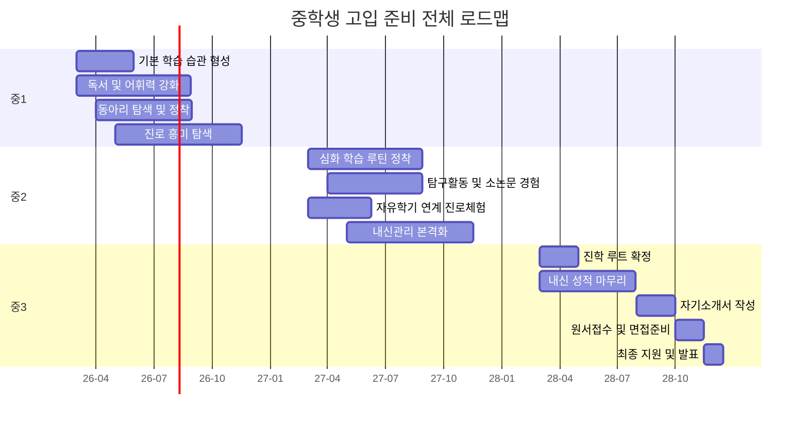
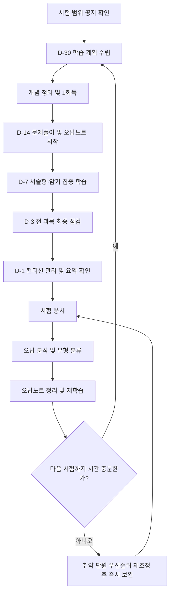
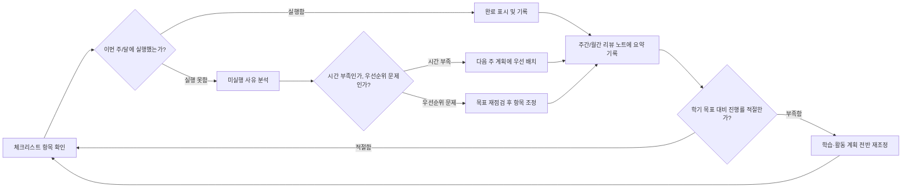

# 중학생 고입 준비 체크리스트

중학교 1학년부터 3학년까지, 고등학교 입학 전형을 준비하는 과정에서 반드시 점검해야 할 항목을 학년별·월별·과목별·영역별로 세분화하여 정리한 종합 체크리스트입니다. 매주 또는 매월 이 문서를 열어 항목을 하나씩 확인하면서 준비 상태를 스스로 점검해보세요.

## 이 문서 사용 안내

- 각 표의 항목은 체크박스 형태(`- [ ]`) 또는 표 형태로 정리되어 있습니다. 인쇄하거나 복사해서 학습 다이어리에 붙여두고 직접 체크해보세요.
- 학년별 체크리스트는 학업, 비교과, 진로탐색, 생활습관 네 영역으로 구성됩니다.
- 월별 체크리스트는 실제 학사일정과 연동해 "이번 달에 무엇을 해야 하는지"를 바로 확인할 수 있도록 구성했습니다.
- 체크리스트는 목표가 아니라 도구입니다. 항목을 다 채우는 것 자체보다, 왜 그 항목이 필요한지 이해하고 실행하는 것이 중요합니다.

---

## 전체 준비 로드맵 (간트차트)

중1부터 중3 2학기까지 큰 흐름을 한눈에 보는 로드맵입니다.

---

## 1. 학년별 상세 체크리스트

### 1-1. 중학교 1학년 체크리스트

중1은 고입 준비의 '기초 체력'을 만드는 시기입니다. 성적보다 학습 습관과 흥미 탐색에 집중하되, 기록을 시작하는 습관을 들여야 합니다.

#### 중1 학업 체크리스트

| 영역 | 체크 항목 | 목표 시기 |
| --- | --- | --- |
| 국어 | 교과서 지문 정독 및 요약 노트 작성 습관 들이기 | 1학기 |
| 국어 | 하루 20분 이상 다양한 장르 독서 | 연중 |
| 영어 | 중학 필수 어휘 800단어 암기 완료 | 1학기 |
| 영어 | 영어 듣기 매일 15분 습관화 | 연중 |
| 수학 | 연산 정확도 95% 이상 확보 | 1학기 |
| 수학 | 개념 노트(오답노트 전 단계) 작성 시작 | 2학기 |
| 사회 | 지도·통계 자료 읽는 법 익히기 | 2학기 |
| 과학 | 실험 관찰 기록지 작성 습관 | 연중 |
| 공통 | 자유학기(년)제 평가 방식 이해하기 | 1학기 |
| 공통 | 학습 플래너 작성 시작 | 3월 |
| 공통 | 시험 없는 학기 활용해 취약 과목 진단 | 1학기 |

#### 중1 비교과 체크리스트

- [ ] 관심 있는 동아리 2~3개 체험해보기
- [ ] 학급 임원 또는 소규모 역할 1회 이상 맡아보기
- [ ] 교내 대회(글쓰기, 그림, UCC 등) 1개 이상 참가
- [ ] 학교 도서관 이용 습관 만들기(월 2회 이상 대출)
- [ ] 봉사활동 첫 경험 쌓기(교내 봉사 포함)
- [ ] 자유학기제 프로그램(진로체험, 예술체육, 주제선택) 적극 참여
- [ ] 참여 활동에 대한 소감을 간단히 기록해두는 습관

#### 중1 진로탐색 체크리스트

| 항목 | 세부 내용 | 확인 |
| --- | --- | --- |
| 자유학기 진로체험 | 최소 2개 이상 직업 체험 프로그램 참여 | ☐ |
| 흥미 탐색 검사 | 커리어넷 등에서 간단 흥미검사 1회 진행 | ☐ |
| 진로 독서 | 직업/진로 관련 도서 2권 이상 읽기 | ☐ |
| 진로 인터뷰 | 주변 어른(부모, 친척 등) 직업 인터뷰 1회 | ☐ |
| 관심 분야 기록 | 흥미 있는 과목·활동을 노트에 기록 | ☐ |

#### 중1 생활습관 체크리스트

- [ ] 규칙적인 기상·취침 시간 만들기(주중 기준 고정)
- [ ] 스마트폰 사용 시간 스스로 기록해보기
- [ ] 주간 학습 계획표 작성 및 일요일 저녁 점검
- [ ] 하루 30분 이상 신체활동(운동) 습관화
- [ ] 가족과 학교생활 대화하는 시간 주 1회 이상 갖기
- [ ] 학용품·자료 정리정돈 습관 들이기

---

### 1-2. 중학교 2학년 체크리스트

중2는 학습량이 급격히 늘고 자유학기 이후 지필평가가 본격화되는 시기입니다. 심화 학습과 탐구 경험을 쌓으며 진로 방향을 좁혀가야 합니다.

#### 중2 학업 체크리스트

| 영역 | 체크 항목 | 목표 시기 |
| --- | --- | --- |
| 국어 | 문법 개념 체계적으로 정리(품사, 문장성분 등) | 1학기 |
| 국어 | 비문학 지문 주 3회 이상 풀이 | 연중 |
| 영어 | 중학 필수 문법(시제, 관계대명사 등) 완성 | 1학기 |
| 영어 | 원서 또는 영자 뉴스 읽기 시작 | 2학기 |
| 수학 | 방정식·함수 단원 심화 문제 풀이 | 1학기 |
| 수학 | 오답노트 정리 루틴 완성(주 1회 리뷰) | 연중 |
| 사회 | 시사 이슈와 교과 내용 연결해서 정리 | 2학기 |
| 과학 | 실험 보고서 형식 갖춰 작성 | 연중 |
| 공통 | 첫 지필평가 대비 시험 전략 수립 | 1학기 초 |
| 공통 | 과목별 취약 단원 표로 정리 | 학기말 |
| 공통 | 학습 시간 대비 성취도 점검(주간 리뷰) | 연중 |

#### 중2 비교과 체크리스트

- [ ] 동아리 활동 정착 및 역할 확대(부장·기획 등 시도)
- [ ] 탐구 보고서(소논문 형태) 1회 이상 작성
- [ ] 교내·교외 대회 관심 분야 1개 이상 참가
- [ ] 봉사활동 누적 시간 관리 시작(계획적으로 분산)
- [ ] 독서 기록장에 분야별 균형 잡힌 독서 목록 관리
- [ ] 진로 연계 동아리 또는 프로젝트 참여 시도

#### 중2 진로탐색 체크리스트

| 항목 | 세부 내용 | 확인 |
| --- | --- | --- |
| 적성검사 | 표준화된 적성검사(교육청 제공 등) 1회 이상 진행 | ☐ |
| 직업체험 | 관심 직업군 현장 체험 또는 특강 참여 | ☐ |
| 학교탐방 | 희망 고교 유형(일반고/특목고/자율고) 정보 조사 | ☐ |
| 진로 로드맵 | 희망 진로에 따른 대략적 고교 진학 방향 설정 | ☐ |
| 롤모델 조사 | 관심 분야 인물 사례 조사 및 정리 | ☐ |

#### 중2 생활습관 체크리스트

- [ ] 시험기간과 평상시 학습량을 구분한 루틴 정착
- [ ] 스마트폰/게임 시간 스스로 제한하는 규칙 세우기
- [ ] 수면 시간 최소 6~7시간 확보
- [ ] 스트레스 관리(운동, 취미) 방법 1개 이상 확보
- [ ] 학습 공간(책상, 자료) 정리 습관 유지
- [ ] 친구관계 갈등 발생 시 스스로 해결하거나 도움 요청하는 방법 익히기

---

### 1-3. 중학교 3학년 체크리스트

중3은 실제 진학 루트를 확정하고 내신을 마무리하며 원서 접수까지 이어지는 실전 시기입니다. 모든 준비가 결과로 수렴되는 학년입니다.

#### 중3 학업 체크리스트

| 영역 | 체크 항목 | 목표 시기 |
| --- | --- | --- |
| 국어 | 고교 대비 문학·독서 개념 총정리 | 1학기 |
| 국어 | 최근 3개년 기출 유형 문제 풀이 | 2학기 |
| 영어 | 고교 1학년 대비 어휘·문법 선행 점검 | 1학기 |
| 영어 | 듣기·말하기 실전 감각 유지(주 3회) | 연중 |
| 수학 | 도형·확률과 통계 등 마무리 단원 완성 | 1학기 |
| 수학 | 취약 단원 집중 보완 계획 실행 | 여름방학 |
| 사회·과학 | 전 범위 개념 총정리 노트 완성 | 2학기 초 |
| 공통 | 전 학년 내신 평균 최종 점검 | 1학기 말 |
| 공통 | 지원 전형별 내신 반영 방식 이해 | 1학기 |
| 공통 | 모의 면접·자기소개서 작성 연습 | 2학기 |

#### 중3 비교과 체크리스트

- [ ] 3년간 비교과 활동 기록 총정리(포트폴리오화)
- [ ] 마지막 학기 봉사활동 시간 채우기 확인
- [ ] 동아리 활동 마무리 및 성과 정리(발표, 결과물 등)
- [ ] 탐구활동 결과물 최종본 정리(보고서, 발표자료)
- [ ] 독서 활동 기록 최종 정리 및 진로 연계성 점검
- [ ] 생활기록부(학교생활기록부) 사전 열람 및 확인

#### 중3 진로탐색 체크리스트

| 항목 | 세부 내용 | 확인 |
| --- | --- | --- |
| 적성검사 | 최종 적성·흥미검사 결과와 3년간 흥미 변화 비교 | ☐ |
| 직업체험 | 희망 진로 관련 심화 체험(캠프, 특강 등) 참여 | ☐ |
| 학교탐방 | 희망 고교 설명회·입학 상담 참석 | ☐ |
| 진학 루트 확정 | 일반고/특목고/자사고/특성화고 중 최종 방향 결정 | ☐ |
| 원서 준비 | 지원 자격 요건(거주지, 성적 등) 최종 확인 | ☐ |

#### 중3 생활습관 체크리스트

- [ ] 시험기간 집중 학습 루틴 최적화(D-14 계획 실행)
- [ ] 면접·서류 준비 기간 컨디션 관리(수면, 식사)
- [ ] 스트레스와 불안 관리 방법 점검(상담 활용 포함)
- [ ] 원서 접수 일정 캘린더에 기록하고 알림 설정
- [ ] 가족과 진학 방향에 대한 최종 논의 완료
- [ ] 결과 발표 이후 대응 계획(합격/불합격 각각) 미리 생각해두기

---

## 2. 월별 실행 체크리스트

아래 표는 3월 신학기부터 다음 해 2월까지, 매달 중점적으로 확인해야 할 항목을 정리한 것입니다. 학년에 따라 강도는 다르지만 방향은 동일하게 적용할 수 있습니다.

| 월 | 학업 중점 | 비교과·진로 중점 | 생활 관리 중점 |
| --- | --- | --- | --- |
| 3월 | 새 학기 교과서 훑어보기, 학습 플래너 세팅 | 동아리·학급 활동 신청, 목표 설정 | 새 시간표 적응, 수면 리듬 정비 |
| 4월 | 1차 지필고사 대비 시작(D-30 체크) | 진로 흥미 탐색 활동 참여 | 스마트폰 사용 규칙 재점검 |
| 5월 | 1차 지필고사 응시 및 오답 정리 | 체험학습·현장학습 활동 기록 | 중간 점검 및 컨디션 관리 |
| 6월 | 오답 기반 취약 단원 보완 학습 | 독서활동 및 탐구주제 구상 | 여름방학 계획 초안 작성 |
| 7월 | 2차 지필고사 대비 시작(D-30 체크) | 동아리 프로젝트 중간 점검 | 여름철 생활 리듬 관리 |
| 8월 | 여름방학 심화·보완 학습 집중 | 진로체험, 캠프, 봉사활동 참여 | 방학 루틴 점검 및 2학기 준비 |
| 9월 | 2학기 학습 계획 수립, 선행 개념 점검 | 탐구 보고서·소논문 작성 시작 | 2학기 학습 환경 재정비 |
| 10월 | 2학기 1차 지필고사 대비(D-30 체크) | 교내 대회 및 발표 활동 참여 | 환절기 건강 관리 |
| 11월 | 지필고사 응시 및 오답 분석 | 봉사활동 시간 누적 점검 | 중3의 경우 원서 접수 준비 |
| 12월 | 학기말 성취도 점검, 부족 단원 정리 | 한 해 비교과 활동 기록 정리 | 겨울방학 계획 수립 |
| 1월 | 겨울방학 심화 학습, 다음 학년 선행 | 진로 로드맵 재점검 | 방학 생활습관 관리 |
| 2월 | 새 학년 대비 총정리 및 복습 | 새 학기 목표 설정, 포트폴리오 정리 | 새 학기 적응 준비(수면, 루틴) |

### 월별 체크리스트 세부 실행 가이드

- **3~5월(1학기 초·중반)**: 새 학년 적응과 함께 1차 지필고사를 대비하는 시기입니다. 이 시기에 학습 습관을 제대로 잡지 못하면 1년 전체 리듬이 흔들릴 수 있습니다.
- **6~8월(여름방학 포함)**: 1학기 성취도를 기반으로 취약점을 보완하고, 비교과 활동(체험, 봉사, 탐구)을 몰아서 진행하기 좋은 시기입니다.
- **9~11월(2학기 초·중반)**: 2학기 지필고사와 함께 중3의 경우 원서 준비가 본격화됩니다. 시간 관리가 가장 중요한 구간입니다.
- **12~2월(학기말·겨울방학)**: 한 해를 마무리하고 다음 학년을 준비하는 시기로, 기록 정리와 다음 단계 계획 수립이 핵심입니다.

---

## 3. 과목별 준비 체크리스트

### 3-1. 국어

| 체크 항목 | 세부 내용 |
| --- | --- |
| 어휘력 | 학년별 필수 한자어·고유어 정리 노트 작성 |
| 독해력 | 비문학(설명문, 논설문) 주 2회 이상 풀이 |
| 문학 | 갈래별(시, 소설, 수필, 극) 핵심 개념 정리 |
| 문법 | 음운, 품사, 문장 성분 등 체계적 정리 |
| 쓰기 | 요약문·감상문 작성 습관(주 1회 이상) |
| 시험 대비 | 교과서 본문 및 학습활동 완전 숙지 |

### 3-2. 영어

| 체크 항목 | 세부 내용 |
| --- | --- |
| 어휘 | 학년별 필수 어휘 목록 암기 및 주기적 복습 |
| 문법 | 시제, 조동사, 관계사 등 핵심 문법 정리 노트 |
| 듣기 | 매일 15~20분 듣기 연습(교과서 CD, 앱 등) |
| 말하기 | 기본 표현 암기 및 상황별 대화 연습 |
| 독해 | 지문 유형별(설명문, 이야기 등) 풀이 전략 습득 |
| 쓰기 | 짧은 문단 쓰기 연습(주 1회 이상) |

### 3-3. 수학

| 체크 항목 | 세부 내용 |
| --- | --- |
| 연산 | 기본 연산 정확도 및 속도 점검 |
| 개념 | 단원별 핵심 개념 노트 정리(공식·정의 포함) |
| 문제풀이 | 단원별 기본→응용→심화 순서로 학습 |
| 오답관리 | 오답노트 작성 및 주 1회 이상 복습 |
| 서술형 | 풀이 과정 서술 연습(채점 기준 이해) |
| 선행학습 | 다음 학기·학년 핵심 단원 예습(무리하지 않는 선에서) |

### 3-4. 사회

| 체크 항목 | 세부 내용 |
| --- | --- |
| 개념 정리 | 지리, 역사, 일반사회 영역별 핵심 개념 정리 |
| 자료 해석 | 지도, 그래프, 통계자료 읽는 연습 |
| 시사 연계 | 최근 사회 이슈와 교과 내용 연결해보기 |
| 암기 전략 | 연표, 용어를 마인드맵 등으로 구조화하여 암기 |
| 서술형 대비 | 개념 간 관계를 설명하는 연습(예: 원인-결과) |

### 3-5. 과학

| 체크 항목 | 세부 내용 |
| --- | --- |
| 개념 정리 | 물리, 화학, 생물, 지구과학 영역별 핵심 개념 정리 |
| 실험 이해 | 실험 목적, 과정, 결과 해석 연습 |
| 그래프 해석 | 실험 데이터 그래프화 및 해석 연습 |
| 계산 문제 | 공식 활용 계산 문제 반복 연습 |
| 탐구 보고서 | 실험 보고서 형식(가설-과정-결과-결론) 숙달 |

### 3-6. 기타(도덕, 정보, 예체능 등)

| 체크 항목 | 세부 내용 |
| --- | --- |
| 도덕 | 핵심 가치·개념 정리 및 사례 연결 학습 |
| 정보 | 기초 컴퓨팅 사고력, 코딩 기본 개념 이해 |
| 예체능 | 실기 평가 기준 확인 및 꾸준한 연습 |
| 한문/제2외국어 | 학교별 선택 과목 특성에 맞춘 기본기 확보 |
| 자유학기활동 | 주제선택, 예술체육, 진로탐색, 동아리 활동 균형 있게 참여 |

---

## 4. 내신 관리 체크리스트

### 4-1. 시험 전 체크리스트

#### D-30

- [ ] 시험 범위 공지 확인 및 과목별 학습 계획표 작성
- [ ] 교과서·필기 노트 전체 훑어보기 1회 완료
- [ ] 취약 단원 목록화

#### D-14

- [ ] 단원별 기본 문제 1회독 완료
- [ ] 오답노트 정리 시작
- [ ] 과목별 학습 시간 배분 재조정(취약 과목 비중 확대)

#### D-7

- [ ] 학교·학원 프린트, 부교재 문제 최소 2회독
- [ ] 서술형 대비 답안 작성 연습 시작
- [ ] 암기 과목(사회, 과학, 도덕 등) 집중 암기 구간 시작

#### D-3

- [ ] 전 과목 요약 노트 최종 점검
- [ ] 헷갈리는 개념·공식 마지막 정리
- [ ] 시험 시간표에 맞춘 과목별 리듬 조정(생활 패턴 시험 모드 전환)

#### D-1

- [ ] 다음날 시험 과목 최종 요약 확인(새로운 내용 학습 자제)
- [ ] 준비물(필기구, 학생증 등) 점검
- [ ] 충분한 수면 확보(무리한 밤샘 지양)

### 4-2. 시험 중 체크리스트 (답안 작성 전략)

| 전략 | 세부 내용 |
| --- | --- |
| 시간 배분 | 문제 수 대비 남은 시간을 초반에 계산하여 배분 |
| 문제 순서 | 아는 문제부터 먼저 풀고 어려운 문제는 표시 후 넘어가기 |
| 서술형 작성 | 채점 기준(키워드) 포함 여부 스스로 점검하며 작성 |
| 검토 시간 | 마지막 5~10분은 답안 검토 및 마킹 확인에 할애 |
| OMR/답안지 확인 | 문항 번호와 답안 번호 일치 여부 최종 확인 |
| 심리 관리 | 어려운 문제에 당황하지 않고 침착하게 다음 문제로 이동 |

### 4-3. 시험 후 체크리스트 (오답 분석 및 다음 시험 준비)

- [ ] 시험 종료 직후 기억나는 오답 유형 메모
- [ ] 채점 후 틀린 문제를 유형별로 분류(개념 부족/실수/시간 부족 등)
- [ ] 오답노트에 문제, 오답 이유, 올바른 풀이 순서로 정리
- [ ] 같은 유형의 유사 문제 추가로 풀어보며 재확인
- [ ] 이번 시험 준비 과정에서 잘한 점과 아쉬운 점 각각 정리
- [ ] 다음 시험까지의 학습 계획에 이번 오답 유형 반영

---

## 시험 대비 학습 사이클 (플로우차트)

---

## 5. 비교과 활동 체크리스트

### 5-1. 동아리 활동 체크리스트

| 체크 항목 | 세부 내용 |
| --- | --- |
| 동아리 선택 | 흥미와 진로 방향을 고려하여 동아리 선택 |
| 참여 태도 | 정기적 출석 및 적극적 역할 수행 |
| 역할 확대 | 학년이 올라갈수록 부장, 기획 등 책임 있는 역할 시도 |
| 활동 기록 | 매 활동 후 간단한 활동 일지 작성 |
| 결과물 정리 | 발표자료, 결과 보고서 등 산출물 보관 |
| 진로 연계성 | 동아리 활동과 희망 진로의 연결고리 정리 |

### 5-2. 봉사활동 체크리스트

- [ ] 학기 초 연간 봉사활동 계획 수립(시간, 종류 분배)
- [ ] 교내 봉사와 교외 봉사를 균형 있게 배치
- [ ] 봉사활동 확인서·인증서 빠짐없이 보관
- [ ] 특정 시기에 몰아서 하지 않고 분산해서 실행
- [ ] 봉사활동 후 느낀 점을 짧게라도 기록
- [ ] 진로와 연관된 봉사활동 기회 우선적으로 탐색
- [ ] 학기말 누적 시간 점검 및 부족분 보완 계획 수립

### 5-3. 독서활동 체크리스트

| 체크 항목 | 세부 내용 |
| --- | --- |
| 독서 계획 | 학기별 목표 독서량(권수) 설정 |
| 장르 균형 | 문학, 인문, 사회, 과학 등 다양한 분야 골고루 읽기 |
| 진로 연계 독서 | 희망 진로 관련 도서 학기당 1권 이상 포함 |
| 독서 기록 | 독서기록장에 줄거리, 느낀 점, 배운 점 정리 |
| 토론·발표 연계 | 읽은 책 내용을 친구·가족과 이야기 나누는 습관 |
| 심화 활동 | 독후감, 서평, 북리뷰 등 결과물로 남기기 |

### 5-4. 탐구활동 체크리스트

- [ ] 관심 주제 선정(교과 연계 또는 진로 연계)
- [ ] 탐구 질문(연구 질문) 구체화
- [ ] 자료 조사 및 참고문헌 정리
- [ ] 탐구 방법(실험, 설문, 문헌조사 등) 설계
- [ ] 결과 정리 및 보고서 작성(형식 갖추기)
- [ ] 발표 자료 제작 및 발표 연습
- [ ] 탐구 과정에서 배운 점과 한계점 정리

---

## 6. 진로탐색 체크리스트

### 6-1. 적성검사 관련 체크리스트

| 체크 항목 | 세부 내용 |
| --- | --- |
| 검사 실시 | 학교·교육청 제공 적성검사 학년별 1회 이상 실시 |
| 결과 분석 | 검사 결과 리포트 꼼꼼히 읽고 강점·약점 파악 |
| 흥미-적성 비교 | 흥미검사와 적성검사 결과 비교하여 공통점 찾기 |
| 변화 추적 | 학년별 검사 결과 변화 기록하여 비교 |
| 상담 연계 | 검사 결과를 바탕으로 진로상담교사와 상담 진행 |

### 6-2. 직업체험 관련 체크리스트

- [ ] 자유학기(년)제 진로체험 프로그램 적극 참여
- [ ] 관심 직업군 현장 방문 또는 직업인 특강 참여
- [ ] 진로체험 후 소감 및 배운 점 기록
- [ ] 체험을 통해 진로 관심도 변화 여부 점검
- [ ] 온라인 진로정보망(커리어넷 등) 직업정보 탐색
- [ ] 관심 직업의 필요 역량·자격 요건 조사

### 6-3. 학교탐방 관련 체크리스트

| 체크 항목 | 세부 내용 |
| --- | --- |
| 정보 수집 | 희망 고교 유형별(일반고/특목고/자율고/특성화고) 특징 조사 |
| 설명회 참석 | 희망 학교 입학설명회 또는 온라인 설명회 참석 |
| 학교 방문 | 가능한 경우 학교 축제·개방행사 등 방문 |
| 재학생 후기 | 재학생·졸업생 후기 및 학교생활 정보 수집 |
| 통학 여건 확인 | 거리, 통학시간, 기숙사 여부 등 현실 조건 점검 |
| 전형 요강 확인 | 지원 자격, 전형 일정, 반영 비율 등 세부 요강 확인 |

---

## 7. 고입 원서 접수 전 최종 체크리스트

원서 접수는 되돌리기 어려운 단계입니다. 접수 전 아래 항목을 반드시 순서대로 점검하세요.

| 순번 | 체크 항목 | 확인 |
| --- | --- | --- |
| 1 | 지원 자격(거주지, 성적 기준 등) 최종 확인 | ☐ |
| 2 | 지원 전형(일반전형/특별전형 등) 선택 확정 | ☐ |
| 3 | 학교생활기록부 최종 내용 확인 및 정정 요청 여부 점검 | ☐ |
| 4 | 자기소개서 작성 완료 및 표절·글자수 검사 | ☐ |
| 5 | 자기소개서 내용과 생활기록부 내용 일치 여부 확인 | ☐ |
| 6 | 필요 서류(주민등록등본, 성적증명서 등) 목록 확인 및 준비 | ☐ |
| 7 | 원서 접수 사이트 계정 생성 및 로그인 테스트 | ☐ |
| 8 | 원서 접수 기간 및 마감 시각 재확인(캘린더 등록) | ☐ |
| 9 | 접수비(전형료) 결제 수단 사전 준비 | ☐ |
| 10 | 면접 대상 여부 확인 및 면접 일정 별도 확인 | ☐ |
| 11 | 접수 완료 후 접수증(확인서) 출력 또는 저장 | ☐ |
| 12 | 접수 내용 최종 스크린샷 또는 캡처 보관 | ☐ |
| 13 | 발표일 및 결과 확인 방법 사전 파악 | ☐ |
| 14 | 불합격 시 대안 전형(추가모집 등) 사전 조사 | ☐ |

### 원서 접수 당일 유의사항

- [ ] 접수 마감 임박 시 서버 지연 가능성을 고려해 여유 있게 접수
- [ ] 입력 정보(이름, 생년월일, 연락처 등) 오타 여부 재확인
- [ ] 첨부 파일 형식(용량, 확장자) 요건 충족 여부 확인
- [ ] 접수 완료 메시지 또는 이메일 확인
- [ ] 문제 발생 시 학교 행정실 또는 접수처에 즉시 문의

---

## 체크리스트 검토 프로세스 (플로우차트)

체크리스트를 단순히 채우는 것에서 그치지 않고, 주기적으로 검토하고 보완하는 과정이 중요합니다.

---

## 8. 체크리스트 활용법

### 8-1. 주간 활용법

1. 매주 일요일 저녁, 이번 주에 해당하는 학업·비교과·생활습관 체크리스트 항목을 훑어봅니다.
2. 이번 주 실행 가능한 항목 3~5개를 우선순위로 골라 표시합니다.
3. 한 주가 끝나면 완료 여부를 체크하고, 미완료 항목은 원인을 짧게 메모합니다.
4. 매주 같은 항목이 반복적으로 미완료된다면 계획 자체를 조정합니다(양을 줄이거나 시간대를 바꾸는 등).

### 8-2. 월간 활용법

1. 매달 마지막 주, 해당 월의 월별 실행 체크리스트를 전체적으로 점검합니다.
2. 학업·비교과·생활 세 영역에서 각각 완료율을 대략적으로 계산해봅니다(예: 10개 중 7개 완료).
3. 완료율이 낮은 영역은 다음 달 계획에서 비중을 높입니다.
4. 학년별 체크리스트와 비교하여 이번 학년에서 놓치고 있는 항목이 없는지 확인합니다.

### 8-3. 학기·학년 단위 활용법

- 학기 초에는 학년별 체크리스트 전체를 한 번 읽고 이번 학기 목표를 구체적으로 세웁니다.
- 학기 말에는 완료한 항목과 미완료 항목을 정리하여 다음 학기 계획에 반영합니다.
- 학년이 바뀔 때는 이전 학년 체크리스트에서 남은 항목이 있는지 반드시 확인하고 이월합니다.
- 중3 2학기부터는 매주 단위로 점검 주기를 좁혀 원서 접수까지 촘촘하게 관리합니다.

### 8-4. 체크리스트 활용 시 주의할 점

- 체크리스트 항목을 기계적으로 채우는 데만 집중하지 않습니다. 항목 뒤에 있는 목적을 이해하고 실행해야 실제 역량으로 이어집니다.
- 모든 항목을 완벽하게 채우려 하기보다, 자신의 상황과 목표에 맞게 우선순위를 조정합니다.
- 체크리스트는 부모님, 담임교사, 진로상담교사와 함께 공유하며 점검하면 더 효과적입니다.
- 지나치게 많은 활동을 벌이기보다, 몇 가지 활동을 꾸준히 이어가며 깊이를 더하는 것이 더 좋은 결과로 이어집니다.
- 체크리스트에 없는 개인적 상황(건강, 가정환경 등)이 있다면 무리하게 항목을 따라가지 말고 현실적으로 조정합니다.

---

## 마무리: 체크리스트를 관통하는 세 가지 원칙

1. **일관성**: 짧은 기간 몰아서 하는 활동보다, 중1부터 중3까지 꾸준히 이어지는 활동과 기록이 더 큰 힘을 발휘합니다.
2. **연결성**: 학업, 비교과, 진로탐색, 생활습관은 서로 분리된 영역이 아니라 하나로 연결되어야 합니다. 활동의 개수보다 활동 간의 연결고리를 우선적으로 고려하세요.
3. **기록과 성찰**: 무엇을 했는지보다 무엇을 배우고 느꼈는지를 기록하는 습관이, 이후 자기소개서와 면접에서 스스로를 설명할 수 있는 가장 큰 자산이 됩니다.
