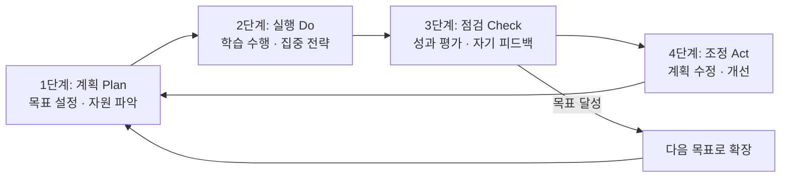
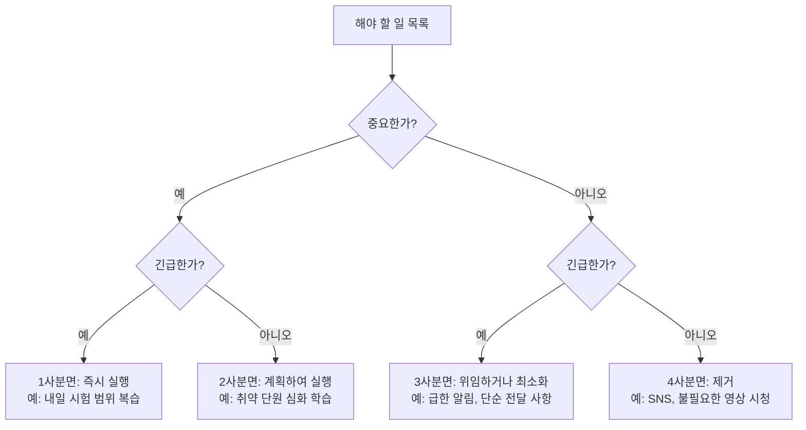
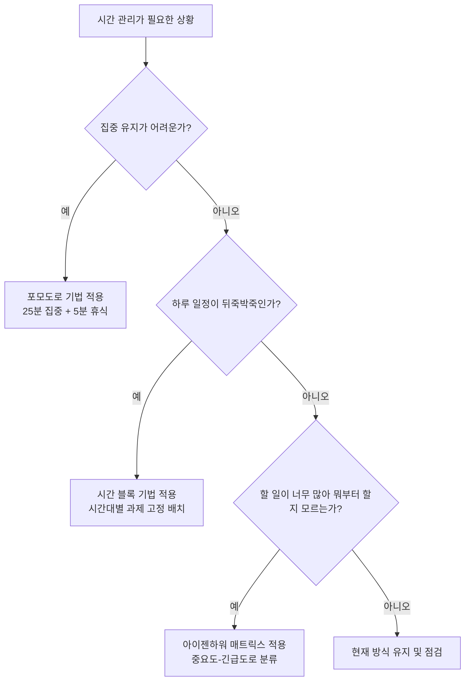
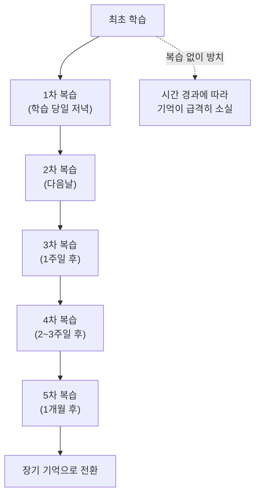
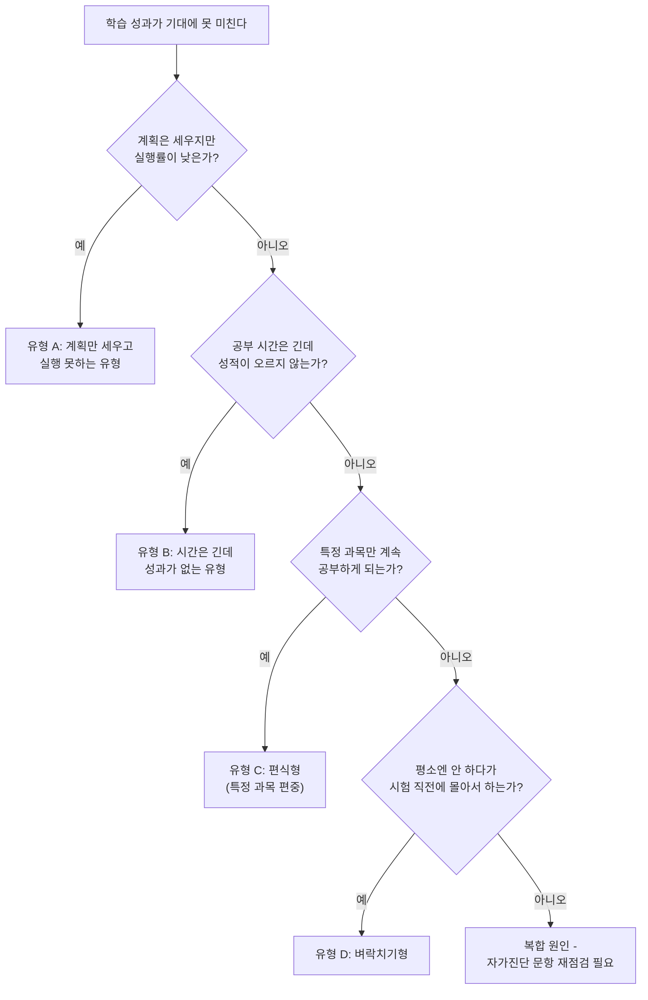

# 자기주도 학습 설계 가이드

스스로 목표를 세우고, 실행하고, 점검하고, 개선하는 힘은 특목고·자사고 입시는 물론 이후 대학 입시와 인생 전반의 학습 역량을 결정합니다. 이 문서는 자기주도 학습의 개념부터 실전 계획법, 시간 관리, 집중력 전략, 복습법, 자가진단, 실패 패턴 극복법, 디지털 도구까지 한 번에 정리한 실행 가이드입니다.

---

## 1. 자기주도 학습이란?

### 1-1. 정의와 개념

자기주도 학습(Self-Directed Learning, SDL)이란 학습자가 스스로 학습 목표를 설정하고, 학습에 필요한 자원을 파악하며, 적절한 학습 전략을 선택하여 실행하고, 그 결과를 스스로 평가하여 다음 학습에 반영하는 일련의 순환적 학습 과정을 의미합니다. 단순히 "혼자 공부하는 것"이 아니라, 학습의 전 과정(계획-실행-점검-조정)에 대한 주도권을 학습자 자신이 갖는다는 점이 핵심입니다.

자기주도 학습의 구성 요소는 다음과 같이 정리할 수 있습니다.

- **목표 설정 능력**: 장기 목표를 구체적이고 측정 가능한 단기 목표로 쪼개는 능력
- **자원 탐색 능력**: 목표 달성에 필요한 교재, 강의, 사람, 시간을 파악하고 확보하는 능력
- **실행 관리 능력**: 계획한 학습을 실제로 수행하고 집중을 유지하는 능력
- **메타인지 능력**: 자신의 학습 상태를 객관적으로 관찰하고 평가하는 능력
- **조정 능력**: 평가 결과를 바탕으로 계획과 전략을 수정하는 능력

이 다섯 가지 능력은 독립적이지 않고 서로 맞물려 순환합니다. 목표가 없으면 점검할 기준이 없고, 점검이 없으면 조정할 근거가 없습니다. 자기주도 학습은 이 순환 고리를 학습자 스스로 돌릴 수 있는 상태를 말합니다.

### 1-2. 왜 중요한가

**입시에서의 중요성**

한국의 입시 제도는 갈수록 자기주도성을 직접적으로 평가하는 방향으로 변화하고 있습니다. 학생부종합전형(학종)에서는 세부능력 및 특기사항(세특)에 학생이 스스로 질문을 던지고 탐구한 과정이 드러나야 높은 평가를 받습니다. 단순히 학원에서 시킨 대로 문제를 푼 학생과, 스스로 궁금증을 해결하기 위해 추가 자료를 찾아본 학생은 같은 성적이라도 기록의 질이 다릅니다.

또한 고등학교 진학 이후에는 학원 의존도가 높은 학생일수록 학습량 대비 성적 상승 폭이 둔화되는 경향이 관찰됩니다. 이는 고등학교 내신과 수능이 요구하는 사고력의 깊이가 단순 문제풀이 반복으로는 따라잡기 어려운 수준으로 올라가기 때문입니다. 자기주도 학습 역량을 중학교 시기에 미리 갖춘 학생은 고등학교 진학 후 학습량이 급증해도 무너지지 않고 자신만의 리듬을 유지할 수 있습니다.

**특목고·자사고 면접에서의 중요성**

과학고, 영재학교, 외고, 국제고, 자사고의 면접에서는 거의 예외 없이 "어떻게 공부해왔는가", "어려운 문제를 만났을 때 어떻게 해결했는가", "스스로 탐구한 경험이 있는가"를 묻습니다. 이는 면접관이 학생의 자기주도 학습 역량을 확인하려는 목적입니다. 예를 들어 다음과 같은 질문이 반복적으로 등장합니다.

- "본인만의 공부 방법이 있다면 소개해 주세요."
- "수업 시간에 배운 내용 중 스스로 더 찾아본 것이 있나요?"
- "계획했던 학습이 뜻대로 되지 않았을 때 어떻게 극복했나요?"

이런 질문에 구체적인 사례와 과정을 답할 수 있으려면, 실제로 자기주도 학습을 실천한 경험이 축적되어 있어야 합니다. 이 가이드에서 소개하는 학습 일지, 자가진단, PDCA 사이클을 실제로 운영해두면 면접에서 활용할 수 있는 생생한 사례가 자연스럽게 쌓입니다.

### 1-3. 자기주도 학습 vs 일반 학습 비교

| 구분 | 일반(수동적) 학습 | 자기주도 학습 |
| --- | --- | --- |
| 목표 설정 주체 | 부모, 학원, 학교가 정해줌 | 학습자 스스로 설정 |
| 학습 계획 | 정해진 커리큘럼을 따라감 | 자신의 수준과 목표에 맞춰 설계 |
| 학습 동기 | 외적 동기(성적, 압박, 보상) 중심 | 내적 동기(호기심, 성취감) 중심 |
| 문제 해결 방식 | 질문을 받으면 답을 알려줌 | 스스로 답을 찾는 과정을 우선 시도 |
| 학습 속도 | 커리큘럼의 진도에 맞춤 | 자신의 이해 속도에 맞춤 |
| 평가와 피드백 | 시험 점수로만 확인 | 스스로 점검하고 피드백 기록 |
| 실패에 대한 태도 | 회피하거나 좌절 | 원인을 분석하고 전략을 수정 |
| 장기적 효과 | 관리가 사라지면 학습도 멈춤 | 관리 없이도 학습이 지속됨 |
| 입시 서류상 특징 | 활동 기록이 평범하고 유사함 | 탐구 과정과 개인 서사가 뚜렷함 |

일반 학습이 나쁜 것은 아닙니다. 초기 학습 습관을 잡을 때는 외부의 관리가 필요한 경우가 많습니다. 다만 중학교 후반부터는 점진적으로 자기주도의 비중을 늘려가는 것이 장기적인 학습 성과와 입시 경쟁력 모두에 유리합니다.

---

## 2. 자기주도 학습 4단계 모델 (PDCA)

자기주도 학습은 품질 관리 이론에서 널리 쓰이는 PDCA(Plan-Do-Check-Act) 순환 모델을 학습에 적용하여 이해할 수 있습니다. 아래 다이어그램은 4단계가 어떻게 순환하는지를 보여줍니다.

### 2-1. 1단계: 계획 (Plan)

계획 단계는 자기주도 학습의 출발점이자 가장 자주 소홀히 다뤄지는 단계입니다. 좋은 계획은 다음 세 가지 요소를 갖춰야 합니다.

**목표 설정**

목표는 반드시 구체적이고 측정 가능해야 합니다. "수학을 잘하고 싶다"는 목표가 아니라 "이번 달 안에 수학 2단원 개념 정리를 끝내고 기출문제 정답률 80% 달성"처럼 기간, 범위, 성공 기준이 명시되어야 실행과 점검이 가능합니다. 이를 흔히 SMART 원칙이라 부릅니다.

| SMART 요소 | 의미 | 예시 |
| --- | --- | --- |
| Specific (구체적) | 무엇을 할지 명확히 | "수학 공부"가 아니라 "이차함수 단원 개념+유형" |
| Measurable (측정가능) | 성공 여부를 숫자로 확인 | "기출문제 20문제 중 16문제 이상 정답" |
| Achievable (달성가능) | 현실적인 범위 | 하루 3시간 학습 가능한 학생이 6시간 계획을 짜지 않음 |
| Relevant (관련성) | 상위 목표와 연결 | 중간고사 목표 점수와 연결된 단원 선택 |
| Time-bound (기한) | 마감 기한 명시 | "2주 안에", "이번 달 말까지" |

**자원 파악**

목표를 세운 뒤에는 그것을 달성하는 데 필요한 자원을 점검해야 합니다. 자원에는 교재와 문제집 같은 학습 자료, 인터넷 강의나 학교 선생님 같은 도움을 요청할 대상, 그리고 확보 가능한 시간이 포함됩니다. 자원 파악 없이 세운 계획은 실행 단계에서 "교재가 없다", "시간이 부족하다"는 이유로 무너지기 쉽습니다.

- 학습 자료: 교과서, 문제집, 인강, 오답노트 등 이미 가지고 있는 것과 새로 구해야 하는 것 구분
- 인적 자원: 막힐 때 질문할 수 있는 선생님, 친구, 온라인 커뮤니티
- 시간 자원: 실제로 학습에 쓸 수 있는 시간을 요일별로 계산 (등하교, 학원, 식사, 수면 시간을 뺀 순수 가용 시간)

### 2-2. 2단계: 실행 (Do)

계획을 세운 뒤에는 실제로 학습을 수행하는 단계로 넘어갑니다. 실행 단계에서 중요한 것은 계획을 그대로 따르는 것보다 "집중해서 실행하는 것"입니다.

**학습 수행 원칙**

- 계획한 시간에는 다른 일을 하지 않고 해당 과목/단원에만 집중합니다.
- 이해가 안 되는 부분은 표시만 해두고 넘어간 뒤, 정해진 복습 시간에 몰아서 해결합니다.
- 학습 중간에 스마트폰을 확인하지 않도록 물리적으로 차단합니다.
- 한 번에 너무 긴 시간을 계획하기보다, 집중 가능한 단위(25~50분)로 쪼개어 실행합니다.

**집중 전략**

집중력을 유지하기 위한 전략은 5장에서 자세히 다루지만, 실행 단계의 핵심만 요약하면 다음과 같습니다.

1. 시작 전 오늘 할 일의 범위를 눈에 보이는 곳에 적어둔다.
2. 첫 5분은 가장 쉬운 것부터 시작해 뇌를 학습 모드로 전환한다.
3. 타이머를 활용해 집중 구간과 휴식 구간을 명확히 나눈다.
4. 막히는 문제는 시간을 정해두고(예: 5분) 그 이상 붙잡지 않는다.

### 2-3. 3단계: 점검 (Check)

점검 단계는 계획한 목표를 실제로 달성했는지 확인하고, 그 과정에서 무엇이 잘 되었고 무엇이 부족했는지 스스로 평가하는 단계입니다. 이 단계가 없으면 같은 실수를 반복하게 됩니다.

**성과 평가 기준**

| 평가 항목 | 확인 질문 | 기록 방법 |
| --- | --- | --- |
| 목표 달성률 | 계획한 분량을 얼마나 끝냈는가 | 퍼센트(%)로 기록 |
| 이해도 | 배운 내용을 설명할 수 있는가 | 스스로 설명해보고 막히는 부분 표시 |
| 오답 원인 | 틀린 문제의 원인이 무엇인가 | 개념 부족/실수/시간 부족으로 분류 |
| 시간 활용 | 계획한 시간과 실제 소요 시간의 차이 | 분 단위로 비교 기록 |
| 집중도 | 학습 중 딴짓한 횟수와 시간 | 체크리스트로 기록 |

**자기 피드백 작성법**

점검이 끝나면 짧더라도 반드시 글로 기록을 남깁니다. "오늘 계획한 이차함수 유형 20문제 중 15문제를 풀었고, 못 푼 5문제는 시간이 부족해서가 아니라 개념 자체를 헷갈려서였다. 내일은 개념 복습을 10분 먼저 하고 문제를 풀어야겠다"처럼 원인과 다음 행동까지 연결되는 기록이 좋은 피드백입니다.

### 2-4. 4단계: 조정 (Act)

점검에서 드러난 문제를 바탕으로 계획과 전략을 수정하는 단계입니다. 조정은 크게 세 가지 방향으로 이뤄집니다.

- **계획 수정**: 목표량이 과도했다면 줄이고, 너무 여유로웠다면 늘립니다.
- **전략 수정**: 암기 위주 과목에 문제풀이 전략을 쓰고 있었다면 반복 암송이나 카드 학습으로 바꿉니다.
- **환경 수정**: 특정 시간대에 집중이 잘 안 됐다면 학습 시간대 자체를 옮깁니다.

조정한 내용은 다음 계획(Plan) 단계에 그대로 반영되어야 하며, 이렇게 4단계가 순환하면서 학습자는 점점 더 자신에게 맞는 학습 방식을 정교하게 다듬어가게 됩니다. PDCA 사이클은 한 번으로 끝나는 것이 아니라 매일, 매주, 매월 단위로 반복되어야 진짜 효과가 나타납니다.

---

## 3. 학습 계획 세우는 법

계획은 시간 단위에 따라 연간, 월간, 주간, 일일 계획으로 나뉘며, 상위 계획이 하위 계획의 방향을 정하고 하위 계획의 실행 결과가 상위 계획을 점검하는 구조로 연결되어야 합니다.

### 3-1. 연간 계획 세우기

연간 계획은 큰 방향을 잡는 지도 역할을 합니다. 학기별, 분기별 핵심 목표와 주요 일정(시험, 대회, 입시 전형 일정)을 먼저 배치한 뒤 세부 계획을 채워 넣습니다.

| 시기 | 핵심 목표 | 주요 일정 | 중점 과목/영역 | 점검 기준 |
| --- | --- | --- | --- | --- |
| 1분기 (3~5월) | 기초 개념 완성 | 1학기 중간고사 | 국/영/수 기본기 | 중간고사 성적 |
| 2분기 (6~8월) | 심화 및 여름방학 보충 | 1학기 기말고사, 여름방학 | 취약 단원 집중 | 기말고사 성적, 방학 계획 달성률 |
| 3분기 (9~11월) | 응용력 강화 | 2학기 중간고사 | 탐구 활동, 오답 정리 | 중간고사 성적, 활동 기록 |
| 4분기 (12~2월) | 종합 점검 및 다음 학년 준비 | 2학기 기말고사, 겨울방학 | 총정리, 선행 준비 | 기말고사 성적, 자가진단 결과 |

연간 계획을 세울 때는 시험 일정을 먼저 캘린더에 표시하고, 시험 6~8주 전부터 역산하여 학습 범위를 배분하는 방식이 효과적입니다.

### 3-2. 월간 계획 세우기

월간 계획은 연간 목표를 실행 가능한 단위로 쪼갠 것입니다. 매월 말에는 반드시 이번 달 계획과 실제 실행을 비교하는 점검 시간을 가져야 합니다.

| 주차 | 과목 | 이번 달 목표 | 세부 실행 계획 | 달성 여부 | 비고 |
| --- | --- | --- | --- | --- | --- |
| 1주차 | 수학 | 2단원 개념 완성 | 개념서 1회독 + 기본 문제 | | |
| 2주차 | 수학 | 2단원 유형 연습 | 유형서 1회독 | | |
| 3주차 | 영어 | 단어 500개 암기 | 하루 30개씩 암기, 주 3회 테스트 | | |
| 4주차 | 국어 | 문학 갈래별 정리 | 개념 정리 노트 작성 | | |
| 전체 | 공통 | 오답노트 누적 | 매일 오답 3개 이상 기록 | | |

### 3-3. 주간 계획 세우기

주간 계획은 실제 하루하루의 학습을 배치하는 가장 실용적인 단위입니다. 요일별로 시간대를 나눠 과목을 배치하면 실행률이 크게 높아집니다.

| 시간대 | 월 | 화 | 수 | 목 | 금 | 토 | 일 |
| --- | --- | --- | --- | --- | --- | --- | --- |
| 06:30~07:30 | 영단어 암기 | 영단어 암기 | 영단어 암기 | 영단어 암기 | 영단어 암기 | 주간 단어 총복습 | 휴식 |
| 방과후 16:00~18:00 | 수학 문제풀이 | 국어 지문 분석 | 수학 문제풀이 | 과학 개념 정리 | 자유 보충 | 주간 오답 정리 | 다음 주 계획 |
| 저녁 20:00~22:00 | 학교 숙제 | 학교 숙제 | 학교 숙제 | 학교 숙제 | 이번 주 복습 | 심화 문제 | 독서/휴식 |
| 취침 전 15분 | 하루 점검 일지 | 하루 점검 일지 | 하루 점검 일지 | 하루 점검 일지 | 하루 점검 일지 | 주간 점검 일지 | 다음 주 목표 작성 |

### 3-4. 일일 계획 세우기

일일 계획은 시간 단위(또는 30분 단위)로 세분화하여 실제로 몇 시에 무엇을 할지 구체적으로 정합니다.

| 시간 | 계획 | 실제 수행 | 집중도(1~5) | 메모 |
| --- | --- | --- | --- | --- |
| 06:30~07:00 | 기상 및 준비 | | | |
| 07:00~07:30 | 영단어 30개 암기 | | | |
| 08:00~08:50 | (학교) 1교시 | | | |
| ... | (학교 수업 시간) | | | |
| 16:00~16:50 | 수학 개념 복습 | | | |
| 17:00~17:50 | 수학 문제풀이 | | | |
| 18:00~18:30 | 저녁 식사 | | | |
| 19:00~19:50 | 국어 지문 분석 | | | |
| 20:00~20:50 | 과학 오답 정리 | | | |
| 21:00~21:30 | 하루 점검 일지 작성 | | | |
| 21:30~22:30 | 자유 시간/휴식 | | | |
| 22:30 | 취침 준비 | | | |

일일 계획표는 아침에 작성하고 저녁에 "실제 수행"과 "집중도" 칸을 채워 넣는 방식으로 운영하면, 자연스럽게 하루 단위의 점검(Check)까지 함께 이뤄집니다.

---

## 4. 시간 관리 기법

### 4-1. 포모도로 기법

포모도로 기법은 25분 집중 학습과 5분 휴식을 한 세트로 반복하고, 4세트(약 2시간)마다 15~30분의 긴 휴식을 취하는 시간 관리법입니다. 짧은 집중 구간을 반복하면 피로 누적을 막으면서도 몰입도를 유지할 수 있습니다.

**실천법**

1. 오늘 할 일 목록을 작성한다.
2. 타이머를 25분으로 설정하고 한 가지 과제에만 집중한다.
3. 타이머가 울리면 즉시 멈추고 5분간 휴식한다(스트레칭, 물 마시기 등).
4. 이 과정을 4회 반복한 뒤 15~30분의 긴 휴식을 취한다.
5. 방해 요소(전화, 메시지 등)가 생기면 메모만 해두고 즉시 처리하지 않는다.

**변형**

- 50-10 변형: 집중력이 높은 학습자는 50분 집중 + 10분 휴식으로 늘려서 운영
- 15-5 변형: 집중이 어려운 초보자는 15분 집중 + 5분 휴식으로 짧게 시작
- 과목별 변형: 암기 과목은 25분, 수학처럼 몰입이 필요한 과목은 50분으로 과목에 따라 다르게 적용

### 4-2. 시간 블록 기법 (Time Blocking)

시간 블록 기법은 하루를 특정 활동에 전용된 블록으로 미리 나눠두는 방법입니다. 포모도로가 "집중-휴식의 리듬"에 초점을 둔다면, 시간 블록은 "무엇을 언제 할지"를 미리 확정한다는 점에서 다릅니다. 3장의 일일 계획표가 바로 시간 블록 기법의 실제 적용 예시입니다.

시간 블록을 만들 때는 다음 원칙을 지키는 것이 좋습니다.

- 고정 일정(학교, 학원, 식사, 수면)을 먼저 캘린더에 배치한다.
- 남은 시간을 과목별로 블록화하여 배분한다.
- 하나의 블록에는 하나의 과목/과제만 배정한다(멀티태스킹 금지).
- 여유 블록(버퍼 타임)을 하루 30분 이상 남겨 돌발 상황에 대비한다.

### 4-3. 우선순위 매트릭스 (아이젠하워 매트릭스)

해야 할 일이 많을 때는 "중요도"와 "긴급도"라는 두 축으로 나눠 우선순위를 정하는 아이젠하워 매트릭스가 유용합니다.

| 사분면 | 특징 | 학습 예시 | 처리 원칙 |
| --- | --- | --- | --- |
| 1사분면 (중요+긴급) | 즉시 처리해야 할 일 | 내일 시험 범위, 마감 임박 과제 | 최우선으로 지금 바로 실행 |
| 2사분면 (중요+비긴급) | 장기적으로 가장 가치 있는 일 | 취약 단원 심화, 독서, 진로 탐구 | 매일 일정 시간을 미리 확보 |
| 3사분면 (비중요+긴급) | 급해 보이지만 가치는 낮은 일 | 친구의 급한 요청, 단순 알림 대응 | 짧게 처리하거나 뒤로 미룸 |
| 4사분면 (비중요+비긴급) | 시간만 소모하는 일 | SNS, 불필요한 게임/영상 | 학습 시간에서 과감히 제거 |

자기주도 학습자가 가장 신경 써야 할 영역은 2사분면입니다. 급하지 않기 때문에 미루기 쉽지만, 장기적인 실력 차이를 만드는 것은 대부분 2사분면에 해당하는 활동입니다.

### 4-4. 시간 관리 기법 비교

| 기법 | 장점 | 단점 | 적합한 학생 유형 |
| --- | --- | --- | --- |
| 포모도로 기법 | 집중-휴식 리듬으로 피로 감소, 시작 장벽이 낮음 | 몰입이 필요한 긴 문제풀이에는 끊김이 방해될 수 있음 | 집중 지속 시간이 짧고 쉽게 산만해지는 학생 |
| 시간 블록 기법 | 하루 전체 계획이 명확, 시간 낭비를 줄임 | 계획대로 안 될 경우 스트레스, 유연성이 낮음 | 일정 관리가 안 되고 시간을 흘려보내는 학생 |
| 아이젠하워 매트릭스 | 우선순위가 명확해져 중요한 일에 집중 가능 | 매트릭스 분류 자체에 시간이 걸릴 수 있음 | 할 일은 많은데 무엇부터 해야 할지 모르는 학생 |

세 기법은 서로 배타적이지 않습니다. 아이젠하워 매트릭스로 우선순위를 정하고, 시간 블록으로 하루 일정에 배치한 뒤, 포모도로 기법으로 실제 집중 실행을 관리하는 방식으로 함께 사용하는 것이 가장 효과적입니다.

---

## 5. 집중력 향상 전략

### 5-1. 학습 환경 설정

집중력은 의지력만으로 유지되지 않습니다. 환경을 집중하기 쉽게 바꿔두면 의지력 소모를 크게 줄일 수 있습니다.

**책상 정리**

- 책상 위에는 지금 공부할 과목의 교재와 필기구만 남기고 나머지는 치웁니다.
- 다음 학습 도구를 미리 꺼내두면 전환 시간이 줄어듭니다.
- 책상 서랍이나 주변에 시선을 끄는 물건(피규어, 만화책 등)을 두지 않습니다.

**조명**

- 자연광이나 백색광(주광색) 스탠드를 사용하면 각성 상태 유지에 도움이 됩니다.
- 조명이 너무 어두우면 눈의 피로가 빨리 오고, 너무 노란빛이면 졸음을 유발할 수 있습니다.
- 스탠드는 그림자가 지지 않도록 필기하는 손의 반대쪽에 배치합니다.

**소음 관리**

- 완전한 무음보다 백색소음(카페소음, 빗소리 등)이 집중에 도움이 되는 학생도 있으므로 자신에게 맞는 방식을 실험해봅니다.
- 가족과의 소음 충돌이 있다면 미리 학습 시간을 공유하여 협조를 구합니다.
- 가사가 있는 음악은 언어 처리 영역과 충돌하여 집중을 방해할 수 있으므로 암기·독해 과목에는 피하는 것이 좋습니다.

### 5-2. 방해 요소 차단

**스마트폰**

- 학습 시간에는 스마트폰을 눈에 보이지 않는 다른 방에 두거나, 최소한 화면이 보이지 않도록 뒤집어 둡니다.
- 스크린타임/디지털 웰빙 기능을 이용해 학습 시간대에는 SNS, 게임 앱 접근을 차단합니다.
- 급한 연락이 필요한 경우를 대비해 부모님께 학습 시간대를 미리 공유해둡니다.

**SNS**

- SNS 확인은 하루 정해진 시간(예: 점심시간, 저녁 식사 후)에만 하도록 규칙을 정합니다.
- 알림을 꺼두어 "확인하고 싶은 충동" 자체가 발생하는 빈도를 줄입니다.
- 학습 중 SNS가 생각날 때마다 메모지에 기록만 해두고, 정해진 시간에 몰아서 확인합니다.

### 5-3. 루틴 만들기

루틴은 매번 의식적으로 결정하지 않아도 자동으로 학습 모드에 진입하게 해주는 습관의 힘입니다.

**공부 전 루틴**

- 책상 정리 → 오늘 할 일 목록 확인 → 스마트폰 치우기 → 타이머 설정의 순서로 5분 이내에 끝나는 짧은 루틴을 만듭니다.
- 같은 순서를 매일 반복하면 뇌가 "이 행동을 하면 곧 공부가 시작된다"는 신호로 학습하게 됩니다.

**공부 중 루틴**

- 포모도로 세트가 끝날 때마다 짧게 스트레칭하고 물을 마십니다.
- 막히는 문제는 별도의 색으로 표시만 하고 넘어가는 규칙을 일관되게 지킵니다.

**공부 후 루틴**

- 하루 학습이 끝나면 반드시 학습 일지를 작성합니다(7장 참고).
- 다음 날 할 일을 미리 한 줄로 적어두면 다음 날 시작이 훨씬 수월해집니다.
- 책상을 정리하고 다음 학습 도구를 미리 세팅해두어 다음 시작을 쉽게 만듭니다.

---

## 6. 효과적인 복습 전략

### 6-1. 에빙하우스 망각곡선 설명과 활용법

독일의 심리학자 헤르만 에빙하우스는 학습한 내용이 시간이 지남에 따라 급격히 잊혀진다는 사실을 실험으로 밝혔습니다. 그의 연구에 따르면 학습 직후부터 잊혀지는 속도가 가장 빠르고, 시간이 지날수록 잊혀지는 속도는 완만해집니다. 별도의 복습 없이는 학습 후 하루 만에 상당 부분의 내용이 기억에서 사라지며, 시간이 지날수록 남은 기억의 비율은 점점 낮아집니다.

이 곡선의 핵심 시사점은 "복습을 반복할수록 망각 속도가 느려진다"는 것입니다. 즉, 첫 학습 직후 짧은 간격으로 복습을 하고, 이후 점점 간격을 늘려가며 복습하면 같은 내용을 더 오래, 더 적은 노력으로 기억할 수 있습니다.

**활용법**

- 학습 직후: 배운 내용을 5분 내로 스스로 요약해본다(당일 복습).
- 학습 다음날: 전날 배운 내용을 다시 한 번 훑는다.
- 1주일 후: 그 주에 배운 내용을 종합적으로 복습한다.
- 1개월 후: 월간 총정리 형태로 복습한다.
- 시험 직전: 그동안 누적된 오답노트와 요약 노트를 집중적으로 재복습한다.

### 6-2. 간격 반복 학습법 (Spaced Repetition)

간격 반복 학습법은 망각곡선의 원리를 실전에 적용한 방법으로, 복습 간격을 점점 넓혀가며 최소한의 반복으로 장기 기억을 만드는 전략입니다. 특히 영단어, 한자, 화학식, 역사 연표처럼 암기 비중이 높은 과목에 효과적입니다.

**실천 방식**

1. 새로운 내용을 학습한 카드/항목을 "오늘 학습" 그룹에 넣는다.
2. 다음날 다시 확인하여 맞으면 "3일 후" 그룹으로, 틀리면 다시 "오늘 학습" 그룹으로 되돌린다.
3. 3일 후 확인하여 맞으면 "1주일 후" 그룹으로, 틀리면 "다음날" 그룹으로 되돌린다.
4. 이 과정을 반복하며 맞을 때마다 간격을 늘리고, 틀릴 때마다 간격을 줄인다.

이 방식은 손으로 관리하기 번거로울 수 있어, 10장에서 소개하는 디지털 암기 카드 앱을 활용하면 자동으로 간격을 계산해주어 효율적입니다.

### 6-3. 복습 스케줄 템플릿

| 학습일 | 1차 복습 (당일) | 2차 복습 (익일) | 3차 복습 (1주 후) | 4차 복습 (3주 후) | 5차 복습 (1개월 후) | 완료 여부 |
| --- | --- | --- | --- | --- | --- | --- |
| 3/2 (수학 2단원) | 3/2 저녁 | 3/3 | 3/9 | 3/23 | 4/2 | |
| 3/5 (영어 단어 리스트 3) | 3/5 저녁 | 3/6 | 3/12 | 3/26 | 4/5 | |
| 3/8 (과학 화학반응식) | 3/8 저녁 | 3/9 | 3/15 | 3/29 | 4/8 | |

이 표를 매주 갱신하며 관리하면, 어떤 단원을 언제 다시 봐야 하는지 놓치지 않을 수 있습니다. 특히 여러 과목을 동시에 공부할 때는 복습 일정이 겹치는 경우가 많으므로, 주간 계획표(3장)와 함께 연동하여 관리하는 것이 좋습니다.

---

## 7. 학습 일지 작성법과 템플릿

학습 일지는 자기주도 학습의 점검(Check) 단계를 기록으로 남기는 가장 중요한 도구입니다. 매일 5~10분만 투자해도 누적되면 자신의 학습 패턴, 강점과 약점, 성장 과정을 객관적으로 파악할 수 있는 자료가 됩니다. 이는 특목고·자사고 면접에서 "자신의 학습 경험"을 구체적으로 답할 때도 훌륭한 근거 자료가 됩니다.

### 7-1. 학습 일지 기본 항목

| 항목 | 작성 내용 |
| --- | --- |
| 날짜 / 요일 | 2026년 7월 12일 (일) |
| 오늘의 목표 | 오늘 계획했던 학습 목표를 구체적으로 기록 |
| 실제 수행 내용 | 실제로 무엇을 얼마나 했는지 기록 |
| 목표 달성률 | 0~100%로 표시 |
| 잘된 점 | 오늘 학습에서 효과적이었던 부분 |
| 아쉬운 점 | 계획대로 안 된 이유, 방해 요소 |
| 내일 개선할 점 | 구체적인 다음 행동 |
| 감정/컨디션 | 오늘의 학습 동기, 피로도, 스트레스 수준 |

### 7-2. 작성 예시

**날짜**: 2026년 7월 12일 (일)

**오늘의 목표**: 수학 이차함수 유형 문제 20문제 풀기, 영단어 30개 암기

**실제 수행 내용**: 이차함수 문제 15문제 풀이 완료(5문제는 시간 부족으로 미완), 영단어 30개 암기 완료 및 테스트 통과

**목표 달성률**: 약 80%

**잘된 점**: 영단어 암기는 아침 루틴대로 진행하여 계획대로 완료했다. 포모도로 기법을 적용하니 수학 문제풀이 집중도가 평소보다 높았다.

**아쉬운 점**: 이차함수 문제 중 그래프 해석 유형에서 자주 막혀 시간이 예상보다 오래 걸렸다. 개념이 완전히 정리되지 않은 상태에서 문제부터 풀어서 비효율이 생겼다.

**내일 개선할 점**: 그래프 해석 개념을 교과서로 10분간 다시 정리한 뒤 남은 5문제를 마저 풀 것. 문제풀이 전 개념 확인 단계를 루틴에 추가.

**감정/컨디션**: 전반적으로 집중이 잘 됐으나 오후 늦게 약간의 피로감을 느꼈다. 내일은 오후 학습 전에 짧은 산책을 넣어볼 것.

### 7-3. 주간 종합 일지 템플릿

| 항목 | 내용 |
| --- | --- |
| 이번 주 전체 목표 달성률 | (요일별 달성률의 평균) |
| 가장 잘한 과목 | |
| 가장 부족했던 과목 | |
| 반복적으로 발생한 문제 | |
| 다음 주 핵심 개선 목표 1가지 | |
| 이번 주 스스로에게 주는 점수(10점 만점) | |

일일 일지는 짧고 즉각적인 점검에, 주간 종합 일지는 패턴을 파악하고 다음 주 전략을 조정하는 데 사용합니다. 두 가지를 함께 운영하면 PDCA 사이클의 점검(Check)과 조정(Act) 단계가 자연스럽게 습관화됩니다.

---

## 8. 자기주도 학습 자가진단 테스트

아래 20개 문항에 대해 각각 1점(전혀 그렇지 않다)부터 5점(매우 그렇다)까지 점수를 매겨보세요. 솔직하게 답할수록 정확한 진단이 가능합니다.

| 번호 | 문항 | 점수 (1~5) |
| --- | --- | --- |
| 1 | 나는 매주 구체적인 학습 목표를 스스로 세운다. | |
| 2 | 나는 계획을 세울 때 기한과 성공 기준을 함께 정한다. | |
| 3 | 나는 계획한 학습량의 대부분을 실제로 실행한다. | |
| 4 | 나는 공부 중 스마트폰이나 SNS의 유혹을 잘 통제한다. | |
| 5 | 나는 정해진 시간에 시작하고 정해진 시간에 마친다. | |
| 6 | 나는 하루 학습이 끝나면 스스로 점검하는 시간을 갖는다. | |
| 7 | 나는 틀린 문제의 원인을 구체적으로 분석한다. | |
| 8 | 나는 오답노트나 복습 자료를 꾸준히 관리한다. | |
| 9 | 나는 계획이 잘 안 지켜졌을 때 이유를 분석하고 계획을 수정한다. | |
| 10 | 나는 시험 결과가 나쁘더라도 감정에 오래 휘둘리지 않고 다음 전략을 세운다. | |
| 11 | 나는 누가 시키지 않아도 부족한 과목을 스스로 찾아 보충한다. | |
| 12 | 나는 이해가 안 되는 부분을 그냥 넘기지 않고 끝까지 해결하려 한다. | |
| 13 | 나는 나만의 학습 방법(암기법, 정리법 등)을 가지고 있다. | |
| 14 | 나는 학습 환경(책상, 조명, 소음)을 스스로 정리하고 관리한다. | |
| 15 | 나는 장기 목표(입시, 진로)와 오늘의 학습을 연결지어 생각한다. | |
| 16 | 나는 벼락치기보다 미리 계획하여 분산 학습하는 편이다. | |
| 17 | 나는 공부가 잘 안 될 때 남 탓이나 환경 탓보다 내 전략을 먼저 점검한다. | |
| 18 | 나는 학습 일지나 기록을 꾸준히 남기는 편이다. | |
| 19 | 나는 새로운 학습법이나 도구를 스스로 찾아보고 시도해본다. | |
| 20 | 나는 전체적으로 내 학습에 대한 주도권이 나에게 있다고 느낀다. | |

**채점 방법**: 20개 문항의 점수를 모두 더합니다(최소 20점, 최대 100점).

| 총점 구간 | 진단 결과 | 해석 및 권장 행동 |
| --- | --- | --- |
| 85~100점 | 자기주도 학습 상위 단계 | 이미 견고한 습관을 갖췄습니다. 목표의 난이도를 높이고, 후배나 친구에게 노하우를 공유해보며 자신의 방법을 더 정교화하세요. |
| 65~84점 | 자기주도 학습 발전 단계 | 기본기는 갖췄으나 일관성이 부족할 수 있습니다. 9장의 실패 패턴 진단을 통해 자신에게 해당하는 유형을 찾아 집중 보완하세요. |
| 45~64점 | 자기주도 학습 초기 단계 | 계획과 실행 사이의 간극이 큰 상태입니다. 거창한 계획보다 하루 30분, 한 과목부터 작게 시작해 성공 경험을 쌓는 것이 우선입니다. |
| 20~44점 | 자기주도 학습 도움 필요 단계 | 혼자 힘으로 전 과정을 운영하기보다 부모님, 선생님, 멘토의 구조화된 도움을 받으며 단계적으로 습관을 만들어가는 것을 권장합니다. |

이 자가진단은 한 번으로 끝내지 말고, 4~6주 간격으로 다시 실시하여 점수 변화를 추적하는 것을 권장합니다. 점수 변화 자체가 성장의 증거이자, 면접에서 활용할 수 있는 구체적인 성장 스토리가 됩니다.

---

## 9. 흔한 실패 패턴과 극복법

자기주도 학습을 시도하다 보면 누구나 비슷한 함정에 빠집니다. 아래 진단 흐름도로 자신이 어떤 유형에 가까운지 먼저 확인해보세요.

### 9-1. 유형 A: 계획만 세우고 실행 못하는 유형

**진단**: 다이어리나 앱에는 완벽한 계획이 있지만, 실제 실행률은 늘 50% 미만입니다. 계획을 세우는 행위 자체에서 성취감을 느끼고, 정작 실행 단계로 넘어가지 못하는 경우가 많습니다.

**흔한 원인**

- 계획이 지나치게 이상적이고 분량이 과도함
- 계획 세우기에 너무 많은 시간과 에너지를 소모하여 실행할 힘이 남지 않음
- 완벽한 계획이 아니면 시작하지 않으려는 완벽주의 성향

**극복법**

- 계획량을 실제 실행 가능한 양의 70% 수준으로 줄여서 시작합니다. 처음엔 작게 계획하고 100% 달성하는 성공 경험을 쌓는 것이 중요합니다.
- 계획은 하루 5분 이내로 간단히 작성하고, 나머지 에너지는 실행에 씁니다.
- "계획한 일 중 하나만이라도 지금 당장 5분간 시작하기" 규칙을 만들어 실행의 문턱을 낮춥니다.

### 9-2. 유형 B: 공부시간은 긴데 성과가 없는 유형

**진단**: 책상 앞에 앉아있는 시간은 누구보다 길지만, 성적이나 이해도가 그에 비례해 오르지 않습니다. "열심히 하는데 왜 안 될까"라는 좌절감을 자주 느낍니다.

**흔한 원인**

- 앉아있는 시간을 목표로 삼고, 실제 이해와 숙달을 목표로 삼지 않음
- 이해하지 못한 채 눈으로만 읽거나 손으로만 베끼는 수동적 학습 방식
- 스마트폰, 딴생각 등으로 실질 집중 시간이 실제로는 매우 짧음

**극복법**

- 시간이 아닌 결과물(문제 정답률, 설명 가능 여부)을 목표로 계획을 다시 세웁니다.
- 수동적으로 읽기만 하는 대신, 배운 내용을 백지에 스스로 설명해보는 능동적 회상(active recall) 방식을 적용합니다.
- 학습 일지에 "실제 집중 시간"을 별도로 기록하여 앉아있던 시간과 실질 집중 시간의 차이를 직접 확인합니다.

### 9-3. 유형 C: 특정 과목만 하는 유형

**진단**: 좋아하거나 잘하는 과목만 계속 공부하고, 어렵거나 싫어하는 과목은 계속 미룹니다. 전체 성적표를 보면 과목 간 편차가 매우 큽니다.

**흔한 원인**

- 좋아하는 과목은 성취감이 빨리 오기 때문에 그쪽으로만 시간을 쏟게 됨
- 어려운 과목은 시작하는 것 자체에 대한 심리적 저항이 큼
- 어려운 과목의 기초가 무너져 있어 시작해도 진전이 더뎌 포기가 반복됨

**극복법**

- 하루 학습 순서에서 가장 어려운 과목을 가장 먼저(집중력이 가장 높은 시간대에) 배치합니다.
- 어려운 과목은 목표량을 아주 작게 설정합니다(예: "문제 20개"가 아니라 "딱 3문제만").
- 어려운 과목의 기초 단원부터 다시 짚어 성공 경험을 쌓아 심리적 저항을 낮춥니다.

### 9-4. 유형 D: 벼락치기 유형

**진단**: 평소에는 여유롭게 지내다가 시험 1~2주 전부터 몰아서 공부합니다. 단기적으로는 성적이 나쁘지 않을 수 있지만, 장기 기억으로 이어지지 않아 다음 시험이나 상위 학년에서 어려움을 겪습니다.

**흔한 원인**

- 마감이 임박해야 동기(아이젠하워 매트릭스의 1사분면)가 생기는 습관
- 평소 학습량을 관리할 계획 자체가 없음
- 벼락치기로도 어느 정도 성과가 났던 과거 경험이 습관을 강화함

**극복법**

- 6장의 간격 반복 학습법을 적용하여 시험 범위를 미리 여러 번에 나눠 학습합니다.
- 시험 6~8주 전부터 역산한 연간·월간 계획(3장 참고)을 반드시 세워 "평소 학습"의 틀을 만듭니다.
- 벼락치기의 장기적 손해(응용문제 대응력 저하, 다음 학년 기초 부족)를 스스로 학습 일지에 기록하여 동기를 재구성합니다.

---

## 10. 디지털 도구 활용

자기주도 학습을 돕는 디지털 도구는 계획, 실행, 기록, 복습 전 과정에서 활용할 수 있습니다. 도구는 어디까지나 보조 수단이며, 앞서 설명한 원칙과 습관이 먼저라는 점을 기억해야 합니다.

### 10-1. 타이머 앱 추천

| 앱 유형 | 주요 기능 | 활용 상황 |
| --- | --- | --- |
| 포모도로 전용 타이머 앱 | 25분/5분 자동 반복, 세트 기록, 통계 제공 | 4장의 포모도로 기법을 실천할 때 |
| 집중 유도형 타이머 앱 (나무 키우기형) | 타이머 도중 앱을 벗어나면 실패 처리, 시각적 보상 제공 | 스마트폰 사용 유혹이 특히 강한 학생 |
| 단순 스톱워치/카운트다운 앱 | 별도 기능 없이 시간만 측정 | 과목별 실제 소요 시간을 기록하고 싶을 때 |

### 10-2. 노트 앱 추천

| 앱 유형 | 주요 기능 | 활용 상황 |
| --- | --- | --- |
| 손글씨 필기형 노트 앱 | 태블릿 펜 입력, 수식/그림 필기에 강함 | 수학 풀이 과정, 도형 문제 정리 |
| 텍스트 기반 정리 앱 | 태그, 폴더, 검색 기능이 강력함 | 개념 정리, 학습 일지, 오답 원인 기록 |
| 암기 카드(플래시카드) 앱 | 간격 반복 알고리즘 자동 적용 | 영단어, 한자, 화학식 등 암기 과목 |

### 10-3. 플래너 앱 추천

| 앱 유형 | 주요 기능 | 활용 상황 |
| --- | --- | --- |
| 캘린더 연동형 플래너 | 학교/학원 일정과 학습 계획을 한 화면에서 관리 | 3장의 연간·월간·주간 계획 통합 관리 |
| 습관 트래커 앱 | 매일 반복할 루틴을 체크리스트로 관리, 연속 기록(스트릭) 표시 | 5장의 공부 전/중/후 루틴 정착 |
| 목표 관리형 투두리스트 앱 | 큰 목표를 하위 작업으로 쪼개는 기능 제공 | 2장의 계획(Plan) 단계에서 목표를 세분화할 때 |

### 10-4. 디지털 도구 활용법 비교

| 목적 | 추천 도구 유형 | 연결되는 자기주도 학습 단계 |
| --- | --- | --- |
| 목표를 세분화하고 일정에 배치 | 목표 관리형 투두리스트, 캘린더 연동형 플래너 | 1단계 계획(Plan) |
| 집중 시간을 관리하고 실행력을 높임 | 포모도로 타이머, 집중 유도형 타이머 | 2단계 실행(Do) |
| 학습 결과와 오답 원인을 기록 | 텍스트 기반 정리 앱, 손글씨 필기 앱 | 3단계 점검(Check) |
| 반복이 필요한 내용을 자동으로 재복습 | 암기 카드 앱(간격 반복 알고리즘) | 3~4단계 점검 및 조정과 연결되는 복습 |
| 루틴과 습관을 꾸준히 유지 | 습관 트래커 앱 | 4단계 조정(Act) 이후 습관화 |

디지털 도구는 많이 쓴다고 좋은 것이 아닙니다. 계획, 실행, 기록, 복습이라는 네 가지 목적 중 자신에게 가장 부족한 영역을 하나 골라 도구 한두 개만 우선 도입하고, 익숙해진 뒤 점차 확장하는 방식을 권장합니다.

---

## 마무리: 자기주도 학습을 습관으로 만들기

이 가이드에서 소개한 PDCA 사이클, 계획 템플릿, 시간 관리 기법, 집중력 전략, 복습법, 학습 일지, 자가진단, 실패 패턴 극복법, 디지털 도구는 모두 서로 연결되어 있습니다. 처음부터 모든 것을 완벽하게 실천하려 하지 말고, 다음 순서로 하나씩 도입해보는 것을 권장합니다.

1. 먼저 8장의 자가진단 테스트로 현재 자신의 위치를 확인합니다.
2. 가장 낮은 점수를 받은 영역과 관련된 장(계획, 시간 관리, 집중력, 복습 등)을 다시 읽고 해당 전략을 하나만 골라 이번 주에 시도합니다.
3. 7장의 학습 일지를 매일 5분씩 작성하며 변화를 기록합니다.
4. 4~6주 후 자가진단을 다시 실시하여 변화를 확인하고, 다음 개선 영역을 선택합니다.

자기주도 학습은 타고나는 재능이 아니라 반복된 연습을 통해 길러지는 기술입니다. 작은 성공 경험을 꾸준히 쌓아가면, 입시라는 목표를 넘어 평생 활용할 수 있는 가장 강력한 학습 역량을 갖추게 될 것입니다.
