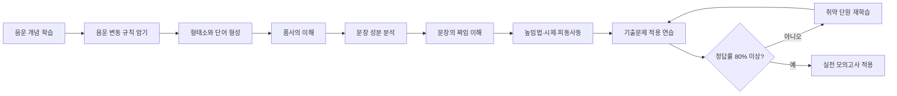
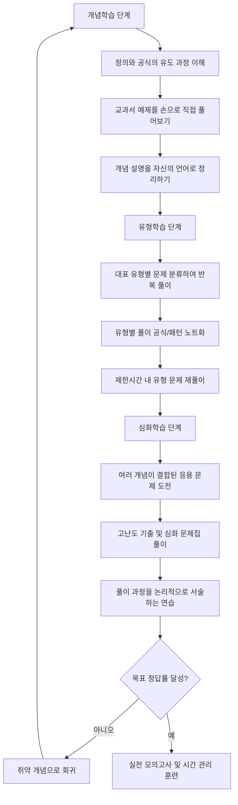
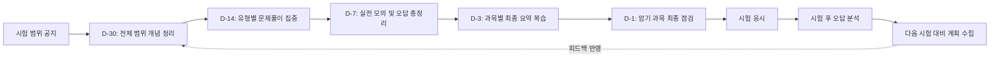
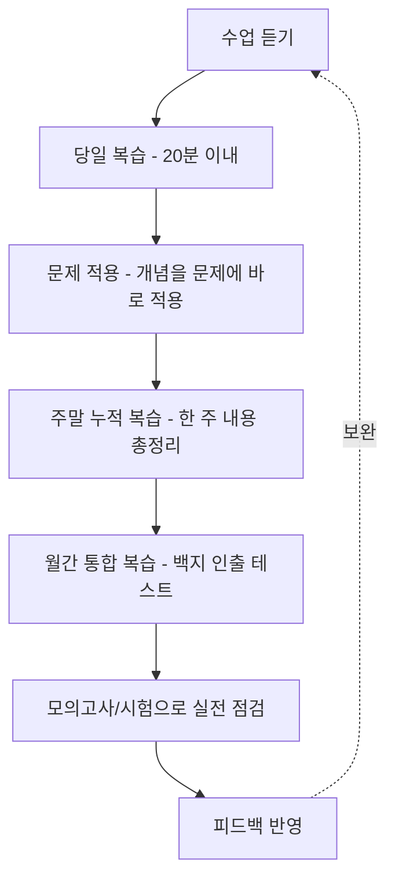

# 과목별 효율적 공부법 가이드

이 문서는 중·고등학생이 국어, 영어, 수학, 과학, 사회/역사 다섯 개 핵심 과목을 효율적으로 공부하는 방법을 체계적으로 정리한 가이드입니다. 각 과목별 학습 전략과 함께 시간 배분, 내신 시험 대비 전략, 상위권 학생들의 공부 습관까지 폭넓게 다룹니다.

---

## 목차

1. [국어 공부법](#1-국어-공부법)
2. [영어 공부법](#2-영어-공부법)
3. [수학 공부법](#3-수학-공부법)
4. [과학 공부법](#4-과학-공부법)
5. [사회/역사 공부법](#5-사회역사-공부법)
6. [과목별 시간 배분 전략](#6-과목별-시간-배분-전략)
7. [내신 시험 대비 전략](#7-내신-시험-대비-전략)
8. [상위 1% 학생의 공부 습관 10가지](#8-상위-1-학생의-공부-습관-10가지)

---

## 1. 국어 공부법

국어는 모든 과목의 기초가 되는 언어 능력을 키우는 과목입니다. 단기간에 성적을 올리기 어렵다는 인식이 있지만, 체계적인 훈련을 통해 충분히 향상시킬 수 있습니다.

### 1-1. 독해력 향상법

#### 단계별 독해 전략

독해력은 하루아침에 늘지 않으며, 아래와 같은 4단계 훈련을 최소 3개월 이상 꾸준히 반복해야 효과가 나타납니다.

**1단계: 정독 훈련 (1개월차)**
- 지문을 문단별로 끊어 읽으며 각 문단의 중심 문장을 찾아 밑줄 긋기
- 문단이 끝날 때마다 "이 문단이 왜 여기 있는가"를 스스로 질문하기
- 모르는 어휘는 문맥으로 뜻을 추측한 뒤 사전으로 확인하는 습관 들이기
- 하루 1지문씩, 시간 제한 없이 완전히 이해할 때까지 반복 읽기

**2단계: 구조 파악 훈련 (2개월차)**
- 지문 전체를 읽고 나서 글의 구조도(트리 다이어그램)를 손으로 그려보기
- 서론-본론-결론, 혹은 주장-근거-반론-재반박 구조를 표시하기
- 문단 간 접속어(그러나, 따라서, 반면에 등)에 표시하며 논리 흐름 추적하기
- 하루 2지문씩, 구조도 작성을 포함하여 학습하기

**3단계: 시간 제한 훈련 (3개월차)**
- 실전과 동일한 제한 시간을 설정하고 문제 풀이 시작
- 지문당 목표 시간을 설정(비문학 8분, 문학 6분 내외)하고 초시계로 측정
- 틀린 문제는 반드시 지문으로 돌아가 근거 문장을 찾아 표시하기
- 주 3회 이상 모의고사 형태로 실전 연습하기

**4단계: 오답 분석 및 재구성 훈련 (4개월차 이후)**
- 틀린 문제 유형을 분류(사실적 이해, 추론적 이해, 비판적 이해 등)하여 약점 파악
- 자신만의 오답노트에 "왜 틀렸는가"를 한 줄로 요약하여 기록
- 동일 유형의 문제를 추가로 찾아 풀며 취약 유형 집중 보완하기

#### 지문 유형별 접근법

| 지문 유형 | 핵심 접근 전략 | 주의할 점 |
|---|---|---|
| 인문/예술 비문학 | 개념어의 정의를 먼저 파악하고 필자의 관점 구분 | 여러 학자의 견해가 혼재될 때 구분 표시 필수 |
| 사회/경제 비문학 | 인과관계와 조건문(만약 ~라면)에 표시 | 통계, 그래프 자료와 본문 내용 대조 확인 |
| 과학/기술 비문학 | 원리를 그림으로 시각화하며 읽기 | 과정(순서)이 있는 경우 번호를 매겨 정리 |
| 고전시가 | 화자의 정서와 상황을 먼저 파악 | 현대어 풀이와 원문을 함께 대조하며 학습 |
| 현대시 | 시어의 함축적 의미와 심상 파악 | 동일 시어라도 문맥에 따라 의미가 달라짐에 유의 |
| 고전산문 | 인물 관계도를 그려가며 서사 구조 파악 | 배경지식(설화, 역사적 배경) 사전 학습 필요 |
| 현대소설 | 서술자의 시점과 인물의 심리 변화 추적 | 상징적 소재의 의미를 문맥 속에서 파악 |
| 갈래 복합 | 두 작품의 공통점과 차이점을 표로 정리 | 연계 출제 의도(주제, 소재, 표현법) 파악 |

#### 독해력 향상을 위한 체크리스트

- [ ] 하루 최소 1개 지문을 시간을 재며 읽었는가
- [ ] 모르는 어휘를 어휘 노트에 정리했는가
- [ ] 지문의 구조도를 손으로 그려보았는가
- [ ] 틀린 문제의 근거를 지문에서 찾아 표시했는가
- [ ] 주 1회 이상 취약 유형을 집중적으로 복습했는가

### 1-2. 문법 정리법

문법은 암기가 필요한 영역이지만, 원리를 이해하면 암기량을 크게 줄일 수 있습니다.

#### 핵심 문법 체크리스트

| 영역 | 세부 항목 | 학습 우선순위 |
|---|---|---|
| 음운론 | 음운의 변동(교체, 탈락, 첨가, 축약) | 상 |
| 형태론 | 품사의 종류와 특성, 단어의 형성(합성어, 파생어) | 상 |
| 통사론 | 문장 성분, 문장의 짜임(홑문장/겹문장), 높임법 | 상 |
| 통사론 | 시제, 피동/사동 표현, 부정 표현 | 중 |
| 의미론 | 단어의 의미 관계(유의, 반의, 상하위어), 중의성 | 중 |
| 국어사 | 훈민정음 창제 원리, 중세 국어의 특징 | 하 |
| 담화 | 담화의 개념과 특성, 지시·대용·접속 표현 | 하 |

#### 문법 학습 순서 로드맵



문법은 개념을 이해한 즉시 기출문제에 적용해보는 것이 중요합니다. 개념만 암기하고 문제에 적용하지 않으면 실전에서 활용하지 못하는 경우가 많습니다.

### 1-3. 서술형 답안 작성법

서술형/논술형 평가의 비중이 높아지면서 답안 작성 능력이 성적을 좌우하는 경우가 많아졌습니다.

#### 채점 기준 분석

서술형 문제는 대체로 다음과 같은 요소로 채점됩니다.

| 채점 요소 | 배점 비중(예시) | 확인 사항 |
|---|---|---|
| 핵심 키워드 포함 여부 | 40% | 문제에서 요구하는 필수 개념어를 정확히 사용했는가 |
| 논리적 근거 제시 | 30% | 주장에 대한 타당한 근거를 지문/자료에서 인용했는가 |
| 조건 충족 여부 | 20% | 글자 수, 형식(~체로 쓸 것 등) 조건을 지켰는가 |
| 표현의 정확성 | 10% | 맞춤법, 띄어쓰기, 문장 호응이 올바른가 |

#### 모범 답안 구조

서술형 답안은 다음의 3단 구조를 따르면 안정적으로 점수를 확보할 수 있습니다.

1. **핵심 주장 제시**: 질문에 대한 결론을 먼저 한 문장으로 명확히 제시
2. **근거 및 설명**: 지문의 구체적 내용을 인용하며 근거 2~3가지 제시
3. **마무리 정리**: 조건에서 요구한 형식을 지키며 문장을 완결

예시 템플릿: "~는 ~이다. 왜냐하면 지문에서 '~'라고 언급하였듯이 ~하기 때문이다. 또한 ~라는 점에서도 이를 뒷받침한다. 따라서 ~라고 할 수 있다."

#### 서술형 연습 방법

- 매주 2회 이상 실제 기출 서술형 문제를 시간 제한을 두고 풀어보기
- 작성한 답안을 채점 기준표와 대조하며 스스로 채점해보기
- 선생님이나 스터디 그룹에게 답안을 첨삭받고 피드백 반영하기
- 모범 답안을 필사하며 문장 구조와 표현법 익히기

### 1-4. 추천 학습 자료와 방법

| 자료 유형 | 추천 활용 방법 | 학습 시기 |
|---|---|---|
| 어휘력 교재 (한자성어, 고유어) | 하루 20개씩 암기 후 주말 누적 복습 | 학기 내내 상시 |
| 비문학 독해 문제집 | 주제별(과학/사회/인문) 분류하여 약점 보완 | 학기 중 |
| 문학 작품 해설서 | 필수 작품의 전문 및 해설을 미리 정독 | 방학 기간 집중 |
| 문법 개념서 | 개념 정리 후 기출문제로 즉시 적용 | 학기 초 |
| 기출문제 및 모의고사 | 시간 재고 풀기 → 오답 분석 → 재풀이 | 시험 4주 전부터 |
| 신문 사설/칼럼 | 주 2~3회 읽고 요약 훈련(200자 요약) | 상시 |

---

## 2. 영어 공부법

영어는 언어 습득의 특성상 매일 꾸준히 노출되는 것이 무엇보다 중요합니다.

### 2-1. 단어 암기법

#### 어원별 암기법

영단어의 상당수는 라틴어와 그리스어 어원에서 파생되었습니다. 접두사, 어근, 접미사를 이해하면 모르는 단어도 의미를 유추할 수 있습니다.

| 어원 요소 | 의미 | 예시 단어 |
|---|---|---|
| pre- (접두사) | 미리, 앞서 | predict(예측하다), prevent(예방하다) |
| trans- (접두사) | 가로질러, 이동 | transport(운송하다), translate(번역하다) |
| -tion (접미사) | 명사화(행위, 상태) | education(교육), creation(창조) |
| -able (접미사) | ~할 수 있는 | available(이용 가능한), portable(휴대용의) |
| spect (어근) | 보다 | inspect(조사하다), respect(존중하다) |
| dict (어근) | 말하다 | predict(예측하다), contradict(반박하다) |
| port (어근) | 옮기다, 나르다 | export(수출하다), import(수입하다) |

#### 주제별 암기법

시험에 자주 출제되는 주제를 기준으로 어휘를 묶어서 암기하면 독해 시 배경지식과 어휘를 동시에 습득할 수 있습니다.

- 환경/생태 주제: sustainability, ecosystem, biodiversity, emission, renewable
- 과학/기술 주제: innovation, artificial intelligence, algorithm, breakthrough
- 사회/경제 주제: inequality, welfare, globalization, recession, workforce
- 심리/인간관계 주제: empathy, perception, motivation, resilience, cognitive

#### 반복 주기(에빙하우스 망각곡선 활용)

단어는 한 번 암기했다고 끝나는 것이 아니라, 망각곡선에 맞춰 반복해야 장기 기억으로 전환됩니다.

| 복습 시점 | 복습 방법 | 목표 |
|---|---|---|
| 암기 직후 | 소리 내어 3회 반복, 예문과 함께 암기 | 단기 기억 형성 |
| 1일 후 | 단어 암기장 가리고 뜻 맞추기 테스트 | 1차 복습 |
| 3일 후 | 헷갈리는 단어만 별도 표시하여 재확인 | 2차 복습 |
| 1주 후 | 누적 단어 테스트(주간 시험) | 3차 복습 |
| 2주 후 | 누적 단어 재시험, 오답만 재암기 | 4차 복습 |
| 1개월 후 | 월간 누적 테스트로 장기 기억 확인 | 최종 정착 |

### 2-2. 문법 공부 순서 (기초 → 중급 → 고급)

| 단계 | 핵심 학습 내용 | 학습 목표 |
|---|---|---|
| 기초 | 8품사, 문장의 5형식, 시제(현재/과거/미래) | 문장의 기본 뼈대 이해 |
| 기초 | to부정사, 동명사, 분사의 기본 개념 | 준동사의 형태와 역할 구분 |
| 중급 | 관계대명사, 관계부사, 접속사 | 복문 구조 분석 능력 |
| 중급 | 수동태, 가정법 과거/과거완료 | 의미의 미묘한 차이 파악 |
| 중급 | 비교 구문, 도치 구문 | 강조 및 비교 표현 이해 |
| 고급 | 분사구문, 특수 구문(강조, 생략, 삽입) | 복잡한 문장 정확히 해석 |
| 고급 | 문법 요소를 활용한 서술형 영작 | 문법을 표현 도구로 활용 |

문법은 순서대로 개념을 익힌 후, 반드시 예문을 통해 실제 문장에서 어떻게 쓰이는지 확인해야 합니다. 개념만 암기하고 넘어가면 독해 지문에서 그 문법이 나왔을 때 알아보지 못하는 경우가 많습니다.

### 2-3. 듣기·말하기 연습법

- **매일 듣기 루틴 만들기**: 등하교 시간이나 자투리 시간을 활용해 하루 20분 이상 영어 듣기에 노출
- **딕테이션(받아쓰기) 훈련**: 짧은 뉴스나 연설을 듣고 받아쓴 뒤 스크립트와 대조하여 놓친 부분 확인
- **섀도잉(shadowing) 훈련**: 원어민 음성을 0.1초 정도 늦게 따라 말하며 억양과 발음 훈련
- **말하기 아웃풋 연습**: 배운 표현을 활용해 하루 3문장씩 소리 내어 말해보는 연습
- **듣기 평가 기출 반복**: 학교 내신 듣기평가 기출을 최소 3회 이상 반복 청취

### 2-4. 독해 전략

| 전략 | 적용 방법 |
|---|---|
| 스키밍(skimming) | 전체 글을 빠르게 훑어 주제와 대의 파악 |
| 스캐닝(scanning) | 특정 정보(숫자, 고유명사)를 빠르게 찾아내는 훈련 |
| 문맥 추론 | 모르는 단어가 나와도 문맥으로 의미를 추측하며 읽기 |
| 문단별 요약 | 각 문단을 한 문장으로 요약하며 전체 구조 파악 |
| 연결어 활용 | however, therefore, in addition 등 연결어로 논리 흐름 예측 |
| 오답 소거법 | 명백히 틀린 선택지를 먼저 제거하고 남은 선택지 비교 |

---

## 3. 수학 공부법

수학은 단계별 학습이 특히 중요한 과목입니다. 개념을 건너뛰고 문제 풀이로 바로 넘어가면 응용력이 생기지 않습니다.

### 3-1. 개념학습 → 유형학습 → 심화학습 3단계 전략



#### 1단계: 개념학습 (원리 이해 단계)

- 공식을 무작정 암기하지 않고 유도 과정을 직접 손으로 써보며 이해
- "왜 이 공식이 성립하는가"를 스스로 설명할 수 있을 때까지 반복
- 교과서/개념서의 기본 예제를 답을 가리고 직접 풀어본 뒤 채점
- 개념 노트를 만들어 핵심 정의, 공식, 그래프 개형을 정리

#### 2단계: 유형학습 (패턴 습득 단계)

- 단원별 대표 유형을 10~15개로 분류하여 각 유형의 풀이 패턴 정리
- 동일 유형의 문제를 최소 5문제 이상 반복하여 손에 익히기
- 처음에는 시간 제한 없이 풀고, 익숙해지면 문제당 목표 시간 설정
- 유형별 풀이 노트를 작성하여 "이 유형은 이렇게 접근한다"는 원칙 정리

#### 3단계: 심화학습 (응용력 강화 단계)

- 두 개 이상의 단원 개념이 결합된 복합 문제에 도전
- 최상위 수준의 문제집이나 경시 기출문제로 사고력 확장
- 풀이 과정을 단계별로 서술하며 논리적 전개 능력 훈련
- 새로운 유형의 문제를 접했을 때 기존에 배운 개념 중 무엇을 적용할지 스스로 판단하는 훈련

### 3-2. 오답노트 작성법

오답노트는 단순히 틀린 문제를 옮겨 적는 것이 아니라, 사고 과정의 오류를 분석하는 도구로 활용해야 합니다.

#### 구체적 템플릿

| 항목 | 작성 내용 |
|---|---|
| 문제 출처 | 교재명, 페이지, 문제 번호 |
| 관련 단원/개념 | 이 문제가 다루는 핵심 개념 |
| 내가 쓴 풀이 | 틀렸을 당시 실제로 작성한 풀이 과정 그대로 기록 |
| 틀린 원인 분석 | 개념 부족 / 계산 실수 / 문제 오독 / 시간 부족 중 선택 |
| 올바른 풀이 | 정답 풀이 과정을 단계별로 정리 |
| 유사 문제 재풀이 | 동일 유형 문제를 다시 찾아 풀어 정답 확인 |
| 재복습 날짜 | 1주 후, 2주 후 재풀이 예정일 기록 |

#### 오답노트 작성 예시 구조

```
[문제 출처] 수학 개념원리 p.132, 15번
[관련 단원] 이차함수의 최댓값과 최솟값
[내가 쓴 풀이] 꼭짓점 공식을 잘못 대입하여 부호 오류 발생
[틀린 원인] 계산 실수 (부호 처리 미숙)
[올바른 풀이] a>0인 경우와 a<0인 경우를 구분하여 최댓값/최솟값 결정
[유사 문제 재풀이] 동일 유형 3문제 재풀이 완료, 정답률 100%
[재복습 날짜] 7/19, 7/26
```

오답노트는 시험 전 마지막 복습 자료로 활용할 때 가장 효과적입니다. 시험 D-7 시점에는 새로운 문제보다 오답노트를 다시 훑어보는 것이 효율적입니다.

### 3-3. 수학 문제 풀이 사고 과정

수학 문제를 풀 때는 다음과 같은 사고 순서를 습관화하는 것이 좋습니다.

1. **문제 파악**: 무엇을 구하라는 문제인지 정확히 파악하고, 주어진 조건을 모두 표시
2. **조건 정리**: 조건을 식이나 그림으로 변환하여 시각화
3. **전략 수립**: 어떤 개념/공식을 적용할지 최소 2가지 접근법을 떠올려보기
4. **풀이 실행**: 선택한 전략으로 단계별로 계산 진행
5. **검산**: 답이 조건을 만족하는지, 단위나 범위가 타당한지 재확인
6. **대안 검토**: 시간이 남으면 다른 방법으로도 풀어보아 답을 교차검증

이 사고 과정을 문제를 풀 때마다 의식적으로 되뇌면, 처음 보는 낯선 문제 유형에도 당황하지 않고 접근할 수 있는 힘이 길러집니다.

---

## 4. 과학 공부법

과학은 개념 이해와 실험적 사고, 그리고 논리적 서술 능력이 함께 요구되는 과목입니다.

### 4-1. 실험 보고서 작성법

실험 보고서는 형식을 갖추어 작성하는 것이 중요하며, 다음 구조를 따르는 것이 일반적입니다.

| 항목 | 작성 내용 |
|---|---|
| 실험 목적 | 이 실험을 통해 확인하고자 하는 과학적 원리 |
| 가설 설정 | 실험 결과를 예측하는 구체적이고 검증 가능한 가설 |
| 준비물 및 방법 | 실험 기구, 시약, 실험 절차를 순서대로 기술 |
| 실험 결과 | 관찰한 수치, 그래프, 표를 있는 그대로 기록(해석 배제) |
| 결과 분석 | 결과가 가설과 일치하는지, 오차의 원인은 무엇인지 분석 |
| 결론 | 실험을 통해 검증된 과학적 원리를 명확히 서술 |
| 느낀 점/추가 탐구 | 실험의 한계와 추가로 탐구하고 싶은 내용 제시 |

보고서 작성 시 가장 중요한 것은 "결과"와 "결론"을 명확히 구분하는 것입니다. 결과는 객관적 관찰 데이터이고, 결론은 그 데이터로부터 도출한 해석이라는 점을 항상 유의해야 합니다.

### 4-2. 과학적 사고력 키우기

- **관찰-가설-검증의 순환 훈련**: 일상 현상에 대해서도 "왜 그럴까"를 질문하고 스스로 가설을 세워보는 습관
- **변인 통제 개념 익히기**: 실험 문제를 볼 때 독립변인, 종속변인, 통제변인을 구분하는 연습
- **그래프 해석 훈련**: 축의 의미, 기울기, 변곡점이 나타내는 과학적 의미를 정확히 읽어내는 연습
- **모형과 실제의 연결**: 교과서의 모식도(원자 구조, 세포 구조 등)를 직접 그려보며 원리 체득
- **인과관계와 상관관계 구분**: 두 현상이 관련 있어 보여도 인과관계인지 단순 상관관계인지 비판적으로 검토

### 4-3. 단원별 학습 전략

| 영역 | 학습 전략 |
|---|---|
| 물리 | 공식의 물리적 의미를 이해하고, 단위 변환에 익숙해지기. 힘과 운동 관련 도식을 직접 그려보기 |
| 화학 | 몰(mol) 개념을 확실히 정립하고, 화학반응식의 계수를 균형 맞추는 연습을 반복하기 |
| 생명과학 | 각 기관계의 구조와 기능을 연결지어 암기하고, 도표와 그림으로 시각화하여 정리하기 |
| 지구과학 | 지질시대, 천체 운동 등 시간/공간 개념이 중요한 단원은 타임라인과 모형도를 활용하기 |

과학은 암기와 이해가 결합된 과목이므로, 개념을 이해한 후에는 반드시 관련 도표나 그림을 직접 그려보며 시각적으로 정리하는 것이 장기 기억에 효과적입니다.

---

## 5. 사회/역사 공부법

사회와 역사는 방대한 정보량 때문에 무작정 암기하면 금방 잊어버리기 쉽습니다. 구조화된 이해와 반복이 핵심입니다.

### 5-1. 개념지도 만들기

개념지도(마인드맵)는 개별 사실들을 하나의 큰 흐름 속에서 연결하여 이해하도록 돕는 도구입니다.

#### 개념지도 작성 절차

1. 큰 주제(예: 조선 후기 사회 변화)를 중심에 배치
2. 하위 주제(정치, 경제, 사회, 문화)를 가지로 뻗어나가듯 배치
3. 각 하위 주제에 핵심 사건, 인물, 개념을 연결
4. 사건 간의 인과관계는 화살표로 표시하여 흐름을 시각화
5. 완성된 개념지도를 백지에 아무것도 보지 않고 재현해보는 훈련(백지 복습법)

#### 역사 학습 흐름 예시

| 시대 | 정치 | 경제 | 사회/문화 |
|---|---|---|---|
| 조선 전기 | 중앙집권체제 정비, 사림 등장 | 과전법, 농업 중심 경제 | 훈민정음 창제, 성리학 확산 |
| 조선 후기 | 붕당정치 심화, 탕평책 | 대동법, 상품화폐경제 발달 | 실학 등장, 서민 문화 발달 |
| 근대 개항기 | 개화파와 위정척사파 대립 | 개항과 열강의 경제 침탈 | 근대 교육기관 설립 |

### 5-2. 시사 연계 학습법

- 교과서의 개념을 최근 뉴스나 시사 이슈와 연결지어 이해하면 암기 부담이 줄어들고 실생활 적용력이 높아집니다.
- 예: 헌법의 기본권 단원을 학습할 때 최근 판례나 사회적 이슈와 연결하여 논술형 대비
- 예: 경제 단원의 수요-공급 개념을 최근 물가 상승 뉴스와 연결하여 이해
- 신문 사설이나 시사 잡지를 주 1~2회 읽고, 교과 개념과 연결되는 부분을 표시하는 습관
- 시사 이슈를 정리한 노트를 만들어 논술형/서술형 문제 대비 자료로 활용

### 5-3. 암기 전략

| 암기 기법 | 적용 방법 |
|---|---|
| 두문자 암기법 | 나열형 개념(예: 조선의 5대 궁궐)의 앞글자를 따서 문장으로 암기 |
| 스토리텔링 암기법 | 사건의 흐름을 이야기 형식으로 재구성하여 맥락과 함께 암기 |
| 타임라인 암기법 | 연도표를 직접 그리며 사건의 순서와 시간 간격을 시각적으로 익히기 |
| 지도 활용 암기법 | 지리적 위치가 중요한 내용은 백지도에 직접 표시하며 암기 |
| 비교표 암기법 | 유사한 개념(예: 여러 나라의 정치체제)을 표로 비교하며 차이점 부각 |
| 반복 인출 암기법 | 암기한 내용을 보지 않고 백지에 써보는 인출 연습을 주기적으로 반복 |

사회/역사는 단순 암기보다 "왜 이런 일이 일어났는가"라는 인과관계를 이해하면 자연스럽게 암기량이 줄어들고 응용문제에도 강해집니다.

---

## 6. 과목별 시간 배분 전략

학습 목표(일반고 진학 준비 혹은 특목고/자사고 진학 준비)에 따라 과목별 시간 배분은 달라져야 합니다.

### 6-1. 일반고 준비 학생의 주간 학습 시간 배분 (예시, 주당 총 학습 25시간 기준)

| 과목 | 주간 학습 시간 | 비율 | 주요 학습 내용 |
|---|---|---|---|
| 국어 | 5시간 | 20% | 내신 대비 문학/비문학 독해, 문법 정리 |
| 영어 | 6시간 | 24% | 단어 암기, 문법, 내신 지문 분석 |
| 수학 | 7시간 | 28% | 개념학습 및 유형별 문제풀이 중심 |
| 과학 | 4시간 | 16% | 개념 정리 및 교과서 예제 풀이 |
| 사회/역사 | 3시간 | 12% | 개념지도 작성 및 암기 복습 |

### 6-2. 특목고/자사고 준비 학생의 주간 학습 시간 배분 (예시, 주당 총 학습 35시간 기준)

| 과목 | 주간 학습 시간 | 비율 | 주요 학습 내용 |
|---|---|---|---|
| 국어 | 6시간 | 17% | 심화 독해, 고전문학, 서술형 논리 훈련 |
| 영어 | 9시간 | 26% | 심화 문법, 원서 독해, 에세이 작성 |
| 수학 | 11시간 | 31% | 심화 유형 및 경시 수준 문제 풀이 |
| 과학 | 6시간 | 17% | 심화 개념 및 탐구보고서 작성 |
| 사회/역사 | 3시간 | 9% | 시사 연계 학습 및 논술형 대비 |

### 6-3. 학기 중 vs 방학 중 시간 배분 비교

| 구분 | 학기 중 학습 초점 | 방학 중 학습 초점 |
|---|---|---|
| 국어 | 내신 범위 지문 정독 및 서술형 연습 | 다음 학기 문학 작품 선행 및 독해력 훈련 |
| 영어 | 내신 지문 암기 및 문법 문제 풀이 | 어휘량 확충 및 문법 체계 정리 |
| 수학 | 유형별 문제풀이와 오답노트 관리 | 다음 학기 개념 선행 학습 |
| 과학 | 단원별 개념 정리 및 내신 기출 풀이 | 심화 탐구 및 실험 보고서 작성 연습 |
| 사회/역사 | 개념지도 작성 및 암기 복습 | 시사 연계 학습 및 배경지식 확장 |

### 6-4. 일일 학습 시간표 예시 (평일 기준)

| 시간대 | 활동 |
|---|---|
| 16:00 ~ 16:30 | 하교 후 휴식 및 간식 |
| 16:30 ~ 18:00 | 학원 또는 인강 수업 |
| 18:00 ~ 19:00 | 저녁 식사 및 휴식 |
| 19:00 ~ 20:00 | 수학 문제풀이 및 오답노트 정리 |
| 20:00 ~ 20:50 | 영어 단어 암기 및 문법 학습 |
| 20:50 ~ 21:00 | 짧은 휴식 |
| 21:00 ~ 21:50 | 국어 독해 또는 사회/과학 복습 |
| 21:50 ~ 22:10 | 오늘 학습 내용 백지 복습 |
| 22:10 이후 | 자유 시간 및 취침 준비 |

---

## 7. 내신 시험 대비 전략

### 7-1. 시험 대비 전체 사이클



### 7-2. D-30 전략 (한 달 전)

시험 범위가 공지되는 시점으로, 전체적인 학습 계획을 세우는 것이 핵심입니다.

- 시험 범위 전체를 훑어보며 단원별 학습 분량과 난이도를 파악
- 과목별로 개념 정리 노트(요약 노트)를 만들기 시작
- 취약 단원을 미리 파악하여 우선순위를 정한 학습 계획표 작성
- 하루 학습 시간 중 60% 이상을 개념 이해와 정리에 투자
- 학원/인강 진도를 시험 범위에 맞추어 조정

### 7-3. D-14 전략 (2주 전)

개념 정리가 끝나고 본격적인 문제 풀이로 전환하는 시기입니다.

- 단원별 기출문제 및 문제집을 유형별로 집중적으로 풀기
- 틀린 문제는 즉시 오답노트에 기록하고 원인 분석
- 서술형 문제에 대비해 모범 답안 구조를 익히고 직접 작성 연습
- 하루 학습 시간 중 70% 이상을 문제 풀이에 투자
- 이 시기부터 과목별 취약점을 좁혀가며 우선순위를 재조정

### 7-4. D-7 전략 (1주 전)

실전 감각을 익히고 전체 범위를 다시 한 번 훑는 시기입니다.

- 실제 시험 시간표에 맞춰 모의 형식으로 문제 풀이 연습(시간 제한 엄수)
- 그동안 작성한 오답노트를 처음부터 끝까지 재검토
- 암기 과목(사회, 역사, 과학 일부)의 반복 암기 주기를 하루 단위로 단축
- 과목별 우선순위를 정해 취약 과목에 더 많은 시간 배분
- 컨디션 관리를 위해 수면 시간과 규칙적인 생활 패턴 유지 시작

### 7-5. D-3 전략 (3일 전)

새로운 문제보다 정리와 확인에 집중하는 시기입니다.

- 새로운 유형의 문제를 새로 시도하기보다 이미 학습한 내용을 확실히 정리
- 과목별 핵심 요약 노트를 반복적으로 읽으며 암기 상태 점검
- 헷갈리는 개념이나 공식만 모아서 최종 점검 노트 작성
- 서술형 예상 문제에 대한 모범 답안을 소리 내어 말해보며 복습

### 7-6. D-1 전략 (하루 전)

심리적 안정과 최종 확인에 집중하는 시기입니다.

- 새로운 내용 학습은 중단하고, 이미 알고 있는 내용을 확인하는 데 집중
- 암기 과목 위주로 짧고 굵게 최종 점검(전체를 훑되 깊이 파고들지 않기)
- 시험 준비물(펜, 수정테이프, 학생증 등)을 미리 챙기기
- 충분한 수면을 취해 시험 당일 컨디션을 최상으로 유지
- 과도한 긴장을 줄이기 위해 가벼운 스트레칭이나 산책으로 마음 정리

### 7-7. 시험 후 관리

시험이 끝난 직후의 오답 분석이 다음 시험 성적을 좌우합니다.

- 시험 문제와 자신의 답안을 최대한 빨리 기억이 남아있을 때 복기
- 틀린 문제의 원인을 개념 부족/실수/시간 부족으로 분류하여 기록
- 다음 시험을 위한 학습 계획에 이번 시험에서 드러난 약점을 반영

---

## 8. 상위 1% 학생의 공부 습관 10가지

### 학습-복습 순환 구조



### 습관 1: 예습보다 복습을 우선한다

상위권 학생들은 예습에 과도한 시간을 쓰기보다, 수업 직후 20분 이내의 즉시 복습에 집중합니다. 배운 직후의 복습이 장기 기억 전환에 가장 효과적이기 때문입니다.

### 습관 2: 백지 복습법을 활용한다

교재나 노트를 보지 않고 빈 종이에 배운 내용을 스스로 재현해보는 훈련을 습관화합니다. 이 과정에서 자신이 무엇을 모르는지 정확히 파악할 수 있습니다.

### 습관 3: 하루 학습 계획을 전날 밤에 세운다

당일 아침에 계획을 세우면 시간을 허비하기 쉽습니다. 상위권 학생들은 전날 밤 다음날의 구체적인 학습 목표와 시간표를 미리 정해둡니다.

### 습관 4: 질문 노트를 항상 휴대한다

궁금한 점이나 이해가 안 되는 부분을 그때그때 질문 노트에 기록하고, 선생님이나 친구에게 반드시 물어보고 해결하는 습관을 들입니다.

### 습관 5: 오답을 감정적으로 대하지 않는다

틀린 문제를 부끄러워하기보다 "내가 무엇을 몰랐는지 알려주는 데이터"로 받아들입니다. 오답노트 작성을 귀찮은 숙제가 아닌 성장의 도구로 여깁니다.

### 습관 6: 시간을 재며 공부한다

모든 학습에 스톱워치를 활용하여 실제 시험처럼 시간 압박 속에서 문제를 푸는 연습을 합니다. 이를 통해 실전에서 시간 부족으로 실수하는 것을 방지합니다.

### 습관 7: 자투리 시간을 전략적으로 활용한다

등하교 시간, 쉬는 시간 등 자투리 시간에는 암기 과목이나 단어 암기처럼 짧게 끊어 할 수 있는 학습을 배치하여 시간을 낭비하지 않습니다.

### 습관 8: 메타인지를 활용해 학습 상태를 점검한다

"이 개념을 남에게 설명할 수 있는가"를 스스로에게 질문하며, 진짜로 이해한 것과 안다고 착각하는 것을 구분하는 훈련을 꾸준히 합니다.

### 습관 9: 규칙적인 수면과 생활 패턴을 유지한다

밤샘 공부보다 규칙적인 수면을 통한 뇌의 기억 정착을 중시합니다. 특히 시험 기간에도 최소 6시간 이상의 수면을 확보하려 노력합니다.

### 습관 10: 주간/월간 단위로 학습을 되돌아본다

매주 일요일 저녁, 이번 주 학습 목표 대비 달성도를 점검하고 다음 주 계획에 반영하는 회고의 시간을 갖습니다. 이 과정을 통해 학습 전략을 지속적으로 개선해 나갑니다.

---

## 마무리

과목별 공부법은 저마다 다르지만, 공통적으로 관통하는 원칙은 "개념의 정확한 이해", "체계적인 반복", "스스로 점검하는 메타인지"입니다. 이 가이드에서 제시한 전략들을 자신의 학습 스타일에 맞게 조정하여 꾸준히 실천한다면, 단기적인 성적 향상뿐 아니라 장기적으로도 흔들리지 않는 학습 역량을 갖출 수 있을 것입니다. 무엇보다 중요한 것은 완벽한 계획보다 매일의 작은 실천을 쌓아가는 꾸준함입니다.
