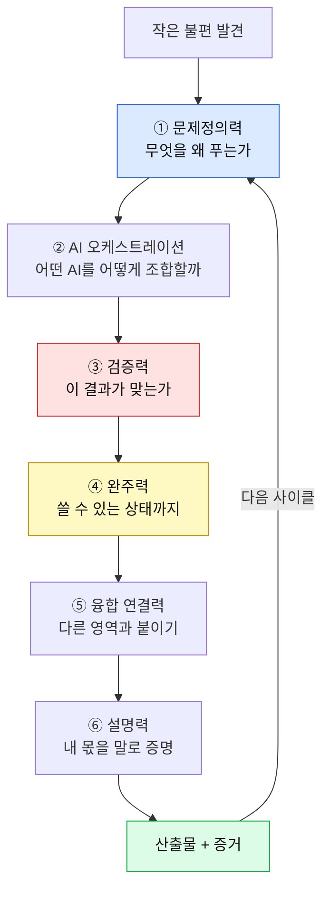

# AI 시대 6대 역량 지도 — 중학생이 지금 훈련할 수 있는 것만

> - **대상**: 중학생과 학부모 · **기준일**: 2026년 8월
> - **한 줄 소개**: "AI 시대엔 창의력이 중요하다"는 말은 실행이 안 돼요. **훈련 가능한 6개 역량**으로 쪼개고, 각각 이번 주에 할 일까지 붙였어요.

---

## 0. 30초 요약 — 이것만 알고 시작해요

| 질문 | 한 줄 답 |
|---|---|
| **역량이 몇 개예요?** | 6개예요. 문제정의 · AI오케스트레이션 · 검증 · 완주 · 융합연결 · 설명력. |
| **왜 이 6개예요?** | AI가 대신 못 하고, **중학생이 지금 훈련 가능하며**, 세특·면접에서 실제로 물어보는 것만 남겼어요. |
| **어떻게 늘려요?** | 강의로는 안 늘어요. **프로젝트 한 사이클마다 하나씩** 붙습니다. |
| **가장 먼저 뭘 해요?** | **1번(문제정의)**. 이게 없으면 나머지 5개가 쓸 데가 없어요. |
| **한 문장으로?** | **AI는 답을 만들고, 사람은 질문과 기준을 만들어요.** |

---

## 1. 역량 지도 한눈에



> 📌 **무릎을 칠 포인트**: 이 6개는 **순서가 있어요.** 대부분의 학생이 ②(AI 잘 쓰기)부터 시작해서 실패해요. ①이 비어 있으면 AI는 **아무 방향으로나 잘 달리는 차**일 뿐이에요.

---

## 2. 6대 역량 상세표

| # | 역량 | 정의 | AI가 대신 못 하는 이유 | 못 갖췄을 때 증상 | 입시에서 드러나는 곳 |
|---|---|---|---|---|---|
| ① | **문제정의력** | 누구의 어떤 불편인지 좁히는 힘 | 문제를 고르는 건 **가치 판단** | 주제가 계속 바뀜 | 세특 탐구 동기 |
| ② | **AI 오케스트레이션** | 여러 AI를 역할별로 배치·연결 | 조합 설계는 **맥락 이해** | AI 답을 그대로 붙여넣음 | 활동 과정 기술 |
| ③ | **검증력** | AI 결과의 오류·편향을 잡아냄 | AI는 자기 오류를 모름 | 틀린 정보를 그대로 제출 | 면접 압박 질문 |
| ④ | **완주력** | 남이 쓸 수 있는 상태까지 밀어붙임 | 끝내는 건 **의지** | 시작만 많고 결과 0 | 산출물 유무 |
| ⑤ | **융합 연결력** | 두 영역을 붙여 새 답을 만듦 | 조합의 의미는 사람이 부여 | 뻔한 결과물 | 진로 독창성 |
| ⑥ | **설명력** | 내 몫과 AI 몫을 구분해 말함 | 경험은 본인만 앎 | "그냥 했어요" | 면접 당락 |

---

## 3. 역량별 훈련법 — 이번 주에 할 수 있는 것

### ① 문제정의력

| 훈련 | 방법 | 시간 |
|---|---|---|
| 불편 로그 | 하루 3개씩 불편을 적기 (일주일 21개) | 5분/일 |
| 좁히기 5단계 | "학교가 불편" → "급식 줄" → "1학년 급식 줄" → "12:20 병목" → **"12:20 1학년 급식 줄 병목"** | 15분 |
| 사용자 확인 | 그 사람 3명에게 "진짜 불편해?" 물어보기 | 20분 |

> ⚠️ **주의**: 3명 중 0명이 불편하다고 하면 **좋은 문제가 아니에요.** 이걸 확인 안 하고 3개월 쓰는 게 가장 흔한 실패예요.

### ② AI 오케스트레이션

| 역할 | 시키는 일 | 예시 프롬프트 뼈대 |
|---|---|---|
| **기획 AI** | 구조 잡기 | "이 문제를 풀 방법 5가지를 장단점과 함께" |
| **제작 AI** | 실제 만들기 | "위 2번 방법으로 동작하는 최소 버전을 만들어 줘" |
| **비평 AI** | 약점 찾기 | "이 결과물의 치명적 약점 3가지를 **반대 입장에서** 지적해 줘" |
| **정리 AI** | 기록 남기기 | "오늘 과정을 회고 형식으로 5줄 요약" |

> 💡 **팁**: 핵심은 **같은 AI에게 다른 역할을 주는 것**이에요. 특히 **비평 AI**를 빼먹으면 결과물이 절대 좋아지지 않아요.

### ③ 검증력

| 체크 | 질문 | 통과 기준 |
|---|---|---|
| 사실 | 이 숫자·인용의 출처는? | 원문을 직접 확인함 |
| 편향 | 반대 의견은 뭐지? | 반대 근거 1개 이상 조사 |
| 재현 | 다시 시켜도 같은 답? | 2회 이상 확인 |
| 상식 | 내 경험과 어긋나지 않나? | 어긋나면 재조사 |

### ④ 완주력

| 규칙 | 내용 |
|---|---|
| **범위 먼저 자르기** | "완성"의 기준을 시작 전에 한 줄로 적기 |
| **2주 규칙** | 2주 안에 아무리 초라해도 v1 내보내기 |
| **막히면 축소** | 포기 대신 **기능을 줄여서** 끝내기 |

### ⑤ 융합 연결력

```
[내 관심] × [다른 과목/영역] × [AI 도구] = 새 결과
예) 축구 × 통계 × 데이터 시각화 = 우리 반 경기 분석 리포트
예) 음악 × 역사 × 음성 생성 = 조선시대 상상 사운드 아카이브
```

### ⑥ 설명력

**3문장 프레임** — 어떤 활동이든 이 틀로 말하면 통합니다.

> 1. **문제**: "저는 ○○인 사람이 △△에서 겪는 불편을 봤습니다."
> 2. **행동**: "AI에게 □□를 맡기고, 저는 ◎◎를 판단·검증했습니다."
> 3. **결과와 배움**: "○명이 사용했고, ×× 때문에 실패해서 ▽▽로 바꿨습니다."

---

## 4. 자가 진단 — 6대 역량 레이더

각 항목 0~5점으로 채점해 보세요.

| 역량 | 0~1점 (약함) | 2~3점 (보통) | 4~5점 (강함) | 내 점수 |
|---|---|---|---|---|
| 문제정의력 | 주제만 있음 | 문제를 한 줄로 씀 | 사용자에게 검증함 | ___ |
| AI 오케스트레이션 | AI 하나에 질문만 | 용도별로 나눠 씀 | 비평·검증까지 배치 | ___ |
| 검증력 | 그대로 믿음 | 가끔 확인 | 출처·반대의견 확인 | ___ |
| 완주력 | 중단 경험 다수 | 1개 완주 | 여러 개 완주 + 공개 | ___ |
| 융합 연결력 | 단일 영역 | 결합 시도 | 결합이 결과를 바꿈 | ___ |
| 설명력 | "그냥 했어요" | 과정 설명 가능 | AI/내 몫 구분 설명 | ___ |

| 총점 | 해석 |
|---|---|
| 0~9 | 프로젝트 경험 자체가 부족해요 → **4주 프로젝트 1개**부터 |
| 10~19 | 만들긴 하는데 증거가 얇아요 → **검증·설명력** 집중 |
| 20~26 | 세특·면접에서 통해요 → **융합**으로 확장 |
| 27~30 | 또래 상위권 → 대표작 하나를 **깊게** |

---

## 5. 학년별 우선순위

| 학년 | 1순위 | 2순위 | 하지 않아도 되는 것 |
|---|---|---|---|
| 중1 | ④ 완주력 | ① 문제정의력 | 완성도 욕심 |
| 중2 | ② 오케스트레이션 | ③ 검증력 | 대회 수상 집착 |
| 중3 | ⑤ 융합 | ⑥ 설명력 | 새 주제 벌리기 |

---

## 6. 이번 주 체크리스트

- [ ] 불편 로그 21개를 채웠다
- [ ] 그중 1개를 5단계로 좁혔다
- [ ] AI에게 **비평 역할**을 시켜 봤다
- [ ] 검증 4체크(사실·편향·재현·상식)를 한 번 돌렸다
- [ ] 3문장 프레임으로 내 활동을 말해 봤다

---

> 🎯 **최종 메시지**: AI 시대 역량은 성격이 아니라 **훈련의 결과**예요. 6개 중 지금 가장 약한 하나를 골라 이번 달에 올리세요. 6번의 사이클이면 1년입니다.

> 🔗 **함께 보면 좋아요**: 「메이커 증거 루브릭」 · 「방학 4주 창직 프로젝트」 · 「AI 도구로 공부하는 법」 · 「2032 대입 매뉴얼」
