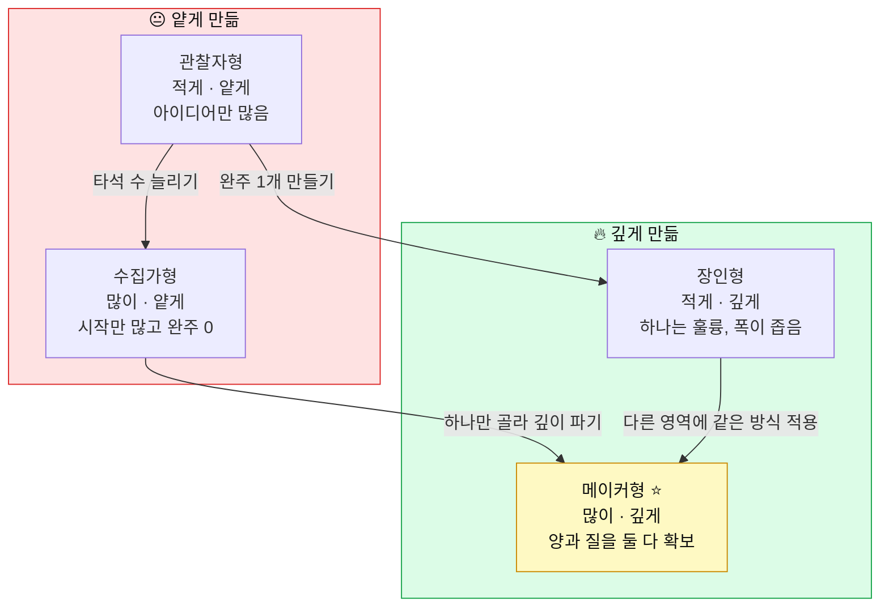

# 누가 더 많이, 그리고 제대로 만들었나 — 메이커 증거 루브릭

> - **대상**: 중학생과 학부모 · **기준일**: 2026년 8월
> - **한 줄 소개**: 프로젝트를 **몇 개 했는지(양)**와 **제대로 했는지(질)**를 나눠서 점수로 확인하는 자가 채점표예요. 내가 지금 어디쯤인지 숫자로 나옵니다.

---

## 0. 30초 요약 — 이것만 알고 시작해요

| 질문 | 한 줄 답 |
|---|---|
| **이게 왜 필요해요?** | "프로젝트 했어요"는 누구나 말해요. 갈리는 건 **완성도와 증거**예요. |
| **양이 중요해요, 질이 중요해요?** | 둘 다예요. 단 순서가 있어요 — **양으로 시작해서 질로 끝내요.** |
| **몇 개가 적당해요?** | 중학교 3년 동안 **작은 것 6~9개 + 끝까지 간 것 2~3개**면 충분해요. |
| **가장 흔한 실수는?** | **시작만 많고 완주가 0개**인 경우예요. 미완성 10개보다 완주 1개가 셉니다. |
| **핵심 한 단어?** | **증거(evidence)** — 말이 아니라 남아 있는 것. |

---

## 1. 채점의 두 축 — 양(Volume)과 질(Depth)

| 유형 | 특징 | 다음에 할 일 |
|---|---|---|
| **관찰자형** (적게·얕게) | 아이디어만 많고 만든 게 없음 | 완성 기준을 낮춰서 **1개 완주**부터 |
| **수집가형** (많이·얕게) | 시작은 많은데 끝난 게 없음 | 기존 것 중 **하나만 골라 깊이 파기** |
| **장인형** (적게·깊게) | 하나는 훌륭한데 폭이 좁음 | **다른 영역에 같은 방식** 적용해 보기 |
| **메이커형** (많이·깊게) | 양과 질을 둘 다 확보 | 결과를 **하나의 이야기로 묶기** |

> 💡 **한 줄 요약**: 중1은 **오른쪽(양)으로**, 중3은 **위쪽(질)으로** 이동하는 게 맞는 순서예요.

---

## 2. 질(質) 루브릭 — 프로젝트 1개를 채점해요

각 항목 **0~3점**, 총 **21점 만점**입니다. 프로젝트 하나를 떠올리고 솔직하게 매겨 보세요.

| # | 항목 | 0점 | 1점 | 2점 | 3점 |
|---|---|---|---|---|---|
| 1 | **문제 정의** | 주제만 있음 | 문제를 한 줄로 씀 | 누가 겪는지 특정 | **실제로 그 사람에게 확인함** |
| 2 | **완주** | 중단 | 초안까지 | 동작하는 결과물 | **남이 쓸 수 있는 상태** |
| 3 | **공개** | 안 함 | 가족에게만 | 반·동아리 공유 | **외부에 공개(링크·전시·업로드)** |
| 4 | **반응** | 없음 | 감상평 1~2개 | 실제 사용자 5명+ | **피드백 받아 고쳐서 v2 냄** |
| 5 | **AI 활용 설명력** | 안 씀/못 밝힘 | 썼다고만 함 | 어디에 썼는지 구분 | **AI 몫과 내 몫을 문장으로 구분** |
| 6 | **기록** | 없음 | 결과만 | 과정 일부 | **실패·수정 이력까지 남김** |
| 7 | **융합/연결** | 단일 영역 | 다른 영역 언급 | 두 영역 결합 시도 | **결합이 결과를 실제로 바꿈** |

### 점수 해석

| 총점 | 등급 | 뜻 | 다음 액션 |
|---|---|---|---|
| 0~6 | 🌱 씨앗 | 아직 '해 봤다' 단계 | 2번(완주)부터 올리기 |
| 7~12 | 🔮 성장 | 결과물은 있으나 증거가 얇음 | 3·4번(공개·반응) 채우기 |
| 13~17 | 💎 강함 | 세특·면접에서 통하는 수준 | 6·7번(기록·융합) 보강 |
| 18~21 | 👑 최상 | 그 자체로 이야기가 되는 프로젝트 | 다른 영역으로 확장 |

> ⚠️ **주의**: 2·3·4번(완주·공개·반응)이 0점이면 다른 항목이 아무리 높아도 **면접에서 무너져요.** "만들었다"는 주장을 검증할 방법이 없기 때문이에요.

---

## 3. 양(量) 기준 — 학년별 목표치

| 학년 | 작은 실험 (1~2주) | 중간 프로젝트 (4주) | 대표작 (3개월+) | 누적 목표 |
|---|---|---|---|---|
| 중1 | 4~6개 | 0~1개 | 0개 | **완주 3개 이상** |
| 중2 | 2~3개 | 1~2개 | 0~1개 | 누적 완주 6개 |
| 중3 | 1~2개 | 1개 | **1개** | 누적 완주 8개 + 대표작 1 |

> 📌 **무릎을 칠 포인트**: "많이 만든 사람"이 이기는 이유는 재능 때문이 아니라 **타석 수** 때문이에요. 10번 만들어 본 사람의 11번째는 처음 만드는 사람의 1번째와 질이 다릅니다.

---

## 4. 증거 원장(Ledger) — 이 표 하나만 채우면 끝

프로젝트마다 아래 한 줄씩. 노션·구글시트 어디든 좋아요.

| 날짜 | 프로젝트명 | 푼 문제 | 만든 것 | 공개 링크 | 사용자 반응 | AI가 한 일 / 내가 한 일 | 실패·수정 | 루브릭 점수 |
|---|---|---|---|---|---|---|---|---|
| 2026-03 | 급식 남김 줄이기 지도 | 급식 잔반이 많다 | 설문+시각화 페이지 | (링크) | 학급 28명 응답 | 차트 코드=AI / 설문 설계·해석=나 | 1차 설문 문항 오류 → 수정 | 15 |

> 💡 **팁**: 이 표는 **고3 때 만들 수 없어요.** 지금 한 줄씩 쌓아야만 존재합니다. 6년 뒤 이 표가 자기소개서의 원본이 돼요.

---

## 5. "제대로 만들었다"의 최종 검증 — 면접 3문항

면접관이 실제로 던지는 질문이에요. 셋 다 막힘없이 답하면 진짜입니다.

| 질문 | 이 질문이 검증하는 것 | 잘 된 답의 조건 |
|---|---|---|
| **"가장 오래 막혔던 지점은 뭐였나요?"** | 진짜 만들었는지 | 구체적 기술·판단 문제 + 해결 시도 2개 이상 |
| **"AI가 한 일과 본인이 한 일을 나눠 주세요."** | AI 시대 역량 | 경계를 문장으로 그음 + 검증 방법 언급 |
| **"다시 만든다면 뭘 바꾸겠어요?"** | 메타인지 | 결과가 아닌 **의사결정**을 바꾸겠다고 말함 |

> ⚠️ **주의**: "AI가 다 해 줬어요"도, "AI 안 썼어요"도 좋은 답이 아니에요. 2032 기준의 정답은 **"이 부분은 AI에 맡기고, 이 판단은 제가 했고, 이렇게 검증했습니다"**예요.

---

## 6. 지금 바로 하는 자가 진단

- [ ] 내가 **끝까지 완성한** 것이 몇 개인지 세어 봤다 (시작한 개수 말고)
- [ ] 그중 하나를 2장 루브릭으로 채점해 21점 중 몇 점인지 확인했다
- [ ] 가장 낮은 항목 **하나**를 골라 이번 달 목표로 정했다
- [ ] 증거 원장(4장) 표를 만들고 첫 줄을 채웠다

---

> 🎯 **최종 메시지**: 2032 대입에서 갈리는 건 **"프로젝트를 했는가"**가 아니라 **"증거가 남아 있는가"**예요. 같은 활동을 해도 기록한 사람만 자산이 됩니다. 오늘 원장 한 줄부터 시작하세요.

> 🔗 **함께 보면 좋아요**: 「AI 시대 6대 역량 지도」 · 「방학 4주 창직 프로젝트」 · 「AI 시대 면접 질문 30선」
