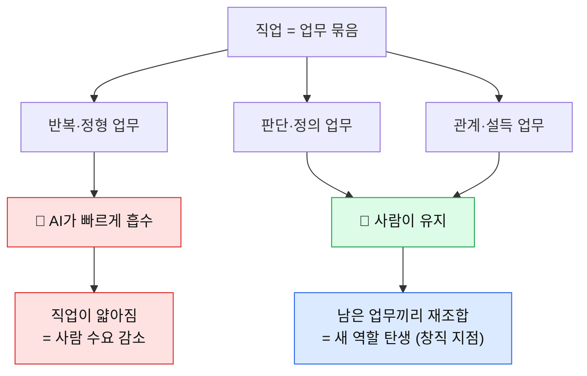
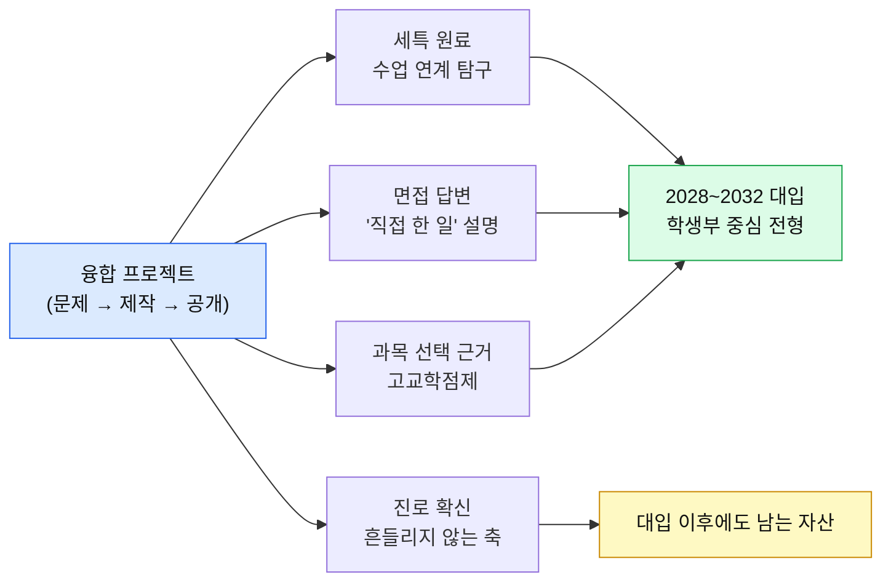

# 왜 창직·융합 교육인가 — "직업을 고르는 시대"가 끝나가는 이유

> - **대상**: 중학생과 학부모 · **기준일**: 2026년 8월
> - **한 줄 소개**: 왜 지금 갑자기 '창직(創職)'과 '융합'이라는 말이 교육에 들어왔는지, 그리고 그게 우리 아이 입시·진로와 어떻게 연결되는지 풀어 썼어요.

---

## 0. 30초 요약 — 이것만 알고 시작해요

| 질문 | 한 줄 답 |
|---|---|
| **창직이 뭐예요?** | 있는 직업에 들어가는 게 아니라, **내가 문제를 찾아 일을 만들어 내는 것**이에요. |
| **융합은요?** | 두 개 이상의 영역을 붙여 **아직 이름 없는 자리**를 만드는 것. (예: 생물 + 디자인 = 의료 시각화) |
| **왜 지금이에요?** | AI가 **단일 기술 하나**는 거의 다 대신할 수 있게 됐어요. 대체되지 않는 건 **조합과 판단**이에요. |
| **입시랑 무슨 상관?** | 2028 개편 이후 세특·면접이 핵심인데, 세특에 쓸 재료가 바로 **융합 프로젝트**예요. |
| **한 문장으로?** | **"무슨 직업 될래?"는 이제 틀린 질문이에요. "무슨 문제를 풀래?"가 맞는 질문이에요.** |

---

## 1. 직업이 사라지는 게 아니라, 직업의 '경계'가 사라져요

### 1.1 세 가지 오해 먼저 걷어내기

| 흔한 말 | 실제로 벌어지는 일 |
|---|---|
| "AI가 직업을 없앤다" | 직업이 통째로 사라지기보다 **직업 안의 '업무'가 잘려 나가요**. 남은 업무가 재조립되며 직업 모양이 바뀌어요. |
| "코딩만 잘하면 된다" | 코드 작성은 AI가 가장 먼저 대신한 영역 중 하나예요. 남는 건 **무엇을 만들지 정하는 일**이에요. |
| "창직은 창업이다" | 아니에요. 창직은 **회사 안에서도** 가능해요. 없던 역할을 스스로 정의하는 것이 창직이에요. |

### 1.2 업무 단위로 쪼개서 보기



> 📌 **무릎을 칠 포인트**: 새 직업은 **하늘에서 떨어지지 않아요.** 기존 직업에서 AI가 가져가고 **남은 조각들이 서로 붙을 때** 생겨요. 그래서 창직은 상상력이 아니라 **관찰력**의 문제예요.

---

## 2. 융합이 왜 방어막이 되나요?

### 2.1 단일 역량 vs 교차 역량

| 구분 | 단일 역량형 | 교차(융합) 역량형 |
|---|---|---|
| **자기소개** | "저는 코딩을 합니다" | "저는 **환경 데이터를 시각화해 주민을 설득**합니다" |
| **경쟁 상대** | 같은 기술을 가진 전 세계 사람 + AI | **거의 없음** (조합이 희소해서) |
| **AI의 위협** | 정면 충돌 | AI가 **각 조각을 도와주는 도구**가 됨 |
| **대체 난이도** | 낮음 | 높음 — 조합을 이해하는 사람이 드묾 |
| **입시에서** | 흔한 스펙 | **기억에 남는 이야기** |

### 2.2 융합의 공식

```
[내가 좋아하는 영역 A] × [사회가 겪는 문제 B] × [AI 도구 C] = 아직 이름 없는 자리
```

| A (관심) | B (문제) | C (도구) | 만들어지는 자리 |
|---|---|---|---|
| 그림 | 병원에서 설명이 어렵다 | 이미지 생성 AI | 의료 설명 일러스트 설계자 |
| 게임 | 노인이 재활을 지루해한다 | 모션 인식 | 재활 게임 디자이너 |
| 역사 | 지역 축제가 뻔하다 | 지도·영상 AI | 로컬 스토리 기획자 |
| 수학 | 소상공인이 재고를 못 맞춘다 | 예측 모델 | 동네 데이터 컨설턴트 |

> 💡 **팁**: 중학생에게 A는 이미 있어요. 부족한 건 **B(문제 관찰)**예요. 그래서 창직 교육의 절반은 **"불편을 적는 습관"**이에요.

---

## 3. 창직 교육이 입시에 실제로 작동하는 경로



| 평가 항목 | 창직 프로젝트가 채워 주는 것 |
|---|---|
| 학업 역량 | 문제를 풀기 위해 **필요해서 배운** 지식 (동기가 있는 학습) |
| 진로 역량 | 말이 아니라 **행동으로 증명된** 관심 |
| 공동체 역량 | 사용자·협업자와의 실제 상호작용 기록 |
| 세특 | 수업 과제를 프로젝트로 확장한 흔적 |

> ⚠️ **주의**: "입시에 좋으니까 창직하라"는 순서는 오래 못 가요. **재미있어서 만든 것이 결과적으로 입시에도 강한 것**이지, 입시용으로 만든 것은 면접 3분이면 들통나요.

---

## 4. 학교 교육만으로 부족한 지점 (그리고 메우는 법)

| 학교가 주는 것 | 비어 있는 부분 | 집에서 메우는 법 |
|---|---|---|
| 체계적 지식 | "이걸 어디에 쓰지?" | 배운 개념으로 **작은 것 하나 만들기** |
| 정답 확인 훈련 | 정답 없는 문제 다루기 | **답이 없는 질문 1개**를 한 달간 붙들기 |
| 개인 평가 | 협업·유통 경험 | 만든 걸 **누군가에게 써 보게 하기** |
| 과목 분리 | 융합 경험 | 두 과목을 **억지로 붙여 보기** |

> 💡 **한 줄 요약**: 학교는 **재료**를 줘요. 창직 교육은 그 재료로 **요리를 해 보는 것**이고요. 재료만 쌓아 두면 요리를 못 해요.

---

## 5. 학부모가 자주 묻는 3가지

| 질문 | 답 |
|---|---|
| "공부 시간 빼앗기는 거 아닌가요?" | 주 3~4시간이면 충분해요. 오히려 **왜 공부하는지**가 생겨 성적이 오르는 경우가 많아요. |
| "실패하면 시간 낭비 아닌가요?" | 완성 못 한 프로젝트도 **기록이 남으면 자산**이에요. 면접에서 가장 좋은 답변은 실패 복기예요. |
| "우리 애는 특별한 재능이 없어요" | 창직은 재능이 아니라 **관찰 + 완주**예요. 끝까지 만든 사람이 이깁니다. |

---

## 6. 오늘 시작하는 3단계

- [ ] **1단계 (오늘)**: 일주일간 겪은 **불편 10가지**를 메모에 적기
- [ ] **2단계 (이번 주)**: 그중 **내가 손댈 수 있는 1개** 고르기
- [ ] **3단계 (이번 달)**: 아주 작게 만들어서 **한 사람에게 보여 주기**

---

> 🎯 **최종 메시지**: 창직·융합 교육은 "특별한 아이"를 위한 게 아니에요. **AI가 정답을 독점한 시대에, 평범한 학생이 자기 자리를 만드는 유일하게 확실한 방법**이에요. 시작점은 거창한 아이디어가 아니라 **작은 불편 하나**입니다.

> 🔗 **함께 보면 좋아요**: 「2032 대입 매뉴얼」 · 「메이커 증거 루브릭」 · 「AI 시대 6대 역량 지도」 · 「방학 4주 창직 프로젝트」
