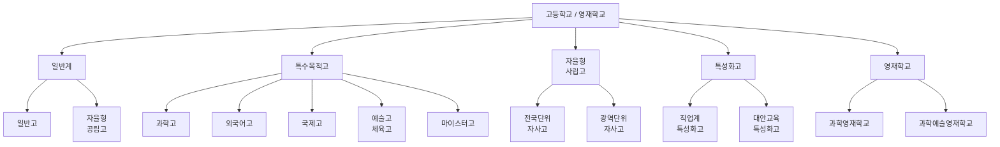
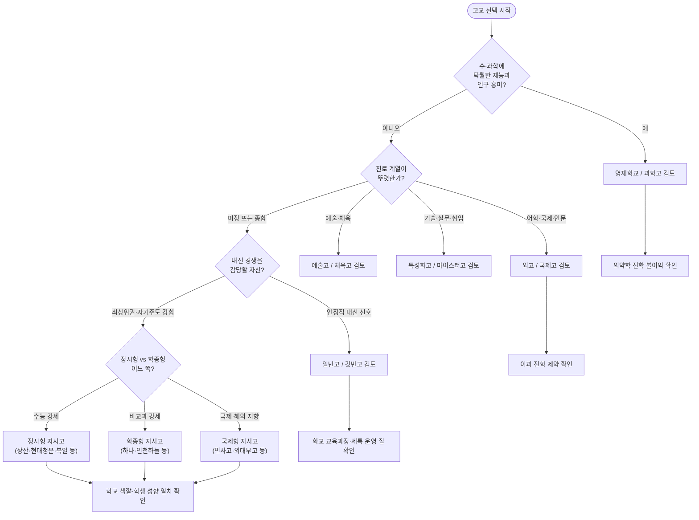
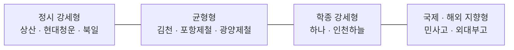
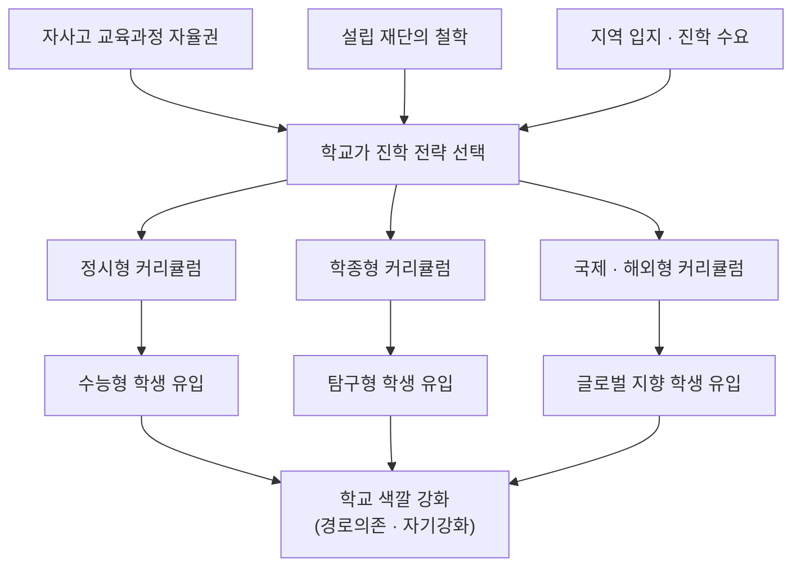
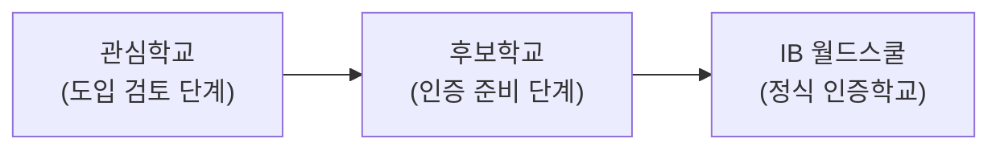

# 고등학교 유형 완전 정리 — 진로지도용 상세 가이드

> 대상: 중3~고1 학생 진로지도 / 학부모 상담 참고용
> 기준: 2028 대입 개편(통합형 수능 · 내신 5등급제) 체제
> 작성일: 2026-05-20
> 참고 영상: 「2028 이후 대입 — 절대 가면 안 되는 고등학교 총정리」(목동왕언니TV, 2026-05-16)

---

## 약어 · 용어 정리 — 먼저 읽어두세요

이 자료에 나오는 줄임말을 한곳에 모았습니다. 본문을 읽다가 헷갈리면 이 표로 돌아오세요.

### 1) 입시 전형 관련

| 약어 | 정식 명칭 | 뜻 |
|---|---|---|
| 수시 | 수시모집 | 수능 전에 학생부·논술·실기 등으로 뽑는 전형 |
| 정시 | 정시모집 | 수능 성적 위주로 뽑는 전형 |
| 수능 | 대학수학능력시험 | 매년 11월 치르는 전국 단위 시험 |
| 학종 | 학생부종합전형 | 학생부 전체를 정성평가하는 수시 전형 |
| 교과전형 | 학생부교과전형 | 내신 등급 위주로 평가하는 수시 전형 |
| 논술전형 | 논술 위주 전형 | 대학별 논술고사로 평가하는 수시 전형 |

### 2) 학교생활기록부(학생부) 관련

| 약어 | 정식 명칭 | 뜻 |
|---|---|---|
| 학생부 | 학교생활기록부 | 학생의 교과·비교과 활동 공식 기록 |
| 내신 | 학생부 교과 성적 | 학교 시험 기반 과목별 등급 |
| 세특 | 세부능력 및 특기사항 | 과목 수업 중 보인 역량·탐구를 교사가 기록한 항목 |
| 비교과 | 비교과 활동 | 동아리·자율·진로·봉사 등 교과 외 활동 |
| R&E | Research & Education | 학생이 연구주제를 탐구하는 연구 프로그램 |
| AP | Advanced Placement | 대학 수준 선이수 심화과목 |

### 3) 고교 유형 관련

| 약어 | 정식 명칭 | 뜻 |
|---|---|---|
| 일반고 | 일반계 고등학교 | 가장 보편적인 인문계 고교 |
| 갓반고 | (속어) | 정시 성과가 뛰어난 학군지 우수 일반고 |
| 자공고 | 자율형 공립고등학교 | 교육과정 자율성을 일부 부여받은 공립고 |
| 자사고 | 자율형 사립고등학교 | 교육과정 자율성이 큰 사립고 |
| 전국자사고 | 전국단위 자율형 사립고 | 전국에서 학생을 모집하는 자사고 (10개교) |
| 광역자사고 | 광역단위 자율형 사립고 | 해당 시·도 내에서 모집하는 자사고 |
| 특목고 | 특수목적고등학교 | 특정 분야 인재 양성 목적의 고교 |
| 과고 | 과학고등학교 | 이공계 영재 양성 특목고 (광역단위) |
| 영재학교 | 과학영재학교 | 「영재교육진흥법」 적용 별도 학교 (전국단위) |
| 외고 | 외국어고등학교 | 외국어 인재 양성 특목고 |
| 국제고 | 국제고등학교 | 국제 전문 인재 양성 특목고 |
| 특성화고 | 특성화 고등학교 | 직업·실무 또는 대안교육 중심 고교 |
| 마이스터고 | 산업수요 맞춤형 고등학교 | 취업 중심 특목고 |

### 4) 학교명 줄임말

| 약어 | 정식 학교명 |
|---|---|
| 외대부고 | 용인한국외국어대학교부설고등학교 |
| 민사고 | 민족사관고등학교 |
| KSA | 한국과학영재학교 (Korea Science Academy) |
| 제철고 | 포항제철고등학교 · 광양제철고등학교 통칭 |

### 5) 기타

| 약어 | 뜻 |
|---|---|
| 2028 대입 | 2028학년도 대학입학전형 (현 중3이 대상) |
| 의약학(의약계열) | 의학·치의학·한의학·약학 계열 |
| 5등급제 | 2028학년도 도입 내신 5단계 평가 체계 |

---

## 0. 이 자료 사용법

| 단계 | 무엇을 본다 | 해당 섹션 |
|---|---|---|
| 1단계 | 고교 전체 지도를 머릿속에 넣는다 | §1 트리 구조 · §2 분류도 |
| 2단계 | 2028 대입이 바뀐 점을 이해한다 | §3 제도 핵심 |
| 3단계 | 유형별 특성·수업·학종 차이를 본다 | §4 유형별 상세 |
| 4단계 | 학종 관점에서 한 번에 비교한다 | §5 학종 비교표 |
| 5단계 | "가면 안 되는 학교" 신호를 점검한다 | §7 주의 신호 |
| 6단계 | 학생 유형에 맞는 학교를 정한다 | §8 의사결정 순서도 · §9 추천 |
| 7단계 | 학비·기숙사 등 현실 여건을 점검한다 | §10 등록금·학생수준·기숙사 |
| 8단계 | 학교별 세특·학종·활동 수준을 비교한다 | §11 학교별 프로파일 |

---

## 1. 한눈에 보는 고등학교 분류 (트리 구조)

```
고등학교
│
├── 일반계
│   ├── 일반고 ──────────────── 보통의 인문계 고교 (대다수)
│   │   └── "갓반고" ─────────── 학군지 우수 일반고 (정시 성과 강세)
│   └── 자율형 공립고(자공고) ── 공립이면서 교육과정 자율성 일부 부여
│
├── 특수목적고(특목고)
│   ├── 과학고 ──────────────── 이공계 영재 양성 (조기졸업 가능)
│   ├── 외국어고(외고) ───────── 외국어 인재 양성
│   ├── 국제고 ──────────────── 국제 전문 인재 양성
│   ├── 예술고 / 체육고 ─────── 예체능 전문
│   └── 마이스터고 ──────────── 산업수요 맞춤형 (취업 중심)
│
├── 자율형 사립고(자사고)
│   ├── 전국단위 자사고 ──────── 전국에서 학생 모집 (10개교)
│   └── 광역단위 자사고 ──────── 해당 시·도 내에서 모집
│
├── 특성화고
│   ├── 직업계 특성화고 ─────── 직업·실무 교육
│   └── 대안교육 특성화고 ───── 대안적 교육과정
│
└── 영재학교 ★별도 법령
    ├── 과학영재학교 (4개교)
    └── 과학예술영재학교 (2개교)
        ※ 영재교육진흥법 적용 → "고등학교"가 아닌 별도 학교
```

> 핵심 구분점: **영재학교**는 「초·중등교육법」이 아니라 「영재교육진흥법」을 적용받는 별도 학교입니다. 그래서 일반 고교와 입시 일정·내신 산출·진학 규칙이 다릅니다.

---

## 2. 고교 유형 분류 다이어그램



### 2-1. 분류 기준 · 대표 학교 · 학생 수준 한눈표

| 대분류 | 세부 유형 | 나뉘는 기준 (목적·근거) | 대표 학교 | 학생 수준 | 한 줄 특징 |
|---|---|---|---|---|---|
| 일반계 | 일반고 | 국가 표준 교육과정의 보통교육 | 각 지역 일반고 (평준화·비평준화) | 다양 | 가장 보편적, 선택지 넓음 |
| 일반계 | 자율형 공립고 | 공립 + 교육과정 자율성 일부 부여 | 지역별 자공고 | 다양 | 공립이면서 자율 운영 |
| 특수목적고 | 과학고 | 이공계 영재 양성 / 광역단위 모집 | 한성과고·세종과고·경기북과고·인천과고 | 상위권 | 조기졸업 가능, 학종 중심 |
| 특수목적고 | 외국어고 | 외국어 인재 양성 | 대원외고·명덕외고·대일외고·한영외고 | 상위권 | 전공어·어문 학종 강세 |
| 특수목적고 | 국제고 | 국제 전문 인재 양성 | 서울국제고·인천국제고·청심국제고 | 상위권 | 국제·글로벌 교육과정 |
| 특수목적고 | 예술고·체육고 | 예체능 분야 전문 양성 | 서울예고·선화예고 등 | 실기 중심 선발 | 실기 비중이 매우 큼 |
| 특수목적고 | 마이스터고 | 산업수요 맞춤형 / 취업 직결 | 분야별 마이스터고 (SW·전기 등) | 다양 (실무 적성) | 취업 중심, 장학·지원 많음 |
| 자율형 사립고 | 전국단위 자사고 | 전국 모집 + 교육과정 자율 | 하나고·외대부고·민사고·상산고 등 10개교 | 최상위권 | 대부분 기숙형, 학교별 색깔 뚜렷 |
| 자율형 사립고 | 광역단위 자사고 | 시·도 내 모집 + 교육과정 자율 | 휘문고·세화고·중동고 등 | 상위~중상위 (편차 큼) | 통학형 다수, 개별 검증 필수 |
| 특성화고 | 직업계 특성화고 | 직업·실무 교육 | 분야별 특성화고 (IT·디자인·조리 등) | 다양 | 전공 실무·자격증 중심 |
| 특성화고 | 대안교육 특성화고 | 대안적 교육과정 운영 | 이우학교·간디학교 등 | 다양 | 대안 교육철학 기반 |
| 영재학교 | 과학영재학교 | 「영재교육진흥법」 / 수·과학 영재 | 서울·경기·대구·광주·대전과고, 한국영재(KSA) | 최상위 | 연구중심, 거의 전원 수시 |
| 영재학교 | 과학예술영재학교 | 과학+예술 융합 영재 양성 | 세종·인천 과학예술영재학교 | 최상위 | 융합형 연구 교육과정 |

> 표 읽는 법: '나뉘는 기준'은 곧 그 학교의 **설립 목적**입니다. 학교를 고를 때는 이 목적이 우리 아이의 진로와 맞는지를 가장 먼저 봐야 합니다. 학생 수준이 높을수록 또래 자극은 크지만 내신 경쟁도 치열해집니다 (→ §11-7, §11-8 참고).

---

## 3. 2028 대입 개편 핵심 (배경 지식)

2028학년도(현 중3이 고3이 되는 시점)부터 대입 제도가 크게 바뀌며, 이는 고교 선택의 전제가 됩니다.

| 항목 | 기존 (~2027) | 2028 개편 후 | 고교 선택에 주는 영향 |
|---|---|---|---|
| 수능 | 선택과목 체제 | **선택과목 없는 통합형 수능** | 과목 유불리 줄어 일반고 정시 부담 완화 |
| 내신 | 9등급 상대평가 | **5등급 상대평가**(절대+상대 병기) | 1등급 비율 4%→**10%**로 확대 |
| 내신 변별력 | 큼 | **줄어듦** | 내신 한 줄로 줄세우기 어려워짐 |
| 학종 영향 | — | **세특·정성평가 비중 상승** | 비교과·탐구활동 강한 학교가 유리 |
| 수도권 대학 | — | **학종·논술 확대 추세** | 자사고·특목고 재평가 분위기 |

### 내신 5등급 비율

| 등급 | 비율 | 누적 |
|---|---|---|
| 1등급 | 10% | 10% |
| 2등급 | 24% | 34% |
| 3등급 | 32% | 66% |
| 4등급 | 24% | 90% |
| 5등급 | 10% | 100% |

> 진로지도 포인트: 1등급이 10%로 넓어지면서 "내신 받기 어려운 학교(자사고·특목고)"의 약점이 줄고, "세특·탐구가 빈약한 학교"의 약점은 커집니다. 즉 **학교의 교육과정·프로그램 질이 더 중요해집니다.**

---

## 4. 유형별 상세 — 특성 · 특이점 · 수업 · 학종

각 유형마다 ① 특성 ② 특이점 ③ 학교 수업 ④ 학종 차이점 ⑤ 대표 학교(홈페이지)를 정리합니다.

### 4-1. 영재학교

| 구분 | 내용 |
|---|---|
| 특성 | 수·과학 최상위 영재 대상. 「영재교육진흥법」 적용 별도 학교 |
| 특이점 | 전국 모집 / 중3 외 조기 지원 가능 / 무학년·대학식 학점제 운영 |
| 학교 수업 | 대학 수준 심화 과목, R&E·졸업연구 등 **연구 중심 교육과정** |
| 학종 차이점 | 거의 전원 수시(학종·특기자)로 진학. **의약학 계열 진학 시 불이익**(교육비 환수, 학교 추천 제한 등). 세특의 핵심은 연구·논문·프로젝트 |
| 수능/정시 | 응시·활용 비중 매우 낮음 |

대표 학교(과학영재학교 4 + 과학예술영재학교 2 등 8개교):

| 학교 | 위치 | 홈페이지 |
|---|---|---|
| 서울과학고등학교 | 서울 | https://sshs.sen.hs.kr/ |
| 경기과학고등학교 | 수원 | https://gs-h.goesw.kr/ |
| 대구과학고등학교 | 대구 | http://ts.hs.kr/ |
| 광주과학고등학교 | 광주 | http://gsa.gen.hs.kr/ |
| 대전과학고등학교 | 대전 | https://djshs.djsch.kr/ |
| 한국과학영재학교(KSA) | 부산 | https://ksa.hs.kr/ |
| 세종과학예술영재학교 | 세종 | https://sasadomi.hs.kr/ |
| 인천과학예술영재학교 | 인천 | https://iasa.icehs.kr/ |

## 4-2. 과학고

| 구분 | 내용 |
|---|---|
| 특성 | 이공계 영재 양성 특목고. 광역(시·도) 단위 모집 |
| 특이점 | **조기졸업(2년)** 가능 / 과학·수학 비중 매우 높음 |
| 학교 수업 | AP·심화과목, 과제연구, 실험 중심. 대학 연계 프로그램 |
| 학종 차이점 | 학종 중심 진학. **의약학 진학 시 불이익**(교육비 환수 등). 이공계 전공적합성·탐구역량을 세특에 집중 표현 |
| 수능/정시 | 정시 비중 낮은 편 |

> 영재학교 vs 과학고: 영재학교가 더 상위·전국단위·연구중심, 과학고는 광역단위·조기졸업 통로. 둘 다 의약학 진학에 제약이 있다는 점이 진로지도 핵심.
----

### 4-3. 전국단위 자율형 사립고 (전국자사고)

| 구분 | 내용 |
|---|---|
| 특성 | 전국에서 학생을 모집하는 자사고. 대부분 기숙형 |
| 특이점 | 학교별 **'색깔'이 뚜렷** — 정시형 / 학종형 / 국제형으로 갈림 |
| 학교 수업 | 자율적 교육과정, 풍부한 비교과·동아리·탐구 프로그램 |
| 학종 차이점 | 학종·정시 모두 강하나 학교마다 결이 다름. 세특·R&E 등 비교과 자원이 풍부해 2028 체제에서 유리 |

전국단위 자사고 10개교:

| 학교 | 위치 | 성향(일반적 평) | 홈페이지 |
|---|---|---|---|
| 하나고등학교 | 서울 | 학종형 | https://www.hana.hs.kr/ |
| 용인한국외대부고(외대부고) | 용인 | 학종+국제형 | https://www.hafs.hs.kr/ |
| 민족사관고등학교 | 횡성 | 학종+국제형 | https://www.minjok.hs.kr/ |
| 상산고등학교 | 전주 | 정시·의약학 강세 | https://www.jb-sangsan.hs.kr/ |
| 현대청운고등학교 | 울산 | 정시·의약학 강세 | http://www.hcu.hs.kr/ |
| 북일고등학교 | 천안 | 정시 강세 | https://www.bugil.hs.kr/ |
| 김천고등학교 | 김천 | 정시·학종 균형 | http://school.gyo6.net/gimcheon |
| 인천하늘고등학교 | 인천 | 학종형 | http://haneul.hs.kr/ |
| 포항제철고등학교 | 포항 | 학종·정시 균형 | https://pocheol.hs.kr/ |
| 광양제철고등학교 | 광양 | 학종·정시 균형 | https://gwangcheol.hs.jne.kr/ |

> 영상 속 구분(전국자사고 안의 3가지 형):
> - **정시형(갓반고형)**: 수능 대비가 잘 잡힌 학교 → 상산·현대청운·북일 계열
> - **국제학교형**: 해외대학·국제 트랙 강함 → 민사고·외대부고 계열
> - **학종형**: 비교과·세특 중심 → 하나고·인천하늘고 계열

### 4-4. 광역단위 자율형 사립고 (광역자사고)

| 구분 | 내용 |
|---|---|
| 특성 | 해당 시·도 내에서 모집하는 자사고. 학교 간 편차가 큼 |
| 특이점 | 명문 광역자사고와 '이름만 자사고'인 곳의 격차가 큼 → **개별 학교 검증 필수** |
| 학교 수업 | 일반고보다 자율적이나 학교별 차이 큼 |
| 학종 차이점 | 학종 중심이 많음. 내신 경쟁이 치열해 중위권 학생은 내신에서 불리할 수 있음 |

> 영상에서 지적한 "애매한 학교"가 주로 이 구간에 분포. 자사고 명칭만 보고 결정하지 말고 진학실적·교육과정을 반드시 확인.

### 4-5. 외국어고 · 국제고

| 구분 | 내용 |
|---|---|
| 특성 | 외고는 외국어, 국제고는 국제 전문 인재 양성 |
| 특이점 | 2024년 시행령 개정으로 '외국어·국제계열' 통합 흐름 → 경계가 흐려지는 중 |
| 학교 수업 | 어학·국제·인문사회 과목 비중 높음. 과학·수학 심화는 제한적 |
| 학종 차이점 | 어문·국제·사회계열 학종에 강함. **자연계(이과) 진학에는 불리** — 과학 과목 부족 |

대표 학교(예시):

| 학교 | 유형 | 홈페이지 |
|---|---|---|
| 대원외국어고등학교 | 외고 | http://www.dwfl.hs.kr/ |
| 명덕외국어고등학교 | 외고 | https://www.mdfh.or.kr/ |
| 서울국제고등학교 | 국제고 | https://sghs.sen.hs.kr/ |
| 청심국제고등학교 | 국제고 | https://www.csia.hs.kr/ |

### 4-6. 일반고 (+ '갓반고')

| 구분 | 내용 |
|---|---|
| 특성 | 가장 보편적인 인문계 고교. 학생 수가 많음 |
| 특이점 | '갓반고' = 학군지(대치·목동·중계 등) 우수 일반고로 정시 성과가 매우 좋음 |
| 학교 수업 | 표준 교육과정. 학교별 진로선택·심화과목 개설 차이 존재 |
| 학종 차이점 | 학생 수가 많아 **내신 1등급(10%) 확보 인원이 많음** → 내신·교과전형에 유리. 학종·정시 모두 열려 있음 |

> 일반고의 강점은 "선택지가 넓다"는 것: 교과전형·학종·정시 어디로든 갈 수 있음. 단, 학교별 교육과정·세특 운영 질이 천차만별.

### 4-7. 특성화고 · 마이스터고

| 구분 | 직업계 특성화고 | 마이스터고 |
|---|---|---|
| 특성 | 직업·실무 교육 | 산업수요 맞춤형, 취업 직결 |
| 특이점 | 분야별 학과(IT·디자인·조리 등) | 산업 분야 특화, 기업 연계 강함 |
| 학교 수업 | 전공 실무 + 보통교과 | 전공 실습 비중 매우 높음 |
| 진학(학종) | 대학 진학 시 **특성화고 전형** 활용 | 취업 우선, 진학은 재직자 전형 등 |

> AI 교육 진로 관점: 소프트웨어·AI 관련 특성화고/마이스터고(예: SW·디지털 분야)는 실무형 진로에 강점. 단 일반 학종 트랙과는 경로가 다름.

---

## 5. 학종(학생부종합전형) 관점 종합 비교표

| 유형 | 주요 진학 루트 | 내신 환경 | 세특·비교과 강점 | 학종 유의점 |
|---|---|---|---|---|
| 영재학교 | 수시(학종·특기자) | 일반고와 산출 방식 다름 | ★★★★★ 연구·논문 | 의약학 진학 불이익 |
| 과학고 | 학종 중심 | 인원 적어 변별 큼 | ★★★★☆ 과제연구 | 의약학 진학 불이익 |
| 전국자사고 | 학종+정시 | 경쟁 치열하나 자원 풍부 | ★★★★★ 다양 | 학교 색깔 먼저 확인 |
| 광역자사고 | 학종 중심 | 경쟁 치열, 편차 큼 | ★★★☆☆ 학교별 차이 | '애매한 학교' 주의 |
| 외고·국제고 | 학종(어문·국제) | 경쟁 치열 | ★★★★☆ 어학·국제 | 이과 진학 불리 |
| 일반고 | 교과+학종+정시 | **1등급 확보 유리** | ★★★☆☆ 학교별 차이 | 세특 운영 질 확인 |
| 특성화고 | 특성화고 전형 | 별도 트랙 | ★★★☆☆ 전공 실무 | 일반 학종과 경로 다름 |

별점 = 학종 정성평가에서 비교과·세특 자원의 일반적 풍부도 (학교별 편차 있음)

### 학종 평가요소와 유형별 적합도

| 학종 평가요소 | 가장 유리한 유형 | 이유 |
|---|---|---|
| 학업역량(내신) | 일반고 | 1등급 확보 인원이 많음 |
| 전공적합성(이공계) | 영재학교·과학고 | 연구·심화과목 풍부 |
| 전공적합성(어문·국제) | 외고·국제고 | 특화 교육과정 |
| 탐구·진로활동 깊이 | 전국자사고·영재학교 | 비교과 프로그램 다양 |
| 발전가능성·자기주도성 | 모든 유형(학생 역량) | 학교보다 학생 변수 |

---

## 6. 유형별 '수업' 비교표

| 유형 | 교육과정 특징 | 수업 강도 | 대표 특이 프로그램 |
|---|---|---|---|
| 영재학교 | 대학식 학점제, 무학년 | 매우 높음 | R&E, 졸업연구, 해외연수 |
| 과학고 | 과학·수학 심화, AP | 높음 | 과제연구, 조기졸업 트랙 |
| 전국자사고 | 자율 교육과정 | 학교별 다양 | 기숙형 자기주도학습, 다과목 동아리 |
| 광역자사고 | 일반고+α | 학교별 편차 큼 | 학교별 상이 |
| 외고·국제고 | 어학·국제·인문 집중 | 높음 | 제2외국어, 국제교류, 전공어 |
| 일반고 | 표준 교육과정 | 보통 | 진로선택과목, 학교별 특색사업 |
| 특성화고 | 전공 실무 중심 | 실습 비중 높음 | 현장실습, 자격증, 기업 연계 |

---

## 7. "가면 안 되는 학교" 주의 신호 (영상 핵심 정리)

영상은 학교를 우열로 보지 말고 **'우리 아이와 맞는가'**로 보라고 강조합니다. 아래는 진로지도 시 점검할 위험 신호입니다.

| 위험 신호 | 설명 | 점검 방법 |
|---|---|---|
| 정체가 불분명한 학교 | 정시형도 학종형도 아닌 '애매한' 자사고 | 최근 3년 진학실적·교육과정 편제표 확인 |
| 조직적으로 수능을 못하게 하는 학교 | 학종에 올인해 수능 대비 시간을 주지 않는 구조 | 자습·수능 대비 시간표, 정시 실적 확인 |
| 색깔과 학생이 안 맞는 경우 | 정시형 학생이 학종형 학교에 가는 등 | 학생 성향(내신·수능·탐구) 진단 먼저 |
| 이름값만 보고 선택 | '자사고·특목고' 명칭만 보고 결정 | 명칭이 아니라 실데이터로 판단 |

### 학교 검증 체크리스트 (행동 항목)

```
□ 최근 3개년 대학 진학실적(수시/정시 비율 포함) 확인
□ 학교 교육과정 편제표에서 선택·심화과목 개설 수 확인
□ 학종형/정시형 중 학교 색깔이 명확한지 확인
□ 우리 아이 성향(내신형/수능형/탐구형)과 일치하는지 대조
□ 통학·기숙 등 생활 여건 확인
□ 의약학 지망 시: 영재학교·과학고의 불이익 규정 확인
□ 학교 홈페이지 입학설명회 자료·재학생 후기 확인
```

---

## 8. 진로지도 의사결정 순서도



---

## 9. 학생 유형별 추천 (행동 지향)

| 학생 유형 | 특징 | 1순위 검토 | 진로지도 액션 |
|---|---|---|---|
| 연구·이과 영재형 | 수학·과학 탁월, 탐구 좋아함 | 영재학교·과학고 | 의약학 지망이면 불이익 규정 먼저 설명 |
| 어학·국제 지향형 | 언어 강점, 글로벌 진로 | 외고·국제고, 국제형 자사고 | 이과 전향 가능성 점검 |
| 수능 강세형 | 정시에 강하고 자기주도 학습 우수 | 정시형 자사고, 갓반고 | 학종 비중 낮은 학교 우선 |
| 비교과·세특 강세형 | 활동·탐구·발표에 강함 | 학종형 자사고, 우수 일반고 | 세특 운영 활발한 학교 확인 |
| 안정 내신 추구형 | 꾸준하지만 극경쟁은 부담 | 일반고 | 1등급 10% 구조 활용, 교과전형 병행 |
| 실무·취업 지향형 | 기술·실무에 흥미 | 특성화고·마이스터고 | 특성화고 전형/취업 트랙 안내 |

### 진로지도 3단계 액션 플랜

```
1단계 — 진단 (중3 1학기)
   └ 학생 성향 진단: 내신형 / 수능형 / 탐구형 / 계열 적합도
   └ 진로 계열 1차 설정 (이공/인문/국제/예체능/실무)

2단계 — 탐색 (중3 여름~2학기)
   └ 후보 학교 3~5곳 선정 → §7 체크리스트로 검증
   └ 학교 홈페이지 입학설명회·교육과정 편제표 확인
   └ 의약학·이과 지망 시 유형별 제약 확인

3단계 — 결정 (중3 2학기 원서 전)
   └ 학생 성향 ↔ 학교 색깔 최종 대조
   └ 통학·기숙·비용 등 생활 여건 점검
   └ 대안(2지망) 학교까지 확정
```

---

## 10. 등록금 · 학생 수준 · 기숙사 종합 비교

고교 선택은 '진학 전략'뿐 아니라 '현실 여건'으로도 검증해야 합니다. 학비·학생 수준·기숙사는 가족의 부담과 학생의 적응을 좌우하는 3대 현실 변수입니다.

### 10-1. 학비 부담 트리 (한눈에)

```
학비 부담
│
├── 부담 없음 (고교 무상교육 대상)
│   ├── 일반고 / 자율형 공립고
│   ├── 과학고 (대체로 적용)
│   ├── 공립 외고 · 국제고
│   └── 특성화고 / 마이스터고
│
├── 부대비용 위주 (수업료는 낮음)
│   └── 영재학교 ── 기숙사비 · 교육활동비 등 별도
│
└── 부담 큼 (무상교육 제외)
    ├── 광역자사고 ── 연 수백만원대
    └── 전국자사고 ── 연 1,300만원~3,000만원+
```

### 10-2. 등록금(학비) 비교표

| 유형 | 고교 무상교육 | 연간 비용 (대략) | 비고 |
|---|---|---|---|
| 일반고 · 자공고 | 적용 | 사실상 0원 | 입학금·수업료·운영지원비·교과서비 무상 (급식·교복 등 별도) |
| 영재학교 | 수업료는 낮음 | 기숙사·활동비 등 수백만원 | 수업료는 일반고 수준, 부대비용이 실부담 |
| 과학고 | 대체로 적용 | 수십~수백만원 | 기숙사비·활동비 별도 |
| 전국자사고 | **제외** | 약 1,300만~1,800만원 (최고 3,000만원+) | 등록금+기숙사+급식+방과후 합산 |
| 광역자사고 | **제외** | 약 수백만원대 | 통학형이라 기숙사비 부담은 적음 |
| 외고 · 국제고 | 공립 적용 / 사립 일부 제외 | 공립 거의 0 / 사립 수백만원 | 학교별 차이 |
| 특성화고 · 마이스터고 | 적용 | 사실상 0원 | 마이스터고는 장학·지원금 많음 |

전국자사고 연간 학비 예시 (2025~2026 기준):

| 학교 | 연간 학비 (대략) |
|---|---|
| 하나고등학교 | 약 1,739만원 |
| 상산고등학교 | 약 1,405만원 |
| 용인외대부고 | 약 1,388만원 |
| 전국자사고 평균 | 약 1,300만~1,400만원대 |

> 진로지도 메모: 전국자사고는 3년간 약 4,000만~5,000만원(학교에 따라 그 이상)의 가계 부담이 발생합니다. 원서 접수 전에 **학부모와 비용 합의**를 반드시 거쳐야 합니다. (학비는 매년 변동 → 학교 홈페이지 공시 확인 필수)

### 10-3. 학생 수준(입학 성적대) 비교표

| 유형 | 입학 난이도 | 일반적 학생 구성 |
|---|---|---|
| 영재학교 | 최상위 | 전국 최상위 수·과학 영재 |
| 전국자사고 | 최상위권 | 전국 단위 우수 학생 |
| 과학고 | 상위권 | 지역 상위 이공계 학생 |
| 외고 · 국제고 | 상위권 | 어문·국제 우수 학생 |
| 광역자사고 | 상위~중상위 (편차 큼) | 시·도 내 우수~중상위 |
| 일반고 | 다양 | 평준화 지역은 폭넓은 분포 |
| 특성화고 | 다양 | 실무 적성 중심 |

> 학생 수준이 높을수록 '내신 경쟁'은 치열해집니다. 같은 1등급(상위 10%)이라도 전국자사고에서의 1등급과 일반고에서의 1등급은 난도가 다릅니다 — §5 학종 비교표와 함께 판단하세요.

### 10-4. 기숙사 여부 비교표

| 유형 | 기숙사 | 형태 |
|---|---|---|
| 영재학교 | 대부분 전원 기숙 | 의무 기숙이 다수 |
| 전국자사고 | 대부분 전원 기숙 | 전국 모집 특성상 기숙형 |
| 과학고 | 대부분 운영 | 전원 또는 선발 기숙 |
| 광역자사고 | 통학형 다수 | 일부만 기숙 운영 |
| 외고 · 국제고 | 학교별 상이 | 통학형 다수, 일부 기숙 |
| 일반고 · 자공고 | 거의 없음 | 일부 농어촌 학교만 운영 |
| 특성화고 · 마이스터고 | 학교별 상이 | 마이스터고는 기숙 운영 많음 |

> 기숙사는 학습 몰입에 유리하지만, 자기관리·생활 적응이 어려운 학생에게는 부담이 될 수 있습니다. 통학 가능 거리도 함께 고려하세요.

### 10-5. 현실 여건 종합표

| 유형 | 학비 부담 | 학생 수준 | 기숙사 | 진로지도 메모 |
|---|---|---|---|---|
| 영재학교 | 중 (부대비용) | 최상위 | 전원 기숙 | 비용보다 의약학 불이익이 더 큰 변수 |
| 과학고 | 낮음 | 상위 | 대부분 기숙 | 통학·기숙 선택지 학교별 확인 |
| 전국자사고 | **높음** | 최상위권 | 전원 기숙 | 학부모와 3년 비용 합의 필수 |
| 광역자사고 | 중 | 상위~중상위 | 통학형 다수 | 학비 대비 진학실적 검증 |
| 외고·국제고 | 낮음~중 | 상위 | 학교별 상이 | 공립/사립에 따라 학비 차이 |
| 일반고·자공고 | 낮음 | 다양 | 거의 없음 | 비용 부담 가장 적음 |
| 특성화고·마이스터고 | 낮음 | 다양 | 학교별 상이 | 마이스터고 장학·취업 지원 활용 |

> 현실 여건 점검 체크리스트
> ```
> □ 3년 총 학비 추산 → 가계 예산과 대조
> □ 학교 홈페이지에서 당해연도 학비 공시자료 확인
> □ 기숙사 의무/선택 여부, 통학 가능 거리 확인
> □ 학생의 자기관리 능력 ↔ 기숙 생활 적합도 점검
> □ 무상교육·장학금·교육비 지원 대상 여부 확인
> ```

---

## 11. 학교별 세특 · 학종 · 활동 프로파일

학교마다 세특(세부능력 및 특기사항) 기재의 깊이, 학종 의존도, 비교과 활동의 양과 난이도가 다릅니다. 아래는 학교별 **일반적으로 알려진 성향**을 척도로 정리한 것입니다.

> 주의: 별점은 공식 데이터가 아니라 진학 결과·교육과정으로 추정한 **상대적 성향 지표**입니다. 학교 색깔은 해마다 변하므로, 반드시 학교 홈페이지의 입학설명회 자료·진학실적으로 최종 검증하세요.

### 11-1. 평가 척도

| 항목 | ★★★★★ 의미 | 진로지도 해석 |
|---|---|---|
| 학종 비중 | 진학자 다수가 학종으로 감 | 세특·활동 관리가 합격을 좌우 |
| 정시 비중 | 진학자 다수가 수능으로 감 | 수능 대비 시간 확보가 핵심 |
| 세특 수준 | 탐구·심화 기재가 깊고 풍부 | 세특 자체가 강력한 경쟁력 |
| 활동 다양성 | 동아리·연구·프로젝트가 다양 | 비교과 소재가 풍부 |
| 내신 난이도 | 내신 1등급 받기 매우 어려움 | 우수 학생 밀집 → 경쟁 치열 |

### 11-2. 전국자사고 성향 지도



#### 왜 같은 '전국자사고'인데 성향이 갈릴까

핵심 원인은 자사고의 본질 — **교육과정 편성 자율권**입니다. 일반고는 국가 표준 교육과정을 따르지만, 자사고는 학교가 직접 커리큘럼을 설계할 수 있어 '수능형'이냐 '학종형'이냐를 학교가 전략적으로 선택합니다.

| 갈리는 요인 | 상세 설명 | 예시 |
|---|---|---|
| 1. 교육과정 자율권 | 수능 문제풀이 중심 vs 토론·탐구·비교과 중심으로 커리큘럼을 학교가 설계 | 상산고(수능형) ↔ 하나고(학종형) |
| 2. 설립 재단의 철학 | 설립 주체의 목표가 교육 방향을 규정 | 민사고(민족·국제) / 제철고(기업 인재) / 상산고(학력 명문) |
| 3. 지역 입지·진학 수요 | 지역의 의약학·명문대 수요가 학교 전략에 반영 | 지방 거점교는 의약학·정시 강세 경향 |
| 4. 경로의존성 | 한 번 성과가 난 방식의 노하우·문화·동문 네트워크가 누적되며 강화 | 정시 성과교는 수능 대비 노하우가 계속 축적 |
| 5. 학생·학부모 자기선택 | 학교 색깔에 맞는 학생이 모여 성향이 더 굳어짐 | 수능형 학생 → 정시형 학교로 집중 지원 |



> 같은 원리가 '영재학교 vs 과학고'에도 적용됩니다. 영재학교는 「영재교육진흥법」 적용·전국단위·연구중심으로 설계되었고, 과학고는 「초·중등교육법」 적용·광역단위·조기졸업 통로로 설계되어 출발점부터 제도와 목표가 다릅니다.

### 11-3. 전국자사고 10개교 프로파일

| 학교 | 학종 비중 | 정시 비중 | 세특 수준 | 활동 다양성 | 내신 난이도 | 한 줄 특징 |
|---|---|---|---|---|---|---|
| 하나고 | ★★★★★ | ★★★☆☆ | ★★★★★ | ★★★★★ | ★★★★★ | 학종 최강, 자기주도 비교과 풍부 |
| 외대부고 | ★★★★★ | ★★★★☆ | ★★★★★ | ★★★★★ | ★★★★★ | 국제·인문·자연 트랙 분리, 학종+정시 |
| 민족사관고 | ★★★★☆ | ★★☆☆☆ | ★★★★★ | ★★★★★ | ★★★★☆ | 해외대학·국제 트랙, 자기주도 프로젝트 |
| 상산고 | ★★★☆☆ | ★★★★★ | ★★★☆☆ | ★★★☆☆ | ★★★★★ | 정시·의약학 강세, 수능 중심 |
| 현대청운고 | ★★★☆☆ | ★★★★★ | ★★★☆☆ | ★★★☆☆ | ★★★★☆ | 정시·의약학 강세 |
| 북일고 | ★★★☆☆ | ★★★★★ | ★★★☆☆ | ★★★☆☆ | ★★★★☆ | 정시 강세 |
| 김천고 | ★★★★☆ | ★★★★☆ | ★★★★☆ | ★★★★☆ | ★★★★☆ | 학종·정시 균형 |
| 인천하늘고 | ★★★★★ | ★★★☆☆ | ★★★★★ | ★★★★★ | ★★★★☆ | 학종형, 비교과 활발 |
| 포항제철고 | ★★★★☆ | ★★★★☆ | ★★★★☆ | ★★★★☆ | ★★★★☆ | 학종·정시 균형 |
| 광양제철고 | ★★★★☆ | ★★★★☆ | ★★★★☆ | ★★★★☆ | ★★★★☆ | 학종·정시 균형 |

> 읽는 법: 정시형 학교(상산·현대청운·북일)는 세특·활동 비중이 상대적으로 낮습니다 — 활동을 적게 해서가 아니라 **수능 대비에 시간을 배분**하기 때문입니다. 학종으로 승부하려는 학생은 학종 비중 ★★★★ 이상 학교가 유리합니다.

### 11-4. 영재학교 · 과학고 프로파일

| 항목 | 영재학교 | 과학고 |
|---|---|---|
| 학종 비중 | ★★★★★ (거의 전원 수시) | ★★★★★ |
| 정시 비중 | ★☆☆☆☆ | ★★☆☆☆ |
| 세특 수준 | ★★★★★ (R&E·졸업논문이 핵심) | ★★★★☆ (과제연구 중심) |
| 활동 다양성 | ★★★★★ (연구 편중) | ★★★★☆ (연구 편중) |
| 내신 난이도 | ★★★★★ | ★★★★★ |
| 활동 난이도 | 매우 높음 — 3년 내내 연구 수업 필수, 졸업논문 제출 | 높음 — 과제연구·실험 중심 |

영재학교 8개교 학교별 특이점:

| 학교 | 특이점 |
|---|---|
| 서울과학고 | 최상위권 밀집, 의약학 진학 불이익 규정 적용 |
| 경기과학고 | 연구중심 교육과정, KAIST 등 이공계 연계 강함 |
| 대구·대전·광주과학고 | 지역 거점 영재학교, 권역별 우수 영재 양성 |
| 한국과학영재학교(KSA) | KAIST 부설, 자유로운 개별연구·HRP 운영 |
| 세종·인천 과학예술영재학교 | 과학+예술 융합 교육과정, 융합형 연구활동 |

> 영재학교·과학고는 세특·활동 수준이 최상이지만, **연구 분야에 편중**됩니다. 비이공계 진로로 전향하면 그 강점을 살리기 어렵습니다. 또한 의약학 진학 시 불이익이 있어, 활동 수준만 보고 선택하면 안 됩니다.

### 11-5. 외고 · 국제고 프로파일

| 항목 | 수준 | 설명 |
|---|---|---|
| 학종 비중 | ★★★★★ | 어문·국제·인문사회 계열 학종 강세 |
| 정시 비중 | ★★★☆☆ | 학교별 차이 |
| 세특 수준 | ★★★★☆ | 어학·국제·인문 주제 깊이는 강하나 과학·수학은 약함 |
| 활동 다양성 | ★★★★☆ | 국제교류·모의유엔·토론·전공어 활동 풍부 |
| 내신 난이도 | ★★★★☆ | 어문 우수 학생 밀집 |

대표 학교 성향: 대원외고·명덕외고는 어문·인문 학종 활동이 풍부하고, 서울국제고·청심국제고는 국제·글로벌 트랙 활동(모의유엔·국제교류)이 강합니다. 단, **이과 진로 학생은 과학 세특 소재 확보가 어렵다**는 공통 약점이 있습니다.

### 11-6. 일반고 · 광역자사고 — 학교별 편차와 검증법

일반고와 광역자사고는 같은 유형 안에서도 세특·활동 수준 차이가 가장 큽니다. 학교 이름이 아니라 **데이터로 검증**해야 합니다.

| 검증 항목 | 확인 방법 | 좋은 신호 |
|---|---|---|
| 세특 수준 | 학교 교육과정 편제표, 진로선택·심화과목 수 | 선택과목·심화과목이 다양 |
| 활동 다양성 | 학교알리미의 동아리·자율활동 현황 | 학술·탐구 동아리가 많음 |
| 학종 역량 | 최근 3년 수시(학종) 합격 실적 | 학종 합격자가 꾸준히 배출 |
| 정시 역량 | 최근 3년 정시 실적, 재수생 비율 | 정시 실적이 안정적 |

> 갓반고(학군지 우수 일반고)는 정시 ★★★★ 수준이지만 학생 수가 많아 내신 1등급 확보 인원도 많습니다 — 학종·정시 양쪽 모두 노릴 수 있는 균형형입니다.

### 11-7. 세특·활동 '난이도' 해석 가이드

활동 난이도가 높다고 무조건 좋은 것은 아닙니다. **학생 역량과 학교 난이도의 정합성**이 핵심입니다.

```
학생 역량  >  학교 난이도  →  무난하나 도전·성장 자극 부족
학생 역량  ≈  학교 난이도  →  최적 (성장 + 내신 확보 균형)
학생 역량  <  학교 난이도  →  내신 하락·세특 소화 불량 위험
```

| 학생 상태 | 권장 학교 난이도 | 이유 |
|---|---|---|
| 자기주도·탐구 강함 | 높은 난이도(영재·전국자사고) | 풍부한 활동을 소화·성장 |
| 성실하나 경쟁 부담 | 중간 난이도(우수 일반고·균형형 자사고) | 내신 확보하며 세특 관리 |
| 진로·계열 뚜렷 | 해당 특화교(외고·과학고 등) | 전공적합성 세특에 집중 |
| 수능 강세·정시 지향 | 정시형 학교 | 활동 부담 줄이고 수능 집중 |

### 11-8. 학교별 학생 수준 (입학 난이도)

'학생 수준'은 ① 입학 경쟁률·선호도 와 ② 입학생의 학업 수준 두 가지로 봅니다. 학생 수준이 높을수록 또래 자극은 크지만 내신 경쟁도 치열해집니다.

입학 난이도 피라미드 (대략):

```
입학 난이도
│
├── 최상위    영재학교 (전국 최상위 수·과학 영재)
├── 최상위권  전국자사고 (외대부·하나·민사 등)
├── 상위권    과학고 · 외고 · 국제고
├── 상위~중상위 광역자사고 (학교별 편차 큼)
└── 다양      일반고 (평준화 지역은 폭넓은 분포)
```

전국자사고 학생 수준 (2025학년 입학 경쟁률 10개교 평균 약 1.82대1, 선호도 톱5 = 외대부·하나·현대청운·상산·민사):

| 학교군 | 입학 경쟁률·선호도 | 입학생 학업 수준 |
|---|---|---|
| 외대부고 · 하나고 · 민족사관고 | 최고 선호 | 전국 최상위권 |
| 상산고 · 현대청운고 | 매우 높음 (의약학 지망 집중) | 정시 최상위권 |
| 북일고 · 김천고 · 인천하늘고 | 높음 | 상위권 |
| 포항제철고 · 광양제철고 | 안정적 | 상위권 (지역 우수 학생) |

> 진로지도 메모: '학생 수준이 높은 학교 = 무조건 좋은 학교'가 아닙니다. §11-7의 원칙대로 **학생 역량과 학교 난이도가 맞아야** 내신·세특 모두 살릴 수 있습니다.

### 11-9. 선배들의 대입 합격 실적 (최근 경향)

> 주의: 진학 실적은 해마다 크게 변동합니다. 아래는 2025~2026학년 언론 보도 기준의 **대략치**이며, 정확한 수치는 베리타스알파·학교 홈페이지 공시자료로 확인하세요.

전국자사고 최근 서울대 진학 실적 (2026학년, 대략):

| 학교 | 2026 서울대 합격 (대략) | 진학 성향 | 메모 |
|---|---|---|---|
| 외대부고 | 약 64명 (수시 28 + 정시 36) | 학종+정시 최강 | 서울대 의대 5명, 전국 최다급 |
| 상산고 | 약 29명 (수시 3 + 정시 26) | 정시 압도형 | 의약학 합격 다수 |
| 하나고 | 수시최초 약 20명 | 학종 중심 | 서울대 의약계열 4명 포함 |
| 북일고 | 약 9명 | 정시 강세 | 의예·치의예 각 1명 |
| 인천하늘고 | 약 8명 | 학종 중심 | 최근 7~14명 사이 추이 |
| 김천고 | 약 6명 | 학종·정시 균형 | — |
| 현대청운고 | 수시 3명 + 정시 다수 | 정시 강세 | 의약학 강세 |
| 민족사관고 | 서울대 + 해외대학 병행 | 학종·국제형 | 해외 명문대 진학 트랙 보유 |
| 포항제철고 · 광양제철고 | 지역 거점 우수 실적 | 학종·정시 균형 | 정확 수치는 학교 공시 확인 |

영재학교·과학고 실적 경향:

| 항목 | 내용 |
|---|---|
| 서울대 비중 | 2026 서울대 수시최초 합격자 중 영재학교 출신 약 19.5%(약 429명) — 학종 도입 이래 최고치 |
| KAIST 실적 | 한국과학영재학교 KAIST 등록 71명 (고3 재적의 약 49%), 경기북과고·한성과고 등 뒤이음 |
| 졸업생 진학 | 영재학교 졸업생 진학 대학 1위 서울대, 2위 KAIST |
| 의약학 진학 | 입학생의 의약학 진학 약 11%대 — 불이익 규정에도 일부 진학 |

외고·국제고 실적 경향: 2026 서울대 수시최초 톱5에 대원외고(약 28명, 공동 1위)와 대일외고·명덕외고·한영외고가 포함될 만큼, 외고는 어문·인문 계열 학종에서 강세를 유지하고 있습니다.

> 핵심 인사이트: 실적표는 '총 합격자 수'만 보면 안 됩니다. **수시 vs 정시 비율**을 함께 봐야 학교 색깔이 드러납니다. 상산고는 서울대 29명 중 정시가 26명 — 숫자만 보면 명문이지만, 학종으로 갈 학생에게 맞는 학교는 아닐 수 있습니다. 우리 아이의 진학 루트(학종/정시)와 학교의 실적 구조가 일치하는지 반드시 대조하세요.

---

## 12. IB 인증학교 (국제 바칼로레아)

IB는 '고교 유형'이 아니라 **교육과정(프로그램) 인증**입니다. 일반고·국제학교·공립고 등 어떤 학교든 IB 인증을 받으면 'IB 학교'가 됩니다. 진로지도에서 점점 중요해지는 선택지라 별도로 정리합니다.

### 12-1. IB란?

| 항목 | 내용 |
|---|---|
| 정식 명칭 | International Baccalaureate (국제 바칼로레아) |
| 운영 주체 | 스위스 IBO (국제 바칼로레아 기구) |
| 프로그램 단계 | PYP(초등) · MYP(중등) · DP(고교 디플로마) · CP(직업연계) |
| 고교 과정 | **DP** — 고교 마지막 2년, 만점 45점 |
| 교육 방식 | 토론·탐구·논술·연구 중심, 서술형 평가 |
| 평가 구조 | 교내 내부평가 + 국제 공통 외부시험 |

### 12-2. IB 학교 3단계 인증



> 학교를 볼 때 '관심학교'와 '인증학교(월드스쿨)'는 수준 차이가 큽니다. **정식 IB DP를 운영하는 곳은 인증학교(월드스쿨)**뿐이라는 점을 반드시 확인하세요.

### 12-3. 한국 IB 학교 — 두 갈래

| 구분 | 영어 IB (국제학교형) | 한국어 IB (공교육형) |
|---|---|---|
| 운영 언어 | 영어 | 한국어 (수학·과학 등 한국어 수업) |
| 대표 학교군 | 외국인학교 · 국제학교 | 공립 일반고 등 (대구·제주 교육청 선도) |
| 주요 진로 | 해외대학 · 국제계열 | 국내 학종 + 해외 병행 |
| 비용 | 높음 | 일반고 수준 (공교육 무상교육 적용) |
| 대표 사례 | 제주·서울 소재 국제학교 | 경북대학교사범대학부설고 (공교육 최초 한국어·영어 IB 월드스쿨, 2021) |

### 12-4. 한국 IB 현황 (2025~2026)

| 항목 | 내용 |
|---|---|
| 확산 추세 | 전국 IB 관련 학교(관심·후보·인증 포함)가 360여 곳까지 빠르게 증가 |
| 선도 교육청 | 대구·제주 교육청이 한국어 IB 도입 선도 → 서울·경기 등으로 확대 |
| 고교 단계 | 초·중에 비해 고교(DP) 인증학교 수는 아직 적음 (선택 시 위치·접근성 확인 필요) |
| 확인 방법 | 교육청 IB 페이지·IB 공식 학교 검색(IBO)에서 인증 단계를 직접 조회 |

### 12-5. IB와 대학입시 — 학종 관점 (가장 중요)

| 평가 항목 | IB 학교의 특징 |
|---|---|
| 정시(수능) | IB DP 교육과정이 수능 출제 방식과 달라 **정시 대비가 매우 어려움** → 사실상 학종 중심 진학 |
| 학종 적합도 | 논술·탐구·연구 중심이라 **세특·학종 역량과 잘 맞음** (★★★★★) |
| 국제·해외 진학 | 해외 대학 다수가 IB 점수를 직접 인정 |
| 국내 대학 인정 | 연세대 UIC·성균관대 글로벌리더학부 등 일부 국제학부가 IB를 서류로 인정 |
| 점수 기준 | IB 45점 만점, 42점은 서울대 일반전형 상위권 수준으로 평가 |

> 진로지도 주의점: IB 학교는 §7에서 말한 **"정시를 사실상 닫는 구조"**와 닮아 있습니다. 학종·해외진학으로 방향이 분명한 학생에게는 최적이지만, **정시 가능성을 열어두고 싶은 학생에게는 신중**해야 합니다. 또한 국내 대학의 IB 전용 전형은 아직 제한적이라는 점도 함께 고려하세요.

### 12-6. IB 학교, 이런 학생에게

| 적합한 학생 | 신중해야 할 학생 |
|---|---|
| 서술·토론·탐구를 즐기는 학생 | 객관식 시험·수능형 학습에 강한 학생 |
| 학종·해외대학으로 방향이 뚜렷한 학생 | 정시 가능성을 함께 열어두고 싶은 학생 |
| 자기주도 연구·글쓰기 역량이 좋은 학생 | 과제·내부평가 부담을 버거워하는 학생 |
| 국제계열·글로벌 진로 지향 학생 | 진로가 아직 미정이라 선택지를 넓게 두려는 학생 |

### 12-7. IB 학교 검증 체크리스트

```
□ '인증학교(IB 월드스쿨)'인지 — 관심·후보 단계와 구분
□ 운영 프로그램이 고교 과정(DP)인지 확인
□ 영어 IB / 한국어 IB 중 어느 쪽인지 확인
□ 졸업생의 국내·해외 진학 실적 확인
□ 정시(수능) 병행이 사실상 어렵다는 점을 학생·학부모가 동의
□ 목표 대학이 IB를 인정·우대하는지 사전 확인
```

---

## 부록. 학교명 · 홈페이지 URL 모음

### 영재학교

| 학교명 | 홈페이지 |
|---|---|
| 서울과학고등학교 | https://sshs.sen.hs.kr/ |
| 경기과학고등학교 | https://gs-h.goesw.kr/ |
| 대구과학고등학교 | http://ts.hs.kr/ |
| 광주과학고등학교 | http://gsa.gen.hs.kr/ |
| 대전과학고등학교 | https://djshs.djsch.kr/ |
| 한국과학영재학교(KSA) | https://ksa.hs.kr/ |
| 세종과학예술영재학교 | https://sasadomi.hs.kr/ |
| 인천과학예술영재학교 | https://iasa.icehs.kr/ |

### 전국단위 자율형 사립고

| 학교명 | 홈페이지 |
|---|---|
| 하나고등학교 | https://www.hana.hs.kr/ |
| 용인한국외대부고 | https://www.hafs.hs.kr/ |
| 민족사관고등학교 | https://www.minjok.hs.kr/ |
| 상산고등학교 | https://www.jb-sangsan.hs.kr/ |
| 현대청운고등학교 | http://www.hcu.hs.kr/ |
| 북일고등학교 | https://www.bugil.hs.kr/ |
| 김천고등학교 | http://school.gyo6.net/gimcheon |
| 인천하늘고등학교 | http://haneul.hs.kr/ |
| 포항제철고등학교 | https://pocheol.hs.kr/ |
| 광양제철고등학교 | https://gwangcheol.hs.jne.kr/ |

### 외국어고 · 국제고 (예시)

| 학교명 | 유형 | 홈페이지 |
|---|---|---|
| 대원외국어고등학교 | 외고 | http://www.dwfl.hs.kr/ |
| 명덕외국어고등학교 | 외고 | https://www.mdfh.or.kr/ |
| 서울국제고등학교 | 국제고 | https://sghs.sen.hs.kr/ |
| 청심국제고등학교 | 국제고 | https://www.csia.hs.kr/ |

> URL은 2026-05 기준이며 학교 사정에 따라 변경될 수 있습니다. 접속이 안 될 경우 '학교알리미(schoolinfo.go.kr)'나 '고입정보포털(hischool.go.kr)'에서 최신 주소를 확인하세요.

---

## 참고 출처

- 교육부, 「2028 대학입시제도 개편 확정안」(2023-12-27)
- 목동왕언니TV, 「2028 이후 대입 — 절대 가면 안 되는 고등학교 총정리」(2026-05-16)
- 전국단위 자사고 목록: 위키백과 '전국단위 자사고'
- 영재학교 현황: 국가과학영재정보서비스(NSGI)
- 학교 홈페이지: 각 학교 공식 사이트 / 학교알리미
