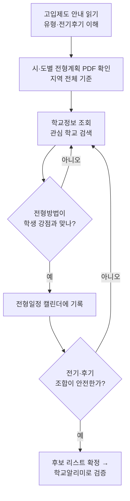
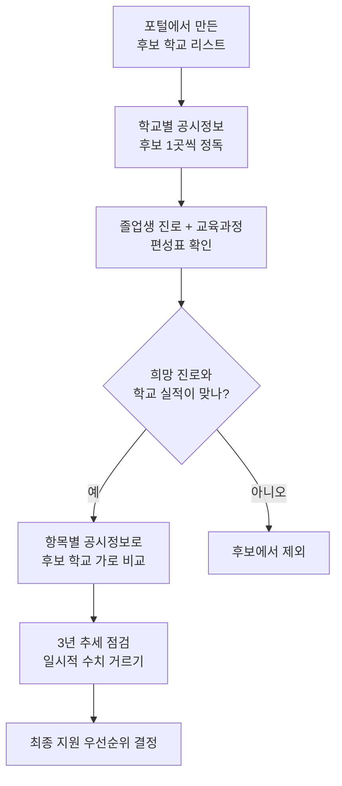
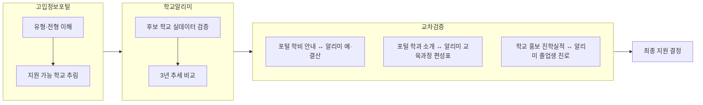
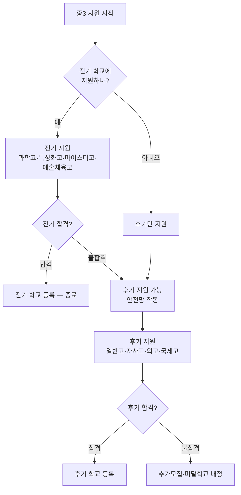
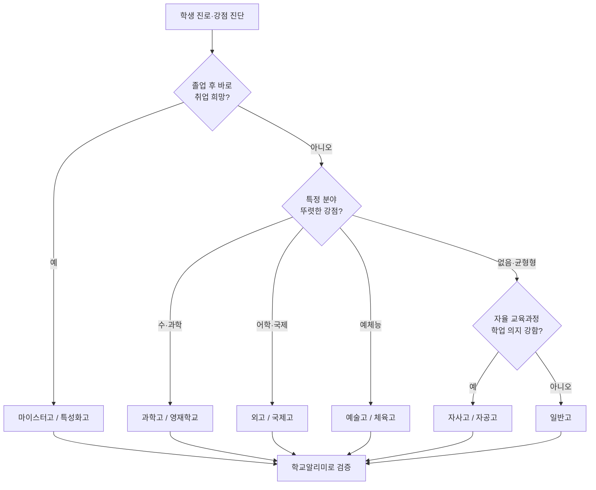
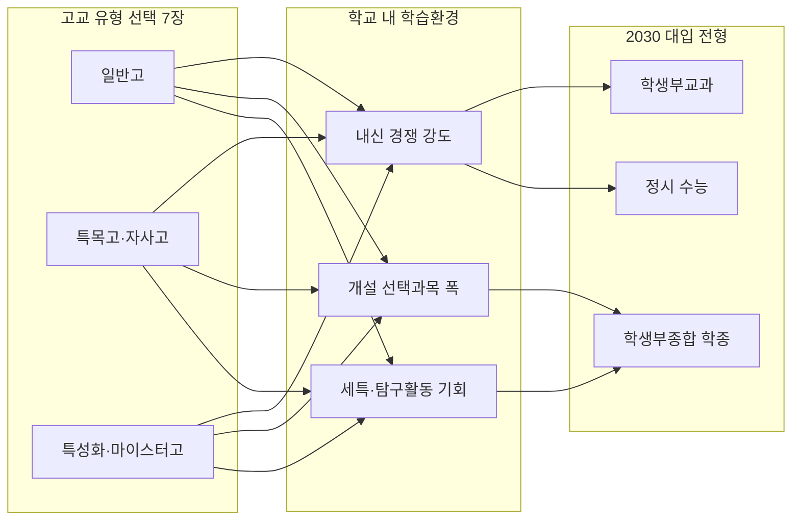
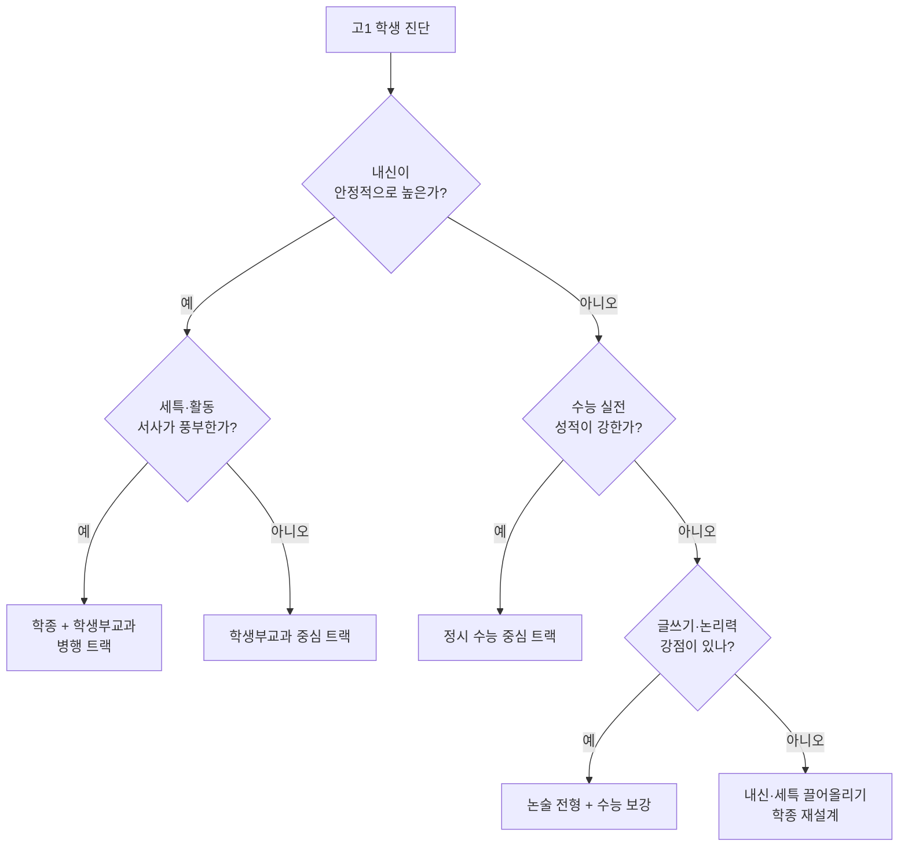

# 고입 정보 사이트 활용 가이드 (교사용 레퍼런스)

> **대상**: 중학교 3학년 고입 준비 지도 교사
> **목적**: 고입정보포털·학교알리미 두 사이트의 메뉴별 핵심 내용과 실전 활용법 + 고교 유형 선택이 대입(내신·수능·학종)으로 이어지는 구조 정리
> **활용 시기**: 중3 1학기말 ~ 원서 접수 직전 (대략 6월 ~ 11월)
> **적용 입시 기준**: 현 중3(2026년) → 2027년 고1 입학 → **2030학년도 대입** → **2028 대입개편 체제 적용 대상**

---

## 0. 문서 사용법

```
고입_정보_사이트_가이드
├── 1. 두 사이트 한눈에 비교        → 어떤 사이트를 언제 쓰는지 판단
├── 2. 고입정보포털 (hischool)      → "어디에 어떻게 지원하나" (제도·일정)
├── 3. 학교알리미 (schoolinfo)      → "그 학교가 진짜 어떤가" (실데이터)
├── 4. 두 사이트 교차검증 프로세스  → 정보를 엮어서 결론 내는 법
├── 5. 중3 월별 활용 타임라인       → 학사일정에 맞춘 지도 순서
├── 6. 수업 활용 팁 & 흔한 오해     → 학생 지도 시 주의점
├── 7. 고등학교 유형별 진학 전략    → 5개 유형 + 합격(입학전형) 구조  ★신규
├── 8. 고교 선택 → 대입 연결 구조   → 2028 개편이 만드는 인과관계  ★신규
└── 9. 내신·수능·학종 세 갈래 트랙  → 대입 전형별 핵심과 유형 매칭  ★신규
```

> **문서 전체의 한 줄 논리**: *고입정보포털·학교알리미로 "갈 학교"를 정하고(1~6장), 그 선택이 3년 뒤 대입에서 어떤 카드로 이어지는지를 역산한다(7~9장).*

---

## 1. 두 사이트 한눈에 비교

| 구분 | 고입정보포털 (hischool.go.kr) | 학교알리미 (schoolinfo.go.kr) |
|---|---|---|
| 운영 성격 | 고교 **입학 전형** 안내 포털 | 초·중·고 **교육정보 공시** 서비스 |
| 핵심 질문 | "**어디에, 어떻게, 언제** 지원하나?" | "그 학교는 **실제로 어떤 학교**인가?" |
| 대표 정보 | 모집요강, 전형일정, 전형방법, 학교 유형 | 학업성취도, 졸업생 진로, 학비, 교육과정 편성표 |
| 정보 성격 | 제도·규칙 (확정 공고) | 통계·실적 (최근 3년 공시 데이터) |
| 갱신 주기 | 학년도별 전형계획 공고 시점 | 법령에 따라 연 1~2회 정기 공시 |
| 지도 활용 단계 | 1단계 — 지원 가능 범위 파악 | 2단계 — 후보 학교 검증·비교 |

> **핵심 원칙**: 고입정보포털로 **"갈 수 있는 학교"를 좁히고**, 학교알리미로 **"갈 만한 학교인지"를 검증**한다. 두 사이트는 경쟁 관계가 아니라 **순서 관계**다.

---

## 2. 고입정보포털 (hischool.go.kr)

### 2-1. 사이트 성격

- 전국 고등학교의 **모집 요강과 고입 전형 기본계획**을 모아 둔 공식 포털
- "이 학교에 지원하려면 무엇이 필요한가"를 확인하는 곳
- **주의**: 전형 일정·방법은 매 학년도 새로 공고되므로 **반드시 해당 학년도 자료인지 확인**

### 2-2. 메뉴 구조 (tree)

```
고입정보포털
├── 고입제도 안내
│   ├── 고등학교 유형 설명 (일반고/특목고/특성화고/자율고/마이스터고)
│   ├── 전형 구분 (전기/후기)
│   └── 지원 방법·중복지원 제한 규정
├── 시·도별 전형계획
│   └── 17개 시도교육청 고입전형 기본계획 원문 (PDF)
├── 학교정보 조회  ★ 가장 많이 쓰는 메뉴
│   ├── 지역·유형·키워드로 학교 검색
│   └── 학교 상세 페이지
│       ├── 학교 개요 (소재지·설립유형·연락처)
│       ├── 모집요강 / 모집 인원
│       ├── 전형방법 (서류·면접·실기 등 반영 요소)
│       ├── 전형일정 (원서접수~합격발표)
│       └── 학과·계열 정보 (특성화고·마이스터고)
└── 공지사항 / 자료실
    └── 전형 일정 변경·정정 공고
```

### 2-3. 메뉴별 "유심히 봐야 할 것" (교사 체크포인트)

| 메뉴 | 주로 들어 있는 내용 | 교사가 짚어줄 포인트 |
|---|---|---|
| 고등학교 유형 설명 | 5개 유형의 교육 목적·졸업 후 진로 | 학생이 **유형 차이**부터 이해해야 학교 선택이 가능 |
| 전형 구분(전기/후기) | 어떤 학교가 전기, 어떤 학교가 후기인지 | **전기 불합격 시 후기 지원 가능** — 지원 전략의 핵심 |
| 중복지원 제한 규정 | 동시 지원 불가 조합 | 위반 시 **합격 취소**까지 가능 → 반드시 사전 확인 |
| 시·도별 전형계획 PDF | 지역 전체의 일정·평가 기준 총괄 | 개별 학교 요강보다 **먼저** 읽어야 할 기준 문서 |
| 학교 상세 — 전형방법 | 내신·출결·면접·실기 등 **반영 비율** | 학생 강·약점과 매칭 (예: 내신 약하면 면접 비중 큰 곳) |
| 학교 상세 — 전형일정 | 원서접수일, 발표일 | **날짜 충돌** 여부 점검, 캘린더에 표시 |
| 공지사항 | 일정 정정·추가 모집 공고 | 원서 접수 2~3주 전 **재확인 필수** |

### 2-4. 학교 상세 페이지에서 꼭 확인할 5가지

1. **모집 인원** — 작년 대비 증감, 학과별 정원
2. **전형 요소와 반영 비율** — 내신 / 출결·봉사 / 면접 / 실기의 배점
3. **지원 자격** — 거주지 제한, 졸업(예정) 요건, 우선·특별전형 조건
4. **전형 일정** — 원서접수 → (면접·실기) → 합격발표 → 등록 날짜
5. **전기/후기 구분** — 이 학교가 불합격일 때 다음 카드가 무엇인지

### 2-5. 활용 순서도



---

## 3. 학교알리미 (schoolinfo.go.kr)

### 3-1. 사이트 성격

- 「교육관련기관의 정보공개에 관한 특례법」에 따라 전국 초·중·고가 **의무 공시**하는 데이터 서비스
- 학교가 직접 입력·공개한 **객관 통계** — 홍보 문구가 아닌 실데이터
- 최근 **3개년 자료**가 함께 보여 추세 비교 가능

### 3-2. 공시정보 구조 (tree)

```
학교알리미
├── 전국학교정보
│   ├── 학교별 공시정보  ★ 학교 하나를 깊게 볼 때
│   └── 항목별 공시정보  ★ 여러 학교를 같은 항목으로 비교할 때
├── 공시 항목 (법정 15개 영역)
│   ├── 학생 현황 (학급수·학생수·전출입)
│   ├── 교육활동 (학교교육과정 편성·운영)
│   ├── 교원 현황
│   ├── 교육여건 (시설·급식·보건)
│   ├── 학업성취 사항          ◆ 진학 판단 핵심
│   ├── 졸업생 진로 현황       ◆ 진학 판단 핵심
│   ├── 예·결산 / 학교회계      ◆ 학비 관련
│   ├── 학교폭력 예방·대응 현황
│   └── 학교규칙·학교운영 등
└── 데이터 다운로드 (엑셀 원자료)
```

### 3-3. 중3 진학 관점 — 우선순위 항목 (교사 해석 가이드)

| 우선순위 | 공시 항목 | 무엇이 들어 있나 | 진학 지도 시 해석법 |
|---|---|---|---|
| ★★★ | 졸업생 진로 현황 | 대학 진학률, 취업률, 진로 미결정 비율 | 일반고는 진학률, 특성화·마이스터고는 **취업률**을 봐야 함 |
| ★★★ | 학교 교육과정 편성표 | 학년별 개설 과목, 선택과목 종류 | 학생 희망 진로 과목(예: 제2외국어, 과학·예체능)이 **실제 개설**되는지 |
| ★★★ | 학업성취 사항 | 교과별 성취도 분포, 평가 결과 | 단일 수치 맹신 금지 — **3년 추세**와 학교 규모 함께 볼 것 |
| ★★ | 학교회계 예·결산 | 수업료, 학부모 부담금, 방과후 비용 | 자율고·사립은 **실제 학비 부담** 확인 (포털 안내와 교차검증) |
| ★★ | 학생 현황 | 학급당 학생수, 전출입 추이 | 잦은 전출은 신호일 수 있음 / 학급 규모는 학습 환경 지표 |
| ★★ | 학교폭력 예방·대응 | 심의 건수, 예방교육 실시 현황 | 절대 수치보다 학교 규모 대비·추세로 해석 |
| ★ | 교원 현황 | 교원 수, 정규·기간제 비율 | 특정 교과 교원 구성 참고 (특목·특성화 시 의미 큼) |
| ★ | 시설·급식·보건 | 통학 여건, 급식 운영, 기숙사 유무 | 원거리 학교는 **기숙사·통학** 정보가 결정적일 수 있음 |

### 3-4. 정보 찾는 두 가지 경로

| 경로 | 언제 쓰나 | 방법 |
|---|---|---|
| 학교별 공시정보 | 후보 학교 **한 곳을 깊게** 분석 | 학교명 검색 → 한 학교의 15개 항목 전체 열람 |
| 항목별 공시정보 | 후보 학교 **여러 곳을 비교** | 항목(예: 졸업생 진로) 선택 → 학교 간 같은 지표 나란히 비교 |

### 3-5. 활용 순서도



---

## 4. 두 사이트 교차검증 프로세스

> 한 사이트만 보면 **반쪽 결론**이 난다. 아래 흐름으로 엮어야 한다.



### 교차검증 체크리스트

| 검증 항목 | 고입정보포털에서 | 학교알리미에서 | 둘이 다르면? |
|---|---|---|---|
| 학비 부담 | 모집요강의 학비 안내 | 학교회계 예·결산 실비용 | **알리미 실데이터** 우선 신뢰 |
| 개설 과목 | 학과·계열 소개 | 교육과정 편성표 | 편성표에 없으면 미개설로 간주 |
| 진학·취업 실적 | (학교 자체 홍보 자료) | 졸업생 진로 현황 공시 | 공시 데이터를 기준으로 |
| 모집 규모 | 모집요강 정원 | 학생 현황(학급·학생수) | 정원과 실제 규모 함께 해석 |

---

## 5. 중3 월별 활용 타임라인

| 시기 | 사이트 | 주요 활동 | 산출물 |
|---|---|---|---|
| 6~7월 | 고입정보포털 | 고교 유형·전기후기 제도 학습 (→ 7장) | 학생별 "관심 유형" 정리 |
| 7~8월 | 학교알리미 | 관심 학교 공시정보 탐색 | 후보 학교 5~7곳 롱리스트 |
| 9월 | 양쪽 교차 | 시·도별 전형계획 공고 정독 | 전형방법·일정 비교표 |
| 10월 | 양쪽 교차 | 교차검증 체크리스트 적용 + 대입 연계 점검 (→ 8·9장) | 지원 우선순위 숏리스트 |
| 11월 | 고입정보포털 | 공지사항 일정 정정 재확인 | 원서접수 D-day 캘린더 |
| 접수 직전 | 고입정보포털 | 중복지원 제한·자격요건 최종 점검 | 원서 제출 |

---

## 6. 수업 활용 팁 & 흔한 오해

### 교사 수업 활용 팁

| 팁 | 구체적 방법 |
|---|---|
| 비교표를 학생이 직접 채우게 | 후보 3개 학교를 알리미 항목으로 가로 비교하는 워크시트 |
| "추세"를 강조 | 한 해 수치가 아니라 3개년 흐름을 그래프로 그리게 |
| 출처 구분 훈련 | 학교 홍보물 vs 공시 데이터를 나란히 놓고 차이 찾기 |
| 일정 시각화 | 전형일정을 달력에 색칠 — 날짜 충돌을 눈으로 확인 |
| 3년 뒤를 역산 | "이 고교를 가면 대입에서 어떤 전형이 유리한가"를 함께 따져보기 (→ 8·9장) |

### 흔한 오해 바로잡기

| 학생·학부모의 오해 | 사실 |
|---|---|
| "포털에 나온 작년 일정이 올해도 같다" | 전형 일정·방법은 **학년도마다 새로 공고** |
| "진학률 높은 학교 = 좋은 학교" | 학교 규모·지역·학생 구성에 따라 의미가 다름 |
| "전기 한 곳만 쓰면 된다" | 불합격 대비 **후기 안전망**까지 설계해야 함 |
| "학교 홈페이지 진학 실적이 곧 공식 수치" | 공식 비교 기준은 **학교알리미 공시 데이터** |
| "공시 수치 하나로 줄세우기가 된다" | 단일 지표 줄세우기 금지 — 여러 항목·추세 종합 |
| "특목·자사고 가면 무조건 대입에 유리하다" | 내신 5등급제에서 **학교 내 경쟁이 치열한 곳은 내신 불리** — 유형별 손익 따져야 함 (→ 8장) |
| "내신은 9등급이라 한 번 미끄러지면 끝" | 현 중3은 **5등급제** 적용 — 등급 구간이 넓어져 만회 여지가 큼 (→ 9-1) |

---

## 7. 고등학교 유형별 진학 전략 ★신규

> 고교 선택의 출발점은 **유형 차이의 이해**다. 같은 "고등학교"라도 입학 시기·선발 방식·내신 환경·대입 주력 전형이 모두 다르다.

### 7-1. 5개 유형 한눈에 (tree)

```
고등학교
├── 일반고 (일반계 고등학교)
│   └── 보통교과 중심, 폭넓은 진로 — 가장 다수
├── 특수목적고 (특목고)
│   ├── 과학고            → 이공계 영재 (전기, 가장 빠름)
│   ├── 외국어고·국제고   → 어학·국제 (후기, 일반고와 동시)
│   ├── 예술고·체육고     → 예체능 실기 (전기)
│   └── 마이스터고        → 산업수요맞춤형, 취업 직결 (전기)
├── 특성화고
│   ├── 직업계열          → 특정 직무·자격증 (전기)
│   └── 대안교육 특성화고  → 체험·인성 중심 교육과정
├── 자율고 (자율형 고등학교)
│   ├── 자율형사립고(자사고) → 교육과정 자율, 후기 선발
│   └── 자율형공립고(자공고) → 공립의 자율 운영
└── 영재학교 (별도 트랙)
    └── 과학영재학교 — 「영재교육진흥법」, 초중등교육법 밖 / 원서 가장 이름(3~4월)
```

> **2025년 정책 메모**: 한때 2025년 일반고 일괄 전환이 예고됐던 **자사고·외고·국제고는 "존치" 확정**(2024년 시행령 개정). 단 모집전형의 일정 비율을 **사회통합전형**으로 선발하고, **자기주도학습전형**(2단계 면접에서 교과지식 평가 금지)을 유지하는 조건이다.

### 7-2. 유형별 비교표 (교사용 핵심 매트릭스)

| 유형 | 전형 시기 | 주요 선발 방식 | 내신 경쟁 강도 | 대입 주력 전형 | 적합한 학생 |
|---|---|---|---|---|---|
| 일반고 | 후기 | 거주지 기반 배정 / 일부 선발 | 학교별 편차 — 보통~중 | 학생부교과·학생부종합·정시 **고루** | 진로 미확정·균형형, 안정 지향 |
| 과학고 | 전기 (가장 빠름) | 자기주도학습전형(서류+면접) | 매우 높음 (우수 학생 밀집) | 학생부종합(이공계 특화) | 수·과학 뚜렷한 강점, 탐구형 |
| 외고·국제고 | 후기 (일반고와 동시) | 자기주도학습전형(영어 내신+면접) | 높음 | 학생부종합(어문·국제·사회계열) | 어학·인문사회 진로 뚜렷 |
| 예술고·체육고 | 전기 | 실기고사 + 내신 | 실기 중심 | 실기 위주 전형 / 특기자 | 예체능 진로 확정, 실기 준비됨 |
| 마이스터고 | 전기 | 내신 + 면접 + 인적성 | 중 | **취업** 우선 (대입은 후순위) | 졸업 후 바로 취업·전문기술 희망 |
| 특성화고 | 전기 | 내신 + 면접 (학과별) | 중·하 | 취업 / 재직자·특별전형 대입 | 직무·자격증 중심 진로 |
| 자사고 | 후기 | 자기주도학습전형(추첨+면접) | 높음 | 학생부종합·정시 | 학업 의지 강함, 자율 교육과정 선호 |
| 자공고 | 후기 | 거주지 기반 배정 (일반고에 준함) | 일반고와 유사 | 일반고와 유사 | 일반고 + 자율 프로그램 원함 |

> **읽는 법**: "전형 시기"는 합격 전략의 뼈대(7-3), "내신 경쟁 강도"는 대입 내신 손익(8장), "대입 주력 전형"은 9장과 연결된다.

### 7-3. 합격(입학전형) 구조 — 전기·후기와 안전망 설계



**합격 전략 핵심 3원칙**

| 원칙 | 내용 | 지도 포인트 |
|---|---|---|
| 전기-후기 2단 구조 | 전기 불합격해도 후기 카드가 살아 있다 | 전기는 "도전", 후기는 "안전망"으로 역할 분담 |
| 중복지원 제한 확인 | 동시 지원 불가 조합 존재 (시·도별 상이) | 위반 시 **합격 취소** — 포털 규정 반드시 사전 확인 |
| 자기주도학습전형 이해 | 자사고·외고·국제고·과학고 공통 선발 틀 | 1단계 서류(중학 내신+학생부) → 2단계 면접 / **교과 지식 평가 금지** |

> **교사 메모**: 자기주도학습전형 2단계 면접은 "선행학습 지식"이 아니라 **자기주도 학습경험·인성·진로계획**을 본다. 학생부 기반 자기소개·면접 준비를 중3 2학기에 시작하도록 안내.

### 7-4. 유형 선택 의사결정 순서도



---

## 8. 고교 선택 → 대입 연결 구조 (2028 대입개편) ★신규

> 고교 유형 선택은 단순히 "3년 다닐 학교"가 아니라 **3년 뒤 대입 전형 카드의 범위를 미리 정하는 일**이다. 현 중3은 **2028 대입개편 체제**의 적용 대상이다.

### 8-1. 현 중3의 입시 로드맵 (2026 → 2030)

| 시점 | 학년 | 핵심 이벤트 |
|---|---|---|
| 2026년 | 중3 | 고입 준비 — 유형·학교 선택 |
| 2027년 | 고1 | 입학, **5등급 내신제 본격 적용** / 고교학점제 운영 |
| 2028년 | 고2 | 진로·선택과목 심화 |
| 2029년 | 고3 | 수시 원서 / **2030학년도 통합형 수능 응시** |
| 2030년 | 대입 | 수시·정시 전형 결과 |

> 2028 대입개편안은 2023년 12월 27일 확정·발표되었으며, **2022 개정 교육과정을 적용받는 2025년 고1 신입생부터** 적용된다. 현 중3은 2027년 고1이므로 **개편 체제에 그대로 포함**된다.

### 8-2. 2028 개편 3대 변화 (확정안 요약)

| 영역 | 이전(현행) | 2028 개편 후 | 학생 체감 변화 |
|---|---|---|---|
| 내신 | 9등급 상대평가 | **5등급 상대평가 + 절대평가(성취도) 병기** | 등급 구간이 넓어져 한 번 실수의 타격이 작아짐 |
| 수능 | 국어·수학·탐구 **선택과목제** | **선택과목 폐지, 통합형** (모두 공통) / 사회·과학탐구 → **통합사회·통합과학** | "과목 유불리·표준점수 게임" 축소, 동일 기준 평가 |
| 학생부·전형 | 학종 중심 정성평가 | **세특 중심 정성평가 유지 + 정시에도 학생부(교과) 평가 확대** | 내신·세특이 수시·정시 **모두**에 영향 |

> **심화수학 메모**: 개편 논의 중 거론되던 '심화수학(미적분Ⅱ·기하)'은 **수능에서 최종 제외**되었다.

### 8-3. 고교 유형이 대입 전형에 미치는 영향



**유형별 대입 손익 표 (교사 해석용)**

| 고교 유형 | 내신 면 | 수능 면 | 학종 면 | 종합 코멘트 |
|---|---|---|---|---|
| 일반고 | 학교 내 경쟁이 상대적으로 완만 → **상위 내신 확보 유리** | 학교별 편차 | 세특·활동은 학생 노력에 좌우 | 학생부교과 전형의 본진. 균형 전략 가능 |
| 특목고·자사고 | 우수 학생 밀집 → **내신 따기 불리** | 수능 대비 인프라 강함 | 탐구·심화활동 기회 풍부 → **학종·정시 유리** | 내신 손해를 학종·수능으로 상쇄하는 구조 |
| 특성화·마이스터고 | 내신 확보 비교적 수월 | 수능 중심 대비는 약함 | 직무·자격 강점 서사 가능 | 대입 시 **특별전형(특성화고 전형 등)** 활용 |

> **지도 핵심**: "좋은 고교"가 아니라 **"이 학생의 대입 전략과 맞는 고교"**를 골라야 한다. 내신이 강점인 학생이 특목고에 가면 5등급제에서도 내신이 불리해질 수 있다.

---

## 9. 내신·수능·학종 세 갈래 트랙 ★신규

> 대입은 결국 **내신(학생부교과) · 학종(학생부종합) · 수능(정시)** 세 갈래로 수렴한다. 각 트랙의 핵심과 고교 유형 매칭을 정리한다.

### 9-1. 트랙 ① 내신 — 5등급 상대평가

**5등급제 등급 비율 (2028 개편)**

| 등급 | 해당 비율 | 누적 비율 |
|---|---|---|
| 1등급 | 상위 10% | 10% |
| 2등급 | 다음 24% | 34% |
| 3등급 | 다음 32% | 66% |
| 4등급 | 다음 24% | 90% |
| 5등급 | 하위 10% | 100% |

**9등급제 vs 5등급제 비교**

| 구분 | 9등급제(현행) | 5등급제(2028) |
|---|---|---|
| 1등급 비율 | 상위 4% | 상위 10% |
| 등급 수 | 9개 (촘촘) | 5개 (넓음) |
| 한 번 실수의 타격 | 큼 | 상대적으로 작음 |
| 평가 병기 | 석차등급 중심 | **석차등급 + 성취도(절대평가) 병기** |

> **지도 포인트**: 1등급 폭이 4% → 10%로 넓어져 **상위권 진입 문턱이 완화**된다. 다만 변별력이 약해진 만큼 대학은 **세특 등 정성요소**를 더 본다(9-3).

### 9-2. 트랙 ② 수능 — 통합형 (2030학년도 응시)

| 영역 | 2028 개편 후 구조 |
|---|---|
| 국어 | 선택과목 폐지 → **공통** (화법과작문·언어와매체 구분 없음) |
| 수학 | 선택과목 폐지 → **공통** (확통·미적분·기하 구분 없음, 심화수학 미도입) |
| 영어 | 절대평가 유지 |
| 탐구 | 사회·과학탐구 선택 폐지 → **통합사회 + 통합과학** 응시 |
| 한국사 | 필수 (절대평가) |

> 핵심 메시지: "어떤 선택과목이 점수에 유리한가" 전략이 사라지고 **모든 응시생이 같은 과목·기준**으로 평가받는다.

### 9-3. 트랙 ③ 학종 — 학생부종합전형

| 평가 요소 | 무엇을 보나 | 어디에 기록되나 |
|---|---|---|
| 학업역량 | 교과 성취, 학업 태도 | 교과 성적, **세특(세부능력 및 특기사항)** |
| 진로역량 | 진로 관련 탐구·선택과목 이수 | 세특, 창의적 체험활동 |
| 공동체역량 | 협업·책임·인성 | 행동특성 및 종합의견, 동아리 |

> **세특의 위상**: 세특은 교과 교사가 학생 관찰 내용을 **과목당 500자 이내**로 적는 항목으로, 5등급제로 내신 변별이 약해진 만큼 학종에서 **비중이 더 커진다**. 또한 2028 체제에서는 **정시 전형에도 학생부(교과) 평가가 확대**되어, 세특·내신이 수시뿐 아니라 정시에도 영향을 준다.

### 9-4. 대입 4대 전형 한눈에

| 전형 | 핵심 평가 요소 | 수능최저 | 유리한 학생 |
|---|---|---|---|
| 학생부교과 | **내신 등급** 정량 | 적용 多 | 내신이 안정적으로 높은 학생 (일반고 강세) |
| 학생부종합(학종) | 내신 + **세특·활동** 정성 | 일부 적용 | 탐구·활동 서사가 풍부한 학생 |
| 논술 | 논술고사 + 내신 일부 | 적용 多 | 글쓰기·문제해결력 강점 |
| 정시(수능) | **수능 점수** + (개편 후) 학생부 일부 | — | 수능 실전 강한 학생 |

### 9-5. 학생 유형별 대입 트랙 추천 알고리즘



### 9-6. 고교 유형 × 대입 전형 적합도 매트릭스

| 고교 유형 | 학생부교과 | 학생부종합 | 논술 | 정시(수능) |
|---|---|---|---|---|
| 일반고 | ◎ | ○ | ○ | ○ |
| 특목고(과학·외고·국제) | △ | ◎ | ○ | ◎ |
| 자사고 | △ | ◎ | ◎ | ◎ |
| 특성화·마이스터고 | ○(특별전형) | ○ | △ | △ |

> 범례: ◎ 매우 유리 · ○ 유리 · △ 제한적
> **해석**: 특목·자사고는 내신 정량평가(학생부교과)에서 불리하지만, 학종·정시·논술로 만회하는 구조다. 반대로 일반고는 학생부교과가 본진이되 학생 노력에 따라 전 트랙이 열려 있다.

### 9-7. 수업 활용 — "역산 워크시트"

| 단계 | 학생 활동 |
|---|---|
| 1 | 희망 진로·전공 적기 |
| 2 | 그 전공에 유리한 **대입 전형**(9-4) 고르기 |
| 3 | 그 전형에 유리한 **고교 유형**(9-6 매트릭스) 역산하기 |
| 4 | 7장 의사결정 순서도와 대조 — 일치/불일치 확인 |
| 5 | 학교알리미로 후보 학교의 교육과정·진로실적 검증 |

---

## 부록. 사이트 빠른 참조

| 사이트 | 주소 | 한 줄 요약 |
|---|---|---|
| 고입정보포털 | hischool.go.kr | 전국 고교 모집요강·전형일정·기본계획 확인 |
| 학교알리미 | schoolinfo.go.kr | 학비·교육과정 편성표·진학실적 공시 데이터 교차검증 |
| 교육부 2028 대입개편 확정안 | moe.go.kr | 내신 5등급·통합형 수능 원문 (2023.12.27 발표) |

> **지도 한 줄 요약**: *포털로 길을 찾고, 알리미로 그 길을 검증하고, 2028 개편 체제(7~9장)로 그 길의 3년 뒤를 역산한다.*

---

> **출처 메모 (2028 대입개편 관련 사실 근거)**
> - 교육부, 「미래 사회를 대비하는 2028 대학입시제도 개편 확정안」, 2023.12.27 발표
> - 내신 5등급 비율(10·24·32·24·10%), 선택과목 폐지 통합형 수능, 통합사회·통합과학, 심화수학 제외, 정시 학생부 평가 확대
> - 자사고·외고·국제고 존치 확정(2024년 초중등교육법 시행령 개정)
> - 적용 대상: 2025년 고1 신입생부터 / 수능은 2028학년도(2027년 말 시행)부터 — 현 중3은 적용 대상
