# 🌟 나를 찾는 여행 — 직업 적성 탐색 검사
> **"나는 어떤 사람일까? 나에게 딱 맞는 직업은 뭘까?"**
> 이 검사는 정답이 없어요. 지금 이 순간의 솔직한 내 모습을 발견하는 시간이에요!

---

## 🗺️ 여행 안내판

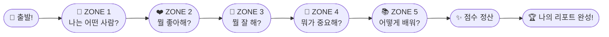

| 항목 | 내용 |
|------|------|
| ⏱️ 소요 시간 | 약 20~30분 (쉬엄쉬엄 해도 괜찮아요!) |
| 📋 문항 수 | 총 75문항 (5개 ZONE × 15문항) |
| 🎯 응답 방법 | 😶전혀 아님(1점) ~ 😄완전 그렇다(5점) |
| 💡 목적 | 나를 더 잘 알고, 내게 맞는 길 찾기 |

> 💬 **이렇게 해보세요!**
> 너무 오래 생각하지 말고 **"음, 나는 어떤 편이지?"** 하고 바로 느끼는 대로 표시하세요.
> 맞고 틀리는 답이 없어요. 지금의 나를 가장 솔직하게 표현하는 게 최고예요! 🙌

---

# 🗺️ ZONE 구조 완전 해부 — 마인드맵 & 직업 적성 연결 가이드

> 각 ZONE이 **무엇을 묻고, 왜 묻고, 직업 찾기에 어떻게 쓰이는지** 한눈에 볼 수 있어요!

---

## 🔭 5개 ZONE 전체 구조 마인드맵

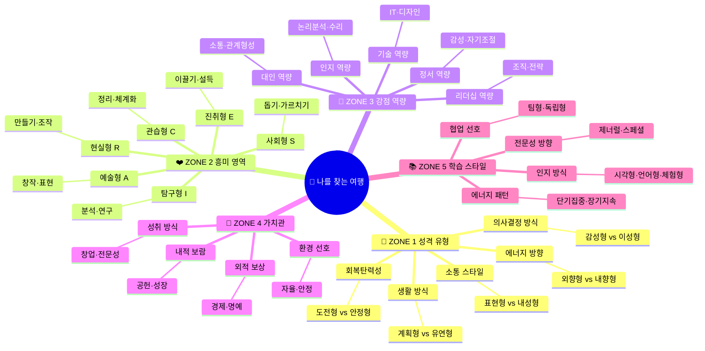

---

## 🧠 ZONE 1 마인드맵 — 성격 유형 탐험

### 구조도

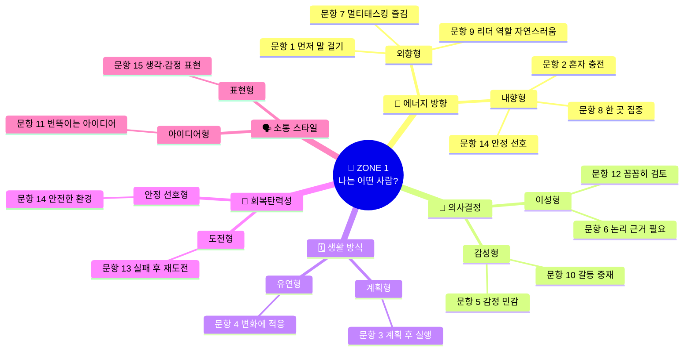

### 핵심 질문 & 학습 목표

| 핵심 질문 | 중점 포인트 | 학습 목표 |
|---------|-----------|---------|
| "나는 사람들과 있을 때 에너지가 오르나요, 혼자 있을 때 오르나요?" | 에너지 충전 방향 | 외향/내향 성향 파악 → 팀워크 vs 독립 업무 적합도 |
| "계획 없이 움직이면 불안한가요, 괜찮은가요?" | 구조 선호도 | 체계적 환경 vs 유연한 환경 선호 파악 |
| "논리? 감정? 결정할 때 뭐가 더 중요한가요?" | 의사결정 기준 | 데이터 기반 직종 vs 사람 중심 직종 적합도 |
| "실패하면 어떻게 반응하나요?" | 회복탄력성 | 도전적 직업 vs 안정적 직업 적합도 |

---

## ❤️ ZONE 2 마인드맵 — 흥미 영역 탐험

### 구조도

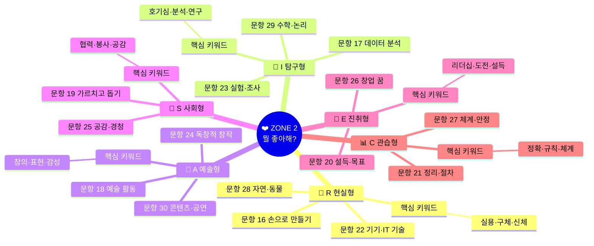

### 핵심 질문 & 학습 목표

| Holland 유형 | 핵심 질문 | 학습 목표 | 직업군 연결 |
|:-----------:|---------|---------|-----------|
| 🔧 R 현실형 | "손으로 만들거나 기계/자연을 다루는 게 즐거운가?" | 기술·제조·환경 직업 적합도 확인 | 엔지니어, 기능직, 농업, IoT 개발 |
| 🔬 I 탐구형 | "왜?라는 질문을 좋아하고 실험·분석이 재미있는가?" | 연구·과학·데이터 직업 적합도 확인 | 연구원, 데이터 과학자, 의사 |
| 🎨 A 예술형 | "뭔가를 창의적으로 만들고 표현하는 게 즐거운가?" | 창작·디자인·미디어 직업 적합도 확인 | 디자이너, 작가, 크리에이터 |
| 🤝 S 사회형 | "사람들을 돕고 가르치는 게 자연스럽고 보람차가?" | 교육·복지·상담 직업 적합도 확인 | 교사, 상담사, 사회복지사 |
| 🚀 E 진취형 | "리더가 되고 사람들을 이끌고 싶은가?" | 경영·영업·창업 직업 적합도 확인 | 창업가, 경영자, 마케터 |
| 📊 C 관습형 | "체계적으로 정리하고 규칙에 따라 일하는 게 편한가?" | 행정·회계·관리 직업 적합도 확인 | 회계사, 행정직, 데이터 운영 |

---

## 💪 ZONE 3 마인드맵 — 강점 역량 탐험

### 구조도

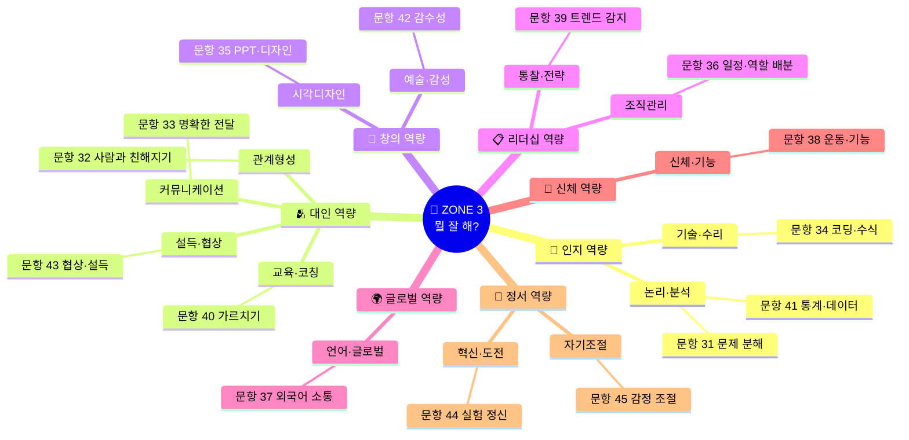

### 핵심 질문 & 학습 목표

| 역량군 | 핵심 질문 | 학습 목표 |
|------|---------|---------|
| 🧩 인지 역량 | "문제를 분석하고 데이터로 생각하는 것이 자연스러운가?" | 이성적 판단이 필요한 직업군 적합도 |
| 🫂 대인 역량 | "사람들과의 소통, 설득, 교육이 쉽고 재미있는가?" | 사람 중심 서비스·교육직 적합도 |
| 🎨 창의 역량 | "시각적 표현과 예술적 감수성이 강한가?" | 디자인·미디어·콘텐츠 직업 적합도 |
| 📋 리더십 역량 | "조직을 이끌고 전략적으로 생각하는 것이 자연스러운가?" | 경영·기획·전략직 적합도 |
| 🌍 글로벌 역량 | "외국어와 글로벌 환경이 어색하지 않은가?" | 국제 비즈니스·글로벌 기업 적합도 |
| 🧘 정서 역량 | "자기 감정을 조절하고 새로운 시도를 즐기는가?" | 고압 환경 및 창업·도전직 적합도 |

---

## 🌈 ZONE 4 마인드맵 — 가치관 탐험

### 구조도

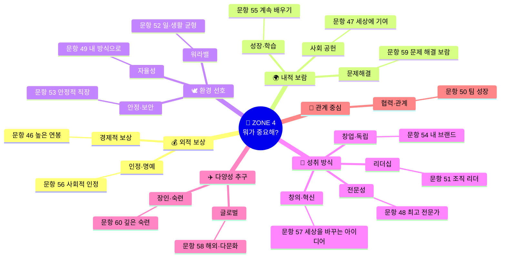

### 핵심 질문 & 학습 목표

| 가치 축 | 핵심 질문 | 학습 목표 | 직업 선택 기준 |
|-------|---------|---------|------------|
| 💰 외적 보상 | "돈과 명예가 직업 선택의 핵심인가?" | 연봉·성과급 구조 직업 탐색 | 금융, IT 대기업, 의사·변호사 |
| 🌍 내적 보람 | "의미와 성장이 더 중요한가?" | 사회적 기업, 교육, 공공 분야 탐색 | NGO, 교사, 연구직, 에듀테크 |
| 🕊️ 환경 선호 | "자유롭게 일하는 것 vs 안정적 직장, 뭐가 더 좋은가?" | 조직 문화 및 근무 형태 파악 | 프리랜서, 스타트업 vs 공무원, 대기업 |
| 🏅 성취 방식 | "전문가? 리더? 창업가? 어떤 방식으로 성취하고 싶은가?" | 커리어 성장 경로 방향 설정 | 스페셜리스트 vs 제너럴리스트 vs 창업가 |

---

## 📚 ZONE 5 마인드맵 — 학습 스타일 탐험

### 구조도

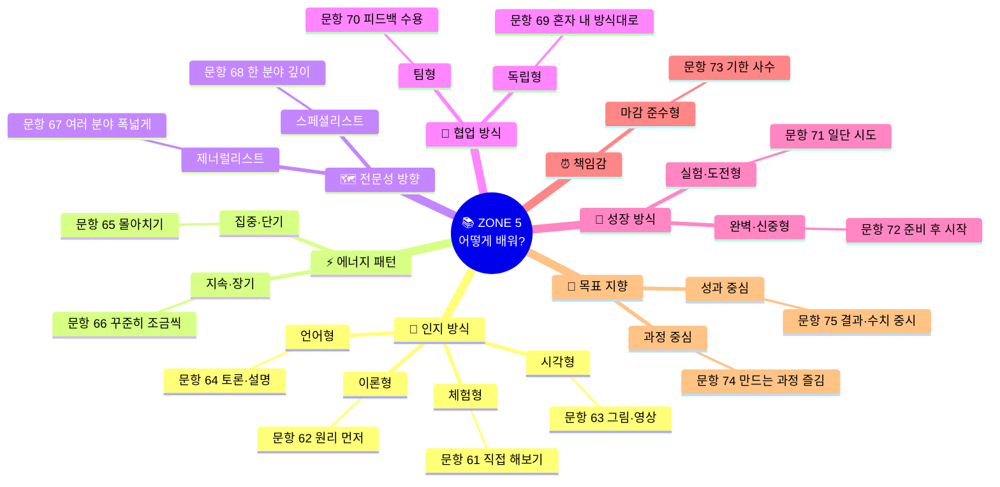

### 핵심 질문 & 학습 목표

| 스타일 축 | 핵심 질문 | 학습 목표 | 직업 환경 연결 |
|--------|---------|---------|------------|
| 🧠 인지 방식 | "어떻게 배울 때 가장 잘 이해되나요?" | 나의 최적 학습·업무 방식 파악 | 현장직 vs 연구직 vs 크리에이티브직 |
| ⚡ 에너지 패턴 | "단기 집중? 장기 꾸준함? 어느 쪽이 더 맞나요?" | 업무 리듬 파악 | 스타트업(빠른 스프린트) vs 연구소(장기 프로젝트) |
| 🗺️ 전문성 방향 | "넓게 알기 vs 깊게 파기, 어떤 게 더 재미있나요?" | 커리어 성장 경로 설정 | PM/기획자(제너럴) vs 개발자/연구원(스페셜) |
| 🎯 목표 지향 | "과정이 즐거우면 되나요, 결과가 보여야 하나요?" | 직업 만족도 예측 | 예술·교육직(과정) vs 영업·금융직(성과) |

---

## 📊 5개 ZONE → 직업 적성 연결 종합 매트릭스

> 각 ZONE의 결과가 합쳐져서 **어떤 직업군이 나오는지** 보여주는 지도예요!

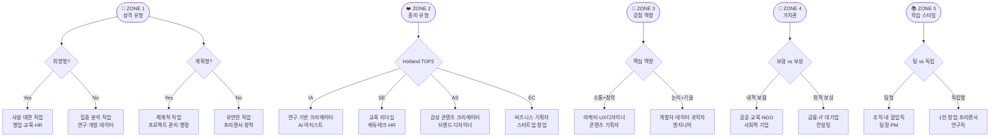

---

## 📈 ZONE별 점수가 직업 적성에 미치는 영향 — 가중치 표

| ZONE | 직업 탐색 기여 역할 | 낮을 때 (1~2점대) | 높을 때 (4~5점대) | 가중치 |
|:---:|-------------------|----------------|----------------|:-----:|
| 🧠 **ZONE 1** 성격 | 일하는 **환경과 조직 문화** 적합도 결정 | 자기이해 부족, 환경 미스매치 가능성 | 나에게 맞는 팀·조직 문화 명확 | ★★★★ |
| ❤️ **ZONE 2** 흥미 | **어떤 분야** 에서 일할지 방향 결정 | 흥미 분야 불명확, 탐색 더 필요 | Holland 코드로 직업군 좁혀짐 | ★★★★★ |
| 💪 **ZONE 3** 역량 | **구체적으로 할 수 있는 일** 결정 | 강점이 불명확, 다양한 체험 필요 | 직무 적합 직업 매우 구체화됨 | ★★★★★ |
| 🌈 **ZONE 4** 가치관 | **어떤 조건의 직업** 을 선택할지 결정 | 선택 기준 흐릿, 직업 불만족 위험 | 직업 만족도·지속성 높아짐 | ★★★★ |
| 📚 **ZONE 5** 학습 | **어떻게 성장**하고 일할지 방식 결정 | 학습 방식 비효율, 성장 속도 느림 | 최적 학습·업무 환경 파악 가능 | ★★★ |

---

## 🎯 ZONE 조합별 직업 적성 매핑 요약표

> **"나의 ZONE 결과 조합"** 에 따라 어떤 직업이 나오는지 빠르게 확인해 보세요!

| ZONE 2 흥미 | ZONE 3 강점 | ZONE 4 가치관 | → 추천 직업군 | AI 시대 직업 |
|:-----------:|:-----------:|:-------------:|-------------|------------|
| 🔧 R + 🔬 I | 기술·논리 | 전문성·문제해결 | 엔지니어, 개발자 | AI 로봇 엔지니어, ML 개발자 |
| 🔬 I + 🎨 A | 논리+창의 | 혁신·성장 | 연구 기반 디자이너 | AI 아티스트, 데이터 시각화 전문가 |
| 🎨 A + 🤝 S | 소통+창의 | 공헌·창의 | 교육 콘텐츠 크리에이터 | 에듀테크 기획자, 소셜미디어 교육자 |
| 🤝 S + 🚀 E | 소통+리더십 | 리더십·공헌 | 교육 리더, HR | 인재개발 디렉터, 교육 스타트업 창업 |
| 🚀 E + 📊 C | 전략+조직 | 경제보상·성취 | 경영자, 컨설턴트 | AI 비즈니스 전략가, SaaS 창업자 |
| 📊 C + 🔧 R | 수리+기술 | 안정·전문성 | 기술 관리직 | 클라우드 운영관리자, DevOps 엔지니어 |
| 🔬 I + 🤝 S | 분석+공감 | 공헌·성장 | 의료·상담·복지 전문가 | 디지털 헬스케어 연구원, AI 상담 플랫폼 기획 |
| 🎨 A + 🚀 E | 창의+리더십 | 혁신·명예 | 크리에이티브 디렉터 | 브랜드 스타트업 창업, 메타버스 콘텐츠 PD |

---

## 🔄 나의 직업 적성 발견 프로세스 — 전체 흐름도

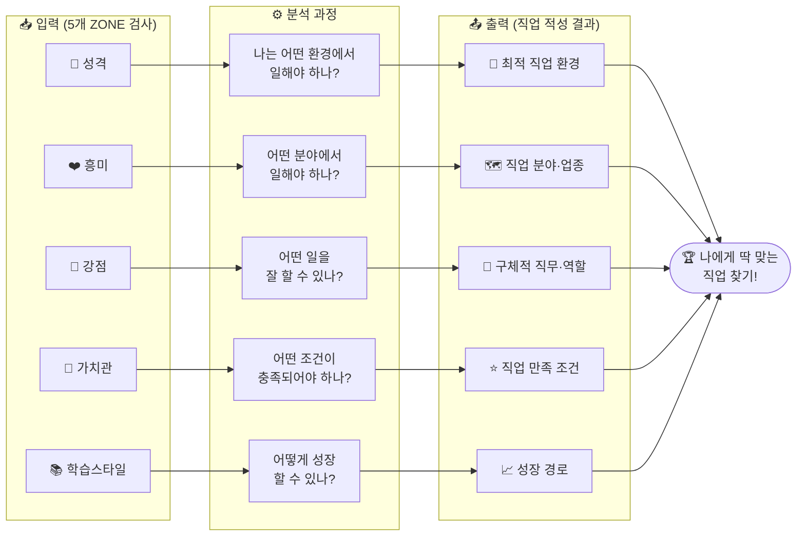

---

> 💡 **핵심 포인트 정리**
>
> | ZONE | 한 줄 역할 요약 |
> |:---:|--------------|
> | 🧠 ZONE 1 성격 | "**어떤 환경**에서 일할까?" 를 결정 |
> | ❤️ ZONE 2 흥미 | "**어떤 분야**에서 일할까?" 를 결정 |
> | 💪 ZONE 3 강점 | "**어떤 일**을 잘 할까?" 를 결정 |
> | 🌈 ZONE 4 가치관 | "**왜 그 일**을 할까?" 를 결정 |
> | 📚 ZONE 5 학습 | "**어떻게 성장**할까?" 를 결정 |
>
> 5개의 ZONE이 모두 맞아 떨어질 때 → **"이 직업이 나야!"** 라는 느낌이 와요! 🎯

---

## 🧠 ZONE 1. 나는 어떤 사람이에요? — 성격 탐험 (15문항)

> 일상 속에서 내가 어떻게 행동하고 반응하는지 알아봐요.
> 학교나 친구 관계에서의 내 모습을 떠올려 보세요!

**점수 기준:** 😶 1점(전혀 아님) — 😐 2점(별로 아님) — 😊 3점(보통) — 🙂 4점(그런 편) — 😄 5점(완전 나!)

| # | 문항 | 😶 1 | 😐 2 | 😊 3 | 🙂 4 | 😄 5 |
|---|------|:---:|:---:|:---:|:---:|:---:|
| 1 | 새로운 사람을 만나면 내가 먼저 "안녕!" 하고 말을 거는 편이에요. *(반 전학생이 오면 내가 먼저 다가가요!)* | ○ | ○ | ○ | ○ | ○ |
| 2 | 친구들과 신나게 놀고 난 후에는 혼자만의 시간이 필요해요. *(혼자 책 읽거나 음악 듣는 시간이 충전이 돼요!)* | ○ | ○ | ○ | ○ | ○ |
| 3 | 여행을 가거나 뭔가를 할 때 계획을 꼼꼼히 세워야 마음이 편해요. *(즉흥 여행보다 계획표가 좋아요!)* | ○ | ○ | ○ | ○ | ○ |
| 4 | 갑자기 계획이 바뀌어도 "오케이, 그럼 이렇게 하지 뭐!" 하고 금방 적응해요. *(변수가 생겨도 별로 당황하지 않아요!)* | ○ | ○ | ○ | ○ | ○ |
| 5 | 친구가 슬퍼 보이면 나도 왠지 마음이 무거워져요. *(상대방 기분이 내 기분에도 영향을 줘요!)* | ○ | ○ | ○ | ○ | ○ |
| 6 | "왜?"라는 이유가 없으면 뭔가 결정하기 불편해요. *(납득이 되어야 행동할 수 있어요!)* | ○ | ○ | ○ | ○ | ○ |
| 7 | 동시에 여러 가지를 하는 게 오히려 재미있고 에너지가 넘쳐요. *(공부하면서 음악 듣고 낙서하는 타입!)* | ○ | ○ | ○ | ○ | ○ |
| 8 | 하나에 꽂히면 다른 거 다 잊고 몇 시간이고 파고드는 편이에요. *(게임이든 공부든 한 번 시작하면 끝장내요!)* | ○ | ○ | ○ | ○ | ○ |
| 9 | 조별 과제를 할 때 자연스럽게 역할 배분하고 방향을 정하는 사람이 돼요. *(리더 역할이 어색하지 않아요!)* | ○ | ○ | ○ | ○ | ○ |
| 10 | 친구들이 싸울 때 중간에서 "야야, 우리 이렇게 하면 어때?" 하고 중재하는 편이에요. | ○ | ○ | ○ | ○ | ○ |
| 11 | 멍하니 있다가도 "아, 이런 아이디어 어때?" 하고 갑자기 번뜩이는 생각이 떠올라요. *(아이디어 뱅크 타입!)* | ○ | ○ | ○ | ○ | ○ |
| 12 | 뭔가를 제출하거나 마무리하기 전에 한 번 더 체크하는 게 습관이에요. *(오타나 실수를 잘 잡아내요!)* | ○ | ○ | ○ | ○ | ○ |
| 13 | 시험에서 망쳐도, 게임에서 져도 "에이, 다음엔 잘 하지!" 하고 금방 털어내요. | ○ | ○ | ○ | ○ | ○ |
| 14 | 모험보다는 익숙하고 안전한 환경에서 편안하게 지내는 게 더 좋아요. | ○ | ○ | ○ | ○ | ○ |
| 15 | 내 생각이나 감정을 말이나 글로 또렷하게 표현하는 편이에요. *(일기, 댓글, 발표가 두렵지 않아요!)* | ○ | ○ | ○ | ○ | ○ |

**🧮 ZONE 1 점수:** _______ / 75점

---

## ❤️ ZONE 2. 뭘 할 때 가장 신나요? — 흥미 탐험 (15문항)

> 내가 자연스럽게 끌리는 활동과 분야가 뭔지 찾아봐요!
> Holland RIASEC 직업 흥미 이론을 바탕으로 해요.

### Holland 6유형이란?

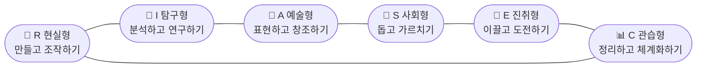

| # | 문항 | 😶 1 | 😐 2 | 😊 3 | 🙂 4 | 😄 5 | 유형 |
|---|------|:---:|:---:|:---:|:---:|:---:|:---:|
| 16 | 레고, 조립 로봇, 뭔가를 손으로 직접 만들고 수리하는 게 재미있어요. *(만들고 나면 뿌듯!)* | ○ | ○ | ○ | ○ | ○ | 🔧 R |
| 17 | 데이터나 숫자를 보고 "왜 이런 결과가 나왔지?" 궁금해서 파고드는 게 좋아요. *(과학 실험 같은 게 재미있어요!)* | ○ | ○ | ○ | ○ | ○ | 🔬 I |
| 18 | 그림 그리기, 음악 듣기/만들기, 글 쓰기 같은 예술 활동에 자꾸 손이 가요. | ○ | ○ | ○ | ○ | ○ | 🎨 A |
| 19 | 친구나 동생에게 뭔가를 가르쳐 주거나 도와줄 때 정말 보람을 느껴요. | ○ | ○ | ○ | ○ | ○ | 🤝 S |
| 20 | 친구들에게 내 아이디어를 설득하거나, 목표를 향해 함께 달리는 게 짜릿해요. | ○ | ○ | ○ | ○ | ○ | 🚀 E |
| 21 | 파일 정리, 일정 관리, 규칙대로 하는 작업이 나한테는 별로 귀찮지 않아요. *(오히려 깔끔해서 좋아!)* | ○ | ○ | ○ | ○ | ○ | 📊 C |
| 22 | 최신 기기, 앱, 코딩, IT 기술이 나오면 일단 써보고 싶어요. *(얼리어답터 성향!)* | ○ | ○ | ○ | ○ | ○ | 🔧 R |
| 23 | "왜 이렇게 되지?"라는 의문이 생기면 직접 실험하거나 조사해 봐야 직성이 풀려요. | ○ | ○ | ○ | ○ | ○ | 🔬 I |
| 24 | 아무도 안 해본 방식으로 뭔가를 만들거나 표현해 보고 싶다는 생각이 자주 들어요. | ○ | ○ | ○ | ○ | ○ | 🎨 A |
| 25 | 힘들어하는 친구의 이야기를 끝까지 들어주고 함께 고민해 주는 것이 자연스러워요. | ○ | ○ | ○ | ○ | ○ | 🤝 S |
| 26 | 언젠가 내 이름을 건 사업이나 브랜드를 만들어 보고 싶다는 꿈이 있어요. | ○ | ○ | ○ | ○ | ○ | 🚀 E |
| 27 | 자료를 깔끔하게 표로 만들거나, 정해진 절차대로 일하는 것이 안정감을 줘요. | ○ | ○ | ○ | ○ | ○ | 📊 C |
| 28 | 동물, 식물, 자연환경에 관심이 많고 자연 속에 있으면 마음이 편안해요. | ○ | ○ | ○ | ○ | ○ | 🔧 R |
| 29 | 수학 문제를 풀거나 퍼즐을 맞출 때 집중이 잘 되고 재미있어요. | ○ | ○ | ○ | ○ | ○ | 🔬 I |
| 30 | 유튜브 영상, 웹툰, 공연 같은 콘텐츠를 만들거나 무대에 서보고 싶어요. | ○ | ○ | ○ | ○ | ○ | 🎨 A |

**🧮 ZONE 2 점수:** _______ / 75점

### Holland 유형별 점수 정리

| 유형 | 해당 문항 | 내 점수 | 내 순위 |
|:---:|---------|:------:|:------:|
| 🔧 R (현실형) | 16, 22, 28번 합산 | /15 | 위 |
| 🔬 I (탐구형) | 17, 23, 29번 합산 | /15 | 위 |
| 🎨 A (예술형) | 18, 24, 30번 합산 | /15 | 위 |
| 🤝 S (사회형) | 19, 25번 합산 | /10 | 위 |
| 🚀 E (진취형) | 20, 26번 합산 | /10 | 위 |
| 📊 C (관습형) | 21, 27번 합산 | /10 | 위 |

---

## 💪 ZONE 3. 나는 뭘 잘 해요? — 강점 탐험 (15문항)

> 학교 수업, 취미, 친구 관계에서 내가 자연스럽게 잘 하는 것들을 찾아봐요!
> "잘 한다"는 건 1등이 아니에요. **"나는 이게 쉽고 재미있다"** 는 느낌이면 충분해요! 😊

| # | 문항 | 😶 1 | 😐 2 | 😊 3 | 🙂 4 | 😄 5 | 내 강점 |
|---|------|:---:|:---:|:---:|:---:|:---:|:------:|
| 31 | 복잡한 문제를 보면 "일단 이걸 나눠보자!" 하고 단계별로 쪼개는 게 자연스러워요. *(수학 풀이, 계획 세우기에 강해요!)* | ○ | ○ | ○ | ○ | ○ | 🧩 논리분석 |
| 32 | 처음 보는 사람과도 금방 친해지고, 사람들이 나한테 쉽게 다가오는 편이에요. | ○ | ○ | ○ | ○ | ○ | 🫂 관계형성 |
| 33 | 복잡한 내용도 내가 설명하면 상대방이 "아, 이해됐어!" 라고 해요. *(발표, 설명이 특기!)* | ○ | ○ | ○ | ○ | ○ | 🗣️ 소통 |
| 34 | 코딩, 수식, 공학적인 것들을 배울 때 다른 사람보다 빨리 이해해요. | ○ | ○ | ○ | ○ | ○ | 💻 기술·수리 |
| 35 | PPT, 포스터, SNS 게시물을 만들면 "너 진짜 예쁘게 만든다!" 소리를 들어요. | ○ | ○ | ○ | ○ | ○ | 🎨 시각디자인 |
| 36 | 조별 과제를 하면 역할 나누고, 일정 챙기고, 마감 맞추는 게 내 몫이 돼요. *(팀장 기질!)* | ○ | ○ | ○ | ○ | ○ | 📋 조직관리 |
| 37 | 영어나 다른 외국어로 말하거나 쓰는 게 크게 어렵지 않아요. *(외국인과 대화해도 OK!)* | ○ | ○ | ○ | ○ | ○ | 🌍 언어·글로벌 |
| 38 | 체육, 운동, 몸을 쓰는 활동에서 남들보다 빠르게 익히고 잘 하는 편이에요. | ○ | ○ | ○ | ○ | ○ | 🏃 신체기능 |
| 39 | 유행이 오기 전에 "이게 뜰 것 같은데?" 하고 먼저 감지하는 편이에요. *(트렌드 감지 레이더 ON!)* | ○ | ○ | ○ | ○ | ○ | 🔭 통찰·전략 |
| 40 | 후배나 동생에게 뭔가를 가르쳐 줄 때 어떻게 설명할지 자연스럽게 나와요. | ○ | ○ | ○ | ○ | ○ | 📖 교육·코칭 |
| 41 | 통계, 표, 그래프를 보면 한눈에 "이게 핵심이네!" 하고 파악해요. | ○ | ○ | ○ | ○ | ○ | 📊 수리·데이터 |
| 42 | 음악, 미술, 문학에서 남들이 그냥 지나치는 감동 포인트를 먼저 느껴요. *(감수성 MAX!)* | ○ | ○ | ○ | ○ | ○ | 🎵 예술·감성 |
| 43 | 친구를 설득하거나 협상할 때 내가 원하는 결과를 이끌어내는 편이에요. | ○ | ○ | ○ | ○ | ○ | 🤝 설득·협상 |
| 44 | "이렇게 해보면 어떨까?"하고 새로운 방법을 계속 시도하고 실험하는 게 즐거워요. | ○ | ○ | ○ | ○ | ○ | 🚀 혁신·도전 |
| 45 | 화가 나거나 긴장되는 상황에서도 큰 소리 치지 않고 차분하게 대처해요. | ○ | ○ | ○ | ○ | ○ | 🧘 자기조절 |

**🧮 ZONE 3 점수:** _______ / 75점

---

## 🌈 ZONE 4. 나한테 중요한 게 뭐예요? — 가치관 탐험 (15문항)

> 직업을 고를 때 나는 어떤 것을 가장 중요하게 생각하나요?
> 정답은 없어요! 나만의 소중한 기준을 찾는 거예요. 💎

| # | 문항 | 😶 1 | 😐 2 | 😊 3 | 🙂 4 | 😄 5 | 가치 |
|---|------|:---:|:---:|:---:|:---:|:---:|:---:|
| 46 | 나중에 일을 할 때 돈을 많이 버는 것이 제일 중요해요. *(경제적으로 풍족하게 살고 싶어요!)* | ○ | ○ | ○ | ○ | ○ | 💰 경제 보상 |
| 47 | 내가 하는 일이 세상에 좋은 영향을 미쳤으면 좋겠어요. *(그냥 돈 버는 것보다 의미 있는 일이 하고 싶어요!)* | ○ | ○ | ○ | ○ | ○ | 🌍 사회 공헌 |
| 48 | 내 분야에서 진짜 전문가, 최고의 실력자가 되고 싶어요. *(한 분야 장인이 꿈이에요!)* | ○ | ○ | ○ | ○ | ○ | 🏅 전문성 |
| 49 | 누군가의 지시보다는 내 방식대로, 내 시간에 일하는 게 좋아요. *(자유롭게 살고 싶어요!)* | ○ | ○ | ○ | ○ | ○ | 🕊️ 자율성 |
| 50 | 혼자 잘 나가는 것보다 팀이 함께 성장하는 게 더 뿌듯해요. | ○ | ○ | ○ | ○ | ○ | 🤝 협력·관계 |
| 51 | 나중에는 꼭 어떤 조직이나 팀을 이끄는 리더가 되고 싶어요. | ○ | ○ | ○ | ○ | ○ | 👑 성취·리더십 |
| 52 | 퇴근 후 내 시간, 주말, 여행이 보장되는 삶을 원해요. *(일만 하는 삶은 싫어요!)* | ○ | ○ | ○ | ○ | ○ | ⚖️ 워라밸 |
| 53 | 안정적이고 평생 직장처럼 오래 다닐 수 있는 일이 안심이 돼요. | ○ | ○ | ○ | ○ | ○ | 🏛️ 안정·보안 |
| 54 | 내 이름을 건 가게, 회사, 브랜드를 만드는 게 오랜 꿈이에요. | ○ | ○ | ○ | ○ | ○ | 🌱 창업·독립 |
| 55 | 일하면서 계속 새로운 걸 배우고 발전하는 환경이 중요해요. *(멈춰있는 느낌이 싫어요!)* | ○ | ○ | ○ | ○ | ○ | 📈 성장·학습 |
| 56 | 유명해지거나 주변에서 "대단하다"는 인정을 받고 싶어요. | ○ | ○ | ○ | ○ | ○ | 🌟 인정·명예 |
| 57 | 남들이 생각 못 한 창의적인 아이디어로 세상을 바꾸고 싶어요. | ○ | ○ | ○ | ○ | ○ | 💡 창의·혁신 |
| 58 | 해외 출장, 다양한 나라 사람들과 일하는 글로벌한 직업이 끌려요. | ○ | ○ | ○ | ○ | ○ | ✈️ 다양성·글로벌 |
| 59 | 기술이나 아이디어로 실제 문제를 해결하는 것이 보람차요. | ○ | ○ | ○ | ○ | ○ | 🔧 문제해결 |
| 60 | 한 가지 일을 오랫동안 반복하며 장인 수준으로 숙련되고 싶어요. | ○ | ○ | ○ | ○ | ○ | 🎖️ 장인·숙련 |

**🧮 ZONE 4 점수:** _______ / 75점

---

## 📚 ZONE 5. 나는 어떻게 배우고 움직여요? — 학습 스타일 탐험 (15문항)

> 공부할 때, 뭔가를 배울 때 나는 어떤 방식이 가장 잘 맞나요?
> 직업 현장에서도 이 스타일이 그대로 나타나요! 🌟

| # | 문항 | 😶 1 | 😐 2 | 😊 3 | 🙂 4 | 😄 5 | 스타일 |
|---|------|:---:|:---:|:---:|:---:|:---:|:-----:|
| 61 | 설명 듣는 것보다 직접 해봐야 제대로 배워요. *(일단 해보고 익히는 타입!)* | ○ | ○ | ○ | ○ | ○ | 🙌 체험형 |
| 62 | 직접 하기 전에 원리와 이론을 먼저 이해해야 마음이 놓여요. | ○ | ○ | ○ | ○ | ○ | 📖 이론형 |
| 63 | 글보다 그림, 도표, 영상으로 보면 훨씬 빠르게 이해가 돼요. | ○ | ○ | ○ | ○ | ○ | 👁️ 시각형 |
| 64 | 친구에게 설명해 주거나 토론하면서 배울 때 기억이 잘 남아요. | ○ | ○ | ○ | ○ | ○ | 💬 언어형 |
| 65 | 시험, 발표, 프로젝트를 앞두고 며칠 집중해서 몰아치는 방식이 잘 맞아요. *(벼락치기 아닌 집중 스프린트!)* | ○ | ○ | ○ | ○ | ○ | ⚡ 집중·단기 |
| 66 | 매일 조금씩, 꾸준히 쌓아가는 방식이 편하고 오래 해도 지치지 않아요. | ○ | ○ | ○ | ○ | ○ | 🐢 지속·장기 |
| 67 | 한 분야만 파기보다는 여러 분야를 두루두루 아는 게 더 재미있어요. *(다방면 팔방미인 타입!)* | ○ | ○ | ○ | ○ | ○ | 🗺️ 제너럴리스트 |
| 68 | 관심 있는 한 분야를 완전히 마스터하는 게 목표예요. *(한 우물 깊이 파기!)* | ○ | ○ | ○ | ○ | ○ | 🎯 스페셜리스트 |
| 69 | 팀으로 하는 것보다 혼자서 내 속도, 내 방식대로 하는 게 더 효율적이에요. | ○ | ○ | ○ | ○ | ○ | 🧍 독립형 |
| 70 | 피드백을 받으면 기분 나쁘기보다 "오케이, 수정하면 더 좋아지겠다!" 고 생각해요. | ○ | ○ | ○ | ○ | ○ | 🔄 피드백·개선 |
| 71 | 잘 모르는 것도 일단 시도해 보면서 "이건 아니구나, 저건 되네!" 하고 배워요. | ○ | ○ | ○ | ○ | ○ | 🧪 실험·도전 |
| 72 | 준비가 100% 됐다는 확신이 있어야 시작할 수 있어요. *(완벽히 준비하고 시작하는 타입!)* | ○ | ○ | ○ | ○ | ○ | ✅ 완벽·신중 |
| 73 | 기한이나 약속은 어기면 안 된다는 생각이 강해요. *(마감 절대 사수!)* | ○ | ○ | ○ | ○ | ○ | ⏰ 책임·규율 |
| 74 | 결과보다는 만들어가는 과정 자체가 즐거우면 충분해요. | ○ | ○ | ○ | ○ | ○ | 🌻 과정 중심 |
| 75 | 내가 한 일의 결과가 눈에 보이고 수치로 측정되면 더 열심히 하게 돼요. | ○ | ○ | ○ | ○ | ○ | 📈 성과 중심 |

**🧮 ZONE 5 점수:** _______ / 75점

---

## 🏆 점수 집계 & 결과 해석

### 종합 점수판

| Zone | 영역 | 내 점수 | 만점 | 백분율 | 레벨 |
|:---:|------|:------:|:---:|:------:|:---:|
| 🧠 ZONE 1 | 성격 유형 | | 75 | % | |
| ❤️ ZONE 2 | 흥미 영역 | | 75 | % | |
| 💪 ZONE 3 | 강점 역량 | | 75 | % | |
| 🌈 ZONE 4 | 직업 가치관 | | 75 | % | |
| 📚 ZONE 5 | 학습 스타일 | | 75 | % | |
| ✨ **총합** | | | **375** | % | |

### 레벨 해석표

| 점수 | 레벨 | 캐릭터 | 의미 |
|:---:|:---:|:------:|------|
| 320~375 | ⭐⭐⭐⭐⭐ LV.5 | 🦁 사자 | 자기이해도 완벽! 강점과 방향이 매우 명확해요 |
| 265~319 | ⭐⭐⭐⭐ LV.4 | 🦊 여우 | 나를 꽤 잘 알아요. 몇 가지 방향에서 진로 탐색을 시작해 보세요 |
| 210~264 | ⭐⭐⭐ LV.3 | 🐧 펭귄 | 보통 수준! 좀 더 다양한 경험을 해보면 더 잘 알 수 있어요 |
| 155~209 | ⭐⭐ LV.2 | 🐣 병아리 | 이제 시작이에요! 여러 체험을 통해 나를 더 알아봐요 |
| ~154 | ⭐ LV.1 | 🥚 알 | 자기탐색 첫 걸음! 멘토나 선생님과 이야기 나눠보세요 |

### Holland 유형별 특징 & 맞는 직업

| 유형 | 별명 | 특징 | 잘 맞는 직업 | AI 시대 추천 직업 |
|:---:|:---:|------|------------|----------------|
| 🔧 **R** | 만드는 사람 | 실용적, 손재주, 구체적 결과 선호 | 엔지니어, 기능직, 농업 | AI 로봇 엔지니어, IoT 개발자 |
| 🔬 **I** | 탐구하는 사람 | 분석적, 지적 호기심, 연구 선호 | 과학자, 연구원, 의사 | AI 데이터 과학자, 바이오 연구원 |
| 🎨 **A** | 표현하는 사람 | 창의적, 자유로운 표현, 감수성 | 디자이너, 작가, 예술가 | UX 디자이너, AI 콘텐츠 크리에이터 |
| 🤝 **S** | 돕는 사람 | 공감 능력, 협력, 봉사 정신 | 교사, 상담사, 사회복지사 | 에듀테크 기획자, 멘탈헬스 앱 개발자 |
| 🚀 **E** | 이끄는 사람 | 리더십, 설득력, 목표 지향 | 경영자, 영업, 스타트업 창업자 | AI 비즈니스 기획자, 소셜임팩트 창업가 |
| 📊 **C** | 정리하는 사람 | 체계적, 정확성, 규칙 준수 | 회계사, 행정직, 품질관리 | 데이터 운영관리자, 클라우드 엔지니어 |

---

---

# 📋 결과 리포트 — 작성 예시

> 아래는 **"이지수 (17세, 고2)"** 라는 가상 인물의 검사 결과 예시예요.
> 이 예시를 참고해서 나만의 리포트를 채워보세요! 📝

---

# 🗂️ 나를 찾는 여행 — 결과 리포트

| 항목 | 내용 |
|------|------|
| 이름 | 이지수 (예시) |
| 나이/학년 | 17세 / 고등학교 2학년 |
| 검사일 | 2026년 2월 23일 |
| 나의 레벨 | ⭐⭐⭐⭐ LV.4 🦊 여우형 |
| 총점 | 287 / 375점 (76.5%) |

---

## 1️⃣ 나의 성격 유형 스냅샷

**ZONE 1 점수: 58 / 75점**

| 성격 축 | 결과 | 설명 |
|--------|:---:|------|
| 에너지 방향 | 😊 **약한 외향형** | 새로운 사람과 잘 어울리지만 혼자 충전하는 시간도 필요해요 |
| 의사결정 | ❤️ **감성형** | 논리보다 사람과의 관계, 감정을 중시해요 |
| 생활 방식 | 📋 **계획형** | 일정표와 계획이 있어야 안심이 돼요 |
| 도전성 | 🌱 **균형형** | 적당한 안정 속에서 새로운 도전을 즐겨요 |
| 소통 능력 | 🗣️ **표현형** | 내 생각과 감정을 말과 글로 잘 전달해요 |

> 💬 **한 줄 요약:**
> "따뜻하고 계획적인 외향형 — 사람을 좋아하지만 혼자 생각하는 시간도 소중히 여기는 균형잡힌 성격이에요!"

---

## 2️⃣ 나의 흥미 유형 (Holland 코드)

**ZONE 2 점수: 61 / 75점**

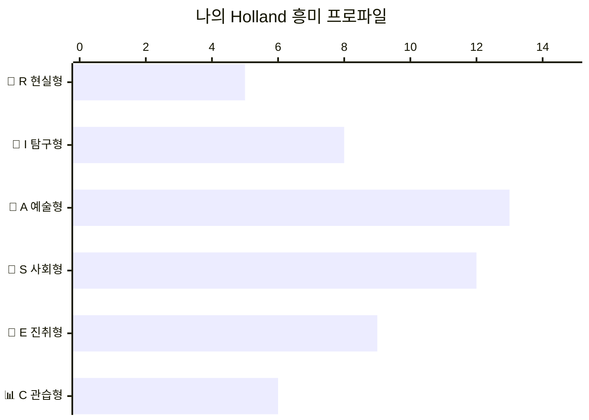

| 순위 | 유형 | 점수 | 내 모습 |
|:---:|:---:|:---:|--------|
| 🥇 1위 | 🎨 **A (예술형)** | 13/15 | 그림, 음악, 글쓰기에 자꾸 손이 가요. 수업보다 미술, 국어가 더 재미있어요! |
| 🥈 2위 | 🤝 **S (사회형)** | 12/10 | 친구들이 "너한테 말하면 편해"라고 자주 말해요. 돕는 게 자연스러워요! |
| 🥉 3위 | 🚀 **E (진취형)** | 9/10 | 반에서 행사 기획하거나 뭔가 새로 만드는 일에 내가 앞장서요! |

**나의 Holland 코드: AS형 (예술형 + 사회형)**

```
AS형의 의미:
→ 창의적인 방식으로 사람들에게 도움을 주는 일이 딱 맞아요!
→ 단순한 예술가보다는 "사람과 함께 만들어가는 창작자"에 가까워요.
→ 교육, 상담, 콘텐츠, 브랜딩, 커뮤니케이션 분야에서 빛을 발해요!
```

---

## 3️⃣ 나의 강점 역량 TOP 5

**ZONE 3 점수: 56 / 75점**

| 순위 | 강점 역량 | 점수 | 내 경험 (증거) |
|:---:|---------|:---:|--------------|
| 💎 1위 | 🗣️ **커뮤니케이션·소통** | 5/5 | 작년 학교 축제 사회를 봤는데 선생님이 "진행을 너무 자연스럽게 잘 했다"고 칭찬해 주셨어요 |
| 💎 2위 | 🎨 **시각 디자인** | 5/5 | 반 친구들이 PPT 디자인을 나한테 부탁해요. Canva, 포토샵을 독학으로 익혔어요 |
| 💎 3위 | 🤝 **관계형성** | 4/5 | 전학 첫날도 반 친구들과 바로 친해졌어요. 동아리에서도 자연스럽게 분위기 메이커가 돼요 |
| 💎 4위 | 📖 **교육·코칭** | 4/5 | 수학을 못하는 짝꿍에게 내 방식으로 가르쳐줬는데 성적이 올랐어요! |
| 💎 5위 | 🚀 **혁신·도전** | 4/5 | 반에서 독서 기록을 SNS로 올리는 프로젝트를 혼자 기획해서 실행했어요 |

> 💬 **나의 강점 한 줄 표현:**
> "말과 디자인으로 사람들의 마음을 움직이는 크리에이터!"

---

## 4️⃣ 나의 직업 가치관 TOP 3

**ZONE 4 점수: 57 / 75점**

| 순위 | 가치관 | 점수 | 이게 왜 나한테 중요한가요? |
|:---:|--------|:---:|------------------------|
| 🌟 1위 | 💡 **창의·혁신** | 5/5 | 똑같이 반복하는 일은 금방 지쳐요. 새로운 걸 시도할 수 있는 환경이 필수예요! |
| 🌟 2위 | 🌍 **사회 공헌** | 5/5 | 돈도 중요하지만, 내가 하는 일이 세상을 조금이라도 좋게 만들었으면 해요 |
| 🌟 3위 | 📈 **성장·학습** | 4/5 | 배우는 게 멈추면 답답해요. 계속 새로운 것을 익히는 직업이어야 즐거워요 |

> 💬 **가치관이 충족 안 될 때 나는 어떤가요?**
> "반복적이고 의미 없어 보이는 일을 할 때 가장 힘들어요. 내 일이 누군가에게 도움이 된다는 걸 느끼지 못하면 금방 의욕을 잃어요."

---

## 5️⃣ 나의 학습·업무 스타일

**ZONE 5 점수: 55 / 75점**

| 구분 | 내 스타일 | 설명 |
|------|:--------:|------|
| 학습 방식 | 👁️ **시각형 + 🙌 체험형** | 영상이나 그림으로 배운 다음 직접 해봐야 기억에 남아요 |
| 업무 리듬 | ⚡ **집중·단기형** | 기간을 정해 몰아서 완성하는 스프린트 방식이 잘 맞아요 |
| 전문성 방향 | 🗺️ **제너럴리스트 경향** | 한 분야보다 여러 분야를 연결하는 게 더 재미있어요 |
| 협업 선호 | 🤝 **팀 협업형** | 혼자보다 같이 하면 에너지가 더 올라가요 |
| 목표 지향 | 🌻 **과정 + 성과 균형** | 결과도 중요하지만 만들어가는 과정에서 더 행복해요 |

---

## 6️⃣ 나의 직업 적성 사분면 포지션

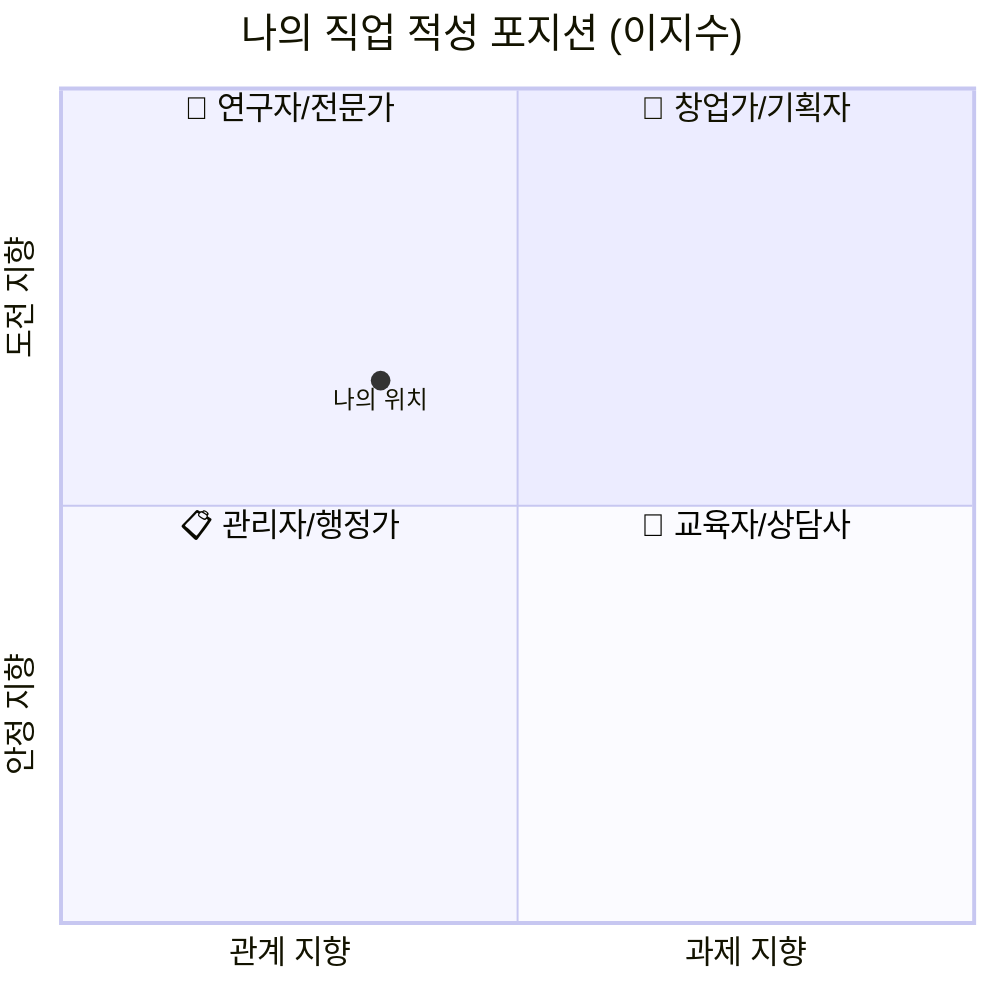

> 📍 **포지션 해석:**
> "관계 지향 + 도전 지향"의 위치에 있어요!
> → 사람들과 함께 새로운 것을 만들어가는 창의적 교육자, 소셜임팩트 기획자가 잘 맞아요.

---

## 7️⃣ 나에게 추천하는 직업군

### AS형 (예술형 + 사회형) + 커뮤니케이션 강점 + 창의·사회공헌 가치관 종합

| 분류 | 추천 직업 | 왜 나한테 맞나요? | 준비 방법 |
|:---:|---------|---------------|---------|
| 🥇 **1순위** (강추) | **콘텐츠 크리에이터·교육 유튜버** | 사람 좋아하고, 디자인 잘하고, 가르치는 걸 즐겨요 | 지금 바로 채널 개설! 짧은 영상 만들기 시작 |
| 🥇 **1순위** (강추) | **에듀테크 기획자·UX 디자이너** | 교육과 디자인 두 강점을 동시에 쓸 수 있어요 | 피그마, UX 기초 강의 수강 |
| 🥈 **2순위** (적합) | **브랜드 마케터·소셜미디어 매니저** | 창의성 + 소통 능력이 핵심인 직업이에요 | SNS 운영, 카피라이팅 공부 |
| 🥈 **2순위** (적합) | **진로 상담사·코치** | 사람 돕는 것, 가르치는 것 모두 해요 | 심리학 관련 책 읽기, 청소년 멘토링 봉사 |
| 🥉 **3순위** (가능성) | **소셜임팩트 스타트업 창업가** | 사회 공헌 가치관이 강해요. 나중에 도전해볼 만해요 | 사회 문제 리서치, 해커톤 참여 |
| ⚠️ **신중히 고려** | 단순 반복 행정직, 고독한 연구직 | 사람과의 소통이 없고 창의성을 쓸 수 없어요 | — |

---

## 8️⃣ 나의 커리어 로드맵

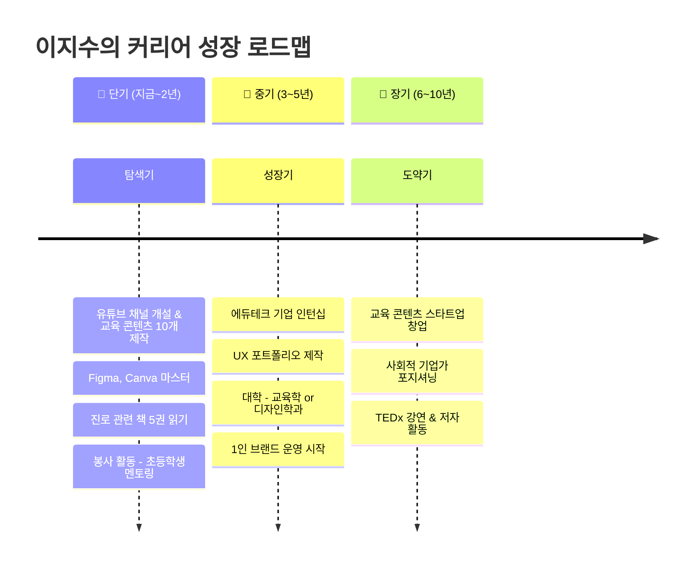

| 시기 | 목표 | 구체적 행동 계획 | 필요 역량 |
|------|------|--------------|---------|
| 단기 (지금~2년) | 창작 + 소통 역량 기초 다지기 | 유튜브/틱톡 교육 콘텐츠 만들기, Figma 수강, 멘토링 봉사 | 시각 디자인, 스토리텔링 |
| 중기 (3~5년) | 에듀테크·UX 분야 전문성 구축 | 인턴십, 포트폴리오 제작, 관련 학과 진학 | UX 기획, 데이터 리터러시 |
| 장기 (6~10년) | 나만의 브랜드와 임팩트 만들기 | 스타트업 창업, 강연, 책 출판 | 리더십, 비즈니스 모델 설계 |

---

## 9️⃣ 자기 성찰 노트

> 💬 **내가 가장 에너지를 받는 순간은?**
> "친구에게 뭔가를 설명해 줬는데 '아, 이제 이해됐어!'라고 할 때.
> 그리고 내가 만든 디자인을 보고 '이거 진짜 예쁘다'는 소리를 들을 때요!"

> 💬 **내가 가장 힘들고 지치는 순간은?**
> "혼자 답 없는 문제를 계속 풀어야 할 때, 내 아이디어가 무시당할 때,
> 그리고 아무런 피드백 없이 '그냥 해'라는 말을 들을 때요."

> 💬 **10년 후 내가 되고 싶은 모습은?**
> "10대들이 자신의 꿈을 찾도록 도와주는 교육 크리에이터.
> 유튜브도 있고, 내 브랜드도 있고, 학교에서 강연도 하고 싶어요!"

> 💬 **나를 한 마디로 표현한다면?**
> "사람들의 가능성을 디자인하는 사람 🎨"

---

## 🔟 종합 피드백 & 다음 스텝

| 구분 | 내용 |
|------|------|
| 💪 **나의 핵심 강점** | 시각적 표현력 + 따뜻한 소통 능력 + 교육적 공감 능력의 삼각편대! |
| 🌱 **내가 키워야 할 부분** | 논리적 사고와 데이터 분석 능력 (감성에 근거를 더하면 더 강해져요) |
| 🏡 **나에게 맞는 직업 환경** | 팀원들과 자유롭게 아이디어를 나누는 분위기, 창의적인 결과물이 보이는 곳 |
| ⚠️ **피하면 좋은 직업 환경** | 혼자 처리하는 단순 반복 업무, 인간적 연결이 없는 고독한 연구 환경 |
| 🚀 **당장 내일부터 할 일** | 1️⃣ 유튜브 채널 이름 짓기 → 2️⃣ Figma 무료 강의 등록 → 3️⃣ 진로 멘토 한 명 찾아 DM 보내기 |

---

## 📊 나의 전체 역량 레이더 차트

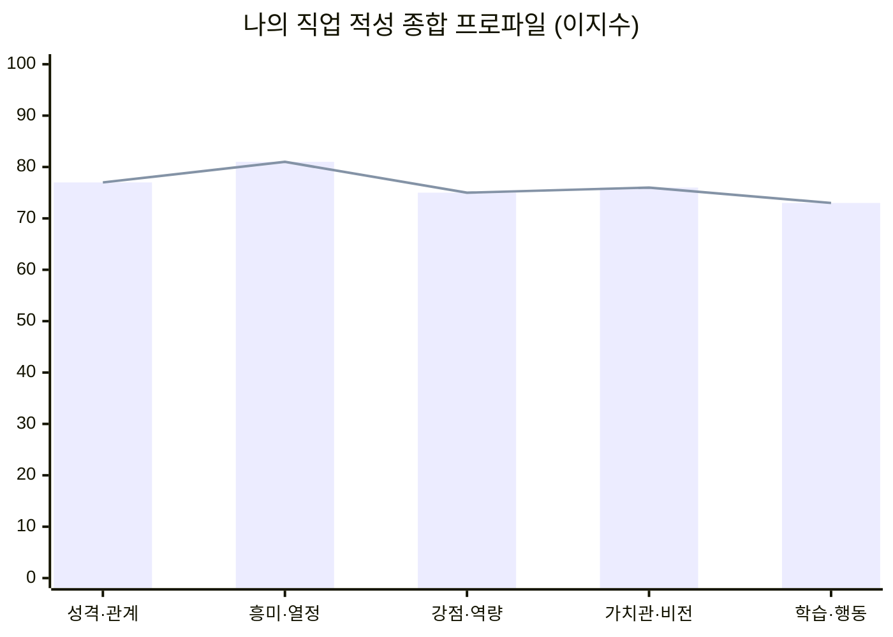

잘 추가됐습니다! 전체 구조를 정리해 드릴게요.

---

## 추가된 내용 요약

### 1. 전체 구조 마인드맵 (1개)
5개 ZONE이 어떻게 연결되는지 한눈에 보이는 **통합 마인드맵**

---

### 각 ZONE별 (5개 × 3종 = 15개 섹션)

| ZONE | 마인드맵 | 핵심 질문 & 학습 목표 표 | 직업군 연결 |
|:---:|:-------:|:--------------------:|:----------:|
| 🧠 ZONE 1 성격 | 에너지·의사결정·생활방식 구조도 | 4가지 핵심 질문 | 팀워크 vs 독립 업무 |
| ❤️ ZONE 2 흥미 | RIASEC 6유형 구조도 | 유형별 핵심 질문 | Holland 코드별 직업군 |
| 💪 ZONE 3 강점 | 6개 역량군 구조도 | 역량별 핵심 질문 | 역량 → 직무 연결 |
| 🌈 ZONE 4 가치관 | 4개 가치 축 구조도 | 가치 축별 핵심 질문 | 직업 환경·조건 매핑 |
| 📚 ZONE 5 학습 | 6개 스타일 축 구조도 | 스타일별 핵심 질문 | 업무 환경 연결 |

---

### 종합 분석 도구 (3개 추가)

1. **ZONE → 직업 적성 연결 플로우차트** — 각 ZONE 결과가 어떤 직업 요소를 결정하는지
2. **가중치 표** — 각 ZONE이 직업 탐색에 얼마나 기여하는지 (★ 등급)
3. **ZONE 조합별 직업 매핑 표** — 흥미+강점+가치관 조합 8가지 → AI 시대 직업 연결
4. **전체 발견 프로세스 흐름도** — 입력→분석→출력 3단계 시각화
---

> 💌 **마지막으로 나에게 전하는 한 마디**
>
> "이 검사 결과는 정답이 아니에요. 지금 이 순간의 나를 보여주는 거울일 뿐이에요.
> 결과가 마음에 든다면 자신감을 갖고, 마음에 안 든다면 바꿔가면 돼요.
> 중요한 건 지금 이 질문을 스스로에게 던졌다는 사실이에요.
> 그것만으로도 이미 나를 찾는 여행은 시작됐어요. 잘 하고 있어요! 💪"

---

## 🔗 다음 단계로 나아가는 추가 검사 도구

| 검사 도구 | 특징 | 소요 시간 | 비용 | 링크 |
|---------|------|:-------:|:---:|:---:|
| **커리어넷 직업흥미검사** | Holland 기반, 국가 공인, 매우 정확 | 20분 | 무료 | career.go.kr |
| **워크넷 직업가치관검사** | 가치관 심화 탐색 | 20분 | 무료 | work.go.kr |
| **MBTI (16personalities)** | 성격 유형 16가지 심화 | 15분 | 무료(온라인) | 16personalities.com |
| **강점 탐색 (VIA 강점)** | 24가지 성격 강점 발견 | 15분 | 무료 | viacharacter.org |
| **에니어그램** | 9가지 핵심 성격 깊이 탐구 | 40분 | 유/무료 | — |

---

> 📌 **활용 팁**
> - 이 검사는 **6개월 ~ 1년에 한 번씩 다시 해보세요.** 나는 계속 성장하니까요!
> - 결과를 부모님이나 선생님, 친구와 함께 이야기 나눠보면 더 재미있어요.
> - 검사 결과는 "나는 이런 사람이야"가 아니라 "지금의 나는 이런 경향이 있네!"로 받아들이세요.
> - 실제 직업 체험(봉사, 인턴, 프로젝트)과 함께할 때 가장 도움이 돼요! 🌟
